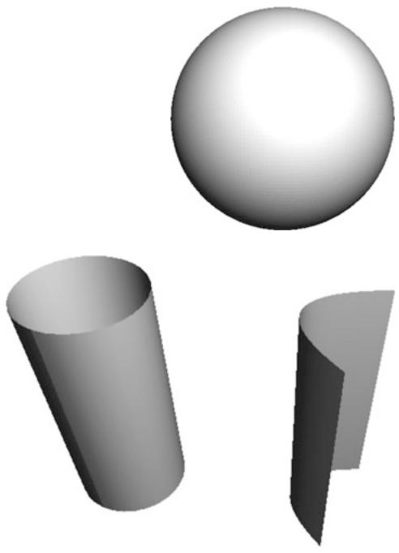
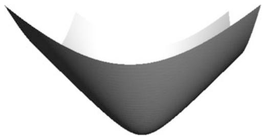
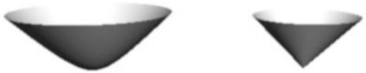
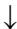

# Chapter 1 Riemannian Metrics

In this chapter we introduce the spaces and maps that pervade the subject. Without discussing any theory we present several examples of basic Riemannian manifolds and Riemannian maps. All of these examples will be at the heart of future investigations into constructions of Riemannian manifolds with various interesting properties.

The abstract definition of a Riemannian manifold used today dates back only to the 1930s as it wasn’t really until Whitney’s work in 1936 that mathematicians obtained a clear understanding of what abstract manifolds were other than just being submanifolds of Euclidean space. Riemann himself defined Riemannian metrics only on domains in Euclidean space. Riemannian manifolds where then metric objects that locally looked like a Riemannian metric on a domain in Euclidean space. It is, however, important to realize that this local approach to a global theory of Riemannian manifolds is as honest as the modern top-down approach.

Prior to Riemann, other famous mathematicians such as Euler, Monge, and Gauss only worked with 2-dimensional curved geometry. Riemann’s invention of multidimensional geometry is quite curious. The story goes that Gauss was on Riemann’s defense committee for his Habilitation (doctorate). In those days, the candidate was asked to submit three topics in advance, with the implicit understanding that the committee would ask to hear about the first topic (the actual thesis was on Fourier series and the Riemann integral). Riemann’s third topic was “On the Hypotheses which lie at the Foundations of Geometry.” Evidently, he was hoping that the committee would select from the first two topics, which were on material he had already developed. Gauss, however, always being in an inquisitive mood, decided he wanted to hear whether Riemann had anything to say about the subject on which he, Gauss, was the reigning expert. Thus, much to Riemann’s dismay, he had to go home and invent Riemannian geometry to satisfy Gauss’s curiosity. No doubt Gauss was suitably impressed, apparently a very rare occurrence for him.

From Riemann’s work it appears that he worked with changing metrics mostly by multiplying them by a function (conformal change). By conformally changing the standard Euclidean metric he was able to construct all three constant curvature geometries in one fell swoop for the first time ever. Soon after Riemann’s discoveries it was realized that in polar coordinates one can change the metric in a different way, now referred to as a warped product. This also exhibits all constant curvature geometries in a unified way. Of course, Gauss already knew about polar coordinate representations on surfaces, and rotationally symmetric metrics were studied even earlier by Clairaut. But those examples are much simpler than the higherdimensional analogues. Throughout this book we emphasize the importance of these special warped products and polar coordinates. It is not far to go from warped products to doubly warped products, which will also be defined in this chapter, but they don’t seem to have attracted much attention until Schwarzschild discovered a vacuum space-time that wasn’t flat. Since then, doubly warped products have been at the heart of many examples and counterexamples in Riemannian geometry.

Another important way of finding examples of Riemannian metrics is by using left-invariant metrics on Lie groups. This leads us, among other things, to the Hopf fibration and Berger spheres. Both of these are of fundamental importance and are also at the core of a large number of examples in Riemannian geometry. These will also be defined here and studied further throughout the book.

# 1.1 Riemannian Manifolds and Maps

A Riemannian manifold $( M , g )$ consists of a $C ^ { \infty }$ -manifold M (Hausdorff and second countable) and a Euclidean inner product $g _ { p } \thinspace 0 \Gamma g \vert _ { p }$ on each of the tangent spaces $T _ { p } M$ of $M .$ . In addition we assume that $p \mapsto g _ { p }$ jvaries smoothly. This means that for any 7!two smooth vector fields X; Y the inner product $g _ { p } \left( X | _ { p } , Y | _ { p } \right)$ is a smooth function of $p .$ : The subscript $p$ j jwill usually be suppressed when it is not needed. Thus we might write $g \left( X , Y \right)$ with the understanding that this is to be evaluated at each $p$ where X and $Y$ are defined. When we wish to associate the metric with M we also denote it as $g _ { M }$ : The tensor $g$ is referred to as the Riemannian metric or simply the metric. Generally speaking the manifold is assumed to be connected. Exceptions do occur, especially when studying level sets or submanifolds defined by constraints.

All inner product spaces of the same dimension are isometric; therefore, all tangent spaces $T _ { p } M$ on a Riemannian manifold $( M , g )$ are isometric to the $n -$ dimensional Euclidean space $\mathbb { R } ^ { n }$ with its canonical inner product. Hence, all Riemannian manifolds have the same infinitesimal structure not only as manifolds but also as Riemannian manifolds.

Example 1.1.1. The simplest and most fundamental Riemannian manifold is Euclidean space $( \mathbb { R } ^ { n } , g _ { \mathbb { R } ^ { n } } )$ . The canonical Riemannian structure $g _ { \mathbb { R } ^ { n } }$ is defined by the tangent bundle identification $\mathbb { R } ^ { n } \times \mathbb { R } ^ { n } \simeq T \mathbb { R } ^ { n }$ given by the map:

$$
(p, v) \mapsto \frac {d (p + t v)}{d t} (0).
$$

With this in mind the standard inner product on $\mathbb { R } ^ { n }$ is defined by

$$
g _ {\mathbb {R} ^ {n}} ((p, v), (p, w)) = v \cdot w.
$$

A Riemannian isometry between Riemannian manifolds $( M , g _ { M } )$ and $( N , g _ { N } )$ is a diffeomorphism $F : M \to N$ such that $F ^ { * } g _ { N } = g _ { M } , { \mathrm { i . e . } }$ ,

$$
g _ {N} (D F (v), D F (w)) = g _ {M} (v, w)
$$

for all tangent vectors $v , w \in T _ { p } M$ and all $p \in M$ . In this case $F ^ { - 1 }$ is also a Riemannian isometry.

Example 1.1.2. Any finite-dimensional vector space V with an inner product, becomes a Riemannian manifold by declaring, as with Euclidean space, that

$$
g \left((p, v), (p, w)\right) = v \cdot w.
$$

If we have two such Riemannian manifolds $( V , g _ { V } )$ and $( W , g _ { W } )$ of the same dimension, then they are isometric. A example of a Riemannian isometry $F : V $ W is simply any linear isometry between the two spaces. Thus $( \mathbb { R } ^ { n } , g _ { \mathbb { R } ^ { n } } )$ W !is not only the only n-dimensional inner product space, but also the only Riemannian manifold of this simple type.

Suppose that we have an immersion (or embedding) $F : M \to N .$ , where $( N , g _ { N } )$ W !is a Riemannian manifold. This leads to a pull-back Riemannian metric $g _ { M } = F ^ { * } g _ { N }$ on M, where

$$
g _ {M} (v, w) = g _ {N} \left(D F (v), D F (w)\right).
$$

It is an inner product as $D F ( v ) = 0$ only when $v = 0$

D DA Riemannian immersion (or Riemannian embedding) is an immersion (or embedding) ${ \cal F } : { \cal M }  { \cal N }$ such that $g _ { M } \ = \ F ^ { * } g _ { N }$ . Riemannian immersions are W ! Dalso called isometric immersions , but as we shall see below they are almost never distance preserving.

Example 1.1.3. Another very important example is the Euclidean sphere of radius R defined by

$$
S ^ {n} (R) = \left\{x \in \mathbb {R} ^ {n + 1} \mid | x | = R \right\}.
$$

The metric induced from the embedding $S ^ { n } ( R ) \hookrightarrow \mathbb { R } ^ { n + 1 }$ is the canonical metric on $S ^ { n } ( R )$ . The unit sphere, or standard sphere, is $S ^ { n } = S ^ { n } ( 1 ) \subset \mathbb { R } ^ { n + 1 }$ with the induced Dmetric. In figure 1.1 is a picture of a round sphere in $\mathbb { R } ^ { 3 }$ .

Fig. 1.1 Sphere   
Fig. 1.2 Isometric Immersions   

natural_image

3D geometric shapes including a sphere, a cone, and a curved surface (no text or symbols)

If $k < n$ there are several linear isometric immersions $\left( \mathbb { R } ^ { k } , g _ { \mathbb { R } ^ { k } } \right) \to \left( \mathbb { R } ^ { n } , g _ { \mathbb { R } ^ { n } } \right)$ . !Those are, however, not the only isometric immersions. In fact, any unit speed curve $c : \mathbb { R } \to \mathbb { R } ^ { 2 } , \mathrm { i . e . , } | \dot { c } ( t ) | = 1$ for all $t \in \mathbb { R }$ , is an example of an isometric immersion. W ! jP j DFor example, one could consider

$$
t \mapsto (\cos t, \sin t)
$$

as an isometric immersion and

$$
t \mapsto \left(\log \left(t + \sqrt {1 + t ^ {2}}\right), \sqrt {1 + t ^ {2}}\right)
$$

as an isometric embedding. A map of the form:

$$
\begin{array}{l} F: \mathbb {R} ^ {k} \to \mathbb {R} ^ {k + 1} \\ F (x ^ {1}, \ldots , x ^ {k}) = (c (x ^ {1}), x ^ {2}, \ldots , x ^ {k}), \\ \end{array}
$$

(where c fills up the first two coordinate entries) will then also yield an isometric immersion (or embedding) that is not linear. This initially seems contrary to intuition but serves to illustrate the difference between a Riemannian immersion and a distance preserving map. In figure 1.2 there are two pictures, one of the cylinder, the other of the isometric embedding of $\mathbb { R } ^ { 2 }$ into $\mathbb { R } ^ { 3 }$ just described.

There is also a dual concept of a Riemannian submersion $F : \left( M , g _ { M } \right) \to \left( N , g _ { N } \right)$ . This is a submersion $F : M \to N$ such that for each $p \in M , D F : \ker ( D F ) ^ { \perp } \to$ $T _ { F ( p ) } N$ W !is a linear isometry. In other words, if v; $w \in T _ { p } M$ W !are perpendicular to the kernel of $D F : T _ { p } M \to T _ { F ( p ) } N$ ; then

$$
g _ {M} (v, w) = g _ {N} \left(D F (v), D F (w)\right).
$$

This is equivalent to the adjoint $( D F _ { p } ) ^ { * } : T _ { F ( p ) } N  T _ { p } M$ preserving inner products of vectors.

Example 1.1.4. Orthogonal projections $( \mathbb { R } ^ { n } , g _ { \mathbb { R } ^ { n } } ) \to \left( \mathbb { R } ^ { k } , g _ { \mathbb { R } ^ { k } } \right)$ , where $k < n$ , are examples of Riemannian submersions.

Example 1.1.5. A much less trivial example is the Hopf fibration $S ^ { 3 } ( 1 )  S ^ { 2 } ( 1 / 2 )$ . As observed by F. Wilhelm this map can be written explicitly as

$$
H (z, w) = \left(\frac {1}{2} \left(| w | ^ {2} - | z | ^ {2}\right), z \bar {w}\right)
$$

if we think of $S ^ { 3 } ( 1 ) \subset \mathbb { C } ^ { 2 }$ and $S ^ { 2 } ( { 1 / 2 } ) \subset \mathbb { R } \oplus \mathbb { C }$ . Note that the fiber containing $( z , w )$ consists of the points $\left( e ^ { \mathrm { i } \theta } z , e ^ { \mathrm { i } \theta } w \right)$ , where $\mathrm { i } = \sqrt { - 1 }$ . Consequently, $\mathrm { i } \left( z , w \right)$ is tangent to the fiber and $\lambda \left( - \bar { w } , \bar { z } \right) , \lambda \in \mathbb { C }$ D , are the tangent vectors orthogonal to the fiber.  N N 2We can check what happens to the latter tangent vectors by computing DH. Since H extends to a map $H : \mathbb { C } ^ { 2 } \to \mathbb { R } \oplus \mathbb { C }$ its differential can be calculated as one would W ! ˚do it in multivariable calculus. Alternately note that the tangent vectors $\lambda \left( - \bar { w } , \bar { z } \right)$ at $( z , w ) \in S ^ { 3 } ( 1 )$ lie in the plane $( z , w ) + \lambda ( - \bar { w } , \bar { z } )$  N Nparameterized by . H restricted to 2this plane is given by

$$
H \left((z - \lambda \bar {w}, w + \lambda \bar {z})\right) = \left(\frac {1}{2} \left(| w + \lambda \bar {z} | ^ {2} - | z - \lambda \bar {w} | ^ {2}\right), (z - \lambda \bar {w}) \overline {{(w + \lambda \bar {z})}}\right).
$$

To calculate DH we simply expand H in terms of  and $\bar { \lambda }$ and isolate the first-order terms

$$
D H | _ {(z, w)} (\lambda (- \bar {w}, \bar {z})) = (2 \operatorname{Re} (\bar {\lambda} z w), - \lambda \bar {w} ^ {2} + \bar {\lambda} z ^ {2}).
$$

Since these have the same length $| \lambda |$ as $\lambda \left( - \bar { w } , \bar { z } \right)$ we have shown that the map is a j j  N NRiemannian submersion. Below we will examine this example more closely. There is a quaternion generalization of this map in exercise 1.6.22.

Finally, we mention a very important generalization of Riemannian manifolds. A semi- or pseudo-Riemannian manifold consists of a manifold and a smoothly varying symmetric bilinear form g on each tangent space. We assume in addition that g is nondegenerate, i.e., for each nonzero $v \in T _ { p } M$ there exists $w \in T _ { p } M$ such that $g \left( v , w \right) \neq 0$ 2 2: This is clearly a generalization of a Riemannian metric where ¤nondegeneracy follows from $g \left( v , v \right) > 0$ when $v \neq 0$ . Each tangent space admits a splitting $T _ { p } M = P \oplus N$ such that g is positive definite on P and negative definite on D ˚N: These subspaces are not unique but it is easy to show that their dimensions are well-defined. Continuity of $g$ shows that nearby tangent spaces must have a similar splitting where the subspaces have the same dimension. The index of a connected pseudo-Riemannian manifold is defined as the dimension of the subspace N on which g is negative definite.

Fig. 1.3 Hyperbolic Space   

natural_image

Abstract 3D surface plot with smooth curved surfaces and gradient shading (no text or symbols)

Example 1.1.6. Let $n = n _ { 1 } + n _ { 2 }$ and $\mathbb { R } ^ { n _ { 1 } , n _ { 2 } } = \mathbb { R } ^ { n _ { 1 } } \times \mathbb { R } ^ { n _ { 2 } }$ . We can then write vectors in $\mathbb { R } ^ { n _ { 1 } , n _ { 2 } }$ as $v = v _ { 1 } + v _ { 2 }$ D C; where $v _ { 1 } \in \mathbb { R } ^ { n _ { 1 } }$ and $v _ { 2 } \in \mathbb { R } ^ { n _ { 2 } }$ : A natural pseudo-Riemannian Dmetric of index $n _ { 2 }$ is defined by

$$
g \left((p, v), (p, w)\right) = v _ {1} \cdot w _ {1} - v _ {2} \cdot w _ {2}.
$$

When $n _ { 1 } ~ = ~ 1 ~ \mathrm { o r } ~ n _ { 2 } ~ = ~ 1$ this coincides with one or the other version of D DMinkowski space. This space describes the geometry of Einstein’s space-time in special relativity.

Example 1.1.7. We define the family of hyperbolic spaces $H ^ { n } \left( R \right) \subset \mathbb { R } ^ { n , 1 }$ using the rotationally symmetric hyperboloids

$$
\left(x ^ {1}\right) ^ {2} + \dots + \left(x ^ {n}\right) ^ {2} - \left(x ^ {n + 1}\right) ^ {2} = - R ^ {2}.
$$

Each of these level sets consists of two components that are each properly embedded copies of $\mathbb { R } ^ { n } \operatorname { i n } \mathbb { R } ^ { n + 1 }$ . The branch with $x ^ { n + 1 } > 0$ is $H ^ { n } \left( R \right)$ (see figure 1.3). The metric is the induced Minkowski metric from $\mathbb { R } ^ { n , 1 }$ . The fact that this defines a Riemannian metric on $H ^ { n } \left( R \right)$ is perhaps not immediately obvious. Note first that tangent vectors $v = \left( v ^ { 1 } , \cdots , v ^ { n } , v ^ { n + 1 } \right) \in T _ { p } H ^ { n } \left( R \right) , p \in H ^ { n } \left( R \right)$ , satisfy the equation

$$
v ^ {1} p ^ {1} + \dots + v ^ {n} p ^ {n} - v ^ {n + 1} p ^ {n + 1} = 0
$$

as they are tangent to the level sets for $\left( x ^ { 1 } \right) ^ { 2 } + \cdots + \left( x ^ { n } \right) ^ { 2 } - \left( x ^ { n + 1 } \right) ^ { 2 }$ . This shows that

$$
\begin{array}{l} | v | ^ {2} = \left(v ^ {1}\right) ^ {2} + \dots + (v ^ {n}) ^ {2} - \left(v ^ {n + 1}\right) ^ {2} \\ = \left(v ^ {1}\right) ^ {2} + \dots + (v ^ {n}) ^ {2} - \left(\frac {v ^ {1} p ^ {1} + \cdots + v ^ {n} p ^ {n}}{p ^ {n + 1}}\right) ^ {2}. \\ \end{array}
$$

# 1.2 The Volume Form

Using Cauchy-Schwarz on the expression in the numerator together with

$$
\frac {\left(p ^ {1}\right) ^ {2} + \cdots + \left(p ^ {n}\right) ^ {2}}{\left(p ^ {n + 1}\right) ^ {2}} = 1 - \left(\frac {R}{p ^ {n + 1}}\right) ^ {2}
$$

shows that

$$
| v | ^ {2} \geq \left(\frac {R}{p ^ {n + 1}}\right) ^ {2} \left(\left(v ^ {1}\right) ^ {2} + \dots + (v ^ {n}) ^ {2}\right).
$$

When R  1 we generally just write $H ^ { n }$ and refer to this as hyperbolic n-space.

Much of the tensor analysis that we shall develop on Riemannian manifolds can be carried over to pseudo-Riemannian manifolds without further ado. It is only when we start using norm and distances that we have to be more careful.

# 1.2 The Volume Form

In Euclidean space the inner product not only allows us to calculate norms and angles but also areas, volumes, and more. The key to understanding these definitions better lies in using determinants.

To compute the volume of the parallelepiped spanned by n vectors $v _ { 1 } , \ldots , v _ { n } \in$ $\mathbb { R } ^ { n }$ 2we can proceed in different ways. There is the usual inductive way where we multiply the height by the volume (or area) of the base parallelepiped. This is in fact a Laplace expansion of a determinant along a column. If the canonical basis is denoted $e _ { 1 } , \ldots , e _ { n }$ , then we define the signed volume by

$$
\begin{array}{l} \operatorname{vol} \left(v _ {1}, \dots , v _ {n}\right) = \det \left[ g \left(v _ {i}, e _ {j}\right) \right] \\ = \det \left(\left[ v _ {1}, \dots , v _ {n} \right] \left[ e _ {1}, \dots , e _ {n} \right] ^ {t}\right) \\ = \det \left[ v _ {1}, \dots , v _ {n} \right]. \\ \end{array}
$$

This formula is clearly also valid if we had selected any other positively oriented orthonormal basis $f _ { 1 } , \ldots f _ { n }$ as

$$
\begin{array}{l} \det \left[ g \left(v _ {i}, f _ {j}\right) \right] = \det \left(\left[ v _ {1}, \dots , v _ {n} \right] \left[ f _ {1}, \dots , f _ {n} \right] ^ {t}\right) \\ = \det \left(\left[ v _ {1}, \dots , v _ {n} \right] \left[ f _ {1}, \dots , f _ {n} \right] ^ {t}\right) \det \left(\left[ f _ {1}, \dots , f _ {n} \right] \left[ e _ {1}, \dots , e _ {n} \right] ^ {t}\right) \\ = \det \left(\left[ v _ {1}, \dots , v _ {n} \right] \left[ e _ {1}, \dots , e _ {n} \right] ^ {t}\right). \\ \end{array}
$$

In an oriented Riemannian n-manifold .M; g/ we can then define the volume form as an n-form on M by

$$
\operatorname{vol} _ {g} \left(v _ {1}, \dots , v _ {n}\right) = \operatorname{vol} \left(v _ {1}, \dots , v _ {n}\right) = \det \left[ g \left(v _ {i}, e _ {j}\right) \right],
$$

where $e _ { 1 } , \ldots , e _ { n }$ is any positively oriented orthonormal basis. One often also uses the notation d vol instead of vol, however, the volume form is not necessarily exact so the notation can be a little misleading.

Even though manifolds are not necessarily oriented or even orientable it is still possible to define this volume form locally. The easiest way of doing so is to locally select an orthonormal frame $E _ { 1 } , \ldots , E _ { n }$ and declare it to be positive. A frame is a collection of vector fields defined on a common domain $U \subset M$ such that they form a basis for the tangent spaces $T _ { p } M$ for all $p \in U$ . The volume form is then defined on vectors and vector fields by

$$
\operatorname{vol} \left(X _ {1}, \dots , X _ {n}\right) = \det \left[ g \left(X _ {i}, E _ {j}\right) \right].
$$

This formula quickly establishes the simplest version of the “height base” principle if we replace $E _ { i }$ by a general vector X since

$$
\operatorname{vol} \left(E _ {1}, \dots , X, \dots , E _ {n}\right) = g \left(X, E _ {i}\right)
$$

is the projection of X onto $E _ { i }$ and this describes the height in the ith coordinate direction.

On oriented manifolds it is possible to integrate n-forms. On oriented Riemannian manifolds we can then integrate functions f by integrating the form $f$ vol. In fact any manifold contains an open dense set $O \subset M$ where $T O = O \times \mathbb { R } ^ { n }$ is trivial. In particular, $o$  D -is orientable and we can choose an orthonormal frame on all of $O .$ . This shows that we can integrate functions over M by integrating them over $O .$ . Thus we can integrate on all Riemannian manifolds.

# 1.3 Groups and Riemannian Manifolds

We shall study groups of Riemannian isometries on Riemannian manifolds and see how they can be used to construct new Riemannian manifolds.

# 1.3.1 Isometry Groups

For a Riemannian manifold $( M , g )$ we use Iso $( M , g )$ or Iso.M/ to denote the group of Riemannian isometries ${ \cal F } : ( { \cal M } , g ) \ :  \ : ( { \cal M } , g )$ and $\mathrm { I s o } _ { p } ( M , g )$ the isotropy or stabilizer (sub)group at $p _ { i }$ W; i.e., those $F \in { \mathrm { I s o } } ( M , g )$ with $F ( p ) = p$ . A Riemannian 2 Dmanifold is said to be homogeneous if its isometry group acts transitively, i.e., for each pair of points $p , q \in M$ there is an $F \in \operatorname { I s o } \left( M , g \right)$ such that $F \left( p \right) = q$ .

Example 1.3.1. The isometry group of Euclidean space is given by

$$
\begin{array}{l} \operatorname{Iso} \left(\mathbb {R} ^ {n}, g _ {\mathbb {R} ^ {n}}\right) = \mathbb {R} ^ {n} \rtimes \mathrm{O} (n) \\ = \left\{F: \mathbb {R} ^ {n} \rightarrow \mathbb {R} ^ {n} \mid F (x) = v + O x, v \in \mathbb {R} ^ {n} \text {   and   } O \in \mathrm{O} (n) \right\}. \\ \end{array}
$$

(Here $\mathrm { ~ H ~ } \rtimes \mathrm { ~ G ~ }$ is the semi direct product, with G acting on H.) The translational part v and rotational part O are uniquely determined. It is clear that these maps are isometries. To see the converse first observe that $G ( x ) ~ = ~ F ( x ) - F ( 0 )$ is also a Riemannian isometry. Using this, we observe that at $x = 0$ the differential $D G _ { 0 } \in \mathrm { O } \left( n \right)$ : Thus, G and $D G _ { 0 }$ Dare Riemannian isometries on Euclidean space that 2both preserve the origin and have the same differential there. It is then a general uniqueness result for Riemannian isometries that $G = D G _ { 0 }$ (see proposition 5.6.2). DIn exercise 2.5.12 there is a more elementary version for Euclidean space.

The isotropy $\mathrm { I s o } _ { p }$ is always isomorphic to O.n/ and $\mathbb { R } ^ { n } \simeq \mathrm { I s o } / \mathrm { I s o } _ { p }$ for any $p ~ \in ~ \mathbb { R } ^ { n }$ '. In fact any homogenous space can always be written as the quotient $M = \mathrm { I s o } / \mathrm { I s o } _ { p }$ .

Example 1.3.2. We claim that spheres have

$$
\operatorname{Iso} \left(S ^ {n} (R), g _ {S ^ {n} (R)}\right) = \operatorname{O} (n + 1) = \operatorname{Iso} _ {0} \left(\mathbb {R} ^ {n + 1}, g _ {\mathbb {R} ^ {n + 1}}\right).
$$

Clearly ${ \mathrm { O } } ( n + 1 ) \subset { \mathrm { I s o } } \left( S ^ { n } ( R ) , g _ { S ^ { n } ( R ) } \right)$ . Conversely, when $F \in \operatorname { I s o } \left( S ^ { n } ( R ) , g _ { S ^ { n } ( R ) } \right)$ , C consider the linear map given by the $n + 1$ columns vectors:

$$
O = \left[ \frac {1}{R} F (R e _ {1}) D F | _ {e _ {1}} (e _ {2}) \dots D F | _ {e _ {1}} (e _ {n + 1}) \right]
$$

The first vector is unit since $F \left( R e _ { 1 } \right) \ \in \ S ^ { n } \left( R \right)$ . Moreover, the first column is orthogonal to the others as $D F | _ { R e _ { 1 } } \left( e _ { i } \right) \in T _ { F \left( R e _ { 1 } \right) } S ^ { n } \left( R \right) = F \left( R e _ { 1 } \right) ^ { \bot } , i = 2 , \ldots , n + 1$ . j 2 D D CFinally, the last n columns form an orthonormal basis since DF is assumed to be a linear isometry. This shows that $O \in \mathrm { O } \left( n + 1 \right)$ and that O agrees with $F$ and $D F$ at $R e _ { 1 }$ 2 C. Proposition 5.6.2 can then be invoked again to show that $F = O$ .

The isotropy groups are again isomorphic to ${ \mathrm { O } } ( n )$ D, that is, those elements of ${ \mathrm { O } } ( n + 1 )$ fixing a 1-dimensional linear subspace of $\mathbb { R } ^ { n + 1 }$ . In particular, we have $S ^ { n } \simeq \mathrm { O } \left( n + 1 \right) / \mathrm { O } \left( n \right)$ .

Example 1.3.3. Recall our definition of the hyperbolic spaces from example 1.1.7. The isometry group Iso $\left( H ^ { n } ( R ) \right)$ comes from the linear isometries of $\mathbb { R } ^ { n , 1 }$

$$
\mathrm{O} (n, 1) = \left\{L: \mathbb {R} ^ {n, 1} \rightarrow \mathbb {R} ^ {n, 1} \mid g (L v, L v) = g (v, v) \right\}.
$$

One can, as in the case of the sphere, see that these are isometries on $H ^ { n } ( R )$ as long as they preserve the condition $x ^ { n + 1 } > 0$ : The group of those isometries is denoted ${ \mathrm { O } } ^ { + } \left( n , 1 \right)$ : As in the case of Euclidean space and the spheres we can construct an element in ${ \mathrm { O } } ^ { + } \left( n , 1 \right)$ that agrees with any isometry at $R e _ { n + 1 }$ and such that their differentials at that point agree on the basis $e _ { 1 } , \ldots , e _ { n }$ for $T _ { R e _ { n + 1 } } H ^ { n } \left( R \right)$ . Specifically, if $F \in \operatorname { I s o } ( H ^ { n } ( R ) )$ we can use:

$$
O = \left[ D F | _ {e _ {n + 1}} (e _ {1}) D F | _ {e _ {n + 1}} (e _ {2}) \dots D F | _ {e _ {n + 1}} (e _ {n}) \frac {1}{R} F (R e _ {n + 1}) \right].
$$

The isotropy group that preserves $R e _ { n + 1 }$ can be identified with ${ \mathrm { O } } ( n )$ (isometries Cwe get from the metric being rotationally symmetric). One can also easily check that ${ \mathrm { O } } ^ { + } ( n , 1 )$ acts transitively on $H ^ { n } ( R )$ .

# 1.3.2 Lie Groups

If instead we start with a Lie group G, then it is possible to make it a group of isometries in several ways. The tangent space can be trivialized

$$
T \mathrm{G} \simeq \mathrm{G} \times T _ {e} \mathrm{G}
$$

by using left- (or right-) translations on G. Therefore, any inner product on $T _ { e } \mathrm { { G } }$ induces a left-invariant Riemannian metric on G i.e., left-translations are Riemannian isometries. It is obviously also true that any Riemannian metric on G where all left-translations are Riemannian isometries is of this form. In contrast to $\mathbb { R } ^ { n }$ ; not all of these Riemannian metrics need be isometric to each other. Thus a Lie group might not come with a canonical metric.

It can be shown that the left coset space $\mathbf { G } / \mathrm { H } = \left\{ g \mathrm { H } \ | \ g \in \mathrm { G } \right\}$ is a manifold provided $\mathrm { ~ H ~ } \subset \mathrm { ~ G ~ }$ D f j 2 g is a compact subgroup. If we endow G with a general Riemannian metric such that right-translations by elements in H act by isometries, then there is a unique Riemannian metric on $\mathrm { G / H }$ making the projection $\mathrm { ~ G ~ }  \ \mathrm { G / H }$ into !a Riemannian submersion (see also section 4.5.2). When in addition the metric is also left-invariant, then G acts by isometries on $\mathrm { G / H }$ (on the left) thus making G=H into a homogeneous space. Proofs of all this are given in theorem 5.6.21 and remark 5.6.22.

The next two examples will be studied further in sections 1.4.6, 4.4.3, and 4.5.3. In sections 4.5.2 the general set-up is discussed and the fact that quotients are Riemannian manifolds is also discussed in section 5.6.4 and theorem 5.6.21.

Example 1.3.4. The idea of taking the quotient of a Lie group by a subgroup can be generalized. Consider $S ^ { 2 n + 1 } ( 1 ) \subset \mathbb { C } ^ { n + 1 }$ . Then $S ^ { 1 } = \{ \lambda \in \mathbb { C } \mid | \lambda | = 1 \}$ acts by complex scalar multiplication on both $S ^ { 2 n + 1 }$ and $\mathbb { C } ^ { n + 1 }$ f 2 j j j D g; furthermore, this action is by isometries. We know that the quotient $S ^ { 2 n + 1 } / S ^ { 1 } = \mathbb { C P } ^ { n }$ , and since the action of $S ^ { 1 }$ is by isometries, we obtain a metric on $\mathbb { C P } ^ { n }$ Dsuch that $S ^ { 2 n + 1 } \to \mathbb { C P } ^ { n }$ is a !Riemannian submersion. This metric is called the Fubini-Study metric. When $n =$ 1; this becomes the Hopf fibration $S ^ { 3 } ( 1 )  \mathbb { C P } ^ { 1 } = S ^ { 2 } ( 1 / 2 )$ .

Example 1.3.5. One of the most important nontrivial Lie groups is SU .2/ ; which is defined as

# 1.3 Groups and Riemannian Manifolds

$$
\begin{array}{l} \mathrm{SU} (2) = \left\{A \in M _ {2 \times 2} (\mathbb {C}) \mid \det A = 1, A ^ {*} = A ^ {- 1} \right\} \\ = \left\{\left[ \begin{array}{c c} z & w \\ - \bar {w} & \bar {z} \end{array} \right] | | z | ^ {2} + | w | ^ {2} = 1 \right\} \\ = S ^ {3} (1). \\ \end{array}
$$

The Lie algebra .2/ of SU .2/ is

$$
\mathfrak {s u} (2) = \left\{\left[ \begin{array}{c c} \mathrm{i}   \alpha & \beta + \mathrm{i}   c \\ - \beta + \mathrm{i}   c & - \mathrm{i}   \alpha \end{array} \right]   |   \alpha , \beta , c \in \mathbb {R} \right\}
$$

and can be spanned by

$$
X _ {1} = \left[ \begin{array}{c c} \mathrm{i} & 0 \\ 0 & - \mathrm{i} \end{array} \right], X _ {2} = \left[ \begin{array}{c c} 0 & 1 \\ - 1 & 0 \end{array} \right], X _ {3} = \left[ \begin{array}{c c} 0 & \mathrm{i} \\ \mathrm{i} & 0 \end{array} \right].
$$

We can think of these matrices as left-invariant vector fields on SU .2/. If we declare them to be orthonormal, then we get a left-invariant metric on SU .2/, which as we shall later see is $S ^ { 3 } \left( 1 \right)$ . If instead we declare the vectors to be orthogonal, $X _ { 1 }$ to have length "; and the other two to be unit vectors, we get a very important 1-parameter family of metrics $g _ { \varepsilon }$ on ${ \bf S U } \left( 2 \right) = { \bf \nabla } S ^ { 3 }$ : These distorted spheres are called Berger Dspheres. Note that scalar multiplication on $S ^ { 3 } \subset \mathbb { C } ^ { 2 }$ corresponds to multiplication on the left by the matrices

$$
\left[ \begin{array}{c c} e ^ {\mathrm{i} \theta} & 0 \\ 0 & e ^ {- \mathrm{i} \theta} \end{array} \right]
$$

since

$$
\left[ \begin{array}{c c} e ^ {\mathrm{i} \theta} & 0 \\ 0 & e ^ {- \mathrm{i} \theta} \end{array} \right] \left[ \begin{array}{c c} z & w \\ - \bar {w} & \bar {z} \end{array} \right] = \left[ \begin{array}{c c} e ^ {\mathrm{i} \theta} z & e ^ {\mathrm{i} \theta} w \\ - e ^ {- \mathrm{i} \theta} \bar {w} & e ^ {- \mathrm{i} \theta} \bar {z} \end{array} \right].
$$

Thus $X _ { 1 }$ is tangent to the orbits of the Hopf circle action. The Berger spheres are then obtained from the canonical metric by multiplying the metric along the Hopf fiber by $\varepsilon ^ { 2 }$ :

# 1.3.3 Covering Maps

Discrete groups are also common in geometry, often through deck transformations or covering transformations. Suppose that $F : M \to N$ is a covering map. Then W !F is, in particular, both an immersion and a submersion. Thus, any Riemannian metric on N induces a Riemannian metric on M. This makes F into an isometric immersion, also called a Riemannian covering. Since dimM dimN; F must in fact be a local isometry, i.e., for every $p \in M$ Dthere is a neighborhood $U \ni p$ in M such that $F | _ { U } : U \to F ( U )$ 2 3is a Riemannian isometry. Notice that the pullback j W !metric on M has considerable symmetry. For if $q \in V \subset N$ is evenly covered by $\{ U _ { p } \} _ { p \in F ^ { - 1 } ( q ) }$ ; then all the sets V and $U _ { p }$ 2 are isometric to each other. In fact, if F is a f g 2normal covering, i.e., there is a group  of deck transformations acting on M such that:

$$
F ^ {- 1} (p) = \left\{g (q) \mid F (q) = p \text { and } g \in \Gamma \right\},
$$

then  acts by isometries on the pullback metric. This construction can easily be reversed. Namely, if $N = M / \Gamma$ and M is a Riemannian manifold, where  acts by Disometries, then there is a unique Riemannian metric on N such that the quotient map is a local isometry.

Example 1.3.6. If we fix a basis $v _ { 1 } , v _ { 2 }$ for $\mathbb { R } ^ { 2 }$ ; then $\mathbb { Z } ^ { 2 }$ acts by isometries through the translations

$$
(n, m) \mapsto (x \mapsto x + n v _ {1} + m v _ {2}).
$$

The orbit of the origin looks like a lattice. The quotient is a torus $T ^ { 2 }$ with some metric on it. Note that $T ^ { 2 }$ is itself an Abelian Lie group and that these metrics are invariant with respect to the Lie group multiplication. These metrics will depend on $| v _ { 1 } | , | v _ { 2 } |$ and $\angle \left( { { v } _ { 1 } } , { { v } _ { 2 } } \right)$ , so they need not be isometric to each other.

Example 1.3.7. The involution I on $S ^ { n } ( 1 ) \subset \mathbb { R } ^ { n + 1 }$ is an isometry and induces a Riemannian covering $S ^ { n } \to \mathbb { R } \mathbb { P } ^ { n }$ .

# 1.4 Local Representations of Metrics

# 1.4.1 Einstein Summation Convention

We shall often use the index and summation convention introduced by Einstein. Given a vector space V; such as the tangent space of a manifold, we use subscripts for vectors in V: Thus a basis of V is denoted by $e _ { 1 } , \ldots , e _ { n }$ : Given a vector $v \in V$ we can then write it as a linear combination of these basis vectors as follows

$$
v = \sum_ {i} v ^ {i} e _ {i} = v ^ {i} e _ {i} = \left[ \begin{array}{c} e _ {1} \end{array} \dots e _ {n} \right] \left[ \begin{array}{c} v ^ {1} \\ \vdots \\ v ^ {n} \end{array} \right].
$$

Here we use superscripts on the coefficients and then automatically sum over indices that are repeated as both subscripts and superscripts. If we define a dual basis $e ^ { i }$ for the dual space $V ^ { * } =$ Hom $( V , \mathbb { R } )$ as follows: $e ^ { i } \left( e _ { j } \right) = \delta _ { j } ^ { i }$ , then the coefficients can be computed as $v ^ { i } = e ^ { i } \left( v \right)$ D. Thus we decide to use superscripts for dual bases in $V ^ { * }$ : DThe matrix representation $\left[ L _ { i } ^ { j } \right]$ of a linear map $L : V \to V$ is found by solving

$$
L (e _ {i}) = L _ {i} ^ {j} e _ {j},
$$

$$
\left[ L \left(e _ {1}\right) \dots L \left(e _ {n}\right) \right] = \left[ e _ {1} \dots e _ {n} \right] \left[ \begin{array}{c} L _ {1} ^ {1} \dots L _ {n} ^ {1} \\ \vdots \quad \ddots \quad \vdots \\ L _ {1} ^ {n} \dots L _ {n} ^ {n} \end{array} \right]
$$

In other words

$$
L _ {i} ^ {j} = e ^ {j} \left(L \left(e _ {i}\right)\right).
$$

As already indicated, subscripts refer to the column number and superscripts to the row number.

When the objects under consideration are defined on manifolds, the conventions carry over as follows: Cartesian coordinates on $\mathbb { R } ^ { n }$ and coordinates on a manifold have superscripts $\left( x ^ { i } \right)$ as they are coordinate coefficients; coordinate vector fields then look like

$$
\partial_ {i} = \frac {\partial}{\partial x ^ {i}},
$$

and consequently have subscripts. This is natural, as they form a basis for the tangent space. The dual 1-forms $d x ^ { i }$ satisfy $d x ^ { j } \left( \partial _ { i } \right) = \delta _ { i } ^ { j }$ and consequently form the natural dual basis for the cotangent space.

Einstein notation is not only useful when one doesn’t want to write summation symbols, it also shows when certain coordinate- (or basis-) dependent definitions are invariant under change of coordinates. Examples occur throughout the book. For now, let us just consider a very simple situation, namely, the velocity field of a curve $c : I \to \mathbb { R } ^ { n }$ : In coordinates, the curve is written

$$
\begin{array}{l} c (t) = \left(x ^ {i} (t)\right) \\ = x ^ {i} (t) e _ {i}, \\ \end{array}
$$

if $e _ { i }$ is the standard basis for $\mathbb { R } ^ { n }$ . The velocity field is defined as the vector $\dot { \boldsymbol { c } } \left( t \right) =$ $\left( \dot { x } ^ { i } \left( t \right) \right)$ . Using the coordinate vector fields this can also be written as

$$
\dot {c} (t) = \frac {d x ^ {i}}{d t} \frac {\partial}{\partial x ^ {i}} = \dot {x} ^ {i} (t) \partial_ {i}.
$$

In a coordinate system on a general manifold we could then try to use this as our definition for the velocity field of a curve. In this case we must show that it gives the same answer in different coordinates. This is simply because the chain rule tells us that

$$
\dot {x} ^ {i} (t) = d x ^ {i} (\dot {c} (t)),
$$

and then observing that we have used the above definition for finding the components of a vector in a given basis.

When offering coordinate dependent definitions we shall be careful that they are given in a form where they obviously conform to this philosophy and are consequently easily seen to be invariantly defined.

# 1.4.2 Coordinate Representations

On a manifold M we can multiply 1-forms to get bilinear forms:

$$
\theta_ {1} \cdot \theta_ {2} (v, w) = \theta_ {1} (v) \cdot \theta_ {2} (w).
$$

Note that $\theta _ { 1 } \cdot \theta _ { 2 } \neq \theta _ { 2 } \cdot \theta _ { 1 }$ : This multiplication is actually a tensor product $\theta _ { 1 } \cdot \theta _ { 2 } =$ $\theta _ { 1 } \otimes \theta _ { 2 }$  ¤ . Given coordinates $x ( p ) = ( x ^ { 1 } , \ldots , x ^ { n } )$ on an open set $U$  Dof M we can thus ˝construct bilinear forms $d x ^ { i } \cdot d x ^ { j }$ D. If in addition M has a Riemannian metric g; then we can write

$$
g = g (\partial_ {i}, \partial_ {j}) d x ^ {i} \cdot d x ^ {j}
$$

because

$$
\begin{array}{l} g (v, w) = g \left(d x ^ {i} (v) \partial_ {i}, d x ^ {j} (w) \partial_ {j}\right) \\ = g \left(\partial_ {i}, \partial_ {j}\right) d x ^ {i} (v) \cdot d x ^ {j} (w). \\ \end{array}
$$

The functions $g ( \partial _ { i } , \partial _ { j } )$ are denoted by $g _ { i j }$ . This gives us a representation of $g$ in local coordinates as a positive definite symmetric matrix with entries parametrized over $U$ . Initially one might think that this gives us a way of concretely describing Riemannian metrics. That, however, is a bit optimistic. Just think about how many manifolds you know with a good covering of coordinate charts together with corresponding transition functions. On the other hand, coordinate representations are often a good theoretical tool for abstract calculations.

Example 1.4.1. The canonical metric on $\mathbb { R } ^ { n }$ in the identity chart is

$$
g = \delta_ {i j} d x ^ {i} d x ^ {j} = \sum_ {i = 1} ^ {n} \left(d x ^ {i}\right) ^ {2}.
$$

Example 1.4.2. On R2 half line we also have polar coordinates $( r , \theta )$ . In these  f gcoordinates the canonical metric looks like

$$
g = d r ^ {2} + r ^ {2} d \theta^ {2}.
$$

In other words,

$$
g _ {r r} = 1, g _ {r \theta} = g _ {\theta r} = 0, g _ {\theta \theta} = r ^ {2}.
$$

To see this recall that

$$
x = r \cos \theta ,
$$

$$
y = r \sin \theta .
$$

Thus,

$$
d x = \cos \theta d r - r \sin \theta d \theta ,
$$

$$
d y = \sin \theta d r + r \cos \theta d \theta ,
$$

which gives

$$
\begin{array}{l} g = d x ^ {2} + d y ^ {2} \\ = (\cos \theta d r - r \sin \theta d \theta) ^ {2} + (\sin \theta d r + r \cos \theta d \theta) ^ {2} \\ = (\cos^ {2} \theta + \sin^ {2} \theta) d r ^ {2} + (r \cos \theta \sin \theta - r \cos \theta \sin \theta) d r d \theta \\ + (r \cos \theta \sin \theta - r \cos \theta \sin \theta) d \theta d r + (r ^ {2} \sin^ {2} \theta) d \theta^ {2} + (r ^ {2} \cos^ {2} \theta) d \theta^ {2} \\ = d r ^ {2} + r ^ {2} d \theta^ {2}. \\ \end{array}
$$

# 1.4.3 Frame Representations

A similar way of representing the metric is by choosing a frame $X _ { 1 } , \ldots , X _ { n }$ on an open set U of M, i.e., n linearly independent vector fields on U; where $n = \dim M$ : If $\sigma ^ { 1 } , \ldots , \sigma ^ { n }$ is the coframe, i.e., the 1-forms such that $\sigma ^ { i } \left( X _ { j } \right) = \delta _ { j } ^ { i }$ D; then the metric can be written as

$$
g = g _ {i j} \sigma^ {i} \sigma^ {j} = g (X _ {i}, X _ {j}) \sigma^ {i} \sigma^ {j}.
$$

Example 1.4.3. Any left-invariant metric on a Lie group G can be written as

$$
g = (\sigma^ {1}) ^ {2} + \dots + (\sigma^ {n}) ^ {2}
$$

using a coframe dual to left-invariant vector fields $X _ { 1 } , \ldots , X _ { n }$ forming an orthonormal basis for $T _ { e } \mathrm { { G } }$ . If instead we just begin with a frame of left-invariant vector fields $X _ { 1 } , \ldots , X _ { n }$ and dual coframe $\sigma ^ { 1 } , \ldots , \sigma ^ { n }$ , then a left-invariant metric g depends only on its values on $T _ { e } \mathrm { { G } }$ and can be written as $g = g _ { i j } \sigma ^ { i } \sigma ^ { j }$ , where $g _ { i j }$ is a positive definite Dsymmetric matrix with real-valued entries. The Berger sphere can, for example, be written

$$
g _ {\varepsilon} = \varepsilon^ {2} (\sigma^ {1}) ^ {2} + (\sigma^ {2}) ^ {2} + (\sigma^ {3}) ^ {2},
$$

where $\sigma ^ { i } ( X _ { j } ) = \delta _ { j } ^ { i }$

Example 1.4.4. A surface of revolution consists of a profile curve

$$
c (t) = (r (t), 0, z (t)): I \to \mathbb {R} ^ {3},
$$

where $I \subset \mathbb { R }$ is open and $r ( t ) > 0$ for all t. By rotating this curve around the z-axis, we get a surface that can be represented as

$$
(t, \theta) \mapsto f (t, \theta) = (r (t) \cos \theta , r (t) \sin \theta , z (t)).
$$

This is a cylindrical coordinate representation, and we have a natural frame $\partial _ { t } , \partial _ { \theta }$ on the surface with dual coframe dt; d-. We wish to calculate the induced metric on this surface from the Euclidean metric $d x ^ { 2 } + d y ^ { 2 } + d z ^ { 2 }$ on $\mathbb { R } ^ { 3 }$ with respect to this frame. Observe that

$$
d x = \dot {r} \cos (\theta) d t - r \sin (\theta) d \theta ,
$$

$$
d y = \dot {r} \sin (\theta) d t + r \cos (\theta) d \theta ,
$$

$$
d z = \dot {z} d t.
$$

so

$$
\begin{array}{l} d x ^ {2} + d y ^ {2} + d z ^ {2} = (\dot {r} \cos (\theta) d t - r \sin (\theta) d \theta) ^ {2} \\ + (\dot {r} \sin (\theta) d t + r \cos (\theta) d \theta) ^ {2} + (\dot {z} d t) ^ {2} \\ = \left(\dot {r} ^ {2} + \dot {z} ^ {2}\right) d t ^ {2} + r ^ {2} d \theta^ {2}. \\ \end{array}
$$

Thus

$$
g = (\dot {r} ^ {2} + \dot {z} ^ {2}) d t ^ {2} + r ^ {2} d \theta^ {2}.
$$

If the curve is parametrized by arc length, then we obtain the simpler formula:

$$
g = d t ^ {2} + r ^ {2} d \theta^ {2}.
$$

Fig. 1.4 Surfaces of revolution   

natural_image

Two identical 3D-rendered conical objects with no text or symbols

This is reminiscent of our polar coordinate description of $\mathbb { R } ^ { 2 }$ . In figure 1.4 there are two pictures of surfaces of revolution. In the first, r starts out being zero, but the metric appears smooth as r has vertical tangent to begin with. The second shows that when $r = 0$ the metric looks conical and therefore collapses the manifold.

DOn the abstract manifold $I \times S ^ { 1 }$ we can use the frame $\partial _ { t } , \partial _ { \theta }$ with coframe dt; dto define metrics

$$
g = \eta^ {2} (t) d t ^ {2} + \rho^ {2} (t) d \theta^ {2}.
$$

These are called rotationally symmetric metrics since  and $\rho$ do not depend on the rotational parameter -. We can, by change of coordinates on I, generally assume that $\eta = 1$ . Note that not all rotationally symmetric metrics come from surfaces of Drevolution. For if $d t ^ { 2 } + r ^ { 2 } d \theta ^ { 2 }$ is a surface of revolution, then $\dot { z } ^ { 2 } + \dot { r } ^ { 2 } = 1$ and, in particular, $| { \dot { r } } | \leq 1$ .

Example 1.4.5. The round sphere $S ^ { 2 } ( R ) \subset \mathbb { R } ^ { 3 }$ can be thought of as a surface of revolution by revolving

$$
t \mapsto R \left(\sin \left(\frac {t}{R}\right), 0, \cos \left(\frac {t}{R}\right)\right)
$$

around the z-axis. The metric looks like

$$
d t ^ {2} + R ^ {2} \sin^ {2} \left(\frac {t}{R}\right) d \theta^ {2}.
$$

Note that R sin $\begin{array} { r } { ( \frac { t } { R } )  t } \end{array}$ as $R \to \infty$ , so very large spheres look like Euclidean space.

! ! 1By formally changing R to i R, we arrive at a different family of rotationally symmetric metrics:

$$
d t ^ {2} + R ^ {2} \sinh^ {2} \left(\frac {t}{R}\right) d \theta^ {2}.
$$

This metric coincides with the metric defined in example 1.1.7 by observing that it comes from the induced metric in $\mathbb { R } ^ { 2 , 1 }$ after having rotated the curve

$$
t \mapsto R \left(\sinh \left(\frac {t}{R}\right), 0, \cosh \left(\frac {t}{R}\right)\right)
$$

around the z-axis.

If we let $\mathrm { s n } _ { k } ( t )$ denote the unique solution to

$$
\ddot {x} (t) + k \cdot x (t) = 0,
$$

$$
x (0) = 0,
$$

$$
\dot {x} (0) = 1,
$$

then we obtain a 1-parameter family

$$
d t ^ {2} + \operatorname{sn} _ {k} ^ {2} (t) d \theta^ {2}
$$

of rotationally symmetric metrics. (The notation $\mathbf { S } \mathbf { n } _ { k }$ will be used throughout the text, it should not be confused with Jacobi’s elliptic function sn $( k , u ) . )$ When $k = 0$ ; this is $\mathbb { R } ^ { 2 }$ ; when $k > 0$ ; it is $S ^ { 2 } \left( { 1 } / { \sqrt { k } } \right)$ ; and when $k < 0$ the hyperbolic space $H ^ { 2 } \left( 1 / { \sqrt { - k } } \right)$ .

Corresponding to $\mathbf { S } \mathbf { n } _ { k }$ we also have $\mathbf { C S } _ { k }$ defined as the solution to

$$
\begin{array}{l} \ddot {x} (t) + k \cdot x (t) = 0, \\ x (0) = 1, \\ \dot {x} (0) = 0. \\ \end{array}
$$

The functions are related by

$$
\begin{array}{l} \frac {d \operatorname{sn} _ {k}}{d t} (t) = \operatorname{cs} _ {k} (t), \\ \frac {d \operatorname{cs} _ {k}}{d t} (t) = - k \operatorname{sn} _ {k} (t), \\ 1 = \mathrm{cs} _ {k} ^ {2} (t) + k \mathrm{sn} _ {k} ^ {2} (t). \\ \end{array}
$$

# 1.4.4 Polar Versus Cartesian Coordinates

In the rotationally symmetric examples we haven’t discussed what happens when $\rho ( t ) = 0$ . In the revolution case, the profile curve clearly needs to have a horizontal Dtangent in order to look smooth. To be specific, consider $d t ^ { 2 } + \rho ^ { 2 } ( t ) d \theta ^ { 2 }$ , where $\rho : [ 0 , b )  [ 0 , \infty )$ with $\rho ( 0 ) = 0$ and $\rho ( t ) > 0$ for $t > 0$ C. All other situations can W ! 1 Dbe translated or reflected into this position.

More generally, we wish to consider metrics on $I \times S ^ { n - 1 }$ of the type $d t ^ { 2 } +$ $\rho ^ { 2 } ( t ) d s _ { n - 1 } ^ { 2 }$ , where $d s _ { n - 1 } ^ { 2 }$ is the canonical metric on $S ^ { n - 1 } ( 1 ) \subset \mathbb { R } ^ { n }$ C. These are also   called rotationally symmetric metrics and are a special class of warped products (see also section 4.3). If we assume that $\rho \left( 0 \right) = 0$ and $\rho \left( t \right) > 0$ for $t > 0$ , then we Dwant to check that the metric extends smoothly near $t = 0$ to give a smooth metric near the origin in $\mathbb { R } ^ { n }$ D. There is also a discussion of how to approach this smoothness question in section 4.3.4.

The natural coordinate change to make is $x \ = \ t s$ where $x \in \mathbb { R } ^ { n } , t \geq 0$ , and $s \in S ^ { n - 1 } ( 1 ) \subset \mathbb { R } ^ { n }$ : Thus

$$
d s _ {n - 1} ^ {2} = \sum_ {i = 1} ^ {n} \left(d s ^ {i}\right) ^ {2}.
$$

Keep in mind that the constraint $\sum \left( s ^ { i } \right) ^ { 2 } = 1$ implies the relationship $\sum s ^ { i } d s ^ { i } = 0$ Dbetween the restriction of the differentials to $S ^ { n - 1 } ( 1 )$ :

The standard metric on $\mathbb { R } ^ { n }$ now becomes

$$
\begin{array}{l} \sum \left(d x ^ {i}\right) ^ {2} = \sum \left(s ^ {i} d t + t d s ^ {i}\right) ^ {2} \\ = \sum (s ^ {i}) ^ {2} d t ^ {2} + t ^ {2} (d s ^ {i}) ^ {2} + (t d t) (s ^ {i} d s ^ {i}) + (s ^ {i} d s ^ {i}) (t d t) \\ = d t ^ {2} + t ^ {2} d s _ {n - 1} ^ {2} \\ \end{array}
$$

when switching to polar coordinates.

In the general situation we have to do this calculation in reverse and check that the expression becomes smooth at the origin corresponding to $x ^ { i } = 0$ : Thus we have to calculate dt and $d s ^ { i }$ in terms of $d x ^ { i }$ : First observe that

$$
2 t d t = 2 \sum x ^ {i} d x ^ {i},
$$

$$
d t = \frac {1}{t} \sum x ^ {i} d x ^ {i},
$$

and then from $\sum \left( d x ^ { i } \right) ^ { 2 } = d t ^ { 2 } + t ^ { 2 } d s _ { n - 1 } ^ { 2 }$ that

$$
d s _ {n - 1} ^ {2} = \frac {\sum (d x ^ {i}) ^ {2} - d t ^ {2}}{t ^ {2}}.
$$

This implies

$$
\begin{array}{l} d t ^ {2} + \rho^ {2} (t) d s _ {n - 1} ^ {2} = d t ^ {2} + \rho^ {2} (t) \frac {\sum \left(d x ^ {i}\right) ^ {2} - d t ^ {2}}{t ^ {2}} \\ = \left(1 - \frac {\rho^ {2} (t)}{t ^ {2}}\right) d t ^ {2} + \frac {\rho^ {2} (t)}{t ^ {2}} \sum \left(d x ^ {i}\right) ^ {2} \\ = \left(\frac {1}{t ^ {2}} - \frac {\rho^ {2} (t)}{t ^ {4}}\right) \left(\sum x ^ {i} d x ^ {i}\right) ^ {2} + \frac {\rho^ {2} (t)}{t ^ {2}} \sum \left(d x ^ {i}\right) ^ {2}. \\ \end{array}
$$

Thus we have to ensure that the functions

$$
\frac {\rho^ {2} (t)}{t ^ {2}} \mathrm{and} \left(\frac {1}{t ^ {2}} - \frac {\rho^ {2} (t)}{t ^ {4}}\right)
$$

are smooth, keeping in mind that $t = \sqrt { \sum \left( x ^ { i } \right) ^ { 2 } }$ is not differentiable at the origin. The condition $\rho \left( 0 \right) = 0$ Dis necessary for the first function to be continuous at $t = 0$ ; Dwhile we have to additionally assume that ${ \dot { \rho } } \left( 0 \right) = 1$ Dfor the second function to be continuous.

The general condition for ensuring that both functions are smooth is that $\rho \left( 0 \right) =$ $0 , \dot { \rho } \left( 0 \right) = 1$ , and that all even derivatives vanish: $\rho ^ { \mathrm { ( e v e n ) } } ( 0 ) = 0$ D. This implies that Pfor each $l = { 1 , 2 , 3 }$ ; : : :

$$
\rho (t) = t + \sum_ {k = 1} ^ {l} a _ {k} t ^ {2 k + 1} + o (t ^ {2 l + 3})
$$

as all the even derivatives up to $2 l + 2$ vanish. Note that

$$
\begin{array}{l} \frac {\rho^ {2} (t)}{t ^ {2}} = \left(1 + \sum_ {k = 1} ^ {l} a _ {k} t ^ {2 k} + o \left(t ^ {2 l + 2}\right)\right) ^ {2} \\ = 1 + \sum_ {k = 1} ^ {l} b _ {k} t ^ {2 k} + o (t ^ {2 l + 2}), \\ \end{array}
$$

where $\begin{array} { r } { b _ { k } = \sum _ { i = 1 } ^ { k } a _ { i } a _ { k - i } } \end{array}$ . Similarly for the other function

$$
\begin{array}{l} \frac {1}{t ^ {2}} - \frac {\rho^ {2} (t)}{t ^ {4}} = \frac {1}{t ^ {2}} \left(1 - \frac {\rho^ {2} (t)}{t ^ {2}}\right) \\ = \frac {1}{t ^ {2}} \left(- \sum_ {k = 1} ^ {l} b _ {k} t ^ {2 k} + o (t ^ {2 l + 2})\right) \\ = - \sum_ {k = 1} ^ {l} b _ {k} t ^ {2 k - 2} + o (t ^ {2 l}). \\ \end{array}
$$

This shows that both functions can be approximated to any order by polynomials that are smooth as functions of $x ^ { i }$ at $t ~ = ~ 0$ . Thus the functions themselves are smooth.

Example 1.4.6. These conditions hold for all of the metrics $d t ^ { 2 } + \mathsf { s n } _ { k } ^ { 2 } ( t ) d s _ { n - 1 } ^ { 2 }$ , where $t ~ \in ~ [ 0 , \infty )$ when $k \ \leq \ 0 .$ , and $t ~ \in ~ [ 0 , \pi / \sqrt { k } ]$ when $k \ > \ 0$ C . The corresponding 2 1 Riemannian manifolds are denoted $S _ { k } ^ { n }$ and are called space forms of dimension n with curvature k. As in example 1.4.5 we can show that these spaces coincide with $H ^ { n } ( R ) , \mathbb { R } ^ { n }$ , or $S ^ { n } \left( R \right)$ . When $k = 0$ we clearly get $( \mathbb { R } ^ { n } , g _ { \mathbb { R } ^ { n } } )$ . When $k = 1 / R ^ { 2 }$ we get $S ^ { n } ( R )$ D. To see this, observe that there is a map

$$
F: \mathbb {R} ^ {n} \times (0, R \pi) \to \mathbb {R} ^ {n} \times \mathbb {R},
$$

$$
F (s, r) = (x, t) = R \left(s \cdot \sin \left(\frac {r}{R}\right), \cos \left(\frac {r}{R}\right)\right),
$$

that restricts to

$$
\begin{array}{l} G: S ^ {n - 1} \times (0, R \pi) \to \mathbb {R} ^ {n} \times \mathbb {R}, \\ G (s, r) = R \left(s \cdot \sin \left(\frac {r}{R}\right), \cos \left(\frac {r}{R}\right)\right). \\ \end{array}
$$

Thus, G really maps into the R-sphere in $\mathbb { R } ^ { n + 1 }$ . To check that G is a Riemannian isometry we just compute the canonical metric on $\mathbb { R } ^ { n } \times \mathbb { R }$ using the coordinates $\begin{array} { r } { R \left( s \cdot \sin \left( \frac { r } { R } \right) \right. } \end{array}$ -; cos - r . To do the calculation keep in mind that $\bar { \sum } \left( s ^ { i } \right) ^ { 2 } = 1$ and $\sum { s ^ { i } d s ^ { i } } = 0$ .

$$
\begin{array}{l} d t ^ {2} + \sum \delta_ {i j} d x ^ {i} d x ^ {j} \\ = \left(d R \cos \left(\frac {r}{R}\right)\right) ^ {2} + \sum \delta_ {i j} d \left(R \sin \left(\frac {r}{R}\right) s ^ {i}\right) d \left(R \sin \left(\frac {r}{R}\right) s ^ {j}\right) \\ = \sin^ {2} \left(\frac {r}{R}\right) d r ^ {2} \\ + \sum \delta_ {i j} \left(s ^ {i} \cos \left(\frac {r}{R}\right) d r + R \sin \left(\frac {r}{R}\right) d s ^ {i}\right) \left(s ^ {j} \cos \left(\frac {r}{R}\right) d r + R \sin \left(\frac {r}{R}\right) d s ^ {j}\right) \\ = \sin^ {2} \left(\frac {r}{R}\right) d r ^ {2} + \sum \delta_ {i j} s ^ {i} s ^ {j} \cos^ {2} \left(\frac {r}{R}\right) d r ^ {2} + \sum \delta_ {i j} R ^ {2} \sin^ {2} \left(\frac {r}{R}\right) d s ^ {i} d s ^ {j} \\ + \sum \delta_ {i j} s ^ {j} R \cos \left(\frac {r}{R}\right) \sin (r) d s ^ {i} d r + \sum \delta_ {i j} s ^ {i} R \cos \left(\frac {r}{R}\right) \sin \left(\frac {r}{R}\right) d r d s ^ {j} \\ = \sin^ {2} \left(\frac {r}{R}\right) d r ^ {2} + \cos^ {2} \left(\frac {r}{R}\right) d r ^ {2} \sum \delta_ {i j} s ^ {i} s ^ {j} + R ^ {2} \sin^ {2} \left(\frac {r}{R}\right) \sum \delta_ {i j} d s ^ {i} d s ^ {j} \\ + R \cos (\frac {r}{R}) \sin (\frac {r}{R}) d r \sum s ^ {i} d s ^ {i} + R \cos (\frac {r}{R}) \sin (\frac {r}{R}) (\sum s ^ {i} d s ^ {i}) d r \\ = d r ^ {2} + R ^ {2} \sin^ {2} \left(\frac {r}{R}\right) d s _ {n - 1} ^ {2}. \\ \end{array}
$$

Hyperbolic space $H ^ { n } \left( R \right) \subset \mathbb { R } ^ { n , 1 }$ is similarly realized as a rotationally symmetric metric using the map

$$
S ^ {n - 1} \times (0, \infty) \to \mathbb {R} ^ {n, 1}
$$

$$
(s, r) \mapsto (x, t) = R \left(s \cdot \sinh \left(\frac {r}{R}\right), \cosh \left(\frac {r}{R}\right)\right).
$$

As with spheres this defines a Riemannian isometry from $\begin{array} { r } { d r ^ { 2 } + R ^ { 2 } \sinh ^ { 2 } \left( \frac { r } { R } \right) d s _ { n - 1 } ^ { 2 } } \end{array}$ to the induced metric on $H ^ { n } ( R ) \subset \mathbb { R } ^ { n , 1 }$ C  . For the calculation note that the metric is induced by $g _ { \mathbb { R } ^ { n , 1 } } = \delta _ { i j } d x ^ { i } d x ^ { j } - d t ^ { 2 }$ and that $\begin{array} { r } { \sum ( s ^ { i } ) ^ { 2 } = 1 } \end{array}$ and $\sum s ^ { i } d s ^ { i } = 0$ .

$$
\begin{array}{l} - d t ^ {2} + \sum \delta_ {i j} d x ^ {i} d x ^ {j} \\ = - \left(d \left(R \cosh \left(\frac {r}{R}\right)\right)\right) ^ {2} + \sum \delta_ {i j} d \left(R \sinh \left(\frac {r}{R}\right) s ^ {i}\right) d \left(R \sinh \left(\frac {r}{R}\right) s ^ {j}\right) \\ = - \sinh^ {2} \left(\frac {r}{R}\right) d r ^ {2} \\ + \sum \delta_ {i j} \left(s ^ {i} \cosh \left(\frac {r}{R}\right) d r + R \sinh \left(\frac {r}{R}\right) d s ^ {i}\right) \left(s ^ {j} \cosh \left(\frac {r}{R}\right) d r + R \sinh \left(\frac {r}{R}\right) d s ^ {j}\right) \\ = - \sinh^ {2} \left(\frac {r}{R}\right) d r ^ {2} + \sum \delta_ {i j} s ^ {i} s ^ {j} \cosh^ {2} \left(\frac {r}{R}\right) d r ^ {2} + \sum \delta_ {i j} R ^ {2} \sinh^ {2} \left(\frac {r}{R}\right) d s ^ {i} d s ^ {j} \\ = d r ^ {2} + R ^ {2} \sinh^ {2} \left(\frac {r}{R}\right) d s _ {n - 1} ^ {2}. \\ \end{array}
$$

# 1.4.5 Doubly Warped Products

We can more generally consider metrics of the type:

$$
d t ^ {2} + \rho^ {2} (t) d s _ {p} ^ {2} + \phi^ {2} (t) d s _ {q} ^ {2}
$$

on $I \times S ^ { p } \times S ^ { q }$ . These are a special class of doubly warped products. When $\rho ( t ) = 0$ - - Dwe can use the calculations for rotationally symmetric metrics (see 1.4.4) to check for smoothness. Note, however, that nondegeneracy of the metric implies that $\rho$ and $\phi$ cannot both be zero at the same time. The following propositions explain the various possible situations:

Proposition 1.4.7. If $\rho : ( 0 , b )  ( 0 , \infty )$ is smooth and $\rho ( 0 ) = 0$ ; then we get a smooth metric at $t = 0$ W !if and only $i f$

$$
\rho^ {(\mathrm{even})} (0) = 0, \dot {\rho} (0) = 1
$$

and

$$
\phi (0) > 0, \phi^ {(\mathrm{odd})} (0) = 0.
$$

The topology near $t = 0$ in this case is $\mathbb { R } ^ { p + 1 } \times S ^ { q }$ .

Proposition 1.4.8. $I f \rho : ( 0 , b ) \to ( 0 , \infty )$ is smooth and $\rho ( b ) = 0$ ; then we get a smooth metric at $t = b$ W ! if and only if

$$
\rho^ {(\mathrm{even})} (b) = 0, \dot {\rho} (b) = - 1
$$

and

$$
\phi (b) > 0, \phi^ {(\mathrm{odd})} (b) = 0.
$$

The topology near t b in this case is again $\mathbb { R } ^ { p + 1 } \times S ^ { q } .$ .

By adjusting and possibly changing the roles of these functions we obtain three different types of topologies.

• $\rho , \phi : [ 0 , \infty )  [ 0 , \infty )$ are both positive on all of $( 0 , \infty )$ . Then we have a smooth Wmetric on $\mathbb { R } ^ { p + 1 } \times S ^ { q }$ 1if $\rho , \phi$ 1satisfy the first proposition.   
• $\rho , \phi : [ 0 , b ] \to [ 0 , \infty )$ are both positive on .0; b/ and satisfy both propositions. W ! 1Then we get a smooth metric on $S ^ { p + 1 } \times S ^ { q }$ .   
• $\rho , \phi ~ : ~ [ 0 , b ] ~ \to ~ [ 0 , \infty )$ -as in the second type but the roles of $\phi$ and $\rho$ are W !interchanged at $t = b$ 1. Then we get a smooth metric on $S ^ { p + q + 1 }$ .

Example 1.4.9. We exhibit spheres as doubly warped products. The claim is that the metrics

# 1.4 Local Representations of Metrics

$$
d t ^ {2} + \sin^ {2} (t) d s _ {p} ^ {2} + \cos^ {2} (t) d s _ {q} ^ {2}, t \in [ 0, \pi / 2 ],
$$

are $\left( S ^ { p + q + 1 } ( 1 ) , g _ { S ^ { p + q + 1 } } \right)$ . Since $S ^ { p } \subset \mathbb { R } ^ { p + 1 }$ and $S ^ { q } \subset \mathbb { R } ^ { q + 1 }$ we can map

$$
\begin{array}{l} \left(0, \frac {\pi}{2}\right) \times S ^ {p} \times S ^ {q} \rightarrow \mathbb {R} ^ {p + 1} \times \mathbb {R} ^ {q + 1}, \\ (t, x, y) \mapsto (x \cdot \sin (t), y \cdot \cos (t)), \\ \end{array}
$$

where $x \in \mathbb { R } ^ { p + 1 } , y \in \mathbb { R } ^ { q + 1 }$ have $| x | = | y | = 1$ . These embeddings clearly map into 2 2 j j D j j Dthe unit sphere. The computations that the map is a Riemannian isometry are similar to the calculations in example 1.4.6.

# 1.4.6 Hopf Fibrations

We use several of the above constructions to understand the Hopf fibration. This includes the higher dimensional analogues and other metric variations of these examples.

Example 1.4.10. First we revisit the Hopf fibration $S ^ { 3 } ( 1 ) ~  ~ S ^ { 2 } ( 1 / 2 )$ (see also example 1.1.5). On $S ^ { 3 } ( 1 )$ , write the metric as

$$
d t ^ {2} + \sin^ {2} (t) d \theta_ {1} ^ {2} + \cos^ {2} (t) d \theta_ {2} ^ {2}, t \in [ 0, \pi / 2 ],
$$

and use complex coordinates

$$
\left(t, e ^ {\mathrm{i} \theta_ {1}}, e ^ {\mathrm{i} \theta_ {2}}\right) \mapsto \left(\sin (t) e ^ {\mathrm{i} \theta_ {1}}, \cos (t) e ^ {\mathrm{i} \theta_ {2}}\right)
$$

to describe the isometric embedding

$$
(0, \pi / 2) \times S ^ {1} \times S ^ {1} \hookrightarrow S ^ {3} (1) \subset \mathbb {C} ^ {2}.
$$

Since the Hopf fibers come from complex scalar multiplication, we see that they are of the form

$$
\theta \mapsto \left(t, e ^ {\mathrm{i} (\theta_ {1} + \theta)}, e ^ {\mathrm{i} (\theta_ {2} + \theta)}\right).
$$

On $S ^ { 2 } \left( { 1 / { 2 } } \right)$ use the metric

$$
d r ^ {2} + \frac {\sin^ {2} (2 r)}{4} d \theta^ {2}, r \in [ 0, \pi / 2 ],
$$

with coordinates

$$
(r, e ^ {\mathrm{i} \theta}) \mapsto \left(\frac {1}{2} \cos (2 r), \frac {1}{2} \sin (2 r) e ^ {\mathrm{i} \theta}\right).
$$

The Hopf fibration in these coordinates looks like

$$
\left(t, e ^ {\mathrm{i} \theta_ {1}}, e ^ {\mathrm{i} \theta_ {2}}\right) \mapsto \left(t, e ^ {\mathrm{i} (\theta_ {1} - \theta_ {2})}\right).
$$

This conforms with Wilhelm’s map defined in example 1.1.5 if we observe that

$$
\left(\sin (t) e ^ {i \theta_ {1}}, \cos (t) e ^ {i \theta_ {2}}\right)
$$

is supposed to be mapped to

$$
\left(\frac {1}{2} \left(\cos^ {2} t - \sin^ {2} t\right), \sin (t) \cos (t) e ^ {\mathrm{i} \left(\theta_ {1} - \theta_ {2}\right)}\right) = \left(\frac {1}{2} \cos (2 t), \frac {1}{2} \sin (2 t) e ^ {\mathrm{i} \left(\theta_ {1} - \theta_ {2}\right)}\right).
$$

On $S ^ { 3 } ( 1 )$ there is an orthogonal frame

$$
\partial_ {\theta_ {1}} + \partial_ {\theta_ {2}}, \partial_ {t}, \frac {\cos^ {2} (t) \partial_ {\theta_ {1}} - \sin^ {2} (t) \partial_ {\theta_ {2}}}{\cos (t) \sin (t)},
$$

where the first vector is tangent to the Hopf fiber and the two other vectors have unit length. On $S ^ { 2 } \left( 1 / 2 \right)$

$$
\partial_ {r}, \frac {2}{\sin (2 r)} \partial_ {\theta}
$$

is an orthonormal frame. The Hopf map clearly maps

$$
\partial_ {t} \mapsto \partial_ {r},
$$

$$
\frac {\cos^ {2} (t) \partial_ {\theta_ {1}} - \sin^ {2} (t) \partial_ {\theta_ {2}}}{\cos (t) \sin (t)} \mapsto \frac {\cos^ {2} (r) \partial_ {\theta} + \sin^ {2} (r) \partial_ {\theta}}{\cos (r) \sin (r)} = \frac {2}{\sin (2 r)} \cdot \partial_ {\theta},
$$

thus showing that it is an isometry on vectors perpendicular to the fiber.

Note also that the map

$$
\left(t, e ^ {\mathrm{i} \theta_ {1}}, e ^ {\mathrm{i} \theta_ {2}}\right) \mapsto \left(\cos (t) e ^ {\mathrm{i} \theta_ {1}}, \sin (t) e ^ {\mathrm{i} \theta_ {2}}\right) \mapsto \left( \begin{array}{c c} \cos (t) e ^ {\mathrm{i} \theta_ {1}} & \sin (t) e ^ {\mathrm{i} \theta_ {2}} \\ - \sin (t) e ^ {- \mathrm{i} \theta_ {2}} & \cos (t) e ^ {- \mathrm{i} \theta_ {1}} \end{array} \right)
$$

gives us the promised isometry from $S ^ { 3 } ( 1 )$ to SU.2/, where SU.2/ has the leftinvariant metric described in example 1.3.5.

Example 1.4.11. More generally, the map

$$
I \times S ^ {1} \times S ^ {1} \rightarrow I \times S ^ {1}
$$

$$
\left(t, e ^ {\mathrm{i} \theta_ {1}}, e ^ {\mathrm{i} \theta_ {2}}\right) \mapsto \left(t, e ^ {\mathrm{i} (\theta_ {1} - \theta_ {2})}\right)
$$

is always a Riemannian submersion when the domain is endowed with the doubly warped product metric

# 1.4 Local Representations of Metrics

$$
d t ^ {2} + \rho^ {2} (t) d \theta_ {1} ^ {2} + \phi^ {2} (t) d \theta_ {2} ^ {2}
$$

and the target has the rotationally symmetric metric

$$
d r ^ {2} + \frac {(\rho (t) \cdot \phi (t)) ^ {2}}{\rho^ {2} (t) + \phi^ {2} (t)} d \theta^ {2}.
$$

Example 1.4.12. This submersion can also be generalized to higher dimensions as follows: On $I \times S ^ { 2 n + 1 } \times S ^ { 1 }$ consider the doubly warped product metric

$$
d t ^ {2} + \rho^ {2} (t) d s _ {2 n + 1} ^ {2} + \phi^ {2} (t) d \theta^ {2}.
$$

The unit circle acts by complex scalar multiplication on both $S ^ { 2 n + 1 }$ and $S ^ { 1 }$ and consequently induces a free isometric action on this space (if $\lambda \in S ^ { 1 }$ and $( z , w ) \in$ $S ^ { 2 n + 1 } \stackrel { - } { \times } S ^ { 1 }$ ; then $\lambda \cdot ( z , w ) = ( \lambda z , \lambda w ) )$ ). The quotient map

$$
I \times S ^ {2 n + 1} \times S ^ {1} \rightarrow I \times \left(\left(S ^ {2 n + 1} \times S ^ {1}\right) / S ^ {1}\right)
$$

can be made into a Riemannian submersion by choosing an appropriate metric on the quotient space. To find this metric, we split the canonical metric

$$
d s _ {2 n + 1} ^ {2} = h + g,
$$

where h corresponds to the metric along the Hopf fiber and g is the orthogonal component. In other words, if $p r : T _ { p } S ^ { 2 n + 1 }  T _ { p } \bar { S ^ { 2 n + 1 } }$ is the orthogonal projection (with respect to $d s _ { 2 n + 1 } ^ { 2 } )$ W ! whose image is the distribution generated by the Hopf action, then

$$
h (v, w) = d s _ {2 n + 1} ^ {2} (p r (v), p r (w))
$$

and

$$
g (v, w) = d s _ {2 n + 1} ^ {2} (v - p r (v), w - p r (w)).
$$

We can then rewrite

$$
d t ^ {2} + \rho^ {2} (t) d s _ {2 n + 1} ^ {2} + \phi^ {2} (t) d \theta^ {2} = d t ^ {2} + \rho^ {2} (t) g + \rho^ {2} (t) h + \phi^ {2} (t) d \theta^ {2}.
$$

Observe that $\left( S ^ { 2 n + 1 } \times S ^ { 1 } \right) / S ^ { 1 } = S ^ { 2 n + 1 }$ and that the $S ^ { 1 }$ only collapses the Hopf fiber - Dwhile leaving the orthogonal component to the Hopf fiber unchanged. In analogy with the above example, the submersion metric on $I \times S ^ { 2 n + 1 }$ can be written

$$
d t ^ {2} + \rho^ {2} (t) g + \frac {(\rho (t) \cdot \phi (t)) ^ {2}}{\rho^ {2} (t) + \phi^ {2} (t)} h.
$$

Example 1.4.13. In the case where $n \ = \ 0$ we recapture the previous case, as g doesn’t appear. When $n = 1$ D; the decomposition: $d s _ { 3 } ^ { 2 } = h + g$ can also be written

$$
\begin{array}{l} d s _ {3} ^ {2} = (\sigma^ {1}) ^ {2} + (\sigma^ {2}) ^ {2} + (\sigma^ {3}) ^ {2}, \\ h = (\sigma^ {1}) ^ {2}, \\ g = (\sigma^ {2}) ^ {2} + (\sigma^ {3}) ^ {2}, \\ \end{array}
$$

where $\{ \sigma ^ { 1 } , \sigma ^ { 2 } , \sigma ^ { 3 } \}$ is the coframe coming from the identification $S ^ { 3 } \simeq { \bf S U } ( 2 )$ (see f g 'example 1.3.5). The Riemannian submersion in this case can then be written

$$
\begin{array}{l} \left(I \times S ^ {3} \times S ^ {1}, d t ^ {2} + \rho^ {2} (t) \left((\sigma^ {1}) ^ {2} + (\sigma^ {2}) ^ {2} + (\sigma^ {3}) ^ {2}\right) + \phi^ {2} (t) d \theta^ {2}\right) \\ \left(I \times S ^ {3}, d t ^ {2} + \rho^ {2} (t) \left((\sigma^ {2}) ^ {2} + (\sigma^ {3}) ^ {2}\right) + \frac {(\rho (t) \cdot \phi (t)) ^ {2}}{\rho^ {2} (t) + \phi^ {2} (t)} (\sigma^ {1}) ^ {2}\right). \\ \end{array}
$$

Example 1.4.14. If we let $\rho = \sin \left( t \right) , \phi = \cos \left( t \right)$ ; and $t \in I = [ 0 , \pi / 2 ]$ ; then Dwe obtain the generalized Hopf fibration $S ^ { 2 n + 3 } \to \mathbb { C P } ^ { n + 1 }$ 2 Ddefined in example 1.3.4. The map

$$
(0, \pi / 2) \times (S ^ {2 n + 1} \times S ^ {1}) \rightarrow (0, \pi / 2) \times ((S ^ {2 n + 1} \times S ^ {1}) / S ^ {1})
$$

is a Riemannian submersion, and the Fubini-Study metric on $\mathbb { C P } ^ { n + 1 }$ can be represented as

$$
d t ^ {2} + \sin^ {2} (t) (g + \cos^ {2} (t) h).
$$

# 1.5 Some Tensor Concepts

In this section we shall collect together some notational baggage and more general inner products of tensors that will be needed from time to time.

# 1.5.1 Type Change

The inner product structures on the tangent spaces to a Riemannian manifold allow us to view tensors in different ways. We shall use this for the Hessian of a function and the Ricci tensor. These are naturally bilinear tensors, but can also be viewed as endomorphisms of the tangent bundle. Specifically, if we have a metric g and an endomorphism S on a vector space, then $b \left( v , w \right) = g \left( S \left( v \right) , w \right)$ is the corresponding Dbilinear form. Given g, this correspondence is an isomorphism. When generalizing to the pseudo-Riemannian setting it is occasionally necessary to change the formulas we develop (see also exercise 1.6.10).

# 1.5 Some Tensor Concepts

If, in general, we have an .s; t/-tensor T; then we can view it as a section in the bundle

$$
\underbrace {T M \otimes \cdots \otimes T M} _ {s \text { times }} \otimes \underbrace {T ^ {*} M \otimes \cdots \otimes T ^ {*} M} _ {t \text { times }}.
$$

Given a Riemannian metric g on M; we can make T into an $( s - k , t + k )$ -tensor for any $k \in \mathbb { Z }$ such that both $s - k$ and $t + k$  Care nonnegative. Abstractly, this is done 2  Cas follows: On a Riemannian manifold TM is naturally isomorphic to $T ^ { * } M ;$ the isomorphism is given by sending $v \in T M$ to the linear map $( w \mapsto g ( v , w ) ) \in T ^ { * } M$ : 2Using this isomorphism we can then replace TM by $T ^ { * } M$ 7! 2or vice versa and thus change the type of the tensor.

At a more concrete level what happens is this: We select a frame $E _ { 1 } , \ldots , E _ { n }$ and construct the coframe $\sigma ^ { 1 } , \ldots , \sigma ^ { n }$ : The vectors in TM and covectors in $T ^ { * } M$ can be written as

$$
\begin{array}{l} v = v ^ {i} E _ {i} = \sigma^ {i} (v) E _ {i}, \\ \omega = \omega_ {j} \sigma^ {j} = \omega (E _ {j}) \sigma^ {j}. \\ \end{array}
$$

The tensor T can then be written as

$$
T = T _ {j _ {1} \dots j _ {t}} ^ {i _ {1} \dots i _ {s}} E _ {i _ {1}} \otimes \dots \otimes E _ {i _ {s}} \otimes \sigma^ {j _ {1}} \otimes \dots \otimes \sigma^ {j _ {t}}.
$$

Using indices and simply writing $T _ { j _ { 1 } \cdots j _ { t } } ^ { i _ { 1 } \cdots i _ { s } }$ is often called tensor notation.

We need to know how we can change $E _ { i }$ into a covector and $\sigma ^ { j }$ into a vector. As before, the dual to $E _ { i }$ is the covector $w \mapsto g \left( E _ { i } , w \right)$ ; which can be written as

$$
g \left(E _ {i}, w\right) = g \left(E _ {i}, E _ {j}\right) \sigma^ {j} (w) = g _ {i j} \sigma^ {j} (w).
$$

Conversely, we have to find the vector v corresponding to the covector $\sigma ^ { j }$ : The defining property is

$$
g (v, w) = \sigma^ {j} (w).
$$

Thus, we have

$$
g \left(v, E _ {i}\right) = \delta_ {i} ^ {j}.
$$

If we write $v = v ^ { k } E _ { k }$ ; this gives

$$
g _ {k i} v ^ {k} = \delta_ {i} ^ {j}.
$$

Letting $g ^ { i j }$ denote the ijth entry in the inverse of $\left( g _ { i j } \right)$ ; we obtain

$$
v = v ^ {i} E _ {i} = g ^ {i j} E _ {i}.
$$

Thus,

$$
E _ {i} \mapsto g _ {i j} \sigma^ {j},
$$

$$
\sigma^ {j} \mapsto g ^ {i j} E _ {i}.
$$

Note that using Einstein notation will help keep track of the correct way of doing things as long as the inverse of g is given with superscript indices. With this formula one can easily change types of tensors by replacing Es with s and vice versa. Note that if we used coordinate vector fields in our frame, then one really needs to invert the metric, but if we had chosen an orthonormal frame, then one simply moves indices up and down as the metric coefficients satisfy $g _ { i j } = \delta _ { i j }$ .

Let us list some examples:

The Ricci tensor: For now this is simply an abstract .1; 1/-tensor: $\operatorname { R i c } \left( E _ { i } \right) ~ =$ $\mathrm { R i c } _ { i } ^ { j } E _ { j }$ thus

$$
\operatorname{Ric} = \operatorname{Ric} _ {j} ^ {i} \cdot E _ {i} \otimes \sigma^ {j}.
$$

As a .0; 2/-tensor it will look like

$$
\operatorname{Ric} = \operatorname{Ric} _ {j k} \cdot \sigma^ {j} \otimes \sigma^ {k} = g _ {j i} \operatorname{Ric} _ {k} ^ {i} \cdot \sigma^ {j} \otimes \sigma^ {k},
$$

while as a .2; 0/-tensor acting on covectors it will be

$$
\operatorname{Ric} = \operatorname{Ric} ^ {i k} \cdot E _ {i} \otimes E _ {k} = g ^ {i j} \operatorname{Ric} _ {j} ^ {k} \cdot E _ {i} \otimes E _ {k}.
$$

The curvature tensor: We consider a .1; 3/-curvature tensor R .X; Y/ Z; which we write as

$$
R = R _ {i j k} ^ {l} \cdot E _ {l} \otimes \sigma^ {i} \otimes \sigma^ {j} \otimes \sigma^ {k}.
$$

As a .0; 4/-tensor we get

$$
\begin{array}{l} R = R _ {i j k l} \cdot \sigma^ {i} \otimes \sigma^ {j} \otimes \sigma^ {k} \otimes \sigma^ {l} \\ = R _ {i j k} ^ {s} g _ {s l} \cdot \sigma^ {i} \otimes \sigma^ {j} \otimes \sigma^ {k} \otimes \sigma^ {l}. \\ \end{array}
$$

Note that we have elected to place l at the end of the .0; 4/ version. In many texts it is placed first. Our choice appears natural given how we write these tensors in invariant notation in chapter 3. As a .2; 2/-tensor we have:

# 1.5 Some Tensor Concepts

$$
\begin{array}{l} R = R _ {i j} ^ {k l} \cdot E _ {k} \otimes E _ {l} \otimes \sigma^ {i} \otimes \sigma^ {j} \\ = R _ {i j s} ^ {l} g ^ {s k} \cdot E _ {k} \otimes E _ {l} \otimes \sigma^ {i} \otimes \sigma^ {j}. \\ \end{array}
$$

Here we must be careful as there are several different possibilities for raising and lowering indices. We chose to raise the last index, but we could also have chosen any other index, thus yielding different .2; 2/-tensors. The way we did it gives what we will call the curvature operator.

# 1.5.2 Contractions

Contractions are traces of tensors. Thus, the contraction of a .1; 1/-tensor $T = T _ { j } ^ { i }$ $E _ { i } \otimes \sigma ^ { j }$ is its usual trace:

$$
C (T) = \operatorname{tr} T = T _ {i} ^ {i}.
$$

An instructive example comes from considering the rank 1 tensor $X \otimes \omega$ where ˝X is a vector field and ! a 1-form. In this case contraction is simply evaluation $C \left( X \otimes \omega \right) = \omega \left( X \right)$ . Conversely, contraction is a sum of such evaluations.

˝ DIf instead we had a .0; 2/-tensor T; then we could, using the Riemannian structure, first change it to a .1; 1/-tensor and then take the trace

$$
\begin{array}{l} C (T) = C \left(T _ {i j} \cdot \sigma^ {i} \otimes \sigma^ {j}\right) \\ = C \left(T _ {i k} g ^ {k j} \cdot E _ {k} \otimes \sigma^ {j}\right) \\ = T _ {i k} g ^ {k i}. \\ \end{array}
$$

In fact the Ricci tensor is a contraction of the curvature tensor:

$$
\begin{array}{l} \operatorname{Ric} = \operatorname{Ric} _ {j} ^ {i} \cdot E _ {i} \otimes \sigma^ {j} \\ = R _ {i k} ^ {k j} \cdot E _ {i} \otimes \sigma^ {j} \\ = R _ {i k s} ^ {j} g ^ {s k} \cdot E _ {i} \otimes \sigma^ {j}, \\ \end{array}
$$

or

$$
\begin{array}{l} \operatorname{Ric} = \operatorname{Ric} _ {i j} \cdot \sigma^ {i} \otimes \sigma^ {j} \\ = g ^ {k l} R _ {i k l j} \cdot \sigma^ {i} \otimes \sigma^ {j}, \\ \end{array}
$$

which after type change can be seen to give the same expressions. The scalar curvature is defined as a contraction of the Ricci tensor:

$$
\begin{array}{l} \operatorname{scal} = \operatorname{tr} (\operatorname{Ric}) \\ = \operatorname{Ric} _ {i} ^ {i} \\ = R _ {i k s} ^ {i} g ^ {s k} \\ = \operatorname{Ric} _ {i k} g ^ {k i} \\ = R _ {i j k l} g ^ {j k} g ^ {i l}. \\ \end{array}
$$

Again, it is necessary to be careful to specify over which indices one contracts in order to get the right answer.

# 1.5.3 Inner Products of Tensors

There are several conventions for how one should measure the norm of a linear map. Essentially, there are two different norms in use, the operator norm and the Euclidean norm. The former is defined for a linear map $L : V \to W$ between normed spaces as

$$
\| L \| = \sup _ {| v | = 1} | L v |.
$$

The Euclidean norm is given by

$$
| L | = \sqrt {\operatorname{tr} (L ^ {*} \circ L)} = \sqrt {\operatorname{tr} (L \circ L ^ {*})},
$$

where $L ^ { * } : W \to V$ is the adjoint. These norms are almost never equal. If, for instance, $L : V \to V$ is self-adjoint and $\lambda _ { 1 } \leq \cdots \leq \lambda _ { n }$ the eigenvalues of L counted W !     with multiplicities, then the operator norm is: max $\{ | \lambda _ { 1 } | , | \lambda _ { n } | \}$ ; while the Euclidean norm is $\sqrt { \lambda _ { 1 } ^ { 2 } + \cdots + \lambda _ { n } ^ { 2 } }$ : The Euclidean norm has the advantage of actually coming from an inner product:

$$
\left\langle L _ {1}, L _ {2} \right\rangle = \operatorname{tr} \left(L _ {1} \circ L _ {2} ^ {*}\right) = \operatorname{tr} \left(L _ {2} \circ L _ {1} ^ {*}\right).
$$

As a general rule we shall always use the Euclidean norm.

It is worthwhile to check how the Euclidean norm of some simple tensors can be computed on a Riemannian manifold. Note that this computation uses type changes to compute adjoints and contractions to take traces.

Let us start with a .1; 1/-tensor $T = T _ { i } ^ { i } \cdot E _ { i } \otimes \sigma ^ { j }$ : We think of this as a linear map $T M \to T M$ D  ˝. Then the adjoint is first of all the dual map $T ^ { * } : T ^ { * } M \to T ^ { * } M$ ; which !we then change to $T ^ { * } : T M  T M$ : This means that

$$
T ^ {*} = T _ {i} ^ {j} \cdot \sigma^ {i} \otimes E _ {j},
$$

# 1.5 Some Tensor Concepts

which after type change becomes

$$
T ^ {*} = T _ {l} ^ {k} g ^ {l j} g _ {k i} \cdot E _ {j} \otimes \sigma^ {i}.
$$

Finally,

$$
| T | ^ {2} = T _ {j} ^ {i} T _ {l} ^ {k} g ^ {l j} g _ {k i}.
$$

If the frame is orthonormal, this takes the simple form of

$$
| T | ^ {2} = T _ {j} ^ {i} T _ {i} ^ {j}.
$$

For a .0; 2/-tensor $T = T _ { i j } \cdot \sigma ^ { i } \otimes \sigma ^ { j }$ we first have to change type and then proceed D  ˝as above. In the end one gets the nice formula

$$
| T | ^ {2} = T _ {i j} T ^ {i j}.
$$

In general, we can define the inner product of two tensors of the same type, by declaring that if $E _ { i }$ is an orthonormal frame with dual coframe $\sigma ^ { i }$ then the $( s , t ) -$ tensors

$$
E _ {i _ {1}} \otimes \dots \otimes E _ {i _ {s}} \otimes \sigma^ {j _ {1}} \otimes \dots \otimes \sigma^ {j _ {t}}
$$

form an orthonormal basis for $( s , t )$ -tensors.

The inner product just defined is what we shall call the point-wise inner product of tensors, just as $g \left( X , Y \right)$ is the point-wise inner product of two vector fields. The point-wise inner product of two compactly supported tensors of the same type can be integrated to yield an inner product structure on the space of tensors:

$$
\left(T _ {1}, T _ {2}\right) = \int_ {M} g \left(T _ {1}, T _ {2}\right) \text { vol }.
$$

# 1.5.4 Positional Notation

A final remark is in order. Many of the above notations could be streamlined even further so as to rid ourselves of some of the notational problems we have introduced by the way in which we write tensors in frames. Namely, tensors $T M \to T M$ (section of $T M \otimes T ^ { * } M )$ and $T ^ { * } M \to T ^ { * } M$ (section of ${ \cal T } ^ { * } { \cal M } \otimes { \cal T } { \cal M } )$ ! seem to be written in ˝ ! ˝the same way, and this causes some confusion when computing their Euclidean norms. That is, the only difference between the two objects $\sigma \otimes E$ and $E \otimes \sigma$ is ˝ ˝in the ordering, not in what they actually do. We simply interpret the first as a map

$T M  T M$ and then the second as $T ^ { * } M \to T ^ { * } M$ ; but the roles could have been ! !reversed, and both could be interpreted as maps $T M \to T M$ : This can indeed cause great confusion.

One way to at least keep the ordering straight when writing tensors out in coordinates is to be even more careful with indices and how they are written down. Thus, a tensor T that is a section of $T ^ { * } M \otimes T M \otimes T ^ { * } M$ should really be written as

$$
T = T _ {i k} ^ {j} \cdot \sigma^ {i} \otimes E _ {j} \otimes \sigma^ {k}.
$$

Our standard .1; 1/-tensor (section of $T M \otimes T ^ { * } M )$ could then be written

$$
T = T _ {j} ^ {i} \cdot E _ {i} \otimes \sigma^ {j},
$$

while the adjoint (section of $T ^ { * } M \otimes T M )$ before type change is

$$
\begin{array}{l} T ^ {*} = T _ {k} ^ {l} \cdot \sigma^ {k} \otimes E _ {l} \\ = T _ {j} ^ {i} g _ {k i} g ^ {l j} \cdot \sigma^ {k} \otimes E _ {l}. \\ \end{array}
$$

Thus, we have the nice formula

$$
| T | ^ {2} = T _ {j} ^ {i} T _ {i} ^ {j}.
$$

Nice as this notation is, it is not used consistently in the literature. It would be convenient to use it, but in most cases one can usually keep track of things anyway. Most of this notation can of course also be avoided by using invariant (coordinate free) notation, but often it is necessary to do coordinate or frame computations both in abstract and concrete situations.

# 1.6 Exercises

EXERCISE 1.6.1. On $M \times N$ one has the Cartesian product metrics $g = g _ { M } + g _ { N }$ where $g _ { M } , g _ { N }$ -are metrics on M, N respectively.

(1) Show that $( \mathbb { R } ^ { n } , g _ { \mathbb { R } ^ { n } } ) = \left( \mathbb { R } , d t ^ { 2 } \right) \times \cdot \cdot \cdot \times \left( \mathbb { R } , d t ^ { 2 } \right)$

D(2) Show that the flat square torus

$$
T ^ {2} = \mathbb {R} ^ {2} / \mathbb {Z} ^ {2} = \left(S ^ {1}, \left(\frac {1}{2 \pi}\right) ^ {2} d \theta^ {2}\right) \times \left(S ^ {1}, \left(\frac {1}{2 \pi}\right) ^ {2} d \theta^ {2}\right).
$$

# 1.6 Exercises

(3) Show that

$$
F \left(\theta_ {1}, \theta_ {2}\right) = \frac {1}{2 \pi} \left(\cos \theta_ {1}, \sin \theta_ {1}, \cos \theta_ {2}, \sin \theta_ {2}\right)
$$

is a Riemannian embedding: $T ^ { 2 } \to \mathbb { R } ^ { 4 }$ :

EXERCISE 1.6.2. Suppose we have an isometric group action G on $( M , g )$ such that the quotient space $M / \mathbf G$ is a manifold and the quotient map a submersion. Show that there is a unique Riemannian metric on the quotient making the quotient map a Riemannian submersion.

EXERCISE 1.6.3. Let $M \ \to \ N$ be a Riemannian k-fold covering map. Show, vol $M = k$ vol N:

EXERCISE 1.6.4. Show that the volume form for a metric $d r ^ { 2 } + \rho ^ { 2 } \left( r \right) g _ { N }$ on a product $I \times N$ is given by $\rho ^ { n - 1 } d r \wedge \mathbf { v o l } _ { N }$ , where $\mathrm { v o l } _ { N }$ Cis the volume form on $( N , g _ { N } )$ .

EXERCISE 1.6.5. Show that if $E _ { 1 } , \ldots , E _ { n }$ is an orthonormal frame, then the dual frame is given by $\sigma ^ { i } \left( X \right) = g \left( E _ { i } , X \right)$ and the volume form by $\operatorname { v o l } = \pm \sigma ^ { 1 } \wedge \cdots \wedge \sigma ^ { n }$ .

EXERCISE 1.6.6. Show that in local coordinates $x ^ { 1 } , \ldots , x ^ { n }$ the volume form is given by $\mathrm { v o l } = \pm { \sqrt { \operatorname* { d e t } \left[ g _ { i j } \right] d x ^ { 1 } \wedge \cdots \wedge d x ^ { n } } }$ . In the literature one often sees the simplified notation $g = \sqrt { \operatorname* { d e t } \left[ g _ { i j } \right] }$ .

EXERCISE 1.6.7. Construct paper models of the warped products $d t ^ { 2 } + a ^ { 2 } t ^ { 2 } d \theta ^ { 2 }$ . If $a = 1$ ; this is of course the Euclidean plane, and when $a < 1$ C; they look like cones. DWhat do they look like when $a > 1 2$

EXERCISE 1.6.8. Consider a rotationally symmetric metric $d r ^ { 2 } + \rho ^ { 2 } \left( r \right) g _ { S ^ { n - 1 } \left( R \right) } ,$ where $S ^ { n - 1 } \left( R \right) \subset \mathbb { R } ^ { n }$ is given the induced metric. Show that if $\rho \left( 0 \right) = 0$ , then we need $\dot { \rho } \left( 0 \right) = { } ^ { 1 } / R$ and $\rho ^ { ( 2 k ) } \left( 0 \right) = 0$ to get a smooth metric near $r = 0$ .

EXERCISE 1.6.9. Show that if we think of $\mathbb { R } ^ { n }$ as any of the hyperplanes $\boldsymbol { x } ^ { n + 1 } = \boldsymbol { R }$ in $\mathbb { R } ^ { n + 1 }$ , then Iso $( \mathbb { R } ^ { n } )$ can be identified with the group of $( n + 1 ) \times ( n + 1 )$ Dmatrices

$$
\left[ \begin{array}{c c} O & v \\ 0 & 1 \end{array} \right],
$$

where $v \in \mathbb { R } ^ { n }$ and $O \in \mathbf { O } \left( n \right)$ . Further, show that these are precisely the linear maps 2that preserve $x ^ { n + 1 } = R$ and the degenerate bilinear form $x ^ { 1 } y ^ { 1 } + \cdots + x ^ { n } y ^ { n }$ .

EXERCISE 1.6.10. Let V be an n-dimensional vector space with a symmetric nondegenerate bilinear form g of index p:

(1) Show that there exists a basis $e _ { 1 } , \ldots , e _ { n }$ such that $g \left( e _ { i } , e _ { j } \right) ~ = ~ 0 ~ { \mathrm { i f } } ~ i ~ \neq ~ j .$ $g \left( e _ { i } , e _ { i } \right) = 1 { \mathrm { ~ i f ~ } } i = 1 , \ldots , n - p$ and $g \left( e _ { i } , e _ { i } \right) = - 1 { \mathrm { ~ i f ~ } } i = n - p + 1 , \ldots , n$ D DThus V is isometric to $\mathbb { R } ^ { p , q }$ :

(2) Show that for any v we have the expansion

$$
\begin{array}{l} v = \sum_ {i = 1} ^ {n} \frac {g (v , e _ {i})}{g (e _ {i} , e _ {i})} e _ {i} \\ = \sum_ {i = 1} ^ {n - p} g (v, e _ {i}) e _ {i} - \sum_ {i = n - p + 1} ^ {n} g (v, e _ {i}) e _ {i}. \\ \end{array}
$$

(3) Let $L : V \to V$ be a linear operator. Show that

$$
\operatorname{tr} (L) = \sum_ {i = 1} ^ {n} \frac {g (L (e _ {i}) , e _ {i})}{g (e _ {i} , e _ {i})}.
$$

EXERCISE 1.6.11. Let $g ^ { - 1 }$ denote the .2; 0/-tensor that is the inner product on the dual tangent space $T ^ { * } M$ . Show that type change can be described as a contraction of a tensor product with g or $g ^ { - 1 }$ .

EXERCISE 1.6.12. For a $( 1 , 1 )$ -tensor T on a Riemannian manifold, show that if $E _ { i }$ is an orthonormal basis, then

$$
| T | ^ {2} = \sum | T (E _ {i}) | ^ {2}.
$$

EXERCISE 1.6.13. Given .1; 1/-tensor tensors S; T show that if S is symmetric and T skew-symmetric, then $g \left( S , T \right) = 0$ :

EXERCISE 1.6.14. Show that the inner product of two tensors of the same type can be described as (possibly several) type change(s) to one of the tensors followed by (possibly several) contraction(s).

EXERCISE 1.6.15. Consider $F : \mathbb { F } ^ { n + 1 } - \{ 0 \} \to \mathbb { F P } ^ { n }$ defined by $F \left( x \right) = { \mathrm { s p a n } } _ { \mathbb { F } } \left\{ x \right\}$ , where $\mathbb { F } ~ = ~ \mathbb { R } , \mathbb { C }$ Wand assume that $\mathbb { F } \mathbb { P } ^ { n }$ g ! D f gcomes with the metric that makes the Drestriction of F to the unit sphere a Riemannian submersion.

(1) Show that F is a submersion.   
(2) Show that F is not a Riemannian submersion with respect to the standard metric on $\mathbb { F } ^ { n + 1 } - \{ 0 \}$ .   
 f g(3) Is it possible to choose a metric on $\mathbb { F } ^ { n + 1 } - \{ 0 \}$ so that F becomes a Riemannian submersion?

EXERCISE 1.6.16. The arc length of a curve $c ( t ) : [ a , b ]  ( M , g )$ is defined by

$$
L (c) = \int_ {[ a, b ]} | \dot {c} | d t
$$

(1) Show that the arc length does not depend on the parametrization of c.   
(2) Show that any curve with nowhere vanishing speed can be reparametrized to have unit speed.

# 1.6 Exercises

(3) Show that it is possible to define the arclength of an absolutely continuous curve. You should, in particular, show that the concept of being absolutely continuous is well-defined for curves in manifolds.

EXERCISE 1.6.17. Show that the arclength of curves is preserved by Riemannian immersions.

EXERCISE 1.6.18. Let $F : ( M , g _ { M } )  ( N , g _ { N } )$ be a Riemannian submersion and $c ( t ) : [ a , b ]  ( M , g _ { M } )$ W !a curve. Show that $L \left( F \circ c \right) \leq L \left( c \right)$ with equality holding W !if and only if $\dot { c } \left( t \right) \perp \ker D F _ { c \left( t \right) }$ for all $t \in [ a , b ]$ .

EXERCISE 1.6.19. Show directly that any curve between two points in Euclidean space is longer than the Euclidean distance between the points. Moreover, if the length agrees with the distance, then the curve lies on the straight line between those points. Hint: If v is an appropriate unit vector, then calculate the length of $\boldsymbol { v } \cdot \boldsymbol { c } \left( t \right)$ and compare it to the length of c.

EXERCISE 1.6.20. Let $S ^ { n } \subset \mathbb { R } ^ { n + 1 }$ be the standard unit sphere and $p , q \in S ^ { n }$ and $v \in T _ { p } S ^ { n }$ a unit vector. We think of $p , q$ and v as unit vectors in $\mathbb { R } ^ { n + 1 }$ .

(1) Show that the great circle p cos $t + v$ sin t is a unit speed curve on $S ^ { n }$ that starts at p and has initial velocity v.   
(2) Consider the map $F \left( r , v \right) = p \cos r + v$ sin r for $r \in [ 0 , \pi ]$ and $v \perp p , \ | v | = 1$ . D CShow that this map defines a diffeomorphism $( 0 , \pi ) \times S ^ { n - 1 }  S ^ { n } - \{ \pm p \}$ .   
(3) Define $\partial _ { r } = F _ { * } \left( \partial _ { r } \right)$ on $S ^ { n } - \{ \pm p \}$ . Show that if $q = F \left( r _ { 0 } , v _ { 0 } \right)$ , then

$$
\partial_ {r} | _ {q} = \frac {- p + (p \cdot q) q}{\sqrt {1 - (p \cdot q) ^ {2}}} = - p \sin r _ {0} + v _ {0} \cos r _ {0}.
$$

(4) Show that any curve from p to q is longer than $r _ { 0 } .$ , where $q = F \left( r _ { 0 } , v _ { 0 } \right)$ , unless it is part of the great circle. Hint: Compare the length of $c \left( t \right)$ to the integral $\int \dot { \boldsymbol { c } } \cdot \partial _ { r } d t$ and show that $\begin{array} { r } { \dot { c } \cdot \partial _ { r } = \frac { d r } { d t } } \end{array}$ , where $c \left( t \right) = F \left( r \left( t \right) , v \left( t \right) \right)$ .   
P  P  D D(5) Show that there is no Riemannian immersion from an open subset $U \subset \mathbb { R } ^ { n }$ into $S ^ { n }$ . Hint: Any such map would map small equilateral triangles to triangles on $S ^ { n }$ whose side lengths and angles are the same. Show that this is impossible by showing that the spherical triangles have sides that are part of great circles and that when such triangles are equilateral the angles are always $> \frac { \pi } { 3 }$ .

EXERCISE 1.6.21. Let $H ^ { n } \subset \mathbb { R } ^ { n , 1 }$ be hyperbolic space: $p , q \in H ^ { n }$ ; and $v \in T _ { p } H ^ { n }$ a unit vector. Thus $| p | ^ { 2 } = | q | ^ { 2 } = - 1 , | v | ^ { 2 } = 1$ , and $p \cdot v = 0$ .

(1) Show that the hyperbola p cosh t v sinh t is a unit speed curve on $H ^ { n }$ that starts at p and has initial velocity v.   
(2) Consider $F \left( r , v \right) = p \cosh r + v$ sinh r, for $r \geq 0$ and $v \cdot p = 0 , ~ \vert v \vert ^ { 2 } = 1$ . Show D Cthat this map defines a diffeomorphism $( 0 , \infty ) \times S ^ { n - 1 }  H ^ { n } - \{ p \}$ .   
(3) Define the radial field $\partial _ { r } = F _ { * } \left( \partial _ { r } \right)$ on $H ^ { n } - \{ p \}$ ! . Show that if $q = F \left( r _ { 0 } , v _ { 0 } \right)$ , then

$$
\partial_ {r} | _ {q} = \frac {- p - (q \cdot p) q}{\sqrt {- 1 + (q \cdot p) ^ {2}}} = p \sinh r _ {0} + v _ {0} \cosh r _ {0}.
$$

(4) Show that any curve from $p$ to $q$ is longer than $r _ { 0 } .$ , where $q = F \left( r _ { 0 } , v _ { 0 } \right)$ , unless it is part of the hyperbola. Hint: For a curve $c \left( t \right)$ Dcompare the length of c to the integral $\int \dot { \boldsymbol { c } } \cdot \partial _ { r } d t$ and show that $\begin{array} { r } { \dot { c } \cdot \partial _ { r } = \frac { d r } { d t } } \end{array}$ , where $c \left( t \right) = F \left( r \left( t \right) , v \left( t \right) \right)$ .

P  P  D D(5) Show that there is no Riemannian immersion from an open subset $U \subset \mathbb { R } ^ { n }$ into $H ^ { n }$ . Hint: Any such map would map small equilateral triangles to triangles on $H ^ { n }$ whose side lengths and angles are the same. Show that this is impossible by showing that the hyperbolic triangles have sides that are part of hyperbolas and that when such triangles are equilateral the angles are always $< \frac { \pi } { 3 }$ .

EXERCISE 1.6.22 (F. WILHELM). The Hopf fibration from example 1.1.5 can be generalized using quaternions. Quaternions can be denoted $q = a + b \mathbf { i } + c \mathbf { j } + d \mathbf { k } =$ $z + w \mathrm { j }$ , where $z = a + b \mathbf { i } , w = c + d \mathbf { i }$ D are complex numbers and

$$
\mathrm{i} ^ {2} = \mathrm{j} ^ {2} = \mathrm{k} ^ {2} = - 1,
$$

$$
\mathrm{ij} = \mathrm{k} = - \mathrm{ji},
$$

$$
\mathrm{jk=i=-kj},
$$

$$
\mathrm{ki} = \mathrm{j} = - \mathrm{ik}.
$$

The set of quaternions form a 4-dimensional real vector space H with a product structure that is R-bilinear and associative.

(1) Show the quaternions can be realized as a matrix algebra

$$
q = \left( \begin{array}{c c} z & w \\ - \bar {w} & \bar {z} \end{array} \right)
$$

where

$$
\mathrm{i} = \left( \begin{array}{c c} \sqrt {- 1} & 0 \\ 0 & - \sqrt {- 1} \end{array} \right),
$$

$$
\mathrm{j} = \left( \begin{array}{c c} 0 & 1 \\ - 1 & 0 \end{array} \right),
$$

$$
\mathrm{k} = \left( \begin{array}{c c} 0 & \sqrt {- 1} \\ \sqrt {- 1} & 0 \end{array} \right).
$$

This in particular ensures that the product structure is R-bilinear and associative. (2) Show that if

$$
\bar {q} = a - b \mathrm{i} - c \mathrm{j} - d \mathrm{k},
$$

# 1.6 Exercises

then the following identities hold:

$$
\begin{array}{l} a ^ {2} + b ^ {2} + c ^ {2} + d ^ {2} = | q | ^ {2} \\ = q \bar {q} \\ = \bar {q} q \\ = | z | ^ {2} + | w | ^ {2} \\ = \det \left( \begin{array}{c c} z & w \\ - \bar {w} & \bar {z} \end{array} \right), \\ \end{array}
$$

$$
| p q | = | p | | q |,
$$

and

$$
\overline {{p q}} = \bar {q} \bar {p}.
$$

(3) Define two maps $\mathbb { H } ^ { 2 }  \mathbb { R } \oplus$ H

$$
H ^ {l} (p, q) = \left(\frac {1}{2} \left(| p | ^ {2} - | q | ^ {2}\right), \bar {p} q\right)
$$

$$
H ^ {r} (p, q) = \left(\frac {1}{2} \left(| p | ^ {2} - | q | ^ {2}\right), p \bar {q}\right)
$$

Show that they both map $S ^ { 7 } \left( 1 \right) \subset \mathbb { H } ^ { 2 }$ to $S ^ { 4 } \left( { 1 / 2 } \right) \subset \mathbb { R } \oplus$ H.

(4) Show that the pre-images of $H ^ { l } : S ^ { 7 } ( 1 )  S ^ { 4 } ( 1 / 2 )$ ˚correspond to the orbits W !from left multiplication by unit quaternions on $\mathbb { H } ^ { 2 }$ .   
(5) Show that the pre-images of $H ^ { r } : S ^ { 7 } ( 1 )  S ^ { 4 } ( 1 / 2 )$ correspond to the orbits W !from right multiplication by unit quaternions on $\mathbb { H } ^ { 2 }$ .   
(6) Show that both $H ^ { l }$ and $H ^ { r }$ are Riemannian submersions as maps $S ^ { 7 } ( 1 ) \ $ $S ^ { 4 } \left( 1 / 2 \right)$ .

EXERCISE 1.6.23. Suppose $\rho$ and $\phi$ are positive on $( 0 , \infty )$ and consider the Riemannian submersion

$$
\begin{array}{l} \left((0, \infty) \times S ^ {3} \times S ^ {1}, d t ^ {2} + \rho^ {2} (t) [ (\sigma^ {1}) ^ {2} + (\sigma^ {2}) ^ {2} + (\sigma^ {3}) ^ {2} ] + \phi^ {2} (t) d \theta^ {2}\right) \\ \left((0, \infty) \times S ^ {3}, d t ^ {2} + \rho^ {2} (t) [ (\sigma^ {2}) ^ {2} + (\sigma^ {3}) ^ {2} ] + \frac {(\rho (t) \cdot \phi (t)) ^ {2}}{\rho^ {2} (t) + \phi^ {2} (t)} (\sigma^ {1}) ^ {2}\right). \\ \end{array}
$$

Define $f = \rho$ and $\begin{array} { r } { h = \frac { ( \rho ( t ) \cdot \phi ( t ) ) ^ { 2 } } { \rho ^ { 2 } ( t ) + \phi ^ { 2 } ( t ) } } \end{array}$ ..t/ 
 .t//2 and assume that

$$
f (0) > 0, f ^ {(\mathrm{odd})} (0) = 0
$$

and

$$
h (0) = 0, h ^ {\prime} (0) = k, h ^ {(\text { even })} (0) = 0,
$$

where k is a positive integer. Show that the above construction yields a smooth metric on the vector bundle over $S ^ { 2 }$ with Euler number k: Hint: Away from the zero section this vector bundle is $( 0 , \infty ) \times S ^ { 3 } / \mathbb { Z } _ { k }$ ; where $S ^ { 3 } / \mathbb { Z } _ { k }$ is the quotient of $S ^ { 3 }$ by 1 -the cyclic group of order k acting on the Hopf fiber. You should use the submersion description and then realize this vector bundle as a submersion of $S ^ { 3 } { \times } \mathbb { R } ^ { 2 }$ : When $k =$ 2; this becomes the tangent bundle to $S ^ { 2 }$ : When $k = 1$ ; it looks like $\mathbb { C P } ^ { 2 } - \{ { \mathrm { p o i n t } } \}$ D:

EXERCISE 1.6.24. Let G be a compact Lie group.

(1) Show that G admits a biinvariant metric, i.e., both right- and left-translations are isometries. Hint: Fix a left-invariant metric $g _ { L }$ and a volume form vol $=$ $\sigma ^ { 1 } \wedge \cdots \wedge \sigma ^ { 1 }$ where $\sigma ^ { i }$ Dare orthonormal left-invariant 1-forms. Then define g as ^    ^the average over right-translations:

$$
g (v, w) = \frac {1}{\int_ {\mathrm{G}} \mathrm{vol}} \int_ {\mathrm{G}} g _ {L} \left(D R _ {x} (v), D R _ {x} (w)\right) \mathrm{vol}.
$$

(2) Show that conjugation $\mathbf { A d } _ { h } \left( x \right) \mathbf { \Psi } = \mathbf { \Psi } h \mathbf { x } h ^ { - 1 }$ is a Riemannian isometry for any Dbiinvariant metric. Conclude that its differential at $x = e$ denoted by the same letters

$$
\operatorname{Ad} _ {h}: \mathfrak {g} \to \mathfrak {g}
$$

is a linear isometry with respect to $g .$ :

(3) Use this to show that the adjoint action

$$
\operatorname{ad} _ {U}: \mathfrak {g} \to \mathfrak {g},
$$

$$
\operatorname{ad} _ {U} X = [ U, X ]
$$

is skew-symmetric, i.e.,

$$
g \left(\left[ U, X \right], Y\right) = - g \left(X, \left[ U, Y \right]\right).
$$

Hint: It is shown in section 2.1.4 that $U \mapsto \mathrm { a d } _ { U }$ is the differential of $h \mapsto \mathbf { A d } _ { h }$ . EXERCISE 1.6.25. Let G be a Lie group with Lie algebra . Show that a nondegenerate, bilinear, symmetric form $( X , Y )$ gon defines a biinvariant pseudo-Riemannian metric if and only if $( X , Y ) = ( \mathrm { A d } _ { h } X , \mathrm { A d } _ { h } Y )$ for all $h \in \mathbf { G }$ .

# 1.6 Exercises

EXERCISE 1.6.26. Let G be a compact group acting on a Riemannian manifold. Show that M admits a Riemannian metric such that G acts by isometries. Hint: You first have to show that any manifold admits a Riemannian metric (partition of unity) and then average the metric to make it G-invariant.

EXERCISE 1.6.27. Let G be a Lie group. Define the Killing form on  by

$$
B (X, Y) = \operatorname{tr} \left(\operatorname{ad} _ {X} \circ \operatorname{ad} _ {Y}\right).
$$

(1) Show that B is symmetric and bilinear.   
(2) When G admits a biinvariant metric show that $B \left( X , X \right) \leq 0$ . Hint: Use part (3) of exercise 1.6.24.   
(3) Show that $B \left( \mathrm { a d } _ { Z } X , Y \right) = - B \left( X , \mathrm { a d } _ { Z } Y \right)$ .   
(4) Show that $B \left( \mathrm { A d } _ { h } X , \mathrm { A d } _ { h } Y \right) = B \left( X , Y \right)$ , when G is connected. Hint: Show that

$$
t \mapsto B \left(\mathrm{Ad} _ {\exp (t Z)} X, \mathrm{Ad} _ {\exp (t Z)} Y\right)
$$

is constant, where exp .0/  e and $\begin{array} { r } { \frac { d } { d t } \exp \left( t Z \right) = Z . } \end{array}$

Note B looks like a biinvariant metric on G. When  is semisimple the Killing gform is nondegenerate (this can in fact be taken as the definition of semisimplicity) and thus can be used as a pseudo-Riemannian biinvariant metric. It is traditional to use B instead so as to obtain a Riemannian metric when G is also compact.

EXERCISE 1.6.28. Consider the Lie group of real n n-matrices with determinant 1, -SL .n; R/. The Lie algebra .n; R/ consists of real n n-matrices with trace 0. Show sl -that the symmetric bilinear form .X; Y/ tr .XY/ on .n; R/ defines a biinvariant D slpseudo-Riemannian metric on SL .n; R/. Hint: Show that it is nondegenerate and invariant under $\mathbf { A d } _ { h }$ .

EXERCISE 1.6.29. Show that the matrices

$$
\left[ \begin{array}{c c c} a ^ {- 1} & 0 & 0 \\ 0 & a & b \\ 0 & 0 & 1 \end{array} \right],   a > 0,   b \in \mathbb {R}
$$

define a two-dimensional Lie group that does not admit a biinvariant pseudo-Riemannian metric.