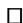

# Chapter 2 Derivatives

This chapter introduces several important notions of derivatives of tensors. In chapters 5 and 6 we also introduce partial derivatives of functions into Riemannian manifolds.

The main goal is the construction of the connection and its use as covariant differentiation. We give a motivation of this concept that depends on exterior and Lie derivatives. Covariant differentiation, in turn, allows for nice formulas for exterior derivatives, Lie derivatives, divergence and much more. It is also crucial in the development of curvature which is the central construction in Riemannian geometry.

Surprisingly, the idea of a connection postdates Riemann’s introduction of the curvature tensor. Riemann discovered the Riemannian curvature tensor as a secondorder term in a Taylor expansion of a Riemannian metric at a point with respect to a suitably chosen coordinate system. Lipschitz, Killing, and Christoffel introduced the connection in various ways as an intermediate step in computing the curvature. After this early work by the above-mentioned German mathematicians, an Italian school around Levi-Civita, Ricci, Bianchi et al. began systematically to study Riemannian metrics and tensor analysis. They eventually defined parallel translation and through that clarified the use of the connection. Hence the name Levi-Civita connection for the Riemannian connection. Most of their work was still local in nature and mainly centered on developing tensor analysis as a tool for describing physical phenomena such as stress, torque, and divergence. At the beginning of the twentieth century Minkowski started developing the geometry of space-time as a mathematical model for Einstein’s new special relativity theory. It was this work that eventually enabled Einstein to give a geometric formulation of general relativity theory. Since then, tensor calculus, connections, and curvature have become an indispensable language for many theoretical physicists.

Much of what we do in this chapter carries over to the pseudo-Riemannian setting as long as we keep in mind how to calculate traces in this context.

## 2.1 Lie Derivatives

### 2.1.1 Directional Derivatives

There are many ways of denoting the directional derivative of a function on a manifold. Given a function $f : M \to \mathbb { R }$ and a vector field Y on M we will use W !the following ways of writing the directional derivative of f in the direction of Y

$$
\nabla_ {Y} f = D _ {Y} f = L _ {Y} f = d f (Y) = Y (f).
$$

If we have a function $f : M \to \mathbb { R }$ on a manifold, then the differential $d f : T M $ , W !R measures the change in the function. In local coordinates, $d f = \partial _ { i } ( f ) d x ^ { i }$ !. If, in Daddition, M is equipped with a Riemannian metric g, then we also have the gradient of f , denoted by $\operatorname { g r a d } f = \nabla f$ , defined as the vector field satisfying $g ( v , \nabla f ) = d f ( v )$ ) for all $v \in T M$ D r. In local coordinates this reads, $\nabla f = g ^ { i j } \partial _ { i } ( f ) \partial _ { j }$ r, where $g ^ { i j }$ is the 2inverse of the matrix $g _ { i j }$ r D(see also section 1.5.1). Defined in this way, the gradient clearly depends on the metric.

But is there a way of defining a gradient vector field of a function without using Riemannian metrics? The answer is no and can be understood as follows. On $\mathbb { R } ^ { n }$ the gradient is defined as

$$
\nabla f = \delta^ {i j} \partial_ {i} (f) \partial_ {j} = \sum_ {i = 1} ^ {n} \partial_ {i} (f) \partial_ {i}.
$$

But this formula depends on the fact that we used Cartesian coordinates. If instead we use polar coordinates on $\mathbb { R } ^ { 2 }$ , say, then

$$
\nabla f = \partial_ {x} (f) \partial_ {x} + \partial_ {y} (f) \partial_ {y} \neq \partial_ {r} (f) \partial_ {r} + \partial_ {\theta} (f) \partial_ {\theta},
$$

One rule of thumb for items that are invariantly defined is that they should satisfy the Einstein summation convention. Thus, $d f = \partial _ { i } \left( f \right) d x ^ { i }$ is invariantly defined, while $\nabla f = \partial _ { i } \left( f \right) \partial _ { i }$ is not. The metric $g = g _ { i j } d x ^ { i } d x ^ { j }$ and gradient $\nabla f = g ^ { i j } \partial _ { i } \left( f \right) \partial _ { j }$ are r D Dinvariant expressions that also depend on our choice of metric.

### 2.1.2 Lie Derivatives

Let X be a vector field and $F ^ { t }$ the corresponding locally defined flow on a smooth manifold M. Thus $F ^ { t } \left( p \right)$ is defined for small t and the curve $t \mapsto F ^ { t } \left( p \right)$ is the integral curve for X that goes through p at $t = 0$ : The $L i e$ 7!derivative of a tensor in Dthe direction of X is defined as the first-order term in a suitable Taylor expansion of the tensor when it is moved by the flow of X: The precise formula, however, depends on what type of tensor we use.

If f M R is a function, then

$$
f \left(F ^ {t} (p)\right) = f (p) + t \left(L _ {X} f\right) (p) + o (t),
$$

or

$$
(L _ {X} f) (p) = \lim _ {t \to 0} \frac {f (F ^ {t} (p)) - f (p)}{t}.
$$

Thus the Lie derivative $L _ { X } f$ is simply the directional derivative $D _ { X } f \ = \ d f \left( X \right)$ : Without specifying p we can also write

$$
f \circ F ^ {t} = f + t L _ {X} f + o (t) \text {and} L _ {X} f = D _ {X} f = d f (X).
$$

When we have a vector field Y things get a little more complicated as $Y | _ { F ^ { t } }$ can’t jbe compared directly to Y since the vectors live in different tangent spaces. Thus we consider the curve $t \mapsto D F ^ { - t } \left( Y \vert _ { F ^ { t } ( p ) } \right)$ that lies in $T _ { p } M$ : When this is expanded in t 7!near 0 we obtain an expression

$$
D F ^ {- t} \left(Y | _ {F ^ {t} (p)}\right) = Y | _ {p} + t \left(L _ {X} Y\right) | _ {p} + o (t)
$$

for some vector $( L _ { X } Y ) \mid _ { p } \in T _ { p } M$ . In other words we define

$$
\left(L _ {X} Y\right) | _ {p} = \lim _ {t \rightarrow 0} \frac {D F ^ {- t} \left(Y | _ {F ^ {t} (p)}\right) - Y | _ {p}}{t}.
$$

This Lie derivative turns out to be the Lie bracket.

Proposition 2.1.1. If X; Y are vector fields on M, then $L _ { X } Y = [ X , Y ]$ .

Proof. While Lie derivatives are defined as a limit of suitable difference quotients it is generally far more convenient to work with their implicit definition through the first-order Taylor expansion.

The Lie derivative comes from

$$
D F ^ {- t} \left(Y | _ {F ^ {t}}\right) = Y + t L _ {X} Y + o (t)
$$

or equivalently

$$
Y | _ {F ^ {t}} - D F ^ {t} (Y) = t D F ^ {t} \left(L _ {X} Y\right) + o (t).
$$

Consider the directional derivative of a function f in the direction of $Y | _ { F ^ { t } } - D F ^ { t } \left( Y \right)$

$$
\begin{array}{l} D _ {Y | _ {F ^ {t}} - D F ^ {t} (Y)} f = D _ {Y | _ {F ^ {t}}} f - D _ {D F ^ {t} (Y)} f \\ = (D _ {Y} f) \circ F ^ {t} - D _ {Y} (f \circ F ^ {t}) \\ \end{array}
$$

$$
\begin{array}{l} = D _ {Y} f + t D _ {X} D _ {Y} f + o (t) \\ - D _ {Y} (f + t D _ {X} f + o (t)) \\ = t \left(D _ {X} D _ {Y} f - D _ {Y} D _ {X} f\right) + o (t) \\ = t D _ {[ X, Y ]} f + o (t). \\ \end{array}
$$

This shows that

$$
\begin{array}{l} L _ {X} Y = \lim _ {t \rightarrow 0} \frac {Y | _ {F ^ {t}} - D F ^ {t} (Y)}{t} \\ = [ X, Y ]. \\ \end{array}
$$

We are now ready to define the Lie derivative of a .0; k/-tensor T and also give an algebraic formula for this derivative. Define

$$
\left(F ^ {t}\right) ^ {*} T = T + t \left(L _ {X} T\right) + o (t)
$$

or with variables included

$$
\begin{array}{l} \left(\left(F ^ {t}\right) ^ {*} T\right) \left(Y _ {1}, \dots , Y _ {k}\right) = T \left(D F ^ {t} \left(Y _ {1}\right), \dots , D F ^ {t} \left(Y _ {k}\right)\right) \\ = T \left(Y _ {1}, \dots , Y _ {k}\right) + t \left(L _ {X} T\right) \left(Y _ {1}, \dots , Y _ {k}\right) + o (t). \\ \end{array}
$$

As a difference quotient this means

$$
\left(L _ {X} T\right)\left(Y _ {1}, \dots , Y _ {k}\right) = \lim _ {t \rightarrow 0} \frac {\left(F ^ {t}\right) ^ {*} T - T}{t}.
$$

Proposition 2.1.2. If X is a vector field and T a .0; k/-tensor on M; then

$$
\left(L _ {X} T\right) \left(Y _ {1}, \dots , Y _ {k}\right) = D _ {X} \left(T \left(Y _ {1}, \dots , Y _ {k}\right)\right) - \sum_ {i = 1} ^ {k} T \left(Y _ {1}, \dots , L _ {X} Y _ {i}, \dots , Y _ {k}\right).
$$

Proof. We restrict attention to the case where k 1: The general case is similar but requires more notation. Using that

$$
Y | _ {F ^ {t}} = D F ^ {t} (Y) + t D F ^ {t} \left(L _ {X} Y\right) + o (t)
$$

we get

$$
\left(\left(F ^ {t}\right) ^ {*} T\right) (Y) = T \left(D F ^ {t} (Y)\right)
$$

$$
\begin{array}{l} = T \left(Y | _ {F ^ {t}} - t D F ^ {t} \left(L _ {X} Y\right)\right) + o (t) \\ = T (Y) \circ F ^ {t} - t T \left(D F ^ {t} \left(L _ {X} Y\right)\right) + o (t) \\ = T (Y) + t D _ {X} (T (Y)) - t T \left(D F ^ {t} \left(L _ {X} Y\right)\right) + o (t). \\ \end{array}
$$

Thus

$$
\begin{array}{l} (L _ {X} T) (Y) = \lim _ {t \rightarrow 0} \frac {\left((F ^ {t}) ^ {*} T\right) (Y) - T (Y)}{t} \\ = \lim _ {t \rightarrow 0} \left(D _ {X} (T (Y)) - T \left(D F ^ {t} \left(L _ {X} Y\right)\right)\right) \\ = D _ {X} (T (Y)) - T \left(L _ {X} Y\right). \\ \end{array}
$$

Finally, we have that Lie derivatives satisfy all possible product rules, i.e., they are derivations. From the above propositions this is already obvious when multiplying functions with vector fields or $( 0 , k )$ -tensors.

Proposition 2.1.3. $I f T _ { 1 }$ and $T _ { 2 }$ be $( 0 , k _ { i } )$ -tensors, then

$$
L _ {X} \left(T _ {1} \cdot T _ {2}\right) = \left(L _ {X} T _ {1}\right) \cdot T _ {2} + T _ {1} \cdot \left(L _ {X} T _ {2}\right).
$$

Proof. Recall that for 1-forms and more general .0; k/-tensors we define the product as

$$
T _ {1} \cdot T _ {2} \left(X _ {1}, \dots , X _ {k _ {1}}, Y _ {1}, \dots , Y _ {k _ {2}}\right) = T _ {1} \left(X _ {1}, \dots , X _ {k _ {1}}\right) \cdot T _ {2} \left(Y _ {1}, \dots , Y _ {k _ {2}}\right).
$$

The proposition is then a simple consequence of the previous proposition and the product rule for derivatives of functions.

Proposition 2.1.4. If T is a $( 0 , k )$ -tensor and f $M \to \mathbb { R }$ a function, then

$$
L _ {f X} T \left(Y _ {1}, \dots , Y _ {k}\right) = f L _ {X} T \left(Y _ {1}, \dots , Y _ {k}\right) + \sum_ {i = 1} ^ {k} \left(L _ {Y _ {i}} f\right) T \left(Y _ {1}, \dots , X, \dots , Y _ {k}\right).
$$

Proof. We have that

$$
\begin{array}{l} L _ {f X} T \left(Y _ {1}, \dots , Y _ {k}\right) = D _ {f X} \left(T \left(Y _ {1}, \dots , Y _ {k}\right)\right) - \sum_ {i = 1} ^ {k} T \left(Y _ {1}, \dots , L _ {f X} Y _ {i}, \dots , Y _ {k}\right) \\ = f D _ {X} \left(T \left(Y _ {1}, \dots , Y _ {p}\right)\right) - \sum_ {i = 1} ^ {k} T \left(Y _ {1}, \dots , [ f X, Y _ {i} ], \dots , Y _ {k}\right) \\ \end{array}
$$

$$
\begin{array}{l} = f D _ {X} \left(T \left(Y _ {1}, \dots , Y _ {p}\right)\right) - f \sum_ {i = 1} ^ {k} T \left(Y _ {1}, \dots , \left[ X, Y _ {i} \right], \dots , Y _ {k}\right) \\ + \sum_ {i = 1} ^ {k} \left(L _ {Y _ {i}} f\right) T \left(Y _ {1}, \dots , X, \dots , Y _ {k}\right). \\ \end{array}
$$

The case where $X | _ { p } = 0$ is of special interest when computing Lie derivatives. We note that $F ^ { t } \left( p \right) = p$ Dfor all t: Thus $D F ^ { t } : T _ { p } M \to T _ { p } M$ and

$$
\begin{array}{l} L _ {X} Y | _ {p} = \lim _ {t \rightarrow 0} \frac {D F ^ {- t} (Y | _ {p}) - Y | _ {p}}{t} \\ = \frac {d}{d t} (D F ^ {- t}) | _ {t = 0} (Y | _ {p}). \\ \end{array}
$$

This shows that $\begin{array} { r } { L _ { X } = \frac { d } { d t } \left( D F ^ { - t } \right) \vert _ { t = 0 } } \end{array}$ when $X | _ { p } = 0$ : From this we see that if - is a 1-form then $L _ { X } \theta \ = \ - \theta \circ L _ { X }$ D j Dat points p where $X | _ { p } = 0$ : This is a general phenomenon.

Lemma 2.1.5. If a vector field X vanishes at $p ,$ then the Lie derivative $L _ { X } T$ at $p$ depends only on the value of T at $p .$ .

Proof. We have that

$$
\left(L _ {X} T\right) \left(Y _ {1}, \dots , Y _ {k}\right) = D _ {X} \left(T \left(Y _ {1}, \dots , Y _ {k}\right)\right) - \sum_ {i = 1} ^ {k} T \left(Y _ {1}, \dots , L _ {X} Y _ {i}, \dots , Y _ {k}\right).
$$

So if X vanishes at $p ,$ then

$$
\left(L _ {X} T\right) \left(Y _ {1}, \dots , Y _ {k}\right) | _ {p} = - \sum_ {i = 1} ^ {k} T \left(Y _ {1}, \dots , L _ {X} Y _ {i}, \dots , Y _ {k}\right) | _ {p}.
$$

It is also possible to define Lie derivatives of more general tensors and even multilinear maps on vector fields. An important instance of this is the Lie derivative of the Lie bracket $[ Y , Z ]$ or even the Lie derivative of the Lie derivative $L _ { Y } T$ . This is algebraically defined as

$$
\begin{array}{l} \left(L _ {X} L\right) _ {Y} T = L _ {X} \left(L _ {Y} T\right) - L _ {L _ {X} Y} T - L _ {Y} \left(L _ {X} T\right) \\ = \left[ L _ {X}, L _ {Y} \right] T - L _ {[ X, Y ]} T. \\ \end{array}
$$

Proposition 2.1.6 (The Generalized Jacobi Identity). For all vector fields X; Y and tensors T

$$
(L _ {X} L) _ {Y} T = 0.
$$

Proof. When T is a function this follows from the definition of the Lie bracket:

$$
\begin{array}{l} (L _ {X} L) _ {Y} f = [ L _ {X}, L _ {Y} ] f - L _ {[ X, Y ]} f \\ = [ D _ {X}, D _ {Y} ] f - D _ {[ X, Y ]} f \\ = 0. \\ \end{array}
$$

When $T = Z$ is a vector field it is the usual Jacobi identity:

$$
\begin{array}{l} (L _ {X} L) _ {Y} Z = [ L _ {X}, L _ {Y} ] Z - L _ {[ X, Y ]} Z \\ = [ X, [ Y, Z ] ] - [ Y, [ X, Z ] ] - [ [ X, Y ], Z ] \\ = [ X, [ Y, Z ] ] + [ Z, [ X, Y ] ] + [ Y, [ Z, X ] ] \\ = 0. \\ \end{array}
$$

When $T = \omega$ is a one-form it follows automatically from those two observations Dprovided we know that

$$
\left(\left[ L _ {X}, L _ {Y} \right] \omega\right) (Z) = \left[ L _ {X}, L _ {Y} \right] (\omega (Z)) - \omega \left(\left[ L _ {X}, L _ {Y} \right] Z\right)
$$

since we then have

$$
\begin{array}{l} \left(\left(L _ {X} L\right) _ {Y} \omega\right) (Z) = \left(\left[ L _ {X}, L _ {Y} \right] \omega\right) (Z) - \left(L _ {[ X, Y ]} \omega\right) (Z) \\ = \left[ L _ {X}, L _ {Y} \right] (\omega (Z)) - \omega \left(\left[ L _ {X}, L _ {Y} \right] Z\right) \\ - L _ {[ X, Y ]} (\omega (Z)) + \omega (L _ {[ X, Y ]} Z) \\ = 0. \\ \end{array}
$$

A few cancellations must occur for the first identity to hold. Note that

$$
\begin{array}{l} \left(\left[ L _ {X}, L _ {Y} \right] \omega\right) (Z) = \left(L _ {X} \left(L _ {Y} \omega\right)\right) (Z) - \left(L _ {Y} \left(L _ {X} \omega\right)\right) (Z), \\ \left(L _ {X} \left(L _ {Y} \omega\right)\right) (Z) = L _ {X} \left(\left(L _ {Y} \omega\right) (Z)\right) - \left(L _ {Y} \omega\right) \left(L _ {X} Z\right) \\ = L _ {X} \left(L _ {Y} (\omega (Z))\right) - L _ {X} (\omega (L _ {Y} Z)) \\ - L _ {Y} \left(\omega \left(L _ {X} Z\right)\right) + \omega \left(L _ {Y} L _ {X} Z\right), \\ \end{array}
$$

and similarly

$$
\left(L _ {Y} \left(L _ {X} \omega\right)\right) (Z) = L _ {Y} \left(L _ {X} (\omega (Z))\right) - L _ {Y} (\omega (L _ {X} Z)) - L _ {X} (\omega (L _ {Y} Z)) + \omega \left(L _ {X} L _ {Y} Z\right).
$$

This shows that

$$
\left(\left[ L _ {X}, L _ {Y} \right] \omega\right) (Z) = \left[ L _ {X}, L _ {Y} \right] (\omega (Z)) - \omega \left(\left[ L _ {X}, L _ {Y} \right] Z\right).
$$

The proof for general tensors now follows by observing that these are tensor products of the above three simple types of tensors and that Lie derivatives act as derivations.

The Lie derivative can also be used to give a formula for the exterior derivative of a k-form

$$
\begin{array}{l} d \omega \left(X _ {0}, X _ {1}, \dots , X _ {k}\right) = \frac {1}{2} \sum_ {i = 0} ^ {k} (- 1) ^ {i} \left(L _ {X _ {i}} \omega\right) \left(X _ {0}, \dots , \widehat {X} _ {i}, \dots , X _ {k}\right). \\ + \frac {1}{2} \sum_ {i = 0} ^ {k} (- 1) ^ {i} L _ {X _ {i}} \left(\omega \left(X _ {0}, \dots , \widehat {X} _ {i}, \dots , X _ {k}\right)\right) \\ \end{array}
$$

For a 1-form this gives us the usual definition

$$
d \omega (X, Y) = D _ {X} (\omega (Y)) - D _ {Y} (\omega (X)) - \omega ([ X, Y ]).
$$

### 2.1.3 Lie Derivatives and the Metric

The Lie derivative allows us to define the Hessian of a function on a Riemannian manifold as a .0; 2/-tensor:

$$
\operatorname{Hess} f (X, Y) = \frac {1}{2} \left(L _ {\nabla f} g\right) (X, Y).
$$

At a critical point for f this gives the expected answer. To see this, select coordinates $x ^ { i }$ around $p$ such that the metric coefficients satisfy $g _ { i j } \vert _ { p } = \delta _ { i j }$ : If $\left. d f \right| _ { p } = 0$ , then $\nabla f | _ { p } = 0$ and it follows that

$$
\begin{array}{l} L _ {\nabla f} \left(g _ {i j} d x ^ {i} d x ^ {j}\right) | _ {p} = L _ {\nabla f} \left(g _ {i j}\right) | _ {p} + \delta_ {i j} L _ {\nabla f} \left(d x ^ {i}\right) d x ^ {j} + \delta_ {i j} d x ^ {i} L _ {\nabla f} \left(d x ^ {j}\right) \\ = \delta_ {i j} L _ {\nabla f} (d x ^ {i}) d x ^ {j} + \delta_ {i j} d x ^ {i} L _ {\nabla f} (d x ^ {j}) \\ = L _ {\nabla f} \left(\delta_ {i j} d x ^ {i} d x ^ {j}\right) | _ {p}. \\ \end{array}
$$

Thus Hess $f | _ { p }$ is the same if we compute it using g and the Euclidean metric in the jfixed coordinate system.

It is perhaps still not clear why the Lie derivative formula for the Hessian is reasonable. The idea is that the Hessian measures how the metric changes as we flow along the gradient field. To justify this better let us define the divergence of a vector field X as the function div X that measures how the volume form changes along the flow for X:

$$
L _ {X} \operatorname{vol} = (\operatorname{div} X) \operatorname{vol}.
$$

Note that the form $L _ { X }$ vol is always exact as

$$
L _ {X} \mathrm{vol} = d i _ {X} \mathrm{vol},
$$

where $i _ { X } T$ evaluates T on X in the first variable.

The Laplacian of a function is defined as in vector calculus by

$$
\Delta f = \operatorname{div} \nabla f
$$

and we claim that it is also given as the trace of the Hessian. To see this select a positively oriented orthonormal frame $E _ { i }$ and note that

$$
\begin{array}{l} \operatorname{div} X = \left(L _ {X} \text {vol}\right) \left(E _ {1}, \dots , E _ {n}\right) \\ = L _ {X} \left(\operatorname{vol} \left(E _ {1}, \dots , E _ {n}\right)\right) \\ - \sum \operatorname{vol} \left(E _ {1}, \dots , L _ {X} E _ {i}, \dots , E _ {n}\right) \\ = - \sum g \left(L _ {X} E _ {i}, E _ {i}\right) \\ = \frac {1}{2} \sum \left(L _ {X} \left(g \left(E _ {i}, E _ {i}\right)\right) - g \left(L _ {X} E _ {i}, E _ {i}\right) - g \left(E _ {i}, L _ {X} E _ {i}\right)\right) \\ = \sum \frac {1}{2} \left(L _ {X} g\right) \left(E _ {i}, E _ {i}\right). \\ \end{array}
$$

We can also show that the Hessian defined in this way gives us back the usual Hessian of a function $f : \mathbb { R } ^ { n } \to \mathbb { R }$ with the canonical metric on Euclidean space:

$$
\begin{array}{l} L _ {\nabla f} \left(\delta_ {i j} d x ^ {i} d x ^ {j}\right) = L _ {\sum \partial_ {j} f \partial_ {j}} \sum d x ^ {i} d x ^ {i} \\ = \sum L _ {\partial_ {j} f \partial_ {j}} d x ^ {i} d x ^ {i} \\ = \sum \left(L _ {\partial_ {j} f \partial_ {j}} d x ^ {i}\right) d x ^ {i} + \sum d x ^ {i} \left(L _ {\partial_ {j} f \partial_ {j}} d x ^ {i}\right) \\ = \sum \partial_ {j} f \left(L _ {\partial_ {j}} d x ^ {i}\right) d x ^ {i} + \sum \partial_ {j} f d x ^ {i} \left(L _ {\partial_ {j}} d x ^ {i}\right) \\ \end{array}
$$

$$
\begin{array}{l} = + \sum d (\partial_ {j} f) d x ^ {i} (\partial_ {j}) d x ^ {i} + \sum d (\partial_ {j} f) d x ^ {i} d x ^ {i} (\partial_ {j}) \\ = 2 \sum d (\partial_ {i} f) d x ^ {i} \\ = 2 \sum \partial_ {j i} f d x ^ {j} d x ^ {i} \\ = 2 \text {Hess} f. \\ \end{array}
$$

### 2.1.4 Lie Groups

Lie derivatives as might be expected also come in handy when working with Lie groups. For a Lie group G we have the inner automorphism $\mathbf { A d } _ { h } : x \mapsto h x h ^ { - 1 }$ and its differential at $x = e$ denoted by the same letters $\mathbf { A d } _ { h } : { \mathfrak { g } } \to { \mathfrak { g } }$ .

Lemma 2.1.7. The differential of $h \mapsto \mathbf { A d } _ { h }$ is given by $U \mapsto \mathsf { a d } _ { U } \left( X \right) = [ U , X ] .$ .

Proof. If we write $\mathrm { A d } _ { h } \left( x \right) = R _ { h ^ { - 1 } } L _ { h } \left( x \right)$ , then its differential at $x = e$ is given by $\mathrm { A d } _ { h } = D R _ { h ^ { - 1 } } D L _ { h }$ . Now let $F ^ { t }$ be the flow for U: Then $F ^ { t } \left( x \right) = x F ^ { t } \left( e \right) = L _ { x } \left( F ^ { t } \left( e \right) \right)$ ) Das both curves go through x at $t = 0$ D Dand have U as tangent everywhere since U is a Dleft-invariant vector field. This also shows that $D F ^ { t } = D R _ { F ^ { t } ( e ) }$ . Thus

$$
\begin{array}{l} \operatorname{ad} _ {U} (X) \mid_ {e} = \frac {d}{d t} D R _ {F ^ {- t} (e)} D L _ {F ^ {t} (e)} (X | _ {e}) \mid_ {t = 0} \\ = \frac {d}{d t} D R _ {F ^ {- t} (e)} \left(X | _ {F ^ {t} (e)}\right) | _ {t = 0} \\ = \frac {d}{d t} D F ^ {- t} (X | _ {F ^ {t} (e)}) | _ {t = 0} \\ = L _ {U} X = [ U, X ]. \\ \end{array}
$$

This is used in the next lemma.

Lemma 2.1.8. Let $\mathbf { G } = \mathbf { G } \mathbf { L } \left( V \right)$ be the Lie group of invertible matrices on V: The DLie bracket structure on the Lie algebra .V/ of left-invariant vector fields on glGL .V/ is given by commutation of linear maps. i.e., if X; $Y \in T _ { I } \mathbf { G } \mathbf { L } \left( V \right)$ ; then

$$
[ X, Y ] \mid_ {I} = X Y - Y X.
$$

Proof. Since $x \mapsto h x h ^ { - 1 }$ is a linear map on the space Hom $( V , V )$ we see that $\mathbf { A d } _ { h } \left( X \right) = h X h ^ { - 1 }$ : The flow of U is given by $F ^ { t } \left( g \right) = g \left( I + t U + o \left( t \right) \right)$ / so we have

## 2.2 Connections

$$
\begin{array}{l} [ U, X ] = \frac {d}{d t} \left(F ^ {t} (I) X F ^ {- t} (I)\right) | _ {t = 0} \\ = \frac {d}{d t} \left(\left(I + t U + o (t)\right) X (I - t U + o (t))\right) | _ {t = 0} \\ = \frac {d}{d t} (X + t U X - t X U + o (t)) | _ {t = 0} \\ = U X - X U. \\ \end{array}
$$

### 2.2.1 Covariant Differentiation

We now come to the question of attaching a meaning to the change of a vector field. The Lie derivative is one possibility, but it is not a strong enough concept as it doesn’t characterize the Cartesian coordinate fields in $\mathbb { R } ^ { n }$ as having zero derivative. A better strategy for $\mathbb { R } ^ { n }$ is to write $X = X ^ { i } \partial _ { i }$ , where $\partial _ { i }$ are the Cartesian coordinate Dfields. If we want the coordinate vector fields to have zero derivative, then it is natural to define the covariant derivative of X in the direction of Y as

$$
\nabla_ {Y} X = \left(\nabla_ {Y} X ^ {i}\right) \partial_ {i} = d \left(X ^ {i}\right) (Y) \partial_ {i}.
$$

Thus we measure the change in X by measuring how the coefficients change. Therefore, a vector field with constant coefficients does not change. This formula clearly depends on the fact that we used Cartesian coordinates and is not invariant under change of coordinates. If we take the coordinate vector fields

$$
\partial_ {r} = \frac {1}{r} \left(x \partial_ {x} + y \partial_ {y}\right), \partial_ {\theta} = - y \partial_ {x} + x \partial_ {y}
$$

that come from polar coordinates in $\mathbb { R } ^ { 2 }$ ; then we see that they are not constant.

In order to better understand such derivatives we need to find a coordinate independent definition. This is done most easily by splitting the problem of defining the change in a vector field X into two problems.

First, we can measure the change in X by asking whether or not X is a gradient field. If $i _ { X } g = \theta _ { X }$ is the 1-form dual to X; i.e., $\left( i _ { X } g \right) ( Y ) = g \left( X , Y \right)$ ; then we know Dthat X is locally the gradient of a function if and only if $d \theta _ { X } = 0$ : In general, the 2-form $d \theta _ { X }$ Dthen measures the extent to which X is a gradient field.

Second, we can measure how a vector field X changes the metric via the Lie derivative $L _ { X } g$ : This is a symmetric .0; 2/-tensor as opposed to the skew-symmetric $( 0 , 2 )$ -tensor $d \theta _ { X }$ : If $F ^ { t }$ is the local flow for X; then we see that $L _ { X } g = 0$ if and only if $F ^ { t }$ Dare isometries (see also section 8.1). When this happens we say that X is a Killing field.

In case $X \ = \ \nabla f$ is a gradient field we saw that the expression $\scriptstyle { \frac { 1 } { 2 } } L _ { \nabla f } g$ is the D r rHessian of f : From that calculation we can also quickly see what the Killing fields on Rn should be: If $X = X ^ { i } \partial _ { i }$ ; then X is a Killing field if and only if $\partial _ { k } X ^ { i } + \partial _ { i } X ^ { k } = 0$ : This implies that

$$
\begin{array}{l} \partial_ {j} \partial_ {k} X ^ {i} = - \partial_ {j} \partial_ {i} X ^ {k} \\ = - \partial_ {i} \partial_ {j} X ^ {k} \\ = \partial_ {i} \partial_ {k} X ^ {j} \\ = \partial_ {k} \partial_ {i} X ^ {j} \\ = - \partial_ {k} \partial_ {j} X ^ {i} \\ = - \partial_ {j} \partial_ {k} X ^ {i}. \\ \end{array}
$$

Thus we have $\partial _ { j } \partial _ { k } X ^ { i } = 0$ and hence

$$
X ^ {i} = \alpha_ {j} ^ {i} x ^ {j} + \beta^ {i}
$$

with the extra conditions that

$$
\alpha_ {j} ^ {i} = \partial_ {j} X ^ {i} = - \partial_ {i} X ^ {j} = - \alpha_ {i} ^ {j}.
$$

In particular, the angular field $\partial _ { \theta }$ is a Killing field. This also follows from the fact that the corresponding flow is matrix multiplication by the orthogonal matrix

$$
\left[ \begin{array}{c c} \cos (t) & - \sin (t) \\ \sin (t) & \cos (t) \end{array} \right].
$$

More generally, one can show that the flow of the Killing field X is

$$
F ^ {t} (x) = \exp (A t) x + t \beta , A = \left[ \alpha_ {j} ^ {i} \right], \beta = \left[ \beta^ {i} \right].
$$

In this way we see that a vector field on $\mathbb { R } ^ { n }$ is constant if and only if it is both a Killing field and a gradient field.

Finally we make the important observation.

Proposition 2.2.1. The covariant derivative in $\mathbb { R } ^ { n }$ is given by the implicit formula:

$$
2 g \left(\nabla_ {Y} X, Z\right) = \left(L _ {X} g\right) (Y, Z) + \left(d \theta_ {X}\right) (Y, Z).
$$

Proof. Since both sides are tensorial in Y and Z it suffices to check the formula on the Cartesian coordinate vector fields. Write $X = a ^ { i } \partial _ { i }$ and calculate the right-hand side

$$
\begin{array}{l} \left(L _ {X} g\right) \left(\partial_ {k}, \partial_ {l}\right) + \left(d \theta_ {X}\right) \left(\partial_ {k}, \partial_ {l}\right) = D _ {X} \delta_ {k l} - g \left(L _ {X} \partial_ {k}, \partial_ {l}\right) - g \left(\partial_ {k}, L _ {X} \partial_ {l}\right) \\ + \partial_ {k} g (X, \partial_ {l}) - \partial_ {l} g (X, \partial_ {k}) - g (X, [ \partial_ {k}, \partial_ {l} ]) \\ = - g \left(L _ {a ^ {i} \partial_ {i}} \partial_ {k}, \partial_ {l}\right) - g \left(\partial_ {k}, L _ {a ^ {j} \partial_ {j}} \partial_ {l}\right) \\ + \partial_ {k} a ^ {l} - \partial_ {l} a ^ {k} \\ = - g \left(- \left(\partial_ {k} a ^ {i}\right) \partial_ {i}, \partial_ {l}\right) - g \left(\partial_ {k}, - \left(\partial_ {l} a ^ {j}\right) \partial_ {j}\right) \\ + \partial_ {k} a ^ {l} - \partial_ {l} a ^ {k} \\ = + \partial_ {k} a ^ {l} + \partial_ {l} a ^ {k} + \partial_ {k} a ^ {l} - \partial_ {l} a ^ {k} \\ = 2 \partial_ {k} a ^ {l} \\ = 2 g \left(\left(\partial_ {k} a ^ {i}\right) \partial_ {i}, \partial_ {l}\right) \\ = 2 g \left(\nabla_ {\partial_ {k}} X, \partial_ {l}\right). \\ \end{array}
$$

Since the right-hand side in the formula for $\nabla _ { Y } X$ makes sense on any Riemannian rmanifold we can use this to give an implicit definition of the covariant derivative of X in the direction of Y. This covariant derivative turns out to be uniquely determined by the following properties.

Theorem 2.2.2 (The Fundamental Theorem of Riemannian Geometry). The assignment $X \mapsto \nabla X$ on $( M , g )$ is uniquely defined by the following properties:

(1) $Y \mapsto \nabla _ { Y } X$ is a .1; 1/-tensor, i.e., it is well-defined for tangent vectors and linear

$$
\nabla_ {\alpha v + \beta w} X = \alpha \nabla_ {v} X + \beta \nabla_ {w} X.
$$

(2) $X \mapsto \nabla _ { Y } X$ is a derivation:

$$
\nabla_ {Y} \left(X _ {1} + X _ {2}\right) = \nabla_ {Y} X _ {1} + \nabla_ {Y} X _ {2},
$$

$$
\nabla_ {Y} (f X) = \left(D _ {Y} f\right) X + f \nabla_ {Y} X
$$

for functions $f : M \to \mathbb { R } .$ :

W !(3) Covariant differentiation is torsion free:

$$
\nabla_ {X} Y - \nabla_ {Y} X = [ X, Y ].
$$

(4) Covariant differentiation is metric:

$$
D _ {Z} g (X, Y) = g (\nabla_ {Z} X, Y) + g (X, \nabla_ {Z} Y).
$$

Proof. We have already established (1) by using that

$$
(L _ {X} g) (Y, Z) + (d \theta_ {X}) (Y, Z)
$$

is tensorial in Y and Z: This also shows that the expression is linear in X: To check the derivation rule we observe that

$$
\begin{array}{l} L _ {f X} g + d \theta_ {f X} = f L _ {X} g + d f \cdot \theta_ {X} + \theta_ {X} \cdot d f + d (f \theta_ {X}) \\ = f L _ {X} g + d f \cdot \theta_ {X} + \theta_ {X} \cdot d f + d f \wedge \theta_ {X} + f d \theta_ {X} \\ = f \left(L _ {X} g + d \theta_ {X}\right) + d f \cdot \theta_ {X} + \theta_ {X} \cdot d f + d f \cdot \theta_ {X} - \theta_ {X} \cdot d f \\ = f \left(L _ {X} g + d \theta_ {X}\right) + 2 d f \cdot \theta_ {X}. \\ \end{array}
$$

Thus

$$
\begin{array}{l} 2 g \left(\nabla_ {Y} (f X), Z\right) = f 2 g \left(\nabla_ {Y} X, Z\right) + 2 d f (Y) g (X, Z) \\ = 2 g \left(f \nabla_ {Y} X + d f (Y) X, Z\right) \\ = 2 g \left(f \nabla_ {Y} X + \left(D _ {Y} f\right) X, Z\right). \\ \end{array}
$$

To establish the next two claims it is convenient to create the following expansion also known as Koszul’s formula.

$$
\begin{array}{l} 2 g \left(\nabla_ {Y} X, Z\right) = \left(L _ {X} g\right) (Y, Z) + \left(d \theta_ {X}\right) (Y, Z) \\ = D _ {X} g (Y, Z) - g ([ X, Y ], Z) - g (Y, [ X, Z ]) \\ + D _ {Y} \theta_ {X} (Z) - D _ {Z} \theta_ {X} (Y) - \theta_ {X} ([ Y, Z ]) \\ = D _ {X} g (Y, Z) - g ([ X, Y ], Z) - g (Y, [ X, Z ]) \\ + D _ {Y} g (X, Z) - D _ {Z} g (X, Y) - g (X, [ Y, Z ]) \\ = D _ {X} g (Y, Z) + D _ {Y} g (Z, X) - D _ {Z} g (X, Y) \\ - g \left([ X, Y ], Z\right) - g \left([ Y, Z ], X\right) + g \left([ Z, X ], Y\right). \\ \end{array}
$$

We then see that (3) follows from

$$
\begin{array}{l} 2 g \left(\nabla_ {X} Y - \nabla_ {Y} X, Z\right) = D _ {Y} g (X, Z) + D _ {X} g (Z, Y) - D _ {Z} g (Y, X) \\ - g ([ Y, X ], Z) - g ([ X, Z ], Y) + g ([ Z, Y ], X) \\ - D _ {X} g (Y, Z) - D _ {Y} g (Z, X) + D _ {Z} g (X, Y) \\ + g ([ X, Y ], Z) + g ([ Y, Z ], X) - g ([ Z, X ], Y) \\ = 2 g ([ X, Y ], Z). \\ \end{array}
$$

And (4) from

$$
\begin{array}{l} 2 g \left(\nabla_ {Z} X, Y\right) + 2 g (X, \nabla_ {Z} Y) = D _ {X} g (Z, Y) + D _ {Z} g (Y, X) - D _ {Y} g (X, Z) \\ - g ([ X, Z ], Y) - g ([ Z, Y ], X) + g ([ Y, X ], Z) \\ + D _ {Y} g (Z, X) + D _ {Z} g (X, Y) - D _ {X} g (Y, Z) \\ - g ([ Y, Z ], X) - g ([ Z, X ], Y) + g ([ X, Y ], Z) \\ = 2 D _ {Z} g (X, Y). \\ \end{array}
$$

Conversely, if we have a covariant derivative $\bar { \nabla } _ { Y } X$ with these four properties, then

$$
\begin{array}{l} 2 g \left(\nabla_ {Y} X, Z\right) = \left(L _ {X} g\right) (Y, Z) + \left(d \theta_ {X}\right) (Y, Z) \\ = D _ {X} g (Y, Z) + D _ {Y} g (Z, X) - D _ {Z} g (X, Y) \\ - g ([ X, Y ], Z) - g ([ Y, Z ], X) + g ([ Z, X ], Y) \\ = g (\bar {\nabla} _ {X} Y, Z) + g (Y, \bar {\nabla} _ {X} Z) + g (\bar {\nabla} _ {Y} Z, X) + g (Z, \bar {\nabla} _ {Y} X) \\ - g (\bar {\nabla} _ {Z} X, Y) - g (X, \bar {\nabla} _ {Z} Y) + g (\bar {\nabla} _ {Z} X, Y) - g (\bar {\nabla} _ {X} Z, Y) \\ - g (\bar {\nabla} _ {X} Y, Z) + g (\bar {\nabla} _ {Y} X, Z) - g (\bar {\nabla} _ {Y} Z, X) + g (\bar {\nabla} _ {Z} Y, X) \\ = 2 g \left(\bar {\nabla} _ {Y} X, Z\right) \\ \end{array}
$$

showing that $\nabla _ { Y } X = \bar { \nabla } _ { Y } X$ :

Any assignment on a manifold that satisfies (1) and (2) is called an affine connection. If $( M , g )$ is a Riemannian manifold and we have a connection that in addition also satisfies (3) and (4), then we call it a Riemannian connection. As we just saw, this connection is uniquely defined by these four properties and is given implicitly through the formula

$$
\begin{array}{l} 2 g \left(\nabla_ {Y} X, Z\right) = \left(L _ {X} g\right) (Y, Z) + \left(d \theta_ {X}\right) (Y, Z) \\ = D _ {X} g (Y, Z) + D _ {Y} g (Z, X) - D _ {Z} g (X, Y) \\ - g ([ X, Y ], Z) - g ([ Y, Z ], X) + g ([ Z, X ], Y). \\ \end{array}
$$

Before proceeding we need to discuss how $\nabla _ { Y } X$ depends on X and Y: Since $\nabla _ { Y } X$ is tensorial in Y; we see that the value of $\nabla _ { Y } X$ rat $p \in M$ depends only on $Y | _ { p }$ r: But in what way does it depend on X‹ Since $X \mapsto \nabla _ { Y } X$ 2 jis a derivation, it is definitely not 7!tensorial in X: Therefore, we cannot expect $( \nabla _ { Y } X ) \mid _ { p }$ to depend only on $X | _ { p }$ and $Y | _ { p }$ : The next two lemmas explore how $( \nabla _ { Y } X ) \mid _ { p }$ r jdepends on X:

Lemma 2.2.3. Let M be a manifold and  an affine connection on M: $H p \in M ,$ , $v \in T _ { p } M$ r; and X; Y are vector fields on M such that $X \ = \ Y$ 2 in a neighborhood $U \ni p ,$ , then $\nabla _ { v } X = \nabla _ { v } Y$ :

Proof. Choose $\lambda : M \to \mathbb { R }$ such that $\lambda \equiv 0$ on $M - U$ and $\lambda \equiv 1$ in a neighborhood of $p$ . Then $\lambda X = \lambda Y$ !on M: Thus at p

$$
\nabla_ {v} \lambda X = \lambda (p) \nabla_ {v} X + d \lambda (v) \cdot X (p) = \nabla_ {v} X
$$

since $d \lambda | _ { p } = 0$ and $\lambda ( p ) = 1$ : In particular,

$$
\nabla_ {v} X = \nabla_ {v} \lambda X = \nabla_ {v} \lambda Y = \nabla_ {v} Y.
$$

For a Riemannian connection we could also have used the Koszul formula to prove this since the right-hand side of that formula can be localized. This lemma tells us an important thing. Namely, if a vector field X is defined only on an open subset of M, then X still makes sense on this subset. Therefore, we can use coordinate rvector fields or more generally frames to compute  locally.

Lemma 2.2.4. Let M be a manifold and  an affine connection on M. If X is a vector field on M and $c : I \to M$ ra smooth curve with $\dot { c } ( 0 ) = v \in T _ { p } M ,$ , then $\nabla _ { v } { X }$ W !depends only on the values of X along c; i.e., $i f X \circ c = Y \circ c$ D 2; then $\nabla _ { \boldsymbol { \dot { c } } } X = \nabla _ { \boldsymbol { \dot { c } } } Y$ r.

Proof. Choose a frame $E _ { 1 } , \ldots , E _ { n }$ in a neighborhood of p and write $Y = \sum Y ^ { i } E _ { i }$ , $X = \sum X ^ { i } E _ { i }$ on this neighborhood. From the assumption that $X \circ c = Y \circ c$ we get Dthat $X ^ { i } \circ c = Y ^ { i } \circ c$ : Thus,

$$
\begin{array}{l} \nabla_ {v} Y = \nabla_ {v} \left(Y ^ {i} E _ {i}\right) \\ = Y ^ {i} (p) \nabla_ {v} E _ {i} + E _ {i} (p) d Y ^ {i} (v) \\ = X ^ {i} (p) \nabla_ {v} E _ {i} + E _ {i} (p) d X ^ {i} (v) \\ = \nabla_ {v} X. \\ \end{array}
$$

This shows that $\nabla _ { v } { X }$ makes sense as long as X is prescribed along some curve r(or submanifold) that has v as a tangent.

It will occasionally be convenient to use coordinates or orthonormal frames with certain nice properties. We say that a coordinate system is normal at p if $g _ { i j } \big | _ { p } = \delta _ { i j }$ and $\partial _ { k } g _ { i j } \rvert _ { p } = 0$ : An orthonormal frame $E _ { i }$ is normal at $p \in M$ if $\nabla _ { v } E _ { i } ( p ) = 0$ Dfor all $i = 1 , \ldots , n$ and $v \in T _ { p } M$ 2 r D: It is not hard to show that such coordinates and frames D 2always exist (see exercises 2.5.20 and 2.5.19).

### 2.2.2 Covariant Derivatives of Tensors

The connection, as we shall see, is also useful in generalizing many of the well-known concepts (such as Hessian, Laplacian, divergence) from multivariable calculus to the Riemannian setting (see also section 2.1.3).

If S is a .s; t/-tensor field, then we can define a covariant derivative S that we rinterpret as an .s; t 1/-tensor field. Recall that a vector field X is a .1; 0/-tensor Cfield and X is a .1; 1/-tensor field. The main idea is to make sure that Leibniz’ rule rholds. So for a .1; 1/-tensor S we should have

$$
\nabla_ {X} (S (Y)) = (\nabla_ {X} S) (Y) + S (\nabla_ {X} Y).
$$

Therefore, it seems reasonable to define S as

$$
\begin{array}{l} \nabla S (X, Y) = (\nabla_ {X} S) (Y) \\ = \nabla_ {X} (S (Y)) - S (\nabla_ {X} Y). \\ \end{array}
$$

In other words

$$
\nabla_ {X} S = [ \nabla_ {X}, S ].
$$

It is easily checked that $\nabla _ { X } S$ is still tensorial in Y:

More generally, when $s = 0$ ; 1 we obtain

$$
\begin{array}{l} \nabla S (X, Y _ {1}, \dots , Y _ {r}) = (\nabla_ {X} S) (Y _ {1}, \dots , Y _ {r}) \\ = \nabla_ {X} (S (Y _ {1}, \dots , Y _ {r})) - \sum_ {i = 1} ^ {r} S (Y _ {1}, \dots , \nabla_ {X} Y _ {i}, \dots , Y _ {r}). \\ \end{array}
$$

Here $\nabla _ { X }$ is interpreted as the directional derivative when applied to a function and rcovariant differentiation on vector fields. This also makes sense when $s \geq 2$ , if we make sense of defining covariant derivatives of, say, tensor products of vector fields. This can also be done using the product rule:

$$
\nabla_ {X} \left(X _ {1} \otimes X _ {2}\right) = \left(\nabla_ {X} X _ {1}\right) \otimes X _ {2} + X _ {1} \otimes \left(\nabla_ {X} X _ {2}\right).
$$

A tensor is said to be parallel if $\nabla { S } \equiv 0$ . In Euclidean space one can easily show r that if a tensor is written in Cartesian coordinates, then it is parallel if and only if it has constant coefficients. Thus $\nabla X \equiv 0$ for constant vector fields. On a Riemannian manifold $( M , g )$ r the metric and volume forms are always parallel.

Proposition 2.2.5. On a Riemannian n-manifold .M; g/

$$
\nabla g = 0,
$$

$$
\nabla \operatorname{vol} = 0.
$$

Proof. The metric is parallel due to property (4):

$$
(\nabla g) (X, Y _ {1}, Y _ {2}) = \nabla_ {X} \left(g (Y _ {1}, Y _ {2})\right) - g (\nabla_ {X} Y _ {1}, Y _ {2}) - g (Y _ {1}, \nabla_ {X} Y _ {2}) = 0.
$$

To check that the volume form is parallel we evaluate the covariant derivative on an orthonormal frame $E _ { 1 } , \ldots , E _ { n }$ :

$$
\begin{array}{l} \left(\nabla_ {X} \operatorname{vol}\right) \left(E _ {1}, \dots , E _ {n}\right) = \nabla_ {X} \operatorname{vol} \left(E _ {1}, \dots , E _ {n}\right) \\ - \sum \operatorname{vol} \left(E _ {1}, \dots , \nabla_ {X} E _ {i}, \dots , E _ {n}\right) \\ = - \sum g \left(E _ {i}, \nabla_ {X} E _ {i}\right) \\ = - \frac {1}{2} \sum D _ {X} (g (E _ {i}, E _ {i})) \\ = 0. \\ \end{array}
$$

The covariant derivative gives us a different way of calculating the Hessian of a function.

Proposition 2.2.6. $I f f : ( M , g ) \to \mathbb { R } ,$ , then

$$
\left(\nabla_ {X} d f\right) (Y) = g \left(\nabla_ {X} \nabla f, Y\right) = \operatorname{Hess} f (X, Y).
$$

Proof. First observe that

$$
\begin{array}{l} (\nabla d f) (X, Y) = (\nabla_ {X} d f) (Y) \\ = D _ {X} D _ {Y} f - d f (\nabla_ {X} Y) \\ = D _ {X} D _ {Y} f - D _ {\nabla_ {X} Y} f. \\ \end{array}
$$

This shows that

$$
(\nabla_ {X} d f) (Y) - (\nabla_ {Y} d f) (X) = [ D _ {X}, D _ {Y} ] f - D _ {[ X, Y ]} f = 0.
$$

Thus $\left( \nabla _ { X } d f \right) \left( Y \right)$ is symmetric. This can be used to establish the formulas

$$
\begin{array}{l} (\nabla d f) (X, Y) = (\nabla_ {X} d f) (Y) \\ = D _ {X} g (\nabla f, Y) - g (\nabla f, \nabla_ {X} Y) \\ = g \left(\nabla_ {X} \nabla f, Y\right) \\ = \frac {1}{2} g (\nabla_ {X} \nabla f, Y) + \frac {1}{2} g (X, \nabla_ {Y} \nabla f) \\ = \frac {1}{2} (\nabla_ {\nabla f} g) (X, Y) + \frac {1}{2} g (\nabla_ {X} \nabla f, Y) + \frac {1}{2} g (X, \nabla_ {Y} \nabla f) \\ = \frac {1}{2} D _ {\nabla f} g (X, Y) - \frac {1}{2} g ([ \nabla f, X ], Y) - \frac {1}{2} g (X, [ \nabla f, Y ]) \\ = \frac {1}{2} \left(L _ {\nabla f} g\right) (X, Y). \\ \end{array}
$$

#### 2.2.2.1 The Adjoint of the Covariant Derivative

The adjoint to the covariant derivative on $( s , t )$ -tensors with $t > 0$ is defined as

$$
\left(\nabla^ {*} S\right) \left(X _ {2}, \dots , X _ {r}\right) = - \sum \left(\nabla_ {E _ {i}} S\right) \left(E _ {i}, X _ {2}, \dots , X _ {r}\right),
$$

where $E _ { 1 } , \ldots , E _ { n }$ is an orthonormal frame. This means that while the covariant derivative adds a variable, the adjoint eliminates one. The adjoint is related to the divergence of a vector field (see section 2.1.3) by

Proposition 2.2.7. If X is a vector field and $\theta _ { X }$ the corresponding 1-form, then

$$
\operatorname{div} X = - \nabla^ {*} \theta_ {X}.
$$

Proof. See section 2.1.3 for the definition of divergence. Select an orthonormal frame $E _ { i }$ , then

$$
\begin{array}{l} - \nabla^ {*} \theta_ {X} = \sum (\nabla_ {E _ {i}} \theta_ {X}) (E _ {i}) \\ = \sum D _ {E _ {i}} g (X, E _ {i}) - \sum g (X, \nabla_ {E _ {i}} E _ {i}) \\ = \sum g (\nabla_ {E _ {i}} X, E _ {i}) \\ = \sum \frac {1}{2} (L _ {X} g) (E _ {i}, E _ {i}) \\ = \operatorname{div} X. \\ \end{array}
$$

The adjoint really is the adjoint of the covariant derivative with respect to the integrated inner product.

Proposition 2.2.8. If S is a compactly supported .s; t/-tensor and T a compactly supported $( s , t + 1 )$ -tensor, then

$$
\int g (\nabla S, T) \mathrm{vol} = \int g (S, \nabla^ {*} T) \mathrm{vol}.
$$

Proof. Define a 1-form by $\omega \left( X \right) \ = \ g \left( i _ { X } T , S \right)$ . To calculate its divergence more Deasily, select an orthonormal frame $E _ { i }$ such that $\nabla _ { v } E _ { i } = 0$ for all $v \in T _ { p } M$ . To further simplify things a bit assume that $s = t = 1$ r, then

$$
\begin{array}{l} - \nabla^ {*} \omega = (\nabla_ {E _ {i}} \omega) (E _ {i}) \\ = \nabla_ {E _ {i}} g (T (E _ {i}, E _ {j}), S (E _ {j})) \\ = g \left(\nabla_ {E _ {i}} T \left(E _ {i}, E _ {j}\right), S \left(E _ {j}\right)\right) + g \left(T \left(E _ {i}, E _ {j}\right), \nabla_ {E _ {i}} S \left(E _ {j}\right)\right) \\ = - g (\nabla^ {*} T, S) + g (T, \nabla S). \\ \end{array}
$$

So the result follows by the divergence theorem or Stokes’ theorem:

$$
\int \operatorname{div} X \operatorname{vol} = \int d i _ {X} \operatorname{vol} = 0,
$$

where X is any compactly supported vector field.

#### 2.2.2.2 Exterior Derivatives

The covariant derivative gives us a very nice formula for exterior derivatives of forms as the skew-symmetrized covariant derivative:

$$
(d \omega) (X _ {0}, \dots , X _ {k}) = \sum (- 1) ^ {i} (\nabla_ {X _ {i}} \omega) (X _ {0}, \dots , \hat {X} _ {i}, \dots , X _ {k}).
$$

While the covariant derivative clearly depends on the metric this formula shows that for forms we can still obtain derivatives that do not depend on the metric. It will also allow us to define exterior derivatives of more complicated tensors. Suppose we have a .1; k/-tensor T that is skew-symmetric in the k variables. Then we can define the .1; k 1/-tensor

$$
\left(d ^ {\nabla} T\right) \left(X _ {0}, \dots , X _ {k}\right) = \sum (- 1) ^ {i} \left(\nabla_ {X _ {i}} T\right) \left(X _ {0}, \dots , \hat {X} _ {i}, \dots , X _ {k}\right).
$$

In case $k = 0$ the tensor $T = Y$ is a vector field and we obtain the .1; 1/-tensor:

$$
\left(d ^ {\nabla} Y\right) (X) = \nabla_ {X} Y.
$$

When k  1 we have a .1; 1/-tensor and obtain the .1; 2/-tensor:

$$
\begin{array}{l} \left(d ^ {\nabla} T\right) (X, Y) = \left(\nabla_ {X} T\right) (Y) - \left(\nabla_ {Y} T\right) (X) \\ = \nabla_ {X} (T (Y)) - \nabla_ {Y} (T (X)) - T [ X, Y ]. \\ \end{array}
$$

#### 2.2.2.3 The Second Covariant Derivative

For a .s; t/-tensor field S we define the second covariant derivative $\nabla ^ { 2 } S$ as the $( s , t + 2 )$ -tensor field

$$
\begin{array}{l} \left(\nabla_ {X _ {1}, X _ {2}} ^ {2} S\right) \left(Y _ {1}, \dots , Y _ {r}\right) = \left(\nabla_ {X _ {1}} (\nabla S)\right) \left(X _ {2}, Y _ {1}, \dots , Y _ {r}\right) \\ = \left(\nabla_ {X _ {1}} \left(\nabla_ {X _ {2}} S\right)\right) \left(Y _ {1}, \dots , Y _ {r}\right) - \left(\nabla_ {\nabla_ {X _ {1}} X _ {2}} S\right) \left(Y _ {1}, \dots , Y _ {r}\right). \\ \end{array}
$$

With this we obtain another definition for the .0; 2/ version of the Hessian of a function:

$$
\begin{array}{l} \nabla_ {X, Y} ^ {2} f = \nabla_ {X} \nabla_ {Y} f - \nabla_ {\nabla_ {X} Y} f \\ = \nabla_ {X} d f (Y) - d f (\nabla_ {X} Y) \\ = (\nabla_ {X} d f) (Y) \\ = \operatorname{Hess} f (X, Y). \\ \end{array}
$$

The second covariant derivative on functions is symmetric in X and Y. For more general tensors, however, this will not be the case. The defect in the second covariant derivative not being symmetric is a central feature in Riemannian geometry and is at the heart of the difference between Euclidean geometry and all other Riemannian geometries.

From the new formula for the Hessian we see that the Laplacian can be written as

$$
\Delta f = - \nabla^ {*} \nabla f = \sum_ {i = 1} ^ {n} \nabla_ {E _ {i}, E _ {i}} ^ {2} f.
$$

#### 2.2.2.4 The Lie Derivative of the Covariant Derivative

We can define the Lie derivative of the connection in a way similar to the Lie derivative of the Lie bracket

$$
\begin{array}{l} (L _ {X} \nabla) _ {U} V = (L _ {X} \nabla) (U, V) \\ = L _ {X} \left(\nabla_ {U} V\right) - \nabla_ {L _ {X} U} V - \nabla_ {U} L _ {X} V \\ = [ X, \nabla_ {U} V ] - \nabla_ {[ X, U ]} V - \nabla_ {U} [ X, V ]. \\ \end{array}
$$

Since $[ U , V ] = \nabla _ { U } V - \nabla _ { V } U$ it follows that

$$
(L _ {X} \nabla) (U, V) - (L _ {X} \nabla) (V, U) = L _ {X} L _ {U} V = 0.
$$

Moreover as $\nabla _ { U } V$ is tensorial in U the Lie derivative $( L _ { X } \nabla ) _ { U }$ V will also be tensorial r rin U. The fact that it is also symmetric shows that it is tensorial in both variables.

#### 2.2.2.5 The Covariant Derivative of the Covariant Derivative

We can also define the covariant derivative of the covariant derivative

$$
\left(\nabla_ {X} \nabla\right) _ {Y} T = \nabla_ {X} \left(\nabla_ {Y} T\right) - \nabla_ {\nabla_ {X} Y} T - \nabla_ {Y} \left(\nabla_ {X} T\right).
$$

Note however, that this is not tensorial in X!

It is related to the second covariant derivative of T by

$$
\nabla_ {X, Y} ^ {2} T = (\nabla_ {X} \nabla) _ {Y} T + \nabla_ {Y} (\nabla_ {X} T).
$$

## 2.3 Natural Derivations

We’ve seen that there are many natural derivations on tensors coming from various combinations of derivatives. We shall attempt to tie these together in a natural and completely algebraic fashion by using that all .1; 1/-tensors naturally act as derivations on tensors.

For clarity we define a derivation on tensors as map $T \mapsto D T$ that preserves the type of the tensor $T ;$ 7! is linear; commutes with contractions; and satisfies the product rule

$$
D \left(T _ {1} \otimes T _ {2}\right) = \left(D T _ {1}\right) \otimes T _ {2} + T _ {1} \otimes D T _ {2}.
$$

### 2.3.1 Endomorphisms as Derivations

The goal is to show that .1; 1/-tensors naturally act as derivations on the space of all tensors.

We use the natural homomorphism

$$
\operatorname{GL} (V) \to \operatorname{GL} (T (V)),
$$

where $T \left( V \right)$ is the space of all tensors over the vector space V: This respects the natural grading of tensors: The subspace of $( s , t )$ -tensors is spanned by

$$
v _ {1} \otimes \dots \otimes v _ {s} \otimes \phi_ {1} \otimes \dots \otimes \phi_ {t}
$$

where $v _ { 1 } , \dotsc , v _ { s } \in V$ and $\phi _ { 1 } , \dots , \phi _ { t } : V \to \mathbb { R }$ are linear functions. The natural 2homomorphism acts as follows: for $\alpha \in \mathbb { R }$ !we have $g \cdot \alpha = 0 ;$ ; for $v \in V$ we have $g \cdot v = g \left( v \right)$ ; for $\phi \in V ^ { * }$ we have $g \cdot \phi = \phi \circ g ^ { - 1 }$  D 2; and on general tensors

$$
\begin{array}{l} g \cdot (v _ {1} \otimes \dots \otimes v _ {s} \otimes \phi_ {1} \otimes \dots \otimes \phi_ {t}) \\ = g \left(v _ {1}\right) \otimes \dots \otimes g \left(v _ {s}\right) \otimes \left(\phi_ {1} \circ g ^ {- 1}\right) \otimes \dots \otimes \left(\phi_ {t} \circ g ^ {- 1}\right). \\ \end{array}
$$

The derivative of this action yields a linear map

$$
\operatorname{End} (V) \rightarrow \operatorname{End} (T (V)),
$$

which for each $L \in \operatorname { E n d } ( V )$ induces a derivation on $T \left( V \right)$ : Specifically, if $L \in$ End .V/ ; then $L v = L ( v )$ on vectors; on 1-forms $L \phi = - \phi \circ L$ 2; and on general tensors

$$
\begin{array}{l} L \left(v _ {1} \otimes \dots \otimes v _ {s} \otimes \phi_ {1} \otimes \dots \otimes \phi_ {t}\right) \\ = L \left(v _ {1}\right) \otimes \dots \otimes v _ {s} \otimes \phi_ {1} \otimes \dots \otimes \phi_ {t} \\ + \dots \\ + v _ {1} \otimes \dots \otimes L (v _ {s}) \otimes \phi_ {1} \otimes \dots \otimes \phi_ {t} \\ - v _ {1} \otimes \dots \otimes v _ {s} \otimes (\phi_ {1} \circ L) \otimes \dots \otimes \phi_ {t} \\ - \dots \\ - v _ {1} \otimes \dots \otimes v _ {s} \otimes \phi_ {1} \otimes \dots \otimes (\phi_ {t} \circ L). \\ \end{array}
$$

As the natural derivation comes from an action that preserves symmetries of tensors we immediately obtain.

Proposition 2.3.1. The linear map

$$
\operatorname{End} (V) \rightarrow \operatorname{End} (T (V))
$$

$$
L \mapsto L T
$$

is a Lie algebra homomorphism that preserves symmetries of tensors.

We also need to show that it is a derivation.

Proposition 2.3.2. Any .1; 1/-tensor L defines a derivation on tensors.

Proof. It is easy to see from the definition that it is linear and satisfies the product rule. So it remains to show that it commutes with contractions. Consider a .1; 1/- tensor T and in a local frame $X _ { i }$ with associated coframe $\sigma ^ { i }$ write it as ${ \cal T } = { \cal T } _ { i } ^ { i } X _ { i } \otimes \sigma ^ { j }$ . The contraction of $T$ is scalar valued and simply the trace of $T$ D ˝so we know that $L \left( \operatorname { t r } T \right) = 0$ . On the other hand we have

$$
\begin{array}{l} L (T) = T _ {j} ^ {i} L \left(X _ {i}\right) \otimes \sigma^ {j} - T _ {j} ^ {i} X _ {i} \otimes \sigma^ {j} \circ L \\ = T _ {j} ^ {i} L _ {i} ^ {k} X _ {k} \otimes \sigma^ {j} - T _ {j} ^ {i} L _ {l} ^ {j} X _ {i} \otimes \sigma^ {l} \\ = T _ {l} ^ {i} L _ {i} ^ {k} X _ {k} \otimes \sigma^ {l} - T _ {j} ^ {k} L _ {l} ^ {j} X _ {k} \otimes \sigma^ {l} \\ = \left(T _ {l} ^ {i} L _ {i} ^ {k} - T _ {j} ^ {k} L _ {l} ^ {j}\right) X _ {k} \otimes \sigma^ {l} \\ \end{array}
$$

so

$$
\operatorname{tr} (L (T)) = T _ {k} ^ {i} L _ {i} ^ {k} - T _ {j} ^ {k} L _ {k} ^ {j} = 0.
$$

A similar strategy can be used for general tensors T i1 ik $T _ { j _ { 1 } \cdots j _ { l } } ^ { i _ { 1 } \cdots i _ { k } }$ where we trace or contract over a fixed superscript and subscript.

We also need to know how this derivation interacts with an inner product. The inner product on $T \left( V \right)$ is given by declaring

$$
e _ {i _ {1}} \otimes \dots \otimes e _ {i _ {p}} \otimes e ^ {j _ {1}} \otimes \dots \otimes e ^ {j _ {q}}
$$

an orthonormal basis when $e _ { 1 } , \ldots , e _ { n }$ is an orthonormal basis for V and $e ^ { 1 } , \ldots , e ^ { n }$ the dual basis for $V ^ { * }$ :

Proposition 2.3.3. Assume V has an inner product:

(1) The adjoint of $L : V \to V$ extends to become the adjoint for $L : T ( V )  T ( V )$ .   
(2) If $L \in \mathfrak { s o } \left( V \right) , i . e .$ ! W !, L is skew-adjoint, then L commutes with type change of 2tensors.

### 2.3.2 Derivatives

One can easily show that both the Lie derivative $L _ { U }$ and the covariant derivative $\nabla _ { U }$ act as derivations on tensors (see exercises 2.5.9 and 2.5.10). However, these roperations are nontrivial on functions. Therefore, they are not of the type we just introduced above.

Proposition 2.3.4. If we think of U as the .1; 1/-tensor $X \mapsto \nabla _ { X } U ,$ , then

$$
L _ {U} = \nabla_ {U} - (\nabla U).
$$

Proof. It suffices to check that this identity holds on vector fields and functions. On functions it reduces to the definition of directional derivatives, on vectors from the definition of Lie brackets and the torsion free property of the connection.

This proposition indicates that one can make sense of the expression $\nabla _ { T } U$ where T is a tensor and U a vector field. It has in other places been named $A _ { X } T$ r, but as that now generally has been accepted as the A-tensor for a Riemannian submersion we have not adopted this notation.

## 2.4 The Connection in Tensor Notation

In a local coordinate system the metric is written as $g = g _ { i j } d x ^ { i } d x ^ { j }$ : So if $X = X ^ { i } \partial _ { i }$ and $Y = Y ^ { j } \partial _ { j }$ are vector fields, then

$$
g \left(X, Y\right) = g _ {i j} X ^ {i} Y ^ {j}.
$$

We can also compute the dual 1-form $\theta _ { X }$ to X by:

$$
\begin{array}{l} \theta_ {X} = g (X, \cdot) \\ = g _ {i j} d x ^ {i} (X) d x ^ {j} (\cdot) \\ = g _ {i j} X ^ {i} d x ^ {j}. \\ \end{array}
$$

The inverse of the matrix $\left[ g _ { i j } \right]$ is denoted $\left[ g ^ { i j } \right]$ : Thus we have

$$
\delta_ {j} ^ {i} = g ^ {i k} g _ {k j}.
$$

The vector field X dual to a 1-form $\omega = \omega _ { i } d x ^ { i }$ is defined implicitly by

$$
g (X, Y) = \omega (Y).
$$

In other words we have

$$
\theta_ {X} = g _ {i j} X ^ {i} d x ^ {j} = \omega_ {j} d x ^ {j} = \omega .
$$

This shows that

$$
g _ {i j} X ^ {i} = \omega_ {j}.
$$

In order to isolate $X ^ { i }$ we have to multiply by $g ^ { k j }$ on both sides and also use the symmetry of $g _ { i j }$

$$
\begin{array}{l} g ^ {k j} \omega_ {j} = g ^ {k j} g _ {i j} X ^ {i} \\ = g ^ {k j} g _ {j i} X ^ {i} \\ = \delta_ {i} ^ {k} X ^ {i} \\ = X ^ {k}. \\ \end{array}
$$

Therefore,

$$
\begin{array}{l} X = X ^ {i} \partial_ {i} \\ = g ^ {i j} \omega_ {j} \partial_ {i}. \\ \end{array}
$$

The gradient field of a function is a particularly important example of this construction

$$
\nabla f = g ^ {i j} \partial_ {j} f \partial_ {i},
$$

$$
d f = \partial_ {j} f d x ^ {j}.
$$

We proceed to find a formula for $\nabla _ { Y } X$ in local coordinates

$$
\begin{array}{l} \nabla_ {Y} X = \nabla_ {Y ^ {i} \partial_ {i}} X ^ {j} \partial_ {j} \\ = Y ^ {i} \nabla_ {\partial_ {i}} X ^ {j} \partial_ {j} \\ = Y ^ {i} \left(\partial_ {i} X ^ {j}\right) \partial_ {j} + Y ^ {i} X ^ {j} \nabla_ {\partial_ {i}} \partial_ {j} \\ = Y ^ {i} \left(\partial_ {i} X ^ {j}\right) \partial_ {j} + Y ^ {i} X ^ {j} \Gamma_ {i j} ^ {k} \partial_ {k}, \\ \end{array}
$$

where we simply expanded the term $\nabla _ { \partial _ { i } } \partial _ { j }$ in local coordinates. The first part of rthis formula is what we expect to get when using Cartesian coordinates in Rn: The second part is the correction term coming from having a more general coordinate system and also a non-Euclidean metric. Our next goal is to find a formula for $\Gamma _ { i j } ^ { k }$ in terms of the metric. To this end we can simply use our defining implicit formula for the connection keeping in mind that there are no Lie bracket terms. On the left-hand side we have

$$
\begin{array}{l} 2 g \left(\nabla_ {\partial_ {i}} \partial_ {j}, \partial_ {l}\right) = 2 g \left(\Gamma_ {i j} ^ {k} \partial_ {k}, \partial_ {l}\right) \\ = 2 \Gamma_ {i j} ^ {k} g _ {k l}, \\ \end{array}
$$

and on the right-hand side

$$
\begin{array}{l} \left(L _ {\partial_ {j}} g\right) \left(\partial_ {i}, \partial_ {l}\right) + d \theta_ {\partial_ {j}} \left(\partial_ {i}, \partial_ {l}\right) = \partial_ {j} g _ {i l} + \partial_ {i} \left(\theta_ {\partial_ {j}} \left(\partial_ {l}\right)\right) - \partial_ {l} \left(\theta_ {\partial_ {j}} \left(\partial_ {i}\right)\right) \\ = \partial_ {j} g _ {i l} + \partial_ {i} g _ {j l} - \partial_ {l} g _ {j i}. \\ \end{array}
$$

Multiplying by $g ^ { l m }$ on both sides then yields

$$
\begin{array}{l} 2 \Gamma_ {i j} ^ {m} = 2 \Gamma_ {i j} ^ {k} \delta_ {k} ^ {m} \\ = 2 \Gamma_ {i j} ^ {k} g _ {k l} g ^ {l m} \\ = \left(\partial_ {j} g _ {i l} + \partial_ {i} g _ {j l} - \partial_ {l} g _ {j i}\right) g ^ {l m}. \\ \end{array}
$$

Thus we have the formula

$$
\begin{array}{l} \Gamma_ {i j} ^ {k} = \frac {1}{2} g ^ {l k} \left(\partial_ {j} g _ {i l} + \partial_ {i} g _ {j l} - \partial_ {l} g _ {j i}\right) \\ = \frac {1}{2} g ^ {k l} \left(\partial_ {j} g _ {i l} + \partial_ {i} g _ {j l} - \partial_ {l} g _ {j i}\right) \\ = \frac {1}{2} g ^ {k l} \Gamma_ {i j, l}. \\ \end{array}
$$

The symbols

$$
\begin{array}{l} \Gamma_ {i j, k} = \frac {1}{2} \left(\partial_ {j} g _ {i k} + \partial_ {i} g _ {j k} - \partial_ {k} g _ {j i}\right) \\ = g \left(\nabla_ {\partial_ {i}} \partial_ {j}, \partial_ {k}\right) \\ \end{array}
$$

are called the Christoffel symbols of the first kind, while $\Gamma _ { i j } ^ { k }$ are the Christoffel symbols of the second kind. Classically the following notation has also been used

$$
\left\{ \begin{array}{l} k \\ i, j \end{array} \right\} = \Gamma_ {i j} ^ {k},
$$

$$
[ i j, k ] = \Gamma_ {i j, k}
$$

so as not to think that these things define a tensor. The reason why they are not tensorial comes from the fact that they may be zero in one coordinate system but not zero in another. A good example of this comes from the plane where the Christoffel symbols vanish in Cartesian coordinates, but not in polar coordinates:

$$
\begin{array}{l} \Gamma_ {\theta \theta , r} = \frac {1}{2} (\partial_ {\theta} g _ {\theta r} + \partial_ {\theta} g _ {\theta r} - \partial_ {r} g _ {\theta \theta}) \\ = - \frac {1}{2} \partial_ {r} (r ^ {2}) \\ = - r. \\ \end{array}
$$

In fact, as is shown in exercise 2.5.20 it is always possible to find coordinates around a point $p \in M$ such that

$$
g _ {i j} | _ {p} = \delta_ {i j},
$$

$$
\partial_ {k} g _ {i j} | _ {p} = 0.
$$

In particular,

$$
g _ {i j} | _ {p} = \delta_ {i j},
$$

$$
\Gamma_ {i j} ^ {k} | _ {p} = 0.
$$

In such coordinates the covariant derivative is computed exactly as in Euclidean space

$$
\begin{array}{l} \nabla_ {Y} X | _ {p} = \left(\nabla_ {Y ^ {i} \partial_ {i}} X ^ {j} \partial_ {j}\right) | _ {p} \\ = Y ^ {i} (p) (\partial_ {i} X ^ {j}) | _ {p} \partial_ {j} | _ {p}. \\ \end{array}
$$

The torsion free property of the connection is equivalent to saying that the Christoffel symbols are symmetric in ij as

$$
\Gamma_ {i j} ^ {k} \partial_ {k} = \nabla_ {\partial_ {i}} \partial_ {j}
$$

$$
= \nabla_ {\partial_ {j}} \partial_ {i}
$$

$$
= \Gamma_ {j i} ^ {k} \partial_ {k}.
$$

The metric property of the connection becomes

$$
\partial_ {k} g _ {i j} = g \left(\nabla_ {\partial_ {k}} \partial_ {i}, \partial_ {j}\right) + g \left(\partial_ {i}, \nabla_ {\partial_ {k}} \partial_ {j}\right)
$$

$$
= \Gamma_ {k i, j} + \Gamma_ {k j, i}.
$$

This shows that the Christoffel symbols completely determine the derivatives of the metric.

Just as the metric could be used to give a formula for the gradient in local coordinates we can use the Christoffel symbols to get a local coordinate formula for the Hessian of a function. This is done as follows

$$
2 \operatorname{Hess} f (\partial_ {i}, \partial_ {j}) = (L _ {\nabla f} g) (\partial_ {i}, \partial_ {j})
$$

$$
= D _ {\nabla f} g _ {i j} - g \left(L _ {\nabla f} \partial_ {i}, \partial_ {j}\right) - g \left(\partial_ {i}, L _ {\nabla f} \partial_ {j}\right)
$$

$$
= g ^ {k l} \left(\partial_ {k} f\right) \left(\partial_ {l} g _ {i j}\right)
$$

$$
+ g \left(L _ {\partial_ {i}} \left(g ^ {k l} \left(\partial_ {k} f\right) \partial_ {l}\right), \partial_ {j}\right)
$$

$$
+ g \left(\partial_ {i}, L _ {\partial_ {j}} \left(g ^ {k l} \left(\partial_ {k} f\right) \partial_ {l}\right)\right)
$$

$$
= \left(\partial_ {k} f\right) g ^ {k l} \left(\partial_ {l} g _ {i j}\right)
$$

$$
+ \partial_ {i} \left(g ^ {k l} \left(\partial_ {k} f\right)\right) g _ {l j}
$$

$$
+ \partial_ {j} \left(g ^ {k l} \left(\partial_ {k} f\right)\right) g _ {i l}
$$

$$
= \left(\partial_ {k} f\right) g ^ {k l} \left(\partial_ {l} g _ {i j}\right)
$$

$$
+ \left(\partial_ {i} \partial_ {k} f\right) g ^ {k l} g _ {l j} + \left(\partial_ {j} \partial_ {k} f\right) g ^ {k l} g _ {i l}
$$

$$
+ \left(\partial_ {i} g ^ {k l}\right) (\partial_ {k} f) g _ {l j} + \left(\partial_ {j} g ^ {k l}\right) (\partial_ {k} f) g _ {i l}
$$

$$
= 2 \partial_ {i} \partial_ {j} f
$$

$$
+ \left(\partial_ {k} f\right) \left(\left(\partial_ {i} g ^ {k l}\right) g _ {l j} + \left(\partial_ {j} g ^ {k l}\right) g _ {i l} + g ^ {k l} \left(\partial_ {l} g _ {i j}\right)\right).
$$

To compute $\partial _ { i } g ^ { j k }$ we note that

$$
\begin{array}{l} 0 = \partial_ {i} \delta_ {l} ^ {j} \\ = \partial_ {i} \left(g ^ {j k} g _ {k l}\right) \\ = \left(\partial_ {i} g ^ {j k}\right) g _ {k l} + g ^ {j k} \left(\partial_ {i} g _ {k l}\right). \\ \end{array}
$$

Thus we have

$$
\begin{array}{l} 2 \operatorname{Hess} f (\partial_ {i}, \partial_ {j}) = 2 \partial_ {i} \partial_ {j} f \\ + \left(\partial_ {k} f\right) \left(\left(\partial_ {i} g ^ {k l}\right) g _ {l j} + \left(\partial_ {j} g ^ {k l}\right) g _ {i l} + g ^ {k l} \left(\partial_ {l} g _ {i j}\right)\right) \\ = 2 \partial_ {i} \partial_ {j} f \\ + \left(\partial_ {k} f\right) \left(- g ^ {k l} \partial_ {i} g _ {l j} - g ^ {k l} \partial_ {j} g _ {l i} + g ^ {k l} \left(\partial_ {l} g _ {i j}\right)\right) \\ = 2 \partial_ {i} \partial_ {j} f - g ^ {k l} \left(\partial_ {i} g _ {l j} + \partial_ {j} g _ {l i} - \partial_ {l} g _ {i j}\right) \partial_ {k} f \\ = 2 \left(\partial_ {i} \partial_ {j} f - \Gamma_ {i j} ^ {k} \partial_ {k} f\right). \\ \end{array}
$$

Finally we mention yet another piece of notation that is often seen. Namely, if S is a .1; k/-tensor written in a frame as:

$$
S = S _ {j _ {1} \dots j _ {k}} ^ {i} \cdot E _ {i} \otimes \sigma^ {j _ {1}} \otimes \dots \otimes \sigma^ {j _ {k}},
$$

then the covariant derivative is a .1; k 1/-tensor that can be written as

$$
\nabla S = S _ {j _ {1} \dots j _ {k}, j _ {k + 1}} ^ {i} \cdot E _ {i} \otimes \sigma^ {j _ {1}} \otimes \dots \otimes \sigma^ {j _ {k}} \otimes \sigma^ {j _ {k + 1}}.
$$

The coefficient Sij1 jk ;jkC1 $S _ { j _ { 1 } \cdots j _ { k } , j _ { k + 1 } } ^ { i }$ can be computed via the formula

$$
\begin{array}{l} \nabla_ {E _ {j _ {k} + 1}} S = D _ {E _ {j _ {k} + 1}} \left(S _ {j _ {1} \dots j _ {k}} ^ {i}\right) \cdot E _ {i} \otimes \sigma^ {j _ {1}} \otimes \dots \otimes \sigma^ {j _ {k}} \\ + S _ {j _ {1} \dots j _ {k}} ^ {i} \cdot \nabla_ {E _ {j _ {k} + 1}} \left(E _ {i} \otimes \sigma^ {j _ {1}} \otimes \dots \otimes \sigma^ {j _ {k}}\right), \\ \end{array}
$$

where one must find the expression for

$$
\begin{array}{l} \nabla_ {E _ {j _ {k} + 1}} \left(E _ {i} \otimes \sigma^ {j _ {1}} \otimes \dots \otimes \sigma^ {j _ {k}}\right) = \left(\nabla_ {E _ {j _ {k} + 1}} E _ {i}\right) \otimes \sigma^ {j _ {1}} \otimes \dots \otimes \sigma^ {j _ {k}} \\ + E _ {i} \otimes \left(\nabla_ {E _ {j _ {k + 1}}} \sigma^ {j _ {1}}\right) \otimes \dots \otimes \sigma^ {j _ {k}} \\ \dots \\ + E _ {i} \otimes \sigma^ {j _ {1}} \otimes \dots \otimes \left(\nabla_ {E _ {j _ {k + 1}}} \sigma^ {j _ {k}}\right) \\ \end{array}
$$

by writing each of the terms $\left( \nabla _ { E _ { j _ { k + 1 } } } E _ { i } \right) , \left( \nabla _ { E _ { j _ { k + 1 } } } \sigma ^ { j _ { 1 } } \right) , \ldots , \left( \nabla _ { E _ { j _ { k + 1 } } } \sigma ^ { j _ { k } } \right)$ in terms of r rthe frame and coframe and substitute back into the formula.

This notation, however, is at odds with the idea that the covariant derivative variable should come first as the notation forces its index to be last. A better index notation. often used in physics, is to write

$$
\nabla_ {j _ {0}} S = \nabla_ {E _ {j _ {0}}} S
$$

and let

$$
\nabla_ {j _ {0}} S _ {j _ {1} \dots j _ {k}} ^ {i} = (\nabla S) _ {j _ {0} \dots j _ {k}} ^ {i}.
$$

This notation is also explored in exercise 2.5.34. This will also be our convention when using indices for the curvature tensor.

## 2.5 Exercises

EXERCISE 2.5.1. Show that the connection on Euclidean space is the only affine connection such that $\nabla X = 0$ for all constant vector fields X:

EXERCISE 2.5.2. Show that the skew-symmetry property $[ X , Y ] = - [ Y , X ]$ does not necessarily hold for $C ^ { 1 }$ D vector fields. Show that the Jacobi identity holds for $C ^ { 2 }$ vector fields.

EXERCISE 2.5.3. Let be an affine connection on a manifold. Show that the torsion tensor

$$
T (X, Y) = \nabla_ {X} Y - \nabla_ {Y} X - [ X, Y ]
$$

defines a .2; 1/-tensor.

EXERCISE 2.5.4. Show that if $c : I \to M$ has nonzero speed at $t _ { 0 } \in I$ , then there is a vector X such that $X | _ { c ( t ) } = \dot { c } \left( t \right)$ W !for t near $t _ { 0 }$ .

EXERCISE 2.5.5. Let $( M , g )$ be a Riemannian manifold, f ; h functions on M, and X a vector field on M. Show that

$$
\operatorname{div} (f X) = D _ {X} f + f \operatorname{div} X,
$$

$$
\Delta (f h) = h \Delta f + f \Delta h + 2 g (\nabla f, \nabla h),
$$

$$
\operatorname{Hess} (f h) = h \operatorname{Hess} f + f \operatorname{Hess} h + d f d h + d h d f.
$$

EXERCISE 2.5.6. Let $( M , g )$ be a Riemannian manifold, f a function on M, and 
 a function on R. Show that

$$
\Delta (\phi (f)) = \dot {\phi} (f) \Delta f + \ddot {\phi} (f) | d f | ^ {2},
$$

$$
\operatorname{Hess} (\phi (f)) = \dot {\phi} (f) \operatorname{Hess} f + \ddot {\phi} (f) d f ^ {2}.
$$

EXERCISE 2.5.7. Let $( M , g )$ be a Riemannian manifold, X a vector field on M, and $\theta _ { X }$ the dual 1-form. Show that $d \theta _ { X } \left( Y , Z \right) = g \left( \nabla _ { Y } X , Z \right) - g \left( Y , \nabla _ { Z } X \right)$ :

EXERCISE 2.5.8. The metric in coordinates satisfies:

(1) $\partial _ { s } g ^ { i j } = g ^ { i k } \partial _ { s } g _ { k l } g ^ { l j } .$   
$\partial _ { s } g ^ { i j } = - g ^ { i l } \Gamma _ { s l } ^ { j } - g ^ { j l } \Gamma _ { s l } ^ { i } .$

EXERCISE 2.5.9. Let X be a vector field.

(1) Show that for any .1; 1/-tensor S

$$
\operatorname{tr} \left(\nabla_ {X} S\right) = \nabla_ {X} \operatorname{tr} S.
$$

(2) Let $T \left( Y , Z \right) = g \left( S \left( Y \right) , Z \right)$ . Show that

$$
\left(\nabla_ {X} T\right) (Y, Z) = g \left(\left(\nabla_ {X} S\right) (Y), Z\right).
$$

(3) Show more generally that contraction and covariant differentiation commute.   
(4) Finally show that type change and covariant differentiation commute.

EXERCISE 2.5.10. Let X be a vector field.

(1) Show that for any .1; 1/-tensor S

$$
\operatorname{tr} \left(L _ {X} S\right) = L _ {X} \operatorname{tr} S.
$$

(2) Let $T \left( Y , Z \right) = g \left( S \left( Y \right) , Z \right)$ . Show that

$$
\left(L _ {X} T\right) (Y, Z) = \left(L _ {X} g\right) (S (Y), Z) + g \left(\left(L _ {X} S\right) (Y, Z)\right).
$$

(3) Show that contraction and Lie differentiation commute.

EXERCISE 2.5.11. Show that a vector field X on a Riemannian manifold is locally a gradient field if and only if $Z \mapsto \nabla _ { Z } X$ is self-adjoint.

EXERCISE 2.5.12. If $F \colon M \to M$ is a diffeomorphism, then the push-forward of a vector field is defined as

$$
\left(F _ {*} X\right) | _ {p} = D F \left(X | _ {F ^ {- 1} (p)}\right).
$$

Let F be an isometry on $( M , g )$ :

(1) Show that $F _ { * } \left( \nabla _ { X } Y \right) = \nabla _ { F _ { * } X } F _ { * } Y$ for all vector fields.   
- r D r -(2) Use this to show that isometries on $( \mathbb { R } ^ { n } , g _ { \mathbb { R } ^ { n } } )$ are of the form $F \left( x \right) = O x + b$ where $O \in \mathbf { O } \left( n \right)$ and $b \in \mathbb { R } ^ { n }$ : Hint: Show that $F$ D Cmaps constant vector fields to 2constant vector fields.

EXERCISE 2.5.13. A vector field X is said to be affine if $L _ { X } \nabla = 0$

(1) Show that Killing fields are affine. Hint: The flow of X preserves the metric.   
(2) Give an example of an affine field on $\mathbb { R } ^ { n }$ which is not a Killing field.

EXERCISE 2.5.14. Let G be a Lie group. Show that there is a unique affine connection such that $\nabla X ~ = ~ 0$ for all left-invariant vector fields. Show that this r Dconnection is torsion free if and only if the Lie algebra is Abelian.

EXERCISE 2.5.15. Show that the Hessian of a composition $\phi \left( f \right)$ is given by

$$
\operatorname{Hess} \phi (f) = \phi^ {\prime \prime} d f ^ {2} + \phi^ {\prime} \operatorname{Hess} f.
$$

EXERCISE 2.5.16. Consider a vector field X and a .1; 1/-tensor L.

(1) Show that $L _ { X } + L$ defines a derivation on tensors.   
C(2) Show that all derivations are of this form and that X is unique.   
(3) Show that derivations are uniquely determined by how they act on functions and vector fields.   
(4) Show that $L _ { f X } = f L _ { X } - X \otimes d f$ , where $X \otimes d f$ is the rank 1 .1; 1/-tensor $Y \mapsto$ Xdf .Y/.

EXERCISE 2.5.17. Show that if X is a vector field of constant length on a Riemannian manifold, then $\nabla _ { v } { X }$ is always perpendicular to X:

EXERCISE 2.5.18. Show that if we have a tensor field T on a Riemannian manifold $( M , g )$ that vanishes at $p \in M$ ; then for any vector field X we have $L _ { X } T = \nabla _ { X } T$ at $p .$ 2 D rConclude that the .1; 1/ version of the Hessian of a function is independent of the metric at a critical point. Can you find an interpretation of $L _ { X } T$ at $p \mathrm { ? }$

EXERCISE 2.5.19. For any $p \in ( M , g )$ and orthonormal basis $e _ { 1 } , \ldots , e _ { n }$ for $T _ { p } M$ ; 2show that there is an orthonormal frame $E _ { 1 } , \ldots , E _ { n }$ in a neighborhood of $p$ such that $E _ { i } = e _ { i }$ and $( \nabla E _ { i } ) \mid _ { p } = 0$ : Hint: Fix an orthonormal frame $\bar { E } _ { i }$ near $p \in M$ with $\bar { E } _ { i } \left( p \right) = e _ { i }$ r j D: If we define $E _ { i } = \alpha _ { i } ^ { j } \bar { E } _ { j }$ ; where $\left[ \alpha _ { i } ^ { j } \left( x \right) \right] \in \mathrm { S O } \left( n \right)$ and $\alpha _ { i } ^ { j } \left( p \right) = \delta _ { i } ^ { j }$ ; then this will yield the desired frame provided that the directional derivatives $D _ { e _ { k } } \alpha _ { i } ^ { j }$ are appropriately prescribed at $p .$ .

EXERCISE 2.5.20. Show that there are coordinates $x ^ { 1 } , \ldots , x ^ { n }$ such that $\partial _ { i } = e _ { i }$ and $\nabla \partial _ { i } = 0$ at p: These conditions imply that the metric coefficients satisfy $g _ { i j } = \delta _ { i j }$ rand $\partial _ { k } g _ { i j } = 0$ at $p .$ : Such coordinates are called normal coordinates at $p$ D: Hint: Given Da general set of coordinates $y ^ { i }$ around $p$ with $y ^ { i } \left( p \right) = 0$ , let $x ^ { i } = \alpha _ { i } ^ { i } \left( y \right) y ^ { j }$ , adjust

$\alpha _ { i } ^ { i } \left( 0 \right)$ to make the fields orthonormal at $p ,$ , and adjust $\frac { \partial \alpha _ { j } ^ { i } } { \partial y ^ { k } } \left( 0 \right)$ to make the covariant derivatives vanish at $p .$ .

EXERCISE 2.5.21. Consider coordinates $x ^ { i }$ and $\bar { x } ^ { s }$ around $p \in M .$ . Show that the N 2Christoffel symbols of a metric g in these two charts are related by

$$
\bar {\Gamma} _ {i j} ^ {k} = \frac {\partial^ {2} x ^ {s}}{\partial \bar {x} ^ {i} \partial \bar {x} ^ {j}} \frac {\partial \bar {x} ^ {k}}{\partial x ^ {s}} + \frac {\partial x ^ {s}}{\partial \bar {x} ^ {i}} \frac {\partial x ^ {t}}{\partial \bar {x} ^ {j}} \frac {\partial \bar {x} ^ {k}}{\partial x ^ {l}} \Gamma_ {s t} ^ {l},
$$

$$
\frac {\partial^ {2} x ^ {r}}{\partial \bar {x} ^ {i} \partial \bar {x} ^ {j}} = \bar {\Gamma} _ {i j} ^ {k} \frac {\partial x ^ {r}}{\partial \bar {x} ^ {k}} - \frac {\partial x ^ {s}}{\partial \bar {x} ^ {i}} \frac {\partial x ^ {t}}{\partial \bar {x} ^ {j}} \Gamma_ {s t} ^ {r},
$$

and

$$
\bar {\Gamma} _ {i j, k} = \frac {\partial^ {2} x ^ {s}}{\partial \bar {x} ^ {i} \partial \bar {x} ^ {j}} \frac {\partial x ^ {t}}{\partial \bar {x} ^ {k}} g _ {s t} + \frac {\partial x ^ {s}}{\partial \bar {x} ^ {i}} \frac {\partial x ^ {t}}{\partial \bar {x} ^ {j}} \frac {\partial x ^ {l}}{\partial \bar {x} ^ {k}} \Gamma_ {s t, l}.
$$

EXERCISE 2.5.22. Let M be an n-dimensional submanifold of $\mathbb { R } ^ { n + m }$ with the induced metric. Further assume that we have a local coordinate system given by a parametrization $u ^ { s } \left( x ^ { 1 } , \ldots , x ^ { n } \right) , s = 1 , \ldots , n + m$ : Show that in these coordinates:

(1)

$$
g _ {i j} = \sum_ {s = 1} ^ {n + m} \frac {\partial u ^ {s}}{\partial x ^ {i}} \frac {\partial u ^ {s}}{\partial x ^ {j}}.
$$

(2)

$$
\Gamma_ {i j, k} = \sum_ {s = 1} ^ {n + m} \frac {\partial u ^ {s}}{\partial x ^ {k}} \frac {\partial^ {2} u ^ {s}}{\partial x ^ {i} \partial x ^ {j}}.
$$

EXERCISE 2.5.23. Let $( M , g )$ be an oriented manifold.

(1) Show that if $v _ { 1 } , \ldots , v _ { n }$ is positively oriented, then

$$
\operatorname{vol} \left(v _ {1}, \dots , v _ {n}\right) = \sqrt {\det \left(g \left(v _ {i} , v _ {j}\right)\right)}.
$$

(2) Show that in positively oriented coordinates,

$$
\operatorname{vol} = \sqrt {\det (g _ {i j})} d x ^ {1} \wedge \dots \wedge d x ^ {n}.
$$

(3) Conclude that the Laplacian has the formula

$$
\Delta u = \frac {1}{\sqrt {\det (g _ {i j})}} \partial_ {k} \left(\sqrt {\det (g _ {i j})} g ^ {k l} \partial_ {l} u\right).
$$

Given that the coordinates are normal at p we get as in Euclidean space that

$$
\Delta f (p) = \sum_ {i = 1} ^ {n} \partial_ {i} ^ {2} f.
$$

EXERCISE 2.5.24. Show that if a .0; 2/-tensor T is given by $T _ { k l }$ , then $\nabla T$ is given by

$$
(\nabla T) _ {j k l} = \frac {\partial T _ {k l}}{\partial x ^ {j}} - \Gamma_ {j k} ^ {i} T _ {i l} - \Gamma_ {j l} ^ {i} T _ {k i}.
$$

Similarly, when a .1; 1/-tensor T is given by $T _ { l } ^ { k }$ , then T is given by

$$
(\nabla T) _ {j l} ^ {k} = \frac {\partial T _ {l} ^ {k}}{\partial x ^ {j}} - \Gamma_ {j l} ^ {i} T _ {i} ^ {k} + \Gamma_ {j i} ^ {k} T _ {l} ^ {i}.
$$

EXERCISE 2.5.25. Let $F : ( M , g _ { M } ) \ \looparrowright. ( \bar { M } , g _ { \bar { M } } )$ be an isometric immersion. For W Ntwo vector fields X; Y tangent to M we can compute both $\nabla _ { X } ^ { M } Y$ and $\nabla _ { X } ^ { \bar { M } } Y .$ . Show that the component of $\nabla _ { X } ^ { \bar { M } } Y$ that is tangent to M is $\nabla _ { X } ^ { M } Y .$ r r. Show that the normal component

$$
\nabla_ {X} ^ {\bar {M}} Y - \nabla_ {X} ^ {M} Y = T _ {X} Y
$$

is symmetric in X; Y and use that to show that it is tensorial.

EXERCISE 2.5.26. Let $F : ( M , g _ { M } ) \ : \mathbb { \hookrightarrow } \ : ( { \bar { M } } , g _ { \bar { M } } )$ be an isometric immersion and

$$
T ^ {\perp} M = \left\{v \in T _ {p} \bar {M} \mid p \in M \text {   and   } v \perp T _ {p} M \right\}
$$

the normal bundle. A vector field $V : M \to T \bar { M }$ such that $V _ { p } \in T _ { p } ^ { \perp } M$ is called a W ! 2normal field along M. For a vector field X and normal field V show that

(1) The covariant derivative $\nabla _ { X } ^ { \bar { M } } V$ can be defined.

(2) Decompose $\nabla _ { X } ^ { \bar { M } } V$ r into normal $\nabla _ { X } ^ { \perp } V$ and tangential $T _ { X } V$ components:

$$
\nabla_ {X} ^ {\bar {M}} V = \nabla_ {X} ^ {\perp} V + T _ {X} V.
$$

$\nabla _ { X } ^ { \perp } V$ is called the normal derivative of V along M. Show that

$$
g _ {\bar {M}} (T _ {X} Y, V) = - g _ {M} (Y, T _ {X} V).
$$

(3) Show that $\nabla _ { X } ^ { \perp } V$ is linear and a derivation in the V variable and tensorial in the X variable.

EXERCISE 2.5.27. Let $( M , g )$ be a oriented Riemannian manifold.

(1) If f has compact support, then

$$
\int_ {M} \Delta f \cdot \mathrm{vol} = 0.
$$

(2) Show that

$$
\operatorname{div} (f \cdot X) = g (\nabla f, X) + f \cdot \operatorname{div} X.
$$

(3) Show that

$$
\Delta \left(f _ {1} \cdot f _ {2}\right) = (\Delta f _ {1}) \cdot f _ {2} + 2 g \left(\nabla f _ {1}, \nabla f _ {2}\right) + f _ {1} \cdot (\Delta f _ {2}).
$$

(4) Establish Green’s formula for functions with compact support:

$$
\int_ {M} f _ {1} \cdot \Delta f _ {2} \cdot d \operatorname{vol} = - \int_ {M} g (\nabla f _ {1}, \nabla f _ {2}) \operatorname{vol}.
$$

(5) Conclude that if f is subharmonic or superharmonic (i.e., $\Delta f \ge 0$ or $\Delta f \le 0 )$ , then f is constant. (Hint: first show $\Delta f = 0 ;$  then use integration by parts on $f \cdot \Delta f . )$ D I This result is known as the weak maximum principle. More generally, one can show that any subharmonic (respectively superharmonic) function that has a global maximum (respectively minimum) must be constant. For this one does not need f to have compact support. This result is usually referred to as the strong maximum principle.

EXERCISE 2.5.28. A vector field and its corresponding flow is said to be incompressible if div $X = 0$ :

(1) Show that X is incompressible if and only if the local flows it generates are volume preserving (i.e., leave the Riemannian volume form invariant).

(2) Let X be a unit vector field on $\mathbb { R } ^ { 2 }$ : Show that $\nabla X = 0 { \mathrm { i f } } X$ is incompressible.

(3) Find a unit vector field X on ${ \mathbb { R } } ^ { 3 }$ r Dthat is incompressible but where $\nabla X \neq 0$

EXERCISE 2.5.29. Let X be a unit vector field on $( M , g )$ such that $\nabla _ { X } X = 0$ :

(1) Show that X is locally the gradient of a function if and only if the orthogonal distribution is integrable.

(2) Show that the orthogonal distribution is integrable in a neighborhood of $p \in M$ if it has an integral submanifold through $p .$ 2. Hint: It might help to show that $L _ { X } \theta _ { X } = 0$ :

D(3) Find X with the given conditions so that it is not a gradient field. Hint: Consider $S ^ { 3 }$ :

EXERCISE 2.5.30. Suppose we have two distributions E and F on $( M , g )$ , that are orthogonal complements of each other in TM: In addition, assume that the distributions are parallel i.e., if two vector fields X and Y are tangent to, say, E; then $\nabla _ { X } Y$ is also tangent to E:

(1) Show that the distributions are integrable.   
(2) Show that around any point $p \in M$ there is a product neighborhood $U = V _ { E } \times V _ { F }$ such that $( U , g ) = ( V _ { E } \times V _ { F } , g | _ { V _ { E } } + g | _ { V _ { F } } )$ , where $V _ { E }$ and $V _ { F }$ D -are the integral Dsubmanifolds through p.

EXERCISE 2.5.31. Let X be a parallel vector field on $( M , g )$ : Show that X has constant length. Show that X generates parallel distributions, one that contains X and the other that is the orthogonal complement to X. Conclude that locally the metric is a product with an interval $( U , g ) = \big ( V \times I , g | _ { V } + d t ^ { 2 } \big )$ , where V is a submanifold perpendicular to X.

EXERCISE 2.5.32. If we have two tensors S; T of the same type show that

$$
D _ {X} g (S, T) = g (\nabla_ {X} S, T) + g (S, \nabla_ {X} T).
$$

EXERCISE 2.5.33. Recall that complex manifolds have complex tangent spaces. Thus we can multiply vectors by i : As a generalization of this we can define an almost complex structure. This is a .1; 1/-tensor J such that $J ^ { 2 } = - I .$ . A Hermitian D structure on a Riemannian manifold .M; g/ is an almost complex structure J such that $g \left( J \left( X \right) , J \left( Y \right) \right) \ = \ g \left( X , Y \right)$ . The Kähler form of a Hermitian structure is ! $\left( X , Y \right) = g \left( J \left( X \right) , Y \right)$ .

(1) Show that the Nijenhuis tensor:

$$
N (X, Y) = [ J (X), J (Y) ] - J ([ J (X), Y ]) - J ([ X, J (Y) ]) - [ X, Y ]
$$

is a tensor.

(2) Show that if J comes from a complex structure, then $N = 0$ . The converse is the famous theorem of Newlander and Nirenberg.

(3) Show that ! is a 2-form.

(4) Show that $d \omega = 0 { \mathrm { i f } } \nabla J = 0$

D r D(5) Conversely show that if d! 0 and J is a complex structure, then $\nabla J = 0$ . DIn this case we call the metric a Kähler metric.

EXERCISE 2.5.34. Define $\nabla _ { i } T$ as the covariant derivative in the direction of the $i ^ { \mathrm { { t h } } }$ rcoordinate vector field and $\nabla ^ { i } T = g ^ { i j } \nabla _ { j } T$ as the corresponding type changed tensor.

(1) For a function f show that $d f = \nabla _ { i } f d x ^ { i }$ and $\nabla f = \nabla ^ { i } f \partial _ { i }$ .   
(2) For a vector field X show that $( \nabla _ { i } X ) ^ { i } = \operatorname { d i v } X$   
(3) For a .0; 2/-tensor T show that $\left( \nabla ^ { i } T \right) _ { i j } = - \left( \nabla ^ { * } T \right) _ { j }$