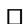
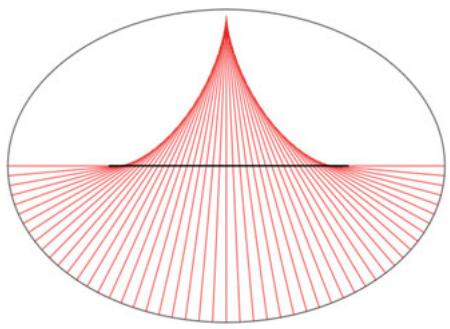

# Chapter 3 Curvature

The idea of a Riemannian metric having curvature, while intuitively appealing and natural, is also often the stumbling block for further progress into the realm of geometry. The most elementary way of defining curvature is to set it up as an integrability condition. This indicates that when it vanishes it should be possible to solve certain differential equations, e.g., that the metric is Euclidean. This was in fact one of Riemann’s key insights.

As we shall observe here and later in sections 5.1 and 6.1.2 one can often take two derivatives (such as in the Hessian) and have them commute in a suitable sense, but taking more derivatives becomes somewhat more difficult to understand. This is what is behind the abstract definitions below and is also related to integrability conditions.

We shall also try to justify curvature on more geometric grounds. The idea is to create what we call the fundamental equations of Riemannian geometry. These equations relate curvature to the Hessian of certain geometrically defined functions (Riemannian submersions onto intervals). These formulas hold all the information that is needed for computing curvatures in many examples and also for studying how curvature influences the metric.

Much of what we do in this chapter carries over to the pseudo-Riemannian setting. The connection and curvature tensor are generalized without changes. But formulas that involve contractions do need modification (see exercise 1.6.10).

# 3.1 Curvature

We introduced in the previous chapter the idea of covariant derivatives of tensors and explained their relation to the classical concepts of gradient, Hessian, and Laplacian. However, the Riemannian metric is parallel and consequently has no meaningful derivatives. Instead, we think of the connection itself as a sort of gradient of the metric. The next question then is, what should the Laplacian and Hessian be? The answer is, curvature.

Any affine connection on a manifold gives rise to a curvature tensor. This operator measures in some sense how far away the connection is from being our standard connection on Rn, which we assume is our canonical curvature-free, or flat, space. On a (pseudo-)Riemannian manifold it is also possible to take traces of this curvature operator to obtain various averaged curvatures.

# 3.1.1 The Curvature Tensor

We shall work exclusively in the Riemannian setting. So let .M; g/ be a Riemannian manifold and the Riemannian connection. The curvature tensor is the .1; 3/-tensor defined by

$$
\begin{array}{l} R (X, Y) Z = \nabla_ {X, Y} ^ {2} Z - \nabla_ {Y, X} ^ {2} Z \\ = \nabla_ {X} \nabla_ {Y} Z - \nabla_ {Y} \nabla_ {X} Z - \nabla_ {[ X, Y ]} Z \\ = \left[ \nabla_ {X}, \nabla_ {Y} \right] Z - \nabla_ {[ X, Y ]} Z. \\ \end{array}
$$

on vector fields X; Y; Z. The first line in the definition is also called the Ricci identity and is often written as

$$
R _ {X, Y} Z = \nabla_ {X, Y} ^ {2} Z - \nabla_ {Y, X} ^ {2} Z.
$$

This also allows us to define the curvature of tensors

$$
R (X, Y) T = R _ {X, Y} T = \nabla_ {X, Y} ^ {2} T - \nabla_ {Y, X} ^ {2} T.
$$

Of course, it needs to be proved that this is indeed a tensor. Since both of the second covariant derivatives are tensorial in X and Y, we need only check that R is tensorial in Z: This is easily done:

$$
\begin{array}{l} R (X, Y) f Z = \nabla_ {X, Y} ^ {2} (f Z) - \nabla_ {Y, X} ^ {2} (f Z) \\ = f \nabla_ {X, Y} ^ {2} (Z) - f \nabla_ {Y, X} ^ {2} (Z) \\ + \left(\nabla_ {X, Y} ^ {2} f\right) Z - \left(\nabla_ {Y, X} ^ {2} f\right) Z \\ + \left(\nabla_ {Y} f\right) \nabla_ {X} Z + \left(\nabla_ {X} f\right) \nabla_ {Y} Z \\ - \left(\nabla_ {X} f\right) \nabla_ {Y} Z - \left(\nabla_ {Y} f\right) \nabla_ {X} Z \\ = f \left(\nabla_ {X, Y} ^ {2} (Z) - \nabla_ {Y, X} ^ {2} (Z)\right) \\ = f R (X, Y) Z. \\ \end{array}
$$

# 3.1 Curvature

Observe that X; Y appear skew-symmetrically in $R ( X , Y ) Z \ = \ R _ { X , Y } Z$ , while Z plays its own role on top of the line, hence the unusual notation.

In relation to derivations as explained in section 2.3 note that $R _ { X , Y }$ acts as a derivation on tensors. Moreover, as the Hessian of a function is symmetric $\nabla _ { X , Y } ^ { 2 } f =$ $\nabla _ { Y , X } ^ { 2 } f$ it follows that $R _ { X , Y }$ r Dacts trivially on functions. This is the content of the Ricci ridentity

$$
\nabla_ {X, Y} ^ {2} - \nabla_ {Y, X} ^ {2} = R _ {X, Y} = R (X, Y),
$$

where on the right-hand side we think of R .X; Y/ as a .1; 1/-tensor acting on tensors. As an example note that when T is a .0; k/-tensor then

$$
\begin{array}{l} \left(R _ {X, Y} T\right) \left(X _ {1}, \dots , X _ {k}\right) = \left(R (X, Y) T\right) \left(X _ {1}, \dots , X _ {k}\right) \\ = - T (R (X, Y) X _ {1}, \dots , X _ {k}) \\ \begin{array}{c} \bullet \\ \vdots \\ \bullet \end{array} \\ - T \left(X _ {1}, \dots , R (X, Y) X _ {k}\right). \\ \end{array}
$$

$$
\begin{array}{l} \begin{array}{c} \bullet \\ \vdots \\ \bullet \end{array} \\ - T \left(X _ {1}, \dots , R (X, Y) X _ {k}\right). \\ \end{array}
$$

Using the metric g we can change R to a .0; 4/-tensor as follows:

$$
R (X, Y, Z, W) = g (R (X, Y) Z, W).
$$

We justify next why the variables are treated on a more equal footing in this formula by showing several important symmetry properties.

Proposition 3.1.1. The Riemannian curvature tensor R.X; Y; Z; W/ satisfies the following properties:

(1) R is skew-symmetric in the first two and last two entries:

$$
R (X, Y, Z, W) = - R (Y, X, Z, W) = R (Y, X, W, Z).
$$

(2) R is symmetric between the first two and last two entries:

$$
R (X, Y, Z, W) = R (Z, W, X, Y).
$$

(3) R satisfies a cyclic permutation property called Bianchi’s first identity:

$$
R (X, Y) Z + R (Z, X) Y + R (Y, Z) X = 0.
$$

(4) R satisfies a cyclic permutation property called Bianchi’s second identity:

$$
(\nabla_ {Z} R) _ {X, Y} W + (\nabla_ {X} R) _ {Y, Z} W + (\nabla_ {Y} R) _ {Z, X} W = 0
$$

or

$$
(\nabla_ {Z} R) (X, Y) W + (\nabla_ {X} R) (Y, Z) W + (\nabla_ {Y} R) (Z, X) W = 0.
$$

Proof. The first part of (1) has already been established. For part two of (1) use that ŒX; Y is the vector field defined implicitly by

$$
D _ {X} D _ {Y} f - D _ {Y} D _ {X} f - D _ {[ X, Y ]} f = 0.
$$

In other words, $R ( X , Y ) f = 0$ . This is the idea behind the calculations that follow:

$$
\begin{array}{l} 0 = R _ {X, Y} \frac {1}{2} g (Z, Z) \\ = \frac {1}{2} D _ {X} D _ {Y} g (Z, Z) - \frac {1}{2} D _ {Y} D _ {X} g (Z, Z) - \frac {1}{2} D _ {[ X, Y ]} g (Z, Z) \\ = D _ {X} g \left(\nabla_ {Y} Z, Z\right) - D _ {Y} g \left(\nabla_ {X} Z, Z\right) - g \left(\nabla_ {[ X, Y ]} Z, Z\right) \\ = g (\nabla_ {X} \nabla_ {Y} Z, Z) - g (\nabla_ {Y} \nabla_ {X} Z, Z) - g (\nabla_ {[ X, Y ]} Z, Z) \\ + g \left(\nabla_ {X} Z, \nabla_ {Y} Z\right) - g \left(\nabla_ {X} Z, \nabla_ {Y} Z\right) \\ = g \left(\nabla_ {X, Y} ^ {2} Z, Z\right) - g \left(\nabla_ {Y, X} ^ {2} Z, Z\right) \\ = R (X, Y, Z, Z). \\ \end{array}
$$

Now (1) follows by polarizing the identity $R \left( X , Y , Z , Z \right) = 0$ in Z:

$$
\begin{array}{l} 0 = R (X, Y, Z + W, Z + W) \\ = R (X, Y, Z, Z) + R (X, Y, W, W) \\ + R (X, Y, Z, W) + R (X, Y, W, Z). \\ \end{array}
$$

Part (3) relies on the torsion free property and the definitions from section 2.2.2.4 to first show that

$$
\begin{array}{l} (L _ {X} \nabla) _ {Y} Z = L _ {X} (\nabla_ {Y} Z) - \nabla_ {L _ {X} Y} Z - \nabla_ {Y} L _ {X} Z \\ = \nabla_ {X} \nabla_ {Y} Z - \nabla_ {\nabla_ {X} Y} Z - \nabla_ {Y} \nabla_ {X} Z \\ - \nabla_ {\nabla_ {Y} Z} X + \nabla_ {\nabla_ {Y} X} Z + \nabla_ {Y} \nabla_ {Z} X \\ = R _ {X, Y} Z + \nabla_ {Y, Z} ^ {2} X. \\ \end{array}
$$

The Jacobi identity (see proposition 2.1.6) followed by the torsion free property and the Ricci identity then show that

$$
\begin{array}{l} 0 = (L _ {X} L) _ {Y} Z \\ = (L _ {X} \nabla) _ {Y} Z - (L _ {X} \nabla) _ {Z} Y \\ \end{array}
$$

# 3.1 Curvature

$$
= R _ {X, Y} Z + \nabla_ {Y, Z} ^ {2} X - R _ {X, Z} Y - \nabla_ {Z, Y} ^ {2} X
$$

$$
= R _ {X, Y} Z + R _ {Z, X} Y + R _ {Y, Z} X.
$$

Part (2) is a direct combinatorial consequence of (1) and (3):

$$
\begin{array}{l} R (X, Y, Z, W) = - R (Z, X, Y, W) - R (Y, Z, X, W) \\ = R (Z, X, W, Y) + R (Y, Z, W, X) \\ = - R (W, Z, X, Y) - R (X, W, Z, Y) \\ - R (W, Y, Z, X) - R (Z, W, Y, X) \\ = 2 R (Z, W, X, Y) + R (X, W, Y, Z) + R (W, Y, X, Z) \\ = 2 R (Z, W, X, Y) - R (Y, X, W, Z) \\ = 2 R (Z, W, X, Y) - R (X, Y, Z, W), \\ \end{array}
$$

which implies 2R .X; Y ; Z; W /  2R .Z; W ; X; Y /.

DPart (4) follows from the claim that

$$
(\nabla_ {X} R) _ {Y, Z} W = \nabla_ {X, Y, Z} ^ {3} W - \nabla_ {X, Z, Y} ^ {3} W - \nabla_ {Y, Z, X} ^ {3} W + \nabla_ {Z, Y, X} ^ {3} W + \nabla_ {R _ {Y, Z} X} W.
$$

To see this simply add over the cyclic permutations of X; Y; Z:

$$
\begin{array}{l} (\nabla_ {X} R) _ {Y, Z} W + (\nabla_ {Z} R) _ {X, Y} W + (\nabla_ {Y} R) _ {Z, X} W \\ = \nabla_ {X, Y, Z} ^ {3} W - \nabla_ {X, Z, Y} ^ {3} W - \nabla_ {Y, Z, X} ^ {3} W + \nabla_ {Z, Y, X} ^ {3} W + \nabla_ {R _ {Y, Z} X} W \\ + \nabla_ {Z, X, Y} ^ {3} W - \nabla_ {Z, Y, X} ^ {3} W - \nabla_ {X, Y, Z} ^ {3} W + \nabla_ {Y, X, Z} ^ {3} W + \nabla_ {R _ {X, Y} Z} W \\ + \nabla_ {Y, Z, X} ^ {3} W - \nabla_ {Y, X, Z} ^ {3} W - \nabla_ {Z, X, Y} ^ {3} W + \nabla_ {X, Z, Y} ^ {3} W + \nabla_ {R _ {Z, X} Y} W \\ = \nabla_ {R _ {X, Y} Z + R _ {Z, X} Y + R _ {Y, Z} X} W \\ = 0. \\ \end{array}
$$

The claim can be proven directly but also follows from the two different iterated Ricci identities for taking three derivatives:

$$
\nabla_ {X, Y, Z} ^ {3} W - \nabla_ {Y, X, Z} ^ {3} W = R _ {X, Y} \nabla_ {Z} W - \nabla_ {R _ {X, Y} Z} W
$$

and

$$
\nabla_ {X, Y, Z} ^ {3} W - \nabla_ {X, Z, Y} ^ {3} W = (\nabla_ {X} R) _ {Y, Z} W + R _ {Y, Z} \nabla_ {X} W.
$$

These follow from the various ways one can iterate covariant derivatives (see sections 2.2.2.3 and 2.2.2.5):

$$
\nabla_ {X, Y, Z} ^ {3} W = \nabla_ {X, Y} ^ {2} (\nabla_ {Z} W) - \nabla_ {\nabla_ {X, Y} ^ {2} Z} W
$$

and

$$
\nabla_ {X, Y, Z} ^ {3} W = \nabla_ {X} (\nabla^ {2}) _ {Y, Z} W + \nabla_ {Y, Z} ^ {2} (\nabla_ {X} W)
$$

and then using the Ricci identity.

Example 3.1.2. $( \mathbb { R } ^ { n } , g _ { \mathbb { R } ^ { n } } )$ has $R \equiv 0$ since $\nabla _ { \partial _ { i } } \partial _ { j } = 0$ for the standard Cartesian coordinates.

From the curvature tensor R we can derive several different curvature concepts.

# 3.1.2 The Curvature Operator

First recall that we have the space $\Lambda ^ { 2 } T M$ of bivectors. A decomposable bivector v w can be thought of as the oriented parallelogram spanned by v; w. If $e _ { i }$ is ^an orthonormal basis for $T _ { p } M$ , then the inner product on $\Lambda ^ { 2 } T _ { p } M$ is such that the bivectors $e _ { i } \wedge e _ { j } , i < j$ will form an orthonormal basis. The inner product that $\Lambda ^ { 2 } T M$ ^inherits in this way is also denoted by $g .$ : Note that this inner product on $\Lambda ^ { 2 } T _ { p } M$ has the property that

$$
\begin{array}{l} g (x \wedge y, v \wedge w) = g (x, v) g (y, w) - g (x, w) g (y, v) \\ = \det \binom{g (x, v) g (x, w)}{g (y, v) g (y, w)}. \\ \end{array}
$$

It is also useful to interpret bivectors as skew symmetric maps. This is done via the formula:

$$
(x \wedge y) (v) = g (x, v) y - g (y, v) x.
$$

This represents a skew-symmetric transformation in span $\{ v , w \}$ which is a counterclockwise $9 0 ^ { \circ }$ f grotation when v; w are orthonormal. (We could have used a clockwise rotation as that will in fact work more naturally with our version of the curvature tensor.) Note that

$$
g (x \wedge y, v \wedge w) = g (x, v) g (y, w) - g (x, w) g (y, v) = g ((x \wedge y) (v), w).
$$

These operators satisfy a Jacobi-Bianchi type identity:

$$
(x \wedge y) (z) + (y \wedge z) (x) + (z \wedge x) (y) = 0.
$$

# 3.1 Curvature

From the symmetry properties of the curvature tensor it follows that R defines a symmetric bilinear map

$$
R: \Lambda^ {2} T M \times \Lambda^ {2} T M \to \mathbb {R}
$$

$$
R \left(\sum X _ {i} \wedge Y _ {i}, \sum V _ {j} \wedge W _ {j}\right) = \sum R \left(X _ {i}, Y _ {i}, W _ {j}, V _ {j}\right).
$$

Note the reversal of V and WŠ The relation

$$
g \left(\Re \left(\sum X _ {i} \wedge Y _ {i}\right), \sum V _ {j} \wedge W _ {j}\right) = \sum R \left(X _ {i}, Y _ {i}, W _ {j}, V _ {j}\right)
$$

consequently defines a self-adjoint operator $: \Lambda ^ { 2 } T M \to \Lambda ^ { 2 } T M$ . This operator R W !is called the curvature operator. It is evidently just a different manifestation of the curvature tensor. The switch between V and W is related to our definition of the next curvature concept.

# 3.1.3 Sectional Curvature

For any $v \in T _ { p } M$ let

$$
R _ {v} (w) = R (w, v) v: T _ {p} M \to T _ {p} M
$$

be the directional curvature operator. This operator is also known as the tidal force operator. The latter name describes in physical (general relativity) terms the meaning of the tensor. As we shall see, this is the part of the curvature tensor that directly relates to the metric. The above symmetry properties of R imply that this operator is self-adjoint and that v is always a zero-eigenvector. The normalized biquadratic form

$$
\begin{array}{l} \sec (v, w) = \frac {g \left(R _ {v} (w) , w\right)}{g (v , v) g (w , w) - g (v , w) ^ {2}} \\ = \frac {g (R (w , v) v , w)}{g (v \wedge w , v \wedge w)} \\ \end{array}
$$

is called the sectional curvature of $( v , w )$ . Since the denominator is the square of the area of the parallelogram $\{ t v \ + \ s w \ | \ 0 \ \leq \ t , s \ \leq \ 1 \}$ it is easy to check f Cthat sec.v; w/ depends only on the plane $\pi = \operatorname { s p a n } \{ v , w \}$ g. One of the important D f grelationships between directional and sectional curvature is the following algebraic result by Riemann.

Proposition 3.1.3 (Riemann, 1854). The following properties are equivalent:

(1) $\sec ( \pi ) = k .$ for all 2-planes in $T _ { p } M .$ .   
D(2) R.v1; v2/v3 k .v1 v2/ .v3/ for all $v _ { 1 } , v _ { 2 } , v _ { 3 } \in T _ { p } M .$   
(3) $\begin{array} { r } { { R _ { v } } ( w ) = k \cdot ( w - g ( w , v ) v ) = k \cdot p { r _ { v } } \bot ( w ) \mathrm { { f o r } } a l l w \in { T _ { p } } M a n d | v | = 1 . } \end{array}$   
(4) $\Re \left( \omega \right) = k \cdot \omega f o r a l l \omega \in \Lambda ^ { 2 } T _ { p } M .$

Proof. $( 2 ) \Rightarrow ( 3 ) \Rightarrow ( 1 )$ are easy. For $( 1 ) \Rightarrow ( 2 )$ we introduce the multilinear maps on $T _ { p } M \colon$

$$
R _ {k} (v _ {1}, v _ {2}) v _ {3} = - k \left(v _ {1} \wedge v _ {2}\right) (v _ {3}),
$$

$$
R _ {k} \left(v _ {1}, v _ {2}, v _ {3}, v _ {4}\right) = - k g \left(\left(v _ {1} \wedge v _ {2}\right) \left(v _ {3}\right), v _ {4}\right)
$$

$$
= k g \left(v _ {1} \wedge v _ {2}, v _ {4} \wedge v _ {3}\right).
$$

The first observation is that these maps behave exactly like the curvature tensor in that they satisfy properties (1), (2), and (3) of proposition 3.1.1. Now consider the difference between the curvature tensor and this curvature-like tensor

$$
D \left(v _ {1}, v _ {2}, v _ {3}, v _ {4}\right) = R \left(v _ {1}, v _ {2}, v _ {3}, v _ {4}\right) - R _ {k} \left(v _ {1}, v _ {2}, v _ {3}, v _ {4}\right).
$$

Properties (1), (2), and (3) from proposition 3.1.1 carry over to this difference tensor. Moreover, the assumption that sec k implies

$$
D (v, w, w, v) = 0
$$

for all v; $w \in T _ { p } M$ : Using polarization $w = w _ { 1 } + w _ { 2 }$ we get

$$
\begin{array}{l} 0 = D \left(v, w _ {1} + w _ {2}, w _ {1} + w _ {2}, v\right) \\ = D (v, w _ {1}, w _ {2}, v) + D (v, w _ {2}, w _ {1}, v) \\ = 2 D (v, w _ {1}, w _ {2}, v) \\ = - 2 D \left(v, w _ {1}, v, w _ {2}\right). \\ \end{array}
$$

Using properties (1) and (2) from proposition 3.1.1 it follows that D is alternating in all four variables. That, however, is in violation of Bianchi’s first identity (property (3) from proposition 3.1.1) unless $D = 0$ . This finishes the implication (see also Dexercise 3.4.29 for two other strategies.)

To see why $( 2 ) \Rightarrow ( 4 )$ , choose an orthonormal basis $e _ { i }$ for $T _ { p } M$ then $e _ { i } \wedge e _ { j } , i < j ,$ is a basis for $\Lambda ^ { 2 } T _ { p } M$ . Using (2) it follows that

$$
\begin{array}{l} g \left(\Re \left(e _ {i} \wedge e _ {j}\right), e _ {t} \wedge e _ {s}\right) = R (e _ {i}, e _ {j}, e _ {s}, e _ {t}) \\ = k \cdot \left(g (e _ {j}, e _ {s}) g (e _ {i}, e _ {t}) - g (e _ {i}, e _ {s}) g (e _ {j}, e _ {t})\right) \\ = k \cdot g \left(e _ {i} \wedge e _ {j}, e _ {t} \wedge e _ {s}\right). \\ \end{array}
$$

# 3.1 Curvature

But this implies that

$$
\Re \left(e _ {i} \wedge e _ {j}\right) = k \cdot \left(e _ {i} \wedge e _ {j}\right).
$$

For $( 4 ) \Rightarrow ( 1 )$ just observe that if $\{ v , w \}$ are orthogonal unit vectors, then

$$
k = g \left(\Re (v \wedge w), v \wedge w\right) = \sec (v, w).
$$

A Riemannian manifold $( M , g )$ that satisfies either of these four conditions for all $p \in M$ and the same $k \in \mathbb { R }$ for all $p \in M$ is said to have constant curvature k. $\mathrm { \bf S o }$ 2far we only know that $( \mathbb { R } ^ { n } , g _ { \mathbb { R } ^ { n } } )$ 2has curvature zero. In sections 4.2.1 and 4.2.3 we shall prove that the space forms $S _ { k } ^ { n }$ as described in example 1.4.6 have constant curvature k.

# 3.1.4 Ricci Curvature

Our next curvature is the Ricci curvature, which can be thought of as the Laplacian of $g .$ :

The Ricci curvature Ric is a trace or contraction of R. If $e _ { 1 } , \ldots , e _ { n } \in T _ { p } M$ is an orthonormal basis, then

$$
\begin{array}{l} \operatorname{Ric} (v, w) = \operatorname{tr} (x \mapsto R (x, v) w) \\ = \sum_ {i = 1} ^ {n} g \left(R \left(e _ {i}, v\right) w, e _ {i}\right) \\ = \sum_ {i = 1} ^ {n} g (R (v, e _ {i}) e _ {i}, w) \\ = \sum_ {i = 1} ^ {n} g \left(R \left(e _ {i}, w\right) v, e _ {i}\right). \\ \end{array}
$$

Thus Ric is a symmetric bilinear form. It could also be defined as the symmetric .1; 1/-tensor

$$
\operatorname{Ric} (v) = \sum_ {i = 1} ^ {n} R \left(v, e _ {i}\right) e _ {i}.
$$

We adopt the language that Ric $\geq k$ if all eigenvalues of $\operatorname { R i c } ( v )$ are  k. In $( 0 , 2 )$ language this means that Ric $( v , v ) \ \geq \ k g \ ( v , v )$ for all v: When $( M , g )$ satisfies $\operatorname { R i c } ( v ) = k \cdot v$ , or equivalently Ric $( v , w ) = k \cdot g ( v , w )$ , then $( M , g )$ is said to be an

Einstein manifold with Einstein constant k. If .M; g/ has constant curvature k, then $( M , g )$ is also Einstein with Einstein constant $( n - 1 ) k$ .

In chapter 4 we shall exhibit several interesting Einstein metrics that do not have constant curvature. Three basic types are

(1) The product metric $S ^ { n } ( 1 ) \times S ^ { n } ( 1 )$ with Einstein constant n 1 (see section 4.2.2).   
-(2) The Fubini-Study metric on $\mathbb { C P } ^ { n }$ with Einstein constant $2 n + 2$ (see section 4.5.3).   
(3) The generalized Schwarzschild metric on $\mathbb { R } ^ { 2 } \times S ^ { n - 2 } , n \geq 4$ , which is a doubly warped product metric: $d r ^ { 2 } + \phi ^ { 2 } ( r ) d \theta ^ { 2 } + \rho ^ { 2 } ( r ) d s _ { n - 2 } ^ { 2 }$ with Einstein constant 0 (see section 4.2.5).

If $v \in T _ { p } M$ is a unit vector and we complete it to an orthonormal basis $\{ v , e _ { 2 } , \ldots , e _ { n } \}$ for $T _ { p } M$ , then

$$
\operatorname{Ric} (v, v) = g (R (v, v) v, v) + \sum_ {i = 2} ^ {n} g (R (e _ {i}, v) v, e _ {i}) = \sum_ {i = 2} ^ {n} \sec (v, e _ {i}).
$$

Thus, when $n \ = \ 2$ , there is no difference from an informational point of view Din knowing R or Ric. This is actually also true in dimension $n = 3$ , because if $\{ e _ { 1 } , e _ { 2 } , e _ { 3 } \}$ is an orthonormal basis for $T _ { p } M$ , then

$$
\begin{array}{l} \sec \left(e _ {1}, e _ {2}\right) + \sec \left(e _ {1}, e _ {3}\right) = \operatorname{Ric} \left(e _ {1}, e _ {1}\right), \\ \sec \left(e _ {1}, e _ {2}\right) + \sec \left(e _ {2}, e _ {3}\right) = \operatorname{Ric} \left(e _ {2}, e _ {2}\right), \\ \sec \left(e _ {1}, e _ {3}\right) + \sec \left(e _ {2}, e _ {3}\right) = \operatorname{Ric} \left(e _ {3}, e _ {3}\right). \\ \end{array}
$$

In other words:

$$
\left[ \begin{array}{c c c} 1 & 0 & 1 \\ 1 & 1 & 0 \\ 0 & 1 & 1 \end{array} \right] \left[ \begin{array}{c} \sec \left(e _ {1}, e _ {2}\right) \\ \sec \left(e _ {2}, e _ {3}\right) \\ \sec \left(e _ {1}, e _ {3}\right) \end{array} \right] = \left[ \begin{array}{c} \operatorname{Ric} \left(e _ {1}, e _ {1}\right) \\ \operatorname{Ric} \left(e _ {2}, e _ {2}\right) \\ \operatorname{Ric} \left(e _ {3}, e _ {3}\right) \end{array} \right].
$$

As the matrix has det 2 any sectional curvature can be computed from Ric. DIn particular, we see that $( M ^ { 3 } , g )$ is Einstein if and only if $( M ^ { 3 } , g )$ has constant sectional curvature. Therefore, the search for Einstein metrics that do not have constant curvature naturally begins in dimension 4.

# 3.1.5 Scalar Curvature

The last curvature quantity we define here is the scalar curvature:

$$
\operatorname{scal} = \operatorname{tr} (\operatorname{Ric}) = 2 \cdot \operatorname{tr} \Re .
$$

# 3.1 Curvature

Notice that scal depends only on $p \in M ,$ , so we obtain a function scal $M \to \mathbb { R }$ . In an orthonormal basis $e _ { 1 } , \ldots , e _ { n }$ 2for $T _ { p } M$ W !it can be calculated from the curvature tensor in several ways:

$$
\begin{array}{l} \operatorname{scal} = \operatorname{tr} (\text { Ric }) \\ = \sum_ {j = 1} ^ {n} g (\operatorname{Ric} (e _ {j}), e _ {j}) \\ = \sum_ {j = 1} ^ {n} \sum_ {i = 1} ^ {n} g \left(R \left(e _ {i}, e _ {j}\right) e _ {j}, e _ {i}\right) \\ = \sum_ {i, j = 1} ^ {n} g \left(\Re \left(e _ {i} \wedge e _ {j}\right), e _ {i} \wedge e _ {j}\right) \\ = 2 \sum_ {i <   j} g \left(\Re \left(e _ {i} \wedge e _ {j}\right), e _ {i} \wedge e _ {j}\right) \\ = 2 \operatorname{tr} \Re \\ = 2 \sum_ {i <   j} \sec \left(e _ {i}, e _ {j}\right). \\ \end{array}
$$

When $n = 2$ it follows that scal $( p ) = 2 \cdot \sec ( T _ { p } M )$ . In section 4.2.3 we exhibit D D examples of scalar flat metrics that are not Ricci flat when $n \geq 3$ . There is also another interesting phenomenon in dimensions 3 related to scalar curvature.

Lemma 3.1.4 (Schur, 1886). Suppose that a Riemannian manifold $( M , g )$ of dimension $n \geq 3$ satisfies either one of the following two conditions for a function $f : M \to \mathbb { R }$

(1) $\sec ( \pi ) = f ( p ) f o r a l l 2 \ – p l a n e s \pi \subset T _ { p } M , p \in M ,$   
(2) $\mathrm { R i c } ( v ) = ( n - 1 ) \cdot f ( p ) \cdot v f o r a l l v \in T _ { p } M , p \in M .$

Then f must be constant. In other words, the metric has constant curvature or is Einstein, respectively.

Proof. It suffices to show (2), as the conditions for (1) imply that (2) holds. To show (2) we need an important identity relating derivatives of the scalar curvature and the .0; 2/-version of the Ricci tensor:

$$
d \mathrm{scal} = - 2 \nabla^ {*} \mathrm{Ric}.
$$

Let us see how this implies (2). First note that

$$
\begin{array}{l} d \text { scal } = d \text { tr   (Ric) } \\ = d (n \cdot (n - 1) \cdot f) \\ = n \cdot (n - 1) \cdot d f. \\ \end{array}
$$

On the other hand using the definition of the adjoint from section 2.2.2; the product rule; and $\nabla g = 0$ we obtain

$$
\begin{array}{l} - \nabla^ {*} \operatorname{Ric} (X) = (n - 1) (\nabla_ {E _ {i}} (f g)) (E _ {i}, X) \\ = (n - 1) \left(\nabla_ {E _ {i}} f\right) g \left(E _ {i}, X\right) + (n - 1) f \left(\nabla_ {E _ {i}} g\right) \left(E _ {i}, X\right) \\ = (n - 1) d f \left(g \left(E _ {i}, X\right) E _ {i}\right) \\ = (n - 1) d f (X). \\ \end{array}
$$

This shows that $n \cdot d f = 2 \cdot d f$ and consequently: $n = 2$ or $d f \equiv 0$ (i.e., f is constant).

□

Proposition 3.1.5 (The Contracted Bianchi Identify). On any Riemannian manifold the scalar and Ricci curvature are related by

$$
d \mathrm{tr} (\mathrm{Ric}) = d \mathrm{scal} = - 2 \nabla^ {*} \mathrm{Ric}.
$$

Proof. The identity is proved by a calculation that relies the second Bianchi identity (property (4) from proposition 3.1.1). Using that contractions and covariant differentiation commute (see exercise 2.5.9) we obtain

$$
\begin{array}{l} d \operatorname{scal} (W) | _ {p} = D _ {W} \operatorname{scal} \\ = \sum (\nabla_ {W} R) (E _ {i}, E _ {j}, E _ {j}, E _ {i}) \\ = - \sum (\nabla_ {E _ {j}} R) (W, E _ {i}, E _ {j}, E _ {i}) \\ - \sum (\nabla_ {E _ {i}} R) (E _ {j}, W, E _ {j}, E _ {i}) \\ = 2 \sum \left(\nabla_ {E _ {j}} R\right) \left(E _ {i}, W, E _ {j}, E _ {i}\right) \\ = 2 \sum \left(\nabla_ {E _ {j}} R\right) \left(E _ {j}, E _ {i}, E _ {i}, W\right) \\ = 2 \sum g \left(\left(\nabla_ {E _ {j}} \operatorname{Ric}\right) (E _ {j}, W)\right) \\ = - 2 \left(\nabla^ {*} \operatorname{Ric}\right) (W) (p). \\ \end{array}
$$

Corollary 3.1.6. An $n \left( > 2 \right)$ -dimensional Riemannian manifold $( M , g )$ is Einstein if and only if

$$
\mathrm{Ric} = \frac {\mathrm{scal}}{n} g.
$$

# 3.1 Curvature

# 3.1.6 Curvature in Local Coordinates

As with the connection it is sometimes convenient to know what the curvature tensor looks like in local coordinates. We first observe that when $X = X ^ { i } \partial _ { i } , Y = Y ^ { j } \partial _ { j }$ , $Z = Z ^ { k } \partial _ { k }$ , then

$$
R (X, Y) Z = X ^ {i} Y ^ {j} Z ^ {k} R _ {i j k} ^ {l} \partial_ {l},
$$

$$
R _ {i j k} ^ {l} \partial_ {l} = R (\partial_ {i}, \partial_ {j}) \partial_ {k}.
$$

Using the definition of R we can calculate $R _ { i j k } ^ { l }$ in terms of the Christoffel symbols (see section 2.4)

$$
\begin{array}{l} R _ {i j k} ^ {l} \partial_ {l} = R (\partial_ {i}, \partial_ {j}) \partial_ {k} \\ = \nabla_ {\partial_ {i}} \nabla_ {\partial_ {j}} \partial_ {k} - \nabla_ {\partial_ {j}} \nabla_ {\partial_ {i}} \partial_ {k} \\ = \nabla_ {\partial_ {i}} \left(\Gamma_ {j k} ^ {s} \partial_ {s}\right) - \nabla_ {\partial_ {j}} \left(\Gamma_ {i k} ^ {t} \partial_ {t}\right) \\ = \partial_ {i} (\Gamma_ {j k} ^ {s}) \partial_ {s} + \Gamma_ {j k} ^ {s} \nabla_ {\partial_ {i}} \partial_ {s} \\ - \partial_ {j} (\Gamma_ {i k} ^ {t}) \partial_ {t} - \Gamma_ {i k} ^ {t} \nabla_ {\partial_ {j}} \partial_ {t} \\ = \partial_ {i} (\Gamma_ {j k} ^ {l}) \partial_ {l} - \partial_ {j} (\Gamma_ {i k} ^ {l}) \partial_ {l} \\ + \Gamma_ {j k} ^ {s} \Gamma_ {i s} ^ {l} \partial_ {l} - \Gamma_ {i k} ^ {t} \Gamma_ {j t} ^ {l} \partial_ {l} \\ = \left(\partial_ {i} \Gamma_ {j k} ^ {l} - \partial_ {j} \Gamma_ {i k} ^ {l} + \Gamma_ {j k} ^ {s} \Gamma_ {i s} ^ {l} - \Gamma_ {i k} ^ {s} \Gamma_ {j s} ^ {l}\right) \partial_ {l}. \\ \end{array}
$$

So

$$
R _ {i j k} ^ {l} = \partial_ {i} \Gamma_ {j k} ^ {l} - \partial_ {j} \Gamma_ {i k} ^ {l} + \Gamma_ {j k} ^ {s} \Gamma_ {i s} ^ {l} - \Gamma_ {i k} ^ {s} \Gamma_ {j s} ^ {l}.
$$

Similarly we also have

$$
R _ {i j k l} = \partial_ {i} \Gamma_ {j k, l} - \partial_ {j} \Gamma_ {i k, l} + g ^ {s t} \Gamma_ {i k, s} \Gamma_ {j l, t} - g ^ {s t} \Gamma_ {j k, s} \Gamma_ {i l, t}.
$$

These coordinate expression can also be used, in conjunction with the properties of the Christoffel symbols (see section 2.4), to prove all of the symmetry properties of the curvature tensor.

The formula clearly simplifies if we are at a point p where $\Gamma _ { i j } ^ { k } | _ { p } = 0$

$$
R _ {i j k} ^ {l} | _ {p} = \partial_ {i} \Gamma_ {j k} ^ {l} | _ {p} - \partial_ {j} \Gamma_ {i k} ^ {l} | _ {p}.
$$

If we use the formulas for the Christoffel symbols in terms of the metric we can create an expression for $R _ { i j k } ^ { l }$ that depends on the metric $g _ { i j }$ and its first two derivatives.

Remark 3.1.7. One often sees the following index notation for Ricci and scalar curvature in the literature

$$
\mathrm{Ric} _ {i j} = R _ {i j} = R _ {i j k} ^ {k} = g ^ {k l} R _ {k i j l},
$$

$$
\mathrm{scal} = R = g ^ {i j} R _ {i j}.
$$

The idea behind this notation is that these tensors are gotten by contracting indices in the curvature tensor. In this case the full curvature tensor R is denoted Rm so that it isn’t confused with scalar curvature.

Remark 3.1.8. Due to how we wrote the .0; 4/ version of R we write

$$
R _ {i j k l} = g _ {s l} R _ {i j k} ^ {s} = R \left(\partial_ {i}, \partial_ {j}, \partial_ {k}, \partial_ {l}\right).
$$

Other conventions such as

$$
R _ {l i j k} = g _ {s l} R _ {i j k} ^ {s}
$$

are also used in the literature.

# 3.2 The Equations of Riemannian Geometry

In this section we will see that curvature comes up naturally in the investigation of certain types of functions. This will lead us to a collection of formulas that will facilitate the calculation of the curvature tensor of rotationally symmetric and doubly warped product metrics (see section 4.2).

# 3.2.1 Curvature Equations

We start with the goal of calculating the curvatures on a Riemannian manifold using various geometric concepts that relate to a specific smooth function $f : M \to \mathbb { R }$ . Often this function will only be smooth on an open subset $O \subset M$ W !in which case we just confine our attention to what happens on that subset.

The function has a gradient f and a Hessian Hess f . We shall also use $S \left( X \right) =$ $\nabla _ { X } \nabla f$ rfor the .1; 1/-tensor that corresponds to Hess f and ${ \mathrm { H e s s } } ^ { 2 } f$ Dfor the .0; 2/- r rtensor that corresponds to $S ^ { 2 } = S \circ S$ .

D ıThe second fundamental form of a hypersurface $H ^ { n - 1 } \subset M ^ { n }$ with a fixed unit normal vector field $N : H  T ^ { \perp } H = \{ v \in T _ { p } M | p \in H , v \perp T _ { p } H \}$ is defined as the .0; 2/-tensor II $\left( { \cal X } , { \cal Y } \right) \ = \ g \left( \nabla _ { \cal X } N , { \cal Y } \right)$ 2 j 2on H. Since $X , Y , [ X , Y ] ~ \in ~ T H$ are perpendicular to N we have

# 3.2 The Equations of Riemannian Geometry

$$
\begin{array}{l} g (\nabla_ {X} N, Y) = D _ {X} g (N, Y) - g (N, \nabla_ {X} Y) \\ = - g (N, \nabla_ {X} Y) \\ = - g (N, \nabla_ {Y} X) \\ = g \left(\nabla_ {Y} N, X\right). \\ \end{array}
$$

This shows that II is symmetric. Note also that

$$
g (\nabla_ {X} N, N) = \frac {1}{2} D _ {X} | N | ^ {2} = 0.
$$

So we can also define II $\left( { { X , Y } } \right) = g \left( { { \nabla _ { X } } N , Y } \right)$ when $X \in T H$ , as $\nabla _ { X } N$ has no normal component.

For the remainder of this section assume that f is given and that $H \subset f ^ { - 1 } \left( a \right)$ is open and consists entirely of regular points for $f .$ . In this case H is clearly a hypersurface. We start by relating the second fundamental form of H to f .

# Proposition 3.2.1. The following properties hold:

(1) $\begin{array} { r } { N = \frac { \nabla f } { | \nabla f | } } \end{array}$ is a unit normal to H,   
(2) $\begin{array} { r } { \operatorname { I I } \left( X , Y \right) = \frac { 1 } { \left| \nabla f \right| } } \end{array}$ Hess f .X; Y/ for all $X , Y \in T H ,$ , and   
(3) Hess $\begin{array} { r } { f \left( \nabla f , X \right) = \frac { 1 } { 2 } D _ { X } \left| \nabla f \right| ^ { 2 } } \end{array}$ for all $X \in T M .$ .

Proof. (1) Clearly $\begin{array} { r } { N = \frac { \nabla f } { | \nabla f | } } \end{array}$ has unit length. It is perpendicular to H since $D _ { X } f = 0$ D jr j for any vector field tangent to H.

(2) Using that choice of a normal vector tells us that when X; $Y \in T H$ :

$$
\begin{array}{l} \Pi (X, Y) = g \left(\nabla_ {X} \frac {\nabla f}{| \nabla f |}, Y\right) \\ = g \left(\frac {1}{| \nabla f |} \nabla_ {X} \nabla f, Y\right) + g \left(D _ {X} \left(\frac {1}{| \nabla f |}\right) \nabla f, Y\right) \\ = \frac {1}{| \nabla f |} \operatorname{Hess} f (X, Y). \\ \end{array}
$$

(3) Finally the symmetry of Hess f implies:

$$
\operatorname{Hess} f (\nabla f, X) = g (\nabla_ {\nabla f} \nabla f, X) = g (\nabla_ {X} \nabla f, \nabla f) = \frac {1}{2} D _ {X} | \nabla f | ^ {2}.
$$

Our first fundamental equation is the calculation of what’s called the radial curvatures.

Theorem 3.2.2 (The Radial Curvature Equation). When $H \subset f ^ { - 1 }$ .a/ consists of regular points for f we have:

$$
\left(\nabla_ {\nabla f} S\right) (X) + S ^ {2} (X) - \nabla_ {X} (S (\nabla f)) = - R (X, \nabla f) \nabla f,
$$

$$
\nabla_ {\nabla f} \operatorname{Hess} f + \operatorname{Hess} ^ {2} f - \operatorname{Hess} \left(\frac {1}{2} | \nabla f | ^ {2}\right) = - R (\cdot , \nabla f, \nabla f, \cdot),
$$

and

$$
L _ {\nabla f} \operatorname{Hess} f - \operatorname{Hess} ^ {2} f - \operatorname{Hess} \left(\frac {1}{2} | \nabla f | ^ {2}\right) = - R (\cdot , \nabla f, \nabla f, \cdot).
$$

Proof. The first formula is a straightforward computation.

$$
\begin{array}{l} - R _ {\nabla f} (X) = - R (X, \nabla f) \nabla f \\ = - \nabla_ {X, \nabla f} ^ {2} \nabla f + \nabla_ {\nabla f, X} ^ {2} \nabla f \\ = - \left(\nabla_ {X} S\right) (\nabla f) + \left(\nabla_ {\nabla f} S\right) (X) \\ = - \nabla_ {X} (S (\nabla f)) + \nabla_ {\nabla_ {X} \nabla f} \nabla f + (\nabla_ {\nabla f} S) (X) \\ = - \nabla_ {X} (S (\nabla f)) + S ^ {2} (X) + (\nabla_ {\nabla f} S) (X). \\ \end{array}
$$

The second formula follows by the definition of ${ \mathrm { H e s s } } ^ { 2 } f ;$ observing that the gradient of $\scriptstyle { \frac { 1 } { 2 } } \left| \nabla f \right| ^ { 2 }$ is $\nabla _ { \nabla f } \nabla f ;$ and that covariant differentiation commutes with type change jr j rr r(see exercise 2.5.9):

$$
\left(\nabla_ {N} \operatorname{Hess} f\right) (X, Y) = g \left(\left(\nabla_ {N} S\right) (X), Y\right).
$$

The final formula is a consequence of

$$
\begin{array}{l} \left(L _ {\nabla f} \operatorname{Hess} f\right) (X, Y) = \left(\nabla_ {\nabla f} \operatorname{Hess} f\right) (X, Y) \\ + \operatorname{Hess} f (\nabla_ {X} \nabla f, Y) + \operatorname{Hess} f (X, \nabla_ {Y} \nabla f) \\ = \left(\nabla_ {\nabla f} \operatorname{Hess} f\right) (X, Y) + 2 \operatorname{Hess} ^ {2} f (X, Y). \\ \end{array}
$$

Remark 3.2.3. The last formula is particularly interesting as it shows how suitable curvatures can be calculated using only gradients of functions and Lie derivatives, i.e., covariant derivatives are not necessary.

The following two fundamental equations are also known as the Gauss equations and Peterson-Codazzi-Mainardi equations, respectively. They will be proved simultaneously but stated separately. For a vector we use the notation

$$
\begin{array}{l} X = X ^ {\top} + X ^ {\perp} \\ = X - g (X, N) N + g (X, N) N \\ \end{array}
$$

for decomposing it into components that are tangential and normal to H. We use the notation that gH is the metric g restricted to H and that the curvature on H is $R ^ { H }$

Theorem 3.2.4 (The Tangential Curvature Equation).

$$
g \left(R (X, Y) Z, W\right) = g _ {H} \left(R ^ {H} (X, Y) Z, W\right) - \amalg \left(X, W\right) \amalg (Y, Z) + \amalg (X, Z) \amalg \left(Y, W\right),
$$

where X; Y; Z; W are tangent to H.

Theorem 3.2.5 (The Normal or Mixed Curvature Equation).

$$
g \left(R (X, Y) Z, N\right) = - \left(\nabla_ {X} \mathrm{II}\right) (Y, Z) + \left(\nabla_ {Y} \mathrm{II}\right) (X, Z),
$$

where X; Y; Z are tangent to H.

Proof. The proofs hinge on the important fact that if X; Y are vector fields that are tangent to H, then:

$$
\begin{array}{l} \nabla_ {X} ^ {H} Y = (\nabla_ {X} Y) ^ {\top} \\ = \nabla_ {X} Y - g (\nabla_ {X} Y, N) N \\ = \nabla_ {X} Y + \operatorname{II} (X, Y) N. \\ \end{array}
$$

Here the first equality is a consequence of the uniqueness of the Riemannian connection on H. One can check either that $( \nabla _ { X } Y ) ^ { \top }$ satisfies properties (1)–(4) rof a Riemannian connection (see theorem 2.2.2) or alternatively that it satisfies the Koszul formula. The latter task is almost immediate. The other equalities are immediate from our definitions.

The curvature equations that involve the second fundamental form are verified by calculating R.X; Y/Z using $\nabla _ { X } Y = \nabla _ { X } ^ { H } Y - \operatorname { I I } ( X , Y ) N$ .

$$
\begin{array}{l} R (X, Y) Z = \nabla_ {X} \nabla_ {Y} Z - \nabla_ {Y} \nabla_ {X} Z - \nabla_ {[ X, Y ]} Z \\ = \nabla_ {X} (\nabla_ {Y} ^ {H} Z - \mathrm{II} (Y, Z) N) - \nabla_ {Y} (\nabla_ {X} ^ {H} Z - \mathrm{II} (X, Z) N) \\ - \nabla_ {[ X, Y ]} ^ {H} Z + \mathrm{II} ([ X, Y ], Z) N \\ = \nabla_ {X} \nabla_ {Y} ^ {H} Z - \nabla_ {Y} \nabla_ {X} ^ {H} Z - \nabla_ {[ X, Y ]} ^ {H} Z \\ - \nabla_ {X} (\mathrm{II} (Y, Z) N) + \nabla_ {Y} (\mathrm{II} (X, Z) N) + \mathrm{II} ([ X, Y ], Z) N \\ = R ^ {H} (X, Y) Z - \operatorname{II} \left(X, \nabla_ {Y} ^ {H} Z\right) N + \operatorname{II} (Y, \nabla_ {X} ^ {H} Z) N \\ - \left(D _ {X} \amalg (Y, Z)\right) N - \amalg (Y, Z) \nabla_ {X} N + \left(D _ {Y} \amalg (X, Z)\right) N + \amalg (X, Z) \nabla_ {Y} N \\ + \mathrm{II} (\nabla_ {X} Y, Z) N - \mathrm{II} (\nabla_ {Y} X, Z) N \\ = R ^ {H} (X, Y) Z - \operatorname{II} (X, \nabla_ {Y} Z) N + \operatorname{II} (Y, \nabla_ {X} Z) N \\ - \left(D _ {X} \amalg (Y, Z)\right) N - \amalg (Y, Z) \nabla_ {X} N + \left(D _ {Y} \amalg (X, Z)\right) N + \amalg (X, Z) \nabla_ {Y} N \\ \end{array}
$$

$$
\begin{array}{l} + \operatorname{II} (\nabla_ {X} Y, Z) N - \operatorname{II} (\nabla_ {Y} X, Z) N \\ = R ^ {H} (X, Y) Z - \operatorname{II} (Y, Z) \nabla_ {X} N + \operatorname{II} (X, Z) \nabla_ {Y} N \\ + \left(- \left(\nabla_ {X} \text {II}\right) (Y, Z) + \left(\nabla_ {Y} \text {II}\right) (X, Z)\right) N. \\ \end{array}
$$

To finish we just need to recall the definition of II in terms of N.

These three fundamental equations give us a way of computing curvature tensors by induction on dimension. More precisely, if we know how to do computations on H and also how to compute S, then we can compute any curvature in M at a point in H. We shall clarify and exploit this philosophy in subsequent chapters.

Here we confine ourselves to some low dimensional observations. Recall that the three curvature quantities sec, Ric, and scal obeyed some special relationships in dimensions 2 and 3 (see sections 3.1.4 and 3.1.5). Curiously enough this also manifests itself in our three fundamental equations.

If M has dimension 1, then dim $H = 0$ . This is related to the fact that $R \equiv 0$ on all 1 dimensional spaces.

If M has dimension 2, then dim $H = 1$ . Thus $R ^ { H } \equiv 0$ and the three vectors D X; Y, and Z are proportional. Thus only the radial curvature equation is relevant. The curvature is also calculated in example 3.2.12.

When M has dimension 3, then dim H  2. The radial curvature equation is not Dsimplified, but in the other two equations one of the three vectors X; Y; Z is a linear combination of the other two. We might as well assume that $X \perp Y$ and $Z = X$ or Y. So, if $\{ X , Y , N \}$ ? Drepresents an orthonormal frame, then the complete curvature f gtensor depends on the quantities: $g ( R ( X , N ) N , Y ) , g ( R ( X , N ) N , X ) , g ( R ( Y , N ) N , Y )$ , g.R.X; Y/Y; X/, g.R.X; Y/Y; N/, g.R.Y; X/X; N/. The first three quantities can be computed from the radial curvature equation, the fourth from the tangential curvature equation, and the last two from the mixed curvature equation.

In the special case where $M ^ { 3 } = \mathbb { R } ^ { 3 }$ we have $R = 0$ . The tangential curvature D Dequation is particularly interesting as it becomes the classical Gauss equation. If we assume that $E _ { 1 } , E _ { 2 }$ is an orthonormal basis for $T _ { p } M _ { : }$ , then

$$
\begin{array}{l} \sec \left(T _ {p} H\right) = R ^ {H} \left(E _ {1}, E _ {2}, E _ {2}, E _ {1}\right) \\ = \mathrm{II} \left(E _ {1}, E _ {1}\right) \mathrm{II} \left(E _ {2}, E _ {2}\right) - \mathrm{II} \left(E _ {1}, E _ {2}\right) \mathrm{II} \left(E _ {1}, E _ {2}\right) \\ = \det [ \mathrm{II} ]. \\ \end{array}
$$

This was Gauss’s wonderful observation! Namely, that the extrinsic quantity det ŒII for H is actually the intrinsic quantity, sec $( T _ { p } H )$ . The two mixed curvature equations are the classical Peterson-Codazzi-Mainardi equations.

Finally, in dimension 4 everything reaches its most general level. We can start with an orthonormal frame $\{ X , Y , Z , N \}$ and there are potentially twenty different fcurvature quantities to compute.

# 3.2.2 Distance Functions

The formulas in the previous section become simpler and more significant if we start by making assumptions about the function. The geometrically defined functions we shall study are distance functions. As we don’t have a concept of distance yet, we define $r : O \to \mathbb { R }$ , where $O \subset \mathsf { ( } M , g )$ is open, to be a distance function if $| \boldsymbol { \nabla } \boldsymbol { r } | \equiv 1$ W ! on O. Distance functions are then simply solutions to the Hamilton-Jacobi jr j equation or eikonal equation $| \boldsymbol { \nabla } r | ^ { 2 } = 1$ : This is a nonlinear first-order PDE and can jr j Dbe solved by the method of characteristics (see e.g. [6]). For now we shall assume that solutions exist and investigate their properties. Later, after we have developed the theory of geodesics, we establish the existence of such functions on general Riemannian manifolds and also justify their name.

Example 3.2.6. On $( \mathbb { R } ^ { n } , g _ { \mathbb { R } ^ { n } } )$ define $r ( x ) = | x - y | = | x y |$ . Then r is smooth on $\mathbb { R } ^ { n } - \{ y \}$ and has $| \boldsymbol { \nabla } \boldsymbol { r } | \equiv 1$ D j  j D j. If we have two different points $\{ y , z \}$ , then

$$
r (x) = | x \{y, z \} | = \min \{| x - y |, | x - z | \}
$$

is smooth away from $\{ y , z \}$ and the hyperplane $\{ x \in \mathbb { R } ^ { n } \mid | x - y | = | x - z | \}$ equidistant from y and z.

Example 3.2.7. If $H \subset \mathbb { R } ^ { n }$ is a submanifold, then it can be shown that

$$
r (x) = | x H | = \inf \{| x y | = | x - y | \mid y \in H \}
$$

is a distance function on some open set $O \subset \mathbb { R } ^ { n }$ . When H is an orientable hypersurface this can justified as follows. Since H is orientable, it is possible to choose a unit normal vector field N on H. Now coordinatize $\mathbb { R } ^ { n }$ using $x = t N + y$ , where $t \in \mathbb { R } , y \in H$ D C. In some neighborhood O of H these coordinates are actually 2 2well-defined. In other words, there is a function $\varepsilon ( y ) : H \to ( 0 , \infty )$ such that any point in

$$
O = \{t N + y \mid y \in H, | t | <   \varepsilon (y) \}
$$

has unique coordinates $( t , y )$ . We can define r.x/  t on O or $f ( x ) = | x H | = | t |$ on $O - H$ D D j j D j j. Both functions will then define distance functions on their respective domains. Here r is usually referred to as the signed distance to H, while f is just the regular distance.

On $I \times H$ , where $I \subset \mathbb { R }$ , is an interval we have metrics of the form $d r ^ { 2 } + g _ { r } ,$ , where $d r ^ { 2 }$ is the standard metric on I and $g _ { r }$ is a metric on $\{ r \} \times H$ Cthat depends on r. In this case the projection $I \times H \to I$ f g -is a distance function. Special cases of - !this situation are rotationally symmetric metrics, doubly warped products, and our submersion metrics on I  S2n1. $I \times S ^ { 2 n - 1 }$

Lemma 3.2.8. Let $r : O \to I \subset \mathbb { R } ,$ , where O is an open set in Riemannian manifold. W ! The function r is a distance function if and only if it is a Riemannian submersion.

Proof. In general, we have dr $\boldsymbol { \mathbf { \ell } } ( v ) = g ( \nabla \boldsymbol { r } , v )$ , so $D r ( v ) = d r ( v ) \partial _ { t } = 0$ if and only if $\boldsymbol { v } ~ \perp ~ \nabla \boldsymbol { r }$ D r D D: Thus, v is perpendicular to the kernel of Dr if and only if it is ? rproportional to r: For such $\boldsymbol { v } = \alpha \nabla \boldsymbol { r }$ the differential is

$$
D r (v) = \alpha D r (\nabla r) = \alpha g (\nabla r, \nabla r) \partial_ {t}.
$$

Now $\partial _ { t }$ has length 1 in I, so

$$
| v | = | \alpha | | \nabla r |,
$$

$$
| D r (v) | = | \alpha | | \nabla r | ^ {2}.
$$

Thus, r is a Riemannian submersion if and only if $| \boldsymbol { \nabla } \boldsymbol { r } | = 1$ .

□

Before continuing we introduce some simplifying notation. A distance function $r : O \to \mathbb { R }$ is fixed on an open subset $O \subset \mathsf { \Gamma } ( M , g )$ of a Riemannian manifold. W ! The gradient r will usually be denoted by $\partial _ { r } \ = \ \nabla r$ . The $\partial _ { r }$ notation comes rfrom our warped product metrics $d r ^ { 2 } + g _ { r }$ D r. The level sets for r are denoted $O _ { r } =$ $\left\{ x \in O \mid r \left( x \right) = r \right\}$ C, and the induced metric on $O _ { r }$ is $g _ { r }$ . In this spirit $\nabla ^ { r }$ D; Rr are the f 2 j D gRiemannian connection and curvature on $( O _ { r } , g _ { r } )$ . Since $| \boldsymbol { \nabla } \boldsymbol { r } | = 1$ rwe have that Hess $r = \mathrm { ~ I I ~ }$ jr j D and S is the .1; 1/-tensor corresponding to both Hess r and II. Here DS can stand for second derivative or shape operator or second fundamental form, depending on the situation. The last two terms are more or less synonymous and refer to the shape of $( O _ { r } , g _ { r } )$ in $( O , g ) \subset ( M , g )$ . The idea is that $S = \nabla \partial _ { t }$ measures how the induced metric on $O _ { r }$  D rchanges by computing how the unit normal to $O _ { r }$ changes.

Example 3.2.9. Let $H \subset \mathbb { R } ^ { n }$ be an orientable hypersurface, N the unit normal, and S the shape operator defined by $S \left( v \right) = \nabla _ { v } N$ for $v \in T H$ : If ${ \cal S } \equiv 0$ on H then N must D r 2 be a constant vector field on H, and hence H is an open subset of the hyperplane

$$
\left\{x + p \in \mathbb {R} ^ {n} \mid x \cdot N _ {p} = 0 \right\},
$$

where $p \in H$ is fixed. As an explicit example of this, recall our isometric immersion 2or embedding $\left( \mathbb { R } ^ { n - 1 } , g _ { \mathbb { R } ^ { n - 1 } } \right) \to \left( \mathbb { R } ^ { n } , g _ { \mathbb { R } ^ { n } } \right)$ from example 1.1.3 defined by

$$
\left(x ^ {1}, \dots , x ^ {n - 1}\right)\rightarrow \left(c \left(x ^ {1}\right), x ^ {2}, \dots , x ^ {n - 1}\right),
$$

where c is a unit speed curve $c : \mathbb { R } \to \mathbb { R } ^ { 2 }$ . In this case,

$$
N = \left(- \dot {c} ^ {2} \left(x ^ {1}\right), \dot {c} ^ {1} \left(x ^ {1}\right), 0, \dots , 0\right)
$$

is a unit normal in Cartesian coordinates. So

$$
\begin{array}{l} \nabla N = - d \left(\dot {c} ^ {2}\right) \partial_ {1} + d \left(\dot {c} ^ {1}\right) \partial_ {2} \\ = - \ddot {c} ^ {2} d x ^ {1} \partial_ {1} + \ddot {c} ^ {1} d x ^ {1} \partial_ {2} \\ = \left(- \ddot {c} ^ {2} \partial_ {1} + \ddot {c} ^ {1} \partial_ {2}\right) d x ^ {1}. \\ \end{array}
$$

Thus, $S \equiv 0$ if and only if $\ddot { c } ^ { 1 } = \ddot { c } ^ { 2 } = 0$ if and only if c is a straight line if and only  R D R Dif H is an open subset of a hyperplane. Thus the shape operator really does capture the idea that the hypersurface bends in $\mathbb { R } ^ { n }$ , even though $\mathbb { R } ^ { n - 1 }$ cannot be seen to bend inside itself.

We have seen here the difference between extrinsic and intrinsic geometry. Intrinsic geometry is everything we can do on a Riemannian manifold $( M , g )$ that does not depend on how $( M , g )$ might be isometrically immersed in some other Riemannian manifold. Extrinsic geometry is the study of how an isometric immersion $( M , g ) \to$ $( \bar { M } , g _ { \bar { M } } )$ bends $( M , g )$ inside $( { \bar { M } } , g _ { \bar { M } } )$ . For example, the curvature tensor on $( M , g )$ N Nmeasures how the space bends intrinsically, while the shape operator measures extrinsic bending.

# 3.2.3 The Curvature Equations for Distance Functions

We start by reformulating the radial curvature equation from theorem 3.2.2.

Corollary 3.2.10. When $r : O \to \mathbb { R }$ is a distance function, then

$$
\nabla_ {\partial_ {r}} \partial_ {r} = 0
$$

and

$$
\nabla_ {\partial_ {r}} S + S ^ {2} = - R _ {\partial_ {r}}.
$$

Proof. The first fact follows from part (3) of proposition 3.2.1 and the second from theorem 3.2.2.

We conclude that:

Proposition 3.2.11. If we have a smooth distance function $r : ( O , g ) \to \mathbb { R }$ and denote $\nabla r = \partial _ { r }$ , then

(1) $\begin{array} { r } { L _ { \partial _ { r } } g = 2 \mathrm { H e s s } r , } \end{array}$   
(2) $\left( \nabla _ { \partial _ { r } } \operatorname { H e s s } \boldsymbol { r } \right) ( \boldsymbol { X } , \boldsymbol { Y } ) + \operatorname { H e s s } ^ { 2 } \boldsymbol { r } \left( \boldsymbol { X } , \boldsymbol { Y } \right) = - R \left( \boldsymbol { X } , \partial _ { r } , \partial _ { r } , \boldsymbol { Y } \right) ,$   
(3) $\left( L _ { \partial _ { r } } { \mathrm { H e s s } } r \right) \left( X , Y \right) - { \mathrm { H e s s } } ^ { 2 } r \left( X , Y \right) = - R \left( X , \partial _ { r } , \partial _ { r } , Y \right)$ :

Proof. (1) is simply the definition of the Hessian. (2) and (3) follow directly from theorem 3.2.2 after noting that $| \boldsymbol { \nabla } \boldsymbol { r } | = 1$ .

The first equation shows how the Hessian controls the metric. The second and third equations give us control over the Hessian when we have information about the curvature. These two equations are different in a very subtle way. The third equation is at the moment the easiest to work with as it only uses Lie derivatives and hence can be put in a nice form in an appropriate coordinate system. The second equation is equally useful, but requires that we find a way of making it easier to interpret.

Next we show how appropriate choices for vector fields can give us a better understanding of these fundamental equations.

# 3.2.4 Jacobi Fields

A Jacobi field for a smooth distance function r is a smooth vector field J that does not depend on r, i.e., it satisfies the Jacobi equation

$$
L _ {\partial_ {r}} J = 0.
$$

This is a first-order linear PDE, which can be solved by the method of characteristics. To see how this is done we locally select a coordinate system $\left( r , x ^ { 2 } , \ldots , x ^ { n } \right)$ c where r is the first coordinate. Then $J = J ^ { r } \partial _ { r } + J ^ { i } \partial _ { i }$ and the Jacobi equation becomes:

$$
\begin{array}{l} 0 = L _ {\partial_ {r}} J \\ = L _ {\partial_ {r}} \left(J ^ {r} \partial_ {r} + J ^ {i} \partial_ {i}\right) \\ = \partial_ {r} (J ^ {r}) \partial_ {r} + \partial_ {r} (J ^ {i}) \partial_ {i}. \\ \end{array}
$$

Thus the coefficients $J ^ { r } , J ^ { i }$ have to be independent of r as already indicated. What is more, we can construct such Jacobi fields knowing the values on a hypersurface $H \subset M$ where $\left( x ^ { 2 } , \ldots , x ^ { n } \right) \mid _ { H }$ is a coordinate system. In this case $\partial _ { r }$ is transverse to  jH and so we can solve the equations by declaring that $J ^ { r } , J ^ { i }$ are constant along the integral curves for $\partial _ { r }$ : Note that the coordinate vector fields are themselves Jacobi fields.

The equation $L _ { \partial _ { r } } J = 0$ is equivalent to the linear equation

$$
\nabla_ {\partial_ {r}} J = S (J).
$$

This tells us that

$$
\mathrm{Hess} r (J, J) = g (\nabla_ {\partial_ {r}} J, J) = \frac {1}{2} \partial_ {r} g (J, J).
$$

Jacobi fields also satisfy a more general second-order equation, also known as the Jacobi Equation:

$$
\nabla_ {\partial_ {r}} \nabla_ {\partial_ {r}} J = - R (J, \partial_ {r}) \partial_ {r},
$$

as

$$
- R (J, \partial_ {r}) \partial_ {r} = R (\partial_ {r}, J) \partial_ {r} = \nabla_ {\partial_ {r}} S (J).
$$

This is a second-order equation and has more solutions than the above firstorder equation. This equation will be studied further in section 6.1.5 for general Riemannian manifolds.

Equations (1) and (3) from proposition 3.2.11 when evaluated on Jacobi fields become:

$$
\begin{array}{l} \partial_ {r} g (J _ {1}, J _ {2}) = 2 \text { Hess } r (J _ {1}, J _ {2}), (1) \\ \partial_ {r} \operatorname{Hess} r (J _ {1}, J _ {2}) - \operatorname{Hess} ^ {2} r (J _ {1}, J _ {2}) = - R (J _ {1}, \partial_ {r}, \partial_ {r}, J _ {2}). (3) \\ \end{array}
$$

As we only have directional derivatives this is a much simpler version of the fundamental equations. Therefore, there is a much better chance of predicting how g and Hess r change depending on our knowledge of Hess r and R respectively.

This can be reduced a bit further if we take a product neighborhood $\Omega = ( a , b ) \times$ $H \subset M$ such that $r \left( t , z \right) = t .$ : On this product the metric has the form

$$
g = d r ^ {2} + g _ {r},
$$

where $g _ { r }$ is a one parameter family of metrics on H. If J is a vector field on H, then there is a unique extension to a Jacobi field on $\Omega = ( a , b ) \times H$ . First observe that

$$
\operatorname{Hess} r \left(\partial_ {r}, J\right) = g \left(\nabla_ {\partial_ {r}} \partial_ {r}, J\right) = 0,
$$

$$
g _ {r} \left(\partial_ {r}, J\right) = 0.
$$

Thus we only need to consider the restrictions of g and Hess r to H: By doing this we obtain

$$
\partial_ {r} g = \partial_ {r} g _ {r} = 2 \mathrm{Hess} r.
$$

The fundamental equations can then be written as

$$
\begin{array}{l} \partial_ {r} g _ {r} = 2 \text {   Hess   } r, (1) \\ \partial_ {r} \operatorname{Hess} r - \operatorname{Hess} ^ {2} r = - R (\cdot , \partial_ {r}, \partial_ {r}, \cdot). (3) \\ \end{array}
$$

There is a sticky point hidden in (3). Namely, how is it possible to extract information from R and pass it on to the Hessian without referring to $g _ { r }$ . If we focus on sectional curvature this becomes a little more transparent as

$$
\begin{array}{l} R \left(X, \partial_ {r}, \partial_ {r}, X\right) = \sec \left(X, \partial_ {r}\right) \left(g (X, X) g (\partial_ {r}, \partial_ {r}) - (g (X, \partial_ {r})) ^ {2}\right) \\ = \sec (X, \partial_ {r}) g (X - g (X, \partial_ {r}) \partial_ {r}, X - g (X, \partial_ {r}) \partial_ {r}) \\ = \sec (X, \partial_ {r}) g _ {r} (X, X). \\ \end{array}
$$

So if we evaluate (3) on a Jacobi field J we obtain

$$
\partial_ {r} \left(\operatorname{Hess} r (J, J)\right) - \operatorname{Hess} ^ {2} r (J, J) = - \sec \left(J, \partial_ {r}\right) g _ {r} (J, J).
$$

This means that (1) and (3) are coupled as we have not eliminated the metric from (3). The next subsection shows how we can deal with this by evaluating on different vector fields.

Nevertheless, we have reduced (1) and (3) to a set of ODEs where r is the independent variable along the integral curve for $\partial _ { r }$ through $p .$ .

Example 3.2.12. In the special case where dim M 2 we can more explicitly write the metric as $g = d r ^ { 2 } + \rho ^ { 2 } \left( r , \theta \right) d \theta ^ { 2 }$ D, where - denotes a function that locally D Ccoordinatizes the level sets of r. In this case $\partial _ { \theta }$ is a Jacobi field of length $\rho$ and we obtain the formula

$$
2 \operatorname{Hess} r (\partial_ {\theta}, \partial_ {\theta}) = \partial_ {r} \rho^ {2} = 2 \rho \partial_ {r} \rho .
$$

Since $[ \partial _ { r } , \partial _ { \theta } ] = 0$ we further have

$$
\operatorname{Hess} r \left(\partial_ {\theta}, \partial_ {\theta}\right) = g \left(\nabla_ {\partial_ {\theta}} \partial_ {r}, \partial_ {\theta}\right) = g \left(\nabla_ {\partial_ {r}} \partial_ {\theta}, \partial_ {\theta}\right) = \frac {1}{2} \partial_ {r} \rho^ {2} = \rho \partial_ {r} \rho .
$$

As S is self-adjoint and $S \left( \partial _ { r } \right) = 0$ this implies

$$
S (\partial_ {\theta}) = \frac {\partial_ {r} \rho}{\rho} \partial_ {\theta}.
$$

This in turn tells us that

$$
\begin{array}{l} - \sec (\partial_ {\theta}, \partial_ {r}) \rho^ {2} = \partial_ {r} (\operatorname{Hess} r (\partial_ {\theta}, \partial_ {\theta})) - \operatorname{Hess} ^ {2} r (\partial_ {\theta}, \partial_ {\theta}) \\ = \partial_ {r} (\rho \partial_ {r} \rho) - (\partial_ {r} \rho) ^ {2} \\ = \rho \partial_ {r} ^ {2} \rho \\ \end{array}
$$

and gives us the simple formula for the curvature

$$
\sec (T _ {p} M) = - \frac {\partial_ {r} ^ {2} \rho}{\rho}.
$$

# 3.2.5 Parallel Fields

A parallel field for a smooth distance function r is a vector field X such that:

$$
\nabla_ {\partial_ {r}} X = 0.
$$

This is, like the Jacobi equation, a first-order linear PDE and can be solved in a similar manner. There is, however, one crucial difference: Parallel fields are almost never Jacobi fields.

If we evaluate g on a pair of parallel fields we see that

$$
\partial_ {r} g (X, Y) = g (\nabla_ {\partial_ {r}} X, Y) + g (X, \nabla_ {\partial_ {r}} Y) = 0.
$$

This means that (1) from proposition 3.2.11 is not simplified by using parallel fields. The second equation, on the other hand, becomes

$$
\partial_ {r} \left(\operatorname{Hess} r (X, Y)\right) + \operatorname{Hess} ^ {2} r (X, Y) = - R (X, \partial_ {r}, \partial_ {r}, Y).
$$

If this is rewritten in terms of sectional curvature, then we obtain as in section 3.2.4

$$
\partial_ {r} \left(\operatorname{Hess} r (X, X)\right) + \operatorname{Hess} ^ {2} r (X, X) = - \sec \left(X, \partial_ {r}\right) g _ {r} (X, X).
$$

But this time we know that $g _ { r } \left( X , X \right)$ is constant in r as X is parallel. We can even assume that $g \left( X , \partial _ { r } \right) = 0$ and $g \left( X , X \right) = 1$ by first projecting X onto H and then Dscaling it. Therefore, (2) takes the form

$$
\partial_ {r} \left(\operatorname{Hess} r (X, X)\right) + \operatorname{Hess} ^ {2} r (X, X) = - \sec (X, \partial_ {r})
$$

on unit parallel fields that are orthogonal to $\partial _ { r }$ : In this way we really have decoupled the equation for the Hessian from the metric. This allows us to glean information about the Hessian from information about sectional curvature. Equation (1), when rewritten using Jacobi fields, then gives us information about the metric from the information we just obtained about the Hessian using parallel fields.

# 3.2.6 Conjugate Points

In general, we might think of the directional curvatures $R _ { \partial _ { r } }$ as being given or having some specific properties. We then wish to investigate how the curvatures influence the metric according to the equations from proposition 3.2.11 and their simplifications on Jacobi fields or parallel fields from sections 3.2.4 and 3.2.5. Equation (1) is linear. Thus the metric can’t degenerate in finite time unless the

Fig. 3.1 Focal points for an ellipse and its bottom half   

natural_image

Symmetrical red hourglass-shaped curve with radial lines, enclosed in an oval boundary (no text or symbols)

Hessian also degenerates. However, if we assume that the curvature is bounded, then equation (2) tells us that, if the Hessian blows up, then it must be decreasing as r increases, hence it can only go to $- \infty$ : Going back to (1), we then conclude 1that the only degeneration which can occur along an integral curve for $\partial _ { r } .$ is that the metric stops being positive definite. We say that the distance function r develops a conjugate or focal point along this integral curve. Below we have some pictures of how focal points can develop. Note that as the metric itself is Euclidean, these singularities are relative to the coordinates. There is a subtle difference between conjugate points and focal points. A conjugate point occurs when the Hessian of r becomes undefined as we solve the differential equation for it. A focal point occurs when integral curves for $\nabla r$ meet at a point. It is not unusual for both situations rto happen at the same point, but it is possible to construct metrics where there are conjugate points that are not focal points.

Figure 3.1 shows that conjugate points for the lower part of the ellipse occur along the evolute of the lower part of the ellipse. However, when we consider the entire ellipse, then the focal set is the line between the focal points of the ellipse as the normal lines from the top and bottom of the ellipse intersect along this line.

It is worthwhile investigating equations (2) and (3) a little further. If we rewrite them as

(2)   
(3)

then we can think of the curvatures as representing fixed external forces, while ${ \mathrm { H e s s } } ^ { 2 } r$ describes an internal reaction (or interaction). The reaction term is always of a fixed sign, and it will try to force Hess r to blow up or collapse in finite time. If, for instance sec $\leq 0$ , then $L _ { \partial _ { r } }$ Hess r is positive. Therefore, if Hess r is positive at some point, then it will stay positive. On the other hand, if $\sec \geq 0$ , then $\nabla _ { \partial _ { r } }$ Hess r  ris negative, forcing Hess r to stay nonpositive if it is nonpositive at a point.

We shall study and exploit this in much greater detail throughout the book.

# 3.3 Further Study

In the upcoming chapters we shall mention several other books on geometry that the reader might wish to consult. A classic that is considered old fashioned by some is [40]. It offers a fairly complete treatment of the tensorial aspects of both Riemannian and pseudo-Riemannian geometry. I would certainly recommend this book to anyone who is interested in learning Riemannian geometry. There is also the authoritative guide [70]. Every differential geometer should have a copy of these tomes especially volume 2. Volume 1 contains a lot of foundational material and is probably best as a reference guide.

# 3.4 Exercises

EXERCISE 3.4.1. Let M be an n-dimensional submanifold of $\mathbb { R } ^ { n + m }$ with the induced metric. Further assume that we have a local coordinate system given by a parametrization $u ^ { s } \left( x ^ { 1 } , \ldots , x ^ { n } \right) , s = 1 , \ldots , n + m$ : Show that in these coordinates $R _ { i j k l }$ D Cdepends only on the first and second partials of $u ^ { s }$ . Hint: Look at exercise 2.5.22.

EXERCISE 3.4.2. Consider the following conditions for a smooth function $f :$ $( M , g ) \to \mathbb { R }$ on a connected Riemannian manifold:

(1) $| \nabla f |$ is constant.   
(2) $\nabla _ { \nabla f } \nabla f = 0 .$   
(3) $| \nabla f |$ r Dis constant on the level sets of f .

Show that $( 1 ) \Leftrightarrow ( 2 ) \Rightarrow ( 3 )$ and give an example to show that the last implication , )is not a bi-implication.

EXERCISE 3.4.3. Let f be a function and $\boldsymbol { S } ( \boldsymbol { X } ) = \nabla _ { \boldsymbol { X } } \nabla f$ the .1; 1/ version of its Hessian. Show that

$$
\begin{array}{l} L _ {\nabla f} S = \nabla_ {\nabla f} S, \\ L _ {\nabla f} S + S ^ {2} - \nabla_ {X} (S (\nabla f)) = - R _ {\nabla f}. \\ \end{array}
$$

How do you reconcile this with what happens in theorem 3.2.2 for the .0; 2/-version of the Hessian?

EXERCISE 3.4.4. Show that if $r = f : M \to \mathbb { R }$ is a distance function, then the D W !tangential and mixed curvature equations from theorems 3.2.4 and 3.2.5 can be written as

$$
\begin{array}{l} (R (X, Y) Z) ^ {\top} = R _ {H} (X, Y) Z - (S (X) \wedge S (Y)) (Z), \\ g \left(R (X, Y) Z, N\right) = - g \left(\left(\nabla_ {X} S\right) (Y), Z\right) + g \left(\left(\nabla_ {Y} S\right) (X), Z\right), \\ \end{array}
$$

and

$$
R (X, Y) N = \left(d ^ {\nabla} S\right) (X, Y).
$$

EXERCISE 3.4.5. Prove the two Bianchi identities at a point $p \in M$ by using a coordinate system where $\nabla _ { \partial _ { i } } \partial _ { j } = 0$ at $p .$ .

EXERCISE 3.4.6. Show that a Riemannian manifold with constant curvature has parallel curvature tensor.

EXERCISE 3.4.7. Show that a Riemannian manifold with parallel Ricci tensor has constant scalar curvature. In section 4.2.3 it will be shown that the converse is not true, and in section 4.2.2 that a metric with parallel curvature tensor doesn’t have to be Einstein.

EXERCISE 3.4.8. Show in analogy with proposition 3.1.5 that if R is the .0; 4/- curvature tensor and Ric the .0; 2/-Ricci tensor, then

$$
\left(\nabla^ {*} R\right) (Z, X, Y) = \left(\nabla_ {X} \operatorname{Ric}\right) (Y, Z) - \left(\nabla_ {Y} \operatorname{Ric}\right) (X, Z).
$$

Conclude that $\nabla ^ { * } R = 0 { \mathrm { ~ i f ~ } } \nabla \operatorname { R i c } = 0$ : Then show that $\nabla ^ { * } R = 0$ if and only if the r D.1; 1/ Ricci tensor satisfies:

$$
\left(\nabla_ {X} \operatorname{Ric}\right) (Y) = \left(\nabla_ {Y} \operatorname{Ric}\right) (X) \text {   for   all   } X, Y.
$$

EXERCISE 3.4.9. Suppose we have two Riemannian manifolds $( M , g _ { M } )$ and $( N , g _ { N } )$ : Then the product has a natural product metric $( M \times N , g _ { M } + g _ { N } )$ : Let - CX be a vector field on M and Y one on N. Show that if we regard these as vector fields on $M \times N$ , then $\nabla _ { X } Y = 0$ : Conclude that sec $( X , Y ) = 0$ : This means that - r Dproduct metrics always have many curvatures that vanish.

EXERCISE 3.4.10. Show that a Riemannian manifold has constant curvature at $p \in$ M if and only if $R \left( v , w \right) z \ = \ 0$ for all orthogonal v; $w , z \in T _ { p } M .$ 2. Hint: Start by Dshowing: if a symmetric bilinear form $B \left( v , w \right)$ 2on an inner product space has the property that $B \left( v , w \right) = 0$ when $v \perp w ,$ , then B is a multiple of the inner product.

EXERCISE 3.4.11. Use exercises 2.5.25 and 2.5.26 to show that if $X , Y , Z$ are tangent to M, then

$$
R ^ {\bar {M}} (X, Y) Z = R ^ {M} (X, Y) Z + T _ {X} T _ {Y} Z - T _ {Y} T _ {X} Z + \left(\nabla_ {X} ^ {\perp} T\right) _ {Y} Z - \left(\nabla_ {Y} ^ {\perp} T\right) _ {X} Z
$$

where

$$
\left(\nabla_ {X} ^ {\perp} T\right) _ {Y} Z = \nabla_ {X} ^ {\perp} \left(T _ {Y} Z\right) - T _ {\nabla_ {X} ^ {M} Y} Z - T _ {Y} \nabla_ {X} ^ {M} Z.
$$

The tangential parts on both sides of this curvature relation form the Gauss equations and the normal parts the Peterson-Codazzi-Mainardi equations.

# 3.4 Exercises

EXERCISE 3.4.12. Let $H ^ { n - 1 } ~ \subset ~ \mathbb { R } ^ { n }$ be a hypersurface. Show that $\begin{array} { r l } { \operatorname { R i c } ^ { H } } & { { } = } \end{array}$ tr $\cdot \mathrm { I I } \cdot \mathrm { I I } - \mathrm { I I } ^ { 2 }$

EXERCISE 3.4.13. A hypersurface of a Riemannian manifold is called totally geodesic if its second fundamental form vanishes.

(1) Show that the spaces $S _ { k } ^ { n }$ have the property that any tangent vector is normal to a totally geodesic hypersurface.   
(2) Show a Riemannian n-manifold, $n \ > \ 2$ , with the property that any tangent vector is a normal vector to a totally geodesic hypersurface has constant curvature. Hint: Start by showing that $R \left( X , Y \right) Z = 0$ when the three vectors Dare orthogonal to each other and use exercise 3.4.10.

EXERCISE 3.4.14. Use exercise 2.5.26 to define the normal curvature

$$
R ^ {\perp} (X, Y, V, W)
$$

for tangent fields X; Y and normal fields V; W.

(1) Show that $R ^ { \perp }$ is tensorial and skew-symmetric in X; Y as well as V; W.   
(2) Show that

$$
R ^ {\bar {M}} (X, Y, V, W) = R ^ {\perp} (X, Y, V, W) + g _ {M} \left(T _ {X} V, T _ {Y} W\right) - g _ {M} \left(T _ {Y} V, T _ {X} W\right)
$$

These are also known as the Ricci equations.

EXERCISE 3.4.15. For 3-dimensional manifolds, show that if the curvature operator in diagonal form is given by

$$
\left( \begin{array}{c c c} \alpha & 0 & 0 \\ 0 & \beta & 0 \\ 0 & 0 & \gamma \end{array} \right),
$$

then the Ricci curvature has a diagonal given by

$$
\left( \begin{array}{c c c} \alpha + \beta & 0 & 0 \\ 0 & \beta + \gamma & 0 \\ 0 & 0 & \alpha + \gamma \end{array} \right).
$$

Moreover, the numbers ˛; ˇ; 
 must be sectional curvatures.

EXERCISE 3.4.16. Consider the .0; 2/-tensor

$$
T = \operatorname{Ric} + b \operatorname{scal} g + c g
$$

where b; $c \in \mathbb { R }$ .

(1) Show that $\nabla ^ { * } T = 0 \mathrm { i f } b = - { \textstyle \frac { 1 } { 2 } }$ . The tensor

$$
G = \operatorname{Ric} - \frac {\operatorname{scal}}{2} g + c g.
$$

is known as the Einstein tensor and c as the cosmological constant.

(2) Show that if $c = 0$ , then $G = 0$ in dimension 2.   
(3) When $n > 2$ Dshow that if $G = 0$ , then the metric is an Einstein metric.   
(4) When $n > 2$ show that if $G = 0$ and $c = 0 .$ , then the metric is Ricci flat.

EXERCISE 3.4.17. Let $T _ { \mathbb { C } } M = T M \otimes \mathbb { C }$ be the complexified tangent bundle to a manifold. A vector $v \in T _ { \mathbb { C } } M$ D ˝looks like $v = v _ { 1 } + \mathrm { i } v _ { 2 }$ , where $v _ { 1 } , v _ { 2 } \in T M$ , and can be conjugated $\bar { v } = v _ { 1 } - \mathrm { i } v _ { 2 }$ D C 2. Any tensorial object on TM can be complexified. For N D example, if S is a .1; 1/-tensor, then its complexification is given by

$$
S _ {\mathbb {C}} (v) = S _ {\mathbb {C}} \left(v _ {1} + \mathrm{i} v _ {2}\right) = S \left(v _ {1}\right) + \mathrm{i} S \left(v _ {2}\right).
$$

A Riemannian structure g on TM gives a natural Hermitian structure on $T _ { \mathbb { C } } M$ by

$$
\begin{array}{l} g (v, w) = g _ {\mathbb {C}} (v, \bar {w}) \\ = g _ {\mathbb {C}} \left(v _ {1} + \mathrm{i} v _ {2}, w _ {1} - \mathrm{i} w _ {2}\right) \\ = g \left(v _ {1}, w _ {1}\right) + g \left(v _ {2}, w _ {2}\right) + \mathrm{i} \left(g \left(v _ {2}, w _ {1}\right) - g \left(v _ {1}, w _ {2}\right)\right). \\ \end{array}
$$

A vector is called isotropic if it is Hermitian orthogonal to its conjugate

$$
\begin{array}{l} 0 = g (v, \bar {v}) \\ = g _ {\mathbb {C}} (v, v) \\ = g _ {\mathbb {C}} \left(v _ {1} + \mathrm{i} v _ {2}, v _ {1} + \mathrm{i} v _ {2}\right) \\ = g \left(v _ {1}, v _ {1}\right) - g \left(v _ {2}, v _ {2}\right) + \mathrm{i} \left(g \left(v _ {2}, v _ {1}\right) + g \left(v _ {1}, v _ {2}\right)\right). \\ \end{array}
$$

More generally, isotropic subspaces are defined as subspaces on which $g _ { \mathbb { C } }$ vanishes. The complex sectional curvature spanned by Hermitian orthonormal vectors v; w is given by the expression

$$
R _ {\mathbb {C}} (v, w, \bar {w}, \bar {v}).
$$

It is called isotropic sectional curvature when v; w span an isotropic plane.

(1) Show that a vector $v = v _ { 1 } + \mathrm { i } v _ { 2 }$ is isotropic if $v _ { 1 } , v _ { 2 }$ are orthogonal and have the same length.

(2) An isotropic plane can be spanned by two Hermitian orthonormal vectors v; w that are isotropic. Show that if $\boldsymbol { v } ~ = ~ \boldsymbol { v } _ { 1 } + \mathrm { i } \boldsymbol { v } _ { 2 }$ and $w ~ = ~ w _ { 1 } + \mathrm { i } w _ { 2 }$ , then $v _ { 1 } , v _ { 2 } , w _ { 1 } , w _ { 2 }$ are orthonormal.

# 3.4 Exercises

(3) Show that $R _ { \mathbb { C } } \left( v , w , \bar { w } , \bar { v } \right)$ is always a real number.

N N(4) Show that if the original metric is strictly quarter pinched, i.e., all sectional curvatures lie in an open interval of the form $\textstyle \left( { \frac { 1 } { 4 } } k , k \right)$ with $k > 0$ , then the complex sectional curvatures are positive.

(5) Show that the complex sectional curvatures are nonnegative (resp. positive) if the curvature operator is nonnegative (resp. positive). Hint: Calculate

$$
g \left(\Re (x \wedge u - y \wedge v), x \wedge u - y \wedge v\right) + g \left(\Re (x \wedge v + y \wedge u), x \wedge v + y \wedge u\right)
$$

and compare it to a suitable complex curvature.

EXERCISE 3.4.18. Consider a Riemannian metric $( M , g )$ and scale the metric by multiplying it by a number $\lambda ^ { 2 }$ : This creates a new Riemannian manifold $\left( M , \lambda ^ { 2 } g \right)$ :

(1) Show that the new connection and .1; 3/-curvature tensor remain the same.

(2) Show that sec, scal, and all get multiplied by $\lambda ^ { - 2 }$ :

R(3) Show that Ric as a .1; 1/-tensor is multiplied by $\lambda ^ { - 2 }$ .

(4) Show that Ric as a .0; 2/-tensor is unchanged.

EXERCISE 3.4.19. We say that X is an affine vector field if $L _ { X } \nabla = 0$ : Show that such a field satisfies the equation: $\nabla _ { U , V } ^ { 2 } X = - R \left( X , U \right) V$ :

EXERCISE 3.4.20 (INTEGRABILITY FOR PDES). For given functions $P _ { k } ^ { i } \left( x , u \right)$ , where $x = ( x ^ { 1 } , \ldots , x ^ { n } ) , u = ( u ^ { 1 } , \ldots , u ^ { m } ) , i = 1 , \ldots , m , \mathrm { a n d } k = 1 , \ldots , n ,$ , consider D D Dthe initial value problems for a system of first-order PDEs

$$
\frac {\partial u ^ {i}}{\partial x ^ {k}} = P _ {k} ^ {i} (x, u (x)),
$$

$$
u \left(x _ {0}\right) = u _ {0}.
$$

(1) Show that

$$
\frac {\partial^ {2} u ^ {i}}{\partial x ^ {k} \partial x ^ {l}} = \frac {\partial P _ {l} ^ {i}}{\partial x ^ {k}} + \frac {\partial P _ {l} ^ {i}}{\partial u ^ {j}} P _ {k} ^ {j}
$$

and conclude that all such initial value problems can only be solved when the integrability conditions

$$
\frac {\partial P _ {l} ^ {i}}{\partial x ^ {k}} + \frac {\partial P _ {l} ^ {i}}{\partial u ^ {j}} P _ {k} ^ {j} = \frac {\partial P _ {k} ^ {i}}{\partial x ^ {l}} + \frac {\partial P _ {k} ^ {i}}{\partial u ^ {j}} P _ {l} ^ {j}
$$

hold.

(2) Conversely show that all such initial value problems can be solved if the integrability conditions hold. Hint: This is equivalent to the Frobenius integrability theorem but can be established directly (see also [97, vol. 1]). When P does not depend on u, this result goes back to Clairaut. The general case appears to have been a folklore result that predates what we call the Frobenius theorem about integrability of distributions.

(3) Using coordinates $x ^ { i }$ on a Riemannian n-manifold form the system

$$
\frac {\partial U _ {j} ^ {i}}{\partial x ^ {k}} = \Gamma_ {k j} ^ {s} U _ {s} ^ {i}, i, j = 1, \ldots , n
$$

and show that its integrability conditions are equivalent to $R _ { k l j } ^ { s } = 0 .$

D(4) Show that a flat Riemannian manifold admits Cartesian coordinates. Hint: Denote the potential Cartesian coordinates by $u ^ { i }$ and consider the system:

$$
\frac {\partial u ^ {i}}{\partial x ^ {k}} = U _ {k} ^ {i}
$$

with appropriate initial values. Make sure you check that $u ^ { i }$ really form a Cartesian coordinate system. This way of locally characterizing Euclidean space is very close in spirit to Riemann’s original approach. Hint: Consider the derivative of

$$
g ^ {k l} \frac {\partial u ^ {i}}{\partial x ^ {k}} \frac {\partial u ^ {j}}{\partial x ^ {l}},
$$

where $g _ { k l }$ denotes the metric with respect to x and use 2.5.8.

EXERCISE 3.4.21 (FUNDAMENTAL THEOREM OF (HYPER-)SURFACE THEORY). Consider a Riemannian immersion $F : M ^ { n } \ \Phi \ \mathbb { R } ^ { n + 1 }$ . In coordinates on M it can be written as

$$
\left(u ^ {1} (x), \dots , u ^ {n + 1} (x)\right) = F (x) = F \left(x ^ {1}, \dots , x ^ {n}\right)
$$

and we define

$$
U _ {k} ^ {i} = \frac {\partial u ^ {i}}{\partial x ^ {k}}.
$$

(1) Show that

$$
\frac {\partial U _ {j} ^ {i}}{\partial x ^ {k}} = \Gamma_ {k j} ^ {s} U _ {s} ^ {i} - \Pi_ {j k} N ^ {i},
$$

where $\begin{array} { r } { N = N ^ { i } \frac { \partial } { \partial u ^ { i } } } \end{array}$ i @ is a choice of unit normal and the second fundamental form is $\begin{array} { r } { \mathrm { I I } _ { j k } = \mathrm { I I } \left( \partial _ { j } , \overleftarrow { \partial } _ { k } \right) = g \left( \nabla _ { \partial _ { j } } N , \partial _ { k } \right) } \end{array}$ .

D D r(2) Show that the integrability conditions for this system are equivalent to the Gauss (tangential) and Codazzi (mixed) curvature equations:

$$
R _ {i k l j} = \mathrm{II} _ {i j} \mathrm{II} _ {k l} - \mathrm{II} _ {i k} \mathrm{II} _ {j l}
$$

# 3.4 Exercises

$$
\frac {\partial \amalg_ {j k}}{\partial x ^ {l}} - \frac {\partial \amalg_ {j l}}{\partial x ^ {k}} = \Gamma_ {l j} ^ {s} \amalg_ {s k} - \Gamma_ {k j} ^ {s} \amalg_ {s l}
$$

(3) Given metric coefficients $g _ { i j }$ and a symmetric tensor $\mathrm { I I } _ { i j }$ that is related to the metric coefficients through the Gauss and Codazzi equations, show that locally there exists a Riemannian immersion such that the second fundamental form is given by $\mathrm { I I } _ { i j }$ .

(4) We can now give a local characterization of spaces with constant positive curvature. Given a metric of constant curvature $R ^ { - 2 } > 0$ , show that there is a Riemannian immersion into $\mathbb { R } ^ { n + 1 }$ whose image lies in a sphere of radius R. Hint: Guess what the second fundamental form should look like and show that the constant curvature condition gives the Gauss and Codazzi equations. Note that for $S ^ { n } \left( R \right)$ the unit normal is $N = \pm R ^ { - 1 } F$ .

EXERCISE 3.4.22. Repeat the previous exercise with a Riemannian immersion $F$ $M ^ { n } \ \looparrow \ \mathbb { R } ^ { n , 1 }$ where M is a Riemannian manifold and the normal N satisfies $| N | ^ { 2 } =$ 1. This time we obtain a local characterization of the hyperbolic spaces $H ^ { n } \left( R \right)$ from example 1.1.7 as the local model for spaces of constant curvature $- R ^ { - 2 }$ . Note that for $H ^ { n } \left( R \right)$ the unit normal is $N = \pm R ^ { - 1 } F$ .

EXERCISE 3.4.23. For two symmetric .0; 2/-tensors h; k define the Kulkarni-Nomizu product as the .0; 4/-tensor

$$
\begin{array}{l} h \circ k (v _ {1}, v _ {2}, v _ {3}, v _ {4}) = \frac {1}{2} (h (v _ {1}, v _ {4}) \cdot k (v _ {2}, v _ {3}) + h (v _ {2}, v _ {3}) \cdot k (v _ {1}, v _ {4})) \\ - \frac {1}{2} \left(h \left(v _ {1}, v _ {3}\right) \cdot k \left(v _ {2}, v _ {4}\right) + h \left(v _ {2}, v _ {4}\right) \cdot k \left(v _ {1}, v _ {3}\right)\right). \\ \end{array}
$$

The factor $\frac { 1 } { 2 }$ is not used consistently in the literature, but is convenient when $h = k .$ Part (6) of this exercise explains our choice.

(1) Show that $h \circ k = k \circ h$ .   
(2) Show that $h \circ h = 0 { \mathrm { i f } } h$ has rank 1.   
(3) Show that if $n > 2 ; k$ is nondegenerate; and $h \circ k = 0$ , then $h = 0$ . Hint: Let $v _ { i }$ be “eigenvectors” for k and $v _ { 2 } = v _ { 3 }$ .   
D(4) Show that h  k satisfies the first 3 properties of proposition 3.1.1.   
(5) Show that $\nabla _ { X } \left( h \circ k \right) = \left( \nabla _ { X } h \right) \circ k + h \circ \left( \nabla _ { X } k \right)$ .   
r ı D r ı C ı r(6) Show that .M; g/ has constant curvature c if and only if the .0; 4/-curvature tensor satisfies $R = c \cdot ( g \circ g )$ .

EXERCISE 3.4.24. Define the Schouten tensor

$$
P = \frac {2}{n - 2} \operatorname{Ric} - \frac {\operatorname{scal}}{(n - 1) (n - 2)} \cdot g
$$

for Riemannian manifolds of dimension $n > 2$ .

(1) Show that if P vanishes on M, then $\operatorname { R i c } = 0$ .

(2) Show that the decomposition

$$
P = \frac {\operatorname{scal}}{n (n - 1)} g + \frac {2}{n - 2} \left(\operatorname{Ric} - \frac {\operatorname{scal}}{n} \cdot g\right)
$$

of the Schouten tensor is orthogonal.

(3) Show that when $n = 2 .$ , then

$$
R = \frac {\operatorname{scal}}{2} g \circ g.
$$

(4) Show that when $n = 3 .$ , then

$$
R = \frac {\operatorname{scal}}{6} g \circ g + 2 \left(\operatorname{Ric} - \frac {\operatorname{scal}}{3} \cdot g\right) \circ g = P \circ g.
$$

(5) Show that $( M , g )$ has constant curvature when $n > 2$ if and only if

$$
R = P \circ g \text {   and   } \operatorname{Ric} = \frac {\operatorname{scal}}{n} g.
$$

(6) Show that

$$
\operatorname{Ric} (X, Y) = \sum_ {i = 1} ^ {n} (P \circ g) (X, E _ {i}, E _ {i}, Y)
$$

for any orthonormal frame $E _ { i }$ .

EXERCISE 3.4.25. The Weyl tensor W is defined implicitly through

$$
\begin{array}{l} R = \frac {\operatorname{scal}}{n (n - 1)} g \circ g + \frac {2}{n - 2} \left(\operatorname{Ric} - \frac {\operatorname{scal}}{n} \cdot g\right) \circ g + W \\ = P \circ g + W, \\ \end{array}
$$

where P was defined in the previous exercise.

(1) Show that if $n = 3$ , then $W = 0 ,$ .

(2) Show that

$$
\sum_ {i = 1} ^ {n} W \left(X, E _ {i}, E _ {i}, Y\right) = 0
$$

for any orthonormal frame $E _ { i }$ . Hint: Use (6) from exercise 3.4.24.

(3) Show that the decomposition $R = P \circ g + W$ is orthogonal. Hint: This is similar D ı Cto showing that homotheties and traceless matrices are perpendicular.

# 3.4 Exercises

EXERCISE 3.4.26. Show that

$$
\nabla^ {*} P = - \frac {1}{n - 1} d \mathrm{scal}
$$

and

$$
\nabla^ {*} W (Z, X, Y) = \frac {n - 3}{2} \left(\left(\nabla_ {X} P\right) (Y, Z) - \left(\nabla_ {Y} P\right) (X, Z)\right).
$$

Hint: Use the definitions of W and P from the previous two exercises, exercise 3.4.8, and proposition 3.1.5.

EXERCISE 3.4.27. Given an orthonormal frame $E _ { 1 } , \ldots , E _ { n }$ on $( M , g )$ , define the structure constants $c _ { i j } ^ { k } \mathsf { b y } \left[ E _ { i } , E _ { j } \right] = c _ { i j } ^ { k } E _ { k }$ , note that each $c _ { i j } ^ { k }$ is a function on $M ,$ , so it Dis not constant! Define the s and Rs by

$$
\nabla_ {E _ {i}} E _ {j} = \Gamma_ {i j} ^ {k} E _ {k},
$$

$$
R \left(E _ {i}, E _ {j}\right) E _ {k} = R _ {i j k} ^ {l} E _ {l}
$$

and compute them in terms of the structure constants. Notice that on Lie groups with left-invariant metrics the structure constants can be assumed to be constant. In this case, computations simplify considerably.

EXERCISE 3.4.28 (CARTAN FORMALISM). There is yet another effective method for computing the connection and curvatures, namely, the Cartan formalism. Let $( M , g )$ be a Riemannian manifold. Given a frame $E _ { 1 } , \ldots , E _ { n }$ , the connection can be written

$$
\nabla E _ {i} = \omega_ {i} ^ {j} E _ {j},
$$

where $\omega _ { i } ^ { j }$ are 1-forms called the connection forms. Thus,

$$
\nabla_ {v} E _ {i} = \omega_ {i} ^ {j} (v) E _ {j}.
$$

Suppose additionally that the frame is orthonormal and let $\omega ^ { i }$ be the dual coframe, i.e., ! i - Ej ıij .

(1) Show that the connection forms satisfy

$$
\omega_ {i} ^ {j} = - \omega_ {j} ^ {i},
$$

$$
d \omega^ {i} = \omega^ {j} \wedge \omega_ {j} ^ {i}.
$$

These two equations can, conversely, be used to compute the connection forms given the orthonormal frame. Therefore, if the metric is given by declaring a certain frame to be orthonormal, then this method can be very effective in computing the connection.

(2) If we think of $\left[ \omega _ { i } ^ { j } \right]$ as a matrix, then it represents a 1-form with values in the skew-symmetric $n \times n$ matrices, or in other words, with values in the Lie algebra .n/ for $\mathrm { O } \left( n \right)$ - : The curvature forms $\Omega _ { i } ^ { j }$ are 2-forms with values in  .n/ sodefined as

$$
R (X, Y) E _ {i} = \Omega_ {i} ^ {j} (X, Y) E _ {j}.
$$

Show that they satisfy

$$
d \omega_ {i} ^ {j} = \omega_ {i} ^ {k} \wedge \omega_ {k} ^ {j} + \Omega_ {i} ^ {j}.
$$

(3) When reducing to Riemannian metrics on surfaces we obtain for an orthonormal frame $E _ { 1 } , E _ { 2 }$ with coframe $\omega ^ { 1 } , \omega ^ { 2 }$

$$
d \omega^ {1} = \omega^ {2} \wedge \omega_ {2} ^ {1},
$$

$$
d \omega^ {2} = - \omega^ {1} \wedge \omega_ {2} ^ {1},
$$

$$
d \omega_ {2} ^ {1} = \Omega_ {2} ^ {1},
$$

$$
\Omega_ {2} ^ {1} = \sec \cdot d \text {   vol   }.
$$

EXERCISE 3.4.29. This exercise will give you a way of finding the curvature tensor from the sectional curvatures. Assume that $R \left( X , Y , Z , W \right)$ is an algebraic curvature tensor, i.e., satisfies (1), (2), and (3) of proposition 3.1.1.

(1) Show that

$$
\begin{array}{l} 6 R (X, Y, V, W) = \left. \frac {\partial^ {2} R (X + s W , Y + t V , Y + t V , X + s W)}{\partial s \partial t} \right| _ {s = t = 0} \\ - \left. \frac {\partial^ {2} R (X + s V , Y + t W , Y + t W , X + s V)}{\partial s \partial t} \right| _ {s = t = 0}. \\ \end{array}
$$

(2) Show that

$$
\begin{array}{l} 6 R (X, Y, V, W) = R (X + W, Y + V, Y + V, X + W) \\ - R (X, Y + V, Y + V, X) - R (W, Y + V, Y + V, W) \\ - R (X + W, V, V, X + W) - R (X + W, Y, Y, X + W) \\ + R (X, V, V, X) + R (W, V, V, W) \\ + R (X, Y, Y, X) + R (W, Y, Y, W) \\ \end{array}
$$

# 3.4 Exercises

$$
\begin{array}{l} - R (X + V, Y + W, Y + W, X + V) \\ + R (X, Y + W, Y + W, X) + R (V, Y + W, Y + W, V) \\ + R (X + V, Y, Y, X + V) + R (X + V, W, W, X + V) \\ - R (X, Y, Y, X) - R (V, Y, Y, V) \\ - R (X, W, W, X) - R (V, W, W, V). \\ \end{array}
$$

Note that 4 of the terms on the right-hand side are redundant.

EXERCISE 3.4.30. Using the previous exercise show that the norm of the curvature operator on $\Lambda ^ { 2 } T _ { p } M$ is bounded by

$$
\left| \Re | _ {p} \right| \leq c (n) | \sec | _ {p}
$$

for some constant $c \left( n \right)$ depending on dimension, and where $| \mathsf { s e c } | _ { p }$ denotes the largest absolute value for any sectional curvature of a plane in $T _ { p } M$ :

EXERCISE 3.4.31. Let G be a Lie group with a left-invariant metric $( \cdot , \cdot )$ on  (it need not be positive definite just nondegenerate). For $X \in { \mathfrak { g } }$ denote by $\mathbf { a d } _ { X } ^ { * } : { \mathfrak { g } } \to { \mathfrak { g } }$ the adjoint of adX $Y = \left[ X , Y \right]$ 2 gwith respect to . ; /. Show that:

(1) $\begin{array} { r } { \nabla _ { X } Y = \frac { 1 } { 2 } \left( \left[ X , Y \right] + \mathrm { a d } _ { X } ^ { \ast } Y - \mathrm { a d } _ { Y } ^ { \ast } X \right) } \end{array}$ . Conclude that if X; $Y \in { \mathfrak { g } }$ , then $\nabla _ { X } Y \in { \mathfrak { g } }$   
(2) $R \left( X , Y , Z , W \right) = - \left( \nabla _ { Y } Z , \nabla _ { X } W \right) + \left( \nabla _ { X } Z , \nabla _ { Y } W \right) - \left( \nabla _ { [ X , Y ] } Z , W \right)$ .

$$
\begin{array}{l} R (X, Y, Y, X) = \frac {1}{4} \left| \mathrm{ad} _ {X} ^ {*} Y + \mathrm{ad} _ {Y} ^ {*} X \right| ^ {2} \\ - \left(\operatorname{ad} _ {X} ^ {*} X, \operatorname{ad} _ {Y} ^ {*} Y\right) - \frac {3}{4} | [ X, Y ] | ^ {2} \\ - \frac {1}{2} \left(\left[ [ X, Y ], Y \right], X\right) - \frac {1}{2} \left(\left[ [ Y, X ], X \right], Y\right). \\ \end{array}
$$

EXERCISE 3.4.32. Let G be a Lie group with a biinvariant metric $( \cdot , \cdot )$ on (it need   gnot be positive definite just nondegenerate). Using left-invariant fields establish the following formulas. Hint: First go back to the exercise 1.6.24 and take a peek at section 4.4.1 where some of these things are proved. Show that:

(1) $\begin{array} { r } { \nabla _ { X } Y = \frac { 1 } { \gamma } [ X , Y ] . } \end{array}$   
(2) $\begin{array} { r } { R \left( X , Y \right) Z = \frac { 1 } { 4 } \left[ Z , \left[ X , Y \right] \right] } \end{array}$ :   
(3) $R \left( X , Y , Z , W \right) = - \textstyle { \frac { 1 } { 4 } } \left( \left[ X , Y \right] , \left[ Z , W \right] \right)$ : Conclude that the sectional curvatures D are nonnegative when . ; / is positive definite.   
 (4) Show that the curvature operator is also nonnegative when . ; / is positive definite by showing that:

$$
g \left(\Re \left(\sum_ {i = 1} ^ {k} X _ {i} \wedge Y _ {i}\right), \left(\sum_ {i = 1} ^ {k} X _ {i} \wedge Y _ {i}\right)\right) = \frac {1}{4} \left| \sum_ {i = 1} ^ {k} [ X _ {i}, Y _ {i} ] \right| ^ {2}.
$$

(5) Assume again that . ; / is positive definite. Show that Ric $( X , X ) = 0$ if and only   Dif X commutes with all other left-invariant vector fields. Thus G has positive Ricci curvature if the center of G is discrete.

EXERCISE 3.4.33. Consider a Lie group where the Killing form B is nondegenerate and use B as the left-invariant metric (see exercise 1.6.27).

(1) Show that this metric is biinvariant.   
(2) Show that $\begin{array} { r } { \operatorname { R i c } = - \frac { 1 } { 4 } B . } \end{array}$

EXERCISE 3.4.34. It is illustrative to use the Cartan formalism in the previous exercise and compute all quantities in terms of the structure constants for the Lie algebra. Given that the metric is biinvariant, it follows that with respect to an orthonormal basis they satisfy

$$
c _ {i j} ^ {k} = - c _ {j i} ^ {k} = c _ {j k} ^ {i}.
$$

The first equality is skew-symmetry of the Lie bracket, and the second is biinvariance of the metric.