# Chapter 5 Geodesics and Distance

We are now ready to move on to the local and global geometry of Riemannian manifolds. The main tool for this will be the important concept of geodesics. These curves will help us define and understand Riemannian manifolds as metric spaces. One is led quickly to two types of “completeness”. The first is of standard metric completeness, and the other is what we call geodesic completeness, namely, when all geodesics exist for all time. We shall prove the Hopf-Rinow Theorem, which asserts that these types of completeness for a Riemannian manifold are equivalent. Using the metric structure makes it possible to define metric distance functions. We shall study when these distance functions are smooth and show the existence of the smooth distance functions introduced in chapter 3. We also classify complete simply connected manifolds of constant curvature; showing that they are the ones we have already constructed in chapters 1 and 4.

The idea of thinking of a Riemannian manifold as a metric space must be old, but it wasn’t until the early 1920s that first Cartan and then later Hopf and Rinow began to understand the relationship between extendability of geodesics and completeness of the metric. Nonetheless, both Gauss and Riemann had a pretty firm grasp on local geometry, as is evidenced by their contributions: Gauss worked with geodesic polar coordinates and also isothermal coordinates; Riemann was able to give a local characterization of Euclidean space as the only manifold whose curvature tensor vanishes. Surprisingly, it wasn’t until Klingenberg’s work in the 1950s that one got a thorough understanding of the maximal domain on which one has geodesic polar coordinates inside complete manifolds. This work led to the introduction of the two terms injectivity radius and conjugate radius. Many of our later results will require a detailed analysis of these concepts. The metric characterization of Riemannian isometries wasn’t realized until the late 1930s with the work of Myers and Steenrod showing that groups of isometries are Lie groups. Even more surprising is Berestovskii’s much more recent metric characterization of Riemannian submersions.

Another important topic that involves geodesics is the variation of arclength and energy. In this chapter we only develop the first variation formula. This is used to show that curves that minimize length must be geodesics if they are parametrized correctly.

We are also finally getting to results where there will be a significant difference between the Riemannian setting and the pseudo-Riemannian setting. Mixed partials and geodesics easily generalize. However, as there is no norm of vectors in the pseudo-Riemannian setting we do not have arclength or distances. Nevertheless, the energy functional does make sense so we still obtain a variational characterization of geodesics as critical points for the energy functional.

# 5.1 Mixed Partials

So far we have only considered the calculus of functions (and tensors) on a Riemannian manifold, and have seen that defining the gradient and Hessian requires that we use the metric structure. Here we are going to study maps into Riemannian manifolds and how to define meaningful higher derivatives for such maps. The simplest example is to consider a curve $c : I  M$ on some interval $I \subset \mathbb { R }$ . We know how to define the derivative ${ \dot { c } } ,$ W ! but not how to define the acceleration in such a Pway that it also gives us a tangent vector to M. A similar but slightly more general problem is that of defining mixed partial derivatives

$$
\frac {\partial^ {2} c}{\partial t ^ {i} \partial t ^ {j}}
$$

for maps c with several real variables. As we shall see, covariant differentiation plays a crucial role in the definition of these concepts. In this section we only develop a method that covers second partials. In section 6.1.2 we shall explain how to calculate higher order partials as well. This involves a slightly different approach (see section 6.1.1) that is not needed for the developments in this chapter.

Let $c : \Omega \to M .$ , where $\Omega \subset \mathbb { R } ^ { m }$ . As we usually reserve $x ^ { i }$ for coordinates on M Wwe shall use $t ^ { i }$ ! or s; t; u as coordinates on $\Omega$ . The first partials

$$
\frac {\partial c}{\partial t ^ {i}}
$$

are simply defined as the velocity field of $t ^ { i } \ \mapsto \ c \left( t ^ { 1 } , \dots , t ^ { i } , \dots , t ^ { m } \right)$ , where the 7!remaining coordinates are fixed. We wish to define the second partials so that they also lie TM as opposed to TTM. In addition we also require the following two natural properties:

(1) Equally of mixed second partials:

$$
\frac {\partial^ {2} c}{\partial t ^ {i} \partial t ^ {j}} = \frac {\partial^ {2} c}{\partial t ^ {j} \partial t ^ {i}}.
$$

# 5.1 Mixed Partials

(2) The product rule:

$$
\frac {\partial}{\partial t ^ {k}} g \left(\frac {\partial c}{\partial t ^ {i}}, \frac {\partial c}{\partial t ^ {j}}\right) = g \left(\frac {\partial^ {2} c}{\partial t ^ {k} \partial t ^ {i}}, \frac {\partial c}{\partial t ^ {j}}\right) + g \left(\frac {\partial c}{\partial t ^ {i}}, \frac {\partial^ {2} c}{\partial t ^ {k} \partial t ^ {j}}\right).
$$

The first is similar to assuming that the connection is torsion free and the second to assuming that the connection is metric. As with theorem 2.2.2, were we saw that the key properties of the connection in fact also characterized the connection, we can show that these two rules also characterize how we define second partials. More precisely, if we have a way of defining second partials such that these two properties hold, then we claim that there is a Koszul type formula:

$$
2 g \left(\frac {\partial^ {2} c}{\partial t ^ {i} \partial t ^ {j}}, \frac {\partial c}{\partial t ^ {k}}\right) = \frac {\partial}{\partial t ^ {i}} g \left(\frac {\partial c}{\partial t ^ {j}}, \frac {\partial c}{\partial t ^ {k}}\right) + \frac {\partial}{\partial t ^ {j}} g \left(\frac {\partial c}{\partial t ^ {k}}, \frac {\partial c}{\partial t ^ {i}}\right) - \frac {\partial}{\partial t ^ {k}} g \left(\frac {\partial c}{\partial t ^ {i}}, \frac {\partial c}{\partial t ^ {j}}\right).
$$

This formula is established in the proof of the next lemma.

Lemma 5.1.1 (Uniqueness of mixed partials). There is at most one way of defining mixed partials so that (1) and (2) hold.

Proof. First we show that the Koszul type formula holds if we have a way of defining mixed partials such that (1) and (2) hold:

$$
\frac {\partial}{\partial t ^ {i}} g \left(\frac {\partial c}{\partial t ^ {j}}, \frac {\partial c}{\partial t ^ {k}}\right) + \frac {\partial}{\partial t ^ {j}} g \left(\frac {\partial c}{\partial t ^ {k}}, \frac {\partial c}{\partial t ^ {i}}\right) - \frac {\partial}{\partial t ^ {k}} g \left(\frac {\partial c}{\partial t ^ {i}}, \frac {\partial c}{\partial t ^ {j}}\right)
$$

$$
= g \left(\frac {\partial^ {2} c}{\partial t ^ {i} \partial t ^ {j}}, \frac {\partial c}{\partial t ^ {k}}\right) + g \left(\frac {\partial c}{\partial t ^ {j}}, \frac {\partial^ {2} c}{\partial t ^ {i} \partial t ^ {k}}\right)
$$

$$
+ g \left(\frac {\partial^ {2} c}{\partial t ^ {j} \partial t ^ {k}}, \frac {\partial c}{\partial t ^ {i}}\right) + g \left(\frac {\partial c}{\partial t ^ {k}}, \frac {\partial^ {2} c}{\partial t ^ {j} \partial t ^ {i}}\right)
$$

$$
- g \left(\frac {\partial^ {2} c}{\partial t ^ {k} \partial t ^ {i}}, \frac {\partial c}{\partial t ^ {j}}\right) - g \left(\frac {\partial c}{\partial t ^ {i}}, \frac {\partial^ {2} c}{\partial t ^ {k} \partial t ^ {j}}\right)
$$

$$
= g \left(\frac {\partial^ {2} c}{\partial t ^ {i} \partial t ^ {j}}, \frac {\partial c}{\partial t ^ {k}}\right) + g \left(\frac {\partial c}{\partial t ^ {k}}, \frac {\partial^ {2} c}{\partial t ^ {j} \partial t ^ {i}}\right)
$$

$$
+ g \left(\frac {\partial c}{\partial t ^ {j}}, \frac {\partial^ {2} c}{\partial t ^ {i} \partial t ^ {k}}\right) - g \left(\frac {\partial^ {2} c}{\partial t ^ {k} \partial t ^ {i}}, \frac {\partial c}{\partial t ^ {j}}\right)
$$

$$
+ g \left(\frac {\partial^ {2} c}{\partial t ^ {j} \partial t ^ {k}}, \frac {\partial c}{\partial t ^ {i}}\right) - g \left(\frac {\partial c}{\partial t ^ {i}}, \frac {\partial^ {2} c}{\partial t ^ {k} \partial t ^ {j}}\right)
$$

$$
= 2 g \left(\frac {\partial^ {2} c}{\partial t ^ {i} \partial t ^ {j}}, \frac {\partial c}{\partial t ^ {k}}\right).
$$

Next we observe that if we have a map $c : \Omega \to M$ , then we can always add an extra parameter $t ^ { 0 }$ to get a map $\bar { c } : ( - \varepsilon , \varepsilon ) \times \Omega \to M$ with the property that

$$
\frac {\partial \bar {c}}{\partial t ^ {0}} | _ {p} = v \in T _ {p} M,
$$

where $v \in T _ { p } M$ is any vector and $p$ is any point in the image of c. Using $k = 0$ in 2the Koszul type formula at $p$ shows that $\frac { \partial ^ { 2 } { c } } { \partial t ^ { i } \partial t ^ { j } }$ Dis uniquely defined, as our extension is independent of how mixed partials are defined.

We can now give a local and coordinate dependent definition of mixed partials. As long as the definition gives us properties (1) and (2) the above lemma shows that we have a coordinate independent definition.

Note also that if two different maps $c _ { 1 } , c _ { 2 } : \Omega \to M$ agree on a neighborhood of W !a point in the domain, then the right-hand side of the Koszul type formula will give the same answer for these two maps. Thus there is no loss of generality in assuming that the image of c lies in a coordinate system.

Theorem 5.1.2 (Existence of mixed partials). It is possible to define mixed partials in a coordinate system so that (1) and (2) hold.

Proof. Assume that we have $c ~ : ~ \Omega ~  ~ U ~ \subset ~ M$ where U is a coordinate W ! neighborhood. Furthermore, assume that the parameters in use are called s and t. This avoids introducing more indices than necessary. Finally write $c = ( c ^ { 1 } , \ldots , c ^ { n } )$ ) Dusing the coordinates on U. The velocity in the s direction is given by

$$
\frac {\partial c}{\partial s} = \frac {\partial c ^ {i}}{\partial s} \partial_ {i}.
$$

This suggests that

$$
\begin{array}{l} \frac {\partial}{\partial t} \frac {\partial c}{\partial s} = \frac {\partial}{\partial t} \left(\frac {\partial c ^ {i}}{\partial s} \partial_ {i}\right) \\ = \frac {\partial}{\partial t} \frac {\partial c ^ {i}}{\partial s} \partial_ {i} + \frac {\partial c ^ {i}}{\partial s} \frac {\partial}{\partial t} (\partial_ {i}). \\ \end{array}
$$

To make sense of $\begin{array} { r l r } {  { { \frac { \partial } { \partial t } } ( \partial _ { i } ) } } \end{array}$ we define

$$
\frac {\partial X}{\partial t} | _ {p} = \nabla_ {\dot {c} (t)} X,
$$

where $c \left( t \right) = p$ and X is a vector field defined in a neighborhood of $p .$ . With that in mind

$$
\frac {\partial}{\partial t} \frac {\partial c}{\partial s} = \frac {\partial^ {2} c ^ {k}}{\partial t \partial s} \partial_ {k} + \frac {\partial c ^ {i}}{\partial s} \nabla_ {\frac {\partial c}{\partial t}} \partial_ {i}
$$

$$
\begin{array}{l} = \frac {\partial^ {2} c ^ {k}}{\partial t \partial s} \partial_ {k} + \frac {\partial c ^ {i}}{\partial s} \frac {\partial c ^ {j}}{\partial t} \nabla_ {\partial_ {j}} \partial_ {i} \\ = \frac {\partial^ {2} c ^ {k}}{\partial t \partial s} \partial_ {k} + \frac {\partial c ^ {i}}{\partial s} \frac {\partial c ^ {j}}{\partial t} \Gamma_ {j i} ^ {k} \partial_ {k}. \\ \end{array}
$$

Thus we define

$$
\begin{array}{l} \frac {\partial^ {2} c}{\partial t \partial s} = \frac {\partial^ {2} c ^ {k}}{\partial t \partial s} \partial_ {k} + \frac {\partial c ^ {i}}{\partial s} \frac {\partial c ^ {j}}{\partial t} \Gamma_ {j i} ^ {k} \partial_ {k} \\ = \left(\frac {\partial^ {2} c ^ {k}}{\partial t \partial s} + \frac {\partial c ^ {i}}{\partial s} \frac {\partial c ^ {j}}{\partial t} \Gamma_ {j i} ^ {k}\right) \partial_ {k}. \\ \end{array}
$$

Since $\frac { \partial ^ { 2 } c ^ { l } } { \partial t \partial s }$ is symmetric in s and t by the usual theorem on equality of mixed partials (Clairaut’s theorem) and the Christoffel symbol $\Gamma _ { j i } ^ { k }$ is symmetric in i and j it follows that (1) holds.

To check the metric property (2) we use that the Christoffel symbols satisfy the metric property (see section 2.4) $\partial _ { k } g _ { i j } = \Gamma _ { k i , j } + \Gamma _ { k j , i }$ . With that in mind we calculate

$$
\begin{array}{l} \frac {\partial}{\partial t} g \left(\frac {\partial c}{\partial s}, \frac {\partial c}{\partial u}\right) \\ = \frac {\partial}{\partial t} \left(g _ {i j} \frac {\partial c ^ {i}}{\partial s} \frac {\partial c ^ {j}}{\partial u}\right) \\ = \frac {\partial g _ {i j}}{\partial t} \frac {\partial c ^ {i}}{\partial s} \frac {\partial c ^ {j}}{\partial u} + g _ {i j} \frac {\partial^ {2} c ^ {i}}{\partial t \partial s} \frac {\partial c ^ {j}}{\partial u} + g _ {i j} \frac {\partial c ^ {i}}{\partial s} \frac {\partial^ {2} c ^ {j}}{\partial t \partial u} \\ = g _ {i j} \left(\frac {\partial^ {2} c ^ {i}}{\partial t \partial s} + \frac {\partial c ^ {k}}{\partial s} \frac {\partial c ^ {l}}{\partial t} \Gamma_ {k l} ^ {i}\right) \frac {\partial c ^ {j}}{\partial u} + g _ {i j} \frac {\partial c ^ {i}}{\partial s} \left(\frac {\partial^ {2} c ^ {j}}{\partial t \partial u} + \frac {\partial c ^ {k}}{\partial u} \frac {\partial c ^ {l}}{\partial t} \Gamma_ {k l} ^ {j}\right) \\ + \frac {\partial g _ {i j}}{\partial t} \frac {\partial c ^ {i}}{\partial s} \frac {\partial c ^ {j}}{\partial u} - g _ {i j} \frac {\partial c ^ {k}}{\partial s} \frac {\partial c ^ {l}}{\partial t} \frac {\partial c ^ {j}}{\partial u} \Gamma_ {k l} ^ {i} - g _ {i j} \frac {\partial c ^ {i}}{\partial s} \frac {\partial c ^ {k}}{\partial u} \frac {\partial c ^ {l}}{\partial t} \Gamma_ {k l} ^ {j} \\ = g \left(\frac {\partial^ {2} c}{\partial t \partial s}, \frac {\partial c}{\partial u}\right) + g \left(\frac {\partial c}{\partial s}, \frac {\partial^ {2} c}{\partial t \partial u}\right) \\ + \frac {\partial g _ {i j}}{\partial t} \frac {\partial c ^ {i}}{\partial s} \frac {\partial c ^ {j}}{\partial u} - \frac {\partial c ^ {k}}{\partial s} \frac {\partial c ^ {l}}{\partial t} \frac {\partial c ^ {j}}{\partial u} \Gamma_ {k l, j} - \frac {\partial c ^ {i}}{\partial s} \frac {\partial c ^ {k}}{\partial u} \frac {\partial c ^ {l}}{\partial t} \Gamma_ {k l, i} ^ {j} \\ = g \left(\frac {\partial^ {2} c}{\partial t \partial s}, \frac {\partial c}{\partial u}\right) + g \left(\frac {\partial c}{\partial s}, \frac {\partial^ {2} c}{\partial t \partial u}\right) \\ + \partial_ {k} g _ {i j} \frac {\partial c ^ {k}}{\partial t} \frac {\partial c ^ {i}}{\partial s} \frac {\partial c ^ {j}}{\partial u} - \frac {\partial c ^ {i}}{\partial s} \frac {\partial c ^ {k}}{\partial t} \frac {\partial c ^ {j}}{\partial u} \Gamma_ {k i, j} - \frac {\partial c ^ {i}}{\partial s} \frac {\partial c ^ {j}}{\partial u} \frac {\partial c ^ {k}}{\partial t} \Gamma_ {k j, i} \\ = g \left(\frac {\partial^ {2} c}{\partial t \partial s}, \frac {\partial c}{\partial u}\right) + g \left(\frac {\partial c}{\partial s}, \frac {\partial^ {2} c}{\partial t \partial u}\right). \\ \end{array}
$$

In case $M \subset { \bar { M } }$ it is often convenient to calculate the mixed partials in $\bar { M }$ first  Nand then project them onto M. For each $v \in T _ { p } \bar { M } , p \in M$ Nwe use the notation $v =$ $v ^ { \top } + v ^ { \bot }$ 2for the decomposition into tangential $T _ { p } M$ 2and normal $T _ { p } ^ { \perp } M$ Dcomponents.

Proposition 5.1.3 (Mixed partials in submanifolds). $I f c : \Omega \to M \subset \bar { M }$ and $\frac { \partial ^ { 2 } c } { \partial t ^ { i } \partial t ^ { j } } \in T _ { p } \bar { M }$ is the mixed partial in $\bar { M } _ { : }$ , then

$$
\left(\frac {\partial^ {2} c}{\partial t ^ {i} \partial t ^ {j}}\right) ^ {\top} \in T _ {p} M
$$

is the mixed partial in M.

Proof. Let $\bar { g }$ be the Riemannian metric in $\bar { M }$ and g its restriction to the submani-Nfold M. We know that $\frac { \partial ^ { 2 } c } { \partial t ^ { j } \partial t ^ { i } } \in T \bar { M }$ satisfies

$$
2 \bar {g} \left(\frac {\partial^ {2} c}{\partial t ^ {i} \partial t ^ {j}}, \frac {\partial c}{\partial t ^ {k}}\right) = \frac {\partial}{\partial t ^ {i}} \bar {g} \left(\frac {\partial c}{\partial t ^ {j}}, \frac {\partial c}{\partial t ^ {k}}\right) + \frac {\partial}{\partial t ^ {j}} \bar {g} \left(\frac {\partial c}{\partial t ^ {k}}, \frac {\partial c}{\partial t ^ {i}}\right) - \frac {\partial}{\partial t ^ {k}} \bar {g} \left(\frac {\partial c}{\partial t ^ {i}}, \frac {\partial c}{\partial t ^ {j}}\right).
$$

As $\textstyle { \frac { \partial c } { \partial t ^ { i } } } , { \frac { \partial c } { \partial t ^ { j } } } , { \frac { \partial c } { \partial t ^ { k } } } \in T M$ this shows that

$$
2 \bar {g} \left(\frac {\partial^ {2} c}{\partial t ^ {i} \partial t ^ {j}}, \frac {\partial c}{\partial t ^ {k}}\right) = \frac {\partial}{\partial t ^ {i}} g \left(\frac {\partial c}{\partial t ^ {j}}, \frac {\partial c}{\partial t ^ {k}}\right) + \frac {\partial}{\partial t ^ {j}} g \left(\frac {\partial c}{\partial t ^ {k}}, \frac {\partial c}{\partial t ^ {i}}\right) - \frac {\partial}{\partial t ^ {k}} g \left(\frac {\partial c}{\partial t ^ {i}}, \frac {\partial c}{\partial t ^ {j}}\right).
$$

Next use that $\frac { \partial c } { \partial t ^ { k } } \in T M$ to alter the left-hand side to

$$
2 \bar {g} \left(\frac {\partial^ {2} c}{\partial t ^ {i} \partial t ^ {j}}, \frac {\partial c}{\partial t ^ {k}}\right) = 2 g \left(\left(\frac {\partial^ {2} c}{\partial t ^ {i} \partial t ^ {j}}\right) ^ {\top}, \frac {\partial c}{\partial t ^ {k}}\right).
$$

This shows that $\left( \frac { \partial ^ { 2 } c } { \partial t ^ { i } \partial t ^ { j } } \right) ^ { \top }$ is the correct mixed partial in M.

# 5.2 Geodesics

We define the acceleration of a curve $c : I \to M$ by the formula

$$
\ddot {c} = \frac {d ^ {2} c}{d t ^ {2}}.
$$

In local coordinates this becomes

$$
\ddot {c} = \frac {d ^ {2} c ^ {k}}{d t ^ {2}} \partial_ {k} + \frac {d c ^ {i}}{d t} \frac {d c ^ {j}}{d t} \Gamma_ {i j} ^ {k} \partial_ {k}.
$$

# 5.2 Geodesics

Fig. 5.1 Tangent and acceleration of a curve   
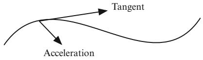

text_image

Tangent
Acceleration

A $C ^ { \infty }$ curve $c : I \to M$ with vanishing acceleration, $\ddot { c } = 0 ,$ , is called a geodesic W !(Fig. 5.1). If c is a geodesic, then the speed $| \dot { c } | = \sqrt { g \left( \dot { c } , \dot { c } \right) }$ Dis constant, as

$$
\frac {d}{d t} g (\dot {c}, \dot {c}) = 2 g (\ddot {c}, \dot {c}) = 0,
$$

or phrased differently, it is parametrized proportionally to arc length. If $| { \dot { c } } | \equiv 1$ , one says that c is parametrized by arclength.

Remark 5.2.1. If $r : U \to \mathbb { R }$ is a distance function, then $\nabla _ { \partial _ { r } } \partial _ { r } = 0$ , where $\partial _ { r } =$ $\nabla r$ W !. The integral curves for $\nabla r \ : = \ : \partial _ { { \boldsymbol { i } } }$ r D Dr are consequently geodesics. The theory of r r Dgeodesics is developed independently of distance functions and ultimately used to show the existence of distance functions.

Geodesics are fundamental in the study of the geometry of Riemannian manifolds in the same way that straight lines are fundamental in Euclidean geometry. At first sight, it is not clear that there are going to be any nonconstant geodesics to study on a general Riemannian manifold (although Riemann seems to have taken this for granted). In this section we show that every Riemannian manifold has many nonconstant geodesics. Informally speaking, there is a unique one at each point with a given tangent vector at that point. However, the question of how far it will extend from that point is subtle. To deal with the existence and uniqueness questions, we need to use some information from differential equations.

In local coordinates on $U \subset M$ the equation for a curve to be a geodesic is:

$$
\begin{array}{l} 0 = \ddot {c} \\ = \frac {d ^ {2} c ^ {k}}{d t ^ {2}} \partial_ {k} + \frac {d c ^ {i}}{d t} \frac {d c ^ {j}}{d t} \Gamma_ {i j} ^ {k} \partial_ {k}. \\ \end{array}
$$

Thus, the curve $c : I  U$ is a geodesic if and only if the coordinate components $c ^ { k }$ satisfy:

$$
\ddot {c} ^ {k} (t) = - \dot {c} ^ {i} (t) \dot {c} ^ {j} (t) \Gamma_ {j i} ^ {k} | _ {c (t)}, k = 1, \dots , n.
$$

Because this is a second-order system of differential equations, we expect an existence and a uniqueness result for the initial value problem of specifying the value and first derivative, i.e.,

$$
\begin{array}{l} c (0) = q, \\ \dot {c} (0) = \dot {c} ^ {i} (0) \partial_ {i} | _ {q}. \\ \end{array}
$$

But because the system is nonlinear it is not clear that solutions will exist for all t.

The precise statements obtained from the theory of ordinary differential equations give us the following two theorems when we consider geodesics in a chart $U \subset M$ .

Theorem 5.2.2 (Local Uniqueness). Let $I _ { 1 }$ and $I _ { 2 }$ be intervals with $t _ { 0 } \in I _ { 1 } \cap I _ { 2 }$ . If $c _ { 1 } : I _ { 1 } \to U$ and $c _ { 2 } : I _ { 2 } \to U$ are geodesics with $c _ { 1 } ( t _ { 0 } ) = c _ { 2 } ( t _ { 0 } )$ and $\dot { c } _ { 1 } ( t _ { 0 } ) = \dot { c } _ { 2 } ( t _ { 0 } )$ , Wthen $c _ { 1 } | _ { I _ { 1 } \cap I _ { 2 } } = c _ { 2 } | _ { I _ { 1 } \cap I _ { 2 } }$ !.

Theorem 5.2.3 (Existence). For each $p \in U$ and $v \in \mathbb { R } ^ { n }$ , there is a neighborhood $V _ { 1 }$ of p, a neighborhood $V _ { 2 } o f v _ { ; }$ , and an $\varepsilon > 0$ 2such that for each $q \in V _ { 1 }$ and $w \in V _ { 2 }$ , there is a geodesic $c _ { q , w } : ( - \varepsilon , \varepsilon ) \to U$ with

$$
c (0) = q,
$$

$$
\dot {c} (0) = w ^ {i} \partial_ {i} | _ {q}.
$$

Moreover, the mapping .q; w; t/  cq;w.t/ is C1 on $V _ { 1 } \times V _ { 2 } \times ( - \varepsilon , \varepsilon )$ .

It is worthwhile to consider what these assertions become in informal terms. The existence statement includes not only short time existence of a geodesic with given initial point and initial tangent, it also asserts a kind of local uniformity for the interval of existence. If you vary the initial conditions but don’t vary them too much, then there is a fixed interval $( - \varepsilon , \varepsilon )$ on which all the geodesics with the various initial conditions are defined. Some or all may be defined on larger intervals, but all are defined at least on $( - \varepsilon , \varepsilon )$ .

The uniqueness assertion amounts to saying that geodesics cannot be tangent at one point without coinciding. Just as two straight lines that intersect and have the same tangent at the point of intersection must coincide, so two geodesics with a common point and equal tangent at that point must coincide.

By relatively simple covering arguments these statements can be extended to geodesics not necessarily contained in a coordinate chart. Let us begin with the uniqueness question:

Lemma 5.2.4 (Global Uniqueness). Let $I _ { 1 }$ and $I _ { 2 }$ be open intervals with $t _ { 0 } \in I _ { 1 } \cap I _ { 2 } . I f c _ { 1 } : I _ { 1 } \to M$ and $c _ { 2 } : I _ { 2 } \to M$ are geodesics with $c _ { 1 } ( t _ { 0 } ) = c _ { 2 } ( t _ { 0 } )$ and $\dot { c } _ { 1 } ( t _ { 0 } ) = \dot { c } _ { 2 } ( t _ { 0 } )$ W, then $c _ { 1 } | _ { I _ { 1 } \cap I _ { 2 } } = c _ { 2 } | _ { I _ { 1 } \cap I _ { 2 } }$ !.

Proof. Define

$$
A = \{t \in I _ {1} \cap I _ {2} \mid c _ {1} (t) = c _ {2} (t), \dot {c} _ {1} (t) = \dot {c} _ {2} (t) \}.
$$

Then $t _ { 0 } \in A$ . Also, A is closed in $I _ { 1 } \cap I _ { 2 }$ by continuity of $c _ { 1 } , c _ { 2 } , \dot { c } _ { 1 }$ , and $\dot { c } _ { 2 }$ . Finally, 2 \ P PA is open, by virtue of the local uniqueness statement for geodesics in coordinate charts: if $t _ { 1 } ~ \in ~ A$ , then choose a coordinate chart U around $c _ { 1 } ( t _ { 1 } ) = c _ { 2 } ( t _ { 1 } )$ . Then $( t _ { 1 } - \varepsilon , t _ { 1 } + \varepsilon ) \subset I _ { 1 } \cap I _ { 2 }$ and $c _ { i } \big | _ { ( t _ { 1 } - \varepsilon , t _ { 1 } + \varepsilon ) }$ Dboth have images contained in U. The  C  \ j  Ccoordinate uniqueness result then shows that $c _ { 1 } | _ { ( t _ { 1 } - \varepsilon , t _ { 1 } + \varepsilon ) } = c _ { 2 } | _ { ( t _ { 1 } - \varepsilon , t _ { 1 } + \varepsilon ) }$ , so that $( t _ { 1 } - \varepsilon , t _ { 1 } + \varepsilon ) \subset A$ .

The coordinate-free global existence picture is a little more subtle. The first, and easy, step is to notice that if we start with a geodesic, then we can enlarge its interval of definition to be maximal. This follows from the uniqueness assertions: If we look at all geodesics $c : I  M , 0 \in I , c ( 0 ) = p , \dot { c } ( 0 ) = v , p$ and v fixed, then the union W ! 2 D P Dof all their domains of definition is a connected open subset of R on which such a geodesic is defined. Clearly its domain of definition is maximal.

The next observation, also straightforward, is that if $\widehat { K }$ is a compact subset of TM, then there is an $\varepsilon \ > \ 0$ such that for each $( q , v ) \in \widehat { K }$ , there is a geodesic $c : ( - \varepsilon , \varepsilon ) \to M$ with $c ( 0 ) = q$ and ${ \dot { c } } ( 0 ) = v$ 2. This is an immediate application of W  ! D P Dthe local uniformity part of the differential equations existence statement together with a compactness argument.

The next point to ponder is what happens when the maximal domain of definition is not all of R. For this, assume $c : I = ( a , b ) \to M$ is a maximal geodesic, where $b < \infty$ . Then $c ( t )$ W D !must have a specific kind of behavior as t approaches b. If $K \subset M$ 1is compact, then there is a number $t _ { K } < b$ such that; if $t _ { K } < t < b$ , then $c ( t ) \in M { - } K$ . We say that c leaves every compact set as $t  b$ .

!To see why c must leave every compact set, suppose K is a compact set it doesn’t leave, i.e., there is a sequence $t _ { 1 } , t _ { 2 } , \ldots \in I$ with lim $t _ { j } = b$ and $c ( t _ { j } ) \in K$ for each $j .$ Since c is constant the set $\{ \dot { c } ( t _ { j } ) \mid j = 1 , . . . \}$ D 2lies in a compact subset of TM, namely,

$$
\widehat {K} = \left\{v _ {q} \mid q \in K, v \in T _ {q} M, | v | \leq | \dot {c} | \right\}.
$$

Thus there is an $\varepsilon > 0$ such that for each $v _ { q } \in \widehat { K }$ , there is a geodesic $c : ( - \varepsilon , \varepsilon ) \to M$ with $c ( 0 ) = q , \dot { c } ( 0 ) = v$ . Now choose $t _ { j }$ 2such that $b - t _ { j } < \varepsilon / 2$ W. Then $c _ { q , v }$ !patches Dtogether with $c$ P Dto extend $c ;$ beginning at $t _ { j }$ continue $c$ by $\varepsilon ,$ which takes us beyond $b ,$ , since $t _ { j }$ is within $\varepsilon / 2$ of b. This contradicts the maximality of I.

One important consequence of these observations is what happens when M itself is compact:

Corollary 5.2.5. If M is a compact Riemannian manifold, then for each $p \in M$ and $v \in T _ { p } M ,$ , there is a geodesic $c : \mathbb { R } \to M$ with $c ( 0 ) = p , \dot { c } ( 0 ) = v$ 2. In other words, 2geodesics exist for all time.

A Riemannian manifold where all geodesics exist for all time is called geodesically complete.

A slightly trickier point is the following: Suppose $c : I \to M$ is a geodesic and $0 \in I$ W !, where I is a bounded interval. Then we would like to say that for $q \in M$ near 2enough to $c ( 0 )$ and $v \in T _ { q } M$ near enough to ${ \dot { c } } ( 0 )$ there is a geodesic $c _ { q , v }$ 2with q; v as 2 Pinitial position and tangent, respectively, and with $c _ { q , v }$ defined on an interval almost as big as I. More precisely we have:

Lemma 5.2.6. Suppose $c : [ a , b ] \to M$ is a geodesic on a compact interval. There W !is a neighborhood V in TM of c.0/ such that if $v \in V ,$ , then there is a geodesic $c _ { v } : [ a , b ] \to M$ with $\dot { c } _ { v } ( a ) = v$ .

Proof. A compactness argument allows us to subdivide the interval $a \ = \ b _ { 0 } \ <$ < $b _ { 1 } < \dots < b _ { k } = b$ in such a way that we have neighborhoods $V _ { i }$ of $\dot { c } \left( b _ { i } \right)$ where    Dany geodesic with initial velocity in $V _ { i }$ is defined on $[ b _ { i } , b _ { i + 1 } ]$ P. Using that the map $( t , v ) \mapsto c _ { v } ( t )$ is continuous, where $c _ { v }$ Cis the geodesic with $\dot { c } _ { v } \left( 0 \right) = v$ , we can 7!select a new neighborhood $U _ { 0 } \subset V _ { 0 }$ of $\dot { c } \left( b _ { 0 } \right)$ such that $\dot { c } _ { v } ( b _ { 1 } ) \in V _ { 1 }$ Dfor $v \in U _ { 0 }$ . Next select $U _ { 1 } \subset U _ { 0 }$ so that $\dot { c } _ { v } ( b _ { 2 } ) \in V _ { 2 }$ for $v \in U _ { 1 }$ P 2 2etc. In this way we get the desired neighborhood $V = U _ { k - 1 }$ 2 2in at most k steps.

It is easy to check that geodesics in Euclidean space are straight lines. Using this observation it is simple to give examples of the above ideas by taking M to be open subsets of $\mathbb { R } ^ { 2 }$ with its usual metric.

Example 5.2.7. In the punctured plane $\mathbb { R } ^ { 2 } - \{ ( 0 , 0 ) \}$ the unit speed geodesic from $( - 1 , 0 )$ with tangent .1; 0/ is defined on $( - \infty , 1 )$ gonly. But nearby geodesics from $( - 1 , 0 )$ with tangents $( 1 + \varepsilon _ { 1 } , \varepsilon _ { 2 } ) , \varepsilon _ { 1 } , \varepsilon _ { 2 }$ 1small, $\varepsilon _ { 2 } \neq 0$ , are defined on $( - \infty , \infty )$ .  C ¤ 1 1Thus maximal intervals of definition can jump up in size, but, as already noted, not down. See figure 5.2.

Example 5.2.8. On the other hand, for the region $\{ ( x , y ) \mid - 1 < x y \}$ , the curve $t \mapsto ( t , 0 )$ f j  gis a geodesic defined on all of R that is a limit of unit speed geodesics $t \mapsto ( t , - \varepsilon ) , \varepsilon \to 0$ , each of which is defined only on a finite interval. Note that 7!  !the endpoints of these intervals go to infinity as required by the above lemma. See figure 5.3.

Example 5.2.9. We think of the spheres $S ^ { n } ( R ) = S _ { R ^ { - 2 } } ^ { n } \subset \mathbb { R } ^ { n + 1 }$ . The acceleration of a curve $c : I \to S ^ { n } ( R )$ D can be computed as the Euclidean acceleration in $\mathbb { R } ^ { n + 1 }$ Wprojected onto $S ^ { n } ( R )$ (see proposition 5.1.3). Thus c is a geodesic if and only if c is normal to $S ^ { n } ( R )$ . This means that c and c should be proportional as vectors. RGreat circles $c ( t ) = p \cos ( \alpha t ) + v \sin ( \alpha t )$ , where $p , v \in \mathbb { R } ^ { n + 1 } , | p | = | v | = R$ and $p \perp v ,$ D C 2, clearly have this property. Furthermore, since $c ( 0 ) = p \in S ^ { n } ( R )$ Dand $\dot { c } ( 0 ) = \alpha v \in T _ { p } S ^ { n } ( R )$ D 2, we see that there is a geodesic for each initial value problem P D 2(see also exercise 1.6.20).

Fig. 5.2 Obstacles to continuing geodesics   
Fig. 5.3 Obstacles to continuing geodesics   
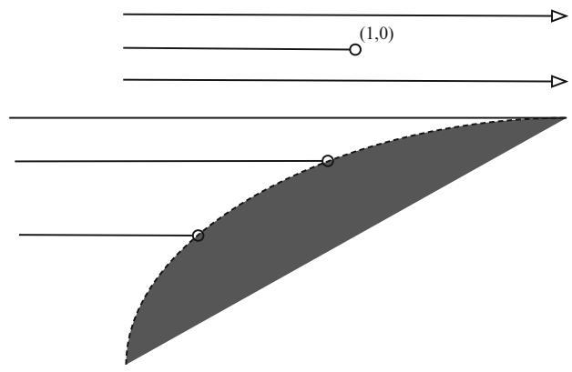

text_image

(1,0)

Fig. 5.4 Geodesics on the sphere   
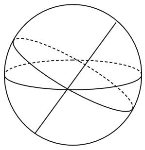

natural_image

Geometric diagram of a sphere with intersecting lines and arcs, no text or symbols present

We can easily picture great circles on spheres as depicted in figure 5.4. Still, it is convenient to have a different way of understanding this. For this we project the sphere orthogonally onto the plane containing the equator. Thus the north and south poles are mapped to the origin. As all geodesics are great circles, they must project down to ellipses that have the origin as center and whose greater axis has length 2R. Of course, this simply describes exactly the way in which we draw threedimensional pictures on paper.

Example 5.2.10. We think of $H ^ { n } \left( R \right) = S _ { - R ^ { - 2 } } ^ { n } \subset \mathbb { R } ^ { n , 1 }$ as in example 1.1.7. In this D  case the acceleration is also the projection of the acceleration in Minkowski space. In Minkowski space the acceleration in the usual coordinates is the same as the Euclidean acceleration. Thus we just have to find the Minkowski projection onto the hypersurface. By analogy with the sphere, one might guess that the hyperbolas c.t/  p cosh.˛t/  v sinh.˛t/, $p , v \in \bar { \mathbb { R } } ^ { n , 1 } , | p | ^ { 2 } = - \bar { R } ^ { 2 } , \bar { | v | ^ { 2 } } = R ^ { 2 }$ , and $p \perp v$ all D C 2 j j D  j j D ?in the Minkowski sense, are our geodesics. In fact the ambient acceleration is given by $\ddot { c } = \alpha ^ { 2 } c$ and $T _ { p } H ^ { n } = \{ v \mid v \perp p \}$ .

R D D f j ? gThis time the geodesics are hyperbolas. On the space itself in Minkowski space, they are, as in the case of spheres, intersections of 2 dimensional subspaces with hyperbolic space. If we resort to the trick of projecting hyperbolic space onto the plane containing the first n coordinates, then the geodesics are hyperbolas whose asymptotes are straight lines through the origin. See also figure 5.5.

Example 5.2.11. On a Lie group G with a left-invariant metric one might suspect that the geodesics are the integral curves for the left-invariant vector fields. This in turn is equivalent to the assertion that $\nabla _ { X } X \equiv 0$ for all left-invariant vector fields. r However, our Lie group model for the upper half plane does not satisfy this (see section 4.4.2). On the other hand, we did show in proposition 4.4.2 that $\nabla _ { X } X =$ ${ \scriptstyle { \frac { 1 } { 2 } } } [ X , X ] = 0$ r Dwhen the metric is biinvariant and X is left-invariant. Moreover, all Dcompact Lie groups admit biinvariant metrics (see exercise 1.6.24).

Fig. 5.5 Hyperbolas as geodesics in hyperbolic space   
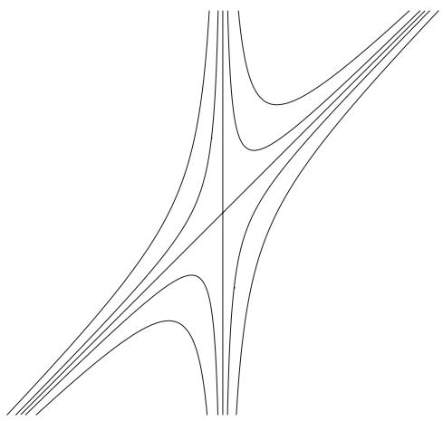

natural_image

Abstract geometric line pattern with intersecting curves and a diagonal line (no text or symbols)

# 5.3 The Metric Structure of a Riemannian Manifold

The positive definite inner product structures on the tangent space of a Riemannian manifold automatically give rise to a concept of lengths of tangent vectors. From this one can obtain an idea of the length of a curve as the integral of the speed, i.e., length of velocity. This is a direct extension of the usual calculus concept of the length of curves in Euclidean space. Indeed, the definition of Riemannian manifolds is motivated from the beginning by lengths of curves. The situation is turned around a bit from that of $\mathbb { R } ^ { n }$ , though: On Euclidean spaces, we have in advance a concept of distance between points. Thus, the definition of lengths of curves is justified by the fact that the length of a curve should be approximated by sums of distances for a fine subdivision (e.g., a fine polygonal approximation). For Riemannian manifolds, there is no immediate idea of distance between points. Instead, we have a natural idea of speed, hence curve length, and we shall use the length of curve idea to define distance between points. The goal of this section is to carry out these constructions in detail.

Recall that a curve $c : [ a , b ] \to M$ is piecewise $C ^ { \infty }$ if c is continuous and if there is a partition $a = a _ { 1 } < a _ { 2 } < . . . < a _ { k } = b$ of $[ a , b ]$ such that $c | _ { [ a _ { i } , a _ { i + 1 } ] }$ is $C ^ { \infty }$ for $i = 1 , \ldots , k - 1$ D.

DLet $c : [ a , b ] \to M$ be a piecewise $C ^ { \infty }$ curve in a Riemannian manifold. Then the W !length L.c/ is defined as follows:

$$
L (c) = \int_ {a} ^ {b} | \dot {c} (t) | d t = \int_ {a} ^ {b} \sqrt {g (\dot {c} (t) , \dot {c} (t))} d t.
$$

It is clear from the definition that the function $t \mapsto | { \dot { c } } ( t ) |$ is integrable in the Riemann (or Lebesgue) sense, so $L ( c )$ 7! jP jis a well-defined finite, nonnegative number. The chain and substitution rules show that $L ( c )$ is invariant under reparametrization. A curve $c : [ a , b ] \to M$ is said to be parametrized by arc length if $L ( c | _ { [ a , t ] } ) = t - a$ for all $t ~ \in ~ [ a , b ]$ , or equivalently, if $| { \dot { \boldsymbol { c } } } ( t ) | ~ = ~ 1$ for all $t ~ \in ~ [ a , b ]$ . A regular curve $c : [ a , b ] \to M$ jP j D 2, i.e., the velocity never vanishes, admits a reparametrization to W !an arclength parametrized curve. To see this define the new parameter as

$$
s = \varphi (t) = \int_ {a} ^ {t} | \dot {c} (\tau) | d \tau .
$$

Clearly $\varphi : [ a , b ]  [ 0 , L ( c ) ]$ is strictly increasing and piecewise smooth. Thus the curve $c \circ \varphi ^ { - 1 } : [ 0 , L ( c ) ] \to M$ is piecewise smooth with unit speed everywhere.

ı W !We are now ready to introduce the idea of distance between points. For each pair of points $p , q \in M$ define the path space

$$
\Omega_ {p, q} = \{c: [ 0, 1 ] \rightarrow M \mid c \text {   is   piecewise   } C ^ {\infty} \text {   and   } c (0) = p, c (1) = q \}
$$

and the distance $d ( p , q ) = | p q |$ between points $p , q \in M$ as

$$
| p q | = \inf \left\{L (c) \mid c \in \Omega_ {p, q} \right\}.
$$

It follows immediately from this definition that $| p q | = | q p |$ and $| p q | \leq | p r | +$ $| r q |$ . The fact that $| p q | = 0$ only when $p = q$ j j D j j j j  j j Cwill be established in the proof of j j j j D Dtheorem 5.3.8. Thus, satisfies all the properties of a metric. When it is necessary jjto specify the Riemannian metric we write $| p q | _ { g }$ .

j jAs for metric spaces, we have various metric balls

$$
B (p, r) = \{x \in M \mid | p x | <   r \},
$$

$$
\overline {{{B}}} (p, r) = \{x \in M \mid | p x | \leq r \}.
$$

More generally, we can define the distance between subsets A; $B \subset M$ as

$$
d (A, B) = | A B | = \inf \left\{\left| p q \right| \mid p \in A, q \in B \right\}.
$$

Finally, we define

$$
\begin{array}{l} B (A, r) = \{x \in M \mid | A x | <   r \}, \\ \overline {{{B}}} (A, r) = D (A, r) = \{x \in M \mid | A x | \leq r \}. \\ \end{array}
$$

Example 5.3.1. The infimum of curve lengths in the definition of $| p q |$ can fail to be realized. This is illustrated, for instance, by the $\mathrm { ^ { \circ } p u n c t u r e d p l a n e " { } \mathbb { R } ^ { 2 } - \{ ( 0 , 0 ) \} }$ with the induced Euclidean metric. The distance $| ( - 1 , 0 ) ( 1 , 0 ) | = 2 .$ f g, but this distance j  j Dis not realized by any curve, since every curve of length 2 in $\mathbb { R } ^ { 2 }$ from $( - 1 , 0 )$ to $( 1 , 0 )$ passes through $( 0 , 0 )$ (see figure 5.6). In a sense that we shall explore later, $\mathbb { R } ^ { 2 } - \{ ( 0 , 0 ) \}$ is incomplete. For the moment, we introduce some terminology for the f gcases where the infimum $| p q |$ is realized.

Fig. 5.6 Distance is not realized by a curve   
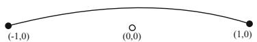

A curve $\sigma ~ \in ~ \Omega _ { p , q }$ is a segment if $L ( \sigma ) ~ = ~ | p q |$ and $\sigma$ is parametrized 2 D j jproportionally to arc length, i.e.,  is constant. We also use the notation $\overline { { p q } }$ for j Pa specific segment parameterized on $[ 0 , | p q | ]$ with ${ \overline { { p q } } } ( 0 ) = p$ and ${ \overline { { p q } } } ( | p q | ) = q .$ .

j j D j j DLet us relate these new concepts to our distance functions from section 3.2.2.

Lemma 5.3.2. $I f r : U \to \mathbb { R }$ is a smooth distance function and $U \subset ( M , g )$ is open, W !then the integral curves for r are segments in $( U , g )$ . Moreover, $i f c \in \Omega _ { p , q } \left( U \right)$ satisfies $L \left( c \right) = r \left( c \left( 1 \right) \right) - r \left( c \left( 0 \right) \right)$ , then $c = \sigma \circ \varphi$ , where $\sigma$ 2is the integral curve Dfor r through c .0/ and $\varphi \left( s \right) = \textstyle \int _ { 0 } ^ { s } \left| \dot { c } \right|$ dt.

Proof. Fix $p , q \in U$ and let $c ( t ) : [ 0 , b ] \to U$ be a curve from p to q. Since $d r \left( v \right) =$ $g \left( \nabla r , v \right) \leq \left| v \right|$ 2it follows that

$$
L (c) = \int_ {0} ^ {b} | \dot {c} | d t \geq \int_ {0} ^ {b} g (\nabla r, \dot {c}) d t = \int_ {0} ^ {b} d r (\dot {c}) d t = r (q) - r (p).
$$

This shows that $| p q | \geq | r \left( q \right) - r \left( p \right) |$ since $| p q | = | q p |$ . If we choose c as an integral curve for $\nabla r , \mathrm { i . e . , } \dot { c } = \nabla r \circ c$ , then dr $( \dot { c } ) = 1$ j D. Thus $L ( c ) = | r ( q ) - r ( p ) |$ . This shows r P D r ı P Dthat integral curves must be segments. Moreover, when $L \left( c \right) = r \left( q \right) - r \left( p \right)$ , then it follows that $\dot { \boldsymbol { c } } = | \dot { \boldsymbol { c } } | \nabla r$ . This implies the last claim.

P D jPj rNotice that we only considered curves in U, and thus only established the result for $( U , g )$ and not $( M , g )$ .

Example 5.3.3. In Euclidean space $\mathbb { R } ^ { n }$ , straight line segments parametrized with constant speed, i.e. curves of the form $t \mapsto p { + } t \cdot v$ , are in fact segments. This follows 7! C from lemma 5.3.2 if we use the smooth distance function $r \left( x \right) = v \cdot x .$ , where v is a unit vector. In $\mathbb { R } ^ { n }$ , each pair of points $p , q$ Dis joined by a segment $t \mapsto p + t ( q - p )$ that is unique up to reparametrization. See also exercise 1.6.19.

Example 5.3.4. Consider $M = S ^ { 1 }$ and $U = S ^ { 1 } - \{ ( 1 , 0 ) \}$ . On U we have the distance function $r ( \theta ) = \theta , \theta \in ( 0 , 2 \pi )$ D f g. The previous lemma shows that any curve $c ( \theta ) =$ .cos -; sin - /, $\theta \in I \subset ( 0 , 2 \pi )$ is a segment in U. If, however, the length of I is $> \pi$ , 2 then such curves can clearly not be segments in $S ^ { 1 }$ .

Example 5.3.5. Next we complete our understanding of segments on $S ^ { n } \left( 1 \right) \subset \mathbb { R } ^ { n + 1 }$ with its standard round metric (see also the proof of theorem 5.5.4 where this is covered in greater generality and detail or exercise 1.6.20). Given two points $p , q \in$ $S ^ { n }$ we create a warped product structure

$$
d s _ {n} ^ {2} = d r ^ {2} + \sin^ {2} (r) d s _ {n - 1} ^ {2}
$$

such that: when $p , q$ are antipodal, then they correspond to $r = 0 , \pi ;$ and otherwise $p = ( a , x _ { 0 } ) \in ( 0 , \pi ) \times S ^ { n - 1 }$ and $q = ( b , x _ { 0 } ) \in ( 0 , \pi ) \times S ^ { n - 1 }$ D. The distance function D 2 - D 2we use is r and the domain where it is smooth is $U \simeq ( 0 , \pi ) \times S ^ { n - 1 }$ . When the points are antipodal they are joined by several curves of length 	. A general curve between these points can always be shortened so it looks like $c : [ 0 , b ] \to S ^ { n }$ , where $c \left( t \right) \in U$ for $t \in ( 0 , b )$ and $c \left( 0 \right) = - c \left( b \right)$ W !correspond to the antipodal points where $r = 0 , \pi$ . 2 D Now lemma 5.3.2 shows that $L ( c | _ { [ \epsilon , b - \epsilon ] } ) \geq | r \circ c ( b - \epsilon ) - r \circ c ( \epsilon ) |$ D. Therefore,

$$
L (c) \geq \lim _ {\epsilon \rightarrow 0} | r \circ c (b - \epsilon) - r \circ c (\epsilon) | = \pi .
$$

When the points are not antipodal they lie on a unique integral curve for $\nabla r$ which ris part of a great circle in U. This segment will again be the shortest among curves in U. However, any curve that leaves U will pass through either $r = 0$ or $r = \pi$ . We Dcan argue as with antipodal points that any such curve must have length

$$
\geq \min \left\{r (p) + r (q), \pi - r (p) + \pi - r (q) \right\} \geq | r (p) - r (q) |.
$$

Example 5.3.6. The same strategy can also be used to show that all geodesics in hyperbolic space are segments. See also exercise 1.6.21.

Example 5.3.7. In $\mathbb { R } ^ { 2 } - \{ ( 0 , 0 ) \}$ , as already noted, not every pair of points is joined by a segment.

In section 5.4 we show that segments are always geodesics. Conversely, we show in section 5.5.2 that geodesics are segments when they are sufficiently short. Specifically, if $c \ : \ [ 0 , b ) \  \ M$ is a geodesic, then ${ c | } _ { [ 0 , \varepsilon ] }$ is a segment for all sufficiently small $\varepsilon > 0$ ! j. Furthermore, we shall show that each pair of points in a Riemannian manifold can be joined by at least one segment provided that the Riemannian manifold is either metrically or geodesically complete. This result explains what is “wrong” with the punctured plane. It also explains why spheres have segments between each pair of points: compact spaces are always complete in any metric compatible with the (compact) topology.

Some work needs to be done before we can prove these general statements. To start with, we consider the question of compatibility of topologies.

Theorem 5.3.8. The metric topology obtained from the distance $| \cdots |$ on a Riemannian manifold is the same as the manifold topology.

Proof. Fix $p \in M$ and a coordinate neighborhood U of $p$ such that $x ^ { i } \left( p \right) = 0$ . We 2assume in addition that $g _ { i j } \vert _ { p } = \delta _ { i j }$ D. On U we have the given Riemannian metric $g$ jand also a Euclidean metric $g _ { 0 }$ defined by $g _ { 0 } \left( \partial _ { i } , \partial _ { j } \right) = \delta _ { i j }$ . Thus $g _ { 0 }$ is constant and equal to $g$ at $p$ . Finally, after possibly shrinking $U ,$ D, we can further assume that

$$
\begin{array}{l} U = B ^ {g _ {0}} (p, \varepsilon) \\ = \left\{x \in U \mid | p x | _ {g _ {0}} <   \varepsilon \right\} \\ = \left\{x \in U \mid \sqrt {(x ^ {1}) ^ {2} + \cdots + (x ^ {n}) ^ {2}} <   \varepsilon \right\}. \\ \end{array}
$$

For $x \in U$ we can compare these two metrics as follows: There are continuous 2functions: $\lambda , \mu : U \to ( 0 , \infty )$ such that if $v \in T _ { x } M$ , then

$$
\lambda (x) | v | _ {g _ {0}} \leq | v | _ {g} \leq \mu (x) | v | _ {g _ {0}}.
$$

Moreover, $\lambda ( x ) , \mu ( x )  1 \mathrm { a s } x  p .$

Now let $c : [ 0 , 1 ] \to M$ !be a curve from p to $x \in U$ .

1: If c is a straight line in the Euclidean metric, then it lies in U and

$$
\begin{array}{l} \left| p x \right| _ {g _ {0}} = L _ {g _ {0}} (c) \\ = \int_ {0} ^ {1} | \dot {c} | _ {g _ {0}} d t \\ \geq \frac {1}{\max \mu (c (t))} \int_ {0} ^ {1} | \dot {c} | _ {g} d t \\ = \frac {1}{\max \mu (c (t))} L _ {g} (c) \\ \geq \frac {1}{\max \mu (c (t))} | p x | _ {g}. \\ \end{array}
$$

2: If c is a general curve that lies entirely in U, then

$$
\begin{array}{l} L _ {g} (c) = \int_ {0} ^ {1} | \dot {c} | _ {g} d t \\ \geq \left(\min \lambda (c (t))\right) \int_ {0} ^ {1} | \dot {c} | _ {g _ {0}} d t \\ \geq \left(\min \lambda (c (t))\right) | p x | _ {g _ {0}}. \\ \end{array}
$$

3: If $c$ leaves U, then there will be a smallest $t _ { 0 }$ such that $c \left( t _ { 0 } \right) \notin U .$ , then

$$
\begin{array}{l} L _ {g} (c) \geq \int_ {0} ^ {t _ {0}} | \dot {c} | _ {g} d t \\ \geq \left(\min \lambda (c (t))\right) \int_ {0} ^ {t _ {0}} | \dot {c} | _ {g _ {0}} d t \\ \geq (\min \lambda (c (t))) \varepsilon \\ \geq \left(\min \lambda (c (t))\right) | p x | _ {g _ {0}}. \\ \end{array}
$$

By possibly shrinking U again we can guarantee that min $\lambda \ge \lambda _ { 0 } > 0$ and max $\mu \leq \mu _ { 0 } < \infty$ . We have then proven that

$$
\left| p x \right| _ {g} \leq \mu_ {0} \left| p x \right| _ {g _ {0}}
$$

and

$$
\lambda_ {0} \left| p x \right| _ {g _ {0}} \leq \inf L _ {g} (c) = \left| p x \right| _ {g}.
$$

Thus the Euclidean and Riemannian distances are comparable on a neighborhood of $p .$ . This shows that the metric topology and the manifold topology (coming from the Euclidean distance) are equivalent. It also shows that $p = q { \mathrm { i f ~ } } | p q | = 0$ .

Finally note that

$$
\lim _ {x \to p} \frac {| p x | _ {g}}{| p x | _ {g _ {0}}} = 1
$$

since $\lambda ( x ) , \mu ( x )  1 \mathrm { a s } x  p .$ .

Just as compact Riemannian manifolds are automatically geodesically complete, this theorem also shows that such spaces are metrically complete.

Corollary 5.3.9. If M is a compact manifold and g is a Riemannian metric on M, then $( M , | \cdots | _ { g } )$ is a complete metric space, where $| \cdot \cdot | _ { g }$ is the Riemannian distance jjfunction determined by g.

The proof of theorem 5.3.8 also tells us that any curve can be replaced by a regular curve that has almost the same length.

Corollary 5.3.10. For any $c \in \Omega _ { p q }$ and $\epsilon > 0$ , there exists a constant speed curve $\bar { c } \in \Omega _ { p q }$ with $L \left( \bar { c } \right) \leq \left( 1 + \epsilon \right) L \left( c \right)$ .

Proof. First note that it suffices to find a regular curve with the desired property. Next observe that in Euclidean space this can be accomplished by approximating a curve with a possibly shorter polygonal curve. In a Riemannian manifold we can use the same procedure in a chart to approximate a curve by a regular curve. We select a chart and Euclidean metric $g _ { 0 }$ as above such that $\lambda _ { 0 } L _ { g _ { 0 } } \left( c \right) \le L _ { g } \left( c \right) \le \mu _ { 0 } L _ { g _ { 0 } }$ .c/ for any curve in the chart. We can then approximate c by a regular curve $\bar { c }$ such that

$$
L _ {g} (\bar {c}) \leq \mu_ {0} L _ {g _ {0}} (\bar {c}) \leq \mu_ {0} L _ {g _ {0}} (c) \leq \frac {\mu_ {0}}{\lambda_ {0}} L _ {g} (c).
$$

By shrinking the chart we can make the ratio $\begin{array} { r } { \frac { \mu _ { 0 } } { \lambda _ { 0 } } ~ < ~ 1 + \epsilon } \end{array}$ . Finally we can use Ccompactness to cover the original curve by finitely many such charts to get the desired regular curve.

Remark 5.3.11. It is possible to develop the theory here using other classes of curves without changing the distance concept. A natural choice would be to expand the class to all absolutely continuous curves. As corollary 5.3.10 indicates we could also have restricted attention to piecewise smooth curves with constant speed.

The functional distance $d _ { F }$ between points in a manifold is defined as

$$
d _ {F} (p, q) = \sup \{| f (p) - f (q) | \mid f: M \to \mathbb {R} \text {   has   } | \nabla f | \leq 1 \text {   on   } M \}.
$$

This distance is always smaller than the arclength distance. One can, however, show as before that it generates the standard manifold topology. In fact, after we have established the existence of smooth distance functions, it will become clear that the two distances are equal provided p and q are sufficiently close to each other.

# 5.4 First Variation of Energy

In this section we study the arclength functional

$$
L (c) = \int_ {0} ^ {1} | \dot {c} | d t, c \in \Omega_ {p, q}
$$

in further detail. The minima, if they exist, are pre-segments. That is, they have minimal length, but are not guaranteed to have the correct parametrization. We also saw that in some cases sufficiently short geodesics minimize this functional. One issue with this functional is that it is invariant under change of parametrization. Minima, if they exist, consequently do not come with a fixed parameter. This problem can be overcome by considering the energy functional

$$
E (c) = \frac {1}{2} \int_ {0} ^ {1} | \dot {c} | ^ {2} d t, c \in \Omega_ {p, q}.
$$

This functional measures the total kinetic energy of a particle traveling along the curve. Note that the energy will depend on how the curve is parametrized.

Proposition 5.4.1. If $\sigma \in \Omega _ { p , q }$ is a constant speed curve that minimizes $L : \Omega _ { p , q } \to$ $[ 0 , \infty )$ , then  minimizes $E : \Omega _ { p , q } \to [ 0 , \infty )$ . Conversely, if  minimizes $E : \Omega _ { p , q } \to$ $[ 0 , \infty )$ W, then it also minimizes $L : \Omega _ { p , q } \to [ 0 , \infty )$ .

Proof. The Cauchy-Schwarz inequality for functions tells us that

$$
\begin{array}{l} L (c) = \int_ {0} ^ {1} | \dot {c} | \cdot 1 d t \\ \leq \sqrt {\int_ {0} ^ {1} | \dot {c} | ^ {2} d t} \sqrt {\int_ {0} ^ {1} 1 ^ {2} d t} \\ = \sqrt {\int_ {0} ^ {1} | \dot {c} | ^ {2} d t} \\ = \sqrt {2 E (c)}, \\ \end{array}
$$

Fig. 5.7 A proper variation   
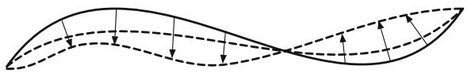

natural_image

Abstract wavy line diagram with dashed and solid segments, no text or symbols present

with equality holding if c is a constant multiple of 1, i.e., c has constant speed. jPjConversely, when equality holds the speed is forced to be constant. Let $\sigma \in \Omega _ { p , q }$ be a curve that has constant speed. If it minimizes L and $c \in \Omega _ { p , q }$ . Then

$$
E (\sigma) = \frac {1}{2} (L (\sigma)) ^ {2} \leq \frac {1}{2} (L (c)) ^ {2} \leq E (c),
$$

so  also minimizes E.

Conversely, let $\sigma \in \Omega _ { p , q }$ minimize E and $c \in \Omega _ { p , q }$ be any curve. If c does not 2 2have constant speed we can use corollary 5.3.10 to find $c _ { \epsilon }$ with constant speed and $L \left( c _ { \epsilon } \right) \leq \left( 1 + \epsilon \right) L \left( c \right)$ for any $\epsilon > 0$ . Then

$$
L (\sigma) \leq \sqrt {2 E (\sigma)} \leq \sqrt {2 E (c _ {\epsilon})} = L (c _ {\epsilon}) \leq (1 + \epsilon) L (c).
$$

As $\epsilon > 0$ is arbitrary the result follows.

The next goal is to show that minima of E must be geodesics. To establish this we have to develop the first variation formula of energy. A variation of a curve $c : I \to M$ is a family of curves $\bar { c } : ( - \varepsilon , \varepsilon ) \times [ a , b ]  M$ , such that $\bar { c } \left( 0 , t \right) = c \left( t \right)$ W !for all $t \in [ a , b ]$ N W  - ! N D. We say that such a variation is piecewise smooth if it is continuous 2and Œa; b can be partitioned into intervals $[ a _ { i } , a _ { i + 1 } ] , i = 0 , \dots , m - 1$ , where $\bar { c } :$ .. $( - \varepsilon , \varepsilon ) \times [ a _ { i } , a _ { i + 1 } ] \to M$ Cis smooth. Thus the curves $t \mapsto c _ { s } \left( t \right) = \bar { c } \left( s , t \right)$ N Ware all  - C !piecewise smooth, while the curves $s \mapsto { \bar { c } } \left( s , t \right)$ 7! D Nare smooth. The velocity field for this variation is the field $\frac { \partial \overline { { c } } } { \partial t }$ 7! Nwhich is well-defined on each interval $[ a _ { i } , a _ { i + 1 } ]$ . At the break points $t = a _ { i }$ C, there are two possible values for this field; a right derivative and Da left derivative:

$$
\frac {\partial \bar {c}}{\partial t ^ {+}} (s, a _ {i}) = \frac {\partial \bar {c} | _ {[ a _ {i} , a _ {i + 1} ]}}{\partial t} (s, a _ {i}),
$$

$$
\frac {\partial \bar {c}}{\partial t ^ {-}} (s, a _ {i}) = \frac {\partial \bar {c} | _ {[ a _ {i - 1} , a _ {i} ]}}{\partial t} (s, a _ {i}).
$$

The variational field is defined as $\frac { \partial \overline { { c } } } { \partial s }$ . This field is well-defined everywhere. It is smooth on each $( - \varepsilon , \varepsilon ) \times \lbrack a _ { i } , a _ { i + 1 } \rbrack$ and continuous on $( - \varepsilon , \varepsilon ) \times I$ . The special case where $a = 0 , b = 1 , \bar { c } ( s , 0 ) = p .$ , and $\bar { c } \left( s , 1 \right) = q$  -for all s is of special importance D Das all of the curves $c _ { s } ~ \in ~ \Omega _ { p , q }$ N D. Such variations are called proper variations of c (Figure 5.7).

Lemma 5.4.2 (The First Variation Formula). $I f \bar { c } : ( - \varepsilon , \varepsilon ) \times [ a , b ]  M$ is a piecewise smooth variation, then

$$
\begin{array}{l} \frac {d E \left(c _ {s}\right)}{d s} = - \int_ {a} ^ {b} g \left(\frac {\partial^ {2} \bar {c}}{\partial t ^ {2}}, \frac {\partial \bar {c}}{\partial s}\right) d t + \left. g \left(\frac {\partial \bar {c}}{\partial t ^ {-}}, \frac {\partial \bar {c}}{\partial s}\right) \right| _ {(s, b)} - \left. g \left(\frac {\partial \bar {c}}{\partial t ^ {+}}, \frac {\partial \bar {c}}{\partial s}\right) \right| _ {(s, a)} \\ + \sum_ {i = 1} ^ {m - 1} g \left(\frac {\partial \bar {c}}{\partial t ^ {-}} - \frac {\partial \bar {c}}{\partial t ^ {+}}, \frac {\partial \bar {c}}{\partial s}\right) \Bigg | _ {(s, a _ {i})}. \\ \end{array}
$$

Proof. It suffices to prove the formula for smooth variations as we can otherwise split up the integral into parts that are smooth:

$$
E \left(c _ {s}\right) = \int_ {a} ^ {b} \left| \frac {\partial \bar {c}}{\partial t} \right| ^ {2} d t = \sum_ {i = 0} ^ {m - 1} \int_ {a _ {i}} ^ {a _ {i + 1}} \left| \frac {\partial \bar {c}}{\partial t} \right| ^ {2} d t
$$

and apply the formula to each part of the variation.

For a smooth variation $\bar { c } : ( - \varepsilon , \varepsilon ) \times [ a , b ]  M$ we have

$$
\begin{array}{l} \frac {d E (c _ {s})}{d s} = \frac {d}{d s} \frac {1}{2} \int_ {a} ^ {b} g (\frac {\partial \bar {c}}{\partial t}, \frac {\partial \bar {c}}{\partial t}) d t \\ = \frac {1}{2} \int_ {a} ^ {b} \frac {\partial}{\partial s} g \left(\frac {\partial \bar {c}}{\partial t}, \frac {\partial \bar {c}}{\partial t}\right) d t \\ = \int_ {a} ^ {b} g \left(\frac {\partial^ {2} \bar {c}}{\partial s \partial t}, \frac {\partial \bar {c}}{\partial t}\right) d t \\ = \int_ {a} ^ {b} g \left(\frac {\partial^ {2} \bar {c}}{\partial t \partial s}, \frac {\partial \bar {c}}{\partial t}\right) d t \\ = \int_ {a} ^ {b} \frac {\partial}{\partial t} g \left(\frac {\partial \bar {c}}{\partial s}, \frac {\partial \bar {c}}{\partial t}\right) d t - \int_ {a} ^ {b} g \left(\frac {\partial \bar {c}}{\partial s}, \frac {\partial^ {2} \bar {c}}{\partial t ^ {2}}\right) d t \\ = \left. g \left(\frac {\partial \bar {c}}{\partial s}, \frac {\partial \bar {c}}{\partial t}\right) \right| _ {a} ^ {b} - \int_ {a} ^ {b} g \left(\frac {\partial \bar {c}}{\partial s}, \frac {\partial^ {2} \bar {c}}{\partial t ^ {2}}\right) d t \\ = - \int_ {a} ^ {b} g \left(\frac {\partial \bar {c}}{\partial s}, \frac {\partial^ {2} \bar {c}}{\partial t ^ {2}}\right) d t + \left. g \left(\frac {\partial \bar {c}}{\partial s}, \frac {\partial \bar {c}}{\partial t}\right) \right| _ {(s, b)} - \left. g \left(\frac {\partial \bar {c}}{\partial s}, \frac {\partial \bar {c}}{\partial t}\right) \right| _ {(s, a)}. \\ \end{array}
$$

We can now completely characterize the local minima for the energy functional. The proof in fact characterizes geodesics $c \in \Omega _ { p , q }$ as stationary points for E $\Omega _ { p , q }  [ 0 , \infty )$ .

Theorem 5.4.3 (Characterization of local minima). If $c \in \Omega _ { p , q }$ is a local minimum for $E : \Omega _ { p , q } \to [ 0 , \infty )$ , then c is a smooth geodesic.

Proof. The assumption guarantees that c is a stationary point for the energy functional, i.e.,

$$
\frac {d E (c _ {s})}{d s} = 0
$$

for any proper variation of c. This is in fact the only property that we shall use. The trick is to find appropriate variations. If $V \left( t \right)$ is any vector field along $c \left( t \right) , \mathrm { i . e . }$ , $V \left( t \right) \in T _ { c \left( t \right) } M$ , then there is a variation so that $\begin{array} { r } { V \left( t \right) = \frac { \partial c } { \partial s } | _ { ( 0 , t ) } } \end{array}$ . One such variation 2can be obtained by declaring the variational curves $s \mapsto c \left( s , t \right)$ to be geodesics with $\frac { \partial c } { \partial s } | _ { ( 0 , t ) } = V \left( t \right)$ 7!. As geodesics are unique and vary nicely with respect to the j Dinitial data, this variation is well-defined and as smooth as V is (see theorems 5.2.2 and 5.2.3). Moreover, if $V \left( a \right) = 0$ and $V \left( b \right) = 0$ , then the variation is proper.

D DUsing such a variational field the first variation formula at $s = 0$ depends only on c itself and the variational field V

$$
\begin{array}{l} \frac {d E \left(c _ {s}\right)}{d s} | _ {s = 0} = - \int_ {a} ^ {b} g (\ddot {c}, V) d t + g \left(\frac {d c}{d t ^ {-}} (b), V (b)\right) - g \left(\frac {d c}{d t ^ {+}} (a), V (a)\right) \\ + \sum_ {i = 1} ^ {m - 1} g \left(\frac {d c}{d t ^ {-}} \left(a _ {i}\right) - \frac {d c}{d t ^ {+}} \left(a _ {i}\right), V \left(a _ {i}\right)\right) \\ = - \int_ {a} ^ {b} g (\ddot {c}, V) d t + \sum_ {i = 1} ^ {m - 1} g \left(\frac {d c}{d t ^ {-}} (a _ {i}) - \frac {d c}{d t ^ {+}} (a _ {i}), V (a _ {i})\right). \\ \end{array}
$$

We now specify V further. First select $V \left( t \right) = \lambda \left( t \right) \ddot { c } \left( t \right)$ , where $\lambda \left( a _ { i } \right) = 0$ at the break points $a _ { i }$ where c might not be smooth, $\lambda \left( a \right) = \lambda \left( b \right) = 0$ , and $\lambda \left( t \right) > 0$ elsewhere. Then

$$
\begin{array}{l} 0 = \frac {d E (c _ {s})}{d s} | _ {s = 0} \\ = - \int_ {a} ^ {b} g (\ddot {c}, \lambda (t) \ddot {c}) d t \\ = - \int_ {a} ^ {b} \lambda (t) | \ddot {c c} | ^ {2} d t. \\ \end{array}
$$

Since $\lambda \left( t \right) > 0$ where c is defined it must follow that $\ddot { c } = 0$ at those points. Thus c R R Dis a broken geodesic. Next select a new variational field V such that

$$
V \left(a _ {i}\right) = \frac {d c}{d t ^ {-}} \left(a _ {i}\right) - \frac {d c}{d t ^ {+}} \left(a _ {i}\right),
$$

$$
V (a) = V (b) = 0
$$

and otherwise arbitrary, then

$$
\begin{array}{l} 0 = \frac {d E (c _ {s})}{d s} | _ {s = 0} \\ = \sum_ {i = 1} ^ {m - 1} g \left(\frac {d c}{d t ^ {-}} \left(a _ {i}\right) - \frac {d c}{d t ^ {+}} \left(a _ {i}\right), V \left(a _ {i}\right)\right) \\ = \sum_ {i = 1} ^ {m - 1} \left| \frac {d c}{d t ^ {-}} (a _ {i}) - \frac {d c}{d t ^ {+}} (a _ {i}) \right| ^ {2}. \\ \end{array}
$$

This forces

$$
\frac {d c}{d t ^ {-}} (a _ {i}) = \frac {d c}{d t ^ {+}} (a _ {i})
$$

and hence the broken geodesic has the same velocity from the left and right at the places where it is potentially broken. Uniqueness of geodesics (theorem 5.2.2) then shows that c is a smooth geodesic.

This also shows:

Corollary 5.4.4 (Characterization of segments). Any piecewise smooth segment is a geodesic.

While this result shows precisely what the local minima of the energy functional must be it does not guarantee that geodesics are local minima. In Euclidean space all geodesics are minimal as they are the integral curves for globally defined distance functions: $u \left( x \right) = v \cdot x .$ , where v is a unit vector. On the unit sphere, however, no D geodesic of length > 	 can be locally minimizing. Such geodesics always form part of a great circle where the complement of the geodesic in the great circle has length $< \pi$ , so they can’t be absolute minima. One can also easily construct a variation where the nearby curves are all shorter. We shall spend much more time on these issues in the subsequent sections as well as the next chapter. Certainly much more work has to be done before we can characterize what makes geodesics minimal.

# 5.5 Riemannian Coordinates

The goal of this section is to introduce a natural set of coordinates around each point in a Riemannian manifold. These coordinates will depend on the geometry and also allow us to show the existence of smooth distance functions as well as many other things. They go under the name of exponential or Riemannian normal coordinates. They are normal in the sense of exercise 2.5.20, but have further local and infinitesimal properties. Gauss first introduced such coordinates for surfaces and Riemann in the general context.

# 5.5.1 The Exponential Map

For a tangent vector $v \in T _ { p } M _ { \mathrm { : } }$ , let $c _ { v }$ be the unique geodesic with $c \left( 0 \right) = p$ and $\dot { \boldsymbol { c } } ( 0 ) ~ = ~ \boldsymbol { v }$ , and $[ 0 , L _ { v } )$ 2 Dthe nonnegative part of the maximal interval on which $c$ P Dis defined. Notice that uniqueness of geodesics implies the homogeneity property: $c _ { \alpha v } ( t ) = c _ { v } ( \alpha t )$ for all $\alpha > 0$ and $t < L _ { \alpha v }$ . In particular, $L _ { \alpha v } = \alpha ^ { - 1 } L _ { v }$ . Let $O _ { p } \subset$ $T _ { p } M$ Dbe the set of vectors v such that $1 \ < \ L _ { v }$ . In other words $c _ { v } ( t )$ is defined on Œ0; 1. The exponential map at $p , \exp _ { p } : O _ { p } \to M .$ , is defined by

$$
\exp_ {p} (v) = c _ {v} (1).
$$

In exercise 5.9.35 the relationship between the just defined exponential map and the Lie group exponential map is elucidated. Figure 5.8 depicts how radial lines in the tangent space are mapped to radial geodesics in M via the exponential map. The homogeneity property $c _ { v } ( t ) = c _ { t v } ( 1 )$ shows that $\mathbf { e x p } _ { p } \left( t v \right) = c _ { v } \left( t \right)$ . Therefore, it is natural to think of $\mathrm { e x p } _ { p } ( v )$ D Din a polar coordinate representation, where from $p$ one goes “distance” v in the direction of $\frac { v } { | v | }$ . This gives the point $\mathrm { e x p } _ { p } ( v )$ , since $c _ { \frac { v } { | v | } } ( | v | ) = c _ { v } ( 1 )$ .

j j DThe collection of maps, $\exp _ { p } .$ , can be combined to form a map exp $\bigcup O _ { p }  M$ by setting exp $| _ { O _ { p } } = \exp _ { p }$ W. This map exp is also called the exponential map.

j DLemma 5.2.6 shows that the set $O = \bigcup O _ { p }$ is open in TM and theorem 5.2.3 that exp $: O  M$ Dis smooth. Similarly, $O _ { p } \subset T _ { p } M$ is open and $\exp _ { p } : O _ { p }  M$ W !is smooth. It is an important property that $\exp _ { p }$ W !is in fact a local diffeomorphism around $0 \in T _ { p } M$ . The details of this are given next.

Proposition 5.5.1. Let $( M , g )$ be a Riemannian manifold.

(1) If ${ \dot { p } } \in M ,$ , then

$$
D \exp_ {p}: T _ {0} (T _ {p} M) \to T _ {p} M
$$

is nonsingular at the origin of $T _ { p } M .$ . Consequently, $\exp _ { p }$ is a local diffeomorphism.

Fig. 5.8 The exponential map at p   
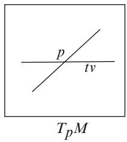

text_image

p
tv
TpM

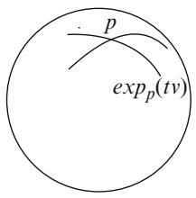

text_image

p
expₚ(tv)

(2) Define $E : O \to M \times M$ by $E ( v ) = ( \pi ( v )$ ; exp v/, where $\pi ( \boldsymbol { v } )$ is the base point $o f v , i . e . , v \in T _ { \pi ( v ) } M$ D. Then for each $p \in M$ and $0 _ { p } \in T _ { p } M _ { \mathrm { \Omega } }$ ,

$$
D E: T _ {(p, 0 _ {p})} (T M) \to T _ {(p, p)} (M \times M)
$$

is nonsingular. Consequently, E is a diffeomorphism from a neighborhood of the zero section of TM onto an open neighborhood of the diagonal in $M \times M .$ .

Proof. That the differentials are nonsingular follows from the homogeneity property of geodesics given an important identification of tangent spaces. Let $I _ { 0 } : T _ { p } M $ $T _ { 0 } T _ { p } M$ be the canonical isomorphism, i.e., $\begin{array} { r } { I _ { 0 } ( v ) = \frac { d } { d t } ( t v ) | _ { t = 0 } } \end{array}$ W. Recall that if $v \in O _ { p }$ , then $c _ { v } ( t ) = c _ { t v } ( 1 )$ for all $t \in [ 0 , 1 ]$ . Thus,

$$
\begin{array}{l} D \exp_ {p} (I _ {0} (v)) = \frac {d}{d t} \exp_ {p} (t v) | _ {t = 0} \\ = \frac {d}{d t} c _ {t v} (1) | _ {t = 0} \\ = \frac {d}{d t} c _ {v} (t) | _ {t = 0} \\ = \dot {c} _ {v} (0) \\ = v. \\ \end{array}
$$

In other words $D \exp _ { p } \circ I _ { 0 }$ is the identity map on $T _ { p } M .$ . This shows that $D \exp _ { p }$ is ınonsingular. The second statement of (1) follows from the inverse function theorem.

The proof of (2) is again an exercise in unraveling tangent spaces and identifications. The tangent space $T _ { ( p , p ) } ( M \times M )$ is naturally identified with $T _ { p } M \times T _ { p } M .$ . The tangent space $T _ { \left( p , 0 _ { p } \right) } ( T M )$ -is also naturally identified with $T _ { p } M \times T _ { 0 _ { p } } ( T _ { p } M ) \simeq$ $T _ { p } M \times T _ { p } M$ . We can think of points in TM as given by $( p , v )$ with $v \in T _ { p } M$ '. This -shows that $E \left( p , v \right) = \left( p , \exp _ { p } \left( v \right) \right)$ 2. So varying p is just the identity map in the first Dcoordinate, but something unpredictable in the second. While if we fix p and vary v in $T _ { p } M _ { : }$ , then the first coordinate is fixed and we simply have $\mathrm { e x p } _ { p } \left( v \right)$ in the second coordinate. This explains what the differential $D E | _ { ( p , 0 _ { p } ) }$ is. If we consider it as a linear map $T _ { p } M \times T _ { p } M \to T _ { p } M \times T _ { p } M$ j, then it is the identity on the first factor - ! -to the first factor, identically 0 from the second factor to the first, and the identity from the second factor to the second factor as it is $D \exp _ { p } \circ I _ { 0 _ { p } }$ . Thus it looks like the nonsingular matrix

$$
\left[ \begin{array}{c c} I & 0 \\ * & I \end{array} \right].
$$

Now, the inverse function theorem gives (local) diffeomorphisms via E of neighborhoods of $\left( p , 0 _ { p } \right) \in \mathrm { \it { T M } }$ onto neighborhoods of $( p , p ) \in M \times M$ . Since E 2 2maps the zero section of TM diffeomorphically to the diagonal in $M \times M$ and the zero section is a properly embedded submanifold of TM it is easy to see that these local diffeomorphisms fit together to give a diffeomorphism of a neighborhood of the zero section in TM onto a neighborhood of the diagonal in $M \times M$ .

The largest $\epsilon > 0$ such that

$$
\exp_ {p}: B (0, \epsilon) \to M
$$

is defined and a diffeomorphism onto its image is called the injectivity radius at $p$ and denoted ${ \mathrm { i n j } _ { p } }$ .

This formalism with the exponential maps yields some results with geometric meaning. First, we get a coordinate system around $p$ by identifying $T _ { p } M$ with $\mathbb { R } ^ { n }$ via an isomorphism, and using that the exponential map $\exp _ { p } : T _ { p } M  M$ is W !a diffeomorphism on a neighborhood of the origin. Such coordinates are called exponential or Riemannian normal coordinates at $p$ . They are unique up to how we choose to identify $T _ { p } M$ with $\mathbb { R } ^ { n }$ . Requiring this identification to be a linear isometry gives uniqueness up to an orthogonal transformation of $\mathbb { R } ^ { n }$ . In section 5.5.3 we show that they are indeed normal in the sense that the Christoffel symbols vanish at $p .$ .

The second item of geometric interest is the following idea: On $S ^ { 2 }$ we know that geodesics are part of great circles. Thus any two points will be joined by both long and short geodesics. What might be hoped is that points that are close together would have a unique short geodesic connecting them. This is exactly what (2) in the proposition says! As long as we keep $q _ { 1 }$ and $q _ { 2 }$ near $p ,$ , there is only one way to go from $q _ { 1 }$ to $q _ { 2 }$ via a geodesic that isn’t very long, i.e., has the form $\mathsf { e x p } _ { q _ { 1 } } t v$ , $v \in T _ { q _ { 1 } } M$ , with v small.

2 j jFor now we show that:

Corollary 5.5.2. Let $K \subset ( M , g )$ be compact. There exists $\varepsilon > 0$ such that for every $p \in K ,$ , the map e $\mathfrak { s p } _ { p } : B \left( 0 , \varepsilon \right) \to M$ is defined and a diffeomorphism onto its image.

Proof. This follows from compactness if we can find $\varepsilon > 0$ such that the statement holds for all $p$ in a neighborhood of a fixed point $x \in \ M$ . This in turn is a 2consequence of part (2) of proposition 5.5.1. To see this, select a neighborhood $U$ of $( x , 0 _ { x } ) \in T M$ such that $E : U \to M \times M$ is a diffeomorphism on to its image. 2Next select a neighborhood $x \in V \subset M$ -and a diffeomorphism $F : V \times T _ { x } M \to$ $\pi ^ { - 1 } \left( V \right) \subset T M$ 2 that is a linear isomorphism $\{ p \} \times T _ { x } M \to T _ { p } M$ Wfor each $p \in V$ !. We can then find $\delta > 0$ so that $F \left( V \times B \left( 0 _ { x } , \delta \right) \right) \subset U$ ! 2. The continuity of the metric on $T _ { p } M , p \in V _ { : }$ , when pulled back to $\{ p \} \times T _ { x } M$ via F shows that there is $\varepsilon > 0$ so that $\dot { B } \left( 0 _ { p } , \varepsilon \right) \subset F \left( \{ p \} \times B \left( 0 _ { x } , \delta \right) \right)$ f g -for all p in a neighborhood $x \in W \subset V$ . Finally, the  f grestriction of E to $B \left( 0 _ { p } , \varepsilon \right) \subset T _ { p } M$ 2 is a diffeomorphism onto its image in $\{ p \} \times M .$ . This is exactly the map $\exp _ { p }$ if we forget the first factor $\{ p \}$ f g -. We can then invoke compactness to complete the proof.

There is a similar construction that leads to a geometric version of the tubular neighborhood theorem from differential topology. Let N be a properly embedded submanifold of M. The normal bundle of N in M is the vector bundle over N consisting of the orthogonal complements of the tangent spaces $T _ { p } N \subset T _ { p } M$ ,

$$
T ^ {\perp} N = \left\{v \in T _ {p} M \mid p \in N, v \in (T _ {p} N) ^ {\perp} \subset T _ {p} M \right\}.
$$

So for each $p \in N , T _ { p } M = T _ { p } N \oplus ( T _ { p } N ) ^ { \perp }$ is an orthogonal direct sum. Define the 2 D ˚normal exponential map exp? by restricting exp to ${ \cal O } \cap T N ^ { \perp }$ and only recording the second factor: $\exp ^ { \perp } : O \cap T N ^ { \perp } \to M$ \. As in part (2) of proposition 5.5.1, one can show:

Corollary 5.5.3. The map $D \exp ^ { \perp }$ is nonsingular at $0 _ { p } , f o r a l l p \in N$ and there is an open neighborhood U of the zero section in $T N ^ { \perp }$ 2on which exp? is a diffeomorphism onto its image in M.

Such an image $\exp ^ { \perp } ( U )$ is called a tubular neighborhood of N in M, because when N is a curve in $\mathbb { R } ^ { 3 }$ it looks like a solid tube around the curve.

# 5.5.2 Short Geodesics Are Segments

We just saw that points that are close together on a Riemannian manifold are connected by a short geodesic, and in fact by exactly one short geodesic. But so far, we don’t have any real evidence that such short geodesics are segments. It is the goal of this section to take care of this last piece of the puzzle. Incidentally, several different ways of saying that a curve is a segment are in common use: “minimal geodesic,” “minimizing curve,” “minimizing geodesic,” and even “minimizing geodesic segment.”

The first result is the precise statement that we wish to prove in this section.

Theorem 5.5.4. Let $( M , g )$ be a Riemannian manifold, $p \in M ,$ , and $\varepsilon > 0$ chosen such that

$$
\exp_ {p}: B (0, \varepsilon) \to U \subset M
$$

is a diffeomorphism onto its image $U \subset M .$ . Then $U = B \left( p , \varepsilon \right)$ and for each $v \in$ $B \left( 0 , \varepsilon \right)$ , the geodesic $\exp _ { p } ( t v ) , t \in [ 0 , 1 ]$  D 2is the one and only segment with speed v from p to expp v in M.

On $U \ = \ \exp _ { p } ( B ( 0 , \varepsilon ) )$ we define the function $r ( x ) ~ = ~ \vert \exp _ { p } ^ { - 1 } ( x ) \vert$ . That is, D D jr is simply the Euclidean distance function from the origin on $\textstyle \dot { B } ( 0 , \varepsilon ) \subset T _ { p } M$ in exponential coordinates. This function can be continuously extended to U by defining $r \left( \partial U \right) = \varepsilon$ . We know that $\nabla r = \partial _ { r } = { \textstyle \frac { 1 } { r } } x ^ { i } \partial _ { i }$ in Cartesian coordinates on $T _ { p } M$ D r D D. In order to prove the theorem we show that this is also the gradient with respect to the general metric $g .$ .

Lemma 5.5.5 (The Gauss Lemma). On $( U , g )$ the function r has gradient $\nabla r =$ $\partial _ { r } ,$ where $\partial _ { r } = D \exp _ { p } ( \partial _ { r } )$ .

Let us see how this implies the theorem.

Proof of Theorem 5.5.4. The proof is analogous to the specific situation on the round sphere covered in example 5.3.5, where $\exp _ { p } : B ( 0 , \pi ) \  \ B ( p , \pi )$ is a diffeomorphism.

First observe that in $B ( 0 , \varepsilon ) - \{ 0 \}$ the integral curves for $\partial _ { r }$ are the line segments $\begin{array} { r } { c ( s ) = s \cdot \frac { v } { | v | } } \end{array}$  f gof unit speed. The integral curves for $\partial _ { r }$ on $U$ are then forced to be j jthe unit speed geodesics $\begin{array} { r } { c ( s ) = \exp \Big ( s \cdot \frac { v } { | v | } \Big ) } \end{array}$ . Thus lemma 5.5.5 implies that r is a distance function on $U - \{ p \}$ j j. First note that $U \subset B \left( p , \varepsilon \right)$ as the short geodesic that joins $p$ to any point $q \in U$ has length $L < \varepsilon$ . To see that this geodesic is the only segment in $M ,$ 2, we must show that any other curve from $p$ to $q$ has length $> L$ . Suppose we have a curve $c : [ 0 , b ] \to M$ from $p$ to q. If $a \in [ 0 , b ]$ is the largest value so that $c \left( a \right) = p _ { ; }$ , then $c | _ { [ a , b ] }$ !is a shorter curve from $p$ to $q .$ . Next let $b _ { 0 } \in ( a , b )$ be Dthe first value for which $c ( t _ { 0 } ) \notin U$ , if such points exist, otherwise $b _ { 0 } = b$ 2. The curve $c | _ { ( a , b _ { 0 } ) }$ lies entirely in $U - \{ p \}$ Dand is shorter than the original curve. It’s length is j  f gestimated from below as in lemma 5.3.2

$$
L \left(c | _ {(a, b _ {0})}\right) = \int_ {a} ^ {b _ {0}} | \dot {c} | d t \geq \int_ {a} ^ {b _ {0}} d r (\dot {c}) d t = r (c (b _ {0})),
$$

where we used that $r ( p ) = r \left( c \left( a \right) \right) = 0 . \mathrm { I f } c \left( b _ { 0 } \right) \in \partial U .$ , then $c$ is not a segment from $p$ to $q$ Das it has length $\ge \varepsilon > L$ D. If $b = b _ { 0 }$ , then $L \left( c | _ { \left( a , b \right) } \right) \geq r \left( c \left( b \right) \right) = L$ and equality can only hold $\mathrm { i f } \dot { c } \left( t \right)$ Dis proportional to $\nabla r$ for all $t \in ( a , b ]$ D. This shows the P r 2short geodesic is a segment and that any other curve of the same length must be a reparametrization of this short geodesic.

Finally we have to show that $B \left( p , \varepsilon \right) \ = \ U$ . We already have $U \subset B \left( p , \varepsilon \right)$ . Conversely if $q \ \in \ B \left( p , \varepsilon \right)$ Dthen it is joined to p by a curve of length $< \varepsilon$ . The 2above argument then shows that this curve lies in U. Whence $B \left( p , \varepsilon \right) \subset U$ .

Proof of Lemma 5.5.5. We select an orthonormal basis for $T _ { p } M$ and introduce Cartesian coordinates. These coordinates are then also used on U via the exponential map. Denote these coordinates by $( x ^ { 1 } , \ldots , x ^ { n } )$ and the coordinate vector fields by $\partial _ { 1 } , \ldots , \partial _ { n }$ . Then

$$
r ^ {2} = (x ^ {1}) ^ {2} + \dots + (x ^ {n}) ^ {2},
$$

$$
\partial_ {r} = \frac {1}{r} x ^ {i} \partial_ {i}.
$$

To show that this is the gradient field for $r ( x )$ on $( M , g )$ , we must prove that $d r ( v ) =$ $g ( \partial _ { r } , v )$ . We already know that

$$
d r = \frac {1}{r} (x ^ {1} d x ^ {1} + \dots + x ^ {n} d x ^ {n}),
$$

but have no knowledge of $^ { g , }$ , since it is just some abstract metric.

One can show that $d r ( v ) = g ( \partial _ { r } , v )$ by using suitable Jacobi fields for r in place of v. Let us start with $v = \partial _ { r }$ D. The right-hand side is 1 as the integral curves for $\partial _ { r }$ are unit speed geodesics. The left-hand side can be computed directly and is also 1. Next, take a rotational field $J = - x ^ { i } \partial _ { j } + x ^ { j } \partial _ { i } , i , j = 1 , \dots , n , i < j .$ . In dimension D2 this is simply the angular field $\partial _ { \theta }$ C D. An immediate calculation shows that the lefthand side vanishes: $d r \left( J \right) = 0$ . For the right-hand side we first note that J really is a Jacobi field as $L _ { \partial _ { r } } J = [ \partial _ { r } , J ] = 0$ . Using that $\nabla _ { \partial _ { r } } \partial _ { r } = 0$ we obtain

$$
\begin{array}{l} \partial_ {r} g (\partial_ {r}, J) = g (\nabla_ {\partial_ {r}} \partial_ {r}, J) + g (\partial_ {r}, \nabla_ {\partial_ {r}} J) \\ = 0 + g (\partial_ {r}, \nabla_ {\partial_ {r}} J) \\ = g \left(\partial_ {r}, \nabla_ {J} \partial_ {r}\right) \\ = \frac {1}{2} D _ {J} g (\partial_ {r}, \partial_ {r}) \\ = 0. \\ \end{array}
$$

Thus $g ( \partial _ { r } , J )$ is constant along geodesics emanating from $p .$ . To show that it vanishes first observe that

$$
\begin{array}{l} | g (\partial_ {r}, J) | \leq | \partial_ {r} | | J | \\ = | J | \\ \leq \left| x ^ {i} \right| \left| \partial_ {j} \right| + \left| x ^ {j} \right| \left| \partial_ {i} \right| \\ \leq r (x) \left(\left| \partial_ {i} \right| + \left| \partial_ {j} \right|\right). \\ \end{array}
$$

Continuity of $\boldsymbol { D } \mathrm { e x p } _ { p }$ shows that $\partial _ { i } , \partial _ { j }$ are bounded near $p .$ . Thus $| g ( \partial _ { r } , J ) | \ \to \ 0$ as $r  0$ . This forces $g ( \partial _ { r } , J ) = 0$ j j !. Finally, observe that any vector v is a linear !combination of $\partial _ { r }$ Dand rotational fields. This proves the claim.

The next corollary is an immediate consequence of theorem 5.5.4 and its proof.

Corollary 5.5.6. $I f p \in M$ and $\varepsilon > 0$ is such that ex ${ \mathfrak { p } } _ { p } : B \left( 0 , \varepsilon \right) \to B \left( p , \varepsilon \right)$ is 2defined and a diffeomorphism, then for each $\vartheta < \varepsilon$ ,

$$
\exp_ {p} (B (0, \delta)) = B (p, \delta),
$$

and

$$
\exp_ {p} (\overline {{B}} (0, \delta)) = \overline {{B}} (p, \delta).
$$

# 5.5.3 Properties of Exponential Coordinates

Let us recapture what we have achieved in this section so far. Given $p \in ( M , g )$ we found coordinates near $p$ 2using the exponential map such that the distance function

# 5.5 Riemannian Coordinates

$r ( x ) = \vert p x \vert$ to p has the formula

$$
r (x) = \sqrt {(x ^ {1}) ^ {2} + \cdots + (x ^ {n}) ^ {2}}.
$$

The Gauss lemma told us that $\nabla r = \partial _ { r }$ . This is equivalent to the statement that

$$
\exp_ {p}: B (0, \varepsilon) \to B (p, \varepsilon)
$$

is a radial isometry, i.e.,

$$
g \left(D \exp_ {p} (\partial_ {r}), D \exp_ {p} (v)\right) = g _ {p} \left(\partial_ {r}, v\right).
$$

To see this note that being a radial isometry can be expressed as

$$
\frac {1}{r} g _ {i j} x ^ {i} v ^ {j} = g \left(\frac {1}{r} x ^ {i} \partial_ {i}, v ^ {j} \partial_ {j}\right) = \frac {1}{r} \delta_ {i j} x ^ {i} v ^ {j}.
$$

Since $\begin{array} { r } { d r ( v ) = \frac { 1 } { r } \delta _ { i j } x ^ { i } v ^ { j } } \end{array}$ this is equivalent to the assertion $\begin{array} { r } { \nabla r = \partial _ { r } = \frac { 1 } { r } x ^ { i } \partial _ { i } } \end{array}$

DWe can rewrite this as the condition

$$
g _ {i j} x ^ {j} = \delta_ {i j} x ^ {j}.
$$

This relationship, as we shall see, fixes the behavior of $g _ { i j }$ around $p$ up to first-order and shows that the coordinates are normal.

Lemma 5.5.7. In exponential coordinates

$$
g _ {i j} = \delta_ {i j} + O (r ^ {2}).
$$

Proof. The fact that $g _ { i j } \vert _ { p } = \delta _ { i j }$ follows from taking one partial derivative on both sides of the formula $g _ { i j } x ^ { j } = \delta _ { i j } x ^ { j }$

$$
\begin{array}{l} \delta_ {i k} = \delta_ {i j} \partial_ {k} x ^ {j} \\ = \partial_ {k} \sum_ {j} g _ {i j} x ^ {j} \\ = \left(\partial_ {k} g _ {i j}\right) x ^ {j} + g _ {i j} \partial_ {k} x ^ {j} \\ = \left(\partial_ {k} g _ {i j}\right) x ^ {j} + g _ {i k}. \\ \end{array}
$$

As $x ^ { j } \left( p \right) = 0$ , the claim follows.

DTaking two partial derivatives on both sides gives

$$
\begin{array}{l} 0 = \partial_ {l} \left(\left(\partial_ {k} g _ {i j}\right) x ^ {j}\right) + \partial_ {l} g _ {i k} \\ = \left(\partial_ {l} \partial_ {k} g _ {i j}\right) x ^ {j} + \partial_ {k} g _ {i j} \partial_ {l} x ^ {j} + \partial_ {l} g _ {i k} \\ = \left(\partial_ {l} \partial_ {k} g _ {i j}\right) x ^ {j} + \partial_ {k} g _ {i l} + \partial_ {l} g _ {i k}. \\ \end{array}
$$

Evaluating at p we obtain

$$
\partial_ {k} g _ {i l} | _ {p} + \partial_ {l} g _ {i k} | _ {p} = 0.
$$

The claim that $\partial _ { k } g _ { i j } \rvert _ { p } = 0$ follows from evaluating the general formula

$$
2 \partial_ {k} g _ {i j} = (\partial_ {k} g _ {i j} + \partial_ {j} g _ {i k}) + (\partial_ {k} g _ {j i} + \partial_ {i} g _ {j k}) - (\partial_ {i} g _ {k j} + \partial_ {j} g _ {k i})
$$

at $p .$

Since r is a distance function whose level sets near p are $S ^ { n - 1 }$ we obtain a polar coordinate representation $g = d r ^ { 2 } + g _ { r }$ , where $g _ { r }$ is the restriction of $g$ to $S ^ { n - 1 }$ . The Euclidean metric looks like $\delta _ { i j } = d r ^ { 2 } + r ^ { 2 } d s _ { n - 1 } ^ { 2 }$ , where $d s _ { n - 1 } ^ { 2 }$ is the canonical metric on $S ^ { n - 1 }$ D C  . Since these two metrics agree up to first-order it follows that

$$
\lim _ {r \to 0} g _ {r} = 0,
$$

$$
\lim _ {r \to 0} \left(\partial_ {r} g _ {r} - \partial_ {r} \left(r ^ {2} d s _ {n - 1} ^ {2}\right)\right) = 0.
$$

As $\partial _ { r } g _ { r } = 2$ Hess r this implies

$$
\lim _ {r \rightarrow 0} \left(\operatorname{Hess} r - r d s _ {n - 1} ^ {2}\right) = \lim _ {r \rightarrow 0} \left(\operatorname{Hess} r - \frac {1}{r} g _ {r}\right) = 0.
$$

Theorem 5.5.8 (Riemann, 1854). If a Riemannian n-manifold $( M , g )$ has constant sectional curvature $k ,$ then every point in M has a neighborhood that is isometric to an open subset of the space form $S _ { k } ^ { n }$ .

Proof. We use exponential coordinates around $p \in M$ and the asymptotic behavior of $g _ { r }$ and Hess r near $p$ 2that was just established. The constant curvature assumption implies that the radial curvature equation (see proposition 3.2.11) can be written as

$$
\nabla_ {\partial_ {r}} \operatorname{Hess} r + \operatorname{Hess} ^ {2} r = - k g _ {r},
$$

$$
\lim _ {r \to 0} \operatorname{Hess} r = 0.
$$

If we think of $g _ { r }$ as given, then this equation has a unique solution. However, k snk.r/ gr $\begin{array} { r } { \frac { \operatorname { s n } _ { k } ^ { \prime } ( r ) } { \operatorname { s n } _ { k } ( r ) } g _ { \prime } } \end{array}$ also solves this equation since

$$
\begin{array}{l} \nabla_ {\partial_ {r}} \left(\frac {\mathrm{sn} _ {k} ^ {\prime} (r)}{\mathrm{sn} _ {k} (r)} g _ {r}\right) + \left(\frac {\mathrm{sn} _ {k} ^ {\prime} (r)}{\mathrm{sn} _ {k} (r)}\right) ^ {2} g _ {r} \\ = \left(\frac {\mathrm{sn} _ {k} ^ {\prime} (r)}{\mathrm{sn} _ {k} (r)}\right) ^ {\prime} g _ {r} + \left(\frac {\mathrm{sn} _ {k} ^ {\prime} (r)}{\mathrm{sn} _ {k} (r)}\right) ^ {2} g _ {r} + \frac {\mathrm{sn} _ {k} ^ {\prime} (r)}{\mathrm{sn} _ {k} (r)} \nabla_ {\partial_ {r}} g _ {r} \\ \end{array}
$$

# 5.5 Riemannian Coordinates

$$
= - k g _ {r} - \frac {\mathrm{sn} _ {k} ^ {\prime} (r)}{\mathrm{sn} _ {k} (r)} \nabla_ {\partial_ {r}} d r ^ {2}, \text {since} 0 = \nabla_ {\partial_ {r}} g _ {r} + \nabla_ {\partial_ {r}} d r ^ {2},
$$

$$
= - k g _ {r} - \frac {\operatorname{sn} _ {k} ^ {\prime} (r)}{\operatorname{sn} _ {k} (r)} (\text { Hess } r (\partial_ {r}, \cdot) d r + d r \text { Hess } r (\partial_ {r}, \cdot))
$$

$$
= - k g _ {r}.
$$

Using that Hess $\begin{array} { r } { r = \frac { \mathrm { s n } _ { k } ^ { \prime } ( r ) } { \mathrm { s n } _ { k } ( r ) } g _ { r } } \end{array}$ sn0k.r/sn .r/ gr together with g  dr2  gr implies that $g = d r ^ { 2 } + g ,$

$$
f _ {k} \left(r\right) = \left\{ \begin{array}{l l} \frac {1}{2} r ^ {2}, & \text { when } k = 0 \\ \frac {1}{k} - \frac {1}{k} \operatorname{cs} _ {k} \left(r\right), & \text { when } k \neq 0 \end{array} \right.
$$

satisfies Hess $f _ { k } = \left( 1 - k f _ { k } \right) g .$ . The result then follows from corollary 4.3.4.

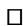

Exercises 3.4.20 and 3.4.21 explain how this theorem was proved classically and exercise 4.7.21 offers an approach focusing on conformal flatness.

Remark 5.5.9. Some remarks are in order in regards to the above proof. First note that neither of the two systems

$$
L _ {\partial_ {r}} g _ {r} = 2 \text {   Hess   } r,
$$

$$
\nabla_ {\partial_ {r}} \operatorname{Hess} r + \operatorname{Hess} ^ {2} r = - k g _ {r}
$$

or

$$
L _ {\partial_ {r}} g _ {r} = 2 \text {   Hess   } r,
$$

$$
L _ {\partial_ {r}} \operatorname{Hess} r - \operatorname{Hess} ^ {2} r = - k g _ {r}
$$

have a unique solution with the initial conditions that both $g _ { r }$ and Hess r vanish at $r = 0$ . In fact there is also a trivial solution where both $g _ { r } = 0$ and Hess $r = 0$ .

Moreover, it is also not clear that Hess $\begin{array} { r } { r = \frac { \mathrm { s n } _ { k } ^ { \prime } ( r ) } { \mathrm { s n } _ { k } ( r ) } g , } \end{array}$ snk.r/sn .r/ gr solves

$$
L _ {\partial_ {r}} \operatorname{Hess} r - \operatorname{Hess} ^ {2} r = - k g _ {r}
$$

unless we know in advance that

$$
L _ {\partial_ {r}} g _ {r} = 2 \frac {\mathrm{sn} _ {k} ^ {\prime} (r)}{\mathrm{sn} _ {k} (r)} g _ {r}.
$$

Finally, note that the initial value problem

$$
L _ {\partial_ {r}} g _ {r} = 2 \frac {\mathrm{sn} _ {k} ^ {\prime} (r)}{\mathrm{sn} _ {k} (r)} g _ {r}, \lim _ {r \rightarrow 0} g _ {r} = 0
$$

has infinitely many solutions $\lambda \operatorname { s n } _ { k } ^ { 2 } \left( r \right) d s _ { n - 1 } ^ { 2 } , \lambda \in \mathbb { R }$ . Although only one of these with give a smooth metric at $p .$ .

# 5.6 Riemannian Isometries

We are now ready to explain the key properties of Riemannian isometries. After a general discussion of Riemannian isometries we classify all geodesically complete simply connected Riemannian manifolds with constant sectional curvature.

# 5.6.1 Local Isometries

A map $F \colon ( M , g _ { M } ) \to ( N , g _ { N } )$ is a local Riemannian isometry if for each $p \in M$ the Wdifferential $D F _ { p } : T _ { p } M \to T _ { F ( p ) } N$ 2is a linear isometry. A special and trivial example W !of such a map is a local coordinate system $\varphi : U \to \Omega \subset \mathbb { R } ^ { n }$ where we use the induced metric $g$ W !on U and its coordinate representation $\left( \varphi ^ { - 1 } \right) ^ { * } g = g _ { i j } d x ^ { i } d x ^ { j }$ on .

Proposition 5.6.1. Let $F : ( M , g _ { M } ) \to ( N , g _ { N } )$ be a local Riemannian isometry.

(1) F maps geodesics to geodesics.

(2) $F \circ \exp _ { p } \left( v \right) = \exp _ { F \left( p \right) } \circ D F _ { p } \left( v \right)$ when $\begin{array} { r } { \exp _ { p } ( v ) } \end{array}$ is defined. In other words

$$
\begin{array}{c} T _ {p} M \supset O _ {p} \xrightarrow {D F} O _ {F (p)} \subset T _ {F (p)} N \\ \exp_ {p} \downarrow \qquad \qquad \qquad \downarrow \exp_ {F (p)} \\ M \xrightarrow {F} N \end{array}
$$

(3) F is distance decreasing.

(4) If F is also a bijection, then it is distance preserving.

Proof. (1) The geodesic equation depends on the metric and its first derivatives in a coordinate system. A local Riemannian isometry preserves the metric and is a local diffeomorphism. So it induces coordinates on N with the same metric coefficients. In particular, it must take geodesics to geodesics.

(2) If $\begin{array} { r } { \exp _ { p } ( v ) } \end{array}$ is defined, then $t \mapsto \exp _ { p } \left( t v \right)$ is a geodesic. Thus $t \mapsto F \left( \exp _ { p } \left( t v \right) \right)$ is also a geodesic. Since

$$
\begin{array}{l} \frac {d}{d t} F \left(\exp_ {p} (t v)\right) | _ {t = 0} = D F \left(\frac {d}{d t} \exp_ {p} (t v) | _ {t = 0}\right) \\ = D F (v), \\ \end{array}
$$

we have that $F \left( \exp _ { p } \left( t v \right) \right) = \exp _ { F \left( p \right) } \left( t D F \left( v \right) \right)$ . Setting $t = 1$ then proves the claim.

(3) This is also obvious as F must preserve the length of curves.

(4) Both F and $F ^ { - 1 }$ are distance decreasing so they must both be distance preserving.

This proposition quickly yields two important results for local Riemannian isometries. The first proposition establishes the important uniqueness for Riemannian isometries and thus quickly allows us to conclude that the groups of isometries on space forms discussed in section 1.3.1 are the isometry groups.

Proposition 5.6.2 (Uniqueness of Riemannian Isometries). Consider two local Riemannian isometries $F , G \colon ( M , g _ { M } ) \to ( N , g _ { N } )$ . If M is connected, $F \left( p \right) = G \left( p \right)$ , and ${ \cal D } F _ { p } = { \cal D } G _ { p } ,$ , then $F = G o n M .$ .

Proof. Let

$$
A = \{x \in M \mid F (x) = G (x), D F _ {x} = D G _ {x} \}.
$$

We know that $p \in A$ and that A is closed. Property (2) from the above proposition tells us that

$$
\begin{array}{l} F \circ \exp_ {x} (v) = \exp_ {F (x)} \circ D F _ {x} (v) \\ = \exp_ {G (x)} \circ D G _ {x} (v) \\ = G \circ \exp_ {x} (v), \\ \end{array}
$$

if $x \in \ A$ . Since $\exp _ { x }$ maps onto a neighborhood of x it follows that some 2neighborhood of x also lies in A. This shows that A is open and hence all of M by connectedness.

Proposition 5.6.3. Let ${ \cal F } : ( { \cal M } , g _ { \cal M } )  ( { \cal N } , g _ { \cal N } )$ be a Riemannian covering map. $( M , g _ { M } )$ W !is geodesically complete if and only $i f ( N , g _ { N } )$ is geodesically complete.

Proof. Let $c : ( - \varepsilon , \varepsilon ) \to N$ be a geodesic with $c \left( 0 \right) = p$ and $\dot { \boldsymbol { c } } \left( 0 \right) = \boldsymbol { v }$ . For any $\bar { p } \in F ^ { - 1 } \left( p \right)$ W  !/ there is a unique lift $\bar { c } : ( - \varepsilon , \varepsilon ) \to M ,$ D i.e., $F \circ { \bar { c } } = c$ D, with $\bar { c } \left( 0 \right) = \bar { p } .$ . N 2 N W  ! ı N D N D NSince F is a local isometry, the inverse is locally defined and also an isometry. Thus c is also a geodesic.

If we assume N is geodesically complete, then c and also c will exist for all time. NAs all geodesics in M must be of the form c this shows that all geodesics in M exist for all time.

Conversely, when M is geodesically complete, then $\bar { c }$ can be extended to be defined for all time. Then $F \circ { \bar { c } }$ Nis a geodesic defined for all time that extends c. ı NThus N is geodesically complete.

Lemma 5.6.4. Let $F : ( M , g _ { M } ) \to ( N , g _ { N } )$ be a local Riemannian isometry. If M is W !geodesically complete and N is connected, then F is a Riemannian covering map.

Proof. Fix $q \in N$ and assume that ${ \mathrm { s x p } } _ { q } : B \left( 0 , \varepsilon \right) \to B \left( q , \varepsilon \right)$ is a diffeomorphism. We claim that ${ \cal F } ^ { - 1 } \left( { \cal B } \left( q , \varepsilon \right) \right)$ W !is evenly covered by the sets $B \left( p , \varepsilon \right)$ where $F \left( p \right) = q$ . Geodesic completeness of M guarantees that $\exp _ { p } : B ( 0 , \varepsilon )  B ( p , \varepsilon )$ Dis defined and property (2) that

$$
F \circ \exp_ {p} (v) = \exp_ {q} \circ D F _ {p} (v)
$$

for all $v \in B ( 0 , \varepsilon ) \subset T _ { p } M . \mathrm { A s } \exp _ { q } : B ( 0 , \varepsilon )  B ( q , \varepsilon ) $ and $D F _ { p } : B ( 0 , \varepsilon ) $ $B \left( 0 , \varepsilon \right)$ 2  Ware diffeomorphisms it follows that $F \circ \exp _ { p } \ : \ B ( 0 , \varepsilon ) \  \ B ( q , \varepsilon )$ !is a diffeomorphism. Thus each of the maps $\exp _ { p } \ : \ - B ( 0 , \varepsilon ) \  \ B ( p , \varepsilon )$ and $F :$ $B ( p , \varepsilon )  B ( q , \varepsilon )$ are diffeomorphisms as well.

!Next we need to make sure that

$$
F ^ {- 1} \left(B (q, \varepsilon)\right) = \bigcup_ {F (p) = q} B (p, \varepsilon).
$$

If $x \in F ^ { - 1 } \left( B \left( q , \varepsilon \right) \right)$ , then we can join q and $F \left( x \right)$ by a unique geodesic $c \left( t \right) =$ $\exp _ { q } { ( t v ) } , v \in B ( 0 , \varepsilon )$ D. Geodesic completeness of M implies that there is a geodesic $\sigma : \mathrm { \dot { [ 0 , 1 ] } } \to M$ with $\sigma \left( 1 \right) = x$ and $D F _ { x } \left( \dot { \sigma } \left( 1 \right) \right) = \dot { c } \left( 1 \right)$ . Since $F \circ \sigma$ is a geodesic W ! Dwith the same initial values as c at $t = 1$ P D Pwe must have $F \left( \sigma \left( t \right) \right) = c \left( t \right)$ for all t. Since $q = c ( 0 )$ we have proven that $F \left( \sigma \left( 0 \right) \right) = q$ and hence that $x \in B \left( \sigma \left( 0 \right) , \varepsilon \right)$ .

D DFinally, we need to show that F is surjective. Clearly $F \left( M \right) \subset N$ is open. The above argument also shows that it is closed. To see this, consider a sequence $q _ { i } \in$ $F \left( M \right)$ that converges to $q \in N$ . We can use corollary 5.5.2 to find an $\epsilon > 0$ 2such that $\exp _ { x } : B ( 0 , \epsilon )  B ( x , \epsilon )$ 2is a diffeomorphism for all $x \in \{ q , q _ { 1 } , \ldots , q _ { k } , \ldots \}$ . For k W !sufficiently large it follows that $q \in B \left( q _ { k } , \epsilon \right)$ 2 f. This shows that $q \in F \left( M \right)$ g, since we proved that $B \left( q _ { k } , \epsilon \right) \subset F \left( M \right)$ .

If $S \subset \operatorname { I s o } \left( M , g \right)$ is a set of isometries, then the fixed point set of S is defined as those points in M that are fixed by all isometries in S

$$
\operatorname{Fix} (S) = \{x \in M \mid F (x) = x \text {   for   all   } F \in S \}.
$$

While the fixed point set for a general set of diffeomorphisms can be quite complicated, the situation for isometries is much more manageable. A submanifold $N \subset \left( M , g \right)$ is said to be totally geodesic if for each $p \in N$ a neighborhood of $0 \in T _ { p } N \subset T _ { p } M$ is mapped into N via the exponential map $\exp _ { p }$ for M. This means 2 that geodesics in N are also geodesics in M and conversely that any geodesic in M which is tangent to N at some point must lie in N for a short time.

Proposition 5.6.5. If $S \subset \operatorname { I s o } \left( M , g \right)$ is a set of isometries, then each connected component of the fixed point set is a totally geodesic submanifold.

Proof. Let $p \in \operatorname { F i x } \left( S \right)$ and $V \subset T _ { p } M$ be the Zariski tangent space, i.e., the set 2 of vectors fixed by the linear isometries $D F _ { p } : T _ { p } M \to T _ { p } M$ , where $F \in S$ . Note that each such F fixes p so we know that $D F _ { p } : T _ { p } M \to T _ { p } M . { \mathrm { ~ I f ~ } } v \in V .$ , then $t \mapsto \exp _ { p } { ( t v ) }$ must be fixed by each of the isometries in S as the initial position 7!and velocity is fixed by these isometries. Thus $\exp _ { p } \left( t v \right) \in \operatorname { F i x } \left( S \right)$ as long as it is defined. This shows that $\exp _ { p } : V \to \operatorname { F i x } \left( S \right)$ .

Next let $\varepsilon > 0$ W !be chosen so that $\exp _ { p } : B ( 0 , \varepsilon )  B ( p , \varepsilon )$ is a diffeomorphism. If $q \in \mathrm { F i x } \left( S \right) \cap B \left( p , \varepsilon \right)$ W !, then the unique geodesic $c : [ 0 , 1 ] \to B ( p , \varepsilon )$ from $p$ to $q$ 2 \ Whas the property that its endpoints are fixed by each $F \in S$ !. Now $F \circ c$ is also a geodesic from $p$ to $q$ which in addition lies in $B \left( p , \varepsilon \right)$ 2 ıas the length is unchanged. Thus $F \circ c = c$ and hence c lies in Fix $( S ) \cap B \left( p , \varepsilon \right)$ .

ı DThis shows that ex $\boldsymbol { \mathrm { p } } _ { p } : V \cap B \left( 0 , \varepsilon \right) \to \mathrm { F i x } \left( S \right) \cap B \left( p , \varepsilon \right)$ is a bijection and proves the lemma.

Remark 5.6.6. Note that if $D F _ { p } : T _ { p } M \to T _ { p } M$ is orientation preserving for $p \in$ W !Fix .F/, then the Zariski tangent space at $p$ 2must have even codimension as the 1-eigenspace of an element in ${ \mathrm { S O } } \left( n \right)$ has even codimension. In particular each Ccomponent of Fix .F/ has even codimension.

# 5.6.2 Constant Curvature Revisited

We just saw that isometries are uniquely determined by their differential. What about the existence question? Given any linear isometry $L : T _ { p } M \to T _ { q } N$ , is there an isometry $F : M \to N$ such that $D F _ { p } = L ?$ In case $M = N$ W !, this would, in particular, Wmean that if $\pi$ !is a 2-plane in $T _ { p } M$ Dand $\tilde { \pi }$ a 2-plane in $T _ { q } M$ , then there should be an isometry $F : M \to M$ such that $F ( \pi ) = \tilde { \pi }$ . But this would imply that M has constant W ! D Qsectional curvature. Therefore, the problem cannot be solved in general. From our knowledge of Iso.Sn / it follows that these spaces have enough isometries so that any linear isometry $L : T _ { p } S _ { k } ^ { n } \to T _ { q } S _ { k } ^ { n }$ can be extended to a global isometry $F : S _ { k } ^ { n } \to S _ { k } ^ { n }$ with $D F _ { p } = L$ W ! W !(see section 1.3.1). We show below that in a suitable sense these are Dthe only spaces with this property. However, there are other interesting results in this direction for other spaces (see section 10.1.2).

Theorem 5.6.7. Suppose $( M , g )$ is a Riemannian manifold of dimension n and constant curvature k. If M is simply connected and $L : T _ { p } M \to T _ { q } S _ { k } ^ { n }$ is a linear W !isometry, then there is a unique local Riemannian isometry called the monodromy map $F : M \to S _ { k } ^ { n }$ with $D F _ { p } = L$ . Furthermore, this map is a diffeomorphism if $( M , g )$ W ! Dis geodesically complete.

Before giving the proof, let us look at some examples.

Example 5.6.8. Suppose we have an immersion $M ^ { n }  S _ { k } ^ { n }$ . Then F will be one of ! the maps described in the theorem if we use the pullback metric on M. Such maps can fold in wild ways when $n \geq 2$ and need not resemble covering maps in any way whatsoever.

Example 5.6.9. If $U \subset S _ { k } ^ { n }$ is an open disc with smooth boundary, then one can  easily construct a diffeomorphism $F : M = S _ { k } ^ { n } - \{ p \} \to S _ { k } ^ { n } - U$ . Near the missing W D  f g ! point in M the metric will necessarily look pretty awful, although it has constant curvature.

Example 5.6.10. If $M = \mathbb { R P } ^ { n }$ or $( \mathbb { R } ^ { n } - \{ 0 \} )$ =antipodal map, then M is not simply D  f gconnected and does not admit an immersion into $S ^ { n }$ .

Example 5.6.11. If M is the universal covering of $S ^ { 2 } - \{ \pm p \}$ , then the monodromy  f˙map is not one-to-one. In fact it must be the covering map $M  S ^ { 2 } - \{ \pm p \}$ .

Corollary 5.6.12. If M is a closed simply connected manifold with constant curvature $k ,$ then $k > 0$ and $M = S ^ { n }$ . Thus, $S ^ { p } \times S ^ { q } , \mathbb { C P } ^ { n }$ do not admit any constant curvature metrics.

Corollary 5.6.13. If M is geodesically complete and noncompact with constant curvature $k ,$ , then $k ~ \leq ~ 0$ and the universal covering is diffeomorphic to $\mathbb { R } ^ { n }$ . In particular, $S ^ { 2 } \times \mathbb { R } ^ { 2 }$ and $S ^ { n } \times \mathbb { R }$ do not admit any geodesically complete metrics -of constant curvature.

Now for the proof of the theorem. A different proof is developed in exercise 6.7.4 when M is complete.

Proof of Theorem 5.6.7. We know from theorem 5.5.8 that given $x \in M$ sufficiently small balls $B \left( x , r \right)$ are isometric to balls $B \left( { \bar { x } } , r \right) \subset S _ { k } ^ { n }$ 2. Furthermore, by composing with elements of Iso $\left( S _ { k } ^ { n } \right)$ N (these are calculated in sections 1.3.1) we have: if $q \in$ $B \left( x , r \right) , \bar { q } \in S _ { k } ^ { n }$ , and $L : T _ { q } U \to T _ { \bar { q } } S _ { k } ^ { n }$ 2is a linear isometry, then there is a unique N 2 isometric embedding: $F : B ( x , r )  S _ { k } ^ { n }$ , where $F \left( q \right) = \bar { q }$ and $D F | _ { q } = L$ . Note that when $k \leq 0$ W, all metric balls in $S _ { k } ^ { n }$ D Nare convex, while when $k > 0$ j Dwe need their radius to $\begin{array} { r } { \mathrm { b e } < \frac { \pi } { 2 \sqrt { k } } } \end{array}$ for this to be true. So for small radii metric balls in M are either disjoint or have connected intersection. For the remainder of the proof assume that all such metric balls are chosen to be isometric to convex balls in the space form.

The construction of F proceeds basically in the same way one does analytic continuation on simply connected domains. Fix base points $p \in M , \bar { p } \in S _ { k } ^ { n }$ and a linear isometry ${ \cal L } : T _ { p } M  T _ { \bar { p } } S _ { k } ^ { n }$ . Next, let $x \in M$ 2 N 2 be an arbitrary point. If $c \in \Omega _ { p , x }$ W ! N 2is a curve from p to x in M, then we can cover c by a string of balls $B ( p _ { i } , r ) , i = 0 , \ldots , m$ , where $p = p _ { 0 } , x = p _ { m }$ , and $B \left( p _ { i - 1 } , r \right) \cap B \left( p _ { i } , r \right) \neq \emptyset$ . Define $F _ { 0 } : B \left( p _ { 0 } , r \right) \to S _ { k } ^ { n }$ Dso that $F \left( p \right) = \bar { p }$ and $D F _ { 0 } | _ { p _ { 0 } } = L$ \ ¤. Then define $F _ { i }$ $B ( p _ { i } , r )  S _ { k } ^ { n }$ ! D Nsuccessively to make it agree with $F _ { i - 1 }$ on $B \left( p _ { i - 1 } , r \right) \cap B \left( p _ { i } , r \right)$ W(this !   \just requires their values and differentials agree at one point since the intersection is connected). Define a function $G : \Omega _ { p , x } \to S _ { k } ^ { n }$ by $G \left( c \right) = F _ { m } \left( x \right)$ . We have to W ! Dcheck that it is well-defined in the sense that it doesn’t depend on our specific way of covering the curve. This is easily done by selecting a different covering and then showing that the set of values in Œ0; 1 where the two choices agree is both open and closed as in proposition 5.6.2.

If $\bar { c } \in \Omega _ { p , x }$ is sufficiently close to $^ { c , }$ , then it lies in such a covering of $^ { c , }$ , but then N 2it is clear that $G \left( c \right) = G \left( \bar { c } \right)$ . This implies that G is locally constant. In particular, G has the same value on all curves in $\Omega _ { p , x }$ that are homotopic to each other. Simpleconnectivity then implies that G is constant on $\Omega _ { p , x }$ . This means that $F \left( x \right)$ becomes well-defined and a Riemannian isometry.

If M is geodesically complete we know from lemma 5.6.4 that F has to be a covering map. As $S _ { k } ^ { n }$ is simply connected it must be a diffeomorphism.

We can now give the classification of complete simply connected Riemannian manifolds with constant curvature. Killing first proved the result assuming in effect that the manifold has an $\varepsilon \ > \ 0$ such that for all p the map $\exp _ { p } \ : \boldsymbol { B } ( 0 , \varepsilon ) \ $ $B \left( p , \varepsilon \right)$ W !is a diffeomorphism, i.e., the manifold has a uniform lower bound for the injectivity radius. Hopf realized that it was sufficient to assume that the manifold was geodesically complete. Since metric completeness easily implies geodesic completeness this is clearly the best result one could have expected at the time.

Corollary 5.6.14 (Classification of Constant Curvature Spaces, Killing, 1893 and H. Hopf, 1926). $I f \left( M , g \right)$ is a connected, geodesically complete Riemannian manifold with constant curvature k, then the universal covering is isometric to $S _ { k } ^ { n } .$ .

This result shows how important the geodesic completeness of the metric is. A large number of open manifolds admit immersions into Euclidean space of the same dimension $( \mathbf { e . g . } , \ S ^ { n } \ \times \ \mathbb { R } ^ { k } )$ and hence carry incomplete metrics with zero -curvature. Carrying a geodesically complete Riemannian metric of a certain type, therefore, often implies various topological properties of the underlying manifold. Riemannian geometry at its best tries to understand this interplay between metric and topological properties.

# 5.6.3 Metric Characterization of Maps

For a Riemannian manifold $( M , g )$ we denote the corresponding metric space by $\left( M , \vert \cdots \vert _ { g } \right)$ or simply $( M , \left| \cdots \right| )$ if only one metric is in play. It is natural to ask whether jj jjone can somehow recapture the Riemannian metric g from the distance $| \cdots | _ { g }$ . If for instance $v , w \in T _ { p } M$ , then we would like to be able to compute $g ( v , w )$ jfrom knowledge of $| \cdot \cdot | _ { g }$ 2. First note that it suffices to compute the length of vectors as the inner product $g ( v , w )$ can be computed by polarization:

$$
g (v, w) = \frac {1}{2} \left(| v + w | ^ {2} - | v | ^ {2} - | w | ^ {2}\right).
$$

One way of computing $| v |$ from the metric is by taking a curve ˛ such that $\dot { \alpha } ( 0 ) = v$ and observe that

$$
| v | = \lim _ {t \rightarrow 0} \frac {| \alpha (t) \alpha (0) |}{t}.
$$

Thus, g really can be found from $| \cdot \cdot | _ { g }$ by using the differentiable structure of M. It is jjperhaps then not so surprising that many of the Riemannian maps we consider have synthetic characterizations, that is, characterizations that involve only knowledge of the metric space $\left( M , | \cdots | _ { g } \right)$ .

jjBefore proceeding with our investigations, let us introduce a new type of coordinates. Using geodesics we have already introduced one set of geometric coordinates via the exponential map. We shall now use the distance functions to construct distance coordinates. For a point $p \in M$ fix a neighborhood $U \ \ni \ p$ such that for each $x \in U$ we have that $B \left( q , \operatorname { i n j } ( q ) \right) \supset U$ 3(see corollary 5.5.2 and 2theorem 5.5.4). Thus, for each $q \in U$ the distance function $r _ { q } ( x ) = | q x |$ is smooth on $U - \{ q \}$ . Now choose $q _ { 1 } , \ldots , q _ { n } \in U - \{ p \}$ , where $n = \dim M$ j j. If the vectors $\nabla r _ { q _ { 1 } } ( p )$ f g; : : : ; $\nabla r _ { q _ { n } } ( p ) \in T _ { p } M$ 2  f g Dare linearly independent, the inverse function theorem rtells us that $\varphi = \left( r _ { q _ { 1 } } , \ldots , r _ { q _ { n } } \right)$  can be used as coordinates on some neighborhood V of $p .$ D. The size of the neighborhood will depend on how these gradients vary. Thus, an explicit estimate for the size of V can be obtained from suitable bounds on the Hessians of the distance functions. Clearly, one can arrange for the gradients to be linearly independent or even orthogonal at any given point.

We just saw that bijective Riemannian isometries are distance preserving. The next result shows that the converse is also true.

Theorem 5.6.15 (Myers and Steenrod, 1939). If $( M , g _ { M } )$ and $( N , g _ { N } )$ are Riemannian manifolds and $F : M \to N$ a bijection, then F is a Riemannian isometry if WF is distance preserving, i.e., $| F ( p ) F ( q ) | _ { g _ { N } } = | p q | _ { g _ { M } }$ for all p; $q \in M .$ .

Proof. Let F be distance preserving. First we show that F is differentiable. Fix $p \in$ M and let $q = F ( p )$ . Near q introduce distance coordinates $\left( r _ { q _ { 1 } } , \ldots , r _ { q _ { n } } \right)$ and find $p _ { i }$ such that $F \left( p _ { i } \right) = q _ { i }$ . Now observe that

$$
\begin{array}{l} r _ {q _ {i}} \circ F (x) = | F (x) q _ {i} | \\ = | F (x) F \left(p _ {i}\right) | \\ = \left| x p _ {i} \right|. \\ \end{array}
$$

Since $| p p _ { i } | = | q q _ { i } |$ , we can assume that the $q _ { i } \mathbf { s }$ and $p _ { i } \mathrm { s }$ are chosen such that $r _ { p _ { i } } \left( x \right) =$ $| x p _ { i } |$ j j D j jare smooth at $p .$ . Thus, $\left( r _ { q _ { 1 } } , \ldots , r _ { q _ { n } } \right) \circ F$ is smooth at $p ,$ D, showing that F must be j jsmooth at $p .$ .

To show that F is a Riemannian isometry it suffices to check that $| D F ( v ) | = | v |$ for all tangent vectors $v \in T M$ . For a fixed $v \in T _ { p } M$ let $c ( t ) = \exp _ { p } ( t v )$ j D j j. For small t we know that $c$ 2 2 Dis a constant speed segment. Thus, for small t; s we can conclude

$$
| t - s | \cdot | v | = | c (t) c (s) | _ {g _ {M}} = | F (c (t)) F (c (s)) | _ {g _ {N}},
$$

implying

$$
\begin{array}{l} | D F (v) | = \left| \frac {d (F \circ c)}{d t} \right| _ {t = 0} \\ = \lim _ {t \rightarrow 0} \frac {\left| F (c (t)) F (c (0)) \right| _ {g _ {N}}}{| t |} \\ = \lim _ {t \to 0} \frac {\left| c (t) c (0) \right| _ {g _ {M}}}{\left| t \right|} \\ = | \dot {c} (0) | \\ = | v |. \\ \end{array}
$$

Our next goal is to find a characterization of Riemannian submersions. Unfortunately, the description only gives us functions that are $C ^ { 1 }$ , but there doesn’t seem to be a better formulation. Let $F : ( \bar { M } , g _ { \bar { M } } )  ( M , g _ { M } )$ be a function. We call F a submetry if for every $\bar { p } \in \bar { M }$ Wthere is an $r > 0$ such that $F \left( B \left( { \bar { p } } , \varepsilon \right) \right) = B \left( F \left( { \bar { p } } \right) , \varepsilon \right)$ for all $\varepsilon \quad \leq \quad r .$ N 2 N D N Submetries are locally distance nonincreasing and hence also continuous. In addition, we have that the composition of submetries (or Riemannian submersions) are again submetries (or Riemannian submersions).

Theorem 5.6.16 (Berestovskii, 1995). If $F : ( \bar { M } , g _ { \bar { M } } )  ( M , g _ { M } )$ is a surjective submetry, then F is $a C ^ { 1 }$ W NRiemannian submersion.

Proof. We use the notation $\bar { p } \in F ^ { - 1 } \left( p \right)$ for points in the pre-image. The goal is to N 2show that we have unique horizontal lifts of vectors in M that vary continuously with $\bar { p }$ .

NAssume that $r \ < \ \mathrm { i n j } _ { p } , \mathrm { i n j } _ { \bar { p } }$ in the submersion property so that all geodesic Nsegments are unique between the end points

The submetry property shows: If $| p q | < r$ , then for each $\bar { p } \in F ^ { - 1 }$ .p/ there exists a unique $\bar { q } \in F ^ { - 1 } \left( q \right)$ with $| \bar { p } \bar { q } | = | p q |$ j N. Moreover, the map $\bar { p } \mapsto \bar { q }$ is continuous. We can then define horizontal lifts of unit vectors by $\overline { { \vec { p } q } } = \widehat { \bar { p } q }$ . This is well defined since $\overrightarrow { p q _ { 2 } } = \overrightarrow { p q _ { 2 } }$ implies that $q _ { 1 } , q _ { 2 }$ D N Nlie on the same segment emanating from $p$ and Dthus the same will be true for $\bar { q } _ { 1 } , \bar { q } _ { 2 }$ .

NSelect distance coordinates $( r _ { 1 } , \ldots , r _ { k } )$ around $p .$ . Observe that all of the $r _ { i } \mathbf { s }$ are Riemannian submersions and therefore also submetries. Then the compositions $r _ { i } \circ F$ are also submetries. Thus, $F$ is $C ^ { 1 }$ if and only if all the maps $r _ { i } \circ F$ are $C ^ { 1 }$ ı. Therefore, it suffices to prove the result in the case of functions $r : U \subset M \to ( a , b )$ .

The observation is simply that $\nabla r$ W is the horizontal lift of $\partial _ { r }$ !on $( a , b )$ . Continuity of $\nabla r$ follows from continuity of $\bar { p } \mapsto \bar { q }$ .

Remark 5.6.17. It can be shown that submetries are $C ^ { 1 , 1 }$ , i.e., their derivatives are locally Lipschitz. In terms of the above proof this follows from showing that the map $\bar { p } \mapsto \bar { q }$ is locally Lipschitz. It is in general not possible to improve this. Consider, e.g., $K = [ 0 , 1 ] ^ { 2 } \subset \mathbb { R } ^ { 2 }$ and let $r ( x ) = \left| x K \right|$ . Then the levels $r = r _ { 0 } > 0$ are not $C ^ { 2 }$ D  D j j Das they consist of a rounded square with sides parallel to the sides of K and rounded corners that are quarter circles centered at the corners of K.

# 5.6.4 The Slice Theorem

In this section we establish several important results about actions on manifolds. First we show that the isometry group is a Lie group and then proceed with a study of the topology near the orbits of actions by isometries.

The action by a topological group H on a manifold M is said to be proper if the map H $\times M \to M \times M$ defined by $( h , p ) \mapsto ( h p , p )$ is a proper map. The orbit of -H through $p \in M { \mathrm { ~ i s ~ H } } p = \{ h p \mid h \in \mathrm { H } \}$ 7!. The topology on the quotient $\mathrm { H } \backslash M ,$ , that 2 D f j 2 g nconsists of the space of orbits of the action, is the quotient topology (note the we are careful to divide on the left as we shall use both right and left cosets in this section). This makes $M \to \mathbb { H } \backslash M$ continuous and open. This topology is clearly ! nsecond countable and also Hausdorff when the action is proper.

The isotropy group of an action H at $p \in M { \mathrm { ~ i s ~ H } } _ { p } = \{ h \in \mathrm { H } \mid h p = p \}$ . Note that 2 D falong an orbit the isotropy groups are always conjugate: $\mathrm { H } _ { h p } = h \mathrm { H } _ { p } h ^ { - 1 }$ g. When the action is proper $\mathrm { H } _ { p }$ is compact. This gives us a proper action $( k , h ) \mapsto h k ^ { - 1 }$ of $\mathrm { H } _ { p }$ on H. The orbit space $\mathrm { H } / \mathrm { H } _ { p }$ 7!is the natural coset space of left translates of $\mathrm { H } _ { p }$ . The natural identification $\mathrm { H } / \mathrm { H } _ { p }  \mathrm { H } p$ is a bijection that is both continuous and proper !and hence a homeomorphism. We say that H is free or acts freely if $\mathrm { H } _ { p } = \{ e \}$ for all $p \in M$ .

2The topology on Iso $( M , g )$ is defined and studied in exercise 5.9.41. The key property we shall use is that Iso $( M , g ) \ni F \mapsto \left( F ( p ) , D F | _ { p } \right)$ is continuous and 3 7! ja homeomorphism onto its image. Note that the last fact factor is a “linear” map $T _ { p } M \to T M$ .

Example 5.6.18. The Arzela-Ascoli lemma implies that Iso .M/ acts properly on M (see also exercise 5.9.41). However, a subgroup $\mathrm { ~ H ~ } \subset \operatorname { I s o } \left( M \right)$ does not necessarily act properly unless it is a closed subgroup. The action $\mathbb { R } \times S ^ { 1 } \times S ^ { 1 } \to S ^ { 1 } \times S ^ { 1 }$ defined by $\boldsymbol { \theta } \cdot ( z _ { 1 } , z _ { 2 } ) = \left( e ^ { \theta \mathrm { i } } z _ { 1 } , e ^ { \alpha \theta \mathrm { i } } z _ { 2 } \right)$ - - !is proper if and only if ˛ is rational.

Theorem 5.6.19 (Myers and Steenrod, 1939). If H is a closed subgroup of Iso $( M , g )$ , then the orbits of the action are submanifolds. In particular, the isometry group is a Lie group.

Proof. The proof is a streamlined version of the original proof by Myers and Steenrod. They showed that the orbits are $C ^ { 1 }$ , fortunately a little trick allows us to bootstrap the construction to obtain smoothness.

Throughout the proof we work locally and use that any Riemannian manifold looks like Euclidean space via exponential coordinates both around a point as in proposition 5.5.1 and around a small tube as in corollary 5.5.3. Since we work locally all metric balls have smooth boundary.

Fig. 5.9 Tangent and normal vectors to orbits   
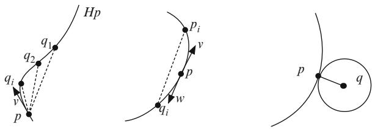

text_image

Hp
q1
q2
vi
v
p
pi
v
p
wi
w
qi
p
q

We say that $v \in T _ { p } M$ is tangent to Hp $\subset M$ if v lim ${ { \dot { c } } _ { i } } \left( 0 \right)$ , where $c _ { i }$ are 2geodesic segments from p to $p _ { i } \in \mathrm H p$ with lim $p _ { i } = p$ D P(see figure 5.9). Since $\mathrm { H } _ { p }$ is compact we can always write $p _ { i } = h _ { i } p$ with lim $h _ { i } = e$ . In this case $D h _ { i } \big | _ { p }$ converges to the identity (see exercise $5 . 9 . 4 1 )$ D j. The set of all such tangent vectors at p is denoted $T _ { p } \mathrm { H } p$ . We claim that $T _ { p } { \mathrm { H } } p \subset T _ { p } M$ is a subspace. First note that this set is invariant under scaling by positive scalars as we can reparametrize the geodesic segments. Next consider v  lim $v _ { i }$ and $w = \operatorname* { l i m } w _ { i }$ , where $v _ { i }$ and $w _ { i }$ are initial velocities for Dgeodesic segments from $p$ to $p _ { i } = h _ { i } p$ and $q _ { i } \in \mathrm { H } p$ , respectively. Using that the D 2metric is locally Euclidean near p it follows that the velocity ${ { \dot { c } } _ { i } } \left( 0 \right)$ for a suitably parametrized geodesic $c _ { i }$ from $p _ { i }$ to $q _ { i }$ is close to $w - v$ Pin TM (see figure 5.9). Using the isometry $h _ { i } ^ { - 1 }$ to move $p _ { i } = h _ { i } p$ to p and lim $h _ { i } = e$ implies that

$$
\lim \frac {d \left(h _ {i} ^ {- 1} \circ c _ {i}\right)}{d t} (0) = w - v.
$$

This shows that $w - v \in T _ { p } \mathrm { H } p$

 2The group structure preserves the orbits and maps tangent vectors to tangent vectors by $T _ { h p } \mathrm { H } p = D h \left( T _ { p } \mathrm { H } p \right)$ . As $D h = \exp _ { h p } ^ { - 1 }$ h $\circ \mathrm { e x p } _ { p }$ locally, it follows that D Dthese tangent spaces vary continuously along Hp.

We say that $v \in T _ { p } M$ is normal to Hp if it is proportional to $\overrightarrow { p q }$ where $| q p | =$ $| q \mathrm { H } p |$ . Clearly $B \left( q , | q p | \right) \cap \mathrm { H } p \ = \ \varnothing$ j j Dso the angle between tangent and normal j jvectors must be $\geq \pi / 2$ j \ D. Since the tangent vectors form a subspace they must in fact be perpendicular to all normal vectors (see figure 5.9). This shows that if $O \subset M$ is an open subset with smooth boundary and $O \cap \mathrm { H } p = \emptyset$ , then for any $q \in \partial O \cap$ Hp we have $T _ { q } \mathrm { H } p \subset T _ { q } \partial O$ .

Let $N ^ { k }$ be a small k-dimensional submanifold with $T _ { p } N = T _ { p } \mathrm { H } p$ . Use the normal exponential map to introduce coordinates $( x , y )$ Don a tubular product neighborhood of N diffeomorphic to $N \times B$ with $B = B \left( 0 , \epsilon \right) \subset \mathbb { R } ^ { n - k }$ , where $n = \dim M$ (see figure 5.10). Since $\{ x \} \times B \subset N \times B$ D is perpendicular to N at $( x , 0 )$ Dit follows that $N \times \{ y \}$ f g -  -is almost perpendicular to $\{ x \} \times B$ at $( x , y ) \in N \times B$ as long as N and  - f gare sufficiently small. Since $T _ { h p } \mathrm { H } p$ f g - 2 -varies continuously with h it follows that it has trivial intersection with the tangent spaces to $\{ x \} \times B .$ .

f g -We now claim that the map .x; y/  x projects a neighborhood of $p \in \mathrm H p$ to a neighborhood of $p \in N$ 7! 2. Since Hp is closed its image in N is also closed. Let the 2complement of the image in N be denoted $N ^ { \prime }$ .

If $p _ { k } = h _ { k } p$ and $q _ { k } \in \mathrm { H } p$ are mapped to the same point in N, then $\overrightarrow { p _ { k } q _ { k } }$ is tangent D 2to B. On the other hand, if lim $p _ { k } = p = \operatorname* { l i m } q _ { k }$ , then $\overrightarrow { p _ { k } q _ { k } }$ will (sub)converge to a vector orthogonal to $T _ { p } \mathrm { H } p$ . Then $\overrightarrow { p h _ { i } ^ { - 1 } q _ { k } }$ also (sub)converges to a vector orthogonal to $T _ { p } \mathrm { H } p$ , which is a contradiction.

Fig. 5.10 Making an orbit a graph   
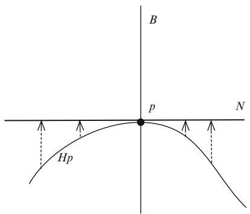

text_image

B
p
N
Hp

Assume that p is on the boundary of $N ^ { \prime }$ . Then we can find a sequence of open sets $O _ { i } ^ { \prime } \subset N ^ { \prime }$ with smooth boundary; $\partial { \cal O } _ { i } ^ { \prime } \cap \partial N ^ { \prime } \neq \emptyset .$ ; and $p = \operatorname* { l i m } _ { i \to \infty } q _ { i }$ for any $q _ { i } \in O _ { i } ^ { \prime }$ . This means that if $O _ { i } = O _ { i } ^ { \prime } \times B$ , then $O _ { i } \cap \mathrm { H } p \ : = \ : \emptyset$ !1and we can find $p _ { i } = ( x _ { i } , y _ { i } ) \in \partial { \cal O } _ { i } \cap$ D -Hp that converge to $( p , 0 ) = p$ \ D. In particular, $T _ { p _ { i } } \mathrm { H } p \subset T _ { p _ { i } } \partial { \cal O } _ { i }$ . DNow dim $T _ { p _ { i } } \mathrm { H } p = k$ and dim $T _ { p _ { i } } \left( \{ x _ { i } \} \times B \right) = n - k$ so it follows that they have a D f g - D nontrivial intersection as they are both subspaces of the $( n - 1 )$ /-dimensional space $T _ { p _ { i } } \partial { \cal O } _ { i } = T _ { x _ { i } } { \cal O } _ { i } ^ { \prime } \oplus T _ { y _ { i } } B$ . On the other hand $T _ { p _ { i } } \left( \{ x _ { i } \} \times B \right)$ converges to $T _ { p } ^ { \perp } N$ and so D ˚by continuity must be almost perpendicular to $T _ { p _ { i } } \mathrm { H } p$ -. This contradicts that $p \in \partial N ^ { \prime }$ .

By shrinking N if necessary we can write Hp $\cap \left( N \times B \right)$ 2as a continuous graph \ -over N. The tangent spaces to the orbits also vary continuously and are almost orthogonal to TB. Thus tangent vectors to the orbits are uniquely determined by their projection on to TN. In particular, any smooth curve in N is mapped to a curve in the orbit. Moreover, the velocity field of the curve has a unique continuous lift to the tangent space of the orbit. It is easy to see that this lifted velocity field is the velocity of the corresponding curve. Similarly we see that the graph is $C ^ { 1 }$ and consequently that the orbit is a $C ^ { 1 }$ submanifold.

To see that the isometry group of M is a $C ^ { 1 }$ Lie group first note that it acts properly on $M ^ { n + 1 } = M \times \cdots \times M$ and thus forms a closed subgroup of the isometry D -    -of this space. Moreover, this action is well-defined and free on the open subset of points $( p _ { 0 } , \dotsc , p _ { n } ) \in O \subset M ^ { n + 1 }$ where $\overrightarrow { p _ { 0 } p _ { i } } , i = 1 , \dots , n$ are linearly independent. 2  DThus the isometry group of M is naturally identified with $\mathbf { a } ~ C ^ { 1 }$ submanifold of O.

Finally, note that the formulas $T _ { h p } \mathrm { H } p = D h \left( T _ { p } \mathrm { H } p \right)$ and $D h = \exp _ { h p } ^ { - 1 } \circ h \circ \exp _ { p }$ D D ı ıshow that the tangent spaces THp to Hp form a submanifold of TM that is as smooth as the group H. So if H is $C ^ { k } , k \geq 1$ , then so is T Hp. But this implies that Hp is a $C ^ { k + 1 }$ submanifold. The above construction then shows that H itself is $C ^ { k + 1 }$ . This finishes the proof that the isometry group is a smooth Lie group.

There are other proofs of this theorem that also work without metric assumptions (see theorem 8.1.6 and [83] or use various profound characterizations of Lie groups as in exercise 6.7.26 and [79]).

The goal is to refine our understanding of the topology near the orbits of the action by a closed subgroup $\mathsf { H } \subset \mathrm { I s o } \left( M , g \right)$ . Such groups are necessarily Lie groups and as such have a Lie group exponential map exp $T _ { e } \mathrm { H } = \mathfrak { h } $ H. The Lie subalgebra of $\mathrm { H } _ { p }$ is denoted ${ \mathfrak { h } } _ { p }$ . Observe that $v \in { \mathfrak { h } } _ { p }$ W Dif and only if $\exp \left( t v \right) \in \mathrm { H } _ { p }$ for all t.

Proposition 5.6.20. $L e t \operatorname { O } _ { p } \left( h \right) =$ hp be the orbit map. Then ker $\left( \left( D \mathsf { O } _ { p } \right) | _ { e } \right) = \mathfrak { h } _ { p }$ and more generally ker $\left( \left( \dot { D } \mathbf { O } _ { p } \right) \vert _ { x } \right) = D L _ { x } \left( \mathfrak { h } _ { p } \right)$ .

Proof. Note that the last statement follows from the first by the chain rule and $\left( h _ { 1 } h _ { 2 } \right) p = h _ { 1 } \left( h _ { 2 } p \right)$ . To establish the first claim we first note that

$$
\left(D \mathrm{O} _ {p}\right) | _ {e} (v) = \frac {d}{d t} (\exp (t v) \cdot p) | _ {t = 0}.
$$

Next observe that

$$
\begin{array}{l} \frac {d}{d t} (\exp (t v) \cdot p) | _ {t = t _ {0}} = \frac {d}{d s} (\exp (t _ {0} v) \exp (s v) \cdot p) | _ {s = 0} \\ = D \left(\exp (t _ {0} v)\right) \left(\frac {d}{d s} (\exp (s v) \cdot p) | _ {s = 0}\right). \\ \end{array}
$$

So if $\left( D 0 _ { p } \right) | _ { e } ( v ) = 0$ , then exp $( t v ) \cdot p = p$ for all t and hence $v \in { \mathfrak { h } } _ { p }$ . The converse jis trivially true.

When H acts freely this proposition implies that all orbits Hp are immersed submanifolds.

Since H consists of isometries there is a natural H-invariant map $E : \mathrm { ~ H ~ } \times T _ { p }$ $M \to M$ defined by

$$
(h, v) \mapsto h \exp_ {p} (v) = \exp_ {h p} \left(D h | _ {p} v\right),
$$

i.e., $E \left( h x , v \right) = h E \left( x , v \right)$ for all $h , x \in \mathrm { H }$ and $v \in T _ { p } M$ .

Theorem 5.6.21 (The Free Slice Theorem). If $_ { \mathrm { ~ \scriptsize ~ H ~ } \subset }$ Iso $( M , g )$ is closed and acts freely, then the quotient H M can be given a smooth manifold structure and Riemannian metric so that $M \to \mathbb { H } \backslash M$ is a Riemannian submersion.

Proof. We just saw that the orbits are properly embedded copies of H. If we restrict the map E to the normal bundle to Hp at $p ,$ , then we obtain a H-invariant map $\exp ^ { \perp } : \mathrm { H } \times T _ { p } ^ { \perp } \mathrm { H } p  M$ . Note that there is a natural trivialization $\mathrm { H } \times T _ { p } ^ { \perp } \mathrm { H } p $ $T ^ { \perp } \mathrm { H } p$ W -defined by $( h , v ) \ \mapsto \ D h | _ { p } ( v )$ - !, which is a linear isometry on the fibers. Moreover, $\exp ^ { \perp }$ 7! jis in fact the normal exponential map $\exp ^ { \perp } \ : \ T ^ { \perp } \mathrm { H } p \  \ M$ W !via this identification. We can then invoke the tubular neighborhood theorem (corollary 5.5.3) to obtain a diffeomorphism from some neighborhood of the zero section in $\mathrm { H } \times T _ { p } ^ { \perp } \mathrm { H } p$ to a neighborhood of the orbit in M. However, we need a uniform neighborhood of the form $\exp ^ { \perp } : \mathrm { H } \times B ( 0 , \epsilon )  M .$ , where $B \left( 0 , \epsilon \right) \subset$ $T _ { p } ^ { \perp } \mathrm { H } p$ W. In such a uniform neighborhood the set $B \left( 0 , \epsilon \right)$ ! is called a slice of the action. Thus a slice is a cross section of a uniform tube (see figure 5.11).

Fig. 5.11 Slices along an orbit   
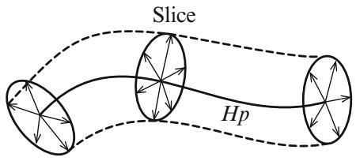

flowchart

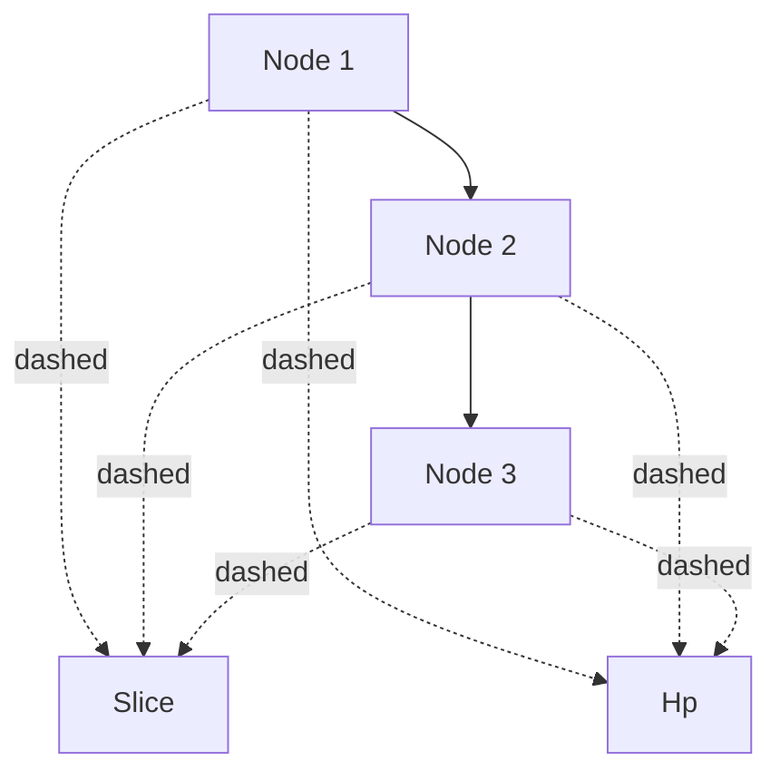

First we find an $\epsilon > 0$ so that $\exp ^ { \perp } : U \times B \left( 0 , \epsilon \right) \to M , e \in U \subset { \mathrm { \bf { H } } }$ is an W - ! 2 embedding. Thus the usual normal exponential map is also an embedding on the -neighborhood of the zero section in $\bar { T } ^ { \perp } U p$ . We can further assume that all closed -balls centered in the image are compact and thus have compact intersection with all orbits.

We can further decrease  so that if $v \in B ( 0 , \epsilon )$ and $\left| ( h p ) \exp _ { p } { ( v ) } \right| < \epsilon$ , then $h \in U$ 2. This shows that p is the unique closest point in Hp to $\begin{array} { r } { \exp _ { p } ( v ) } \end{array}$ . In fact the 2first variation formula shows that any segment from $\begin{array} { r } { \exp _ { p } ( v ) } \end{array}$ to Hp is perpendicular to $\mathrm { H } p$ . Moreover, any such a segment will end at a point hp with $h \in U$ . But then v and the tangent vector to the segment from $h p$ to $\begin{array} { r } { \exp _ { p } ( v ) } \end{array}$ 2are normal vectors to $U p$ that are mapped to the same point. This violates the choice of . This in turn shows that $\exp ^ { \perp } : \mathrm { H } \times B ( 0 , \epsilon )  M$ is an embedding. It is clearly nonsingular since W -this is true at all points $( e , v ) , | v | < \epsilon$ , and $\begin{array} { r } { \exp ^ { \bot } \left( h , v \right) = h \exp _ { p } \left( v \right) } \end{array}$ , where h is a j jdiffeomorphism on M. It is also injective since $\mathrm { e x p ^ { \perp } } \left( h _ { 1 } , v _ { 1 } \right) = \mathrm { e x p ^ { \perp } } \left( h _ { 2 } , v _ { 2 } \right)$ first implies that $\mathrm { e x p } ^ { \perp } \left( h _ { 2 } ^ { - 1 } h _ { 1 } , v _ { 1 } \right) = \mathrm { e x p } ^ { \perp } \left( e , v _ { 2 } \right)$ . This shows that $h _ { 2 } ^ { - 1 } h _ { 1 } \in U$ and then by choice of  that $h _ { 1 } \ = \ h _ { 2 }$ Dand $v _ { 1 } = v _ { 2 }$ 2. Finally the map is proper since Hp is D Dproperly embedded. This shows that it is closed and an embedding.

We have shown that $M \to \mathbb { H } \backslash M$ looks like a locally trivial bundle. The manifold ! nstructure on the quotient comes from the fact that for each $p \in M$ the slice $B \left( 0 , \epsilon \right)$ is mapped homeomorphically to its image in $\mathrm { H } \backslash M .$ 2. These charts are easily shown nto have smooth transition functions. Finally, the metric on $\mathrm { H } \backslash M$ is constructed as in section 4.5.2 by identifying the tangent space at a point $\mathrm { H } p \in \mathrm { H } \backslash M$ with one of the normal spaces $T _ { h p } ^ { \perp } \mathrm { H } p$ and noting that $D h | _ { p }$ maps $T _ { p } ^ { \perp } \mathrm { H } p$ 2 nisometrically to $T _ { h p } ^ { \perp } \mathrm { H } p$ . jThus all of these normal spaces are isometric to each other. This induces a natural Riemannian metric on the quotient that makes the quotient map a Riemannian submersion.

Remark 5.6.22. Let ${ \textsc { K } } \subset { \mathrm { ~ H ~ } }$ be a compact subgroup of a Lie group. Consider the action $( k , x ) \ \mapsto \ x k ^ { - 1 }$ of K on H. As K is compact we can average any metric 7!on H to make it right-invariant under this action by K. Thus we obtain a free action by isometries and we can use the above to make $\mathrm { H } / \mathrm { K }$ a manifold with a Riemannian submersion metric. In case the metric on H is also left-invariant we obtain an isometric action of H on $\mathrm { H } / \mathrm { K }$ that makes $\mathrm { H } / \mathrm { K }$ a homogeneous space.

In case ${ \mathrm { ~ K ~ } } \subset { \mathrm { ~ H ~ } }$ is closed we still obtain a proper action by right multiplication. This can again be made isometric by using a right-invariant metric. However, it is not necessarily possible to also have the metric on H be left-invariant so that H acts by isometries on $\mathrm { H } / \mathrm { K }$ .

Corollary 5.6.23. Let H $\times M \to M$ be a proper isometric action. For each $p \in M$ - !the orbits Hp are properly embedded submanifolds $\mathrm { H } / \mathrm { H } _ { p }  \mathrm { H } p$ .

Proof. We already know that it is a proper injective map and that $\mathrm { H } / \mathrm { H } _ { p }$ has a manifold structure. Furthermore proposition 5.6.20 shows that the differential is also injective. This shows that it is a proper embedding.

The slice representation of a proper isometric action is the linear representation $\mathrm { H } \times T _ { p } ^ { \perp } \mathrm { H } p  T _ { p } ^ { \perp } \mathrm { H } p$ given by $( h , v ) \mapsto D h | _ { p } ( v )$ . If we let $\mathrm { H } _ { p }$ act on H on the right as above, then $\mathrm { H } _ { p }$ naturally acts on $\mathrm { H } \times T _ { p } ^ { \perp } \mathrm { H } p$ and corollary 5.6.23 shows that the quotient H $\times _ { \mathrm { H } _ { p } } T _ { p } ^ { \perp } \mathrm { H } p$ can be given a natural manifold structure.

Theorem 5.6.24 (The Slice Theorem). Let $\mathrm { ~ H ~ } \subset \mathrm { I s o } \left( M , g \right)$ be a closed subgroup. For each $p \in M$ there is a map $\exp ^ { \perp } : \mathrm { H } \times _ { \mathrm { H } _ { p } } T _ { p } ^ { \perp } \mathrm { H } p  M$ that is a diffeomorphism 2 Won a uniform tubular neighborhood H $\times _ { \mathrm { H } _ { p } } B \left( \mathrm { 0 } , \epsilon \right)$ !on to an -neighborhood of the orbit Hp.

Proof. The proof is as in the free case now that we have shown that all orbits are properly embedded. For fixed $p \in M$ consider the bundle map

$$
\begin{array}{l} \mathrm{H} \times T _ {p} ^ {\perp} \mathrm{Hp} \rightarrow T ^ {\perp} \mathrm{Hp} \\ (h, v) \mapsto D h | _ {p} (v). \\ \end{array}
$$

This map is H-invariant, an isomorphism on the fibers, and $\mathrm { H } \times \{ 0 \}$ is mapped to the zero section in $T ^ { \perp } \mathrm { H } p$ represented by the orbit Hp. Since $D \left( h \circ k ^ { - 1 } \right) \mid _ { p } \left( D k \vert _ { p } \left( v \right) \right) =$ $D h \vert _ { p } \left( v \right)$ for any element $k \in \mathrm { H } _ { p }$ ı j j Dthis gives us a natural bundle isomorphism from $\mathrm { H } \dot { \times } _ { \mathrm { H } _ { p } } T _ { p } ^ { \perp } \mathrm { H } p$ to $T ^ { \perp } \mathrm { H } p$ 2. Now define $\exp ^ { \perp } : \mathrm { H } \times _ { \mathrm { H } _ { p } } T _ { p } ^ { \perp } \mathrm { H } p  M$ as the normal exponential map $T ^ { \perp } \mathrm { H } p \to M$ via this identification (see figure 5.12).

!It is now possible to find $\epsilon > 0$ as in theorem 5.6.21 so that $\exp ^ { \perp } : \mathrm {  ~ H ~ } \times _ { \mathrm { H } _ { p } }$ $B ( 0 , \epsilon )  M$ becomes an H-invariant embedding.

Fig. 5.12 A linear slice and a slice in the manifold   
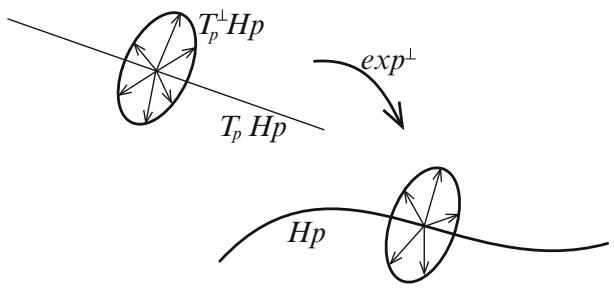

text_image

T_p^\perp Hp
T_p Hp
exp^\perp
Hp

This theorem tells us exactly how H acts near an orbit and allows us to calculate the isotropy of points near a given point.

Corollary 5.6.25. For small $v \in T _ { p } ^ { \perp } \mathrm { H } p$ the isotropy at $\begin{array} { r } { \exp _ { p } ( v ) } \end{array}$ is given by

$$
\mathrm{H} _ {\exp_ {p} (v)} = \left\{h \in \mathrm{H} _ {p} \mid D h | _ {p} v = v \right\}.
$$

This in turn implies.

Corollary 5.6.26. If $_ { \mathrm { ~ H ~ } \subset }$ Iso $( M , g )$ is a closed subgroup with the property that all its isotropy groups are conjugate to each other, then the quotient space is a Riemannian manifold and the quotient map a Riemannian submersion.

# 5.7 Completeness

# 5.7.1 The Hopf-Rinow Theorem

One of the foundational centerpieces of Riemannian geometry is the Hopf-Rinow theorem. This theorem states that all concepts of completeness are equivalent. This should not be an unexpected result for those who have played around with open subsets of Euclidean space. For it seems that in these examples, geodesic and metric completeness break down in exactly the same places.

Theorem 5.7.1 (Hopf and Rinow, 1931). The following statements are equivalent for a Riemannian manifold $( M , g )$ :

(1) M is geodesically complete, i.e., all geodesics are defined for all time.   
(2) M is geodesically complete at p, i.e., all geodesics through p are defined for all time.   
(3) M satisfies the Heine-Borel property, i.e., every closed bounded set is compact.   
(4) M is metrically complete.

Proof. $( 1 ) \Rightarrow ( 2 )$ and $( 3 ) { \Rightarrow } ( 4 )$ are trivial.

) )(4) (1): Recall that every geodesic $c : [ 0 , b ) \ \to \ M$ defined on a maximal )interval must leave every compact set if $b < \infty$ !. This violates metric completeness as $c ( t ) , t \to b$ is a Cauchy sequence.

!(2) (3): Consider ex $) _ { p } : T _ { p } M \to M$ . It suffices to show that

$$
\exp_ {p} \left(\overline {{B}} (0, R)\right) = \overline {{B}} (p, R)
$$

for all R (note that always holds). This will follow if we can show that any point $q \in M$ is joined to p by a segment. By corollary 5.5.6 we can find $\epsilon > 0$ such that any 2point in the compact set $\overline { { B } } \left( p , \epsilon \right) = \exp _ { p } \left( \overline { { B } } ( 0 , \epsilon ) \right)$ can be joined to p by a minimal geodesic. This shows that if $p ^ { \prime } \in \overline { { B } } ( p , \epsilon ) - B ( p , \epsilon )$ is closest to q, then $| p p ^ { \prime } | +$

# 5.7 Completeness

Fig. 5.13 Two short cuts from p to q   
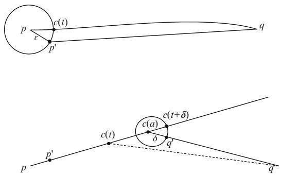

text_image

p
ε
c(t)
p'
q
c(t)
c(a)
c(t+δ)
δ
q'
p
p'

$| p ^ { \prime } q | = | p q |$ . Otherwise, corollary 5.3.10 guarantees a unit speed curve $c \in \Omega _ { p , q }$ j jwith $L ( c ) < | p p ^ { \prime } | + | p ^ { \prime } q |$ (see top of figure 5.13). Choose t so that $c \left( t \right) \in \overline { { B } } \left( p , \epsilon \right) -$ $B \left( p , \epsilon \right)$ j. Since $t + | c \left( t \right) q | \le L ( c ) < | p p ^ { \prime } | + | p ^ { \prime } q |$ it follows that $| c ( t ) q | < | p ^ { \prime } q |$ C j jcontradicting the choice of $p ^ { \prime }$ .

Let $c ( t ) : [ 0 , \infty )  M$ be the unit speed geodesic with $c \left( 0 \right) = p { \mathrm { ~ a n d ~ } } c \left( \epsilon \right) = p ^ { \prime }$ . WWe just saw that $| p q | = \epsilon + | c \left( \epsilon \right) q |$ .

Consider

$$
A = \{t \in [ 0, | p q | ] \mid | p q | = t + | c (t) q | \}.
$$

Clearly $0 , \epsilon \in A$ . Note that if $t \in A$ , then

$$
| p q | = t + | c (t) q | \geq | p c (t) | + | c (t) q | \geq | p q |,
$$

which implies that $t = | p c ( t ) |$ . We first claim that if $a \in A$ , then $[ 0 , a ] \subset A$ . When $t < a$ note that

$$
\begin{array}{l} | p q | \leq | p c (t) | + | c (t) q | \\ \leq | p c (t) | + | c (t) c (a) | + | c (a) q | \\ \leq t + a - t + | c (a) q | \\ \leq a + | c (a) q | \\ = | p q |. \\ \end{array}
$$

This implies that $| p c \left( t \right) | + | c \left( t \right) q | = | p q |$ and $t = | p c ( t ) |$ , showing that $t \in A$ (see also figure 5.13).

Since $t \mapsto | c \left( t \right) q$ is continuous it follows that A is closed.

7! j jFinally, we claim that if $a \in A$ , then $a + \delta \in A$ for sufficiently small $\delta > 0$ . Use corollary 5.5.6 to find $\delta > 0$ 2 C 2so that any point in $\overline { { B } } \left( c \left( a \right) , \delta \right)$ can be joined to $c \left( a \right)$ by a segment (see also figure 5.13). If we select $q ^ { \prime } \in \overline { { B } } \left( c \left( a \right) , \delta \right) - B \left( c \left( a \right) , \delta \right)$ closest to q, then

$$
\begin{array}{l} | p q | = a + | c (a) q | \\ = a + \left| c (a) q ^ {\prime} \right| + \left| q ^ {\prime} q \right| \\ = a + \delta + | q ^ {\prime} q | \\ \geq \left| p q ^ {\prime} \right| + \left| q ^ {\prime} q \right| \\ \geq | p q |. \\ \end{array}
$$

It follows that $| p q ^ { \prime } | = a + \delta$ which tells us that the piecewise smooth geodesic that goes from p to $c \left( a \right)$ D Cand then from $c \left( a \right)$ to $q ^ { \prime }$ is a segment. By corollary 5.4.4 this segment is a geodesic and $q ^ { \prime } = c ( a + \delta )$ . It then follows from $\vert p q \vert = a + \delta + \vert q ^ { \prime } q \vert$ that $c \left( a + \delta \right) \in A$ .

C 2This shows that $A = [ 0 , | p q | ]$ .

From $( 2 ) \Rightarrow ( 3 )$ we get the additional result:

Corollary 5.7.2. $H ( M , g )$ is complete in any of the above ways, then any two points in M can be joined by a segment.

Corollary 5.7.3. If $( M , g )$ admits a proper Lipschitz function $f : M \to \mathbb { R }$ , then M is complete.

Proof. We establish the Heine-Borel property. Let $C \subset M$ be bounded and closed. Since f is Lipschitz the image $f \left( C \right)$ is also bounded. Thus $f \left( C \right) \subset \left[ a , b \right]$ and $C \subset$ $f ^ { - 1 } \left( [ a , b ] \right) . \operatorname { A s } f$ is proper the pre-image $f ^ { - 1 } \left( [ a , b ] \right)$  is compact. Since C is closed and a subset of a compact set it must itself be compact.

This corollary also makes it easy to check completeness for all of our examples related to warped products. In these examples, the distance function can be extended to a proper continuous function on the entire space.

From now on, virtually all Riemannian manifolds will automatically be assumed to be connected and complete.

# 5.7.2 Warped Product Characterization

In theorem 4.3.3 we offered a local characterization of Riemannian manifolds that admit functions whose Hessian is conformal to the metric and saw that these were all locally given by warped product structures. Here we extend this to a global result for complete Riemannian manifolds.

Theorem 5.7.4 (Tashiro, 1965). Let .M; g/ be a complete Riemannian n-mani-fold that admits a nontrivial function f whose Hessian is conformal, i.e., Hess $f = \lambda g .$ . Then $( M , g )$ Dis isometric to a complete warped product metric and must have one of the three forms:

# 5.7 Completeness

(1) $M = \mathbb { R } \times N a n d g = d r ^ { 2 } + \rho ^ { 2 } \left( r \right) g _ { N } ,$

D - D C(2) M  Rn and g  dr2  2 .r/ ds2 , r  0,

(3) $M = S ^ { n } a n d g = d r ^ { 2 } + \rho ^ { 2 } \left( r \right) d s _ { n - 1 } ^ { 2 } , r \in [ a , b ] .$

Proof. We start by identifying N. Recall from theorem 4.3.3 that $\vert \nabla f \vert$ is locally constant on $\{ f = f _ { 0 } \} \cap \{ d f \neq 0 \}$ for each $f _ { 0 } ~ \in ~ \mathbb { R }$ jr j. From this it follows that the f D g \ fconnected components of $\{ f = f _ { 0 } \} \cap \{ d f \neq 0 \}$ 2must be closed. $\operatorname { A s } f$ is nontrivial there f D g\f ¤ gwill be points where the differential doesn’t vanish. Define $N \subset \{ f = f _ { 0 } \} \cap \{ d f \neq 0 \}$  f D g\f ¤ gas any nonempty connected component and note that N is a closed hypersurface in M.

For $p \in N$ the unit speed geodesic though p that is normal to N is given by:

$$
c _ {p} (t) = \exp_ {p} \left(t \frac {\nabla f | _ {p}}{| \nabla f |}\right).
$$

For fixed numbers $a \ < \ 0 \ < \ b$ consider the set $C \subset N$ such that f is regular at $c _ { p } \left( t \right)$ for all $p \in C$ and $t \in [ a , b ]$ . Since the set of regular points is open it follows that $C \subset N$ 2 2is open. Theorem 4.3.3 shows that on $U = \left\{ c _ { p } \left( t \right) \vert p \in C , t \in \left[ a , b \right] \right\}$ we have a warped product structure $g | _ { U } = d r ^ { 2 } + \rho ^ { 2 } \left( r \right) \stackrel { . . . } { g _ { N } }$ j 2 2, where r is the signed distance function to N and

$$
\nabla r = \frac {\nabla f}{| \nabla f |},
$$

$$
f (r) = \int \rho (r) d r.
$$

For all $p \in N$

$$
\frac {d ^ {2} (f \circ c _ {p})}{d t ^ {2}} = g (\nabla f, \ddot {c} _ {p}) + \operatorname{Hess} f (\dot {c} _ {p}, \dot {c} _ {p}) = \lambda \circ c _ {p}
$$

with

$$
\left(f \circ c _ {p}\right) (0) = f _ {0},
$$

$$
\frac {d \left(f \circ c _ {p}\right)}{d t} (0) = g \left(\nabla f, \dot {c} _ {p} (0)\right) = | \nabla f |.
$$

When we restrict attention to U we have $\lambda \circ c _ { p } = \lambda ( f \circ c _ { p } )$ . Thus $f \circ c _ { p }$ satisfies a ı D ısecond-order equation with initial values that do not depend on $p \in C$ ı. In particular, $f \circ c _ { p } ( t )$ depends only on $t \in [ a , b ]$ and not on $p \in C .$ . Similarly,

$$
\frac {d (f \circ c _ {p})}{d t} (t) = g (\nabla f | _ {c _ {p} (t)}, \dot {c} _ {p} (t)) = | \nabla f | _ {c _ {p} (t)} | = \rho (t)
$$

depends only on $t \in [ a , b ]$ and not on $p \in C$ . Continuity of $\big | \nabla f \big | _ { c _ { p } ( t ) } \big |$ with respect to p 2 2 r jand t, combined with the fact that f is regular on U, shows that for fixed $t \in [ a , b ]$ the value $| \nabla f | _ { c _ { p } ( t ) } |$ cannot vanish when $p \in \partial C \subset N$ 2. Thus we have shown that $C \subset N$ r j 2 is both open and closed. Since N connected we conclude that $C = N$ .

Finally, we obtain nontrivial maximal open interval $( a , b ) \ \ni \ 0$ such that $c _ { p } ( t )$ is regular for all $t \in ( a , b )$ and $p \in N$ 3. Moreover, the warped product structure $d r ^ { 2 } + \rho ^ { 2 } \left( r \right) g _ { N }$ 2extends to hold on $( a , b ) \times N$ .

CWhen $( a , b ) = \mathbb { R }$ -we obtain a global warped product structure.

If, say, $b < \infty$ , then the level set $\{ r = b \}$ consists of critical points for f . Since $\rho = | \nabla f |$ 1it follows that $\begin{array} { r } { \operatorname* { l i m } _ { t  b } \rho ( t ) = 0 } \end{array}$ D g. The warped product structure then shows D jr j ! Dthat any two points in N will approach each other as $t  b$ . In other words

$$
\lim _ {t \to b} \left| c _ {p} (t) c _ {q} (t) \right| = 0.
$$

Consequently, $\{ r = b \}$ is a single critical point x. Now consider all of the unit vectors $\dot { c } _ { p } \left( b \right) \in T _ { x } M$ f D g. Since N is a closed submanifold this set of vectors is both closed P 2and open and thus consists of all unit vectors at x. This shows that not only will any geodesic $c _ { p } \left( t \right)$ approach x as $t  b$ , but after it has passed through x it must !coincide with another such geodesic. Thus $\{ f _ { 0 } \le f < f \left( x \right) \} \simeq [ 0 , b ) \times N$ and x is the only critical point in $\left\{ f _ { 0 } \leq f \leq f \left( x \right) \right\}$ f . It also follows that $N \simeq S ^ { n - 1 }$ -since the level f   g 'sets for f near x are exactly distance spheres centered at x. The argument that gN is a round metric on $S ^ { n - 1 }$ can be completed exactly as in the proof of theorem 4.3.3.

A similar argument holds when $- \infty < a$ . We finish the proof by observing that 1we are in case 3 when both a and b are finite and in case 2 when only one of a or b are finite.

With more information about  we expect a more detailed picture of what M can be. In particular, there is a global version of the local classification from corollary 4.3.4.

Theorem 5.7.5. Let $( M , g )$ be a complete Riemannian n-manifold that admits a nontrivial function f whose Hessian satisfies Hess $f = ( \alpha f + \beta ) g , \alpha , \beta \in \mathbb { R }$ . Then $( M , g )$ Dfalls in to one of the following three categories:

(a) $\left( M , g \right) = \left( I \times S ^ { n - 1 } , d r ^ { 2 } + \mathrm { s n } _ { k } ^ { 2 } \left( r \right) d s _ { n - 1 } ^ { 2 } \right)$ , i.e., a constant curvature space form.

(b) $( M , g ) = \left( \mathbb { R } \times N , d r ^ { 2 } + g _ { N } \right)$ , i.e., a product metric.

${ \mathrm { ( c ) } } ~ \left( M , g \right) = \left( \mathbb { R } \times N , d r ^ { 2 } + \left( A \exp \left( { \sqrt { \alpha } } r \right) + B \exp \left( - { \sqrt { \alpha } } r \right) \right) ^ { 2 } h \right) , A , B \geq 0 .$

Proof. From the previous theorem we already know that $g = d r ^ { 2 } + \rho ^ { 2 } \left( r \right) g _ { N } , r \in I .$ , with $f = f \left( r \right) , \rho \left( r \right) = f ^ { \prime } \left( r \right)$ , and $\lambda = \alpha f + \beta = f ^ { \prime \prime }$ .

D D D C DIt’ll be convenient to divide into various special cases.

When $\alpha = \beta = 0$ it follows that  is constant. This is case (b).

When $\alpha = 0$ Dand $\beta \neq 0$ it follows that $\rho = \beta r + \gamma$ . Thus I is a half line where  D ¤ D Cvanishes at the boundary point. This point must correspond to a single critical point for f . The metric is the standard Euclidean metric.

When $\alpha \neq 0$ we can change f to $\textstyle f + { \frac { \beta } { \alpha } }$ . Then Hess $\begin{array} { r } { \left( f + \frac { \beta } { \alpha } \right) = \alpha \left( f + \frac { \beta } { \alpha } \right) } \end{array}$ g so we can assume that $\beta = 0$ . In case $\alpha < 0$ , it follows that $\rho = A$ sin $\left( { \sqrt { - \alpha } } r + r _ { 0 } \right)$ . D D Thus I is a compact interval and the metric becomes a round sphere. In case $\alpha > 0$ , we have that $\rho = A \exp \left( \sqrt { \alpha } r \right) + B \exp \left( - \sqrt { \alpha } r \right)$ , where at least one of A or B must D C be positive. If they are both nonnegative we are in case (c). If they have the opposite sign we can rewrite $\rho = C \sinh \left( \sqrt { \alpha } r + r _ { 0 } \right)$ . Then I is a half line and the metric D Cbecomes a constant negatively curved warped product.

Note that in case (a) the function f has at least one critical point, while in cases (b) and $( \mathrm { c } ) f$ has no critical points. In 1961 Obata established this theorem for round spheres using the equation

$$
\operatorname{Hess} f = (1 - f) g.
$$

Remark 5.7.6. In a separate direction it is shown in [100] that transnormal functions (see remark 4.3.5) on a complete Riemannian manifold give a similar topological decomposition of the manifold. Specifically such functions can have zero, one, or two critical values. All level sets for f are smooth submanifolds, including the critical levels. Moreover, $f = \phi \left( r \right)$ where r is the signed distance to a fixed level set of f .

# 5.7.3 The Segment Domain

In this section we characterize when a geodesic is a segment and use this to find a maximal domain in $T _ { p } M$ on which the exponential map is an embedding. This is achieved through a systematic investigation of when distance functions to points are smooth. All Riemannian manifolds are assumed to be complete in this section, but it is possible to make generalizations to incomplete metrics by working on suitable star-shaped domains.

Fix $p \in ( M , g )$ and let $r ( x ) = \vert p x \vert$ . We know that r is smooth near p and that 2the integral curves for $\partial _ { r }$ D j jare geodesics emanating from $p .$ . Since M is complete, these integral curves can be continued indefinitely beyond the places where r is smooth. These geodesics could easily intersect after some time and consequently fail to generate a flow on M. But having the geodesics at points where r might not be smooth helps us understand the lack of smoothness. We know from section (3.2.6) that another obstruction to r being smooth is the possibility of conjugate points. It is interesting to note that while distance functions generally aren’t smooth, they always have one sided directional derivatives (see exercise 5.9.28).

To clarify matters we introduce some terminology: The segment domain is

$$
\operatorname{seg} (p) = \left\{v \in T _ {p} M \mid \exp_ {p} (t v): [ 0, 1 ] \rightarrow M \text {   is   a   segment } \right\}.
$$

The Hopf-Rinow theorem (see theorem 5.7.1) implies that $M \ = \ \exp _ { p } ( \sec { p ( p ) } )$ . Clearly $\operatorname { s e g } ( p )$ is a closed star-shaped subset of $T _ { p } M .$ D. The star interior of $\operatorname { s e g } ( p )$ is

$$
\operatorname{seg} ^ {0} (p) = \left\{s v \mid s \in [ 0, 1), v \in \operatorname{seg} (p) \right\}.
$$

Below we show that this set is in fact the interior of $\operatorname { s e g } ( p )$ , but this requires that we know it is open. We start by proving

Proposition 5.7.7. $I f x \in \exp _ { p } ( \sec ^ { 0 } ( p ) )$ , then it is joined to p by a unique segment. In particular, $\exp _ { p }$ is injective on $\operatorname { s e g } ^ { 0 } \left( p \right)$ .

Proof. To see this note that there is a segment $\sigma : [ 0 , 1 ) \to M$ with $\sigma ( 0 ) = p$ and $\sigma ( t _ { 0 } ) = x , t _ { 0 } < 1$ . Therefore, should $\hat { \sigma } : [ 0 , t _ { 0 } ] \to M$ ! Dbe another segment from $p$ to D O W !x, then we could construct a nonsmooth segment

$$
c (s) = \left\{ \begin{array}{l} \hat {\sigma} (s), s \in [ 0, t _ {0} ], \\ \sigma (s), s \in [ t _ {0}, 1 ]. \end{array} \right.
$$

Corollary 5.4.4 shows this is impossible.

On the image $U _ { p } = \exp _ { p } ( \sec ^ { 0 } ( p ) )$ define $\partial _ { r } = D \exp _ { p } ( \partial _ { r } )$ . We expect this to be the gradient for

$$
r (x) = | p x | = \left| \exp_ {p} ^ {- 1} (x) \right|.
$$

From the proof of lemma 5.5.5 it follows that r will be smooth on $U _ { p }$ with gradient $\partial _ { r }$ if $\exp _ { p } : \sec ^ { 0 } ( p )  U _ { p }$ is a diffeomorphism between open sets. Since the map is W !injective we have to show that it is nonsingular and that $\mathrm { s e g } ^ { 0 } ( p )$ is open. The image will then automatically also be open by the inverse function theorem. We start by proving that the map is nonsingular.

Lemma 5.7.8. e ${ \mathfrak { p } } _ { p } : \sec ^ { 0 } ( p ) \to U _ { p }$ is nonsingular everywhere, or, in other words, $D \exp _ { p }$ W !is nonsingular at every point in $\mathrm { s e g } ^ { 0 } ( p )$ .

Proof. The standard proof of this statement uses Jacobi fields and is outlined in exercise 6.7.24, but in essence there is very little difference between the two proofs.

The proof is by contradiction. As the set of singular points is closed we can assume that $\exp _ { p }$ is singular at $v \in \mathrm { s e g } ^ { 0 } ( p )$ and nonsingular at all points $t v , t \in$ $[ 0 , 1 )$ . Since $c \left( t \right) = \exp _ { p } \left( t v \right)$ 2 2/ is an embedding on Œ0; 1/ we can find neighborhoods U around $[ 0 , 1 ) v \subset T _ { p } \dot { M }$ and V around $c ( [ 0 , 1 ) ) \subset M$ such that $\exp _ { p } : U \to V$ is a diffeomorphism. Note that $v \not \in U$ and $c ( 1 ) \notin V .$ W !. If we take a tangent vector $w \in T _ { v } T _ { p } M$ … …, then we can extend it to a Jacobi field J on $T _ { p } M , \mathrm { i . e . , } [ \partial _ { r } , J ] = 0$ . 2Next J can be pushed forward via $\exp _ { p }$ to a vector field on $V ,$ D also called J, that also

# 5.7 Completeness

commutes with $\partial _ { r }$ . If $D \exp _ { p } | _ { v } w = 0$ , then

$$
\lim _ {t \to 1} J | _ {\exp (t v)} = \lim _ {t \to 1} D \exp_ {p} (J) | _ {\exp (t v)} = 0.
$$

In particular, we see that $D \exp _ { p _ { p } }$ is singular at v if and only if $\begin{array} { r } { \exp _ { p } ( v ) } \end{array}$ is a conjugate point for r. This characterization naturally assumes that r is smooth on a region that has $\mathrm { e x p } _ { p } \left( v \right)$ as a accumulation point.

The fact that

$$
\lim _ {t \to 1} | J | ^ {2} \mid_ {\exp (t v)} \to 0 \text {   as   } t \to 1
$$

implies that

$$
\lim _ {t \to 1} \log | J | ^ {2} \left| _ {\exp (t v)} \rightarrow - \infty \text {   as   } t \rightarrow 1. \right.
$$

Therefore, there must be a sequence of numbers $t _ { n } \to 1$ such that

$$
\frac {\partial_ {r} | J | ^ {2}}{| J | ^ {2}} \big | _ {\exp (t _ {n} v)} \rightarrow - \infty \text {   as   } n \rightarrow \infty .
$$

Now use the first fundamental equation evaluated on the Jacobi field J (see proposition 3.2.11 and section 3.2.4) to conclude that: $\partial _ { r } \left| J \right| ^ { 2 } = 2 \operatorname { H e s s } r \left( J , J \right)$ . This shows that:

$$
\frac {\operatorname{Hess} r (J , J)}{| J | ^ {2}} \mid_ {\exp (t _ {n} v)} \rightarrow - \infty \text {   as   } n \rightarrow \infty .
$$

By assumption $c ( t ) = \exp _ { p } ( t v )$ is a segment on some interval $[ 0 , 1 + \varepsilon ] , \varepsilon > 0$ . DUse corollary 5.5.2 to choose " so small that $\tilde { r } ( x ) = | x c ( 1 + \varepsilon ) |$ Cis smooth on a ball $\boldsymbol { B } ( \boldsymbol { c } ( 1 + \varepsilon ) , 2 \varepsilon )$ Q D j C j(see figure 5.14 for a schematic picture of J and a corresponding CJacobi field for $\tilde { r }$ that agrees with J at $t _ { n } )$ . Then consider the function

$$
e (x) = r (x) + \tilde {r} (x).
$$

From the triangle inequality, we know that

$$
e (x) \geq 1 + \varepsilon = | p c (1 + \varepsilon) |.
$$

Fig. 5.14 A field that gives shorter curves from $p$ to $c ( 1 + \epsilon )$   
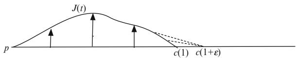

text_image

J(t)
p
c(1) c(1+\varepsilon)

Furthermore, $e ( x ) = 1 + \varepsilon$ whenever $x = c ( t ) , t \in [ 0 , 1 + \varepsilon ]$ . Thus, e has an absolute minimum along $c ( t )$ C D 2 Cand consequently has nonnegative Hessian at all the points $c ( t )$ . On the other hand,

$$
\frac {\mathrm{Hess} e (J , J)}{| J | ^ {2}} | _ {\exp (t _ {n} v)} = \frac {\mathrm{Hess} r (J , J)}{| J | ^ {2}} | _ {\exp (t _ {n} v)} + \frac {\mathrm{Hess} \tilde {r} (J , J)}{| J | ^ {2}} | _ {\exp (t _ {n} v)} \underset {n \to \infty} {\rightarrow} - \infty
$$

since Hess $\tilde { r }$ is bounded in a neighborhood of $c ( 1 )$ and the term involving Hess r Qgoes to as $n \to \infty$ .

We have shown that $\exp _ { p }$ is injective and has nonsingular differential on $\mathrm { s e g } ^ { 0 } ( p )$ . Before showing that $\mathrm { s e g } ^ { 0 } ( p )$ is open we characterize elements in the star “boundary” of $\mathrm { s e g } ^ { 0 } ( p )$ as points that fail to have one of these properties.

Lemma 5.7.9. If $\mathbf { \chi } ^ { \cdot } v \in \sec ( p ) - \sec ^ { 0 } ( p )$ , then either

(1) w $( \neq v ) \in \sec ( p )$ such that $\exp _ { p } ( v ) = \exp _ { p } ( w )$ , or

(2) $D \exp _ { p }$ 2is singular at v.

Proof. Let $c ( t ) \ = \ \exp _ { p } ( t v )$ . For $t \ > \ 1$ choose segments $\sigma _ { t } ( s ) , s \in [ 0 , 1 ]$ , with $\sigma _ { t } ( 0 ) = p ,$ , and $\sigma _ { t } ( 1 ) = { \mathrm { \dot { \sigma } } } c ( t )$ . Since we have assumed that $c | _ { [ 0 , t ] }$ 2is not a segment for $t > 1$ Dwe see that $\dot { \sigma } _ { t } ( 0 )$ is never proportional to ${ \dot { c } } ( 0 )$ j. Now choose $t _ { n } \to 1$ such that $\dot { \sigma } _ { t _ { n } } ( 0 )  w \in T _ { p } M$ . We have that

$$
L (\sigma_ {t _ {n}}) = | \dot {\sigma} _ {t _ {n}} (0) | \rightarrow L (c | _ {[ 0, 1 ]}) = | \dot {c} (0) |,
$$

so $| w | = | \dot { c } ( 0 ) |$ . Now either $w = { \dot { c } } ( 0 )$ or $w \ne \dot { c } ( 0 )$ . In the latter case w cannot be a j j D jP jpositive multiple of ${ \dot { c } } \left( 0 \right)$ since $| w | = | \dot { c } ( 0 ) |$ ¤ P. Therefore, we have found the promised P j j D jP jw in (1). If the former happens, we must show that $D \exp _ { p }$ is singular at v. If, in fact, $D \exp _ { p }$ is nonsingular at v, then $\exp _ { p }$ is an embedding near v. Thus, $\dot { \sigma } _ { t _ { n } } ( 0 )  v =$ ${ \dot { c } } ( 0 )$ together with $\exp _ { p } ( \dot { \sigma } _ { t _ { n } } ( 0 ) ) = \dot { \exp } _ { p } ( t _ { n } \dot { c } ( 0 ) )$ implies $\dot { \sigma } _ { t _ { n } } ( 0 ) = t _ { n } \cdot v$ ! D. This shows Pthat $c$ P Dis a segment on some interval $[ 0 , t _ { n } ] , t _ { n } > 1$ P D which is a contradiction.

Notice that in the first case the gradient $\partial _ { r }$ on M becomes undefined at $x =$ $\mathrm { e x p } _ { p } ( v )$ , since it could be either $D \exp _ { p } ( v )$ or $D \exp _ { p } ( w )$ D; while in the second case the Hessian of $r$ becomes undefined, since it is forced to go to $- \infty$ along certain fields. Finally we show

Proposition 5.7.10. $\mathrm { s e g } ^ { 0 } ( p )$ is open.

Proof. If we fix $v \in \mathrm { s e g } ^ { 0 } ( p )$ , then there is going to be a neighborhood $V \subset T _ { p } M$ around v on which $\exp _ { p }$ is a diffeomorphism onto its image. If $v _ { i } \in V$ converge to $v ,$ , then $D \exp _ { p }$ is also nonsingular at $v _ { i }$ . For each i choose $w _ { i } \in \mathsf { s e g } ( p )$ such that $\mathrm { e x p } _ { p } ( v _ { i } ) = \mathrm { e } \mathbf { \dot { x } } \mathbf { p } _ { p } ( w _ { i } )$ . When $w _ { i }$ has an accumulation point $w \ne v$ it follows that $v \not \in \sec ^ { 0 } ( p )$ . Hence $w _ { i }  v$ and $w _ { i } \in V$ for large i. As $\exp _ { p }$ ¤is a diffeomorphism …on V this implies that $w _ { i } = v _ { i }$ 2and that $v _ { i } \in \mathsf { s e g } ( p )$ . We already know that $\exp _ { p }$ is nonsingular at $v _ { i }$ D. Moreover, as $w _ { i } = v _ { i }$ 2condition (1) in lemma 5.7.9 cannot hold.

# 5.7 Completeness

It follows that $v _ { i } \in \mathrm { s e g } ^ { 0 } ( p )$ for large i and hence that $V \cap \operatorname { s e g } ^ { 0 } ( p )$ is a neighborhood of v.

All of this implies that $r ( x ) \ = \ | p x |$ is smooth on the open and dense subset $U _ { p } - \{ p \} \subset M$ D j jand in addition that it is not smooth on $M - U _ { p }$ .

 f gThe set $\sec ( p ) - \sec ^ { 0 } ( p )$ is called the cut locus of $p$ in $T _ { p } M$ . Thus, being inside the cut locus means that we are on the region where $r ^ { 2 }$ is smooth. Going back to our characterization of segments, we have

Corollary 5.7.11. Let $c : [ 0 , \infty ) \to M$ be a geodesic with $c ( 0 ) = p .$ . If

$$
\operatorname{cut} (\dot {c} (0)) = \sup \left\{t \mid c | _ {[ 0, t ]} i s a s e g m e n t \right\},
$$

then r is smooth at $c ( t ) , ~ t ~ < ~ \mathrm { c u t } ( \dot { c } ( 0 ) )$ , but not smooth at $x \ = \ c ( \operatorname { c u t } ( { \dot { c } } ( 0 ) ) )$ . PFurthermore, the failure of r to be smooth at x is because $\exp _ { p } : \sec ( p )  M$ either fails to be one-to-one at x or has x as a critical value.

# 5.7.4 The Injectivity Radius

In a complete Riemannian manifold the injectivity radius is the largest radius " for which

$$
\exp_ {p}: B (0, \varepsilon) \to B (p, \varepsilon)
$$

is a diffeomorphism. If $v \in \mathrm { s e g } ( p ) - \mathrm { s e g } ^ { 0 } ( p )$ is the closest point to 0 in this set, then in fact $\operatorname { i n j } ( p ) = | v |$ 2 . It turns out that such v can be characterized as follows:

Lemma 5.7.12 (Klingenberg). Suppose $v ~ \in ~ \sec ( p ) - \sec ^ { 0 } ( p )$ and that $| v | \ =$ inj.p/. Either

(1) there is precisely one other vector $v ^ { \prime }$ with

$$
\exp_ {p} (v ^ {\prime}) = \exp_ {p} (v),
$$

and $v ^ { \prime }$ is characterized by

$$
\frac {d}{d t} | _ {t = 1} \exp_ {p} (t v ^ {\prime}) = - \frac {d}{d t} | _ {t = 1} \exp_ {p} (t v),
$$

or

(2) $\begin{array} { r } { x = \exp _ { p } \left( v \right) } \end{array}$ is a critical value for ex $\mathfrak { p } _ { p } : \sec ( p )  M .$

In the first case there are exactly two segments from p to $x = \exp _ { p } ( v )$ , and they fit together smoothly at x to form a geodesic loop based at $p .$ .

Fig. 5.15 Moving closer to $p$ from x   
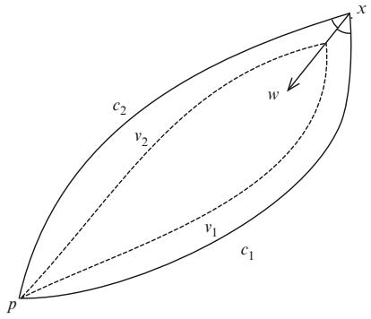

text_image

c₂
v₂
w
x
v₁
c₁
p

Proof. Suppose x is a regular value for ex ${ \mathfrak { p } } _ { p } : \sec ( p ) \to M$ and that $c _ { 1 } , c _ { 2 } : [ 0 , 1 ] $ M are segments from p to $x = \exp _ { p } ( v )$ . If $\dot { c } _ { 1 } ( 1 ) \neq - \dot { c } _ { 2 } ( 1 )$ W, then we can find $w \in$ $T _ { x } M$ such that $g ( w , \dot { c } _ { 1 } ( 1 ) ) < 0$ Dand $\begin{array} { r } { \dot { g } ( w , \dot { c } _ { 2 } ( 1 ) ) < 0 , \mathrm { i . e . } } \end{array}$ P., w forms an angle $> \frac { \pi } { 2 }$ 2with both ${ \dot { c } } _ { 1 } ( 1 )$ and ${ \dot { c } } _ { 2 } ( 1 )$ . Next select $c \left( s \right)$ Pwith $\dot { c } \left( 0 \right) = w . \mathrm { A s } D \exp _ { p }$ is nonsingular at $\dot { c } _ { i } ( 0 )$ P Pthere are unique curves $v _ { i } \left( s \right) \in T _ { p } M$ Pwith $v _ { i } \left( 0 \right) = \dot { c } _ { i } \left( 0 \right)$ and $\begin{array} { r } { D \exp _ { p } \left( v _ { i } \left( s \right) \right) = } \end{array}$ $c \left( s \right)$ 2(see also figure 5.15). But the curves $t \mapsto \exp _ { p } \left( t v _ { i } \left( s \right) \right)$ have length

$$
| v _ {i} | = | p c (s) | <   | p x | = | v |.
$$

This implies that $\exp _ { p }$ is not one-to-one on $\mathrm { s e g } ^ { 0 } ( p )$ , a contradiction.

# 5.8 Further Study

There are several textbooks on Riemannian geometry such as [23, 24, 47, 65] and [80] that treat most of the more basic material included in this chapter. All of these books, as is usual, emphasize the variational approach as being the basic technique used to prove every theorem. To see how the variational approach works the text [75] is also highly recommended.

# 5.9 Exercises

EXERCISE 5.9.1. Assume that $( M , g )$ has the property that all unit speed geodesics exist for a fixed time $\varepsilon > 0$ . Show that $( M , g )$ is geodesically complete.

EXERCISE 5.9.2. Let $c : I \to ( M , g )$ and $\phi : J \to I$ , where I; J are intervals. Show that

$$
\frac {d (c \circ \phi)}{d t} = \dot {c} \circ \phi \frac {d \phi}{d t},
$$

# 5.9 Exercises

$$
\frac {d ^ {2} (c \circ \phi)}{d t ^ {2}} = \dot {c} \circ \phi \frac {d ^ {2} \phi}{d t ^ {2}} + \ddot {c} \circ \phi \left(\frac {d \phi}{d t}\right) ^ {2}.
$$

EXERCISE 5.9.3. Show that if the coordinate vector fields in a chart are orthogonal $( g _ { i j } = 0 \mathrm { f o r } i \neq j )$ , then the geodesic equations can be written as

$$
\frac {d}{d t} \left(g _ {i i} \frac {d c ^ {i}}{d t}\right) = \frac {1}{2} \sum_ {j} \frac {\partial g _ {j j}}{\partial x ^ {i}} \left(\frac {d c ^ {j}}{d t}\right) ^ {2}.
$$

EXERCISE 5.9.4. Show that a regular curve can be reparametrized to be a geodesic if and only if the acceleration is tangent to the curve.

EXERCISE 5.9.5. Let $O \subset \left( M , g \right)$ be an open subset of a Riemannian manifold. Show that if $( O , g )$ is complete, then $O = M$ .

EXERCISE 5.9.6. A Riemannian manifold is called Misner complete if every geodesic $c : ( a , b ) \to M$ with $b - a < \infty$ lies in a compact set. Show that Misner W ! completeness implies completeness.

EXERCISE 5.9.7. Consider a curve $c \in \Omega _ { p , q }$ with $L \left( c \right) = \left| p q \right|$ .

(1) Show that $L \left( c | _ { [ a , b ] } \right) = | c ( a ) c ( b ) |$ for all a; $b \in [ 0 , 1 ]$ .   
j D j(2) Show that there is a segment $\sigma \in \Omega _ { p , q }$ 2and a monotone function $\varphi : [ 0 , 1 ] \to$ Œ0; 1 such that $c = \sigma \circ \varphi$ 2 W. Note that ' need not be smooth everywhere.

EXERCISE 5.9.8. Let $( M , g )$ be a metrically complete Riemannian manifold and $\tilde { g }$ another metric on M such that $\tilde { g } \geq g$ . Show that $( M , \tilde { g } )$ Qis also metrically complete.

EXERCISE 5.9.9. A Riemannian manifold is said to be homogeneous if the isometry group acts transitively. Show that homogeneous manifolds are geodesically complete.

EXERCISE 5.9.10. Consider a Riemannian metric $( M , g ) \ = \ ( \mathbb { R } \times N , d r ^ { 2 } + g _ { r } )$ , where $( N , g _ { r } )$ is complete for all $r \in \mathbb { R } , { \mathrm { e . g . } } , ( M , g ) = \left( \mathbb { R } \times { \dot { N } } , d r ^ { 2 } + \rho ^ { 2 } \left( r \right) g _ { N } \right)$ where $\rho : \mathbb { R } \to ( 0 , \infty )$ and $( N , g _ { N } )$ D - Cis metrically complete. Show that $( M , g )$ is W !metrically complete.

EXERCISE 5.9.11. Consider metrics $\begin{array} { l l l } { { ( M , g ) } } & { { = } } & { { \left( ( 0 , \infty ) \times N , d r ^ { 2 } + \rho ^ { 2 } \left( r \right) g _ { N } \right) } } \end{array}$ , where $\rho : ( 0 , \infty ) \to ( 0 , \infty )$ and $( N , g _ { N } )$ D 1 - Cis complete. Give examples that are W 1 ! 1complete and examples that are not complete.

EXERCISE 5.9.12. Assume $F : ( M , g ) \to \left( { \mathbb R } ^ { k } , g _ { \mathbb R ^ { k } } \right)$ is a Riemannian submersion, where $( M , g )$ W !is complete. Show that if each of the components of F has zero Hessian, then $( M , g ) = ( N , h ) \times \left( \mathbb { R } ^ { k } , g _ { \mathbb { R } ^ { k } } \right)$ .

EXERCISE 5.9.13. Find and fill in the gap in the proof of theorem 5.6.16.

EXERCISE 5.9.14. Show that a Riemannian manifold that is isotropic at every point is also homogeneous. Being isotropic at $p \in M$ means that $\mathrm { I s o } _ { p }$ acts transitively on the unit sphere in $T _ { p } M$ .

EXERCISE 5.9.15. Assume that we have coordinates in a Riemannian manifold so that $g _ { 1 i } = \delta _ { 1 i }$ . Show that $x ^ { 1 }$ is a distance function.

EXERCISE 5.9.16. Let $r : U \to \mathbb { R }$ be a distance function on an open set $U \subset$ $( M , g )$ W. Define another metric $\hat { g }$ !on M with the property: $\hat { \boldsymbol g } \left( \nabla r , \boldsymbol v \right) = \boldsymbol g \left( \nabla r , \boldsymbol v \right)$ for all v, where $\nabla r$ Ois the gradient with respect to $g .$ O r D rShow that r is also a distance rfunction with respect to $\hat { g } .$ .

EXERCISE 5.9.17. The projective models of $S ^ { n } \left( R \right)$ and $H ^ { n } \left( R \right)$ come from projecting the spaces along straight lines through the origin to the hyperplane $x ^ { n + 1 } = R$ .

(1) Show that if $x \in \mathbb { R } ^ { n + 1 }$ and $x ^ { n + 1 } > 0$ , then the projected point is

$$
P (x) = R \left(\frac {x ^ {1}}{x ^ {n + 1}}, \dots , \frac {x ^ {n}}{x ^ {n + 1}}, 1\right).
$$

(2) Show that geodesics on $S ^ { n } \left( R \right)$ and $H ^ { n } \left( R \right)$ are given by intersections with 2- dimensional subspaces.   
(3) Show that the upper hemisphere of $S ^ { n } \left( R \right)$ projects to all of $x ^ { n + 1 } = R$ .   
(4) Show that $H ^ { n } \left( R \right)$ projects to an open disc of radius R in $x ^ { n + 1 } = R$ .   
(5) Show that geodesics on $S ^ { n } \left( R \right)$ and $H ^ { n } \left( R \right)$ Dproject to straight lines in $x ^ { n + 1 } = R$ .

EXERCISE 5.9.18. Show that any Riemannian manifold $( M , g )$ admits a conformal change $\left( M , \lambda ^ { 2 } g \right)$ that is complete. Hint: Choose $\lambda : M \to [ 1 , \infty )$ to be a proper function that grows rapidly.

EXERCISE 5.9.19. On an open subset $U \subset \mathbb { R } ^ { n }$ we have the induced distance from the Riemannian metric, and also the induced distance from $\mathbb { R } ^ { n }$ .

(1) Give examples where U isn’t convex and the two distance concepts agree.

(2) Give examples of U, where $\bar { U }$ is convex, but the two distance concepts do not agree.

EXERCISE 5.9.20. Let $M \subset ( \bar { M } , g )$ be a submanifold. Using the T-tensor introduced in 2.5.25 show that $T \equiv 0$ on M if and only if $M \subset ( { \bar { M } } , g )$ is totally geodesic.

EXERCISE 5.9.21. Let $f : ( M , g ) \to \mathbb { R }$ be a smooth function on a Riemannian manifold.

(1) Let $c : ( a , b ) \to M$ be a geodesic. Compute the first and second derivatives of $f \circ c .$ .   
ı(2) Use this to show that at a local maximum (or minimum) for f the gradient is zero and the Hessian nonpositive (or nonnegative).

# 5.9 Exercises

(3) Show that f has everywhere nonnegative Hessian if and only ${ \mathrm { i f } } f \circ c$ is convex for all geodesics c in $( M , g )$ .

EXERCISE 5.9.22. Assume the volume form near a point in a Riemannian manifold is written as $\lambda \left( r , \theta \right)$ dr $\textstyle \bigwedge \mathbf { v o l } _ { n - 1 }$ , where $\mathrm { v o l } _ { n - 1 }$ denotes the standard volume form on ^the unit sphere. Show that  $\left( r , \theta \right) = r ^ { n - 1 } + O \left( r ^ { n + 1 } \right)$ .

EXERCISE 5.9.23. Let $N \subset M$ be a properly embedded submanifold of a complete Riemannian manifold $( M , g )$ .

(1) The distance from N to $x \in M$ is defined as

$$
| x N | = \inf \left\{\left| x p \right| \mid p \in N \right\}.
$$

A unit speed curve $\sigma : [ a , b ] \to M$ with $\sigma \left( a \right) \in N , \sigma \left( b \right) = x .$ and $L \left( \sigma \right) = \left| x N \right|$ W ! 2 D D j jis called a segment from x to N. Show that  is also a segment from N to any $\sigma \left( t \right) , t < b$ . Show that $\dot { \sigma } \left( a \right)$ is perpendicular to N.

P(2) Show that if N is a closed subset of M and $( M , g )$ is complete, then any point in M can be joined to N by a segment.

(3) Show that in general there is an open neighborhood of N in M where all points are joined to N by segments.

(4) Show that $r \left( x \right) = \left| x N \right|$ is smooth on a neighborhood of N with N excluded.

D j j(5) Show that the integral curves for $\nabla r$ are the geodesics that are perpendicular to $N .$ .

EXERCISE 5.9.24. Find the cut locus on a square torus $\mathbb { R } ^ { 2 } / \mathbb { Z } ^ { 2 }$ .

EXERCISE 5.9.25. Find the cut locus on a sphere and real projective space with the constant curvature metrics.

EXERCISE 5.9.26. Show that in a Riemannian manifold,

$$
\left| \exp_ {p} (v) \exp_ {p} (w) \right| = | v - w | + O \left(r ^ {2}\right),
$$

where $| v | , | w | \leq r .$

EXERCISE 5.9.27. Consider a Riemannian manifold and let $r \left( x \right) = \left| x p \right|$ . Introduce exponential normal coordinates $x ^ { i }$ at $p .$ .

(1) Show that

$$
\left(\operatorname{Hess} x ^ {i}\right) _ {k l} = \Gamma_ {k l} ^ {i} = O (r).
$$

(2) Use that $\textstyle { \frac { 1 } { 2 } } r ^ { 2 } = { \frac { 1 } { 2 } } \sum \left( x ^ { i } \right) ^ { 2 }$ together with $g = \delta _ { i j } + O \left( r ^ { 2 } \right)$ to show that

$$
\operatorname{Hess} \frac {1}{2} r ^ {2} = g + O (r ^ {2}).
$$

(3) Show that

$$
\operatorname{Hess} r = \frac {1}{r} g _ {r} + O (r).
$$

EXERCISE 5.9.28. Let $( M , g )$ be a complete Riemannian manifold; $K \subset M$ a compact (or properly embedded) submanifold; and $r \left( x \right) \ = \ \left| x K \right|$ the distance D j jfunction to K. The goal is to show that r has well-defined one sided directional derivatives at all points.

(1) Show that if r is differentiable at x  K, then $\xrightarrow [ x K ] { }$ only contains one vector.

(2) Let $c : I \to M$ …be a unit speed curve. Show that if $f = r \circ c$ is differentiable at t, then all the vectors $\overrightarrow { c ( t ) K }$ form the same angle with $\dot { c } \left( t \right)$ .

(3) More generally show that

$$
\overline {{D}} ^ {+} f \left(t _ {0}\right) = \operatorname * {l i m s u p} _ {t \to t _ {0} ^ {+}} \frac {f \left(t\right) - f \left(t _ {0}\right)}{t - t _ {0}} \leq g \left(\dot {c} \left(t _ {0}\right), - \overrightarrow {c (t _ {0}) K}\right).
$$

Hint: Use the first variation formula for a variation of the segment to K with initial velocity $\overrightarrow { c ( t _ { 0 } ) K }$ .

(4) Show that for small $h = t - t _ { 0 }$

$$
\left| c \left(t _ {0}\right) c (t) \right| = h + O \left(h ^ {2}\right).
$$

(5) Select a point q on a segment from $c \left( t \right)$ to K such that $| c \left( t \right) q | = h ^ { \alpha }$ where $\alpha \in ( 0 , 1 )$ and let $\theta$ be the angle between $\dot { c } \left( t \right)$ and the initial direction $\overrightarrow { c ( t ) K }$ for 2the segment through $q .$ For small $h = t - t _ { 0 } > 0$ justify the following:

$$
\begin{array}{l} \left| c \left(t _ {0}\right) K \right| \leq \left| c \left(t _ {0}\right) q \right| + \left| q K \right| \\ = \sqrt {h ^ {2 \alpha} + h ^ {2} - 2 h ^ {1 + \alpha} \cos (\pi - \theta) + O (h ^ {2 + \alpha})} + | q K | + O (h ^ {2 \alpha}) \\ \leq | c (t) q | + | q K | - h \cos (\pi - \theta) + \frac {1}{2} h ^ {2 - \alpha} + O (h ^ {2}) + O (h ^ {2 \alpha}) \\ = | c (t) K | - h \cos (\pi - \theta) + \frac {1}{2} h ^ {2 - \alpha} + O \left(h ^ {2}\right) + O \left(h ^ {2 \alpha}\right). \\ \end{array}
$$

Hint: Use 5.9.26 and part (4) to estimate $| c ( t _ { 0 } ) q |$ .

(6) Show that for suitable ˛

$$
\underline {{D}} ^ {+} f \left(t _ {0}\right) = \operatorname * {l i m i n f} _ {t \to t _ {0} ^ {+}} \frac {f \left(t\right) - f \left(t _ {0}\right)}{t - t _ {0}} \geq \min _ {\overrightarrow {c (t _ {0}) K}} g \left(\dot {c} \left(t _ {0}\right), - \overrightarrow {c (t _ {0}) K}\right).
$$

(7) Conclude that the right-hand (and left-hand) derivatives of f exist everywhere.

# 5.9 Exercises

EXERCISE 5.9.29. In a metric space $( X , | \cdots | )$ one can measure the length of continuous curves $c : [ a , b ] \to X$ by

$$
L (c) = \sup \left\{\sum \left| c \left(t _ {i}\right) c \left(t _ {i + 1}\right) \right| \mid a = t _ {1} \leq t _ {2} \leq \dots \leq t _ {k - 1} \leq t _ {k} = b \right\}.
$$

(1) Show that a curve has finite length if it is absolutely continuous. Hint: Use the characterization that $c : [ a , b ] \to X$ is absolutely continuous if and only if for each $\varepsilon \ > \ 0$ Wthere is a $\delta \ > \ 0$ so that $\sum | c \left( s _ { i } \right) c \left( s _ { i + 1 } \right) | \ \leq \ \varepsilon$ provided $\sum | s _ { i } - s _ { i + 1 } | \leq \delta$ .   
j  C j (2) Show that the Cantor step function is a counter example to the converse of (1).   
(3) Show that this definition gives back our previous definition for smooth curves on Riemannian manifolds. In fact it will also give us the same length for absolutely continuous curves. Hint: If you know how to prove this in the Euclidean situation, then exercise 5.9.26 helps to approximate with the Riemannian metric.   
(4) Let $c : [ a , b ] \to M$ be an absolutely continuous curve of length $| c ( a ) c ( b ) |$ . WShow that $c = \sigma \circ \varphi$ for some segment $\sigma$ and monotone $\varphi : [ 0 , L ] \to [ a , b ]$ .

EXERCISE 5.9.30. Assume that we have coordinates $x ^ { i }$ around a point $p \in ( M , g )$ such that $x ^ { i } \left( p \right) = 0$ and $g _ { i j } x ^ { j } = \delta _ { i j } x ^ { j }$ 2. Show that these must be exponential normal Dcoordinates. Hint: Define $r = \sqrt { \delta _ { i j } x ^ { i } x ^ { j } } ;$ show that it is a smooth distance function away from $p ;$ D I and that the integral curves for the gradient are geodesics emanating from $p .$ .

EXERCISE 5.9.31. If $N _ { 1 } , N _ { 2 } \subset M$ are totally geodesic submanifolds, show that each component of $N _ { 1 } \cap N _ { 2 }$ is a submanifold which is totally geodesic. Hint: The potential tangent space at $p \in N _ { 1 } \cap N _ { 2 }$ should be the Zariski tangent space $T _ { p } N _ { 1 } \cap T _ { p } N _ { 2 }$ .

EXERCISE 5.9.32. Let $F : ( M , g ) \to ( M , g )$ be an isometry that fixes $p \in M$ . Show that $D F | _ { p } = - I$ on $T _ { p } M$ W !if and only if $F ^ { 2 } = i d _ { M }$ 2and p is an isolated fixed point.

EXERCISE 5.9.33. Show that for a complete manifold the functional distance is the same as the distance.

EXERCISE 5.9.34. Let $c : [ 0 , 1 ] \to M$ be a geodesic such that $\mathrm { e x p } _ { c ( 0 ) }$ is regular at all tc .0/ with $t \leq 1$ W !. Show that c is a local minimum for the energy functional. Hint: P Show that the lift of c via $\mathrm { e x p } _ { c ( 0 ) }$ is a minimizing geodesic in the pull-back metric.

EXERCISE 5.9.35. Consider a Lie group G with a biinvariant pseudo-Riemannian metric.

(1) Show that homomorphisms $\mathbb { R }  \mathbf { G }$ are precisely the integral curves for leftinvariant vector fields through $e \in \mathbf { G }$ .   
2(2) Show that geodesics through the identity are exactly the homomorphisms R $ \mathrm { ~ G ~ }$ . Conclude that the Lie group exponential map coincides with the !exponential map generated by the biinvariant Riemannian metric. The Lie theoretic exponential map exp $T _ { e } \mathbf { G } \  \ \mathbf { G }$ is precisely the map that takes $v \in T _ { e } \mathrm { G }$ to $c ( 1 )$ , where $c : \mathbb { R }  \mathbf { G }$ ! is the integral curve with $c \left( 0 \right) = e$ for 2 W !the left-invariant field generated by v.

(3) Show that when the metric is Riemannian, then every element in $x \in \mathbf G$ has a square root $y \in \mathbf { G }$ with $y ^ { 2 } = x .$ . Hint: This uses metric completeness.

(4) Show that $\mathrm { S L } \left( n , \mathbb { R } \right)$ Ddoes not admit a biinvariant Riemannian metric and compare this to exercise 1.6.28.

EXERCISE 5.9.36. Show that a Riemannian submersion is a submetry.

EXERCISE 5.9.37 (HERMANN). Let ${ \cal F } ~ : ~ ( { \cal M } , g _ { \cal M } ) ~  ~ ( { \cal N } , g _ { \cal N } )$ be a Riemannian submersion.

(1) Show that $( N , g _ { N } )$ is complete if $( M , g _ { M } )$ is complete.

(2) Show that F is a fibration if $( M , g _ { M } )$ is complete i.e., for every $p \in N$ there is a neighborhood $p \in U$ such that $F ^ { - 1 } \left( U \right)$ is diffeomorphic to $U \times F ^ { - 1 } \left( p \right)$ . Give a 2counterexample when $( M , g _ { M } )$ is not complete.

EXERCISE 5.9.38. Let S be a set of orientation preserving isometries on a Riemannian manifold $( M , g )$ . Show that if all elements in S commute with each other, then each component of Fix .S/ has even codimension.

EXERCISE 5.9.39. A local diffeomorphism $F : ( M , g _ { M } )  ( N , g _ { N } )$ is said to be affine if $F _ { * } \left( \nabla _ { X } ^ { M } Y \right) = \nabla _ { F _ { * } ( X ) } ^ { N } F _ { * } \left( Y \right)$ W   !  for all vector fields X; Y on M.

(1) Show that affine maps take geodesics to geodesics.

(2) Show that given $p \in M$ an affine map F is uniquely determined by $F \left( p \right)$ and $D F | _ { p } .$ .

j(3) Give an example of an affine map $\mathbb { R } ^ { n } \to \mathbb { R } ^ { n }$ that isn’t an isometry.

EXERCISE 5.9.40. Consider the real or complex projective space $\mathbb { F } \mathbb { P } ^ { n }$ .

(1) Show that GL $( n + 1 , \mathbb { F } )$ acts on $\mathbb { F P } ^ { n }$ by mapping 1-dimensional subspaces in $\mathbb { F } ^ { n + 1 }$ Cto 1-dimensional subspaces.

(2) Let $\mathrm { H } \subset \mathrm { G L } \left( n + 1 , \mathbb { F } \right)$ be the transformations that act trivially. Show that $\mathrm { H } =$ $\{ \lambda I _ { n + 1 } \mid \lambda \in \mathbb { F } \}$ Cand is a normal subgroup of $\mathrm { G L } \left( n + 1 , \mathbb { F } \right)$ .

f C(3) Define $\mathrm { P G L } \left( n + 1 , \mathbb { F } \right) = \mathrm { G L } \left( n + 1 , \mathbb { F } \right) / \mathrm { H } .$ C. Show that given $p \in \mathbb { F P } ^ { n }$ each element $F \in \operatorname { P G L } \left( n + 1 , \mathbb { F } \right)$ Cis uniquely determined by $F \left( p \right)$ and ${ D F | _ { p } }$ .

2 C(4) Show that there is no Riemannian metric on $\mathbb { F P } ^ { n }$ jsuch that this action is by isometries.

(5) Show that the action is by affine transformations with respect to the standard (submersion) metric on $\mathbb { F P } ^ { n }$ (see exercise 5.9.39 for the definition of affine transformations).

(6) For a subgroup $\mathrm { ~ G ~ C ~ G L ~ }$ , define $\mathrm { P G } = \mathrm { G } / \mathrm { H } \cap \mathrm { G }$ . Show that the isometry group of $\mathbb { R } \mathbb { P } ^ { n }$ is given by $\mathrm { P O } \left( n + 1 \right)$ .

C(7) Show that the isometry group of $\mathbb { C P } ^ { n }$ is given by $\mathrm { P U } \left( n + 1 \right)$ .

(8) Show that the isometry group of $H ^ { n } \left( R \right)$ Ccan be naturally identified with $\mathrm { P O } \left( n , 1 \right)$ .

(9) As in exercise 1.6.9 consider Iso .Rn/ as the matrix group

$$
\mathrm{G} = \left\{\left[ \begin{array}{c c} O & v \\ 0 & 1 \end{array} \right] \mid O \in \mathrm{O} (n), v \in \mathbb {R} ^ {n} \right\} \subset \mathrm{GL} (n + 1, \mathbb {R}).
$$

Show that PG G.

EXERCISE 5.9.41. Let Diff .M/ denote the group of diffeomorphisms on a manifold. Define Diff $( M ; K , O ) = \{ F \in \mathrm { D i f f } \left( M \right) \mid F \left( K \right) \subset O \}$ .

(1) Show that finite intersections of Diff $( M ; K , O )$ where K is always compact and IO open define a topology. This is the compact-open topology.   
(2) Show that the compact-open topology is second countable.   
(3) When M has a Riemannian structure, show that convergence in the compactopen topology is the same as uniform convergence on compact sets.   
(4) Show that a sequence in Iso $( M , g )$ converges in the compact-open topology if and only if it converges pointwise. Hint: Use the Arzela-Ascoli lemma   
(5) Show that Iso $( M , g )$ is always locally compact in the compact-open topology. Hint: Use the Arzela-Ascoli lemma.   
(6) Show that $\mathrm { I s o } _ { p } \left( M , g \right)$ is always compact in the compact-open topology.   
(7) Show that Iso .M; g/ defines a proper action on M.   
(8) Show that for fixed $p$ the evaluation map $F \mapsto \left( F \left( p \right) , D F \vert _ { p } \right)$ is continuous on Iso $( M , g )$ . Note that $D F | _ { p } \ : \ T _ { p } M \ \to \ T M$ jso that convergence of the j W !values of the evaluation map makes sense. Hint: Start by showing that $F \mapsto$ $\left( F \left( p \right) , F \left( p _ { 1 } \right) , \ldots , F \left( p _ { n } \right) \right)$ is continuous.   
(9) Show that the evaluation map in (8) is a homeomorphism on to its image when restricted to Iso .M; g/.

EXERCISE 5.9.42. Consider exponential normal coordinates around $p \in M$ , i.e., $\begin{array} { r } { \delta _ { i j } x ^ { j } = g _ { i j } x ^ { j } } \end{array}$ and $x ^ { i } \left( p \right) = 0$ . All calculations below are at $p .$ .

(1) Show that the second partials of the metric satisfy the Bianchi identity

$$
\partial_ {l} \partial_ {k} g _ {j i} + \partial_ {j} \partial_ {l} g _ {k i} + \partial_ {k} \partial_ {j} g _ {l i} = 0.
$$

Hint: Take three derivatives of the defining relation $\begin{array} { r c l } { x ^ { i } } & { = } & { \sum _ { s } g _ { i s } x ^ { s } } \end{array}$ as in lemma 5.5.7.

(2) Use all four of these Bianchi identities with the last index being i; j; k; or l to conclude

$$
\partial_ {i} \partial_ {j} g _ {k l} = \partial_ {k} \partial_ {l} g _ {i j}.
$$

(3) Use the formula for the curvature tensor in normal coordinates from section 3.1.6 to show

$$
R _ {i k j l} = \partial_ {i} \partial_ {j} g _ {k l} - \partial_ {i} \partial_ {l} g _ {j k}.
$$

(4) Use (3) and (1) to show

$$
\partial_ {i} \partial_ {j} g _ {k l} = \frac {1}{3} \left(R _ {i k j l} + R _ {j k i l}\right).
$$

(5) Show that we have a Taylor expansion

$$
g _ {k l} = \delta_ {k l} + \frac {1}{3} R _ {i k j l} x ^ {i} x ^ {j} + O \left(| x | ^ {3}\right).
$$

(6) (Riemann) Use the symmetries of the curvature tensor to conclude

$$
\begin{array}{l} g = \sum_ {i, j = 1} ^ {n} g _ {k l} d x ^ {k} d x ^ {l} \\ = \sum_ {i = 1} ^ {n} d x ^ {i} d x ^ {i} \\ + \frac {1}{1 2} \sum_ {i, j, k, l} R _ {i k j l} \left(x ^ {i} d x ^ {k} - x ^ {k} d x ^ {i}\right) \left(x ^ {j} d x ^ {l} - x ^ {l} d x ^ {j}\right) + O \left(| x | ^ {3}\right) \\ = \sum_ {i = 1} ^ {n} d x ^ {i} d x ^ {i} \\ + \frac {1}{3} \sum_ {i <   k, j <   l} R _ {i k j l} \left(x ^ {i} d x ^ {k} - x ^ {k} d x ^ {i}\right) \left(x ^ {j} d x ^ {l} - x ^ {l} d x ^ {j}\right) + O \left(| x | ^ {3}\right) \\ \end{array}
$$

(7) (Gauss) Show that in dimension 2 we have

$$
\begin{array}{l} g = d x ^ {2} + d y ^ {2} + \frac {1}{3} R _ {1 2 1 2} (x d y - y d x) ^ {2} + o (x ^ {2} + y ^ {2}) \\ = d x ^ {2} + d y ^ {2} - \frac {1}{3} \sec (p) (x d y - y d x) ^ {2} + o (x ^ {2} + y ^ {2}). \\ \end{array}
$$

Riemann’s construction of the curvature tensor proceeded as follows: Start with the normal coordinates, next use the radial isometry property to conclude that the Taylor expansion has the form

$$
\begin{array}{l} g = \sum_ {i = 1} ^ {n} d x ^ {i} d x ^ {i} \\ + \frac {1}{3} \sum_ {i <   k, j <   l} C _ {i k j l} \left(x ^ {i} d x ^ {k} - x ^ {k} d x ^ {i}\right) \left(x ^ {j} d x ^ {l} - x ^ {l} d x ^ {j}\right) + O \left(| x | ^ {3}\right) \\ \end{array}
$$

for some tensor C. This tensor has some obvious symmetry properties from the form of the expansion. It is possible to calculate it from the derivatives $\partial _ { i } \partial _ { j } g _ { k l }$ provided they satisfy $\partial _ { i } \partial _ { j } g _ { k l } = \partial _ { k } \partial _ { l } g _ { i j }$ . Finally, one has to show that this property is equivalent Dto the assertion that the above expansion is possible.

# 5.9 Exercises

EXERCISE 5.9.43. With notation as in the previous exercise show:

(1) $\begin{array} { r } { \sqrt { \operatorname* { d e t } \left( g _ { k l } \right) } = 1 - \frac { 1 } { 6 } \operatorname { R i c } _ { i j } x ^ { i } x ^ { j } + O \left( | x | ^ { 3 } \right) . } \end{array}$ .   
(2) (A. Gray) vol $\begin{array} { r } { B \left( p , r \right) = \omega _ { n } r ^ { n } \left( 1 - \frac { \mathrm { s c a l } \left( p \right) } { 6 \left( n + 2 \right) } r ^ { 2 } + O \left( r ^ { 3 } \right) \right) } \end{array}$ , where $\omega _ { n } { = } \operatorname { v o l } ( B ( 0 , 1 $ CRn/. Hint: Use (1) and expand the integral using polar coordinates.