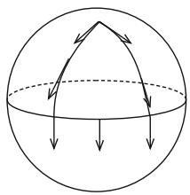
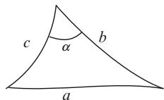
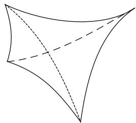
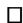
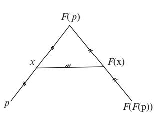
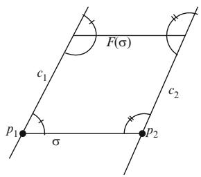
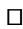
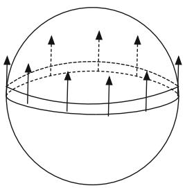
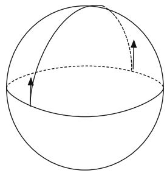

# Chapter 6 Sectional Curvature Comparison I

In the previous chapter we classified complete spaces with constant curvature. The goal of this chapter is to compare manifolds with variable curvature to spaces with constant curvature. Our first global result is the Hadamard-Cartan theorem, which says that a simply connected complete manifold with sec 0 is diffeomorphic to Rn. There are also several interesting restrictions on the topology in positive curvature that we shall investigate, notably, the Bonnet-Myers diameter bound and Synge’s theorem stating that an orientable even-dimensional manifold with positive curvature is simply connected. Finally, we also cover the classical quarter pinched sphere theorem of Rauch, Berger, and Klingenberg. In subsequent chapters we deal with some more advanced and modern topics in the theory of manifolds with lower curvature bounds.

We start by introducing the concept of differentiation of vector fields along curves. This generalizes and ties in nicely with mixed second partials from the last chapter and also allows us to define higher order partials. This is then used to define parallel fields, Jacobi fields along geodesics, and finally to establish the second variation formula of Synge.

We also establish some basic comparison estimates that are needed here and later in the text. These results are used to show how geodesics and curvature can help in estimating the injectivity, conjugate, and convexity radii.

## 6.1 The Connection Along Curves

Recall that in sections 3.2.4 and 3.2.5 we introduced Jacobi and parallel fields for a smooth distance function. Here we will generalize these concepts to allow for Jacobi and parallel fields along a single geodesic, rather than the whole family of geodesics associated to a distance function. This will be quite useful when we study variations.

### 6.1.1 Vector Fields Along Curves

Let $c : I  M$ be a curve in M. A vector field V along c is by definition a map $V : I  T M$ with $V ( t ) \in T _ { c ( t ) } M$ for all $t \in I .$ . The goal is to define the covariant W !derivative

$$
\dot {V} (t) = \frac {d}{d t} V (t) = \nabla_ {\dot {c}} V
$$

of V along c. We know that V can be thought of as the variational field for a variation $\bar { c } : ( - \varepsilon , \varepsilon ) \times I \to M$ . So it is natural to assume that

$$
\frac {d}{d t} V (t) = \frac {\partial^ {2} \bar {c}}{\partial t \partial s} (0, t).
$$

Doing the calculation in local coordinates (see section 5.1) gives

$$
\begin{array}{l} V (t) = V ^ {k} (t) \partial_ {k} \\ = \frac {\partial \bar {c} ^ {k}}{\partial s} (0, t) \partial_ {k} \\ \end{array}
$$

and

$$
\begin{array}{l} \frac {\partial^ {2} \bar {c}}{\partial t \partial s} (0, t) = \frac {\partial^ {2} \bar {c} ^ {k}}{\partial t \partial s} (0, t) \partial_ {k} + \frac {\partial \bar {c} ^ {i}}{\partial s} (0, t) \frac {\partial \bar {c} ^ {j}}{\partial t} (0, t) \Gamma_ {i j} ^ {k} \partial_ {k} \\ = \frac {d V ^ {k}}{d t} (t) \partial_ {k} + V ^ {i} (t) \frac {d c ^ {j}}{d t} (t) \Gamma_ {i j} ^ {k} \partial_ {k}. \\ \end{array}
$$

This shows that $\dot { V }$ does not depend on how the variation was chosen. Since the variation can be selected independently of the coordinate system we see that the local coordinate formula is independent of the coordinate system. The formula also shows that if $V \left( t \right) = X _ { c \left( t \right) }$ for some vector field X defined in a neighborhood of $c \left( t _ { 0 } \right)$ D, then this derivative is a covariant derivative

$$
\dot {V} (t _ {0}) = \nabla_ {\dot {c} (t _ {0})} X.
$$

Some caution is necessary when thinking of $\dot { V }$ in this way as it is not in general true that $\dot { V } ( t _ { 0 } ) = 0$ when $\dot { c } \left( t _ { 0 } \right) = 0$ P. It could, e.g., happen that $c$ is the constant curve. PIn this case $V \left( t \right)$ P Dis simply a curve in $T _ { c ( t _ { 0 } ) } M$ and as such has a well-defined velocity that doesn’t have to be zero.

From the product rule for mixed partials (see section 5.1) we get the product rule:

$$
\frac {d}{d t} g (V, W) = g (\dot {V}, W) + g (V, \dot {W})
$$

for vector fields V; W along c by selecting a two-parameter variation $\bar { c } \left( s , u , t \right)$ such that

$$
\begin{array}{l} \frac {\partial \bar {c}}{\partial s} (0, 0, t) = V (t), \\ \frac {\partial \bar {c}}{\partial u} (0, 0, t) = W (t). \\ \end{array}
$$

The local coordinate formula also shows that we have:

$$
\begin{array}{l} \frac {d}{d t} (V (t) + W (t)) = \frac {d}{d t} V (t) + \frac {d}{d t} W (t), \\ \frac {d}{d t} (\lambda (t) V (t)) = \frac {d \lambda}{d t} (t) V (t) + \lambda (t) \frac {d V}{d t} (t), \\ \end{array}
$$

where $\lambda : I  \mathbb { R }$ is a function.

W !As with second partials, differentiation along curves can be done in a larger space and then projected on to M. Specifically, if $M \subset { \bar { M } }$ and $c : I \to M$ is a curve and $V : I  T M$  Na vector field along c, then we can compute $\dot { V } \in T \bar { M }$ and then project $\left( \dot { V } \right) ^ { \top } \in T M$ 2to obtain the derivative of V along c in M. Example 6.1.1 shows what 2can go wrong if we are not careful about projecting the derivatives.

### 6.1.2 Third Partials

One of the uses of taking derivatives of vector fields along curves is that we can now define third and higher order partial derivatives. If we wish to compute

$$
\frac {\partial^ {3} c}{\partial s \partial t \partial u} \left(s _ {0}, t _ {0}, u _ {0}\right),
$$

then consider the vector field $\begin{array} { r } { s \mapsto \frac { \partial ^ { 2 } c } { \partial t \partial u } \left( s , t _ { 0 } , u _ { 0 } \right) = V \left( s \right) } \end{array}$ and define

$$
\frac {\partial^ {3} c}{\partial s \partial t \partial u} \left(s _ {0}, t _ {0}, u _ {0}\right) = \frac {d V}{d s} \left(s _ {0}\right).
$$

Something rather interesting happens with this definition. We expected and proved that second partials commute. This, however, does not carry over to third partials. It is true that

$$
\frac {\partial^ {3} c}{\partial s \partial t \partial u} = \frac {\partial^ {3} c}{\partial s \partial u \partial t},
$$

but if we switch the first two variables the derivatives might be different. One reason we are not entitled to have these derivatives commute lies in the fact that they were defined with a specific order of derivatives in mind.

Example 6.1.1. Let

$$
c \left(t, \theta\right) = \left[ \begin{array}{c} \cos \left(t\right) \\ \sin \left(t\right) \cos \left(\theta\right) \\ \sin \left(t\right) \sin \left(\theta\right) \end{array} \right]
$$

be the standard parametrization of $S ^ { 2 } \left( 1 \right) \subset \mathbb { R } ^ { 3 }$ as a surface of revolution around the x-axis. We can compute all derivatives in $\mathbb { R } ^ { 3 }$ and then project them on to $S ^ { 2 } \left( 1 \right)$ in order to find the intrinsic partial derivatives. The curves $t \mapsto c ( t , \theta )$ are geodesics. We can see this by direct calculation as

$$
\frac {\partial c}{\partial t} = \left[ \begin{array}{c} - \sin (t) \\ \cos (t) \cos (\theta) \\ \cos (t) \sin (\theta) \end{array} \right] \in T S ^ {2} (1),
$$

$$
\frac {\partial^ {2} c}{\partial t ^ {2}} = \left[ \begin{array}{c} - \cos (t) \\ - \sin (t) \cos (\theta) \\ - \sin (t) \sin (\theta) \end{array} \right] \in T \mathbb {R} ^ {3}.
$$

Thus the Euclidean acceleration is proportional to the base point c and so has zero projection onto $S ^ { 2 } \left( 1 \right)$ . Next we compute

$$
\frac {\partial^ {2} c}{\partial \theta \partial t} = \left[ \begin{array}{c} 0 \\ - \cos (t) \sin (\theta) \\ \cos (t) \cos (\theta) \end{array} \right] \in T \mathbb {R} ^ {3}.
$$

This vector is tangent to $S ^ { 2 } \left( 1 \right)$ and therefore represents the actual intrinsic mixed partial. Finally we calculate

$$
\frac {\partial^ {3} c}{\partial t \partial \theta \partial t} = \left[ \begin{array}{c} 0 \\ \sin (t) \sin (\theta) \\ - \sin (t) \cos (\theta) \end{array} \right] \in T \mathbb {R} ^ {3},
$$

$$
\frac {\partial^ {3} c}{\partial \theta \partial t ^ {2}} = \left[ \begin{array}{c} 0 \\ \sin (t) \sin (\theta) \\ - \sin (t) \cos (\theta) \end{array} \right] \in T \mathbb {R} ^ {3}.
$$

These are equal as we would expect in ${ \mathbb { R } } ^ { 3 }$ . They are also both tangent to $S ^ { 2 } \left( 1 \right)$ . The first term is consequently $\frac { \partial ^ { 3 } c } { \partial t \partial \theta \partial t }$ as computed in $S ^ { 2 } \left( 1 \right)$ . The second has no meaning in $S ^ { 2 } \left( 1 \right)$ as we are supposed to first project $\frac { \partial ^ { 2 } c } { \partial t ^ { 2 } }$ on to $S ^ { 2 } \left( { 1 } \right)$ before computing $\frac { \partial } { \partial \theta } \frac { \partial ^ { 2 } c } { \partial t ^ { 2 } }$ in $\mathbb { R } ^ { 3 }$ and then again project to $S ^ { 2 } \left( 1 \right)$ . It follows that in $S ^ { 2 } \left( 1 \right)$ we have $\begin{array} { r } { \frac { \partial ^ { 3 } c } { \partial \theta \partial t ^ { 2 } } = 0 } \end{array}$ while $\begin{array} { r } { \frac { \partial ^ { 3 } c } { \partial t \partial \theta \partial t } \neq 0 } \end{array}$ .

¤In this example it is also interesting to note that the equator $t \ : = \ : 0$ given by $\theta \mapsto c \left( 0 , \theta \right)$ is a geodesic and that $\begin{array} { r } { \frac { \partial ^ { 2 } c } { \partial \theta \partial t } = 0 } \end{array}$ along this equator.

We are now ready to prove what happens when the first two partials in a thirdorder partial are interchanged.

Lemma 6.1.2. The third mixed partials are related to the curvatures by the formula:

$$
\frac {\partial^ {3} c}{\partial u \partial s \partial t} - \frac {\partial^ {3} c}{\partial s \partial u \partial t} = R \left(\frac {\partial c}{\partial u}, \frac {\partial c}{\partial s}\right) \frac {\partial c}{\partial t}.
$$

Proof. This result is hardly surprising if we recall the definition of curvature and think of these partial derivatives as covariant derivatives. It is, however, not so clear what happens when the derivatives are not covariant derivatives. We are consequently forced to do the calculation in local coordinates. To simplify matters assume that we are at a point $p = c \left( u , s , t \right)$ , where $g _ { i j } \big | _ { p } = \delta _ { i j }$ and $\Gamma _ { i j } ^ { k } | _ { p } = 0$ . This implies that

$$
\frac {\partial}{\partial u} \left(\partial_ {i}\right) | _ {p} = 0.
$$

Thus

$$
\begin{array}{l} \frac {\partial^ {3} c}{\partial u \partial s \partial t} | _ {p} = \frac {\partial}{\partial u} \left(\frac {\partial^ {2} c ^ {l}}{\partial s \partial t} \partial_ {l} + \frac {\partial c ^ {i}}{\partial t} \frac {\partial c ^ {j}}{\partial s} \Gamma_ {i j} ^ {l} \partial_ {l}\right) \\ = \frac {\partial^ {3} c ^ {l}}{\partial u \partial s \partial t} \partial_ {l} + \frac {\partial c ^ {i}}{\partial t} \frac {\partial c ^ {j}}{\partial s} \frac {\partial}{\partial u} \left(\Gamma_ {i j} ^ {l}\right) \partial_ {l} \\ = \frac {\partial^ {3} c ^ {l}}{\partial u \partial s \partial t} \partial_ {l} + \frac {\partial c ^ {i}}{\partial t} \frac {\partial c ^ {j}}{\partial s} \frac {\partial c ^ {k}}{\partial u} \left(\partial_ {k} \Gamma_ {i j} ^ {l}\right) \partial_ {l}, \\ \frac {\partial^ {3} c}{\partial s \partial u \partial t} | _ {p} = \frac {\partial^ {3} c ^ {l}}{\partial s \partial u \partial t} \partial_ {l} + \frac {\partial c ^ {i}}{\partial t} \frac {\partial c ^ {j}}{\partial u} \frac {\partial c ^ {k}}{\partial s} \left(\partial_ {k} \Gamma_ {i j} ^ {l}\right) \partial_ {l}. \\ \end{array}
$$

Using our formula for $R _ { i j k } ^ { l }$ in terms of the Christoffel symbols from section 3.1.6 gives

$$
\begin{array}{l} \frac {\partial^ {3} c}{\partial u \partial s \partial t} | _ {p} - \frac {\partial^ {3} c}{\partial s \partial u \partial t} | _ {p} = \frac {\partial c ^ {i}}{\partial t} \frac {\partial c ^ {j}}{\partial s} \frac {\partial c ^ {k}}{\partial u} \left(\partial_ {k} \Gamma_ {i j} ^ {l}\right) \partial_ {l} - \frac {\partial c ^ {i}}{\partial t} \frac {\partial c ^ {j}}{\partial u} \frac {\partial c ^ {k}}{\partial s} \left(\partial_ {k} \Gamma_ {i j} ^ {l}\right) \partial_ {l} \\ = \frac {\partial c ^ {i}}{\partial t} \frac {\partial c ^ {j}}{\partial s} \frac {\partial c ^ {k}}{\partial u} \left(\partial_ {k} \Gamma_ {i j} ^ {l}\right) \partial_ {l} - \frac {\partial c ^ {i}}{\partial t} \frac {\partial c ^ {k}}{\partial u} \frac {\partial c ^ {j}}{\partial s} \left(\partial_ {j} \Gamma_ {i k} ^ {l}\right) \partial_ {l} \\ = \frac {\partial c ^ {i}}{\partial t} \frac {\partial c ^ {j}}{\partial s} \frac {\partial c ^ {k}}{\partial u} \left(\partial_ {k} \Gamma_ {i j} ^ {l} - \partial_ {j} \Gamma_ {i k} ^ {l}\right) \partial_ {l} \\ = \frac {\partial c ^ {i}}{\partial t} \frac {\partial c ^ {j}}{\partial s} \frac {\partial c ^ {k}}{\partial u} \left(\partial_ {k} \Gamma_ {j i} ^ {l} - \partial_ {j} \Gamma_ {k i} ^ {l}\right) \partial_ {l} \\ = \frac {\partial c ^ {i}}{\partial t} \frac {\partial c ^ {j}}{\partial s} \frac {\partial c ^ {k}}{\partial u} R _ {k j i} ^ {l} \partial_ {l} \\ = R \left(\frac {\partial c}{\partial u}, \frac {\partial c}{\partial s}\right) \frac {\partial c}{\partial t}. \\ \end{array}
$$

### 6.1.3 Parallel Transport

A vector field V along c is said to be parallel along c provided ${ \dot { V } } \equiv 0$ . We know that the tangent field c along a geodesic is parallel. We also just saw in example 6.1.1 Pthat the unit field perpendicular to a great circle in $S ^ { 2 } \left( 1 \right)$ is a parallel field.

If V; W are two parallel fields along c, then we clearly have that $g \left( V , W \right)$ is constant along c. In particular, parallel fields along a curve neither change their lengths nor their angles relative to each other; just as parallel fields in Euclidean space are of constant length and make constant angles. Based on example 6.1.1 we can pictorially describe parallel translation around certain triangles in $S ^ { 2 } \left( 1 \right)$ (see figure 6.1). Exercise 6.7.2 covers some basic features of parallel translation on surfaces to aid the reader’s geometric understanding.

Theorem 6.1.3 (Existence and Uniqueness of Parallel fields). $I f t _ { 0 } \in I$ and $v \in$ $T _ { c ( t _ { 0 } ) } M ,$ 2, then there is a unique parallel field V.t/ defined on all of I with $V ( t _ { 0 } ) = v$ 2.

Proof. Choose vector fields $E _ { 1 } ( t ) , \ldots , E _ { n } ( t )$ along c forming a basis for $T _ { c ( t ) } M$ for all $t \in I .$ . Any vector field V.t/ along c can then be written $V ( t ) = V ^ { i } ( t ) E _ { i } ( t )$ for $V ^ { i } : I  \mathbb { R }$ . Thus,

$$
\begin{array}{l} \dot {V} = \nabla_ {\dot {c}} V = \sum \dot {V} ^ {i} (t) E _ {i} (t) + V ^ {i} (t) \nabla_ {\dot {c}} E _ {i} \\ = \sum \dot {V} ^ {j} (t) E _ {j} (t) + \sum_ {i, j} V ^ {i} (t) \cdot \alpha_ {i} ^ {j} (t) E _ {j} (t), \text {   where   } \nabla_ {\dot {c}} E _ {i} = \sum \alpha_ {i} ^ {j} (t) E _ {j} \\ = \sum_ {j} (\dot {V} ^ {j} (t) + V ^ {i} (t) \alpha_ {i} ^ {j} (t)) E _ {j} (t). \\ \end{array}
$$

Hence, V is parallel if and only if $V ^ { 1 } ( t ) , \ldots , V ^ { n } ( t )$ satisfy the system of first-order linear differential equations

$$
\dot {V} ^ {j} (t) = - \sum_ {i = 1} ^ {n} \alpha_ {i} ^ {j} (t) V ^ {i} (t), j = 1, \dots , n.
$$

Such systems have the property that for given initial values $V ^ { 1 } ( t _ { 0 } ) , \ldots , V ^ { n } ( t _ { 0 } )$ , there is a unique solution defined on all of I with these initial values.

Fig. 6.1 Parallel translation along a spherical triangle   

natural_image

Diagram of a sphere with curved arrows indicating direction, no text or symbols present

The existence and uniqueness assertion that concluded this proof is a standard theorem in differential equations that we take for granted. The reader should recall that linearity of the equations is a crucial ingredient in showing that the solution exists on all of I. Nonlinear equations can fail to have solutions over a whole given interval as we saw with geodesics in section 5.2.

Parallel fields can be used as a substitute for Cartesian coordinates. Namely, if we choose a parallel orthonormal frame $E _ { 1 } ( t ) , \ldots , E _ { n } ( t )$ along the curve $c ( t ) : I $ $( M , g )$ , then we’ve seen that any vector field $V ( t )$ Walong c has the property that

$$
\begin{array}{l} \frac {d V}{d t} = \frac {d}{d t} \left(V ^ {i} (t) E _ {i} (t)\right) \\ = \dot {V} ^ {i} (t) E _ {i} (t) + V ^ {i} (t) \cdot \dot {E} _ {i} (t) \\ = \dot {V} ^ {i} (t) E _ {i} (t). \\ \end{array}
$$

So $\begin{array} { r } { \frac { d } { d t } V , } \end{array}$ , when represented in the coordinates of the frame, is exactly what we would expect. We could more generally choose a tensor T along $c ( t )$ of type $( 0 , p )$ or .1; p/ and compute $\textstyle { \frac { d } { d t } } T .$ . For the sake of simplicity, choose a .1; 1/ tensor S. Then write $S ( E _ { i } ( t ) ) = S _ { i } ^ { j } ( t ) E _ { j } ( t )$ . Thus S is represented by the matrix $\left[ S _ { i } ^ { j } ( t ) \right]$ along the curve. As before, we see that $\textstyle { \frac { d } { d t } } S$ is represented by $\left[ \dot { S } _ { i } ^ { j } ( t ) \right]$ .

This makes it possible to understand equations involving only one covariant derivative of the type $\nabla _ { X }$ . Let $F ^ { t }$ be the local flow near some point $p \in \textit { M }$ rand H a hypersurface in M through $p$ 2that is perpendicular to X. Next choose vector fields $E _ { 1 } , \ldots , E _ { n }$ on H which form an orthonormal frame for the tangent space to M. Finally, construct an orthonormal frame in a neighborhood of $p$ by parallel translating $E _ { 1 } , \ldots , E _ { n }$ along the integral curves for X. Thus, $\nabla _ { X } E _ { i } = 0$ , $i = 1 , \ldots , n$ . Therefore, if we have a vector field Y near $p ,$ r we can write $Y = Y ^ { i } E _ { i }$ Dand $\nabla _ { X } Y = D _ { X } ( Y ^ { i } ) E _ { i }$ . Similarly, if S is a .1; 1/-tensor, we have $S ( E _ { i } ) = S _ { i } ^ { j } E _ { i }$ , and $\nabla _ { X } S$ is represented by $( D _ { X } ( { \cal { S } } _ { i } ^ { j } ) )$ .

In this way parallel frames make covariant derivatives look like standard derivatives in the same fashion that coordinate vector fields make Lie derivatives look like standard derivatives.

### 6.1.4 Jacobi Fields

Another variational field that is often quite useful is the field that comes from a geodesic variation, i.e., $t \mapsto { \bar { c } } \left( s , t \right)$ is a geodesic for all s. We encountered these 7! Nfields in section 3.2.4 as vector fields satisfying $L _ { \partial _ { r } } J = 0$ . Here they need only Dbe defined along a single geodesic so the Lie derivative equation no longer makes sense. The second-order Jacobi equation, however, does make sense in this context:

$$
\begin{array}{l} 0 = \frac {\partial^ {3} \bar {c}}{\partial s \partial^ {2} t} \\ = R \left(\frac {\partial \bar {c}}{\partial s}, \frac {\partial \bar {c}}{\partial t}\right) \frac {\partial \bar {c}}{\partial t} + \frac {\partial^ {3} \bar {c}}{\partial t \partial s \partial t} \\ = R \left(\frac {\partial \bar {c}}{\partial s}, \frac {\partial \bar {c}}{\partial t}\right) \frac {\partial \bar {c}}{\partial t} + \frac {\partial^ {3} \bar {c}}{\partial^ {2} t \partial s} \\ = R \left(\frac {\partial \bar {c}}{\partial s}, \frac {\partial \bar {c}}{\partial t}\right) \frac {\partial \bar {c}}{\partial t} + \frac {\partial^ {2}}{\partial t ^ {2}} \frac {\partial \bar {c}}{\partial s}. \\ \end{array}
$$

So if the variational field along c is $\begin{array} { r } { J \left( t \right) = \frac { \partial \overline { { c } } } { \partial s } \left( 0 , t \right) } \end{array}$ , then this field solves the linear second-order Jacobi Equation

$$
\ddot {J} + R (J, \dot {c}) \dot {c} = 0.
$$

Given J .0/ and ${ \dot { J } } \left( 0 \right)$ there will be a unique Jacobi field with these initial conditions as the Jacobi equation is a linear second-order equation. These variational fields are called Jacobi fields along c. In case $J \left( 0 \right) = 0$ , they can easily be constructed via the geodesic variation

$$
\bar {c} (s, t) = \exp_ {p} \left(t (\dot {c} (0) + s \dot {J} (0))\right).
$$

Since $\bar { c } \left( s , 0 \right) = p$ for all s we must have $\begin{array} { r } { J \left( 0 \right) = \frac { \partial \overline { { c } } } { \partial s } \left( 0 , 0 \right) = 0 } \end{array}$ . The derivative is N Dcomputed as follows

$$
\begin{array}{l} \frac {\partial^ {2} \bar {c}}{\partial t \partial s} (0, 0) = \frac {\partial^ {2} \bar {c}}{\partial s \partial t} (0, 0) \\ = \frac {\partial}{\partial s} (\dot {c} (0) + s \dot {J} (0)) | _ {s = 0} \\ = \dot {J} (0). \\ \end{array}
$$

What is particularly interesting about these Jacobi fields is that they control two things we are interesting in studying.

First, observe that they tie in with the differential of the exponential map since

$$
\begin{array}{l} J (t) = \frac {\partial \bar {c}}{\partial s} (0, t) \\ = \frac {\partial}{\partial s} \exp_ {p} (t (\dot {c} (0) + s \dot {J} (0))) | _ {(0, t)} \\ = D \exp_ {p} \left(\frac {\partial}{\partial s} (t (\dot {c} (0) + s \dot {J} (0))) | _ {(0, t)}\right) \\ = D \exp_ {p} (t \dot {J} (0)), \\ \end{array}
$$

where we think of $t \dot { J } \left( 0 \right) ~ \in ~ T _ { t \dot { c } ( 0 ) } T _ { p } M$ . This shows, in particular, that $D \exp _ { p }$ is nonsingular at $t _ { 0 } v$ P 2 Pif and only if for each vector $J \left( t _ { 0 } \right) \in T _ { \exp _ { p } \left( t _ { 0 } v \right) }$ there is a Jacobi field along $t \mapsto \exp _ { p } \left( t v \right)$ that vanishes at $t = 0$ 2and has value ${ \bf \dot { \boldsymbol { J } } } \left( t _ { 0 } \right)$ at $t _ { 0 }$ .

7! DSecond, Jacobi fields can also be used to calculate the Hessian of the function $r \left( x \right) = \left| x p \right|$ . Assume that $c \left( t \right)$ is a unit speed geodesic with $c \left( 0 \right) = p$ and $J \left( t \right)$ D j ja Jacobi field along $c$ with $J \left( 0 \right) = 0$ . As long as $t \dot { c } \left( 0 \right) \in \mathrm { s e g } _ { p } ^ { 0 } ,$ D, it follows that $\dot { c } \left( t \right) = \nabla r | _ { c ( t ) }$ and consequently:

$$
\begin{array}{l} \operatorname{Hess} r (J (t), J (t)) = g (\nabla_ {J (t)} \nabla r, J (t)) \\ = g \left(\frac {\partial^ {2} \bar {c}}{\partial s \partial t}, J\right) | _ {(0, t)} \\ = g \left(\frac {\partial^ {2} \bar {c}}{\partial t \partial s}, J\right) | _ {(0, t)} \\ = g \left(\dot {J} (t), J (t)\right). \\ \end{array}
$$

### 6.1.5 Second Variation of Energy

Recall from section 5.4 that all geodesics are stationary points for the energy functional. To better understand what happens near a geodesic we do exactly what we would do in calculus, namely, compute the second derivative of any variation of a geodesic.

Theorem 6.1.4 (Synge’s second variation formula, 1926). $I f \bar { c } : ( - \varepsilon , \varepsilon ) \times [ a , b ]$ is a smooth variation of a geodesic $c \left( t \right) = \bar { c } \left( 0 , t \right)$ , then

$$
\frac {d ^ {2} E (c _ {s})}{d s ^ {2}} | _ {s = 0} = \int_ {a} ^ {b} \left| \frac {\partial^ {2} \bar {c}}{\partial t \partial s} \right| ^ {2} d t - \int_ {a} ^ {b} g \left(R \left(\frac {\partial \bar {c}}{\partial s}, \frac {\partial \bar {c}}{\partial t}\right) \frac {\partial \bar {c}}{\partial t}, \frac {\partial \bar {c}}{\partial s}\right) d t + \left. g \left(\frac {\partial^ {2} \bar {c}}{\partial s ^ {2}}, \frac {\partial \bar {c}}{\partial t}\right) \right| _ {a} ^ {b}.
$$

Proof. The first variation formula (see lemma 5.4.2) tells us that

$$
\frac {d E (c _ {s})}{d s} = - \int_ {a} ^ {b} g \left(\frac {\partial \bar {c}}{\partial s}, \frac {\partial^ {2} \bar {c}}{\partial t ^ {2}}\right) d t + \left. g \left(\frac {\partial \bar {c}}{\partial s}, \frac {\partial \bar {c}}{\partial t}\right) \right| _ {(s, a)} ^ {(s, b)}.
$$

With this in mind we can calculate

$$
\begin{array}{l} \frac {\partial^ {2} E \left(c _ {s}\right)}{\partial s ^ {2}} = - \frac {\partial}{\partial s} \int_ {a} ^ {b} g \left(\frac {\partial \bar {c}}{\partial s}, \frac {\partial^ {2} \bar {c}}{\partial t ^ {2}}\right) d t + \frac {\partial}{\partial s} \left. g \left(\frac {\partial \bar {c}}{\partial s}, \frac {\partial \bar {c}}{\partial t}\right) \right| _ {(s, a)} ^ {(s, b)} \\ = - \int_ {a} ^ {b} g \left(\frac {\partial^ {2} \bar {c}}{\partial s ^ {2}}, \frac {\partial^ {2} \bar {c}}{\partial t ^ {2}}\right) d t - \int_ {a} ^ {b} g \left(\frac {\partial \bar {c}}{\partial s}, \frac {\partial^ {3} \bar {c}}{\partial s \partial t ^ {2}}\right) d t \\ + \left. g \left(\frac {\partial^ {2} \bar {c}}{\partial s ^ {2}}, \frac {\partial \bar {c}}{\partial t}\right) \right| _ {(s, a)} ^ {(s, b)} + \left. g \left(\frac {\partial \bar {c}}{\partial s}, \frac {\partial^ {2} \bar {c}}{\partial s \partial t}\right) \right| _ {(s, a)} ^ {(s, b)}. \\ \end{array}
$$

Setting $s = 0$ and using that $c \left( 0 , t \right)$ is a geodesic we obtain

$$
\begin{array}{l} \frac {\partial^ {2} E \left(c _ {s}\right)}{\partial s ^ {2}} | _ {s = 0} \\ = - \int_ {a} ^ {b} g \left(\frac {\partial \bar {c}}{\partial s}, \frac {\partial^ {3} \bar {c}}{\partial s \partial t ^ {2}}\right) d t + \left. g \left(\frac {\partial^ {2} \bar {c}}{\partial s ^ {2}}, \frac {\partial \bar {c}}{\partial t}\right) \right| _ {a} ^ {b} + \left. g \left(\frac {\partial \bar {c}}{\partial s}, \frac {\partial^ {2} \bar {c}}{\partial s \partial t}\right) \right| _ {a} ^ {b} \\ = - \int_ {a} ^ {b} g \left(\frac {\partial \bar {c}}{\partial s}, R \left(\frac {\partial \bar {c}}{\partial s}, \frac {\partial \bar {c}}{\partial t}\right) \frac {\partial \bar {c}}{\partial t}\right) d t - \int_ {a} ^ {b} g \left(\frac {\partial \bar {c}}{\partial s}, \frac {\partial^ {3} \bar {c}}{\partial t \partial s \partial t}\right) d t \\ + \left. g \left(\frac {\partial^ {2} \bar {c}}{\partial s ^ {2}}, \frac {\partial \bar {c}}{\partial t}\right) \right| _ {a} ^ {b} + \left. g \left(\frac {\partial \bar {c}}{\partial s}, \frac {\partial^ {2} \bar {c}}{\partial s \partial t}\right) \right| _ {a} ^ {b} \\ = - \int_ {a} ^ {b} g \left(\frac {\partial \bar {c}}{\partial s}, R \left(\frac {\partial \bar {c}}{\partial s}, \frac {\partial \bar {c}}{\partial t}\right) \frac {\partial \bar {c}}{\partial t}\right) d t + \int_ {a} ^ {b} g \left(\frac {\partial^ {2} \bar {c}}{\partial t \partial s}, \frac {\partial^ {2} \bar {c}}{\partial s \partial t}\right) d t \\ \left. - \int_ {a} ^ {b} \frac {\partial}{\partial t} g \left(\frac {\partial \bar {c}}{\partial s}, \frac {\partial^ {2} \bar {c}}{\partial s \partial t}\right) d t + g \left(\frac {\partial^ {2} \bar {c}}{\partial s ^ {2}}, \frac {\partial \bar {c}}{\partial t}\right) \right| _ {a} ^ {b} + \left. g \left(\frac {\partial \bar {c}}{\partial s}, \frac {\partial^ {2} \bar {c}}{\partial s \partial t}\right) \right| _ {a} ^ {b} \\ = - \int_ {a} ^ {b} g \left(\frac {\partial \bar {c}}{\partial s}, R \left(\frac {\partial \bar {c}}{\partial s}, \frac {\partial \bar {c}}{\partial t}\right) \frac {\partial \bar {c}}{\partial t}\right) d t + \int_ {a} ^ {b} g \left(\frac {\partial^ {2} \bar {c}}{\partial t \partial s}, \frac {\partial^ {2} \bar {c}}{\partial s \partial t}\right) d t \\ - g \left(\frac {\partial \bar {c}}{\partial s}, \frac {\partial^ {2} \bar {c}}{\partial s \partial t}\right) \bigg | _ {a} ^ {b} + g \left(\frac {\partial^ {2} \bar {c}}{\partial s ^ {2}}, \frac {\partial \bar {c}}{\partial t}\right) \bigg | _ {a} ^ {b} + g \left(\frac {\partial \bar {c}}{\partial s}, \frac {\partial^ {2} \bar {c}}{\partial s \partial t}\right) \bigg | _ {a} ^ {b} \\ = \int_ {a} ^ {b} g \left(\frac {\partial^ {2} \bar {c}}{\partial t \partial s}, \frac {\partial^ {2} \bar {c}}{\partial t \partial s}\right) d t - \int_ {a} ^ {b} g \left(R \left(\frac {\partial \bar {c}}{\partial s}, \frac {\partial \bar {c}}{\partial t}\right) \frac {\partial \bar {c}}{\partial t}, \frac {\partial \bar {c}}{\partial s}\right) d t + g \left(\frac {\partial^ {2} \bar {c}}{\partial s ^ {2}}, \frac {\partial \bar {c}}{\partial t}\right) \Bigg | _ {a} ^ {b} \\ \end{array}
$$

The formula is going to be used in different ways below. First we observe that for proper variations the last term drops out and the formula depends only on the variational field $\begin{array} { r } { V \left( t \right) = \frac { \partial \overline { { c } } } { \partial s } \left( 0 , t \right) } \end{array}$ and the velocity field c of the original geodesic:

$$
\frac {d ^ {2} E \left(c _ {s}\right)}{d s ^ {2}} | _ {s = 0} = \int_ {a} ^ {b} | \dot {V} | ^ {2} d t - \int_ {a} ^ {b} g (R (V, \dot {c}) \dot {c}, V) d t.
$$

Another special case occurs when the variational field is parallel ${ \dot { V } } = 0$ . In this case the first term drops out:

$$
\frac {d ^ {2} E \left(c _ {s}\right)}{d s ^ {2}} | _ {s = 0} = - \int_ {a} ^ {b} g (R (V, \dot {c}) \dot {c}, V) d t + g \left(\frac {\partial^ {2} \bar {c}}{\partial s ^ {2}}, \dot {c}\right) \Bigg | _ {a} ^ {b}
$$

but the formula still depends on the variation and not just on V. If, however, we select the variation such that $s \mapsto \bar { c } \left( s , t \right)$ are geodesics, then the last term also drops out.

## 6.2 Nonpositive Sectional Curvature

In this section we show that the exponential map $\exp _ { p } : T _ { p } M  M$ is a covering map, provided $( M , g )$ W !is complete and has nonpositive sectional curvature everywhere. This implies, in particular, that no compact simply connected manifold admits such a metric. We shall also prove some interesting results about the fundamental groups of such manifolds.

The first observation about manifolds with nonpositive curvature is that any geodesic from $p$ to $q$ must be a local minimum for $E : \Omega ( p , q )  [ 0 , \infty )$ by our W ! 1second variation formula. This is in sharp contrast to what we shall prove in positive curvature, where sufficiently long geodesics can never be local minima.

Recall from our discussion of the fundamental equations in section 3.2 and 3.2.4 that Jacobi fields seem particularly well-suited for the task of studying nonpositive curvature. This will be borne out here and later in section 6.4.

### 6.2.1 Manifolds Without Conjugate Points

We start with a result that gives strong restrictions on the behavior of the exponential map.

Lemma 6.2.1. If ex $\mathfrak { p } _ { p } : T _ { p } M \to M$ is nonsingular everywhere, i.e., has no critical W !points, then it is a covering map.

Proof. By definition $\exp _ { p }$ is an immersion, so on $T _ { p } M$ choose the pullback metric to make it into a local Riemannian isometry. We then know from lemma 5.6.4 that $\exp _ { p }$ is a covering map provided this new metric on $T _ { p } M$ is complete. To see this, simply observe that the metric is geodesically complete at the origin, since straight lines through the origin are still geodesics.

We can now prove our first big result. It was originally established by Mangoldt for surfaces. Hadamard in a survey article offered a different proof. Cartan extended the result to higher dimensions under the assumption that the manifold is metrically complete.

Theorem 6.2.2 (Mangoldt, 1881, Hadamard, 1889, and Cartan, 1925). $H ( M , g )$ is complete, connected, and has sec $\leq 0$ , then the universal covering is diffeomorphic to $\mathbb { R } ^ { n }$ .

Proof. The goal is to show that $\left| D \exp _ { p } \left( w \right) \right| > 0$ for all nonzero $w \in T _ { v } T _ { p } M$ . This will imply that $\exp _ { p }$ 2is nonsingular everywhere and hence a covering map.

Select a Jacobi field J along $c \left( t \right) = \exp _ { p } \left( t v \right)$ such that $J \left( 0 \right) = 0$ and ${ \dot { J } } \left( 0 \right) = w$ so that $\left| D \exp _ { p } \left( w \right) \right| = \left| J \left( 1 \right) \right|$ D. Consider the function $\begin{array} { r } { t \mapsto \frac { 1 } { 2 } \left| J \left( t \right) \right| ^ { 2 } } \end{array}$ Dand its first and second derivatives:

$$
\frac {d}{d t} \left(\frac {1}{2} | J (t) | ^ {2}\right) = g (\dot {J}, J),
$$

$$
\frac {d ^ {2}}{d t ^ {2}} \left(\frac {1}{2} | J (t) | ^ {2}\right) = \frac {d}{d t} g (\dot {J}, J)
$$

$$
= g (\ddot {J}, J) + g (\dot {J}, \dot {J})
$$

$$
= - g (R (J, \dot {c}) \dot {c}, J) + | \dot {J} | ^ {2}
$$

$$
\geq \left| j \right| ^ {2}.
$$

The last inequality follows from the assumption that $g \left( R \left( x , y \right) y , x \right) ~ \leq ~ 0$ for all tangent vectors x; y. Integrating this inequality gives

$$
g (\dot {J}, J) \geq \int_ {0} ^ {t} | \dot {J} | ^ {2} d t + g (\dot {J} (0), J (0))
$$

$$
= \int_ {0} ^ {t} | j | ^ {2} d t
$$

$$
> 0
$$

unless $\dot { J } \left( t \right) = 0$ for all $t ,$ in which case $\dot { J } \left( 0 \right) = w = 0$ . Assuming $w \neq 0$ , integrating Dthe last inequality yields

$$
\frac {1}{2} \left| J (t) \right| ^ {2} > 0,
$$

which is what we wanted to prove.

No similar theorem can hold for Riemannian manifolds with $\mathrm { R i c } \le 0$ or scal $\leq$ 0, since we saw in sections 4.2.3 and $4 . 2 . 5$  that there exist Ricci flat metrics on $\mathbb { R } ^ { 2 } \times S ^ { n - 2 }$ and scalar flat metrics on $\mathbb { R } \times S ^ { n - 1 }$ .

### 6.2.2 The Fundamental Group in Nonpositive Curvature

We are going to prove two results on the structure of the fundamental group for manifolds with nonpositive curvature. The interested reader is referred to the book by Eberlein [38] for further results on manifolds with nonpositive curvature.

First we need a little preparation. Let $( M , g )$ be a complete simply connected Riemannian manifold of nonpositive curvature. The two key properties we use are that any two points in M lie on a unique geodesic, and that distance functions are everywhere smooth and convex.

We just saw that $\exp _ { p } : T _ { p } M  M$ is a diffeomorphism for all $p \in M$ . This W !shows, as in Euclidean space, that there is only one geodesic through $p$ 2and $q \left( \neq p \right)$ .

This also shows that the distance function $| x p |$ is smooth on $M - \{ p \}$ . The modified distance function

$$
x \mapsto f _ {0} (x) = f _ {0, p} (x) = \frac {1}{2} | x p | ^ {2} = \frac {1}{2} (r (x)) ^ {2}
$$

is then smooth everywhere and its Hessian is given by

$$
\operatorname{Hess} f _ {0} = d r ^ {2} + r \operatorname{Hess} r.
$$

If J .t/ is a Jacobi field along a unit speed geodesic emanating from p with $J \left( 0 \right) = 0 ;$ then from section 6.1.4

$$
\begin{array}{l} \operatorname{Hess} r (J (b), J (b)) = g (\dot {J} (b), J (b)) \\ \geq \int_ {0} ^ {b} | j | ^ {2} d t \\ > 0. \\ \end{array}
$$

Since $J \left( b \right)$ can be arbitrary we have shown that the Hessian is positive definite. If c is a geodesic, this implies that $f _ { 0 } \circ c$ is convex as

$$
\begin{array}{l} \frac {d}{d t} f _ {0} \circ c = g (\nabla f _ {0}, \dot {c}), \\ \frac {d ^ {2}}{d t ^ {2}} f _ {0} \circ c = \frac {d}{d t} g (\nabla f _ {0}, \dot {c}) \\ = g \left(\nabla_ {\dot {c}} \nabla f _ {0}, \dot {c}\right) + g \left(\nabla f _ {0}, \ddot {c}\right) \\ = \operatorname{Hess} f _ {0} (\dot {c}, \dot {c}) \\ > 0. \\ \end{array}
$$

With this in mind we can generalize the idea of convexity slightly (see also section 7.1.3). A function is (strictly) convex if its restriction to all geodesics is (strictly) convex. One sees that the maximum of any collection of convex functions is again convex (you only need to prove this in dimension 1, as we can restrict to geodesics). Given a finite collection of points $p _ { 1 } , \dotsc , p _ { k } \in M$ , we can in particular consider the strictly convex function

$$
x \mapsto \max \left\{f _ {0, p _ {1}} (x), \dots , f _ {0, p _ {k}} (x) \right\}.
$$

In general, any proper, nonnegative, and strictly convex function has a unique minimum. To see this, first note that there must be a minimum as the function is proper and bounded from below. If there were two minima, then the function would be strictly convex when restricted to a geodesic joining these two minima. But then the function would have smaller values on the interior of this segment than at the endpoints.

The uniquely defined minimum for

$$
x \mapsto \max \left\{f _ {0, p _ {1}} (x), \dots f _ {0, p _ {k}} (x) \right\}
$$

is denoted by $\mathrm { c m } _ { \infty } \left\{ p _ { 1 } , \ldots \ldots , p _ { k } \right\}$ and called the $L ^ { \infty }$ center of mass of $\{ p _ { 1 } , \ldots , p _ { k } \}$ . It is the center $q$ 1 f gof the smallest ball ${ \overline { { B } } } \left( q , R \right) \supset \{ p _ { 1 } , . . . , p _ { k } \}$ f g. If instead we had considered

$$
x \mapsto \sum_ {i = 1} ^ {k} f _ {0, p _ {i}} (x)
$$

we would have arrived at the usual center of mass also known as the $L ^ { 2 }$ center of mass.

The first theorem is concerned with fixed points of isometries.

Theorem 6.2.3 (Cartan, 1925). $I f ( M , g )$ is a complete simply connected Riemannian manifold of nonpositive curvature, then any isometry $F : M \to M$ of finite order has a fixed point.

Proof. The idea, which is borrowed from Euclidean space, is that the center of mass of any orbit must be a fixed point. First, define the order of $F$ as the smallest integer k such that $F ^ { k } = i d .$ . Second, for any $p \in M$ consider the orbit $\left\{ p , F \left( p \right) , \ldots , F ^ { k - 1 } \left( p \right) \right\}$ of $p$ D 2. Then construct the center of mass

$$
q = \operatorname{cm} _ {\infty} \left\{p, F (p), \dots , F ^ {k - 1} (p) \right\}.
$$

We claim that $F \left( q \right) = q$ . This is because the function

$$
x \mapsto f (x) = \max \left\{f _ {0, p} (x), \dots f _ {0, F ^ {k - 1} (p)} (x) \right\}
$$

has not only $q$ as a minimum, but also $F \left( q \right)$ . To see this just observe that since F is an isometry, we have

$$
\begin{array}{l} f (F (q)) = \max \left\{f _ {0, p} (F (q)), \dots f _ {0, F ^ {k - 1} (p)} (F (q)) \right\} \\ = \frac {1}{2} \left(\max \left\{\left| F (q) p \right|, \dots , \left| F (q) F ^ {k - 1} (p) \right| \right\}\right) ^ {2} \\ = \frac {1}{2} \left(\max \left\{\left| F (q) F ^ {k} (p) \right|, \dots , \left| F (q) F ^ {k - 1} (p) \right| \right\}\right) ^ {2} \\ = \frac {1}{2} \left(\max \left\{\left| q F ^ {k - 1} (p) \right|, \dots , \left| q F ^ {k - 2} (p) \right| \right\}\right) ^ {2} \\ = f (q). \\ \end{array}
$$

The uniqueness of minima for strictly convex functions now implies $F \left( q \right) = q$ .

Corollary 6.2.4. $I f \ ( M , g )$ is a complete Riemannian manifold of nonpositive curvature, then the fundamental group is torsion free, i.e., all nontrivial elements have infinite order.

The second theorem requires more preparation and a more careful analysis of distance functions. Suppose again that $( M , g )$ is complete, simply connected and of nonpositive curvature. Let us fix a modified distance function: $\begin{array} { r } { x \mapsto \frac { 1 } { 2 } r ^ { 2 } = f _ { 0 } \left( x \right) } \end{array}$ and a unit speed geodesic $c : \mathbb { R } \to M$ 7! D. The Hessian estimate from above only implies that $\begin{array} { r } { \frac { d ^ { 2 } } { d t ^ { 2 } } \left( f _ { 0 } \circ c \right) > 0 } \end{array}$ W !. However, we know that this second derivative is 1 in Euclidean ıspace. So it shouldn’t be surprising that we have a much better quantitative estimate.

Lemma 6.2.5. ${ \cal { I f } } \left( { \cal { M } } , g \right)$ has nonpositive curvature, then any modified distance function satisfies:

$$
\operatorname{Hess} f _ {0} \geq g.
$$

Proof. We follow the notation in the proof of theorem 6.2.2. If $r \left( x \right) = \left| x p \right|$ , then

$$
\operatorname{Hess} \frac {1}{2} r ^ {2} = d r ^ {2} + r \operatorname{Hess} r.
$$

So the claim follows if we can show that

$$
r \operatorname{Hess} r \geq g _ {r},
$$

where $g = d r ^ { 2 } + g _ { r }$ . This estimate in turn holds if we can prove that

$$
t \cdot \operatorname{Hess} r (J (t), J (t)) = t \cdot g (\dot {J} (t), J (t))
$$

$$
\geq g (J (t), J (t)).
$$

The reason behind the proof of this is slightly tricky and is known as Jacobi field comparison. Consider the ratio

$$
\lambda (t) = \frac {\left| J (t) \right| ^ {2}}{g (\dot {J} (t) , J (t))}.
$$

By l’Hospital’s rule it follows that

$$
\lambda (0) = \frac {2 g (\dot {J} (0) , J (0))}{- g (R (J (0) , \dot {c} (0)) \dot {c} (0) , J (0)) + | \dot {J} (0) | ^ {2}} = \frac {0}{| \dot {J} (0) | ^ {2}} = 0.
$$

Using that the sectional curvature is nonpositive and then the Cauchy-Schwarz inequality it follows that the derivative satisfies

$$
\begin{array}{l} \dot {\lambda} (t) = \frac {2 (g (J , \dot {J})) ^ {2} - | \dot {J} | ^ {2} | J | ^ {2} + g (R (J , \dot {c}) \dot {c} , J) | J | ^ {2}}{(g (J , \dot {J})) ^ {2}} \\ \leq \frac {2 (g (J , \dot {J})) ^ {2} - | \dot {J} | ^ {2} | J | ^ {2}}{(g (J , \dot {J})) ^ {2}} \\ \leq \frac {2 (g (J , j)) ^ {2} - (g (J , j)) ^ {2}}{(g (J , j)) ^ {2}} \\ = 1. \\ \end{array}
$$

Hence  $( t ) \leq t$ and $t \cdot g \left( J \left( t \right) , \dot { J } \left( t \right) \right) \geq \left| J \left( t \right) \right| ^ { 2 }$ .

Integrating the inequality $\begin{array} { r } { \frac { d ^ { 2 } } { d t ^ { 2 } } \left( f _ { 0 , p } \circ c \right) \geq 1 } \end{array}$ , where c is a unit speed geodesic, yields

$$
\begin{array}{l} \left| p c (t) \right| ^ {2} \geq \left| p c (0) \right| ^ {2} + 2 g (\nabla f _ {0, p}, \dot {c} (0)) \cdot t + t ^ {2} \\ = | p c (0) | ^ {2} + | c (0) c (t) | ^ {2} \\ + 2 \left| p c (0) \right| \left| c (0) c (t) \right| \cos \angle (\nabla f _ {0, p}, \dot {c} (0)). \\ \end{array}
$$

Thus, if we have a triangle in M with sides lengths $a , b , c$ and where the angle opposite a is ˛, then

$$
a ^ {2} \geq b ^ {2} + c ^ {2} - 2 b c \cos \alpha .
$$

From this, one can conclude that the angle sum in any triangle is $\leq \pi$ , and more generally that the angle sum in any quadrilateral is $\leq 2 \pi$ . See figure 6.2.

Now suppose that $( M , g )$ has negative curvature. Then it must follow that all of the above inequalities are strict, unless $p$ lies on the geodesic c. In particular, the angle sum in any nondegenerate quadrilateral is $< 2 \pi$ . This will be crucial for the proof of the next theorem

Fig. 6.2 Triangle and quadrilateral in negative curvature   

text_image

c
α
b
a

natural_image

Abstract geometric diagram with solid and dashed lines forming a 3D-like shape (no text or symbols)

Theorem 6.2.6 (Preissmann, 1943). ${ \cal { I f } } \left( M , g \right)$ is a compact manifold of negative curvature, then any Abelian subgroup of the fundamental group is cyclic. In particular, no compact product manifold $M \times N$ admits a metric with negative curvature.

The proof requires some preliminary results that can also be used in other contexts as they do not assume that the manifold has nonpositive curvature.

An axis for an isometry $F \colon M \to M$ is a geodesic $c : \mathbb { R } \to M$ such that $F \left( c \right)$ is a W ! W !reparametrization of c. Since isometries map geodesics to geodesics, it must follow that

$$
F \circ c (t) = c (\pm t + a).
$$

Note that if  occurs, then $c \left( { \frac { a } { 2 } } \right)$ is fixed by F. When $F \circ c \left( t \right) = c \left( t + a \right)$ we call a   ı D Cthe period of F with respect to c. The period depends on the parametrization of c.

Given an isometry $F : M \to M$ the displacement function is defined as

$$
x \mapsto \delta_ {F} (x) = | x F (x) |.
$$

Lemma 6.2.7. Let ${ \cal F } : { \cal M }  { \cal M }$ be an isometry on a complete Riemannian W !manifold. If the displacement function $\ S _ { F }$ has a positive minimum, then F has an axis.

Proof. Let $\ S _ { F }$ have a minimum at $p \in M$ and $c : [ 0 , 1 ] \to M$ be a segment from p to $F \left( p \right)$ . Then $F \circ c$ 2is a segment from $F \left( p \right)$ Wto $F ^ { 2 } \left( p \right)$ !with the same speed. We ıclaim that these two geodesics form an angle 	 at $F \left( p \right)$ and thus fit together as the geodesic extension of c to Œ0; 2. If we fix $t \in [ 0 , 1 ]$ , then

$$
\begin{array}{l} \delta_ {F} (p) \leq \delta_ {F} (c (t)) \\ = | c (t) (F \circ c) (t) | \\ \leq | c (t) c (1) | + | c (1) (F \circ c) (t) | \\ = | c (t) c (1) | + | (F \circ c) (0) (F \circ c) (t) | \\ = | c (t) c (1) | + | c (0) c (t) | \\ = | c (0) c (1) | \\ = | p F (p) |. \\ \end{array}
$$

This means that the curve that consists of $c | _ { [ t , 1 ] }$ followed by $F \circ c | _ { [ 0 , t ] }$ must be a j ı jsegment and thus a geodesic by corollary 5.4.4 (see also figure 6.3). This geodesic is obviously just the extension of $^ { c , }$ so $( F \circ c ) ( t ) = c ( 1 + t )$ . We can repeat this ı D Cargument forwards and backwards along the extension of c to R to show that it becomes an axis for F of period 1.

Let $\pi : \tilde { M } \to M$ be the universal cover of M. A deck transformation $F : \tilde { M } \to \tilde { M }$ W !is a map such that $\pi \circ F = \pi , \operatorname { i . e . }$ W !., a lift of 	. As such, it is determined by the value of $F \left( p \right) \in \pi ^ { - 1 } \left( q \right)$ Dfor a given $p \in \pi ^ { - 1 } \left( q \right)$ . We can think of the fundamental group $\pi _ { 1 } \left( M , q \right)$ 2as acting by deck transformations: Given $p \in \pi ^ { - 1 } \left( q \right)$ , a loop in $[ \alpha ] \in \pi _ { 1 } \left( M , q \right)$ yields a deck transformation with $F \left( p \right) = \tilde { \alpha } \left( 1 \right)$ , where $\tilde { \alpha }$ is the 2lift of $\alpha$ such that $p \ = \ \tilde { \alpha } \left( 0 \right)$ D Q Q. Finally note that in the Riemannian setting deck D Qtransformations are isometries since $\pi : \tilde { M } \to M$ is a local isometry.

Lemma 6.2.8. If $F : \tilde { M } \to \tilde { M }$ is a nontrivial deck transformation on the universal W !cover over a compact base M, then the dilation $\ S _ { F }$ has a positive minimum. The axis corresponding to this minimum is mapped to a closed geodesic in M whose length is minimal in its free homotopy class. Moreover, ${ \delta _ { F } } \left( x \right) \geq 2 \operatorname { i n j } \left( M \right)$ .

Proof. Fix a nontrivial deck transformation $F : \tilde { M } \to \tilde { M }$ . We start by characterizing W !the loops in M generated by F. First we show that when $x _ { i } \in \tilde { M } , i = 0 , 1$ are joined to $F \left( x _ { i } \right)$ by curves $c _ { i } : [ 0 , 1 ] \to { \tilde { M } }$ , then the loops $\pi \circ c _ { i }$ Dare freely homotopic W ! ıthrough a homotopy of loops in M. To see this choose a path $H ( s , 0 ) : [ 0 , 1 ]  \tilde { M }$ with $H \left( i , 0 \right) = x _ { i } , i = 0 , 1$ . Then define $H \left( s , 1 \right) = F \left( H \left( s , 0 \right) \right)$ / and $H \left( i , t \right) = c _ { i } \left( t \right)$ , $i = 0 , 1$ D D. This defines H on $\partial \left( [ 0 , 1 ] ^ { 2 } \right)$ D. Simple connectivity of $\tilde { M }$ Dshows this can be extended to a map $H : [ 0 , 1 ] ^ { 2 } \to { \tilde { M } }$ . Now $\pi \left( H \left( s , t \right) \right)$ is the desired homotopy in M since

$$
\pi (H (s, 1)) = \pi \circ F (H (s, 0)) = \pi (H (s, 0)).
$$

Conversely we claim that any loop at $\pi \left( x _ { 1 } \right) \in M$ that is freely homotopic through loops to $\pi \circ c _ { 0 }$ must lift to a curve from $x _ { 1 }$ 2to $F \left( x _ { 1 } \right)$ . Let $H : [ 0 , 1 ] ^ { 2 } \to M$ be ısuch a homotopy, i.e., $H \left( 0 , t \right) = \left( \pi \circ c _ { 0 } \right) ( t ) , H \left( s , 0 \right) = H \left( s , 1 \right)$ , and $H ( 1 , 0 ) =$ $\pi \left( x _ { 1 } \right)$ . Let $\tilde { H }$ D ıbe the lift of H to M such that $\tilde { H } ( 0 , 0 ) = x _ { 0 }$ D. Unique path lifting guarantees that $c _ { 0 } \left( t \right) = \tilde { H } \left( 0 , t \right)$ . Now both $\tilde { H } \left( s , 0 \right)$ and $\tilde { H } \left( s , 1 \right)$ are lifts of the same Dcurve H .s; 0/. As F is a deck transformation $\left( F \circ \tilde { H } \right) ( s , 0 )$ is also a lift of $H \left( s , 0 \right)$ . However, $\left( F \circ \tilde { H } \right) ( 0 , 0 ) \ = \ \tilde { H } ( 0 , 1 )$ ıso it follows that $\left( F \circ \tilde { H } \right) ( s , 0 ) = \tilde { H } ( s , 1 )$ . ı DLetting s 1 gives the claim.

DIn particular, we have shown that if F is nontrivial, then none of these loops can be homotopically trivial. This implies that $\delta _ { F } \left( x \right) \geq 2 \operatorname { i n j } _ { \pi \left( x \right) } \left( M \right)$ , as otherwise the segment from x to $F \left( x \right)$ would generate a loop of length $< 2 \operatorname { i n j } _ { \pi ( x ) } \left( M \right)$ . However, such loops are contractible as they lie in $B \left( \pi \left( x \right) , \operatorname { i n j } _ { \pi \left( x \right) } \left( M \right) \right)$ .

We are now ready to minimize the dilatation. Consider a sequence $q _ { i } \in \tilde { M }$ such that lim $\delta _ { F } ( q _ { i } ) = \mathrm { i n f } \delta _ { F } \geq$ inj M and with it a sequence of segments $\tilde { c } _ { i } : [ 0 , 1 ] \to \tilde { M }$ with $c _ { i } \left( 0 \right) = q _ { i }$ and $c _ { i } \left( 1 \right) \ : = \ : F \left( q _ { i } \right)$ . Let $c _ { i } = \pi \circ \tilde { c } _ { i }$ Q W !be the corresponding loops in M. Since $| \dot { c } _ { i } | = \delta _ { F } \left( q _ { i } \right)$ D D ı Q, compactness of M implies that after possibly passing j P j Dto a subsequence we can assume that ${ \dot { c } } _ { i } \left( 0 \right)$ converge to a vector $v \in T _ { q } M$ where $q = \operatorname* { l i m } c _ { i } ( 0 )$ and $| v | = \operatorname { i n f } \delta _ { F }$ P 2. Continuity of the exponential map implies that Dthe curves $c _ { i }$ j j Dconverge to the geodesic $c \left( t \right) = \exp _ { q } \left( t v \right)$ . This geodesic is in turn a loop at $q$ Dthat is freely homotopic through loops to $c _ { i }$ for large i; because when $\left| c _ { i } \left( t \right) c \left( t \right) \right| < \operatorname { i n j } \left( M \right)$ , they can be joined by unique short geodesics resulting in a j jhomotopy. The above characterization of loops generated by $F _ { \ast }$ , then shows that any lift $\tilde { c }$ of $c$ must satisfy $F \left( c \tilde { ( 0 ) } \right) = \tilde { c } \left( 1 \right)$ /. All in all,

$$
\delta_ {F} \left(c (\tilde {0})\right) \leq L (\tilde {c}) = L (c) = | v | = \inf \delta_ {F}.
$$

It is clear that $c$ has minimal length in its free homotopy class. A simple application of the first variation formula (see 5.4.2) then shows that it must be a closed geodesic.

These preliminaries allow us to prove the theorem.

Proof of Theorem 6.2.6. We know that nontrivial deck transformations have axes.

To see that axes are unique in negative curvature, assume that we have two different axes $c _ { 1 }$ and $c _ { 2 }$ for $F$ . If these intersect in one point, they must, by virtue of being invariant under $F _ { ; }$ , intersect in at least two points. But then they must be equal. Thus they do not intersect. Select $p _ { 1 } \in c _ { 1 }$ and $p _ { 2 } \in c _ { 2 }$ , and join these points by a segment $\sigma$ . Then $F \circ \sigma$ 2is a segment from $F \left( p _ { 1 } \right)$ to $F \left( p _ { 2 } \right)$ . Since $F$ is an isometry that preserves $c _ { 1 }$ and $c _ { 2 }$ ı, we see that the adjacent angles along the two axes formed by the quadrilateral $p _ { 1 } , p _ { 2 } , F \left( p _ { 1 } \right) , F \left( p _ { 2 } \right)$ must add up to $\pi$ (see also figure 6.3). But then the angle sum is $2 \pi$ , which is not possible unless the quadrilateral is degenerate. That is, all points lie on one geodesic.

Finally pick a deck transformation G that commutes with F. If 1 is the period, then

$$
(G \circ c) (t + 1) = (G \circ F \circ c) (t) = (F \circ G \circ c) (t).
$$

This implies that $G \circ c$ is an axis for $F ,$ , and so must be $c$ itself. Next consider the ıgroup H generated by F; G. Any element in this group has $c$ as an axis. Thus we get a map H R that sends an isometry to its uniquely defined period. This map is !a homomorphism with trivial kernel. Consider an additive subgroup $\mathbf A \subset \mathbb { R }$ and let $a = \operatorname* { i n f } \left\{ x \in \mathbf { A } \mid x > 0 \right\}$ . It is easy to check that if $a = 0$ , then A is dense, while if $a > 0$ f, then $\mathbf { A } = \{ n a \mid n \in \mathbb { Z } \}$ D. The image of H in R must have the second property D f j 2 gas no nonzero period along c can be smaller than $\frac { \operatorname* { i n j } M } { | \dot { c } | }$ . This shows that H is cyclic.

text_image

F(p)
x
F(x)
p
F(F(p))

text_image

F(\sigma)
c₁
p₁ σ
p₂
c₂

Fig. 6.3 Dilatation and axes

## 6.3 Positive Curvature

In this section we establish several of the classical results for manifolds with positive curvature. In contrast to the previous section, it is not possible to carry Euclidean geometry over to this setting. So while we try to imitate the results, new techniques are necessary.

In our discussion of the fundamental equations in section 3.2 we saw that using parallel fields most easily gave useful information about Hessians of distance functions when the curvature is nonnegative. This will be confirmed here through the use of suitable variational fields to find the second variation of energy. In section 6.5 below we show how more sophisticated techniques can be used in conjunction with the developments here to establish stronger results.

### 6.3.1 The Diameter Estimate

Our first restriction on positively curved manifolds is an estimate for how long minimal geodesics can be. It was first proven by Bonnet for surfaces and later by Synge for general Riemannian manifolds as an application of his second variation formula.

Lemma 6.3.1 (Bonnet, 1855 and Synge, 1926). If .M; g/ satisfies sec $\ge k > 0 ,$ , then geodesics of length $> \pi / \sqrt { k }$ cannot be locally minimizing.

Proof. Let $c : [ 0 , l ] \to M$ be a unit speed geodesic of length $l > \pi / \sqrt { k }$ . Along c W !consider the variational field

$$
V (t) = \sin \left(\frac {\pi}{l} t\right) E (t),
$$

where E is a unit parallel field perpendicular to c. Since V vanishes at $t = 0$ and $t = l ,$ D, it corresponds to a proper variation. By theorem 6.1.4 the second derivative Dof this variation is

$$
\begin{array}{l} \frac {d ^ {2} E}{d s ^ {2}} | _ {s = 0} = \int_ {0} ^ {l} | \dot {V} | ^ {2} d t - \int_ {0} ^ {l} g (R (V, \dot {c}) \dot {c}, V) d t \\ = \int_ {0} ^ {l} \left| \frac {\pi}{l} \cos \left(\frac {\pi}{l} t\right) E (t) \right| ^ {2} d t \\ - \int_ {0} ^ {l} g \left(R \left(\sin \left(\frac {\pi}{l} t\right) E (t), \dot {c}\right) \dot {c}, \sin \left(\frac {\pi}{l} t\right) E (t)\right) d t \\ = \left(\frac {\pi}{l}\right) ^ {2} \int_ {0} ^ {l} \cos^ {2} \left(\frac {\pi}{l} t\right) d t - \int_ {0} ^ {l} \sin^ {2} \left(\frac {\pi}{l} t\right) \sec (E, \dot {c}) d t \\ \end{array}
$$

$$
\begin{array}{l} \leq \left(\frac {\pi}{l}\right) ^ {2} \int_ {0} ^ {l} \cos^ {2} \left(\frac {\pi}{l} t\right) d t - k \int_ {0} ^ {l} \sin^ {2} \left(\frac {\pi}{l} t\right) d t \\ <   k \int_ {0} ^ {l} \cos^ {2} \left(\frac {\pi}{l} t\right) d t - k \int_ {0} ^ {l} \sin^ {2} \left(\frac {\pi}{l} t\right) d t \\ = 0. \\ \end{array}
$$

Thus all nearby curves in the variation are shorter than c.

The next result is a very interesting and completely elementary consequence of the above result. It seems to have been pointed out first by Hopf-Rinow for surfaces in their famous paper on completeness and soon after by Myers for general Riemannian manifolds.

Corollary 6.3.2 (Hopf and Rinow, 1931 and Myers, 1932). $H ( M , g )$ is complete and satisfies sec $\geq k > 0$ , then M is compact and diam $( M , g ) \leq \pi / { \sqrt { k } } = \dim S _ { k } ^ { n }$ . In particular, M has finite fundamental group.

Proof. As no geodesic of length $> \pi / \sqrt { k }$ can realize the distance between endpoints and M is complete, the diameter cannot exceed $\pi / { \sqrt { k } }$ . Finally use that the universal cover has the same curvature condition to conclude that it must also be compact. Thus, the fundamental group is finite.

These results were later extended to manifolds with positive Ricci curvature by Myers.

Theorem 6.3.3 (Myers, 1941). $H ( M , g )$ is a complete Riemannian manifold with Ric $\geq ~ ( n - 1 ) k > ~ 0$ , then diam $\begin{array} { l } { ( M , g ) ~ \leq ~ \pi / { \sqrt { k } } . } \end{array}$ . Furthermore, $( M , g )$ has finite  fundamental group.

Proof. It suffices to show as before that no geodesic of length $\begin{array} { r l } { > } & { { } \pi / \sqrt { k } } \end{array}$ can be minimal. If $c : [ 0 , l ] \to M$ is the geodesic we can select $n - 1$ variational fields

$$
V _ {i} (t) = \sin \left(\frac {\pi}{l} t\right) E _ {i} (t), i = 2, \dots , n
$$

as before. This time we also assume that c; $E _ { 2 } , \ldots E _ { n }$ form an orthonormal basis for $T _ { c ( t ) } M$ P. By adding up the contributions to the second variation formula for each variational field we get

$$
\begin{array}{l} \sum_ {i = 2} ^ {n} \frac {d ^ {2} E}{d s ^ {2}} | _ {s = 0} = \sum_ {i = 2} ^ {n} \int_ {0} ^ {l} \left| \dot {V} _ {i} \right| ^ {2} d t - \int_ {0} ^ {l} g \left(R \left(V _ {i}, \dot {c}\right) \dot {c}, V _ {i}\right) d t \\ = (n - 1) \left(\frac {\pi}{l}\right) ^ {2} \int_ {0} ^ {l} \cos^ {2} \left(\frac {\pi}{l} t\right) \\ - \sum_ {i = 2} ^ {n} \int_ {0} ^ {l} \sin^ {2} \left(\frac {\pi}{l} t\right) \sec \left(E _ {i}, \dot {c}\right) d t \\ \end{array}
$$

$$
\begin{array}{l} = (n - 1) \left(\frac {\pi}{l}\right) ^ {2} \int_ {0} ^ {l} \cos^ {2} \left(\frac {\pi}{l} t\right) d t - \int_ {0} ^ {l} \sin^ {2} \left(\frac {\pi}{l} t\right) \operatorname{Ric} (\dot {c}, \dot {c}) d t \\ <   (n - 1) k \int_ {0} ^ {l} \cos^ {2} \left(\frac {\pi}{l} t\right) d t - (n - 1) k \int_ {0} ^ {l} \sin^ {2} \left(\frac {\pi}{l} t\right) d t \\ <   0. \\ \end{array}
$$

Thus the second variation is negative for at least one of the variational fields.

Example 6.3.4. The incomplete Riemannian manifold $S ^ { 2 } - \{ \pm p \}$ clearly has con- f˙ gstant curvature 1 and infinite fundamental group. To make things worse; the universal covering also has diameter 	.

Example 6.3.5. The manifold $S ^ { 1 } \times \mathbb { R } ^ { 3 }$ admits a complete doubly warped product metric

$$
d r ^ {2} + \rho^ {2} (r) d \theta^ {2} + \phi^ {2} (r) d s _ {2} ^ {2},
$$

that has $\mathrm { R i c } > 0$ everywhere. Curvatures are calculated as in 1.4.5. If we define $\rho ( t ) = t ^ { - 1 / 4 }$ and $\phi ( t ) \stackrel { \textstyle \cdot } { = } t ^ { 3 / 4 }$ for $t \geq 1$ , then the Ricci curvature will be positive. DNext extend to $[ 0 , \infty ]$ D so that the metric becomes smooth at $t = 0 ;$ the functions are $C ^ { 1 }$ 1and piecewise smooth at $t = 1 ; - 1 < \dot { \rho } \le 0 ; 0 < \dot { \phi } \le 1 ; \ddot { \phi } < 0 ;$ ; and on $[ 0 , 1 ] \ddot { \rho } \leq 0$ . This will result in a $C ^ { 1 }$  P  P  Rmetric that has positive Ricci curvature except at $t = 1$ . Finally, smooth out $\rho$ at $t = 1$ ensuring that the Ricci curvature stays Dpositive.

### 6.3.2 The Fundamental Group in Even Dimensions

For the next result we need to study what happens when we have a closed geodesic in a Riemannian manifold of positive curvature.

Let $c : [ 0 , l ] \to M$ be a closed unit speed geodesic, $\mathbf { i . e . , } \dot { c } \left( 0 \right) = \dot { c } \left( l \right)$ . Let $p =$ $c \left( 0 \right) = c \left( l \right)$ ! P D P Dand consider parallel translation along c. This defines a linear isometry $P : T _ { p } M \to T _ { p } M$ . Since c is a closed geodesic we have that $P \left( \dot { c } \left( 0 \right) \right) = \dot { c } \left( l \right) = \dot { c } \left( 0 \right)$ . W !Thus, P preserves the orthogonal complement to ${ \dot { c } } \left( 0 \right)$ in $T _ { p } M$ P D P D P. Now recall that linear isometries $L : \mathbb { R } ^ { k } \to \mathbb { R } ^ { k }$ with detL $= ( - 1 ) ^ { k + 1 }$ Phave 1 as an eigenvalue, i.e., $L \left( v \right) =$ v for somev $\in \mathbb { R } ^ { k }$ ! D  D. We can use this to construct a closed parallel field around c in 2one of two ways:

(1) If M is orientable and even-dimensional, then parallel translation around a closed geodesic preserves orientation, i.e., det $\qquad = \ 1$ . Since the orthogonal complement to $\dot { c } \left( t \right)$ in $T _ { p } M$ Dis odd dimensional there must exist a closed parallel field around $c .$ .

(2) If M is not orientable, has odd dimension, and furthermore, c is a nonorientable loop, i.e., the orientation changes as we go around this loop, then parallel

Fig. 6.4 Finding shorter curves near a closed geodesic   

natural_image

Diagram of a sphere with arrows indicating direction and a dashed line inside, no text or symbols present

translation around c is orientation reversing, i.e., det 1. Now, the orthogonal complement to $\dot { c } \left( t \right)$ in $T _ { p } M$ D is even-dimensional, and since $P \left( \dot { c } \left( 0 \right) \right) = \dot { c } \left( 0 \right)$ , P P D Pit follows that the restriction of P to this even-dimensional subspace still has det 1. Thus, we get a closed parallel field in this case as well.

In figure 6.4 we have sketched what happens when the closed geodesic is the equator on the standard sphere. In this case there is only one choice for the parallel field, and the shorter curves are the latitudes close to the equator.

This discussion leads to an interesting and surprising topological result for positively curved manifolds.

Theorem 6.3.6 (Synge, 1936). Let M be a compact manifold with sec $> 0 .$ .

(1) If M is even-dimensional and orientable, then M is simply connected.   
(2) If M is odd-dimensional, then M is orientable.

Proof. The proof goes by contradiction. So in either case assume we have a nontrivial universal covering $\pi : \tilde { M } \to M .$ . Let F be a nontrivial deck transformation W !that in the odd-dimensional case reverses orientation. From lemma 6.2.8 we obtain a unit speed geodesic (axis) $\tilde { c } : \mathbb { R } \to \tilde { M }$ that is mapped to itself by F. Moreover, $c = \pi \circ \tilde { c }$ Q W !is the shortest curve in its free homotopy class in M when restricted to an D ı Qinterval Œa; b of length $b - a = \operatorname* { m i n } \delta _ { F }$ .

 DIn both cases our assumptions are such that the closed geodesics have closed perpendicular parallel fields. We can now use the second variation formula with this parallel field as variational field. Note that the variation isn’t proper, but since the geodesic is closed the end point terms cancel each other

$$
\begin{array}{l} \frac {d ^ {2} E \left(c _ {s}\right)}{d s ^ {2}} | _ {s = 0} = - \int_ {a} ^ {b} g (R (E, \dot {c}) \dot {c}, E) d t + g \left(\frac {\partial^ {2} \bar {c}}{\partial s ^ {2}}, \dot {c}\right) \Bigg | _ {a} ^ {b} \\ = - \int_ {a} ^ {b} g (R (E, \dot {c}) \dot {c}, E) d t \\ = - \int_ {a} ^ {b} \sec (E, \dot {c}) d t \\ <   0. \\ \end{array}
$$

Thus all nearby curves in this variation are closed curves whose lengths are shorter than c. This contradicts our choice of c as the shortest curve in its free homotopy class.

The first important conclusion we get from this result is that while $\mathbb { R } \mathbb { P } ^ { 2 } \times \mathbb { R } \mathbb { P } ^ { 2 }$ has -positive Ricci curvature, it cannot support a metric of positive sectional curvature. It is, on the other hand, completely unknown whether $S ^ { 2 } \times S ^ { 2 }$ admits a metric of -positive sectional curvature. This is known as the Hopf problem. Recall that in section 6.2.2 we showed, using fundamental group considerations, that no product manifold admits negative curvature. In this case, fundamental group considerations cannot take us as far.

## 6.4 Basic Comparison Estimates

In this section we lay the foundations for the comparison estimates that will be needed later in the text.

### 6.4.1 Riccati Comparison

We start with a general result for differential inequalities.

Proposition 6.4.1 (Riccati Comparison Principle). If we have two smooth functions $\rho _ { 1 , 2 } : ( 0 , b ) \to \mathbb { R }$ such that

$$
\dot {\rho} _ {1} + \rho_ {1} ^ {2} \leq \dot {\rho} _ {2} + \rho_ {2} ^ {2},
$$

then

$$
\rho_ {2} - \rho_ {1} \geq \operatorname * {l i m s u p} _ {t \to 0} \left(\rho_ {2} \left(t\right) - \rho_ {1} \left(t\right)\right).
$$

Proof. Let $\begin{array} { r } { F \left( t \right) = \int \left( \rho _ { 2 } + \rho _ { 1 } \right) } \end{array}$ dt be an antiderivative for $\rho _ { 2 } + \rho _ { 1 }$ on .0; b/. The D Cclaim follows since the function $( \rho _ { 2 } - \rho _ { 1 } ) e ^ { F }$ is increasing:

$$
\frac {d}{d t} \left(\left(\rho_ {2} - \rho_ {1}\right) e ^ {F}\right) = \left(\dot {\rho} _ {2} - \dot {\rho} _ {1} + \rho_ {2} ^ {2} - \rho_ {1} ^ {2}\right) e ^ {F} \geq 0.
$$

This can be turned into more concrete estimates.

Corollary 6.4.2 (Riccati Comparison Estimate). Consider a smooth function $\rho$ .0; b/  R with $\textstyle \rho \left( t \right) = { \frac { 1 } { t } } + O \left( t \right)$ and a real constant $k .$ .

(1) $I f { \dot { \rho } } + \rho ^ { 2 } \le - k ,$ , then

$$
\rho (t) \leq \frac {\operatorname{sn} _ {k} ^ {\prime} (t)}{\operatorname{sn} _ {k} (t)}.
$$

Moreover, $b \leq \pi / \sqrt { k }$ when $k > 0$

(2) $I f - k \le \dot { \rho } + \rho ^ { 2 }$ , then

$$
\frac {\operatorname{sn} _ {k} ^ {\prime} (t)}{\operatorname{sn} _ {k} (t)} \leq \rho (t)
$$

for all $t < b$ when $k \leq 0$ and t < min $\{ b , \pi / \sqrt { k } \}$ when $k > 0 .$ .

Proof. First note that for any k the comparison function satisfies

$$
\frac {\mathrm{sn} _ {k} ^ {\prime} (t)}{\mathrm{sn} _ {k} (t)} = \frac {1}{t} + O (t)
$$

and solves

$$
\dot {\rho} + \rho^ {2} = - k.
$$

When $k > 0$ this function is only defined on $( 0 , \pi / { \sqrt { k } } )$ and

$$
\lim _ {t \to \frac {\pi}{\sqrt {k}}} \frac {\operatorname{sn} _ {k} ^ {\prime} (t)}{\operatorname{sn} _ {k} (t)} = - \infty .
$$

In case $\dot { \rho } + \rho ^ { 2 } \le - k$ this will prevent $\rho$ from being smooth when $b > \pi / { \sqrt { k } } .$

P CSimilarly, when $- k \le \dot { \rho } + \rho ^ { 2 }$ we are forced to assume that $b \leq \pi / \sqrt { k }$ in order for   P Cthe comparison function to be defined.

Let us apply these results to one of the most commonly occurring geometric situations. Suppose that on a Riemannian manifold $( M , g )$ we have introduced exponential coordinates around a point $p \in M$ so that $g = d r ^ { 2 } + g _ { r }$ on a star shaped open set in $T _ { p } M - \{ 0 \} = ( 0 , \infty ) \times S ^ { n - 1 }$ D C. Along any given geodesic from p the metric $g _ { r }$  f g D 1is thought of as being on $S ^ { n - 1 }$ . It is not important for the next result that M be complete as it is essentially local in nature.

Theorem 6.4.3 (Rauch Comparison). Assume that $( M , g )$ satisfies $k \leq \sec \leq K$ . $I f g = d r ^ { 2 } + g _ { r }$ represents the metric in the polar coordinates, then

$$
\frac {\operatorname{sn} _ {K} ^ {\prime} (r)}{\operatorname{sn} _ {K} (r)} g _ {r} \leq \text { Hess } r \leq \frac {\operatorname{sn} _ {k} ^ {\prime} (r)}{\operatorname{sn} _ {k} (r)} g _ {r}.
$$

Consequently, the modified distance functions from corollary 4.3.4 satisfy:

$$
\operatorname{Hess} f _ {k} \leq (1 - k f _ {k}) g,
$$

$$
\operatorname{Hess} f _ {K} \geq (1 - K f _ {K}) g.
$$

Proof. It’ll be convenient to use slightly different techniques for lower and upper curvature bounds. Specifically, for lower curvature bounds parallel fields are the easiest to use, while Jacobi fields are better suited to upper curvature bounds.

In both cases assume that we have a unit speed geodesic $c \left( t \right)$ with $c \left( 0 \right) = p$ and that $t \in [ 0 , b ]$ , with $c \left( [ 0 , b ] \right) \subset \exp _ { p } \left( \mathbf { s e g } _ { p } ^ { 0 } \right)$ so that $r \left( x \right) = \left| x p \right|$ Dis smooth along the 2entire geodesic segment.

We start with the upper curvature situation as it is quite close in spirit to lemma 6.2.5. In fact that proof can be easily adapted to the case where sec $\le K \le 0$ , but when $K > 0$  it runs into trouble (see exercise 6.7.11). Instead consider the reciprocal ratio

$$
\rho (t) = \frac {g (\dot {J} , J)}{| J | ^ {2}} = \mathrm{Hess} r \left(\frac {J}{| J |}, \frac {J}{| J |}\right)
$$

for a Jacobi field along c with J .0/  0 and ${ \dot { J } } \left( 0 \right) \perp { \dot { c } } \left( 0 \right)$ . It follows that $\boldsymbol { J } \left( t \right) \perp \boldsymbol { c } \dot { \left( t \right) }$ for all t and

$$
\begin{array}{l} \dot {\rho} = \frac {- R (J , \dot {c} , \dot {c} , J) | J | ^ {2} + | \dot {J} | ^ {2} | J | ^ {2} - 2 (g (\dot {J} , J)) ^ {2}}{| J | ^ {4}} \\ \geq - K + \frac {\left| \dot {J} \right| ^ {2} | J | ^ {2} - 2 (g (\dot {J} , J)) ^ {2}}{| J | ^ {4}} \\ \geq - K - \rho^ {2}. \\ \end{array}
$$

In case there is a lower curvature bound, select instead a unit parallel field E along c that is perpendicular to $\dot { c }$ and consider

$$
\rho = g (S (E), E) = \operatorname{Hess} r (E, E).
$$

From part (2) of proposition 3.2.11 we obtain

$$
\begin{array}{l} \dot {\rho} = - R (E, \dot {c}, \dot {c}, E) - g (S (E), S (E)) \\ \leq - k - (g (S (E), E)) ^ {2} \\ = - k - \rho^ {2}. \\ \end{array}
$$

In both cases we have the initial conditions that $\textstyle \rho \left( t \right) = { \frac { 1 } { t } } + O \left( t \right)$ and so we obtain the desired inequalities for $\rho$ D Cand hence Hess r from corollary 6.4.2.

The Hessian estimates for the modified distance functions follow immediately.

Remark 6.4.4. A more traditional proof technique using the index form is discussed in exercise 6.7.25 within the context of lower curvature bounds. It can also be adapted to deal with upper curvature bounds.

### 6.4.2 The Conjugate Radius

As in the proof of theorem 6.2.2 we are going to estimate where the exponential map is nonsingular.

Example 6.4.5. Consider $S _ { K } ^ { n } , ~ K > 0$ . If we fix $p \in S _ { K } ^ { n }$ and use polar coordinates, K 2 K then the metric looks like dr2  sn2Kds2n 1. At distance p $\ddot { d r } ^ { 2 } + \mathrm { s n } _ { K } ^ { 2 } d s _ { n - 1 } ^ { 2 }$ $\frac { \pi } { \sqrt { K } }$ from $p$ we will hit a conjugate point no matter what direction we go in.

As a generalization of our result on no conjugate points when sec $\leq ~ 0$ we can show

Theorem 6.4.6. $H ( M , g )$ has sec $\le K$ ; $K > 0 ,$ , then

$$
\exp_ {p}: B \left(0, \frac {\pi}{\sqrt {K}}\right)\rightarrow M
$$

has no critical points.

Proof. Let $c \left( t \right)$ be a unit speed geodesic and $J \left( t \right)$ a Jacobi field along c with $J \left( 0 \right) = 0$ and $\dot { \boldsymbol { J } } \left( 0 \right) \perp \dot { \boldsymbol { c } } \left( 0 \right)$ . We have to show that J .t/ can’t vanish for any $t ~ \in ~ ( 0 , \pi / \sqrt { K } )$ ? P. Assume that $J ~ > ~ 0$ on .0; b/ and $J \left( b \right) = 0$ . From the proof of 2theorem 6.4.3 we obtain

$$
\frac {g (\dot {J} (t) , J (t))}{| J (t) | ^ {2}} \geq \frac {\mathrm{sn} _ {K} ^ {\prime} (t)}{\mathrm{sn} _ {K} (t)}
$$

for t < min $\{ b , \pi / \sqrt { K } \}$ . This is equivalent to saying that

$$
\frac {d}{d t} \left(\frac {| J (t) |}{\operatorname{sn} _ {K} (t)}\right) \geq 0.
$$

Since $\boldsymbol { D } \mathrm { e x p } _ { p }$ is the identity at the origin it follows that $\left| J \left( t \right) \right| = t \left| \dot { J } \left( 0 \right) \right| + O \left( t ^ { 2 } \right)$ . This together with l’Hospital’s rule shows that

$$
\begin{array}{l} \lim _ {t \rightarrow 0} \left(\frac {| J (t) |}{\operatorname{sn} _ {K} (t)}\right) = \lim _ {t \rightarrow 0} \frac {g (\dot {J} (t) , J (t))}{| J (t) |} \\ = \lim _ {t \rightarrow 0} \frac {\operatorname{Hess} r (J (t) , J (t))}{| J (t) |} \\ = \lim _ {t \rightarrow 0} \frac {t ^ {- 1} | J (t) | ^ {2} + O \left(t ^ {3}\right)}{| J (t) |} \\ = \lim _ {t \rightarrow 0} t ^ {- 1} | J (t) | \\ = | \dot {J} (0) |. \\ \end{array}
$$

It follows that $J \left( t \right) \geq \left| \dot { J } \left( 0 \right) \right| \operatorname { s n } _ { K } \left( t \right) > 0$ for all $t < \operatorname* { m i n } { \left\{ b , \pi / \sqrt { K } \right\} }$ . This shows that we can’t have $b < \pi / \sqrt { K }$ and the claim follows.

With this information about conjugate points, we also get estimates for the injectivity radius using the characterization from lemma 5.7.12. For Riemannian manifolds with sec $\leq 0$ the injectivity radius satisfies

$$
\operatorname{inj} (p) = \frac {1}{2} \cdot (\text { length   of   shortest   geodesic   loop   based   at } p)
$$

as there are no conjugate points whatsoever. On a closed Riemannian manifold with sec $\leq 0$ we claim that

$$
\operatorname{inj} (M) = \inf _ {p \in M} \operatorname{inj} (p) = \frac {1}{2} \cdot (\text { length   of   shortest   closed   geodesic }).
$$

Since M is closed, the infimum must be a minimum. This follows from continuity $p \mapsto { \mathrm { i n j } } ( p )$ , which in turn is a consequence of exp $T M \to M \times M$ being smooth and 7!the characterization of $\operatorname { i n j } ( p )$ Wfrom lemma 5.7.12. If $p \in M$ -realizes this infimum, and $c : [ 0 , 1 ] \to M$ 2is the geodesic loop realizing inj.p/, then we can split c into two W !equal segments joining $p$ and $c \left( { \textstyle { \frac { 1 } { 2 } } } \right)$ . Thus, inj $\begin{array} { r } { \bigl ( c \left( \frac { 1 } { 2 } \right) \bigr ) \leq \operatorname* { i n j } ( p ) } \end{array}$ , but this means that $c$ must also be a geodesic loop as seen from $c \left( { \textstyle { \frac { 1 } { 2 } } } \right)$ . In particular, it is smooth at $p$ and forms a closed geodesic.

The same line of reasoning yields the following more general result.

Lemma 6.4.7 (Klingenberg). Let $( M , g )$ be a compact Riemannian manifold with sec $\le K$ , where $K > 0$ . Then

$$
\operatorname{inj} (p) \geq \min \left\{\frac {\pi}{\sqrt {K}}, \frac {1}{2} \cdot (\text { length   of   shortest   geodesic   loop   based   at } p) \right\},
$$

and

$$
\operatorname{inj} (M) \geq \frac {\pi}{\sqrt {K}} o r \operatorname{inj} (M) = \frac {1}{2} \cdot (l e n g t h o f s h o r t e s t c l o s e d g e o d e s i c).
$$

These estimates will be used in the next section.

Next we turn our attention to the convexity radius.

Theorem 6.4.8. Suppose R satisfies

(1) $R \leq { \frac { 1 } { \gamma } } \cdot \operatorname { i n j } ( x )$ , for $x \in B ( p , R )$ , and

(2) $\textstyle R \leq { \frac { 1 } { 2 } } \cdot { \frac { \pi } { \sqrt { K } } }$ , where $K = \operatorname* { s u p } \left\{ \sec ( \pi ) \mid \pi \subset T _ { x } M , \ x \in B ( p , R ) \right\}$

Then $r ( x ) = | x p |$ is convex on $B ( p , R )$ , and any two points in $B ( p , R )$ are joined D j jby a unique segment that lies in $B ( p , R )$ .

Proof. The first condition tells us that any two points in $B ( p , R )$ are joined by a unique segment in $M ,$ and that $r ( x )$ is smooth on $B ( p , 2 \cdot R ) - \{ p \}$ . The second condition ensures that Hess $r \geq 0$ on $B ( p , R )$   f g. It then remains to be shown that if $x , y \in B ( p , R )$ , and $c : [ 0 , 1 ] \to M$ is the unique segment joining them, then $c \subset B ( p , R )$ . For fixed $x \in B ( p , R )$ , define $C _ { x }$ to be the set of ys for which this holds. Certainly $x \in C _ { x }$ 2and $C _ { x }$ is open. If $y \in B ( p , R ) \cap \partial C _ { x }$ , then the segment $c : [ 0 , 1 ] \to M$ 2joining x to $y$ must lie in $B ( p , R )$ \by continuity. Now consider $\varphi ( t ) = r ( c ( t ) )$ . By assumption

$$
\begin{array}{l} \varphi (0), \varphi (1) <   R, \\ \ddot {\varphi} (t) = \operatorname{Hess} r (\dot {c} (t), \dot {c} (t)) \geq 0. \\ \end{array}
$$

Thus, $\varphi$ is convex, and consequently

$$
\max \varphi (t) \leq \max \left\{\varphi (0), \varphi (1) \right\} <   R,
$$

showing that $c \subset B ( p , R )$ .

The largest R such that $r ( x )$ is convex on $B ( p , R )$ and any two points in $B ( p , R )$ are joined by unique segments in $B ( p , R )$ is called the convexity radius at $p .$ Globally,

$$
\operatorname{conv.rad} (M, g) = \inf _ {p \in M} \operatorname{conv.rad} (p).
$$

The previous result tell us

$$
\operatorname{conv.rad} (M, g) \geq \min \left\{\frac {\operatorname{inj} (M , g)}{2}, \frac {\pi}{2 \sqrt {K}} \right\}, K = \sup \sec (M, g).
$$

In nonpositive curvature this simplifies to

$$
\operatorname{conv.rad} (M, g) = \frac {\operatorname{inj} (M , g)}{2}.
$$

## 6.5 More on Positive Curvature

In this section we shall establish some further restrictions on the topology of manifolds with positive curvature. The highlight will be the classical quarter pinched sphere theorem of Rauch, Berger, and Klingenberg. To prove this theorem requires considerable preparation. We shall elaborate further on this theorem and its generalizations in section 12.3.

### 6.5.1 The Injectivity Radius in Even Dimensions

Using the ideas of the proof of theorem 6.3.6 we get another interesting restriction on the geometry of positively curved manifolds.

Theorem 6.5.1 (Klingenberg, 1959). $I f \ ( M , g )$ is a compact orientable evendimensional manifold with $0 < \sec \leq 1$ , then inj $( M , g ) \ge \pi$ . If M is not orientable, then inj $\begin{array} { r } { ( M , g ) \ge \frac { \pi } { 2 } } \end{array}$ .

Proof. The nonorientable case follows from the orientable case, as the orientation cover will have inj $( M , g ) \ge \pi$ .

By lemma 6.4.7 and the upper curvature bound it follows that if inj $M < \pi$ , then the injectivity radius is realized by a closed geodesic. So let us assume that there is a closed geodesic $c : [ 0 , 2 \operatorname* { i n j } M ] \to M$ parametrized by arclength, where $2 \operatorname { i n j } M <$ $2 \pi$ W !. Since M is orientable and even dimensional, we know from section 6.3.2 and the proof of theorem 6.3.6 that for all small $\varepsilon > 0$ there are curves $c _ { \varepsilon } : [ 0 , 2 \operatorname { i n j } M ] \to$ M that converge to $c \ \mathrm { a s } \ \varepsilon \ \to \ 0$ and with $L \left( c _ { \varepsilon } \right) < L \left( c \right) = 2$ Winj M. Since $c _ { \varepsilon } \subset$ $B \left( c _ { \varepsilon } \left( 0 \right) , \mathrm { i n j } M \right)$ !there is a unique segment from $c _ { \varepsilon } \left( 0 \right)$ to $c _ { \varepsilon } \left( t \right)$ . Thus, if $c _ { \varepsilon } \left( t _ { \varepsilon } \right)$ is the point at maximal distance from $c _ { \varepsilon } \left( 0 \right)$ on $c _ { \varepsilon }$ , we get a segment $\sigma _ { \varepsilon }$ joining these points that in addition is perpendicular to $c _ { \varepsilon }$ at $c _ { \varepsilon } \left( t _ { \varepsilon } \right) . \mathrm { A s } \ \varepsilon \ \to 0$ , it follows that $t _ { \varepsilon }  \operatorname { i n j } M ,$ , and thus the segments $\sigma _ { \varepsilon }$ !must subconverge to a segment from $c \left( 0 \right)$ to $c \left( \operatorname { i n j } M \right)$ that is perpendicular to c at $c \left( \operatorname { i n j } M \right)$ . However, as the conjugate radius is $\geq \pi > \operatorname { i n j } M .$ , and c is a geodesic loop realizing the injectivity radius at $c \left( 0 \right)$ , we know from lemma 5.7.12 that there can only be two segments from $c \left( 0 \right)$ to $c \left( \operatorname { i n j } M \right)$ . Thus, we have a contradiction with our assumption $\pi > \operatorname { i n j } M$ .

In figure 6.5 we have pictured a fake situation that gives the idea of the proof. The closed geodesic is the equator on the standard sphere, and $\sigma _ { \varepsilon }$ converges to a segment going through the north pole.

A similar result can clearly not hold for odd-dimensional manifolds. In dimension 3 the quotients of spheres $S ^ { 3 } / \mathbb { Z } _ { k }$ for all positive integers k are all orientable. The image of the Hopf fiber via the covering map $S ^ { 3 }  S ^ { 3 } / \mathbb { Z } _ { k }$ is a closed geodesic of length $\frac { 2 \pi } { k }$ that goes to 0 as $k  \infty$ !. Also, the Berger spheres $\left( S ^ { 3 } , g _ { \varepsilon } \right)$ give ! 1counterexamples, as the Hopf fiber is a closed geodesic of length $2 \pi \varepsilon$ . In this case the curvatures lie in $\left[ \varepsilon ^ { 2 } , 4 - 3 \varepsilon ^ { 2 } \right]$ . So if we rescale the upper curvature bound to be 1, the length of the Hopf fiber becomes $2 \pi \varepsilon \sqrt { 4 - 3 \varepsilon ^ { 2 } }$ and the curvatures will lie in the interval $\textstyle \left[ { \frac { \varepsilon ^ { 2 } } { 4 - 3 \varepsilon ^ { 2 } } } , 1 \right]$ "2 1 . When $\varepsilon < \frac { 1 } { \sqrt { 3 } }$ , the Hopf fibers have length $< 2 \pi$ . In this case the lower curvature bound becomes smaller than $\frac { 1 } { 9 }$ .

Fig. 6.5 Equator with short cut through the Northpole   

natural_image

Simple line drawing of a sphere with internal arrows indicating direction (no text or symbols)

A much deeper result by Klingenberg asserts that if a simply connected manifold has all its sectional curvatures in the interval $\textstyle \left( { \frac { 1 } { 4 } } , 1 \right]$ , then the injectivity radius is still $\geq \pi$ (see the next section for the proof). This result has been improved first by Klingenberg-Sakai and Cheeger-Gromoll to allow for the curvatures to be in $\textstyle { \left[ { \frac { 1 } { 4 } } , 1 \right] }$ . More recently, Abresch-Meyer showed that the injectivity radius estimate still holds if the curvatures are in $\textstyle { \left[ { \frac { 1 } { 4 } } - 1 0 ^ { - 6 } , 1 \right] }$ . The Berger spheres show that such an estimate will not hold if the curvatures are allowed to be in $\textstyle { \left[ { \frac { 1 } { 9 } } - \varepsilon , 1 \right] }$ . Notice that the hypothesis on the fundamental group being trivial is necessary in order to eliminate all the constant curvature spaces with small injectivity radius.

These injectivity radius estimates will be used to prove some fascinating sphere theorems.

### 6.5.2 Applications of Index Estimation

Some notions and results from topology are needed to explain the material here.

We say that $A \subset X$ is l-connected if the relative homotopy groups $\pi _ { k } \left( X , A \right)$ vanish for $k \leq l . \mathrm { ~ A ~ }$ theorem of Hurewicz then shows that the relative homology groups $H _ { k } \left( X , A \right)$ also vanish for $k \leq l .$ The long exact sequences for the pair $( X , A )$

$$
\pi_ {k + 1} (X, A) \rightarrow \pi_ {k} (A) \rightarrow \pi_ {k} (X) \rightarrow \pi_ {k} (X, A)
$$

and

$$
H _ {k + 1} (X, A) \rightarrow H _ {k} (A) \rightarrow H _ {k} (X) \rightarrow H _ {k} (X, A)
$$

then show that $\pi _ { k } ( A )  \pi _ { k } ( X )$ and $H _ { k } ( A )  H _ { k } ( X )$ / are isomorphisms for $k < l$ and surjective for $k = l .$ !.

DWe say that a critical point $p \in M$ for a smooth function $f : M \to \mathbb { R }$ has index $\geq m$ 2 W !if the Hessian of f is negative definite on a m-dimensional subspace in $T _ { p } M .$ . Note that if $m \geq 1$ , then $p \ { \mathrm { c a n ^ { \prime } t } }$ be a local minimum for f as the function must decrease in the directions where the Hessian is negative definite. The index of a critical point gives us information about how the topology of M changes as we pass through this point. In Morse theory a much more precise statement is proven, but it also requires the critical points to be nondegenerate, an assumption we do not wish make here (see [75]).

Theorem 6.5.2. Let $f : M \to \mathbb { R }$ be a smooth proper function. If b is not a critical W !value for f and all critical points in $f ^ { - 1 } \left( [ a , b ] \right)$ have $i n d e x \ge m ,$ , then

$$
f ^ {- 1} \left((- \infty , a ]\right) \subset f ^ {- 1} \left((- \infty , b ]\right)
$$

is .m 1/-connected.

Outline of Proof. If there are no critical points in $f ^ { - 1 } \left( [ a , b ] \right)$ , then the gradient flow will deform $f ^ { - 1 } \left( \left( - \infty , b \right] \right) \mathsf { t o } f ^ { - 1 } \left( \left( - \infty , a \right] \right)$ . This is easy to prove and is explained 1 1in lemma 12.1.1. If there are critical points, then by compactness we can cover the set of critical points by finitely many open sets $U _ { i } \approx ( - a , a ) ^ { n } , 0 < a < 1$ , where $\bar { U } _ { i } \subset V _ { i }$ and $\bar { V } _ { i } \approx [ - 1 , 1 ] ^ { n }$ is a closed box coordinate chart where the first m  
 coordinates correspond to directions where Hess f is negative definite.

Consider a map $\phi : N ^ { k - 1 }  f ^ { - 1 } ( [ a , b ] ) , k \leq m$ , where $\partial N ^ { k - 1 } \subset f ^ { - 1 } \left( ( - \infty , a ] \right)$ Wif the boundary is nonempty.

• On $M - \bigcup U _ { i }$ we can use the flow of $- \lambda \left( x \right) \nabla f | _ { x } ,$ , where $\lambda \geq 0$ and $\lambda ^ { - 1 } \left( 0 \right) =$ $\bigcup { \bar { U } } _ { i }$ . This will deform $\phi$ keeping it fixed on $\bar { U } _ { i }$ j and forcing ma $\mathbf { X } _ { f ^ { - 1 } ( [ a , b ] ) } f \circ \phi$ Dto decrease while ensuring that max ${ \bar { V } } _ { i } f \circ \phi$ is not obtained on $\partial V _ { i }$ .   
• Let $S _ { i } = \left\{ p \in V _ { i } \mid x ^ { 1 } \left( p \right) = \cdots = x ^ { m } \left( p \right) = 0 \right\}$ . The restriction $k \leq$ m allows us to D 2 j D    D Duse transversality to ensure that there is a homotopy $\phi _ { t } , t \in [ 0 , \epsilon )$ , where $\phi _ { 0 } = \phi ;$ ; $\phi _ { t }$ does not intersect $S _ { i }$ for $t > 0 ;$ ; and $t \mapsto \phi _ { t }$ 2is constant on $M - V _ { i }$ D. Moreover, for sufficiently small t max ${ \bar { \nu } } _ { i } f \circ \phi _ { t }$ 7!is still not obtained on $\partial V _ { i }$ .   
N ı• Finally, when 
 doesn’t intersect the submanifold $S _ { i }$ , the flow for the radial field $\scriptstyle \sum _ { j = 1 } ^ { m } x ^ { j } \partial _ { j }$ on $\bar { V } _ { i }$ decreases the value of max ${ \bar { \nu } } _ { i } f \circ \phi$ and moves $\phi$ outside $\bar { U } _ { i }$ .

With these three types of deformations it is possible to continuously deform $\phi$ until its image lies in $f ^ { - 1 } \left( \left( - \infty , a \right] \right)$ .

In analogy with $\Omega _ { p , q } \left( M \right)$ define

$$
\Omega_ {A, B} (M) = \{c: [ 0, 1 ] \rightarrow M \mid c (0) \in A, c (1) \in B \}.
$$

If A; $B \subset M$ are compact, then the energy functional $E : \Omega _ { A , B } \left( M \right) \ \to \ \left[ 0 , \infty \right)$  W ! 1is reasonably nice in the sense that it behaves like a proper smooth function on a manifold. If in addition A and B are submanifolds, then the variational fields for variations in $\Omega _ { A , B } \left( M \right)$ consist of fields along the curve that are tangent to A and B at the endpoints. Therefore, critical points are naturally identified with geodesics that are perpendicular to A and B at the endpoints. We say that the index of such a geodesic $\geq k$ if there is a k-dimensional space of fields along the geodesic such that the second variation of the these fields is negative.

One can now either try to reprove the above theorem in a suitable infinite dimensional context (see [30] or [69]) or use finite dimensional approximations to $\Omega _ { A , B } \left( M \right)$ (see [75]). Both routes are technical but fairly straightforward.

Theorem 6.5.3. Let M be a complete Riemannian manifold and $A \subset M$ a compact submanifold. If every geodesic in $\Omega _ { A , A } \left( M \right)$ that is perpendicular to A at the end points has index $\geq k ,$ , then $A \subset M$ is k-connected.

Outline of Proof. See also [30] or [69, Theorem 2.5.16] for a proof. Identify $A =$ $E ^ { - 1 } \left( 0 \right)$ Dand use the previous theorem as a guide for how to deform maps. This shows that $A \subset \Omega _ { A , A } \left( M \right)$ is $( k - 1 )$ /-connected. Next we note that

$$
\pi_ {l} \left(\Omega_ {A, A} (M), A\right) = \pi_ {l + 1} (M, A).
$$

This proves the result.

This theorem can be used to prove a sphere theorem by Berger.

Theorem 6.5.4 (Berger, 1958). Let M be a closed n-manifold with sec $\geq 1$ . If $\mathrm { i n j } _ { p } > \pi / 2 f o r$ some $p \in M ,$ , then M is $( n - 1 )$ -connected and hence a homotopy sphere.

Proof. We’ll use theorem 6.5.3 with $A = \{ p \}$ . First note that every geodesic loop D f gat p is either the constant curve or has length > 	 since $\operatorname { i n j } _ { p } > \pi / 2$ . We showed in lemma 6.3.1 that geodesics of length > 	 have proper variations whose second derivative is negative. In fact each parallel field along the geodesic could be modified to create such a variation. As there is an $( n - 1 )$ -dimensional space of such parallel fields we conclude that the index of such geodesics is $\geq ( n - 1 )$ . This shows that $p \in M$ is .n 1/-connected and consequently that M is $( n - 1 )$ /-connected.

2  Finally, to see that M is a homotopy sphere we select a map $F : M \to S ^ { n }$ of degree 1. Since M is $( n - 1 )$ W !-connected this map must be an isomorphism on $\pi _ { k }$ for $k < n \mathrm { a s } S ^ { n }$ is also .n 1/-connected. We claim that

$$
\pi_ {n} (M) \simeq H _ {n} (M) \rightarrow H _ {n} (S ^ {n}) \simeq \pi_ {n} (S ^ {n})
$$

is an isomorphism. Hurewicz’s result shows that the homotopy and homology groups are isomorphic, while the fact that F has degree 1 implies that $H _ { n } ( S ^ { n } ) $ $H _ { n } \left( M \right)$ !is an isomorphism. A theorem of Whitehead then implies that F is a homotopy equivalence.

This theorem is even more interesting in view of the injectivity radius estimate in positive curvature that we discussed in section 6.5.1. We can extend this to odd dimensions using theorem 6.5.3.

Theorem 6.5.5 (Klingenberg, 1961). A compact simply connected Riemannian nmanifold .M; g/ with $1 \leq \sec < 4$ has inj $> \pi / 2 .$ .

Proof. It is more convenient to show that simply connected manifolds with $1 \ <$ sec $\leq 4$ have $\mathrm { i n j } \geq \pi / 2$ . A simple scaling shows that this implies the statement of  the theorem. We can also assume that $n \geq 3$ as we know the theorem to be true in even dimensions. The lower curvature bound implies that there is a $\delta > 0$ such that geodesics of length $\geq \pi - \delta$ have index $\geq n - 1 \geq 2$ . In particular, any map $[ 0 , 1 ] \to \Omega _ { p , p } ( M )$   of constant speed loops based at $p$ is homotopic to a map where !the loops have length $< \pi$ . It is easy to force the loops to have constant speed as we can replace them by nearby loops that are piecewise segments and therefore shorter. This can be done uniformly along a fixed homotopy by selecting the break points on $S ^ { 1 }$ independently of the variational parameter.

The proof proceeds by contradiction so assume that i $\mathrm { i j } _ { p } < \pi / 2$ . Then lemma 6.4.7 shows that there is a geodesic loop at $p$ of length $< \pi$ that realizes the injectivity radius. Next use simple connectivity to find a homotopy of loops based at $p$ to the constant loop and further assume that all the loops in the homotopy have constant speed and length $< \pi$ . For each $s \in [ 0 , 1 ]$ parametrize the corresponding loop $c _ { s } \left( t \right)$ $[ 0 , 1 ]  M$ so that $c _ { s } ( 0 ) = c _ { s } ( 1 ) = p ; c _ { 0 } ( t ) = p$ for all $t ;$ and $c _ { 1 }$ Wthe closed ! Dgeodesic of length < 	. As each $c _ { s }$ Dhas length $< \pi$ Dit must be contained in $B \left( p , \pi / 2 \right)$ .

Note that the exponential map ex $\mathfrak { p } _ { p } : B \left( 0 , \pi / 2 \right) \to B \left( p , \pi / 2 \right) \subset M$ is nonsingular and a diffeomorphism when restricted to $B \left( 0 , \operatorname { i n j } _ { p } \right)$ . We shall further use the pull back metric on $B \left( 0 , \frac { \pi } { 2 } \right)$ so that $\exp _ { p }$ becomes a local isometry. This tells us that any of the loops $c _ { s } : [ 0 , \bar { 1 } ]  B ( p , \pi \dot { / } _ { 2 } )$ with $c \left( 0 \right) = p$ have a unique lift to a curve $\bar { c } _ { s } : [ 0 , b _ { s } ] \to \bar { B } \left( 0 , \pi / 2 \right)$ !with $\bar { c } _ { s } ( 0 ) = 0$ D. Here either $\bar { c } _ { s } \left( b _ { s } \right) \in \partial B \left( 0 , \pi / 2 \right)$ or $b = 1$ . N W ! NNote that when $c _ { s }$ N D N 2 Dis a piecewise geodesic, then we can easily create such a lift by lifting the velocity vectors at break points.

Let $A \subset [ 0 , 1 ]$ be the set of s such that $c _ { s }$ lifts to a loop $\bar { c } _ { s } : [ 0 , 1 ] \to B \left( 0 , \pi / 2 \right)$ based at 0.

Clearly $0 \in A$ , and as $\exp _ { p }$ is a diffeomorphism near 0 loops $c _ { s }$ with s near 0 also lift to loops.

A is closed: Let $s _ { i } \in A$ converge to s. Then $\bar { c } _ { s _ { i } } \left( 1 \right)$ is defined and $\bar { c } _ { s _ { i } } \left( 1 \right) = 0$ . The unique lift $\overline { { c } } _ { s }$ 2must be the limit of the curves $\overline { { c } } _ { s _ { i } }$ N D. Thus it is defined on Œ0; 1 and is a Nloop. Finally observe that the limit curve $\overline { { c } } _ { s }$ Nclearly lies $\bar { B } \left( 0 , \pi / 2 \right)$ and is forced to lie in the interior as it has length $< \pi$ .

A is open: Fix $s _ { 0 } \in { \cal A }$ and let the lift be $\overline { { c } } _ { s _ { 0 } }$ . Select $\epsilon \ > \ 0$ so that $\exp _ { p } :$ $B ( \bar { c } _ { s _ { 0 } } ( t ) , \epsilon )  B ( c _ { s _ { 0 } } ( t ) , \epsilon )$ Nis an isometry for all t and $B \left( \bar { c } _ { s _ { 0 } } \left( t \right) , \epsilon \right) \subset B \left( 0 , \bar { \pi / 2 } \right)$ W. NFor s near $s _ { 0 }$ !, the loops $c _ { s }$ must be contained in $\textstyle \bigcup _ { t \in [ 0 , 1 ] } B \left( c _ { s _ { 0 } } \left( t \right) , \epsilon \right)$ . But then they have unique lifts to loops in $\cup _ { t \in [ 0 , 1 ] } B \left( \bar { c } _ { s _ { 0 } } \left( t \right) , \epsilon \right) \subset \bar { B } \left( \bar { 0 } , \pi / 2 \right)$ . Thus $\bar { c } _ { s } \left( 1 \right) \in B \left( 0 , \epsilon \right)$ is a lift of $p$ and consequently $\bar { c } _ { s } \left( 1 \right) = 0$  N 2. This shows that a neighborhood of $s _ { 0 }$ is contained in A.

All in all we’ve concluded that $A = [ 0 , 1 ]$ . However, the geodesic $c _ { 1 }$ lifts to a line Dthat starts at 0 and consequently is not a loop. The establishes the contradiction.

This gives us the classical version of the sphere theorem.

Corollary 6.5.6 (Rauch, Berger, and Klingenberg, 1951–61). Let M be a closed simply connected n-manifold with $4 > \sec \geq 1$ . Then M is $( n - 1 )$ -connected and hence a homotopy sphere.

The conclusion can be strengthened to say that M is homeomorphic to a sphere. This follows from the solution to the (generalized) Poincaré conjecture given what we have already proven. In section 12.3 we exhibit an explicitly constructed homeomorphism.

Using an analysis similar to the proof of theorem 6.5.4 one also gets the more modest result.

Corollary 6.5.7. If M is a closed n-manifold with $\operatorname { R i c } \geq ( n - 1 )$ / and $\operatorname { i n j } _ { p } > \pi / 2$ for some $p \in M$ , then M is simply connected.

Finally we mention a significant result that allows us to make strong conclusions about connectedness in positive curvature. The result will be enhanced in lemma 8.3.6.

Lemma 6.5.8 (The Connectedness Principle, Wilking, 2003). Let $M ^ { n }$ be a compact n-manifold with positive sectional curvature.

(a) If $N ^ { n - k } \subset M ^ { n }$ is a closed codimension k totally geodesic submanifold, then $N \subset M i s ( n - 2 k + 1 )$ /-connected.

(b) $I f N _ { 1 } ^ { n - k _ { 1 } }$ and $N _ { 2 } ^ { n - k _ { 2 } }$ Care closed totally geodesic submanifolds of M with $k _ { 1 } \leq k _ { 2 }$ and $k _ { 1 } + k _ { 2 } \leq n ,$ , then $N _ { 1 } \cap N _ { 2 }$ is a nonempty totally geodesic submanifold and $N _ { 1 } \cap N _ { 2 } \to N _ { 2 }$ is $\left( n - k _ { 1 } - k _ { 2 } \right)$ -connected.

Proof. (a) Let $c \in \Omega _ { N , N }$ .M/ be a geodesic and E a parallel field along c such that E 2is tangent to N at the endpoints. Then we can construct a variation $\bar { c } \left( s , t \right)$ such that $\bar { c } \left( 0 , t \right) = c \left( t \right)$ and $s \mapsto { \bar { c } } \left( s , t \right)$ is a geodesic with initial velocity $E | _ { c ( t ) }$ . Since N is N D 7! Ntotally geodesic we see that $\bar { c } ( s , 0 ) , \bar { c } ( s , 1 ) \in N$ j. Thus the variational curves lie in $\Omega _ { N , N } \left( M \right)$ N N 2. The second variation formula for this variation tells us that

$$
\begin{array}{l} \frac {d ^ {2} E \left(c _ {s}\right)}{d s ^ {2}} | _ {s = 0} = \int_ {0} ^ {1} | \dot {E} | ^ {2} d t - \int_ {a} ^ {b} g (R (E, \dot {c}) \dot {c}, E) d t + g \left(\frac {\partial^ {2} \bar {c}}{\partial s ^ {2}}, \dot {c}\right) \Bigg | _ {0} ^ {1} \\ = - \int_ {0} ^ {1} g (R (E, \dot {c}) \dot {c}, E) d t \\ <   0 \\ \end{array}
$$

since $\begin{array} { r } { \dot { E } = 0 , \frac { \partial ^ { 2 } \overline { { c } } } { \partial s ^ { 2 } } = 0 } \end{array}$ , and E is perpendicular to c. Thus each such parallel field D D Pgives us a negative variation. This shows that the index of c is bigger than the set of parallel variational fields.

Let $V \subset T _ { c ( 1 ) } M$ be the subspace of vectors $v = E ( 1 )$ , where E is a parallel field along c with $E \left( 0 \right) \in { { T } _ { c ( 0 ) } } N$ D. The space of parallel fields used to get negative 2variations is then identified with $V \cap T _ { c ( 1 ) } N$ . To find the dimension of that space we note that $T _ { p } N$ \and hence also V have dimension $n - k$ . Moreover, V and $T _ { c ( 1 ) } N$ lie in the orthogonal complement to ${ \dot { c } } \left( 1 \right)$ . Putting this together gives us

$$
\begin{array}{l} 2 n - 2 k = \dim (T _ {c (1)} N) + \dim (V) \\ = \dim (V \cap T _ {c (1)} N) + \dim (V + T _ {c (1)} N) \\ \leq \dim \left(V \cap T _ {c (1)} N\right) + n - 1. \\ \end{array}
$$

(b) It is easy to show that $N _ { 1 } \cap N _ { 2 }$ is also totally geodesic. The key is to guess that for $p \in N _ { 1 } \cap N _ { 2 }$ we have $T _ { p } \left( N _ { 1 } \cap N _ { 2 } \right) = T _ { p } N _ { 1 } \cap T _ { p } N _ { 2 }$ . To see that $N _ { 1 } \cap N _ { 2 } \neq \emptyset$ 2 \select a geodesic from $N _ { 1 }$ to $N _ { 2 }$ \ D \ \ ¤. The dimension conditions imply that there is a $( n - k _ { 1 } - k _ { 2 } + 1 )$ /-dimensional space of parallel field along this geodesic that are  tangent to $N _ { 1 }$ Cand $N _ { 2 }$ at the end points. Since $k _ { 1 } + k _ { 2 } \leq n$ we get a variation with C negative second derivative, thus nearby variational curves are shorter. This shows that there can’t be a nontrivial geodesic of shortest length joining $N _ { 1 }$ and $N _ { 2 }$ .

Using $E : \Omega _ { N _ { 1 } , N _ { 2 } } \left( M \right) \to \left[ 0 , \infty \right)$ we can identify $N _ { 1 } \cap N _ { 2 } = E ^ { - 1 } \left( 0 \right)$ . So we have Win fact shown that $N _ { 1 } \cap N _ { 2 } \subset \Omega _ { N _ { 1 } , N _ { 2 } } ( M )$ is $( n - k _ { 1 } - k _ { 2 } ) – \mathrm { c o n n e c t e d }$ . Using that $N _ { 1 } \subset M$ is $( n - 2 k _ { 1 } + 1 )$ -connected shows that $\Omega _ { N _ { 1 } , N _ { 2 } } \left( M \right) \subset \Omega _ { M , N _ { 2 } } \left( M \right)$ is also $( n - 2 k _ { 1 } + 1 )$  C/-connected. Since $k _ { 1 } \ \leq \ k _ { 2 }$ this shows that $N _ { 1 } \cap N _ { 2 } \subset \Omega _ { M , N _ { 2 } } ( M )$ is $\left( n - k _ { 1 } - k _ { 2 } \right)$ -connected. Finally observe that $\Omega _ { M , N _ { 2 } } \left( M \right)$ \ can be retracted to $N _ { 2 }$ and  is homotopy equivalent to $N _ { 2 }$ . This proves the claim.

What is commonly known as Frankel’s theorem is included in part (b). The statement is simply that under the conditions in (b) the intersection is nonempty.

## 6.6 Further Study

Several textbooks treat the material mentioned in this chapter, and they all use variational calculus. We especially recommend [23, 30, 47] and [65]. The latter also discusses in more detail closed geodesics and, more generally, minimal maps and surfaces in Riemannian manifolds.

As we won’t discuss manifolds of nonpositive curvature in detail later in the text some references for this subject should be mentioned here. With the knowledge we have right now, it shouldn’t be too hard to read the books [10] and [8]. For a more advanced account we recommend the survey by Eberlein-Hammenstad-Schroeder in [51]. At the moment the best, most complete, and up to date book on the subject is probably [38].

For more information about the injectivity radius in positive curvature the reader should consult the article by Abresch and Meyer in [54].

All of the necessary topological background material used in this chapter can be found in [75] and [96].

## 6.7 Exercises

EXERCISE 6.7.1. Show that in even dimensions the sphere and real projective space are the only closed manifolds with constant positive curvature.

EXERCISE 6.7.2. Consider a rotationally symmetric metric $d r ^ { 2 } + \rho ^ { 2 } \left( r \right) d \theta ^ { 2 }$ . We Cwish to understand parallel translation along a latitude, i.e., a curve with $r = a$ . To this end construct a cone $d r ^ { 2 } + \left( \rho \left( a \right) + \dot { \rho } \left( a \right) \left( r - a \right) \right) ^ { 2 } d \theta ^ { 2 }$ Dthat is tangent to this surface at the latitude $r = a$ C C P . In case the surface really is a surface of revolution, this Dcone is a real cone that is tangent to the surface along the latitude $r = a .$ .

(1) Show that in the standard coordinates $( r , \theta )$ on these two surfaces, the covariant derivative $\nabla _ { \partial _ { \theta } }$ is the same along the curve $r \ = \ a$ . Conclude that parallel r Dtranslation is the same along this curve on these two surfaces.   
(2) Now take a piece of paper and try to figure out what parallel translation along a latitude on a cone looks like. If you unwrap the paper, then it is flat; thus parallel translation is what it is in the plane. Now rewrap the paper and observe that parallel translation along a latitude does not necessarily generate a closed parallel field.   
(3) Show that in the above example the parallel field along $r = a$ closes up when ${ \dot { \rho } } \left( a \right) = 0$ .

EXERCISE 6.7.3 (Fermi-Walker transport). Related to parallel transport there is a more obscure type of transport sometimes used in physics. Let $c : [ a , b ] \to M$ be a Wcurve into a Riemannian manifold whose speed never vanishes and

$$
T = \frac {\dot {c}}{| \dot {c} |}
$$

the unit tangent of c. We say that V is a Fermi-Walker field along c if

$$
\begin{array}{l} \dot {V} = g (V, T) \dot {T} - g (V, \dot {T}) T \\ = (\dot {T} \wedge T) (V). \\ \end{array}
$$

(1) Show that given $V \left( t _ { 0 } \right)$ there is a unique Fermi-Walker field V along c whose value at $t _ { 0 }$ is $V \left( t _ { 0 } \right)$ .

(2) Show that T is a Fermi-Walker field along c.

(3) Show that if V; W are Fermi-Walker fields along c, then $g \left( V , W \right)$ is constant along c.

(4) If c is a geodesic, then Fermi-Walker fields are parallel.

EXERCISE 6.7.4. Let $( M , g )$ be a complete n-manifold of constant curvature k. Select a linear isometry $L : T _ { p } M \to T _ { \bar { p } } S _ { k } ^ { n }$ . When $k \leq 0$ show that

$$
\exp_ {p} \circ L ^ {- 1} \circ \exp_ {\bar {p}} ^ {- 1}: S _ {k} ^ {n} \to M
$$

is a Riemannian covering map. When $k > 0$ show that

$$
\exp_ {p} \circ L ^ {- 1} \circ \exp_ {\bar {p}} ^ {- 1}: S _ {k} ^ {n} - \{- \bar {p} \} \rightarrow M
$$

extends to a Riemannian covering map $S _ { k } ^ { n }  M .$ . (Hint: Use that the differential of !the exponential maps is controlled by the metric, which in turn can be computed when the curvature is constant. You should also use the conjugate radius ideas presented in connection with theorem 6.2.2.)

EXERCISE 6.7.5. Let $c ( s , t ) : [ 0 , 1 ] ^ { 2 }  ( M , g )$ be a variation where $\begin{array} { r } { R \left( \frac { \partial c } { \partial s } , \frac { \partial c } { \partial t } \right) = 0 } \end{array}$ Show that for each $v \in T _ { c ( 0 , 0 ) } M$ !, there is a parallel field $V : [ 0 , 1 ] ^ { 2 } \to T M$ Dalong c, i.e. @s 2, @V @V 0 everywhere. $\begin{array} { r } { \frac { \partial V } { \partial s } = \frac { \partial V } { \partial t } = 0 } \end{array}$

EXERCISE 6.7.6. Use the formula

$$
R \left(\frac {\partial c}{\partial s}, \frac {\partial c}{\partial t}\right) \frac {\partial c}{\partial u} = \frac {\partial^ {3} c}{\partial s \partial t \partial u} - \frac {\partial^ {3} c}{\partial t \partial s \partial u}
$$

to show that the two skew-symmetry properties and Bianchi’s first identity from proposition 3.1.1 hold for the curvature tensor.

EXERCISE 6.7.7. Let c be a geodesic and X a Killing field in a Riemannian manifold. Show that the restriction of X to c is a Jacobi field.

EXERCISE 6.7.8. Let $c : [ 0 , 1 ] \to M$ be a geodesic. Show that $\mathrm { e x p } _ { c ( 0 ) }$ has a critical W !point at tc .0/ if and only if there is a nontrivial Jacobi field J along c such that $J \left( 0 \right) = 0 , \dot { J } \left( 0 \right) \bot \dot { c } \left( 0 \right)$ , and $J \left( t \right) = 0$ .

EXERCISE 6.7.9. Fix $p \in M$ and $v \in \mathrm { s e g } _ { p } ^ { 0 }$ . Consider a geodesic $c \left( t \right) = \exp _ { p } \left( t v \right)$ and geodesic variation $\bar { c } \left( s , t \right) = \exp _ { p } \left( t \left( v \mathrm { ~ + ~ } s w \right) \right)$ Dwith variational Jacobi field $J \left( t \right)$ . Show that if $\begin{array} { r } { \dot { \mathbf { \rho } } f _ { 0 } \left( x \right) = \frac { 1 } { 2 } \left| x p \right| ^ { 2 } } \end{array}$ , then

$$
\nabla f _ {0} | _ {c (1)} = \dot {c} (1),
$$

$$
\operatorname{Hess} f _ {0} (J (1), J (1)) = g (\dot {J} (1), J (1)).
$$

Use this equation to prove lemma 6.2.5 without first estimating Hess r.

EXERCISE 6.7.10. Let c be a geodesic in a Riemannian manifold and $J _ { 1 } , J _ { 2 }$ Jacobi fields along c.

(1) Show that $g \left( { \dot { J } } _ { 1 } , J _ { 2 } \right) - g \left( J _ { 1 } , { \dot { J } } _ { 2 } \right)$ is constant.

(2) Show that $g \left( J _ { 1 } \left( t \right) , \dot { c } \left( t \right) \right) = g \left( J _ { 1 } \left( 0 \right) , \dot { c } \left( 0 \right) \right) + g \left( \dot { J } _ { 1 } \left( 0 \right) , \dot { c } \left( 0 \right) \right) t .$

EXERCISE 6.7.11. Let J be a nontrivial Jacobi field along a unit speed geodesic c with $J \left( 0 \right) = 0 , \dot { J } \left( 0 \right) \perp \dot { c } \left( 0 \right)$ . Assume that the Riemannian manifold has sectional Dcurvature K.

(1) Define

$$
\lambda = \frac {| J | ^ {2}}{g (J , j)}
$$

and show that $\dot { \lambda } \le 1 + K \lambda ^ { 2 } , \lambda \left( 0 \right) = 0$ for as long as  is defined.

(2) Show that if $J \left( b \right) = 0$ for some $b > 0$ , then $g \left( J \left( t \right) , \dot { J } \left( t \right) \right) \mathrm { ~ = ~ } 0$ for some $t \in ( 0 , b )$ D. Give an explicit example where this occurs.

EXERCISE 6.7.12. Let c be a geodesic in a Riemannian manifold and a space of Jacobi fields along c. Further assume that  is self-adjoint, i.e., $g \left( { \dot { J } } _ { 1 } , J _ { 2 } \right) =$ $g \left( J _ { 1 } , \dot { J } _ { 2 } \right)$ for all $J _ { 1 } , J _ { 2 } \in \Im$ J. Consider the subspace

$$
\mathfrak {J} (t) = \left\{\dot {J} (t) \mid J \in \mathfrak {J}, J (t) = 0 \right\} + \left\{J (t) \mid J \in \mathfrak {J} \right\} \subset T _ {c (t)} M.
$$

(1) Show that the two subspaces in this sum are orthogonal.   
(2) Show that the space $\{ J \in \Im \mid J \left( t \right) = 0 \} \subset \Im$ is naturally isomorphic to the first f 2 J jsummand in the decomposition.   
(3) Show that dim $\Im = \dim \Im \left( t \right)$ for all t. Hint: Consider a basis for where the J D Jfirst part of the basis spans $\left\{ J \in \Im \mid J \left( t \right) = 0 \right\}$ .

EXERCISE 6.7.13. A Riemannian manifold is said to be k-point homogeneous if for all pairs of points $( p _ { 1 } , \ldots , p _ { k } )$ and $( q _ { 1 } , \dots , q _ { k } )$ with $\left| p _ { i } p _ { j } \right| = \left| q _ { i } q _ { j } \right|$ there is an isometry F with $F \left( p _ { i } \right) ~ = ~ q _ { i }$ . When $k \ = \ 1$ Dwe simply say that the space is homogeneous.

(1) Show that a homogenous space has constant scalar curvature.   
(2) Show that if $k > 1$ and $( M , g )$ is k-point homogeneous, then M is also $( k - 1 )$ - point homogeneous.   
(3) Show that if $( M , g )$ is two-point homogeneous, then $( M , g )$ is an Einstein metric.   
(4) Show that if $( M , g )$ is three-point homogeneous, then $( M , g )$ has constant curvature.   
(5) Show that $\mathbb { R } \mathbb { P } ^ { 2 }$ is not three-point homogeneous by finding two equilateral triangles of side lengths $\frac { \pi } { 3 }$ that are not congruent by an isometry.

It is possible to show that the simply connected space forms are the only three-point homogeneous spaces. Moreover, all 2-point homogeneous spaces are symmetric with rank 1 (see [106]).

EXERCISE 6.7.14. Starting with a geodesic on a two-dimensional space form, discuss how the equidistant curves change as they move away from the original geodesic.

EXERCISE 6.7.15. Let $r \left( x \right) = \left| x p \right|$ in a Riemannian manifold with $- K \leq \sec \leq K$ . Write the metric as $g = d r ^ { 2 } + g _ { i }$ jr on $B \left( p , R \right) - \left\{ p \right\} = \left( 0 , R \right) \times S ^ { n - 1 }$ , where $2 R <$ ${ \mathrm { i n j } _ { p } }$ .

(1) Show that

$$
\operatorname{sn} _ {K} ^ {2} (r) d s _ {n - 1} ^ {2} \leq g _ {r} \leq \operatorname{sn} _ {- K} ^ {2} (r) d s _ {n - 1} ^ {2}.
$$

Hint: Estimate $| J | ^ { 2 }$ , where J is a Jacobi field along a geodesic c with $c \left( 0 \right) = 0$ $J \left( 0 \right) = 0 , \dot { J } \left( 0 \right) \bot \dot { c } \left( 0 \right)$ , and $\left| \dot { J } ( 0 ) \right| = 1$ .

D ? P D(2) Show that there is a universal constant C such that

$$
\left| \operatorname{Hess} \frac {1}{2} r ^ {2} - g \right| \leq C K ^ {2} R ^ {2}
$$

as long as $\begin{array} { r } { R < \frac { \pi } { 2 \sqrt { K } } } \end{array}$

EXERCISE 6.7.16. Let $( M , g )$ be a complete Riemannian manifold. Show that every element of $\pi _ { 1 } \left( M , p \right)$ contains a shortest loop at p and that this shortest loop is a geodesic loop.

EXERCISE 6.7.17. Let $( M , g )$ be a complete Riemannian manifold with $\operatorname { i n j } _ { p } < R .$ , where $\exp _ { p } : B ( 0 , R )  B ( p , R )$ is nonsingular. Show that the geodesic loop c W !at p that realizes the injectivity radius has index 0. Hint: When c is trivial as an element in $\pi _ { 1 } \left( M , p \right)$ , show that it does not admit a homotopy through loops that are all shorter than c. When c is nontrivial as an element in $\pi _ { 1 } \left( M , p \right)$ , show that it is a local minimum for the energy functional.

EXERCISE 6.7.18 (Frankel). Let M be an n-dimensional Riemannian manifold of positive curvature and A; B two closed totally geodesic submanifolds. Show directly that A and B must intersect if $\mathrm { d i m } A + \mathrm { d i m } B \geq n .$ . Hint: assume that A and B do C not intersect. Then find a segment of shortest length from A to B. Show that this segment is perpendicular to each submanifold. Then use the dimension condition to find a parallel field along this geodesic that is tangent to A and B at the endpoints to the segments. Finally use the second variation formula to get a shorter curve from A to B.

EXERCISE 6.7.19. Let M be a complete n-dimensional Riemannian manifold and $A \subset M$ a compact submanifold. Establish the following statements without using Wilking’s connectedness principle.

(1) Show that curves in $\Omega _ { A , A } \left( M \right)$ that are not stationary for the energy functional can be deformed to shorter curves in $\Omega _ { A , A } \left( M \right)$ .   
(2) Show that the stationary curves for the energy functional on $\Omega _ { A , A } \left( M \right)$ consist of geodesics that are perpendicular to A at the end points.   
(3) If M has positive curvature, $A \subset M$ is totally geodesic, and $2 \mathrm { d i m } A \geq \mathrm { d i m } M$ then all stationary curves can be deformed to shorter curves in $\Omega _ { A , A } \left( M \right)$ .   
(4) (Wilking) Conclude using (3) that any curve $c : [ 0 , 1 ] \to M$ that starts and ends W !in A is homotopic through such curves to a curve in A, i.e., $\pi _ { 1 } \left( M , A \right)$ is trivial.

EXERCISE 6.7.20. Generalize Preissmann’s theorem to show that any solvable subgroup of the fundamental group of a compact negatively curved manifold must be cyclic. Hint: Recall that the group is torsion free. Use contradiction and solvability to find a subgroup generated by deck transformations $F , G$ with $F \circ G =$ $G ^ { k } \circ F , k \neq 0$ . Then show that if c is an axis for $G ,$ then $F \circ c$ is an axis for $G ^ { k }$ Dand ı ¤use uniqueness of axes for $G ^ { k }$ to reach a contradiction.

EXERCISE 6.7.21. Let $( M , g )$ be a compact manifold of positive curvature and $F$ $M \to M$ Wan isometry of finite order without fixed points. Show that if dimM is even, !then F must be orientation reversing, while if dimM is odd, it must be orientation preserving. Weinstein has proven that this holds even if we don’t assume that F has finite order.

EXERCISE 6.7.22. Use an analog of theorem 6.2.3 to show that any closed manifold of constant curvature 1 must either be the standard sphere or have diameter $\leq \ { \frac { \pi } { 2 } }$ D. Generalize this to show that any closed manifold with sec $\geq 1$ is either  simply connected or has diameter $\leq \frac { \pi } { 2 }$ . In section 12.3 we shall show the stronger  statement that a closed manifold with sec $\geq 1$ and diameter $> \ \frac { \pi } { 2 }$ must in fact be homeomorphic to a sphere.

EXERCISE 6.7.23. Consider a complete Riemannian n-manifold $( M , g )$ with $| \mathsf { s e c } | \le K$ . Fix n points $p _ { i }$ and a ball $B \left( p , \epsilon \right)$ such that the distance functions $r ^ { i } \left( x \right) = \left| x p _ { i } \right|$ are smooth on $B \left( p , \epsilon \right)$ with $g \left( \bar { \nabla } r ^ { i } , \nabla r ^ { j } \right) \mid _ { p } = \delta ^ { i j }$ and $| p p _ { i } | \geq 2 \epsilon$ .

(1) Let $g ^ { i j } = g \left( \nabla r ^ { i } , \nabla r ^ { j } \right) = g \left( d r ^ { i } , d r ^ { j } \right)$ . Show that there exists $C \left( K , \epsilon \right) > 0$ such that $\left| d g ^ { i j } \right| \le C = C \left( n , K , \epsilon \right)$ .

ˇ ˇ  D(2) Show further that $C \left( n , K , \epsilon \right)$ can be chosen so that $C ( n , \lambda ^ { - 2 } K , \lambda \epsilon ) \  \ 0$ as $\lambda \to \infty$ .

! 1(3) Show that there is a $\delta = \delta \left( n , C \right) > 0$ such that $g ^ { i j }$ is invertible on $B \left( p , \delta \right)$ and the inverse $g _ { i j }$ satisfies: $\begin{array} { r } { \left| \left[ g _ { i j } - \delta _ { i j } \right] \right| \leq \frac { 1 } { 9 } } \end{array}$ and $\left| d g _ { i j } \right| \le C ^ { \prime } \left( n , K , \epsilon \right)$ . Hint: Find ı such that $\begin{array} { r } { \left| \left[ g ^ { i j } - \delta ^ { i j } \right] \right| \leq \frac { 1 } { 1 0 } } \end{array}$ on $B \left( p , \delta \right)$ and use a geometric series of matrices to calculate the inverse.

(4) Show that $\left( r ^ { 1 } \left( x \right) - r ^ { 1 } \left( p \right) , \ldots , r ^ { n } \left( x \right) - r ^ { n } \left( p \right) \right)$ form a coordinate system on $B \left( p , \delta \right)$  and that the image contains the ball $B \left( 0 , \textstyle { \frac { \delta } { 4 } } \right)$ . Hint: Inspect the proof of the inverse function theorem.

EXERCISE 6.7.24 (The Index Form). Below we shall use the second variation formula to prove several results established in section 5.7.3. If V; W are vector fields along a geodesic $c : [ 0 , 1 ] \to ( M , g )$ , then the index form is the symmetric bilinear form

$$
I _ {0} ^ {1} (V, W) = I (V, W) = \int_ {0} ^ {1} \left(g (\dot {V}, \dot {W}) - g (R (V, \dot {c}) \dot {c}, W)\right) d t.
$$

In case the vector fields come from a proper variation of c this is equal to the second variation of energy. Assume below that $c : [ 0 , 1 ] \to ( M , g )$ locally minimizes the energy functional. This implies that $I \left( V , V \right) \geq 0$ !for all proper variations.

(1) If $I ( V , V ) = 0$ for a proper variation, then V is a Jacobi field. Hint: Let W be Dany other variational field that also vanishes at the end points and use that

$$
0 \leq I (V + \varepsilon W, V + \varepsilon W) = I (V, V) + 2 \varepsilon I (V, W) + \varepsilon^ {2} I (W, W)
$$

for all small " to show that $I ( V , W ) = 0$ . Then use that this holds for all W to show that V is a Jacobi field.

(2) Let V and J be variational fields along c such that $V \left( 0 \right) = J \left( 0 \right)$ and $V \left( 1 \right) =$ J .1/. If J is a Jacobi field show that

$$
I (V, J) = I (J, J).
$$

(3) (The Index Lemma) Assume in addition that there are no Jacobi fields along c that vanish at both end points. If V and J are as in (2) show that $I \left( V , V \right) \geq$ $I \left( J , J \right)$ with equality holding only if $V = J$ on Œ0; 1. Hint: Prove that if $V \neq J ,$ then

$$
0 <   I (V - J, V - J) = I (V, V) - I (J, J).
$$

(4) Assume that there is a nontrivial Jacobi field J that vanishes at 0 and 1, show that $c : [ 0 , 1 + \varepsilon ] \to M$ is not locally minimizing for $\varepsilon > 0$ . Hint: For sufficiently W C !small " there is a Jacobi field K $[ 1 - \varepsilon , 1 + \varepsilon ] \to T M$ such that $K ( 1 + \varepsilon ) = 0$ and $K \left( 1 - \varepsilon \right) = J \left( 1 - \varepsilon \right)$ . Let V be the variational field such that $V | _ { [ 0 , 1 - \varepsilon ] } = J$ and $V | _ { [ 1 - \varepsilon , 1 + \varepsilon ] } = K$ . Finally extend J to be zero on $[ 1 , 1 + \varepsilon ]$ j  D. Now show that

$$
0 = I _ {0} ^ {1} (J, J) = I _ {0} ^ {1 + \varepsilon} (J, J) = I _ {0} ^ {1 - \varepsilon} (J, J) + I _ {1 - \varepsilon} ^ {1 + \varepsilon} (J, J)
$$

$$
> I _ {0} ^ {1 - \varepsilon} (J, J) + I _ {1 - \varepsilon} ^ {1 + \varepsilon} (K, K) = I (V, V).
$$

EXERCISE 6.7.25 (Index Comparison). Let J be a nontrivial Jacobi field along a unit speed geodesic c with $J ( 0 ) = 0 , { \dot { J } } ( 0 ) \perp { \dot { c } } ( 0 )$ . Assume that the Riemannian D ? Pmanifold has sectional curvature  k. The index form on ${ c } | _ { [ 0 , b ] }$ is given by

$$
I _ {0} ^ {b} (V, V) = \int_ {0} ^ {b} \left(\left| \dot {V} \right| ^ {2} - g (R (V, \dot {c}) \dot {c}, V)\right) d t
$$

and we assume that there are no Jacobi fields on ${ c } | _ { [ 0 , b ] }$ that vanish at the ends points as in part (3) of exercise 6.7.24.

(1) Show that $I _ { 0 } ^ { b } \left( J , J \right) = g \left( J \left( b \right) , \dot { J } \left( b \right) \right)$ .

(2) Define

$$
V (t) = \frac {\mathrm{sn} _ {k} (t)}{\mathrm{sn} _ {k} (b)} E (t)
$$

where E is a parallel field with $E \left( b \right) = J \left( b \right)$ . Show that

$$
I _ {0} ^ {b} (V, V) \leq \frac {\operatorname{sn} _ {k} ^ {\prime} (b)}{\operatorname{sn} _ {k} (b)} | J (b) | ^ {2}.
$$

Hint: Differentiate $\mathbf { s n } _ { k } \left( t \right) \mathbf { s n } _ { k } ^ { \prime } \left( t \right)$ .

(3) Conclude that $\begin{array} { r } { g \left( J \left( b \right) , \dot { J } \left( b \right) \right) \leq \frac { \operatorname { s n } _ { k } ^ { \prime } \left( b \right) } { \operatorname { s n } _ { k } \left( b \right) } \left| J \left( b \right) \right| ^ { 2 } } \end{array}$ and use this to prove the part of P  k j jtheorem 6.4.3 that relates to lower curvature bounds.

EXERCISE 6.7.26. Consider a subgroup $_ { \mathrm { ~ G ~ } \subset }$ Iso $( M , g )$ of a Riemannian manifold. The topology of Iso $( M , g )$ is the compact-open topology discussed in exercise 5.9.41.

(1) Show that if M is complete, simply connected, has nonpositive curvature, and G is compact, then G has a fixed point, i.e., there exists $p \in M$ that is fixed by all elements in G. Hint: Imitate the proof of theorem 6.2.3.

(2) Given $p \in M$ and $\epsilon > 0$ , we say that G is $( p , \epsilon )$ -small, if ${ \mathrm { G } } p \subset \bar { B } ( p , \epsilon )$ . 2Show that for sufficiently small $\epsilon \left( p \right)$ the closure $\bar { \mathrm { ~ G ~ } } \subset \mathrm { ~ I s o ~ } ( M , g )$ of a $( p , \epsilon ) \cdot$ small group is compact and also $( p , \epsilon )$ -small. Note: We do not assume that M is complete so closed balls are not necessarily compact.

(3) Show that if G is $( p , \epsilon ) \mathrm { - s m a l l }$ , then it is $( q , 2 | p q | + \epsilon ) { \mathrm { - s m a l l } }$ .

(4) Assume that G is .p; /-small and that  is much smaller than the convexity radius for all points in $\bar { B } \left( p , 4 \epsilon \right)$ . Show that G has a fixed point. Hint: Imitate (1) after noting all of the necessary distance functions are convex on suitable domains.   
(5) Given a Riemannian manifold show that for all $p \in M$ there exists $\epsilon > 0$ such that no subgroup $\textrm { G } \subset$ Iso $( M , g )$ can be $( p , \epsilon ) \mathrm { - s m a l l }$ . Hint: As in the proof of theorem 5.6.19 make G act freely on a suitable subset of $M \times \cdots \times M$ .   
-    -(6) A topological group is said to have no small subgroups if there a neighborhood around the identity that contains no nontrivial subgroups. Show that Iso $( M , g )$ has no small subgroups.

Bochner-Montgomery showed more generally that a locally compact subgroup of Diff .M/ has no small subgroups. Gleason and Yamabe then later proved that a locally compact topological group without small subgroups is a Lie group. See also [79] for the complete story of this fascinating solution to Hilbert’s 5th problem. It is still unknown whether (locally) compact subgroups of the homeomorphism group of a topological manifold are necessarily Lie groups.

EXERCISE 6.7.27. Construct a Riemannian metric on the tangent bundle to a Riemannian manifold $( M , g )$ such that $\pi : T M  M$ is a Riemannian submersion W !and the metric restricted to the tangent spaces is the given Euclidean metric. Hint: Construct a suitable horizontal distribution by declaring that for a given curve in M all parallel fields along this curve correspond to the horizontal lifts of this curve.

EXERCISE 6.7.28. For a Riemannian manifold $( M , g )$ let FM be the frame bundle of M. This is a fiber bundle $\pi : F M  M$ whose fiber over $p \in M$ consists of orthonormal bases for $T _ { p } M$ W ! 2. Find a Riemannian metric on FM that makes 	 into a Riemannian submersion and such that the fibers are isometric to $\mathrm { O } \left( n \right)$ . Hint: Construct a suitable horizontal distribution by declaring that for a given curve in M all orthonormal parallel frames along this curve correspond to the horizontal lifts of this curve.