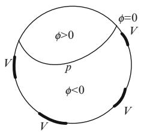
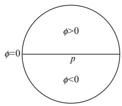
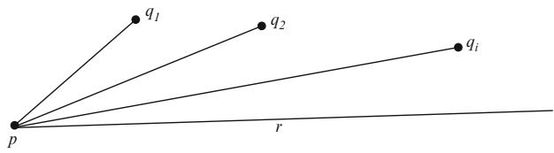
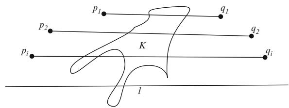
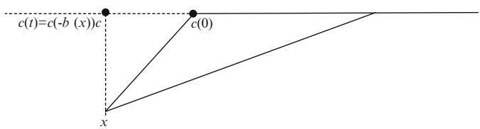
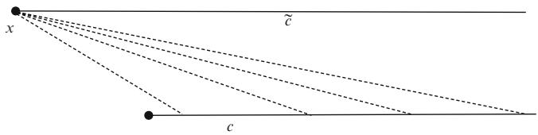
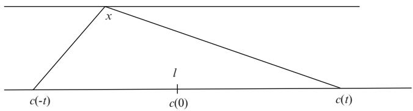

# Chapter 7 Ricci Curvature Comparison

In this chapter we prove some of the fundamental results for manifolds with lower Ricci curvature bounds. Two important techniques will be developed: Relative volume comparison and weak upper bounds for the Laplacian of distance functions. Later some of the analytic estimates we develop here will be used to estimate Betti numbers for manifolds with lower curvature bounds.

The goal is to develop several techniques to help us understand lower Ricci curvature bounds. In the 50s Calabi discovered that one has weak upper bounds for the Laplacian of distance function given lower Ricci curvature bounds, even at points where this function isn’t smooth. However, it wasn’t until after 1970, when Cheeger and Gromoll proved their splitting theorem, that this was fully appreciated. Around 1980, Gromov exposed the world to his view of how volume comparison can be used. The relative volume comparison theorem was actually first proved by Bishop in [14]. At the time, however, one only considered balls of radius less than the injectivity radius. Gromov observed that the result holds for all balls and immediately put it to use in many situations. In particular, he showed how one could generalize the Betti number estimate from Bochner’s theorem (see chapter 9) using only topological methods and volume comparison. Anderson refined this to get information about fundamental groups. One’s intuition about Ricci curvature has generally been borrowed from experience with sectional curvature. This has led to many naive conjectures that have proven to be false through the construction of several interesting examples of manifolds with nonnegative Ricci curvature. On the other hand, much good work has also come out of this, as we shall see.

The focus in this chapter will be on the fundamental comparison techniques and how they are used to prove a few rigidity theorems. In subsequent chapters there will be many further results related to lower Ricci curvature bounds that depend on more analytical techniques.

## 7.1 Volume Comparison

### 7.1.1 The Fundamental Equations

Throughout this section, assume that we have a complete Riemannian manifold $( M , g )$ of dimension n and a distance function $r \left( x \right)$ that is smooth on an open set $U \subset M$ . In subsequent sections we shall further assume that $r \left( x \right) = \left| x p \right|$ so that it is  D j jsmooth on the image of the interior of the segment domain (see section 5.7.3). Recall the following fundamental equations for the metric from proposition 3.2.11:

(1) $L _ { \partial _ { r } g } = 2 \mathrm { H e s s } r ,$   
(2) $\left( \nabla _ { \partial _ { r } } { \mathrm { H e s s } } r \right) \left( X , Y \right) + \operatorname { H e s s } ^ { 2 } r \left( X , Y \right) = - R \left( X , \partial _ { r } , \partial _ { r } , Y \right)$

There is a similar set of equations for the volume form.

Proposition 7.1.1. The volume form vol and Laplacian $\Delta r$ of a smooth distance function r are related by:

$$
\begin{array}{l} \text { (tr1) } \quad L _ {\partial_ {r}} \text {   vol   } = \Delta r \text {   vol }, \\ \partial_ {r} \Delta r + \frac {(\Delta r) ^ {2}}{n - 1} \leq \partial_ {r} \Delta r + | \text { Hess }   r | ^ {2} = - \text { Ric }   (\partial_ {r}, \partial_ {r}). \tag {tr2} \\ \end{array}
$$

Proof. The first equation was established in section 2.1.3 as one of the definitions of the Laplacian of r.

To establish the second equation we take traces in (2). More precisely, select an orthonormal frame $E _ { i } .$ ; set $X = Y = E _ { i }$ , and sum over i. In addition it is convenient D Dto assume that this frame is parallel: $\nabla _ { \partial _ { r } } E _ { i } = 0$ . On the right-hand side

$$
\sum_ {i = 1} ^ {n} R \left(E _ {i}, \partial_ {r}, \partial_ {r}, E _ {i}\right) = \operatorname{Ric} \left(\partial_ {r}, \partial_ {r}\right).
$$

While on the left-hand side

$$
\begin{array}{l} \sum_ {i = 1} ^ {n} \left(\nabla_ {\partial_ {r}} \operatorname{Hess} r\right) \left(E _ {i}, E _ {i}\right) = \sum_ {i = 1} ^ {n} \partial_ {r} \operatorname{Hess} r \left(E _ {i}, E _ {i}\right) \\ = \partial_ {r} \Delta r \\ \end{array}
$$

and

$$
\begin{array}{l} \sum_ {i = 1} ^ {n} \operatorname{Hess} ^ {2} r \left(E _ {i}, E _ {i}\right) = \sum_ {i = 1} ^ {n} g \left(\nabla_ {E _ {i}} \partial_ {r}, \nabla_ {E _ {i}} \partial_ {r}\right) \\ = \sum_ {i, j = 1} ^ {n} g \left(\nabla_ {E _ {i}} \partial_ {r}, g \left(\nabla_ {E _ {i}} \partial_ {r}, E _ {j}\right) E _ {j}\right) \\ = \sum_ {i, j = 1} ^ {n} g \left(\nabla_ {E _ {i}} \partial_ {r}, E _ {j}\right) g \left(\nabla_ {E _ {i}} \partial_ {r}, E _ {j}\right) \\ = | \mathrm{Hess} r | ^ {2}. \\ \end{array}
$$

Finally we need to show that

$$
\frac {(\Delta r) ^ {2}}{n - 1} \leq | \operatorname{Hess} r | ^ {2}.
$$

To this end also assume that $E _ { 1 } = \partial _ { r }$ , then

$$
\begin{array}{l} \left| \operatorname{Hess} r \right| ^ {2} = \sum_ {i, j = 1} ^ {n} \left(g \left(\nabla_ {E _ {i}} \partial_ {r}, E _ {j}\right)\right) ^ {2} \\ = \sum_ {i, j = 2} ^ {n} \left(g \left(\nabla_ {E _ {i}} \partial_ {r}, E _ {j}\right)\right) ^ {2} \\ \geq \frac {1}{n - 1} \left(\sum_ {i = 2} ^ {n} g \left(\nabla_ {E _ {i}} \partial_ {r}, E _ {i}\right)\right) ^ {2} \\ = \frac {1}{n - 1} (\Delta r) ^ {2}. \\ \end{array}
$$

The inequality

$$
| A | ^ {2} \geq \frac {1}{k} | \operatorname{tr} (A) | ^ {2}
$$

for a $k \times k$ matrix A is a direct consequence of the Cauchy-Schwarz inequality

$$
\left| \left(A, I _ {k}\right) \right| ^ {2} \leq \left| A \right| ^ {2} \left| I _ {k} \right| ^ {2} = \left| A \right| ^ {2} k,
$$

where $I _ { k }$ is the identity $k \times k$ matrix.

If we use the polar coordinate decomposition $g = d r ^ { 2 } + g _ { r }$ and $\mathrm { v o l } _ { n - 1 }$ is the standard volume form on $S ^ { n - 1 } \left( 1 \right)$ ; then $\mathrm { v o l } = \lambda \left( r , \theta \right) d r \wedge \mathrm { v o l } _ { n - 1 }$ , where - indicates a coordinate on $S ^ { n - 1 }$ D ^ : If we apply (tr1) to this version of the volume form we get

$$
L _ {\partial_ {r}} \operatorname{vol} = L _ {\partial_ {r}} (\lambda (r, \theta) d r \wedge \operatorname{vol} _ {n - 1}) = \partial_ {r} (\lambda) d r \wedge \operatorname{vol} _ {n - 1}
$$

as both $L _ { \partial _ { r } } d r = 0$ and $L _ { \partial _ { r } } { \bf v o l } _ { n - 1 } = 0$ : This allows us to simplify (tr1) to the formula

$$
\partial_ {r} \lambda = \lambda \Delta r.
$$

In constant curvature k we know that $g _ { k } = d r ^ { 2 } + \mathrm { s n } _ { k } ^ { 2 } \left( r \right) d s _ { n - 1 } ^ { 2 }$ , thus the volume form is

$$
\operatorname{vol} _ {k} = \lambda_ {k} (r) d r \wedge \operatorname{vol} _ {n - 1} = \operatorname{sn} _ {k} ^ {n - 1} (r) d r \wedge \operatorname{vol} _ {n - 1}.
$$

This conforms with the fact that

$$
\Delta r = (n - 1) \frac {\operatorname{sn} _ {k} ^ {\prime} (r)}{\operatorname{sn} _ {k} (r)},
$$

$$
\partial_ {r} \left(\operatorname{sn} _ {k} ^ {n - 1} (r)\right) = (n - 1) \frac {\operatorname{sn} _ {k} ^ {\prime} (r)}{\operatorname{sn} _ {k} (r)} \operatorname{sn} _ {k} ^ {n - 1} (r).
$$

### 7.1.2 Volume Estimation

With the above information we can prove the estimates that are analogous to our basic comparison estimates for the metric and Hessian of $r \left( x \right) = \left| x p \right|$ assuming lower sectional curvature bounds (see section 6.4).

Lemma 7.1.2 (Ricci Comparison). $H ( M , g )$ has $\begin{array} { r } { \mathrm { R i c } \ge ( n - 1 ) \cdot k . } \end{array}$ for some $k \in \mathbb { R }$ , then

$$
\Delta r \leq (n - 1) \frac {\operatorname{sn} _ {k} ^ {\prime} (r)}{\operatorname{sn} _ {k} (r)},
$$

$$
\partial_ {r} \left(\frac {\lambda}{\lambda_ {k}}\right) \leq 0,
$$

$$
\lambda (r, \theta) \leq \lambda_ {k} (r) = \operatorname{sn} _ {k} ^ {n - 1} (r).
$$

Proof. Notice that the right-hand sides of the inequalities correspond exactly to what one would obtain in constant curvature k. Thus the first inequality is a direct consequence of corollary 6.4.2 if we use $\begin{array} { r } { \rho = \frac { \Delta r } { n - 1 } } \end{array}$ .

For the second inequality use that $\partial _ { r } \lambda = \lambda \ddot { \Delta } r$ to conclude that

$$
\partial_ {r} \lambda \leq (n - 1) \frac {\operatorname{sn} _ {k} ^ {\prime} (r)}{\operatorname{sn} _ {k} (r)} \lambda
$$

and

$$
\partial_ {r} \lambda_ {k} = (n - 1) \frac {\mathrm{sn} _ {k} ^ {\prime} (r)}{\mathrm{sn} _ {k} (r)} \lambda_ {k}.
$$

This means that

$$
\partial_ {r} \left(\frac {\lambda}{\lambda_ {k}}\right) \leq 0.
$$

The last inequality follows from the second after the observation that $\lambda = r ^ { n - 1 } +$ $O \left( r ^ { n } \right)$ at $r = 0$ so that

$$
\lim _ {r \to 0} \frac {\lambda}{\lambda_ {k}} = 1.
$$

Our first volume comparison yields the obvious upper volume bound coming from the upper bound on the volume density.

Lemma 7.1.3. $I f ( M , g )$ has Ric $\geq ( n - 1 ) \cdot k$ ; then vol B $\left( p , r \right) \leq v \left( n , k , r \right)$ , where $v \left( n , k , r \right)$    denotes the volume of a ball of radius r in the constant curvature space form $S _ { k } ^ { n }$ :

Proof. In polar coordinates

$$
\begin{array}{l} \operatorname{vol} B (p, r) = \int_ {\operatorname{seg} _ {p} \cap B (0, r)} \lambda (r) d r \wedge \operatorname{vol} _ {n - 1} \\ \leq \int_ {\operatorname{seg} _ {p} \cap B (0, r)} \lambda_ {k} (r) d r \wedge \operatorname{vol} _ {n - 1} \\ \leq \int_ {B (0, r)} \operatorname{vol} _ {k} \\ = v (n, k, r). \\ \end{array}
$$

With a little more technical work, the above absolute volume comparison result can be improved in a rather interesting direction. The result one obtains is referred to as the relative volume comparison estimate. It will prove invaluable throughout the rest of the text.

Lemma 7.1.4 (Relative Volume Comparison, Bishop, 1964 and Gromov, 1980). Let .M; g/ be a complete Riemannian manifold with $\operatorname { R i c } \geq ( n - 1 ) \cdot k .$ . The volume ratio

$$
r \mapsto \frac {\operatorname{vol} B (p , r)}{v (n , k , r)}
$$

is a nonincreasing function whose limit is 1 as $r \to 0$ .

Proof. We will use exponential polar coordinates. The volume form $\lambda d r \wedge \mathrm { v o l } _ { n - 1 }$ for $( M , g )$ is initially defined only on some star-shaped subset of $T _ { p } M = \mathbb { R } ^ { n }$ but we can just set $\lambda = 0$ outside this set. The comparison density $\lambda _ { k }$ Dis defined on all of $\mathbb { R } ^ { n }$ when $k \leq 0$ and on $B \left( 0 , \pi / { \sqrt { k } } \right)$ when $k > 0$ . We can likewise extend $\lambda _ { k } = 0$ outside $B \left( 0 , \pi / { \sqrt { k } } \right)$ . Myers’ theorem 6.3.3 says that $\lambda = 0 \mathrm { o n } \mathbb { R } ^ { n } - B \left( 0 , \pi / \sqrt { k } \right)$ in this case. So we might as well just consider $r < \pi / \sqrt { k }$ when $k > 0$ .

The ratio is

$$
\frac {\operatorname{vol} B (p , R)}{v (n , k , R)} = \frac {\int_ {0} ^ {R} \int_ {S ^ {n - 1}} \lambda d r \wedge \operatorname{vol} _ {n - 1}}{\int_ {0} ^ {R} \int_ {S ^ {n - 1}} \lambda_ {k} d r \wedge \operatorname{vol} _ {n - 1}},
$$

and $0 \leq \lambda ( r , \theta ) \leq \lambda _ { k } ( r ) = \mathrm { s n } _ { k } ^ { n - 1 }$ .r/ everywhere.

Differentiation of this quotient with respect to R yields

$$
\begin{array}{l} {\frac {d}{d R}} \left({\frac {\operatorname{vol} B (p , R)}{v (n , k , R)}}\right) \\ = \frac {\left(\int_ {S ^ {n - 1}} \lambda (R , \theta) \operatorname{vol} _ {n - 1}\right) \left(\int_ {0} ^ {R} \int_ {S ^ {n - 1}} \lambda_ {k} (r) d r \wedge \operatorname{vol} _ {n - 1}\right)}{(v (n , k , R)) ^ {2}} \\ \frac {\left(\int_ {S ^ {n - 1}} \lambda_ {k} (R) \operatorname{vol} _ {n - 1}\right) \left(\int_ {0} ^ {R} \int_ {S ^ {n - 1}} \lambda (r , \theta) d r \wedge \operatorname{vol} _ {n - 1}\right)}{(v (n , k , R)) ^ {2}} \\ = (v (n, k, R)) ^ {- 2} \cdot \int_ {0} ^ {R} \left[ \left(\int_ {S ^ {n - 1}} \lambda (R, \theta) \operatorname{vol} _ {n - 1}\right) \cdot \left(\int_ {S ^ {n - 1}} \lambda_ {k} (r) \operatorname{vol} _ {n - 1}\right) \right. \\ \left. - \left(\int_ {S ^ {n - 1}} \lambda_ {k} (R) \operatorname{vol} _ {n - 1}\right) \left(\int_ {S ^ {n - 1}} \lambda (r, \theta) \operatorname{vol} _ {n - 1}\right) \right] d r. \\ \end{array}
$$

So to see that

$$
R \mapsto \frac {\operatorname{vol} B (p , R)}{v (n , k , R)}
$$

is nonincreasing, it suffices to check that

$$
\frac {\int_ {S ^ {n - 1}} \lambda (r , \theta) \operatorname{vol} _ {n - 1}}{\int_ {S ^ {n - 1}} \lambda_ {k} (r) \operatorname{vol} _ {n - 1}} = \frac {1}{\omega_ {n - 1}} \int_ {S ^ {n - 1}} \frac {\lambda (r , \theta)}{\lambda_ {k} (r)} \operatorname{vol} _ {n - 1}
$$

is nonincreasing. This follows from lemma 7.1.2 as $\begin{array} { r } { \partial _ { r } \left( \frac { \lambda ( r , \theta ) } { \lambda _ { k } ( r ) } \right) \le 0 } \end{array}$ :

### 7.1.3 The Maximum Principle

We explain how one can assign second derivatives to functions at points where the function is not smooth. In section 12.1 we shall also discuss generalized gradients, but this theory is completely different and works only for Lipschitz functions.

The key observation for our development of generalized Hessians and Laplacians is

Lemma 7.1.5. $I f f , h : ( M , g ) \to \mathbb { R }$ are $C ^ { 2 }$ functions such that $f ( p ) = h ( p )$ and $f ( x ) \geq h ( x )$ Wfor all x near $p ,$ !, then

$$
\nabla f (p) = \nabla h (p),
$$

$$
\operatorname{Hess} f | _ {p} \geq \operatorname{Hess} h | _ {p},
$$

$$
\Delta f (p) \geq \Delta h (p).
$$

Proof. If $( M , g ) \subset \mathsf { \Gamma } ( \mathbb { R } , g _ { \mathbb { R } } )$ ; then the theorem is standard from single variable calculus. In general, let $c : ( - \varepsilon , \varepsilon ) \to M$ be a curve with $c ( 0 ) = p$ . Then use W  !this observation on f c, h c to see that

$$
d f (\dot {c} (0)) = d h (\dot {c} (0)),
$$

$$
\operatorname{Hess} f (\dot {c} (0), \dot {c} (0)) \geq \operatorname{Hess} h (\dot {c} (0), \dot {c} (0)).
$$

This clearly implies the lemma if we let $v = { \dot { c } } ( 0 )$ run over all $v \in T _ { p } M .$ .

The lemma implies that a $C ^ { 2 }$ function $f : M \to \mathbb { R }$ has Hess $\left. f \right| _ { p } \geq B ,$ , where B is a symmetric bilinear map on $T _ { p } M$ (or $\Delta f ( p ) \geq a \in \mathbb { R } )$ j , if and only if for every $\varepsilon > 0$ there exists a function $f _ { \varepsilon } ( x )$  2defined in a neighborhood of $p$ such that

(1) $f _ { \varepsilon } ( p ) = f ( p )$   
(2) $f ( x ) \geq f _ { \varepsilon } ( x )$ in some neighborhood of $p .$   
(3) Hess $f _ { \varepsilon } | _ { p } \geq B - \varepsilon \cdot g | _ { p } ( \mathrm { o r } \Delta f _ { \varepsilon } ( p ) \geq a - \varepsilon ) .$

Such functions $f _ { \varepsilon }$ are called support functions from below. One can analogously use support functions from above to find upper bounds for Hess f and $\Delta f$ . Support functions are also known as barrier functions in PDE theory.

For a continuous function $f : ( M , g ) \to \mathbb { R }$ we say that: Hess $f | _ { p } \geq B$ (or $\Delta f ( p ) \geq$ a) if and only if for all $\varepsilon > 0$ ! j there exist smooth support functions $f _ { \varepsilon }$ satisfying (1)-(3). One also says that Hess $f | _ { p } \geq B$ (or $\Delta f ( p ) \geq a )$ hold in the support or barrier j  sense. In PDE theory there are other important ways of defining weak derivatives. The notion used here is guided by what we can obtain from geometry.

One can easily check that if $( M , g ) \subset ( \mathbb { R } , g _ { \mathbb { R } } )$ ; then f is convex if Hess $f \geq 0$ cYanmaGaGenlow everywhere. Thus, $f : ( M , g ) \to \mathbb { R }$ is convex if Hess $f \geq 0$ everywhere. Using this, one can prove

Theorem 7.1.6. $I f f : ( M , g ) \to \mathbb { R }$ is continuous with Hess $f \ \geq \ 0$ everywhere, W ! then f is constant near any local maximum. In particular, f cannot have a global maximum unless f is constant.

We shall need a more general version of this theorem called the maximum principle. As stated below, it was first proved for smooth functions by E. Hopf in 1927 and then later for continuous functions by Calabi in 1958 using the idea of support functions. A continuous function $f : ( M , g ) \to \mathbb { R }$ with $\Delta f \ge 0$ everywhere is said to be subharmonic. If $\Delta f \le 0$ W !; then f is superharmonic.

Theorem 7.1.7 (The Strong Maximum Principle). If $f \ : \ ( M , g ) \ \to \ \mathbb { R }$ is W !continuous and subharmonic, then f is constant in a neighborhood of every local maximum. In particular, if f has a global maximum, then f is constant.

Proof. First, suppose that $\Delta f > 0$ everywhere. Then $f \mathrm { c a n ^ { \prime } t }$ have any local maxima at all. For if f has a local maximum at $p \in M$ , then there would exist a smooth support function $f _ { \varepsilon } ( x )$ with

(1) $f _ { \varepsilon } ( p ) = f ( p )$   
(2) $f _ { \varepsilon } ( x ) \leq f ( x )$ for all x near $p _ { i }$   
(3) $\Delta f _ { \varepsilon } ( p ) > 0 .$

Here (1) and (2) imply that $f _ { \varepsilon }$ must also have a local maximum at $p .$ . But this implies that Hess $f _ { \varepsilon } ( p ) \leq 0$ ; which contradicts (3).

Next assume that $\Delta f \ \ge \ 0$ and let $p \in M$ be a local maximum for $f .$ . For sufficiently small $r < \operatorname { i n j } ( p )$ 2the restriction $f : B ( p , r ) \to \mathbb { R }$ will have a global maximum at p. If f is constant on $B ( p , r )$ W !; then we are done. Otherwise assume (by possibly decreasing r) that $f \left( x _ { 0 } \right) \neq f \left( p \right)$ for some

$$
x _ {0} \in \partial B (p, r) = \{x \in M \mid | x p | = r \}
$$

and define

$$
V = \{x \in \partial B (p, r) \mid f (x) = f (p) \}.
$$

Our goal is to construct a smooth function $h = e ^ { \alpha \varphi } - 1$ such that

$$
\begin{array}{l} h <   0 \text {   on   } V, \\ h (p) = 0, \\ \Delta h > 0 \text {   on   } \bar {B} (p, r)  . \\ \end{array}
$$

This function is found by first selecting an open disc $U \subset \partial B \left( p , r \right)$ that contains V and then $\phi$ such that

$$
\begin{array}{l} \phi (p) = 0, \\ \phi <   0 \text {   on   } U, \\ \nabla \phi \neq 0 \text {   on   } \bar {B} (p, r)  . \\ \end{array}
$$

Such a $\phi$ can be found by letting $\phi \ : = \ : x ^ { 1 }$ in a coordinate system $\left( x ^ { 1 } , \ldots , x ^ { n } \right)$ ) centered at $p$ where $U$ Dlies in the lower half-plane: $x ^ { 1 } < 0$ (see also figure 7.1). Lastly, choose ˛ so large that

$$
\Delta h = \alpha e ^ {\alpha \phi} (\alpha | \nabla \phi | ^ {2} + \Delta \phi) > 0 \text {   on   } \overline {{B}} (p, r).
$$

Now consider the function $\bar { \boldsymbol { f } } = \boldsymbol { f } + \delta \boldsymbol { h }$ on ${ \overline { { B } } } ( p , r )$ . This function has a local maximum in the interior $B ( p , r )$ N D C, provided ı is very small, since this forces

$$
\begin{array}{l} \bar {f} (p) = f (p) \\ > \max \left\{\bar {f} (x) \mid x \in \partial B (p, r) \right\}. \\ \end{array}
$$

On the other hand, we can also show tha $\bar { \boldsymbol { f } }$ has positive Laplacian, thus obtaining a contradiction as in the first part of the proof. To see that the Laplacian is positive,

Fig. 7.1 Coordinate function construction   

text_image

φ>0
φ=0
V
p
φ<0
V
V

text_image

φ=0
φ>0
p
φ<0

select $f _ { \varepsilon }$ as a support function from below for f at $q \in B \left( p , r \right)$ . Then $f _ { \varepsilon } + \delta h$ is a support function from below for $\bar { \boldsymbol { f } }$ at $q .$ 2 C: The Laplacian of this support function is estimated by

$$
\Delta (f _ {\varepsilon} + \delta h) (q) \geq - \varepsilon + \delta \Delta h (q),
$$

which for given $\delta$ must become positive as $\varepsilon \to 0$ :

A continuous function $f : ( M , g ) \to \mathbb { R }$ is said to be linear if Hess $f \equiv 0 , { \mathrm { i . e . } }$ ., both of the inequalities Hess $f \geq 0$ !, Hess $f \leq 0$ hold everywhere. This easily implies that

$$
(f \circ c) (t) = f (c (0)) + \alpha t
$$

for each geodesic c as $f \circ c$ is both convex and concave. Thus

$$
f \circ \exp_ {p} (x) = f (p) + g (v _ {p}, x)
$$

for each $p \in M$ and some $v _ { p } \in T _ { p } M .$ . In particular, f is $C ^ { \infty }$ with $\nabla f | _ { p } = v _ { p }$

2 2 r j DMore generally, we have the concept of a harmonic function. This is a continuous function $f : ( M , g ) \to \mathbb { R }$ with $\Delta f = 0$ . The maximum principle shows that if M is W ! Dclosed, then all harmonic functions are constant. On incomplete or complete open manifolds, however, there are often many harmonic functions. This is in contrast to the existence of linear functions, where $\nabla f$ is necessary parallel and therefore rsplits the manifold locally into a product where one factor is an interval. It is an important fact that any harmonic function is $C ^ { \infty }$ if the metric is $C ^ { \infty }$ . Using the above maximum principle this is a standard result in PDE theory (see also theorem 9.2.7 and section 11.2).

Theorem 7.1.8 (Regularity of harmonic functions). If $f ~ : ~ ( M , g ) ~ \to ~ \mathbb { R }$ is continuous and harmonic in the weak sense, then f is smooth.

Proof. We fix $p \in M$ and a neighborhood 
 around p with smooth boundary. We 2can in addition assume that $\Omega$ is contained in a coordinate neighborhood. It is a standard but nontrivial fact from PDE theory that the following Dirichlet boundary value problem has a solution:

$$
\Delta u = 0,
$$

$$
u | _ {\partial \Omega} = f | _ {\partial \Omega}.
$$

Moreover, such a solution u is smooth on the interior of 
: Now consider the two functions $u - f$ and $f - u$ on 
: If they are both nonpositive, then they must vanish and hence $\textit { f } = \textit { u }$ is smooth near $p .$ : Otherwise one of these functions must be Dpositive somewhere. However, as it vanishes on the boundary and is subharmonic this implies that it has an interior global maximum. The maximum principle then shows that the function is constant, but this is only possible if it vanishes.

### 7.1.4 Geometric Laplacian Comparison

The idea of using support functions to estimate the Laplacian is particularly convenient for geometric applications since distance functions always have support functions from above.

Lemma 7.1.9 (Calabi, 1958). $H ( M , g )$ is complete and $\operatorname { R i c } ( M , g ) \geq ( n - 1 ) k ,$ , then any distance function $r ( x ) = | x p |$ satisfies:

$$
\Delta r (x) \leq (n - 1) \frac {\operatorname{sn} _ {k} ^ {\prime} (r (x))}{\operatorname{sn} _ {k} (r (x))}.
$$

Proof. We know from lemma 7.1.2 that the result is true whenever r is smooth. In general, we can for each $q \in M$ choose a unit speed segment $\sigma : [ 0 , L ] \to M$ with $\sigma ( 0 ) = p , \sigma ( L ) = q$ 2. Then the triangle inequality implies that $r _ { \varepsilon } ( x ) = \varepsilon + | \sigma ( \varepsilon ) x |$ D Dis a support function from above for r at $q .$ D C j j. If all these support functions are smooth at $q .$ then

$$
\begin{array}{l} \Delta r _ {\varepsilon} (q) \leq (n - 1) \frac {\mathrm{sn} _ {k} ^ {\prime} (r _ {\epsilon} (q))}{\mathrm{sn} _ {k} (r _ {\epsilon} (q))} \\ = (n - 1) \frac {\operatorname{sn} _ {k} ^ {\prime} (r (q) - \epsilon)}{\operatorname{sn} _ {k} (r (q) - \epsilon)} \\ \searrow (n - 1) \frac {\operatorname{sn} _ {k} ^ {\prime} (r (q))}{\operatorname{sn} _ {k} (r (q))} \\ \end{array}
$$

as $\varepsilon \to 0$ since $\frac { \mathrm { s n } _ { k } ^ { \prime } ( r ) } { \mathrm { s n } _ { k } ( r ) }$ is decreasing.

! Now for the smoothness. Fix $\varepsilon > 0$ and suppose $r _ { \varepsilon }$ is not smooth at $q .$ : Then we know from lemma 5.7.9 that either

(1) there are two segments from $\sigma \left( \varepsilon \right)$ to $q ,$   
(2) $q$ is a critical value for $\exp _ { \sigma ( \varepsilon ) } : \mathrm { s e g } ( \sigma ( \varepsilon ) )  M .$

Case (1) would give us a nonsmooth curve of length L from $p$ to $q ,$ ; which we know is impossible. Thus, case (2) must hold. To get a contradiction out of this, we show that this implies that $\exp _ { q }$ has $\sigma \left( \varepsilon \right)$ as a critical value.

Using that q is critical for $\exp _ { \sigma ( \varepsilon ) }$ ; we find a Jacobi field $J ( t ) : [ \varepsilon , L ]  T M$ along $\sigma \vert _ { [ \varepsilon , L ] }$ such that $J \left( \varepsilon \right) = 0 , { \dot { J } } \left( \varepsilon \right) \neq 0$ and $J \left( L \right) = 0$ (see section 5.7.3). Then also $\dot { J } \left( L \right) \neq 0$ D ¤ Das it solves a linear second-order equation. Running backwards from q to $\sigma \left( \varepsilon \right)$ ¤then shows that $\exp _ { q }$ is critical at $\sigma \left( \varepsilon \right)$ . This however contradicts that $\sigma : [ 0 , L ] \to M$ is a segment.

### 7.1.5 The Segment, Poincaré, and Sobolev Inequalities

We shall use the results obtained in section 7.1.2 to prove a some important analytic inequalities that will be used in chapter 9.

Theorem 7.1.10 (The Segment Inequality, Cheeger and Colding, 1996). Assume that $( M , g )$ has Ric $\geq ~ ( n - 1 ) k , ~ k ~ \leq ~ 0$ . Let $f : M \to [ 0 , \infty )$ and $A , B \subset W \subset M$  . Further select segments $c _ { x , y } : [ 0 , 1 ] \to M$ W ! between points x; $y \in M$ . $I f c _ { x , y } \left( t \right) \in W$ for all $x \in A , y \in B , t \in [ 0 , 1 ] ,$ W !, and diam $W \leq D ,$ , then

$$
\int_ {A \times B} \int_ {0} ^ {1} f \circ c _ {x, y} (t) d t \operatorname{vol} _ {x} \wedge \operatorname{vol} _ {y} \leq C (\operatorname{vol} A + \operatorname{vol} B) \int_ {W} f \operatorname{vol},
$$

where $C = C \left( n , k D ^ { 2 } \right)$ .

Proof. Define

$$
C = \max _ {R \leq D} \frac {\operatorname{sn} _ {k} ^ {n - 1} (R)}{\operatorname{sn} _ {k} ^ {n - 1} \left(\frac {1}{2} R\right)}.
$$

Note that when $k = 0$ we have $C = 2 ^ { n - 1 }$ and otherwise one can show that

$$
C = \frac {\sinh^ {n - 1} (\sqrt {- k} D)}{\sinh^ {n - 1} \left(\frac {1}{2} \sqrt {- k} D\right)}.
$$

Fix $\textstyle x \in A , t \geq { \frac { 1 } { 2 } }$ , and use polar coordinates with center x. The map $y \mapsto c _ { x , y } \left( t \right)$ is 2  7!a well-defined “scaling” by t inside the segment domain. With that in mind we have:

$$
\begin{array}{l} \int_ {B} f \circ c _ {x, y} (t) \operatorname{vol} _ {y} = \int_ {B} f \circ c _ {x, y} (t) \lambda (y) d r \wedge \operatorname{vol} _ {n - 1} \\ = \int_ {B} f \circ c _ {x, y} (t) \lambda \left(c _ {x, y} (t)\right) \frac {\lambda (y)}{\lambda \left(c _ {x , y} (t)\right)} d r \wedge \operatorname{vol} _ {n - 1} \\ \leq C \int_ {B} f \circ c _ {x, y} (t) \lambda \left(c _ {x, y} (t)\right) d r \wedge \operatorname{vol} _ {n - 1} \\ \leq C \int_ {W} f \text {   vol   }. \\ \end{array}
$$

This gives us

$$
\int_ {A} \int_ {B} \int_ {\frac {1}{2}} ^ {1} f \circ c _ {x, y} (t) d t \operatorname{vol} _ {y} \operatorname{vol} _ {x} \leq \frac {1}{2} C \operatorname{vol} A \int_ {W} f \operatorname{vol}.
$$

Similarly

$$
\int_ {B} \int_ {A} \int_ {0} ^ {\frac {1}{2}} f \circ c _ {x, y} (t) d t \operatorname{vol} _ {x} \operatorname{vol} _ {y} \leq \frac {1}{2} C \operatorname{vol} B \int_ {W} f \operatorname{vol}.
$$

Adding these gives the desired result.

This estimate allows us to establish a weak Poincaré inequality. To formulate the result it’ll be convenient to define the $L ^ { p }$ norm on a domain B by also averaging the integral:

$$
\| u \| _ {p, B} = \left(\frac {1}{\mathrm{vol} B} \int_ {B} | u | ^ {p} \mathrm{vol}\right) ^ {\frac {1}{p}}
$$

and using the notation $\begin{array} { r } { u _ { B } = \frac { 1 } { \mathrm { v o l } B } \int _ { B } } \end{array}$ u vol for the average value of a function on a bounded domain.

Corollary 7.1.11. Assume that .M; g/ has ${ \mathrm { R i c ~ } } \geq \left( n - 1 \right) k , \ k \ \leq \ 0 .$ . Any smooth $u : M \to [ 0 , \infty )$ satisfies

$$
\left\| u - u _ {B (p, R)} \right\| _ {1, B (p, R)} \leq 4 C ^ {2} R \left\| d u \right\| _ {1, B (p, 2 R)},
$$

where $R \leq D .$

Proof. This proof is due to Cheeger and Colding. We use the segment inequality with $A = B = B ( p , R ) , W = B ( p , 2 R )$ , and $f = | d u |$ as well as the observation

$$
\begin{array}{l} \int_ {B} | u - u _ {B} | = \int_ {B} \left| u (x) - \frac {1}{\operatorname{vol} B} \int_ {B} u (y) \operatorname{vol} _ {y} \right| \operatorname{vol} _ {x} \\ = \int_ {B} \left| \frac {1}{\operatorname{vol} B} \int_ {B} (u (x) - u (y)) \operatorname{vol} _ {y} \right| \operatorname{vol} _ {x} \\ \leq \frac {1}{\operatorname{vol} B} \int_ {B} \int_ {B} | u (x) - u (y) | \operatorname{vol} _ {y} \operatorname{vol} _ {x} \\ \leq \frac {1}{\operatorname{vol} B} \int_ {B} \int_ {B} \int_ {0} ^ {1} | x y | | | d u | (c _ {x, y} (t)) | d t \operatorname{vol} _ {y} \operatorname{vol} _ {x} \\ \leq \frac {2 R}{\operatorname{vol} B} \int_ {B} \int_ {B} \int_ {0} ^ {1} | | d u | (c _ {x, y} (t)) | d t \operatorname{vol} _ {y} \operatorname{vol} _ {x}. \\ \end{array}
$$

This shows that

$$
\left\| u - u _ {B (p, R)} \right\| _ {1, B (p, R)} \leq 4 C R \frac {\operatorname{vol} B (p , 2 R)}{\operatorname{vol} B (p , R)} \| | d u | \| _ {1, B (p, 2 R)}.
$$

The result follows by using that the volume ratio is bounded explicitly by the ratio

$$
\frac {v (n , k , 2 R)}{v (n , k , R)} \leq \frac {v (n , k , 2 D)}{v (n , k , D)}.
$$

Remark 7.1.12. Note that the corollary holds for any measurable u with a function G in place of $\lvert d u \rvert$ provided

$$
\left| u (x) - u (y) \right| \leq \int_ {0} ^ {1} G (c (t)) | \dot {c} | d t
$$

for all $c \in \Omega _ { x , y }$ . Such a G is also called an upper gradient.

This leads us, surprisingly, to the much stronger Poincaré-Sobolev inequality where the domain is the same on both sides and a stronger norm is used on the left-hand side.

Theorem 7.1.13. Assume that $( M , g )$ has Ric $\geq \left( n - 1 \right) k , k \leq 0$ . For all smooth $u : M \to [ 0 , \infty )$ and $\textstyle \nu \in \left[ 1 , { \frac { n } { n - 1 } } \right]$

$$
\left\| u - u _ {B (x, R)} \right\| _ {\nu , B (x, R)} \leq C (n, k D ^ {2}) R \| | d u | \| _ {1, B (x, R)},
$$

where $R \leq D .$

We offer a proof by Hajłasz and Koskela that can be found in [60]. An even shorter proof is possible when $\nu \ < \ \frac { n } { n - 1 }$ . Traditionally, proofs of this theorem  required a very deep and difficult theorem from geometric measure theory. Here we only need a few basic concepts from analysis together with the weak Poincaré inequality and relative volume comparison. This proof has the added benefit of easily allowing generalizations to suitable metric spaces. We will for simplicity prove it in case $B \left( x , R \right) = M$ and D is an upper bound for the diameter of M. To Dkeep constants at bay we shall also keep writing them as C with the understanding that $C = C \left( n , k D ^ { 2 } \right)$ depends on n and possibly also $k D ^ { 2 }$ . However, the constants Dmight change from line to line in a proof.

The maximal function of a function u is defined as

$$
M (u) (x) = \sup _ {R \in (0, D ]} \frac {1}{\operatorname{vol} B (x , R)} \int_ {B (x, R)} | u | \operatorname{vol}.
$$

We only need the weak version of the maximal function estimate. Note that this estimate does not bound $\Vert M \left( u \right) \Vert _ { 1 }$ in terms of $\left. u \right. _ { 1 }$ , which is in fact impossible, but k kit can be used to prove the standard bounds $\left. M \left( u \right) \right. _ { p } \leq C \left. u \right. _ { p }$ for all $p > 1$ .

Theorem 7.1.14 (Maximal Function Theorem). There exists a constant ${ \boldsymbol { C } } =$ $C \left( n , k D ^ { 2 } \right)$ such that

$$
t \operatorname{vol} \left\{M (u) > t \right\} \leq C \int | u | \operatorname{vol}.
$$

Proof. Note that for each $x \in \{ M \left( u \right) > t \}$ there is $R _ { x } \leq D$ such that

$$
t \operatorname{vol} B (x, R _ {x}) <   \int_ {B (x, R _ {x})} | u | \operatorname{vol}.
$$

Now use the basic covering property (see exercise 7.5.5) to cover $\{ M \left( u \right) > t \}$ by balls $B \left( x _ { i } , 5 R _ { x _ { i } } \right)$ with the property that $B \left( x _ { i } , R _ { x _ { i } } \right)$ f gare pairwise disjoint. Relative volume comparison gives us

$$
\frac {\operatorname{vol} B (x , 5 R)}{\operatorname{vol} B (x , R)} \leq \frac {v (n , k , 5 D)}{v (n , k , D)} = C = C (n, k D ^ {2}).
$$

We can then estimate

$$
\begin{array}{l} t \operatorname{vol} \left\{M (u) > t \right\} \leq \sum t \operatorname{vol} B \left(x _ {i}, 5 R _ {x _ {i}}\right) \\ \leq C \sum t \operatorname{vol} B \left(x _ {i}, R _ {x _ {i}}\right) \\ <   C \sum \int_ {\operatorname{vol} B \left(x _ {i}, R _ {x _ {i}}\right)} | u | \text {   vol   } \\ \leq C \int | u | \text {   vol   }. \\ \end{array}
$$

Theorem 7.1.15. Assume that $( M , g )$ has Ric $\geq \left( n - 1 \right) k , k \leq 0 ,$ , and diam $M \leq D$ . Let $u : M \to [ 0 , \infty )$   be smooth. There is a weak Poincaré-Sobolev inequality

$$
t ^ {\frac {n}{n - 1}} \operatorname{vol} \left\{\left| u - u _ {B (x, R)} \right| > t \right\} \leq C R ^ {\frac {n}{n - 1}} \operatorname{vol} M \| | d u | \| _ {1} ^ {\frac {n}{n - 1}},
$$

where $C = C \left( n , k D ^ { 2 } \right)$ .

Proof. For simplicity we prove this when $R = D$ . Fix $x \in M$ and define $R _ { i } = 2 ^ { - i } D .$ . If $B _ { i } = B \left( x , R _ { i } \right)$ , then $M = B _ { 0 }$ D 2. By continuity of u we have $u \left( x \right) = \operatorname* { l i m } u _ { B _ { i } }$ . This Dtells us that

$$
\begin{array}{l} \left| u (x) - u _ {B _ {0}} \right| \leq \sum_ {i = 0} ^ {\infty} \left| u _ {B _ {i}} - u _ {B _ {i + 1}} \right| \\ \leq \sum_ {i = 0} ^ {\infty} \left\| u - u _ {B _ {i}} \right\| _ {1, B _ {i + 1}} \\ \end{array}
$$

$$
\begin{array}{l} \leq \sum_ {i = 0} ^ {\infty} \frac {\operatorname{vol} B _ {i}}{\operatorname{vol} B _ {i + 1}} \left\| u - u _ {B _ {i}} \right\| _ {1, B _ {i}} \\ \leq C \sum_ {i = 0} ^ {\infty} \left\| u - u _ {B _ {i}} \right\| _ {1, B _ {i}} \\ \leq 2 C ^ {3} \sum_ {i = 0} ^ {\infty} R _ {i} \| | d u | \| _ {1, B _ {i - 1}}. \\ \end{array}
$$

Therefore, it suffices to prove an estimate of the form:

$$
t ^ {\frac {n}{n - 1}} \operatorname{vol} \left\{\sum_ {i = 0} ^ {\infty} R _ {i} \| | d u | \| _ {1, B _ {i - 1}} > t \right\} \leq C D ^ {\frac {n}{n - 1}} \operatorname{vol} M \| | d u | \| _ {1} ^ {\frac {n}{n - 1}}.
$$

For any $x \in M$ and $r > 0$ split up the sum

$$
\sum_ {R _ {i} \leq r} R _ {i} \| | d u | \| _ {1, B _ {i - 1}} + \sum_ {R _ {i} > r} R _ {i} \| | d u | \| _ {1, B _ {i - 1}}.
$$

The first term is controlled by the maximal function

$$
\begin{array}{l} \sum_ {R _ {i} \leq r} R _ {i} \| | d u | \| _ {1, B _ {i - 1}} \leq \left(\sum_ {R _ {i} \leq r} R _ {i}\right) M (| d u |) (x) \\ \leq 2 r M (| d u |) (x). \\ \end{array}
$$

The second term is bounded by $\| | d u | \| _ { 1 }$ as follows:

$$
\begin{array}{l} \sum_ {R _ {i} > r} R _ {i} \| | d u | \| _ {1, B _ {i - 1}} \leq \left(\sum_ {R _ {i} > r} R _ {i} \frac {\operatorname{vol} M}{\operatorname{vol} B _ {i - 1}}\right) \| | d u | \| _ {1} \\ \leq C \sum_ {R _ {i} > r} R _ {i} \left(\frac {D}{R _ {i - 1}}\right) ^ {n} \| | d u | \| _ {1} \\ \leq C \sum_ {R _ {i} > r} \frac {2 ^ {- i}}{2 ^ {- n (i - 1)}} D \| | d u | \| _ {1} \\ = C 2 ^ {- n} \sum_ {R _ {i} > r} 2 ^ {(n - 1) i} D \| | d u | \| _ {1} \\ \leq 2 ^ {1 - n} C 2 ^ {(n - 1) i _ {0}} D \| | d u | \| _ {1} \\ = 2 ^ {1 - n} C R _ {i _ {0}} ^ {1 - n} D ^ {n} \left\| | d u | \right\| _ {1} \\ \leq 2 ^ {1 - n} C r ^ {1 - n} D ^ {n} \| | d u | \| _ {1}. \\ \end{array}
$$

$$
= 2 ^ {1 - n} C \left(2 ^ {i _ {0}} D ^ {- 1}\right) ^ {n - 1} D ^ {n} \| | d u | \| _ {1}
$$

Thus

$$
\sum_ {i = 0} ^ {\infty} R _ {i} \| | d u | \| _ {1, B _ {i - 1}} \leq C (r M (| d u |) (x) + r ^ {1 - n} D ^ {n} \| | d u | \| _ {1})
$$

and for $\begin{array} { r } { r = D \left( \frac { \| | d u | \| _ { 1 } } { M ( | d u | ) ( x ) } \right) ^ { \frac { 1 } { n } } } \end{array}$ yields the estimate:

$$
\sum_ {i = 0} ^ {\infty} R _ {i} \| | d u | \| _ {1, B _ {i - 1}} \leq C D (M (| d u |) (x)) ^ {\frac {n - 1}{n}} \| | d u | \| _ {1} ^ {\frac {1}{n}}.
$$

Note that while it is natural to assume $r \leq D$ this estimate is still valid when $r > D$ . The maximal function theorem can now be used to obtain the inequality

$$
\operatorname{vol} \left\{\sum_ {i = 0} ^ {\infty} R _ {i} \| | d u | \| _ {1, B _ {i - 1}} > t \right\} = \operatorname{vol} \left\{\left(\sum_ {i = 0} ^ {\infty} R _ {i} \| | d u | \| _ {1, B _ {i - 1}}\right) ^ {\frac {n}{n - 1}} > t ^ {\frac {n}{n - 1}} \right\}
$$

$$
\leq \operatorname{vol} \left\{C D ^ {\frac {n}{n - 1}} \| | d u | \| _ {1} ^ {\frac {1}{n - 1}} M (| d u |) (x) > t ^ {\frac {n}{n - 1}} \right\}
$$

$$
\leq t ^ {- \frac {n}{n - 1}} C D ^ {\frac {n}{n - 1}} \| | d u | \| _ {1} ^ {\frac {1}{n - 1}} \int_ {M} | d u | \text { vol }
$$

$$
\leq t ^ {- \frac {n}{n - 1}} C D ^ {\frac {n}{n - 1}} \operatorname{vol} M \| | d u | \| _ {1} ^ {\frac {n}{n - 1}}.
$$

The proof of the Poincaré-Sobolev inequality can now be completed as follows.

Proof of theorem 7.1.13. We use the estimate from theorem 7.1.15 to prove the result. First we need two more elementary facts. Note that for any $c \in \mathbb { R }$ :

$$
\left\| u - u _ {M} \right\| _ {p} \leq \left\| c - u _ {M} \right\| _ {p} + \left\| u - c \right\| _ {p} = \left| u _ {M} - c \right| + \left\| u - c \right\| _ {p} \leq 2 \left\| u - c \right\| _ {p}
$$

and

$$
\inf _ {c} \| u - c \| _ {p} \leq \| u - u _ {M} \| _ {p}.
$$

So it suffices to estimate $\| u - c \| _ { p }$ for a suitable c.

For a general $u \ : \ M \ \to \ \mathbb { R }$ find m such that vol $\left\{ u \ge m \right\} \ge \frac { \mathrm { v o l } M } { 2 }$ and vol $\{ u \leq m \} \geq { \frac { \mathrm { v o l } M } { 2 } }$ W !. Then split u into the two functions $v ^ { + } = { }$ g max $\{ u - m , 0 \}$ and $v ^ { - } = \operatorname* { m a x } { \{ m - u , 0 \} }$ . Note that they both satisfy vol $\begin{array} { r } { \left\{ v ^ { \pm } = 0 \right\} \ge \frac { \mathrm { v o l } M } { 2 } } \end{array}$ .

DWhile $v ^ { \pm }$ f  gis not smooth we can set $| d v ^ { \pm } | = 0$ D at all points where $v ^ { \pm }$ vanishes. Thus it suffices to show that

$$
\left\| v ^ {\pm} \right\| _ {\frac {n}{n - 1}} \leq C (n, k D ^ {2}) D \| | d v ^ {\pm} | \| _ {1}
$$

as

$$
\left\| u \right\| _ {\frac {n}{n - 1}} \leq \left\| v ^ {+} \right\| _ {\frac {n}{n - 1}} + \left\| v ^ {-} \right\| _ {\frac {n}{n - 1}} \text { and } \left| d v ^ {+} \right| + | d v ^ {-} | \leq | d u |.
$$

We first claim that $v = v ^ { \pm }$ satisfies

$$
\operatorname{vol} \left\{v > t \right\} \leq 2 \operatorname{vol} \left\{\left| v - c \right| > \frac {t}{2} \right\}.
$$

To see this note that when $\begin{array} { r } { \frac { t } { 2 } \ \le \ c } \end{array}$ we have $\textstyle { \left\{ c - v > { \frac { t } { 2 } } \right\} \subset \{ v = 0 \} }$ , while when $\begin{array} { r } { \frac { t } { 2 } \geq c } \end{array}$ we have $\{ v > c + { \frac { t } { \gamma } } \} \subset \{ v > t \}$ .

For $0 < a < b$ C   f gconsider the truncated function

$$
v _ {a} ^ {b} \left(x\right) = \left\{ \begin{array}{l l} b - a & \text { if } v \left(x\right) \geq b, \\ v \left(x\right) - a & \text { if } a <   v \left(x\right) \leq b, \\ 0 & \text { if } v \left(x\right) \leq a, \end{array} \right.
$$

and note that the weak Poincaré inequality holds for $v _ { a } ^ { b }$ if we use $| d v | \cdot \chi _ { \{ a < v \leq b \} }$ as an upper gradient. Theorem 7.1.15 can now be used:

$$
\begin{array}{l} t ^ {\frac {n}{n - 1}} \operatorname{vol} \left\{v _ {a} ^ {b} > t \right\} \leq 2 t ^ {\frac {n}{n - 1}} \inf _ {c} \operatorname{vol} \left\{\left| v _ {a} ^ {b} - c \right| > \frac {t}{2} \right\} \\ = 2 ^ {\frac {n}{n - 1} + 1} \left(\frac {t}{2}\right) ^ {\frac {n}{n - 1}} \inf _ {c} \operatorname{vol} \left\{\left| v _ {a} ^ {b} - c \right| > \frac {t}{2} \right\} \\ \leq 2 ^ {\frac {n}{n - 1} + 1} \left(\frac {t}{2}\right) ^ {\frac {n}{n - 1}} \operatorname{vol} \left\{\left| v _ {a} ^ {b} - \left(v _ {a} ^ {b}\right) _ {M} \right| > \frac {t}{2} \right\} \\ \leq C D ^ {\frac {n}{n - 1}} 2 ^ {\frac {n}{n - 1} + 1} \operatorname{vol} M \| | d v | \cdot \chi_ {\{a <   v \leq b \}} \| _ {1} ^ {\frac {n}{n - 1}}. \\ \end{array}
$$

We then get the desired estimate as follows:

$$
\begin{array}{l} \int v ^ {\frac {n}{n - 1}} \operatorname{vol} \leq \sum_ {k = - \infty} ^ {\infty} 2 ^ {k \frac {n}{n - 1}} \operatorname{vol} \left\{2 ^ {k - 1} <   v \leq 2 ^ {k} \right\} \\ \leq \sum_ {k} 2 ^ {k \frac {n}{n - 1}} \operatorname{vol} \left\{v > 2 ^ {k - 1} \right\} \\ \leq \sum_ {k} 2 ^ {k \frac {n}{n - 1}} \operatorname{vol} \left\{v _ {2 ^ {k - 2}} ^ {2 ^ {k - 1}} > 2 ^ {k - 1} - 2 ^ {k - 2} \right\} \\ = \sum_ {k} 2 ^ {k \frac {n}{n - 1}} \operatorname{vol} \left\{v _ {2 ^ {k - 2}} ^ {2 ^ {k - 1}} > 2 ^ {k - 2} \right\} \\ \leq 2 ^ {3 \frac {n}{n - 1} + 1} C D ^ {\frac {n}{n - 1}} \operatorname{vol} M \sum_ {k} \left\| | d v | \cdot \chi_ {\{2 ^ {k - 2} <   v \leq 2 ^ {k - 1} \}} \right\| _ {1} ^ {\frac {n}{n - 1}} \\ \end{array}
$$

$$
\begin{array}{l} \leq 2 ^ {3 \frac {n}{n - 1} + 1} C D ^ {\frac {n}{n - 1}} \operatorname{vol} M \left\| \sum_ {k} | d v | \cdot \chi_ {\{2 ^ {k - 2} <   v \leq 2 ^ {k - 1} \}} \right\| _ {1} ^ {\frac {n}{n - 1}} \\ = 2 ^ {3 \frac {n}{n - 1} + 1} C D ^ {\frac {n}{n - 1}} \operatorname{vol} M \| | d v | \| _ {1} ^ {\frac {n}{n - 1}}. \\ \end{array}
$$

Remark 7.1.16. See exercise 7.5.17 for the Poincaré inequality for functions with Dirichlet boundary conditions.

Finally we also obtain an entire hierarchy of such inequalities.

Proposition 7.1.17. Assume that all smooth functions on $( M , g )$ satisfy the inequality

$$
\left\| u - u _ {M} \right\| _ {\frac {s}{s - 1}} \leq S \left\| d u \right\| _ {1},
$$

with $s > 1$ , then for $1 \leq p < s$

$$
\| u \| _ {\frac {s p}{s - p}} \leq \frac {p (s - 1)}{s - p} S \| d u \| _ {p} + \| u \| _ {p}.
$$

Proof. When p 1, this follows from

$$
\begin{array}{l} \left\| u - u _ {M} \right\| _ {\frac {s}{s - 1}} \geq \left\| u \right\| _ {\frac {s}{s - 1}} - \left\| u _ {M} \right\| _ {\frac {s}{s - 1}} \\ = \| u \| _ {\frac {s}{s - 1}} - | u _ {M} | \\ \geq \left\| u \right\| _ {\frac {s}{s - 1}} - \left\| u \right\| _ {1}. \\ \end{array}
$$

For $p > 1$ first note that

$$
\begin{array}{l} \| u \| _ {\frac {q s}{s - 1}} ^ {q} = \| u ^ {q} \| _ {\frac {s}{s - 1}} \\ \leq S \left\| d u ^ {q} \right\| _ {1} + \left\| u ^ {q} \right\| _ {1} \\ = S q \left\| u ^ {q - 1} d u \right\| _ {1} + \left\| u ^ {q - 1} u \right\| _ {1} \\ \leq \| u \| _ {\frac {p (q - 1)}{p - 1}} ^ {q - 1} \left(S q   \| d u \| _ {p} + \| u \| _ {p}\right). \\ \end{array}
$$

Then choose $\begin{array} { r } { q = \frac { p ( s - 1 ) } { s - p } } \end{array}$ so that $\begin{array} { r } { \frac { q s } { s - 1 } = \frac { p ( q - 1 ) } { p - 1 } = \frac { s p } { s - p } } \end{array}$ to obtain the desired inequality.

Finally we establish the Rellich compactness theorem. The same strategy can also be used to prove the more general Kondrachov compactness theorem for $L ^ { p } \left( M \right)$ . Define $W ^ { 1 , 2 } \left( M \right)$ as the Hilbert space closure of $C ^ { \infty } \left( M \right)$ with the square norm $\left\| u \right\| _ { 2 } ^ { 2 } + \left\| d u \right\| _ { 2 } ^ { 2 }$ . Recall that a sequence $v _ { i } \in \mathsf { \Gamma } ( H , ( \cdot , \cdot ) )$ in a Hilbert space is k k C k kweakly convergent, $v _ { i } \implies v \mathrm { ~ i f ~ } ( v _ { i } , w ) \ \to \ ( v , w )$ for all $w \in H$ . Moreover, any !bounded sequence has a weakly convergent subsequence.

Theorem 7.1.18 (Rellich Compactness). Assume $( M ^ { n } , g )$ is a compact Riemannian n-manifold. The inclusion $W ^ { 1 , 2 } \left( M \right) \subset L ^ { 2 } \left( M \right)$ / is compact.

Outline of Proof. Consider a sequence $u _ { i }$ of smooth functions where $\| u _ { i } \| _ { 2 } ^ { 2 } + \| d u _ { i } \| _ { 2 } ^ { 2 }$ kis bounded. Then there will be a weakly convergent subsequence $u _ { i } ~  ~ u .$ k . In particular, $u _ { i , B ( x , R ) } \to u _ { B ( x , R ) }$ for fixed $x \in M$ and $R > 0$ .

! 2By the Lebesgue differentiation theorem we also have that $u _ { B ( x , R ) } \ \to \ u \left( x \right)$ as $R \to 0$ for almost all $x \in M$ . Next note that by theorem 7.1.15

$$
\operatorname{vol} \left\{\left| u _ {i} - u _ {i, B (x, R)} \right| > \epsilon \right\} \leq C \left(\frac {R}{\epsilon}\right) ^ {\frac {n}{n - 1}} \operatorname{vol} M \| d u _ {i} \| _ {1} ^ {\frac {n}{n - 1}} \leq C ^ {\prime} \left(\frac {R}{\epsilon}\right) ^ {\frac {n}{n - 1}},
$$

where $C ^ { \prime }$ is independent of i.

This implies that vol $\{ | u _ { i } ( x ) - u ( x ) | > \epsilon \}  0$ as $i  \infty$ . We can then extract another subsequence of $u _ { i }$  j g ! ! 1that converges pointwise to u almost everywhere on M. Since $\begin{array} { r } { \left\| u _ { i } \right\| \frac { 2 n } { n - 2 } } \end{array}$ is bounded Egorov’s theorem implies that $u _ { i } \to u$ in $L ^ { 2 }$ .

## 7.2 Applications of Ricci Curvature Comparison

### 7.2.1 Finiteness of Fundamental Groups

Our first application of volume comparison shows how one can control the fundamental group. We start with a result that addresses how fundamental groups can be represented.

Lemma 7.2.1 (Gromov, 1980). A compact Riemannian manifold M admits generators $\{ c _ { 1 } , \ldots . c _ { m } \}$ for the fundamental group $\Gamma = \pi _ { 1 } \left( M \right)$ such that all relations for f g in are of the form $c _ { i } \cdot c _ { j } \cdot c _ { k } ^ { - 1 } = 1$ Dfor suitable $i , j , k ,$ . Moreover, the generators $c _ { i }$   Dcan be represented by loops of leng $t h \le 3$ diam .M/.

Proof. For any $\varepsilon ~ \in ~ ( 0 , \operatorname { i n j } \left( M \right) )$ choose a triangulation of M such that adjacent 2vertices in this triangulation are joined by a curve of length less that ": Let $\{ x _ { 1 } , \ldots , x _ { k } \}$ denote the set of vertices and $\left\{ e _ { i j } \right\}$ the edges joining adjacent vertices f(thus, $e _ { i j }$ gis not necessarily defined for all $i , j )$ . If x is the projection of $\tilde { x } \in \tilde { M }$ ; then join x and $x _ { i }$ by a segment $\sigma _ { i }$ for all $i = 1 , \ldots , k$ Q 2and construct the loops $\sigma _ { i j } = \sigma _ { i } e _ { i j } \sigma _ { j } ^ { - 1 }$ for adjacent vertices.

DAny loop in M based at x is homotopic to a loop in the 1-skeleton of the triangulation, i.e., a loop that is constructed out of juxtaposing edges $e _ { i j }$ : Since $e _ { i j } e _ { j k } = e _ { i j } { \sigma } _ { j } ^ { - 1 } { \sigma } _ { j } e _ { j k }$ such loops are the product of loops of the form $\sigma _ { i j }$ : Therefore,  D is generated by $\sigma _ { i j }$ :

Next observe that if three vertices $x _ { i } , x _ { j } , x _ { k }$ are adjacent to each other, then they span a 2-simplex $\triangle _ { i j k }$ : Consequently the loop $\sigma _ { i j } \sigma _ { j k } \sigma _ { k i } = \sigma _ { i j } \sigma _ { j k } \sigma _ { i k } ^ { - 1 }$ is homotopically 4 Dtrivial. We claim that these are the only relations needed to describe : To see this, let $\sigma$ be any loop in the 1-skeleton that is homotopically trivial in M. Then  also contracts in the 2-skeleton. Thus, a homotopy corresponds to a collection of 2-simplices $\triangle _ { i j k }$ : In this way we can represent the relation $\sigma = 1$ as a product of 4elementary relations of the form $\sigma _ { i j } \sigma _ { j k } \sigma _ { i k } ^ { - 1 } = 1$ :

DThe generators correspond to loops of length $\leq 2 \dim \left( M \right) + \varepsilon$ so the result is proven.

A simple example might be instructive here.

Example 7.2.2. Consider $M _ { k } = { S } ^ { 3 } / \mathbb { Z } _ { k }$ the constant curvature 3-sphere divided out Dby the cyclic group of order k: $\mathrm { A s } \ k \to \infty$ the volume of these manifolds goes to ! 1zero, while the curvature is 1 and the diameter $\textstyle { \frac { \pi } { 2 } }$ : Thus, the fundamental groups can only get bigger at the expense of having small volume. If we insist on writing the cyclic group $\mathbb { Z } _ { k }$ in the above manner, then the number of generators needed goes to infinity as $k \to \infty$ : This is also justified by the next theorem.

For numbers $n \in \mathbb { N } , k \in \mathbb { R }$ ; and v; $D \in ( 0 , \infty )$ ; let ${ \mathfrak { M } } ( n , k , v , D )$ denote the 2 2 2class of compact Riemannian n-manifolds with

$$
\operatorname{Ric} \geq (n - 1) k,
$$

$$
\operatorname{vol} \geq v,
$$

$$
\mathrm{diam} \leq D.
$$

We can now prove:

Theorem 7.2.3 (Anderson, 1990). There are only finitely many fundamental groups among the manifolds in $( n , k , v , D )$ for fixed n; k; v; D:

Proof. Choose generators $\{ c _ { 1 } , \ldots , c _ { m } \}$ as in the lemma. Since the number of fpossible relations is bounded by $2 ^ { m ^ { 3 } }$ g; we have reduced the problem to showing that m is bounded. Fix $x \in { \tilde { M } }$ and consider $c _ { i }$ as deck transformations. The lemma also guarantees that $| x c _ { i } ( x ) | \le 3 D$ : Fix a fundamental domain $F \subset { \tilde { M } }$ that contains x, j j i.e., a closed set such that $\pi : F  M$ is onto and vol $F = \mathrm { v o l } M$ : One could, for W !example, choose the Dirichlet domain

$$
F = \left\{z \in \tilde {M} \mid | x z | \leq | c (x) z | \text {   for   all   } c \in \pi_ {1} (M) \right\}.
$$

Then the sets $c _ { i } \left( F \right)$ are disjoint up to sets of measure $0 ;$ all have the same volume; and all lie in the ball B .x; 6D/ : Thus,

$$
m \leq \frac {\operatorname{vol} B (x , 6 D)}{\operatorname{vol} F} \leq \frac {v (n , k , 6 D)}{v}.
$$

In other words, we have bounded the number of generators in terms of $n , D , v$ ; k alone.

A related result shows that groups generated by short loops must in fact be finite.

Lemma 7.2.4 (Anderson, 1990). For fixed numbers $n \in \mathbb { N } , k \in \mathbb { R }$ ; and $v , D \in$ $( 0 , \infty )$ there exist $L \ = \ L ( n , k , v , D )$ and $N = N \left( n , k , v , D \right)$ 2such that if $M \in$ $( n , k , v , D )$ D; then any subgroup $o f \pi _ { 1 } \left( M \right)$ D 2that is generated by loops of length $\le L$ must have order $\leq N$ :

Proof. Let $\Gamma \subset \pi _ { 1 } \left( M \right)$ be a subgroup generated by loops $\{ c _ { 1 } , \ldots , c _ { k } \}$ of length $\leq L$ : Consider the universal covering $\pi : \tilde { M } \to M$ and let $x \in { \dot { M } }$ gbe chosen such  W ! 2that the loops are based at 	 .x/ : Then select a fundamental domain $F \subset { \tilde { M } }$ as above with $x \in F$ : Thus, for any $c _ { 1 } , c _ { 2 } \in \pi _ { 1 } \left( M \right)$ ; either $c _ { 1 } = c _ { 2 }$ or $c _ { 1 } \left( F \right) \cap c _ { 2 } \left( F \right)$ has 2measure 0.

Now define $U \left( r \right)$ as the set of $c \in \Gamma$ such that c can be written as a product of at most r elements from $\{ c _ { 1 } , \ldots , c _ { k } \}$ : Since $| x c _ { i } ( x ) | \le L$ for all i it follows that $| x c ( x ) | \leq r \cdot L$ for all $c \in U \left( r \right)$ g j : This means that $c \left( F \right) \subset B \left( x , r \cdot L + D \right)$ . As the jsets $c \left( F \right)$  2 are disjoint up to sets of measure zero, we obtain

$$
\begin{array}{l} | U (r) | \leq \frac {\operatorname{vol} B (x , r \cdot L + D)}{\operatorname{vol} F} \\ \leq \frac {v (n , k , r \cdot L + D)}{v}. \\ \end{array}
$$

Now define

$$
N = \frac {v (n , k , 2 D)}{v} + 1,
$$

$$
L = \frac {D}{N}.
$$

If  has more than N elements we get a contradiction by using $r = N$ as we would have

$$
\begin{array}{l} \frac {v (n , k , 2 D)}{v} + 1 = N \\ \leq | U (N) | \\ \leq \frac {v (n , k , 2 D)}{v}. \\ \end{array}
$$

### 7.2.2 Maximal Diameter Rigidity

Next we show how Laplacian comparison can be used. Given Myers’ diameter estimate, it is natural to ask what happens when the diameter attains it maximal value. The next result shows that only the sphere has this property.

Theorem 7.2.5 (S. Y. Cheng, 1975). $H ( M , g )$ is a complete Riemannian manifold with $\operatorname { R i c } \geq ( n - 1 ) k > 0$ and $\dim = \pi / { \sqrt { k } } ,$ , then $( M , g )$ is isometric to $S _ { k } ^ { n }$ .

Proof. Fix $p , q \in M$ such that $| p q | = \pi / { \sqrt { k } }$ . Define $r ( x ) = | x p | , { \tilde { r } } ( x ) = | x q |$ . We will show that

(1) $r + { \tilde { r } } = \pi / { \sqrt { k } } , \ x \in M .$   
(2) $r , \tilde { r }$ Q D 2are smooth on $M - \{ p , q \}$ .   
(3) Hess $\begin{array} { r } { r = \frac { \mathrm { s n } _ { k } ^ { \prime } } { \mathrm { s n } _ { k } } d s _ { n - 1 } ^ { 2 } } \end{array}$ sn sn0 on $M - \{ p , q \}$ .   
(4) $g = d r ^ { 2 } + \mathrm { s n } _ { k } ^ { 2 } d s _ { n - 1 } ^ { 2 }$

We already know that (3) implies (4) and that (4) implies M must be $S _ { k } ^ { n }$

Proof of (1): Consider $\tilde { r } ( x ) = | x q |$ and $r ( x ) = | x p |$ , where $| p q | = \pi / { \sqrt { k } }$ . Then $r + { \tilde { r } } \geq \pi / { \sqrt { k } } ,$ Q D j j and equality will hold for any $x \in M - \{ p , q \}$ j j Dthat lies on a segment C Q joining $p$ and $q .$ 2 . On the other hand lemma 7.1.9 implies

$$
\begin{array}{l} \Delta (r + \tilde {r}) \leq \Delta r + \Delta \tilde {r} \\ \leq (n - 1) \sqrt {k} \cot (\sqrt {k} r (x)) + (n - 1) \sqrt {k} \cot (\sqrt {k} \tilde {r} (x)) \\ \leq (n - 1) \sqrt {k} \cot (\sqrt {k} r (x)) + (n - 1) \sqrt {k} \cot \left(\sqrt {k} \left(\frac {\pi}{\sqrt {k}} - r (x)\right)\right) \\ = (n - 1) \sqrt {k} (\cot (\sqrt {k} r (x)) + \cot (\pi - \sqrt {k} r (x))) = 0. \\ \end{array}
$$

Thus $r { + } \tilde { r }$ is superharmonic on $M - \{ p , q \}$ and has a global minimum. Consequently, C Q the minimum principle implies that $r + \tilde { r } = \pi / \sqrt { k }$ on M.

Proof of (2): If $x \in M - \{ q , p \}$ C Q D; then x can be joined to both $p$ and $q$ by segments $c _ { 1 } , c _ { 2 }$ 2  f g. The previous statement says that if we put these two segments together, then we get a segment from $p$ to $q$ through x. Such a segment must be smooth (see proposition 5.4.4). Thus $c _ { 1 }$ and $c _ { 2 }$ are both subsegments of a larger segment. This implies from our characterization of when distance functions are smooth that both $r$ and $\tilde { r }$ are smooth at $x \in M - \{ p , q \}$ (see corollary 5.7.11).

QProof of (3): Since $r ( x ) + \tilde { r } ( x ) = \pi / \sqrt { k } .$ , we have $\Delta r = - \Delta \tilde { r }$ . On the other hand,

$$
\begin{array}{l} (n - 1) \frac {\operatorname{sn} _ {k} ^ {\prime} (r (x))}{\operatorname{sn} _ {k} (r (x))} \geq \Delta r (x) \\ = - \Delta \tilde {r} (x) \\ \geq - (n - 1) \frac {\operatorname{sn} _ {k} ^ {\prime} (\tilde {r} (x))}{\operatorname{sn} _ {k} (\tilde {r} (x))} \\ = - (n - 1) \frac {\operatorname{sn} _ {k} ^ {\prime} \left(\frac {\pi}{\sqrt {k}} - r (x)\right)}{\operatorname{sn} _ {k} \left(\frac {\pi}{\sqrt {k}} - r (x)\right)} \\ = (n - 1) \frac {\operatorname{sn} _ {k} ^ {\prime} (r (x))}{\operatorname{sn} _ {k} (r (x))}. \\ \end{array}
$$

This implies,

$$
\Delta r = (n - 1) \frac {\mathrm{sn} _ {k} ^ {\prime}}{\mathrm{sn} _ {k}}
$$

and

$$
\begin{array}{l} - (n - 1) k = \partial_ {r} (\Delta r) + \frac {(\Delta r) ^ {2}}{n - 1} \\ \leq \partial_ {r} (\Delta r) + | \operatorname{Hess} r | ^ {2} \\ \leq - \operatorname{Ric} (\partial_ {r}, \partial_ {r}) \\ \leq - (n - 1) k. \\ \end{array}
$$

Hence, all inequalities are equalities, and in particular

$$
(\Delta r) ^ {2} = (n - 1) | \operatorname{Hess} r | ^ {2}.
$$

Recall from the proof of tr2 from proposition 7.1.1 that this gives us equality in the Cauchy-Schwarz inequality $k \left| A \right| ^ { 2 } \geq ( \operatorname { t r } A ) ^ { 2 }$ . Thus $\begin{array} { r } { A = \frac { { \mathrm { t r } } A } { k } I _ { k } } \end{array}$ . In our case we have restricted Hess r to the $( n - 1 )$ j j  D / dimensional space orthogonal to $\partial _ { r }$ so on this space we obtain:

$$
\mathrm{Hess} r = \frac {\Delta r}{n - 1} g _ {r} = \frac {\mathrm{sn} _ {k} ^ {\prime}}{\mathrm{sn} _ {k}} g _ {r}.
$$

We now know that a complete manifold with $\mathrm { R i c } \geq ( n - 1 ) \cdot k > 0$ has diameter $\leq$ ${ \pi } / { \sqrt { k } } ,$ , and equality holds only when the space is $S _ { k } ^ { n }$    . Therefore, a natural perturbation question is: Do manifolds with $\operatorname { R i c } \geq ( n - 1 ) \cdot k > 0$ and diam $\approx \pi / \sqrt { k }$ , have to be  homeomorphic or diffeomorphic to a sphere?

For $n = 2 , 3$ this is true. When $n \geq 4$ , however, there are counterexamples. The case $n = 2$ will be settled later and n 3 was proven in [95] (but sadly never Dpublished). The examples for $n \geq 4$ Dare divided into two cases: $n = 4$ and $n \geq 5$ .

Example 7.2.6 (Anderson, 1990). For n 4 consider metrics on $I \times S ^ { 3 }$ of the form

$$
d r ^ {2} + \rho^ {2} \sigma_ {1} ^ {2} + \phi^ {2} (\sigma_ {2} ^ {2} + \sigma_ {3} ^ {2}).
$$

If we define

$$
\rho \left(r\right) = \left\{ \begin{array}{c} \frac {\sin (a r)}{a} \quad r \leq r _ {0}, \\ c _ {1} \sin (r + \delta)   r \geq r _ {0}, \end{array} \right.
$$

$$
\phi \left(r\right) = \left\{ \begin{array}{c} b r ^ {2} + c \quad r \leq r _ {0}, \\ c _ {2} \sin (r + \delta)   r \geq r _ {0}, \end{array} \right.
$$

and then reflect these function in $r = \pi / 2 - \delta$ ; we get a metric on $\mathbb { C P } ^ { 2 } \sharp \bar { \mathbb { C P } } ^ { 2 }$ . For any small $r _ { 0 } > 0$ D we can adjust the parameters so that $\rho$ and $\phi$ become $C ^ { 1 }$ and generate a metric with Ric 3. For smaller and smaller choices of $r _ { 0 }$ we see that $\delta  0$ ; so the interval $I \to [ 0 , \pi ]$ as $r _ { 0 }  0$ !. This means that the diameters converge to 	.

Example 7.2.7 (Otsu, 1991). For $n \ \geq \ 5$ we consider standard doubly warped products:

$$
d r ^ {2} + \rho^ {2} \cdot d s _ {2} ^ {2} + \phi^ {2} d s _ {n - 3} ^ {2}
$$

on $I \times S ^ { 2 } \times S ^ { n - 3 }$ . Similar choices for $\rho$ and $\phi$ will yield metrics on $S ^ { 2 } \times S ^ { n - 2 }$ with Ric $\geq n - 1$ and diameter $ \pi$ .

In both of the above examples we only constructed $C ^ { 1 }$ functions $\rho , \phi$ and therefore only $C ^ { 1 }$ metrics. However, the functions are concave and can easily be smoothed near the break points so as to stay concave. This will not change the values or first derivatives much and only increase the second derivative in absolute value. Thus the lower curvature bound still holds.

## 7.3 Manifolds of Nonnegative Ricci Curvature

In this section we shall prove the splitting theorem of Cheeger-Gromoll. This theorem is analogous to the maximal diameter theorem in many ways. It also has far-reaching consequences for compact manifolds with nonnegative Ricci curvature. For instance, it can be used to show that $S ^ { 3 } \times S ^ { 1 }$ does not admit a Ricci flat metric.

### 7.3.1 Rays and Lines

We will work only with complete and noncompact manifolds in this section. A ray $r ( t ) : [ 0 , \infty ) \to ( M , g )$ is a unit speed geodesic such that

$$
| r (t) r (s) | = | t - s | \text {   for   all   } t, s \geq 0.
$$

One can think of a ray as a semi-infinite segment or as a segment from $r ( 0 )$ to infinity. A line $l ( t ) : \mathbb { R }  ( M , g )$ is a unit speed geodesic such that

$$
| l (t) l (s) | = | t - s | \text {   for   all   } t, s \in \mathbb {R}.
$$

Lemma 7.3.1. $I f p \in ( M , g )$ ; then there is always a ray emanating from p. If M is 2disconnected at infinity, then $( M , g )$ contains a line.

text_image

p
q₁
q₂
qᵢ
r

text_image

p₁
q₁
p₂
q₂
pᵢ
K
qᵢ
l

Fig. 7.2 Construction of rays and lines

Proof. Let $p \in M$ and consider a sequence $q _ { i } \to \infty$ . Find unit vectors $v _ { i } \in T _ { p } M$ such that:

$$
\sigma_ {i} (t) = \exp_ {p} (t v _ {i}), t \in [ 0, d (p, q _ {i}) ]
$$

is a segment from $p$ to $q _ { i }$ . By possibly passing to a subsequence, we can assume that $v _ { i } \to v \in T _ { p } M$ (see figure 7.2). Now

$$
\sigma (t) = \exp_ {p} (t v), t \in [ 0, \infty),
$$

becomes a segment. This is because $\sigma _ { i }$ converges pointwise to $\sigma$ by continuity of $\exp _ { p }$ ; and thus

$$
| \sigma (s) \sigma (t) | = \lim | \sigma_ {i} (s) \sigma_ {i} (t) | = | s - t |.
$$

A complete manifold is connected at infinity if for every compact set $K \subset M$ there is a compact set $C \supset K$ such that any two points in $M - C$ can be joined by a curve in $M - K$ . If M is not connected at infinity, we say that M is disconnected at infinity.

If M is disconnected at infinity, then there is a compact set K and sequences of points $p _ { i } \to \infty , q _ { i } \to \infty$ such that any curve from $p _ { i }$ to $q _ { i }$ passes through K. If we ! 1 ! 1join these points by segments $\sigma _ { i } : ( - a _ { i } , b _ { i } )  M$ such that $a _ { i } , b _ { i } \to \infty , \sigma _ { i } ( 0 ) \in K .$ , W  !then the sequence will subconverge to a line (see figure 7.2).

Example 7.3.2. Surfaces of revolution $d r ^ { 2 } + \rho ^ { 2 } ( r ) d s _ { n - 1 } ^ { 2 }$ ; where $\rho : [ 0 , \infty )  [ 0 , \infty )$ and $\dot { \rho } ( t ) < 1 , \ddot { \rho } ( t ) < 0 , t > 0$ C  W 1 ! 1, cannot contain any lines. These manifolds look like Pparaboloids.

Example 7.3.3. Any complete metric on $S ^ { n - 1 } \times \mathbb { R }$ must contain a line since the manifold is disconnected at infinity.

Example 7.3.4. The Schwarzschild metric on $S ^ { n - 2 } \times \mathbb { R } ^ { 2 }$ does not contain any lines. -This will also follow from our main result in this section as the space is not metrically a product.

Theorem 7.3.5 (The Splitting Theorem, Cheeger and Gromoll, 1971). $H ( M , g )$ contains a line and has $\operatorname { R i c } \geq 0 ,$ , then $( M , g )$ is isometric to a product $( H \times \mathbb { R } , g _ { 0 } +$ $d t ^ { 2 } )$ .

Outline of Proof. The proof is quite involved and will require several constructions. The main idea is to find a distance function $r : M \to \mathbb { R } ~ ( \mathrm { i . e . } ~ | \nabla r | ~ \equiv ~ 1 )$ that is linear (i.e. Hess $r \equiv 0 )$ W ! jr j ). Having found such a function, one can easily see that $M =$ $U _ { 0 } \times \mathbb { R }$ ; where $U _ { 0 } ~ = ~ \{ r = 0 \}$ and $g = d t ^ { 2 } + g _ { 0 }$ D. The maximum principle will - D f D gplay a key role in showing that $r ,$ D Cwhen it has been constructed, is both smooth and linear. Recall that in the proof of the maximal diameter theorem 7.2.5 we used two distance functions $r , \tilde { r }$ placed at maximal distance from each other and then proceeded to show that $r + { \tilde { r } }$ is constant. This implied that $r , \tilde { r }$ were smooth, except C Qat the two chosen points, and that $\Delta r$ Qis exactly what it is in constant curvature. We then used the rigidity part of the Cauchy-Schwarz inequality to compute Hess r. In the construction of our linear distance function we shall use a similar construction. In this situation the two ends of the line play the role of the points at maximal distance. Using this line we will construct two distance functions $b _ { \pm }$ from infinity that are continuous, satisfy $b _ { + } + b _ { - } \geq 0$ ˙(from the triangle inequality), $\Delta b _ { \pm } \leq 0$ , and $b _ { + } + b _ { - } = 0$ C C on the line. Thus, $b _ { + } + b _ { - }$ ˙ is superharmonic and has a global C C  D C C minimum. The minimum principle implies that $b _ { + } + b _ { - } \equiv 0$ . Thus, $b _ { + } = - b _ { - }$ and

$$
0 \geq \Delta b _ {+} = - \Delta b _ {-} \geq 0,
$$

which shows that both of $b _ { \pm }$ are harmonic and $C ^ { \infty }$ . At this point in the proof it ˙is shown that they are distance functions, i.e., $| \nabla b _ { \pm } | \equiv 1$ . We can then invoke proposition 7.1.1 to conclude that

$$
\begin{array}{l} 0 = D _ {\nabla b _ {\pm}} \Delta b _ {\pm} + \frac {(\Delta b _ {\pm}) ^ {2}}{n - 1} \\ \leq D _ {\nabla b _ {\pm}} \Delta b _ {\pm} + | \operatorname{Hess} b _ {\pm} | ^ {2} \\ = | \operatorname{Hess} b _ {\pm} | ^ {2} \\ \leq - \operatorname{Ric} (\nabla b _ {\pm}, \nabla b _ {\pm}) \\ \leq 0. \\ \end{array}
$$

This shows that Hess $b _ { \pm } | ^ { 2 } \ = \ 0$ and $b _ { \pm }$ are the sought after linear distance functions.

### 7.3.2 Busemann Functions

For the rest of this section fix a complete noncompact Riemannian manifold $( M , g )$ with nonnegative Ricci curvature. Let $c : [ 0 , \infty ) \to ( M , g )$ be a unit speed ray, and define

$$
b _ {t} (x) = | x c (t) | - t.
$$

Proposition 7.3.6. The functions $b _ { t }$ satisfy:

(1) For fixed x; the function $t \mapsto b _ { t } ( x )$ is decreasing and bounded in absolute value $b y \ | x c ( 0 ) |$ .

(2) $| b _ { t } ( x ) - b _ { t } ( y ) | \leq | x y | .$

(3) $\begin{array} { r } { \Delta b _ { t } ( x ) \le \frac { n - 1 } { b _ { t } + t } } \end{array}$  j jeverywhere.

Proof. (2) and (3) are obvious since $b _ { t } ( x ) + t$ is the distance from $c ( t )$ . For (1), first observe that the triangle inequality implies

$$
\left| b _ {t} (x) \right| = \left| \left| x c (t) \right| - t \right| = \left| \left| x c (t) \right| - \left| c (0) c (t) \right| \right| \leq \left| x c (0) \right|.
$$

Second, if $s < t ,$ , then

$$
\begin{array}{l} b _ {t} (x) - b _ {s} (x) = | x c (t) | - t - | x c (s) | + s \\ = | x c (t) | - | x c (s) | - | c (t) c (s) | \\ \leq | c (t) c (s) | - | c (t) c (s) | = 0. \\ \end{array}
$$

This proposition shows that the family of distance decreasing functions $\{ b _ { t } \} _ { t \ge 0 }$ is pointwise bounded and decreasing. Thus, $b _ { t }$ f g converges pointwise to a distance decreasing function $b _ { c }$ satisfying

$$
\begin{array}{l} \left| b _ {c} (x) - b _ {c} (y) \right| \leq | x y |, \\ \left| b _ {c} (x) \right| \leq \left| x c (0) \right|, \\ \end{array}
$$

and

$$
b _ {c} (c (r)) = \lim b _ {t} (c (r)) = \lim \left(| c (r) c (t) | - t\right) = - r.
$$

This function $b _ { c }$ is called the Busemann function for c and should be interpreted as renormalized a distance function from $\ " { } c ( \infty )$ .”

Example 7.3.7. If $M = \left( \mathbb { R } ^ { n } , g _ { \mathbb { R } ^ { n } } \right)$ ; then all Busemann functions are of the form

$$
b _ {c} (x) = \dot {c} (0) \cdot (c (0) - x)
$$

(see figure 7.3).

text_image

c(t)=c(-b (x))c
c(0)
x

Fig. 7.3 Busemann function in Euclidean space   

text_image

x
c̃
c

Fig. 7.4 Asymptote construction from a ray

The level sets $b _ { c } ^ { - 1 } ( t )$ are called horospheres. In $\mathbb { R } ^ { n }$ these are obviously hyperplanes. In the Poincaré model of hyperbolic space they look like spheres that are tangent to the boundary.

Given our ray $^ { c , }$ ; as before, and $p \in M .$ , consider a family of unit speed segments $\sigma _ { t } : [ 0 , L _ { t } ] \ \to \ ( M , g )$ from $p$ to $c ( t )$ . As in the construction of rays this family W !subconverges to a ray $\tilde { c } : [ 0 , \infty ) \to M$ , with $\tilde { c } ( 0 ) = p$ . Such $\tilde { c }$ are called asymptotes Q W 1 ! Q Dfor c from p (see figure 7.4) and need not be unique.

Proposition 7.3.8. The Busemann functions are related by:

(1) $b _ { c } ( x ) \leq b _ { c } ( p ) + b _ { \widetilde { c } } ( x ) .$ .   
$( 2 ) \ b _ { c } ( \tilde { c } ( t ) ) = b _ { c } ( p ) + b _ { \tilde { c } } ( \tilde { c } ( t ) ) = b _ { c } ( p ) - t .$

Proof. Let $\sigma _ { i } : [ 0 , L _ { i } ] \to ( M , g )$ be the segments converging to c. To check (1), observe that

$$
\begin{array}{l} | x c (s) | - s \leq | x \tilde {c} (t) | + | \tilde {c} (t) c (s) | - s \\ = | x \tilde {c} (t) | - t + | p \tilde {c} (t) | + | \tilde {c} (t) c (s) | - s \\ \rightarrow | x \tilde {c} (t) | - t + | p \tilde {c} (t) | + b _ {c} (\tilde {c} (t)) \text {   as   } s \rightarrow \infty . \\ \end{array}
$$

Thus, we see that (1) is true provided that (2) is true. To establish (2), note that

$$
| p c (t _ {i}) | = | p \sigma_ {i} (s) | + | \sigma_ {i} (s) c (t _ {i}) |
$$

for some sequence $t _ { i } \to \infty$ . Then $\sigma _ { i } ( s )  \tilde { c } ( s )$ and

$$
\begin{array}{l} b _ {c} (p) = \lim \left(\left| p c (t _ {i}) \right| - t _ {i}\right) \\ = \lim \left(| p \tilde {c} (s) | + | \tilde {c} (s) c (t _ {i}) | - t _ {i}\right) \\ \end{array}
$$

text_image

x
l
c(-t)
c(0)
c(t)

Fig. 7.5 Triangle inequality for two Busemann functions

$$
\begin{array}{l} = | p \tilde {c} (s) | + \lim \left(| \tilde {c} (s) c (t _ {i}) | - t _ {i}\right) \\ = s + b _ {c} (\tilde {c} (s)) \\ = - b _ {\tilde {c}} (\tilde {c} (s)) + b _ {c} (\tilde {c} (s)). \\ \end{array}
$$

We have shown that $b _ { c }$ has $b _ { c } ( p ) + b _ { \tilde { c } }$ as support function from above at $p \in M$ .

Lemma 7.3.9. If $\cdot \operatorname { R i c } ( M , g ) \geq 0$ ; then $\Delta b _ { c } \le 0$ everywhere.

Proof. Since $b _ { c } ( p ) + b _ { \tilde { c } }$ is a support function from above at $p ,$ we only need to check that $\Delta b _ { \tilde { c } } \leq 0$ at $p .$ C Q. To see this, observe that the functions $b _ { t } ( x ) = | x \tilde { c } ( t ) | - t$ are Q support functions from above for $b _ { \tilde { c } }$ at $p .$ D j Q j . Furthermore, these functions are smooth at $p$ with

$$
\Delta b _ {t} (p) \leq \frac {n - 1}{t} \rightarrow 0 \text {   as   } t \rightarrow \infty .
$$

Proof of Theorem 7.3.5. Now suppose $( M , g )$ has $\operatorname { R i c } \geq 0$ and contains a line $c ( t )$ $\mathbb { R }  M .$ . Let $b ^ { + }$ be the Busemann function for $c : [ 0 , \infty ) \to M$ ; and $b ^ { - }$ Wthe !Busemann function for $c : ( - \infty , 0 ] \to M$ . Thus,

$$
b ^ {+} (x) = \lim _ {t \to + \infty} \left(| x c (t) | - t\right),
$$

$$
b ^ {-} (x) = \lim _ {t \to + \infty} \left(| x c (- t) | - t\right).
$$

Clearly,

$$
b ^ {+} (x) + b ^ {-} (x) = \lim _ {t \rightarrow + \infty} \left(| x c (t) | + | x c (- t) | - 2 t\right),
$$

so by the triangle inequality $\left( b ^ { + } + b ^ { - } \right) ( x ) \quad \geq \quad 0$ for all x. Moreover, $\left( b ^ { + } + b ^ { - } \right) ( c ( t ) ) = 0$ C since c is a line (see figure 7.5).

C DThis gives us a function $b ^ { + } + b ^ { - }$ with $\Delta ( b ^ { + } + b ^ { - } ) \leq 0$ and a global minimum at $c ( t )$ C. The minimum principle then shows that $b ^ { + } { + } b ^ { - } = 0$ everywhere. In particular, $b ^ { + } = - b ^ { - }$ and $\Delta b ^ { + } = \Delta b ^ { - } = 0$ everywhere.

D  D DTo finish the proof of the splitting theorem, we still need to show that $b ^ { \pm }$ are distance functions, i.e. $| \nabla b ^ { \pm } | \equiv 1$ . To see this, let $p \in M$ and construct asymptotes $\tilde { c } ^ { \pm }$ for $c ^ { \pm }$ from $p .$ r . Then consider $b _ { t } ^ { \pm } ( x ) = \left| x \tilde { c } ^ { \pm } ( t ) \right| - t .$ , and observe:

$$
b _ {t} ^ {+} (x) \geq b ^ {+} (x) - b ^ {+} (p) = - b ^ {-} (x) + b ^ {-} (p) \geq - b _ {t} ^ {-} (x)
$$

with equality holding for $x = p .$ . Since both $b _ { t } ^ { \pm }$ are smooth at $p$ with unit gradient it follows that $\nabla b _ { t } ^ { + } ( p ) = - \nabla b _ { t } ^ { - } ( p )$ . Then $b ^ { \pm }$ must also be differentiable at $p$ with r D runit gradient. Therefore, we have shown (without using that $b ^ { \pm }$ are smooth from $\Delta b ^ { \pm } = 0 )$ that $b ^ { \pm }$ are everywhere differentiable with unit gradient. The result that Dharmonic functions are smooth can now be invoked and the proof is finished as explained earlier.

### 7.3.3 Structure Results in Nonnegative Ricci Curvature

The splitting theorem gives several nice structure results for compact manifolds with nonnegative Ricci curvature.

Corollary 7.3.10. $S ^ { k } \times S ^ { 1 }$ does not admit any Ricci flat metrics when $k = 2 , 3$

Proof. The universal covering is $S ^ { k } \times \mathbb { R }$ . As this space is disconnected at infinity -any metric with nonnegative Ricci curvature must split. If the original metric is Ricci flat, then after the splitting we obtain a Ricci flat metric on a k-manifold H that is homotopy equivalent to $S ^ { k }$ . In particular, H is compact and simply connected. If $k \leq 3$ , such a metric must also be flat and so can’t be simply connected as it is compact.

When $k \geq 4$ it is not known whether any space that is homotopy equivalent to $S ^ { k }$ admits a Ricci flat metric, but there do exist Ricci flat metrics on compact simply connected manifolds in dimensions $\geq 4$ .

Theorem 7.3.11 (Structure Theorem for Nonnegative Ricci Curvature, Cheeger and Gromoll, 1971). Suppose $( M , g )$ is a compact Riemannian manifold with $\operatorname { R i c } \geq 0$ .

(1) The universal cover $( \tilde { M } , \tilde { g } )$ splits isometrically as a product $N \times \mathbb { R } ^ { k }$ , where N is a compact manifold.

(2) The isometry group splits Iso $\left( \tilde { M } \right) = \operatorname { I s o } \left( N \right) \times \operatorname { I s o } \left( \mathbb { R } ^ { k } \right)$ .

Q D(3) There exists a finite normal subgroup ${ \textsc { G } } \subset \pi _ { 1 } \left( M \right)$ whose factor group is $\pi _ { 1 } \left( M \right) \cap$ Iso - Rk  and there is a finite index subgroup $\mathbb { Z } ^ { k } \subset \pi _ { 1 } \left( M \right) \cap$ Iso $\left( \mathbb { R } ^ { k } \right)$ .

Proof. First we use the splitting theorem to write $\tilde { M } = N \times \mathbb { R } ^ { k }$ , where N does not contain any lines. Observe that if $c ( t ) = ( c _ { 1 } ( t ) , c _ { 2 } ( t ) ) \in N \times \mathbb { R } ^ { k }$ is a geodesic, then both $c _ { i }$ Dare geodesics, and if c is a line, then both $c _ { i }$ 2 -are also lines unless they are constant. Thus, all lines in $\tilde { M }$ must be of the form $c ( t ) = ( x , \sigma ( t ) )$ ; where $x \in N$ and $\sigma$ is a line in $\mathbb { R } ^ { k }$ .

(2) Let $F : \tilde { M } \to \tilde { M }$ be an isometry. If $L ( t )$ is a line in $\tilde { M }$ ; then $F \circ L$ is also a line W !in M . Since all lines in $\tilde { M }$ lie in $\mathbb { R } ^ { k }$ and every vector tangent to $\mathbb { R } ^ { k }$ ıis the velocity of some line, we see that for each $x \in N$ we can find $F _ { 1 } \left( x \right) \in N$ such that

$$
F: \{x \} \times \mathbb {R} ^ {k} \rightarrow \left\{F _ {1} (x) \right\} \times \mathbb {R} ^ {k}.
$$

This implies that F must be of the form $F = \left( F _ { 1 } , F _ { 2 } \right)$ ; where $F _ { 1 } : N \to N$ is an Disometry. Since DF preserves the tangents spaces to $\mathbb { R } ^ { k }$ W !it must also preserve the tangent spaces to N. Thus $F _ { 2 } : \mathbb { R } ^ { k }  \mathbb { R } ^ { k }$ . This shows that Iso $\left( \tilde { M } \right) = \mathrm { I s o } \left( N \right) \times$ I so - R k  .

(1) Since the deck transformations $\pi _ { 1 }$ act by isometries we can consider the group $\pi _ { 1 } \cap$ Iso .N/ that comes from the projection $N \times \mathbb { R } ^ { k } \to N . \operatorname { A s } \pi _ { 1 }$ acts discretely and \cocompactly on $\tilde { M }$ , it follows that $\pi _ { 1 } \cap$ - !Iso .N/ also acts cocompactly on N. In particular, for any sequence $p _ { i } \in N .$ \, it is possible to select $F _ { i } \in \pi _ { 1 } \cap$ Iso .N/ such that all the points $F _ { i } \left( p _ { i } \right)$ 2lie in a fixed compact subset of N.

If N is not compact, then it must contain a ray $c ( t ) : [ 0 , \infty ) \to N .$ . We can then choose a sequence $t _ { i }  \infty$ and $F _ { i } \in \pi _ { 1 } \cap$ W 1Iso .N/ such that $F _ { i } \left( c \left( t _ { i } \right) \right)$ lie in ! 1 2 \a compact set. We can then choose a subsequence so that $D F _ { i } \left( \dot { c } \left( t _ { i } \right) \right)$ converges to a unit vector $v \in T N$ . This implies that the geodesics $c _ { i } : \mathbb { R }  N$ defined by $c _ { i } \left( t \right) = F _ { i } \left( c \left( t + t _ { i } \right) \right)$ W !converge to the geodesic exp .tv/. Moreover, for a fixed $a \in \mathbb { R }$ Dthe geodesics $c _ { i }$ Care rays on $[ a , \infty )$ when $t _ { i } \geq - a$ 2so it follows that exp .tv/ is also a ray on $[ a , \infty )$ 1. But this shows that exp $( t v ) : \mathbb { R }  N$ is a line which contradicts that 1N does not contain any lines.

(3) Let G be the kernel that comes from the map $\pi _ { 1 } \left( M \right) \to \pi _ { 1 } \left( M \right) \cap$ Iso $\left( \mathbb { R } ^ { k } \right)$ induced by the projection $N \times \mathbb { R } ^ { k } \to \mathbb { R } ^ { k }$ ! \. This group acts freely and discretely on $N \times \mathbb { R } ^ { k }$ - !without acting in the second factor. Thus it acts freely and discretely on N -and must be finite as N is compact.

The translations form a normal subgroup $\mathbb { R } ^ { k } \subset \mathrm { I s o } \left( \mathbb { R } ^ { k } \right)$ whose factor group is $\mathrm { O } \left( k \right)$ . The intersection $\pi _ { 1 } \left( M \right) \cap \mathbb { R } ^ { k }$ is a finitely generated Abelian group with finite index in $\pi _ { 1 } \cap \mathrm { I s o } \left( \mathbb { R } ^ { k } \right)$ \that acts discretely and cocompactly on $\mathbb { R } ^ { k }$ . In particular, it is of the form $\mathbb { Z } ^ { m }$ . When $m < k$ it is not possible for $\mathbb { Z } ^ { m }$ to act cocompactly on $\mathbb { R } ^ { k }$ since it will generate a proper subspace of the space of translations on $\mathbb { R } ^ { k }$ . On the other hand if $m > k ,$ , then $\mathbb { Z } ^ { m }$ will contain two elements that are linearly independent over Q but not over R inside the space of translations. The subgroup in $\mathbb { Z } ^ { m }$ generated by these two elements will generate orbits that are contained in line, but it can’t act discretely on these lines (see also the end of the proof of theorem $6 . 2 . 6 . )$ We conclude that $\pi _ { 1 } \left( M \right) \cap \mathbb { R } ^ { k } = \mathbb { Z } ^ { k }$ . (For more details about discrete actions on $\mathbb { R } ^ { n }$ see also [38] and [106].)

Remark 7.3.12. Wilking in [103] has in fact shown that any group G that admits a finite normal subgroup H $\subset \mathrm { ~ G ~ }$ so that $\mathrm { G / H }$ acts discretely and cocompactly on a Euclidean space must be the fundamental group of a compact manifold with nonnegative sectional curvature.

We next prove some further results about the structure of compact manifolds with nonnegative Ricci curvature.

Corollary 7.3.13. Suppose $( M , g )$ is a compact Riemannian manifold with Ric $\geq 0 .$ . If M is $K ( \pi , 1 )$ , i.e., the universal cover is contractible, then the universal covering is Euclidean space and $( M , g )$ is a flat manifold.

Proof. We know that $\tilde { M } = \mathbb { R } ^ { k } \times C$ , where C is compact. The only way in which this D -space can be contractible is if C is contractible. But the only compact manifold that is contractible is the one-point space.

Corollary 7.3.14. ${ \cal { I f } } \left( M , g \right)$ is compact with $\mathrm { R i c } \geq 0$ and has $\mathrm { R i c } > 0$ on some tangent space $T _ { p } M ,$ , then $\pi _ { 1 } ( M )$ is finite.

Proof. Since $\mathrm { R i c } > 0$ on an entire tangent space, the universal cover cannot split into a product $\mathbb { R } ^ { k } \times C$ , where $k \geq 1$ . Thus, the universal covering is compact.

This result is a bit stronger than simply showing that $H ^ { 1 } \left( M , \mathbb { R } \right) = 0$ as we Dshall prove using the Bochner technique (see 9.2.3). The next result is equivalent to Bochner’s theorem, but the proof is quite a bit different.

Corollary 7.3.15. $I f ( M , g )$ is compact and has $\operatorname { R i c } \geq 0$ , then $b _ { 1 } ( M ) \leq \mathrm { d i m } M = n ,$ with equality holding if and only $i f ( M , g )$ is a flat torus.

Proof. There is a natural surjection

$$
h: \pi_ {1} (M) \to H _ {1} (M, \mathbb {Z}) \simeq \mathbb {Z} ^ {b _ {1}} \times \mathrm{T},
$$

that maps loops to cycles, and where T is a finite Abelian group. The structure of the fundamental group shows that $h \left( \mathbf { G } \right) \subset \mathrm { ~ T ~ }$ since G is finite. Thus we obtain a surjective homomorphism $\pi _ { 1 } ( M ) / \mathrm { G } \to \mathbb { Z } ^ { b _ { 1 } }$ , where $\pi _ { 1 } ( M ) / \mathrm { G } = \pi _ { 1 } \left( M \right) \cap \mathrm { I s o } \left( \mathbb { R } ^ { k } \right)$ . Moreover, the image of $\pi _ { 1 } ( M ) \cap \mathbb { R } ^ { k } = \mathbb { Z } ^ { k }$ in $\mathbb { Z } ^ { b _ { 1 } }$ D \has finite index. This shows that $b _ { 1 } \leq k \leq n$ .

 When $b _ { 1 } = n$ it follows that $\tilde { M } = \mathbb { R } ^ { n }$ . In particular, G is trivial. Moreover, the Drestriction of h to $\mathbb { Z } ^ { n }$ Dmust be injective as the image otherwise couldn’t have finite index in $H _ { 1 } \left( M , \mathbb { Z } \right)$ . Thus the kernel of h cannot intersect the finite index subgroup $\mathbb { Z } ^ { n } \subset \pi _ { 1 } ( M )$ and so must be finite. However, any isometry on Rn of finite order has a fixed point so it follows that ker h is trivial. Thus $\pi _ { 1 } ( M ) \simeq \mathbb { Z } ^ { n } \times \mathrm { T }$ and consequently T is trivial. This shows that $M = \mathbb { R } ^ { n } / \mathbb { Z } ^ { n }$ ' -is a torus. Note, however, that the action of $\mathbb { Z } ^ { n }$ on $\mathbb { R } ^ { n }$ Dmight not be the standard action so we don’t necessarily end up with the square torus.

Finally we prove a similar structure result for homogeneous spaces.

Theorem 7.3.16. Let $( M , g )$ be a Riemannian manifold that is homogeneous. If $\operatorname { R i c } \geq 0 ,$ , then

$$
(M, g) = \left(N \times \mathbb {R} ^ {k}, g _ {N} + g _ {\mathbb {R} ^ {k}}\right),
$$

where $( N , g _ { N } )$ is a compact homogeneous space.

Proof. First split $( M , g ) = \left( N \times \mathbb { R } ^ { k } , g _ { N } + g _ { \mathbb { R } ^ { k } } \right)$ so that N does not contain any lines. D - CThen note that the isometry group splits as in theorem 7.3.11 thus forcing N to become homogeneous.

The claim will then follow from the splitting theorem provided we can show that any noncompact homogeneous space contains a line. To see this choose a unit speed

## 7.5 Exercises

ray $c : [ 0 , \infty ) \to M$ and isometries $F _ { s }$ such that $F _ { s } \left( c \left( s \right) \right) = c \left( 0 \right)$ . Now consider the W 1 !unit speed rays $c _ { s } : [ - s , \infty )$ defined by $\begin{array} { r } { c _ { s } \left( t \right) = F _ { s } \left( c \left( t + s \right) \right) } \end{array}$ . Then $c _ { s } \left( 0 \right) = c \left( 0 \right)$ and $\dot { c } _ { s } \left( 0 \right) = \dot { c } \left( 0 \right)$ Wso $c _ { s }$ 1 D C Dis simply the extension of c. As cs is a ray it follows that the P Dextension of $c$ to R must be a line.

## 7.4 Further Study

The adventurous reader could consult [53] for further discussions. Anderson’s article [2] contains some interesting examples of manifolds with nonnegative Ricci curvature. For the examples with almost maximal diameter we refer the reader to [3] and [81]. It is also worthwhile to consult the original paper on the splitting theorem [31] and the elementary proof of it in [41]. The reader should also consult the articles by Colding, Perel’man, and Zhu in [54] to get an idea of how the subject has developed.

EXERCISE 7.5.1. With notation as in section 7.1.1 and using vol $= \lambda d r \wedge \mathrm { v o l } _ { n - 1 }$ show that $\mu = \lambda ^ { \frac { 1 } { n - 1 } }$ satisfies

$$
\partial_ {r} ^ {2} \mu \leq - \frac {\mu}{n - 1} \operatorname{Ric} \left(\partial_ {r}, \partial_ {r}\right),
$$

$$
\mu (0, \theta) = 0,
$$

$$
\lim _ {r \to 0} \partial_ {r} \mu (r, \theta) = 1.
$$

This can also be used to show the desired estimates for the volume form.

EXERCISE 7.5.2 (Calabi and Yau). Let $( M , g )$ be a complete noncompact manifold with $\operatorname { R i c } \geq 0$ and fix $p \in M$ .

(1) Show that for each $R > 1$ there is an $x \in M$ such that

$$
\operatorname{vol} B (p, 1) \leq \operatorname{vol} B (x, R + 1) - \operatorname{vol} B (x, R - 1)
$$

$$
\leq \frac {(R + 1) ^ {n} - (R - 1) ^ {n}}{(R + 1) ^ {n}} \operatorname{vol} B (p, 2 R).
$$

(2) Show that there is a constant $C > 0$ so that vol $B \left( p , R \right) \geq C R .$

EXERCISE 7.5.3. Let f $I \to \mathbb { R }$ be continuous, where $I \subset \mathbb { R }$ an interval. Show that W !the following conditions are equivalent.

(1) f is convex.   
(2) f has a “linear” support function from below of the form $a \left( x - x _ { 0 } \right) + f \left( x _ { 0 } \right)$ at every $x _ { 0 } \in I .$ .   
(3) $f ^ { \prime \prime } \geq 0$ 2in the support sense at all points $x _ { 0 } \in I .$

EXERCISE 7.5.4. Show that on a compact Riemannian manifold it is not possible to find $S \left( s \right) < \infty$ such that $\left\| f - f _ { M } \right\| _ { \frac { s } { s - 1 } } \leq S \left\| d f \right\| _ { 1 }$ when $1 < s <$ dim M.

EXERCISE 7.5.5 (Basic Covering Lemma). Given a separable metric space $( X , d )$ and a bounded positive function $R : X \to ( 0 , D ]$ , show that there is a countable subset $A \subset X$ , such that the balls $B \left( p , R ( p ) \right)$ are pairwise disjoint for $p \in A$ and $\begin{array} { r } { X = \bigcup _ { p \in A } B \left( p , 5 R ( p ) \right) } \end{array}$ . Hint: Select the points in A successively so that $R ( p _ { k + 1 } ) \geq$ $\begin{array} { r } { \frac 1 2 \operatorname* { s u p } _ { p \in X - \bigcup _ { i = 1 } ^ { k } B ( p _ { i } , 2 R ( p _ { i } ) ) } R ( p ) } \end{array}$ .

EXERCISE 7.5.6. Assume the distance function $r ( x ) = | x p |$ is smooth on $B \left( p , R \right)$ : Show that if

$$
\mathrm{Hess} r = \frac {\mathrm{sn} _ {k} ^ {\prime} (r)}{\mathrm{sn} _ {k} (r)} g _ {r}
$$

in polar coordinates, then all sectional curvatures on $B \left( p , R \right)$ are equal to k:

EXERCISE 7.5.7. Construct convex surfaces in $\mathbb { R } ^ { 3 }$ by capping off cylinders $[ - R , R ] \times S ^ { 1 }$ to show that the Sobolev-Poincaré constants increase as R increases.  -Hint: Consider test functions that are constant except on $[ - 1 , 1 ] \times S ^ { 1 }$ .

EXERCISE 7.5.8. Show that if $( M , g )$ has $\operatorname { R i c } \geq ( n - 1 ) k$ and for some $p \in M$ we have vol $B \left( p , R \right) = v \left( n , k , R \right)$   ; then the metric has constant curvature k on $B \left( p , R \right)$ :

EXERCISE 7.5.9. Let X be a vector field on a Riemannian manifold and consider $F _ { t } \left( p \right) = \exp _ { p } \left( t X | _ { p } \right)$ :

(1) For $v \in T _ { p } M$ show that $J \left( t \right) = D F _ { t } \left( v \right)$ is a Jacobi field along $t \mapsto c ( t ) =$ 2 Dexp .tX/ with the initial conditions $J \left( 0 \right) = v , \dot { J } \left( 0 \right) = \nabla _ { v } X$ :

(2) Select an orthonormal basis $e _ { i }$ for $T _ { p } M$ Dand let $J _ { i } \left( t \right) = D F _ { t } \left( e _ { i } \right)$ : Show that

$$
\left(\det \left[ D F _ {t} \right]\right) ^ {2} = \det \left[ g \left(J _ {i} (t), J _ {j} (t)\right) \right].
$$

(3) Show that as long as det $( D F _ { t } ) \neq 0$ it satisfies

$$
\frac {d ^ {2} \left(\det \left(D F _ {t}\right)\right) ^ {\frac {1}{n}}}{d t ^ {2}} \leq - \frac {\left(\det \left(D F _ {t}\right)\right) ^ {\frac {1}{n}}}{n} \operatorname{Ric} (\dot {c}, \dot {c}).
$$

Hint: Use that any $n \times n$ matrix satisfies $\left( \operatorname { t r } \left( A \right) \right) ^ { 2 } \leq n \operatorname { t r } \left( A ^ { * } A \right)$ :

EXERCISE 7.5.10. Show that a complete manifold $( M , g )$ with the property that

$$
\operatorname{Ric} \geq 0,
$$

$$
\lim _ {r \to \infty} \frac {\operatorname{vol} B (p , r)}{\omega_ {n} r ^ {n}} = 1,
$$

for some $p \in M$ ; must be isometric to Euclidean space.

EXERCISE 7.5.11. Show that any function on an n-dimensional Riemannian manifold satisfies

$$
\left| \operatorname{Hess} u \right| ^ {2} \geq \frac {1}{n} | \Delta u | ^ {2}
$$

with equality holding only when Hess $\begin{array} { r } { u = \frac { \Delta u } { n } g } \end{array}$ . What can you say about M when Hess $\begin{array} { r } { u = \frac { \Delta u } { n } g ? } \end{array}$

EXERCISE 7.5.12. Show that if $u , v : M \to \mathbb { R }$ are compactly supported functions W !that are both smooth on open dense sets in M, then the following integrals make sense and are equal

$$
\int u \Delta v \mathrm{vol} = \int v \Delta u \mathrm{vol} = - \int g (d u, d v) \mathrm{vol} = - \int g (\nabla u, \nabla v) \mathrm{vol}.
$$

EXERCISE 7.5.13. Show that if $\Delta u = \lambda u$ on a closed Riemannian manifold, then $\lambda \le 0$ and when $\lambda = 0$ D, then u is constant.

EXERCISE 7.5.14. Show that the modified distance functions $u _ { k } = \cos \left( \sqrt { k } r \right)$ on $\begin{array} { r } { S _ { k } ^ { n } = S ^ { n } \left( \frac { 1 } { \sqrt { k } } \right) } \end{array}$ , satisfy $\Delta u _ { k } = - \left( n k \right) u _ { k }$ and $\textstyle \int u _ { k } { \mathrm { v o l } } = 0$ .

EXERCISE 7.5.15 (Lichnerowicz). Let $( M ^ { n } , g )$ be closed with Ric $\geq \left( n - 1 \right) k > 0$ . Use the Bochner formula to show that all functions with $\Delta u = - \lambda u , \lambda > 0$ , satisfy $\lambda \geq n k$ .

The spectral theorem for 
 then implies that all functions with $\begin{array} { r } { \int u \mathbf { v } \mathbf { o } \mathbf { l } \ = \ 0 } \end{array}$ satisfy the Poincaré inequality

$$
\int u ^ {2} \mathrm{vol} \leq \frac {1}{n k} \int | d u | ^ {2} \mathrm{vol}.
$$

EXERCISE 7.5.16 (Obata). Let $( M ^ { n } , g )$ be closed with Ric $\geq \left( n - 1 \right) k > 0$ . Use  the Bochner formula as in exercise 7.5.15 to show that if there is a function such that $\Delta u = - \left( n k \right)$ u, then Hess $u = - k u g$ . Conclude that $( M ^ { n } , g ) = S _ { k } ^ { n }$ .

EXERCISE 7.5.17 (P. Li and Schoen). The goal of this exercise is to show a Poincaré inequality for functions that vanish on the boundary of a ball. Let $( M , g )$ be a complete Riemannian n-manifold with $\mathtt { \normalfont { k i c } } \ge - \left( n - 1 \right) k ^ { 2 } , k \ge 0 ; p \in M ; R > 0$ chosen so that $\partial B \left( p , 2 R \right) \neq \emptyset ; q \in \partial B \left( p , 2 R \right)$  ; and $r \left( x \right) = \left| x q \right|$ .

(1) Show that $\Delta r \le \left( n - 1 \right) \left( R ^ { - 1 } + k \right)$ on $B \left( p , R \right)$ .   
(2) Let $f \left( x \right) = a \exp { \left( - a r \left( x \right) \right) } , a > 0$ . Show that

$$
\Delta f \geq a \exp (- a 3 R) (a - (n - 1) (R ^ {- 1} + k)).
$$

(3) Let $u \geq 0$ be a smooth function with compact support in $B \left( p , R \right)$ and choose $a = n \left( R ^ { - 1 } + k \right)$ . Use

$$
\int_ {B (p, R)} u \Delta f \mathrm{vol} = - \int_ {B (p, R)} g (d u, d f) \mathrm{vol}
$$

to show that

$$
\int_ {B (p, R)} u \operatorname{vol} \leq C \int_ {B (p, R)} | d u | \operatorname{vol},
$$

$\begin{array} { r } { C = \frac { R } { 1 + k R } \exp \left( 2 n \left( 1 + k R \right) \right) } \end{array}$

D 1CkR C(4) Prove this inequality for all smooth functions u with compact support in $B \left( p , R \right)$ .

(5) Let $s \geq 1$ and u have compact support in $B \left( p , R \right)$ . Show that

$$
\int_ {B (p, R)} | u | ^ {s} \operatorname{vol} \leq (s C) ^ {s} \int_ {B (p, R)} | d u | \operatorname{vol}.
$$

EXERCISE 7.5.18 (Cheeger). The relative volume comparison estimate can be generalized as follows: Suppose $( M ^ { n } , g )$ has $\operatorname { R i c } \geq \left( n - 1 \right) k$ .

(1) Select points $p _ { 1 } , \dotsc , p _ { k } \in M$ : Then the function

$$
r \mapsto \frac {\operatorname{vol} \left(\bigcup_ {i = 1} ^ {k} B (p _ {i} , r)\right)}{v (n , k , r)}
$$

is nonincreasing and converges to k as $r \to 0$ :

(2) If $A \subset M$ ; then

$$
r \mapsto \frac {\operatorname{vol} \left(\bigcup_ {p \in A} B (p , r)\right)}{v (n , k , r)}
$$

is nonincreasing. To prove this, use the above with the finite collection of points taken to be very dense in A:

EXERCISE 7.5.19. The absolute volume comparison can be generalized to hold for cones. Namely, for $p \in M$ and a subset $\Gamma \subset T _ { p } M$ of unit vectors, consider the cones 2defined in polar coordinates:

$$
B ^ {\Gamma} (p, R) = \{(t, \theta) \in M \mid t \leq R \text {   and   } \theta \in \Gamma \}.
$$

If Ric $M \geq ( n - 1 )$ k; show that

$$
\operatorname{vol} B ^ {\Gamma} (p, R) \leq \operatorname{vol} \Gamma \cdot \int_ {0} ^ {R} (\operatorname{sn} _ {k} (t)) ^ {n - 1} d t.
$$

EXERCISE 7.5.20. Let G be a compact connected Lie group with a biinvariant metric such that $\operatorname { R i c } \geq 0$ . Use the results from this chapter to prove

(1) If G has finite center, then G has finite fundamental group.   
(2) A finite covering of G looks like $\mathbf { G } ^ { \prime } \times T ^ { k }$ ; where $\mathbf { G } ^ { \prime }$ is compact simply connected, and $T ^ { k }$ is a torus.   
(3) If G has finite fundamental group, then the center is finite.

EXERCISE 7.5.21. Let $( M , g )$ be an n-dimensional Riemannian manifold that is isometric to Euclidean space outside some compact subset $K \subset M$ ; i.e., M K is isometric to $\mathbb { R } ^ { n } - C$ for some compact set $C \subset \mathbb { R } ^ { n }$ : If $\operatorname { R i c } _ { g } \ \geq \ 0$ ; show that $M = \mathbb { R } ^ { n }$ :

EXERCISE 7.5.22. Show that if $\operatorname { R i c } \geq n - 1$ ; then diam $\leq \pi$ ; by showing that if $| p q | > \pi$ ; then

$$
e _ {p, q} (x) = | p x | + | x q | - | p q |
$$

has negative Laplacian at a local minimum.