# Chapter 12 Sectional Curvature Comparison II

In the first section we explain how one can find generalized gradients for distance functions in situations where the function might not be smooth. This critical point technique is used in the proofs of all the big theorems in this chapter. The other important technique comes from Toponogov’s theorem, which we prove in the following section. The first applications of these new ideas are to sphere theorems. We then prove the soul theorem of Cheeger and Gromoll. After that, we discuss Gromov’s finiteness theorem for bounds on Betti numbers and generators for the fundamental group. Finally, we show that these techniques can be adapted to prove the Grove-Petersen homotopy finiteness theorem.

Toponogov’s theorem is a very useful refinement of Gauss’s early realization that curvature and angle excess of triangles are related. The fact that Toponogov’s theorem can be used to get information about the topology of a space seems to originate with Berger’s proof of the quarter pinched sphere theorem. Toponogov himself proved these comparison theorems in order to establish the splitting theorem for manifolds with nonnegative sectional curvature and the maximal diameter theorem for manifolds with a positive lower bound for the sectional curvature. As we saw in theorems 7.2.5 and 7.3.5, these results in fact hold in the Ricci curvature setting. The next use of Toponogov’s theorem was to the soul theorem of Cheeger-Gromoll-Meyer. However, Toponogov’s theorem is not truly needed for any of the results mentioned so far. With little effort one can actually establish these theorems with more basic comparison techniques. Still, it is convenient to have a workhorse theorem of universal use. It wasn’t until Grove and Shiohama developed critical point theory to prove their diameter sphere theorem that Toponogov’s theorem was put to serious use. Shortly after that, Gromov put these two ideas to even more nontrivial use, with his Betti number estimate for manifolds with nonnegative sectional curvature. After that, it became clear that in working with manifolds that have lower sectional curvature bounds, the two key techniques are Toponogov’s theorem and the critical point theory of Grove-Shiohama.

The idea of triangle comparison for surfaces goes back to Alexandrov who in turn influenced Toponogov, however it is interesting to note that in fact Pizzetti had already established the local triangle comparison on surfaces at the beginning of the 20th century (see [84]).

# 12.1 Critical Point Theory

In the generalized critical point theory developed here, the object is to define generalized gradients of continuous functions and then use these gradients to conclude that certain regions of a manifold have no topology. The motivating basic lemma is the following:

Lemma 12.1.1. Let $( M , g )$ be a Riemannian manifold and $f : M \to \mathbb { R }$ a proper W !smooth function. If f has no critical values in the closed interval $[ a , b ]$ ; then the pre-images $f ^ { - 1 } \left( [ - \infty , b ] \right)$ and $f ^ { - 1 } \left( \left[ - \infty , a \right] \right)$ are diffeomorphic. Furthermore, 1there is a deformation retraction $o f f ^ { - 1 } \left( [ - \infty , b ] \right)$ onto $f ^ { - 1 } \left( \left[ - \infty , a \right] \right)$ ; in particular, the inclusion

$$
f ^ {- 1} ([ - \infty , a ]) \hookrightarrow f ^ {- 1} ([ - \infty , b ])
$$

is a homotopy equivalence.

Proof. The idea for creating such a retraction is to follow the negative gradient field of f . Since there are no critical points for f the gradient $- \nabla f$ is nonzero everywhere on $f ^ { - 1 } \left( [ a , b ] \right)$ : Next construct a bump function $\psi : M \to [ 0 , 1 ]$ that is 1 on the compact set $f ^ { - 1 } \left( [ a , b ] \right)$ W !and zero outside some compact neighborhood o $\cdot f ^ { - 1 } \left( \left[ a , b \right] \right)$ : Finally consider the vector field

$$
X = - \psi \cdot \frac {\nabla f}{| \nabla f | ^ {2}}.
$$

This vector field has compact support and therefore must be complete (integral curves are defined for all time). Let $F ^ { t }$ denote the flow for this vector field. (See figure 12.1)

For fixed $q \in M$ consider the function $t \mapsto f \left( F ^ { t } \left( q \right) \right)$ : The derivative of this function is $g \left( X , \nabla f \right)$ 7!; so as long as the integral curve $t \mapsto F ^ { t } \left( q \right)$ remains in $f ^ { - 1 } \left( \left[ a , b \right] \right)$ r; the function $t \mapsto f \left( F ^ { t } \left( q \right) \right)$ 7!/ is linear with derivative -1. In particular, the diffeomorphism $F ^ { b - a } : M  M$ must carry $f ^ { - 1 } \left( [ - \infty , b ] \right)$ diffeomorphically into $f ^ { - 1 } \left( \left[ - \infty , a \right] \right)$ :

1The desired retraction is given by:

$$
\begin{array}{l} r _ {t}: f ^ {- 1} ([ - \infty , b ]) \rightarrow f ^ {- 1} ([ - \infty , b ]), \\ r _ {t} \left(p\right) = \left\{ \begin{array}{l l} p & \text { if } f \left(p\right) \leq a, \\ F ^ {t (f (p) - a)} \left(p\right) & \text { if } a \leq f \left(p\right) \leq b. \end{array} \right. \\ \end{array}
$$

# 12.1 Critical Point Theory

Fig. 12.1 Gradient Flow Deformation   
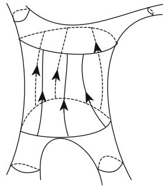

natural_image

Diagram of a human torso with curved and dashed lines indicating movement or force, no text or symbols present

Then $r _ { 0 } = i d$ ; and $r _ { 1 }$ maps $f ^ { - 1 } \left( [ - \infty , b ] \right)$ diffeomorphically into $f ^ { - 1 } \left( \left[ - \infty , a \right] \right)$ :

Notice that we used in an essential way that the function is proper to conclude that the vector field is complete. In fact, if we delete a single point from the region $f ^ { - 1 } \left( [ a , b ] \right)$ ; then the function still won’t have any critical values, but clearly the conclusion of the lemma is false.

We shall try to generalize this lemma to functions that are not even $C ^ { 1 }$ : To minimize technicalities we work exclusively with distance functions. There is, however, a more general theory for Lipschitz functions that could be used in this context (see [33]). Suppose $( M , g )$ is complete and $K \subset M$ a compact subset. Then the distance function

$$
r (x) = | x K | = \min \{| x p | \mid p \in K \}
$$

is proper. Wherever this function is smooth, we know that it has unit gradient and therefore is noncritical at such points. However, it might also have local maxima, and at such points we certainly wouldn’t want the function to be noncritical. To define the generalized gradient for such functions, we list all the possible values it could have (see also exercise 5.9.28 for more details on differentiability of distance functions). Define $\overline { { p q } }$ to be a choice of a unit speed segment from $p$ to $q ,$ , its initial velocity is $\overrightarrow { p q }$ , and $\overrightarrow { p q }$ the set of all such unit vectors $\overrightarrow { p q }$ . We can also replace q by a set K with the understanding that we only consider the segments from p to K of length $| p K |$ . In the case where r is smooth at x; we clearly have that $- \boldsymbol { \nabla } r = \Vec { x K }$ . At other points, $\xrightarrow [ x K ] { }$ might contain more vectors. We say that r is regular, or noncritical, at x if the set $\overrightarrow { \mathbfit { x K } }$ is contained in an open hemisphere of the unit sphere in $T _ { x } M$ : The center of any such hemisphere is then a possible averaged direction for the negative gradient of r at x: Stated differently, we have that r is regular at x if and only if there is a unit vector $v \in T _ { x } M$ such that $\angle \left( v , { \vec { x K } } \right) < \pi / 2$ for all ${ \vec { x K } } \in { \overrightarrow { x K } }$ . 2 † 2Clearly v is the center of such a hemisphere. We can quantify being regular by saying that r is ˛-regular at x if there exists $v \in T _ { x } M$ such that $\angle \left( v , { \vec { x K } } \right) < \alpha$ for all ${ \vec { x K } } \in { \overrightarrow { x K } }$ . Thus, r is regular at x if and only if it is 	=2-regular. Let $R _ { \alpha } \left( x , K \right) \subset T _ { x } M$ 2be the set of all such unit directions v at ˛-regular points x.

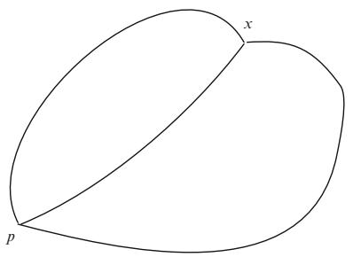

text_image

x
p

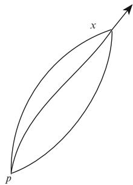

text_image

x
p

Fig. 12.2 Critical and Regular Points

Evidently, a point x is critical for r if the segments from K to x spread out at x; while it is regular if they more or less point in the same direction (see figure 12.2). It was Berger who first realized and showed that a local maximum must be critical in the above sense. Berger’s result is a consequence of the next proposition.

Proposition 12.1.2. Suppose $( M , g )$ and $r \left( x \right) = \left| x K \right|$ are as above. Then:

(1) $\xrightarrow [ x K ] { }$ is closed and hence compact for all x:   
(2) The set of ˛-regular points is open in M:   
(3) The set $R _ { \alpha } \left( x , K \right)$ is convex for all $\alpha \leq \pi / 2 .$ .   
(4) If U is an open set of ˛-regular points for r; then there is a unit vector field X on U such that $X | _ { x } \in R _ { \alpha } \left( x , K \right)$ for all $x \in U$ : Furthermore, if c is an integral curve for X and $s < t ,$ ; then

$$
\left| c (s) K \right| - \left| c (t) K \right| > \cos (\alpha) (t - s).
$$

Proof. (1) Let $\overline { { x q _ { i } } }$ be a sequence of unit speed segments from x to K with $\overrightarrow { x q _ { i } }$ converging to some unit vector $v \in T _ { x } M$ : Clearly, exp .tv/ is the limit of the segments $\overline { { x q _ { i } } }$ 2and therefore is a segment itself. Furthermore, since K is closed $\exp _ { x } \left( \left| x K \right| v \right) \in K$ :

j(2) Suppose $x _ { i } \to x .$ and $x _ { i }$ are not ˛-regular. We shall show that x is not ˛-regular. !This means that for any unit $v \in T _ { x } M$ there is some $\xrightarrow [ x K ] { }$ such that $\angle \left( v , { \vec { x } } \vec { K } \right) \geq$ ˛. So fix a unit $v \in T _ { x } M$ 2and choose a sequence $v _ { i } \in T _ { x _ { i } } M$ † converging to v: By assumption $\angle \left( v _ { i } , { \overrightarrow { x _ { i } K } } \right) \geq \alpha$ for some $\xrightarrow [ x _ { i } K ] { }$ 2. Now select a subsequence so that the unit vectors $\xrightarrow [ x _ { i } K ] { }$ converge to a $w \in T _ { x } M$ . Thus $\angle \left( v , w \right) \geq \alpha$ . Finally note that the segments ${ \overline { { x _ { i } K } } } = \exp _ { x _ { i } } { \Bigl ( } t { \overrightarrow { x _ { i } K } } { \Bigr ) } , t \in [ 0 , | x _ { i } K | ]$ must converge to the geodesic exp .tw/, $t \in [ 0 , | x K | ]$ which is then forced to be a segment from x to K.

(3) First observe that for each $w \in T _ { x } M$ , the open cone

$$
C _ {\alpha} (w) = \{v \in T _ {x} M \mid \angle (v, w) <   \alpha \}
$$

# 12.1 Critical Point Theory

is convex when $\alpha \leq \pi / 2$ . Then observe that $R _ { \alpha } \left( x , K \right)$ is the intersection of the cones $C _ { \alpha } \left( \overrightarrow { x K } \right) , \overrightarrow { x K } \in \overrightarrow { x K }$ and is therefore also convex.

(4) For each $p \in U$ select $v _ { p } \in R _ { \alpha } \left( p , K \right)$ and extend $v _ { p }$ to a unit vector field $V _ { p }$ : It 2 2follows from the proof of (2) that $V _ { p } \left( x \right) \in R _ { \alpha } \left( x , K \right)$ for x near $p .$ : We can then assume that $V _ { p }$ 2is defined on a neighborhood $U _ { p }$ on which it is a generalized gradient. Next select a locally finite collection $\left\{ U _ { i } \right\}$ of $U _ { p } \mathbf { s }$ and a corresponding partition of unity $\lambda _ { i }$ f g: Then property (3) tells us that the vector field $V = \sum { \lambda _ { i } V _ { i } }$ is nonzero. Define $X = { V } / { | V | }$ .

DKeep in mind that the flow of X should decrease distances to K so it is easier to consider r instead of r. Property (4) is clearly true at points where r is smooth, because in that case the derivative of $- \left( r \circ c \right) ( s ) = - \left| c \left( s \right) K \right|$ is

$$
g (X, - \nabla r) = \cos \angle (X, - \nabla r) = \cos \angle (X, \overrightarrow {x K}) > \cos (\alpha).
$$

Now observe that since $- r \circ c$ is Lipschitz continuous it is also absolutely continuous. In particular, $- r \circ c$ is almost everywhere differentiable and the  ıintegral of its derivative. It might, however, happen that $- r \circ c$ is differentiable at a point x where $\nabla r$  ıis not defined. To see what happens at such points we select a variation $\bar { c } \left( s , t \right)$ such that $t \ \mapsto \ \bar { c } \left( 0 , t \right)$ is a segment from K to $x ;$ $\begin{array} { r } { \overline { { c } } \left( s , 0 \right) = \bar { c } \left( 0 , 0 \right) \in \boldsymbol { K } ; \left| \frac { \partial \overline { { c } } } { \partial t } \left( s , t \right) \right| } \end{array}$ 7! Nis constant in t and hence equal to the length N D Nof the t-curves; and $\bar { c } \left( s , 1 \right) = c \left( s \right)$ is the integral curve for X through $x = c \left( 0 \right)$ /. Thus

$$
\begin{array}{l} \frac {1}{2} | (r \circ c) (s) | ^ {2} \leq \frac {1}{2} \left(\int_ {0} ^ {1} \left| \frac {\partial \bar {c}}{\partial t} \right| d t\right) ^ {2} \\ \leq \frac {1}{2} \int_ {0} ^ {1} \left| \frac {\partial \bar {c}}{\partial t} \right| ^ {2} d t \\ = E (\bar {c} _ {s}) \\ \end{array}
$$

with equality holding when $s = 0$ : In particular, the right-hand side is a support Dfunction for the left-hand side. Assuming that $r \circ c$ is differentiable at $s = 0$ we obtain

$$
\begin{array}{l} r (x) \frac {d (r \circ c)}{d s} | _ {s = 0} = \frac {d E}{d s} | _ {s = 0} \\ = g \left(\frac {\partial \bar {c}}{\partial t} (0, 1), \frac {\partial \bar {c}}{\partial s} (0, 1)\right) \\ = g \left(\frac {\partial \bar {c}}{\partial t} (0, 1), X\right) \\ = \left| \frac {\partial \bar {c}}{\partial t} (0, 1) \right| \cos \left(\angle \left(X, \frac {\partial \bar {c}}{\partial t}\right)\right) \\ \end{array}
$$

$$
\begin{array}{l} = - r (x) \cos \left(\angle \left(X, - \frac {\partial \bar {c}}{\partial t}\right)\right) \\ = - r (x) \cos (\angle (X, \overrightarrow {x K})). \\ \end{array}
$$

Thus

$$
\begin{array}{l} - \frac {d | c (s) K |}{d s} | _ {s = 0} = \cos (\angle (X, \overrightarrow {x K})) \\ > \cos \alpha . \\ \end{array}
$$

This proves the desired property.

We can now generalize the above retraction lemma.

Lemma 12.1.3 (Grove-Shiohama). Let $( M , g )$ and $r \left( x \right) \ = \ \left| x K \right|$ be as above. If all points in $r ^ { - 1 } \left( \left[ a , b \right] \right)$ are ˛-regular for $\alpha ~ < ~ \pi / 2 ,$ D j, then $r ^ { - 1 } \left( \left[ - \infty , a \right] \right)$ is homeomorphic to $r ^ { - 1 } \left( [ - \infty , b ] \right)$ ; and $r ^ { - 1 } \left( [ - \infty , b ] \right)$ 1deformation retracts onto $r ^ { - 1 } \left( \left[ - \infty , a \right] \right)$ :

Proof. The construction is similar to the first lemma. We can construct a compactly supported “retraction” vector field X such that the flow $F ^ { t }$ for X satisfies

$$
r (p) - r \left(F ^ {t} (p)\right) > t \cdot \cos (\alpha), t \geq 0 \text { if } p, F ^ {t} (p) \in r ^ {- 1} ([ a, b ]).
$$

For each $p \in r ^ { - 1 } \left( b \right)$ there is a first time $\begin{array} { r } { t _ { p } \le \frac { b - a } { \cos \alpha } } \end{array}$ for which $F ^ { t _ { p } } \left( p \right) \in r ^ { - 1 } \left( a \right)$ : The function $p \mapsto t _ { p }$   is continuous and thus we get the desired retraction

$$
\begin{array}{l} r _ {t}: r ^ {- 1} ([ - \infty , b ]) \rightarrow r ^ {- 1} ([ - \infty , b ]), \\ r _ {t} \left(p\right) = \left\{ \begin{array}{l l} p & \text { if } r \left(p\right) \leq a \\ F ^ {t \cdot t _ {p}} \left(p\right) & \text { if } a \leq r \left(p\right) \leq b \end{array} \right.. \\ \end{array}
$$

Remark 12.1.4. The original construction of Grove and Shiohama actually shows something stronger, the distance function can be approximated by smooth functions without critical points on the same region the distance function had no critical points (see [56].) This has also turned out to be important in certain contexts.

The next corollary is our first simple consequence of this lemma.

Corollary 12.1.5. Suppose K is a compact submanifold of a complete Riemannian manifold $( M , g )$ and that the distance function $| x K |$ is regular everywhere on $M - K$ : j jThen M is diffeomorphic to the normal bundle of K in M: In particular, if $K = \{ p \}$ ; then M is diffeomorphic to $\mathbb { R } ^ { n }$ :

Proof. We know that M K admits a vector field X such that $\vert x K \vert$ increases   j jalong the integral curves for X. Moreover, near K the distance function is smooth, and therefore X can be assumed to be equal to $- { \vec { x } } { \vec { K } }$ near K: Consider the normal exponential map $\exp ^ { \perp } \ : \ T ^ { \perp } K \ \to \ M$ . It follows from corollary 5.5.3 that this W !gives a diffeomorphism from a neighborhood of the zero section in $T ^ { \perp } K$ onto a neighborhood of K: Also, the curves $t \mapsto \exp \left( t v \right)$ for small t coincide with integral 7!curves for X. In particular, for each $v \in T ^ { \perp } K$ there is a unique integral curve for X denoted $c _ { v } ( t ) : ( 0 , \infty )  M$ 2such that $\begin{array} { r } { \operatorname* { l i m } _ { t  0 } \dot { c } _ { v } ( t ) = v } \end{array}$ . Now define our diffeomorphism $F \colon T ^ { \perp } K \to M$ !by

$$
F \left(0 _ {p}\right) = p \text {   for   the   origin   in   } T _ {p} ^ {\perp} K,
$$

$$
F (t v) = c _ {v} (t) \text {   where   } | v | = 1.
$$

This clearly defines a differentiable map. For small t this is just the exponential map. The map is one-to-one since integral curves for X can’t intersect. The integral curves for X must leave all of the sublevels of the proper function xK . Consequently they are defined for all $t > 0$ j j. This shows that F is onto. Finally, as it is a diffeomorphism onto a neighborhood of K by the normal exponential map and the flow of a vector field always acts by local diffeomorphisms we see that it has nonsingular differential everywhere.

# 12.2 Distance Comparison

In this section we introduce the geometric results that will enable us to check that various distance functions are noncritical. This obviously requires some sort of angle comparison. The most important step in this direction is supplied by the Toponogov comparison theorem. The proof we present is probably the simplest available and is based upon an idea by H. Karcher (see [32]).

Some preparations are necessary. Let $( M , g )$ be a Riemannian manifold. We define two very natural geometric objects:

Hinge: A hinge consists of two segments $\overline { { p x } }$ and $\overline { { x y } }$ that form an interior angle ˛ at x $, \mathrm { i . e . , } \angle \left( \overrightarrow { x p } , \overrightarrow { x y } \right) = \alpha$ if the specified directions are tangent to the given segments. †See also figure 12.3.

Triangle: A triangle consists of three segments $\overline { { x y } } , \ \overline { { y z } } , \ \overline { { z x } }$ that meet pairwise at the three vertices x; y; z.

In both definitions one could use geodesics instead of segments. It is then possible to have degenerate hinges or triangles where some vertices coincide without the joining geodesics being trivial. This will be useful in a few situations. In figure 12.4 we have depicted a triangle consisting of segments, and a degenerate triangle where one of the sides is a geodesic loop and two of the vertices coincide.

Fig. 12.3 A Hinge   
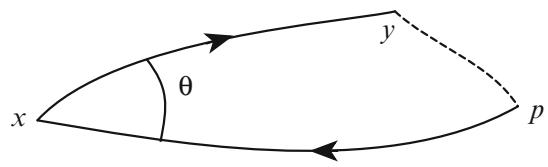

text_image

x
θ
y
p

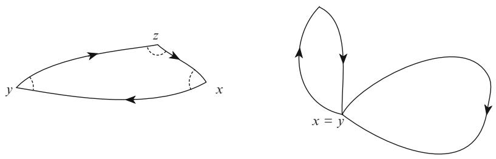  
Fig. 12.4 Triangles

Given a hinge or triangle, we can construct comparison hinges or triangles in the constant curvature spaces $S _ { k } ^ { n }$ :

Lemma 12.2.1. Suppose $( M , g )$ is complete and has sec $\geq k$ : Then for each hinge or triangle in M we can find a comparison hinge or triangle in $S _ { k } ^ { n }$ where the corresponding segments have the same length and the angle is the same or all corresponding segments have the same length.

Proof. Note that when $k > 0$ , then corollary 6.3.2 implies diamM $\leq \pi / \sqrt { k } =$ diamSn : Thus, all segments have length $\leq \pi / { \sqrt { k } } .$ :

The hinge case: We have segments $\overline { { p x } }$ and $\overline { { x y } }$ that form an interior angle $\alpha =$ $\angle \left( \overrightarrow { x p } , \overrightarrow { x y } \right)$ at x. In the space form first choose a segment $\overline { { p _ { k } x _ { k } } }$ Dof length px . At $x _ { k }$ we can then choose a direction $\overrightarrow { x _ { k } y _ { k } }$ so that $\mathcal { L } \left( \overrightarrow { x _ { k } p _ { k } } , \overrightarrow { x _ { k } y _ { k } } \right) = \alpha$ j j. Then along the unique geodesic going in this direction select $y _ { k }$ so that $\left| x _ { k } y _ { k } \right| = \left| x y \right|$ . This is the desired comparison hinge.

The triangle case: First, pick $x _ { k }$ and $y _ { k }$ such that $| x y | = | x _ { k } y _ { k } |$ . Then, consider the two distance spheres $\partial B \left( { x } _ { k } , \vert { x } z \vert \right)$ and $\partial B \left( y _ { k } , \left| y z \right| \right)$ j D j j. Since all possible triangle j j j jinequalities between x; y; z hold, these distance spheres are nonempty and intersect. Let $z _ { k }$ be any point in the intersection.

To be honest here, we must use Cheng’s diameter theorem 7.2.5 in case any of the distances is $\pi / { \sqrt { k } }$ : In this case there is nothing to prove as $( M , g ) = S _ { k } ^ { n }$ :

The Toponogov comparison theorem can be stated as follows.

Theorem 12.2.2 (Toponogov, 1959). Let $( M , g )$ be a complete Riemannian manifold with sec $\geq k$ :

Hinge Version: Given any hinge with vertices $p , x , y \in M$ forming an angle ˛ at $x ,$ it follows, that for any comparison hinge in $S _ { k } ^ { n }$ 2with vertices $p _ { k } , x _ { k } , y _ { k }$ we have: $| p y | \leq | p _ { k } y _ { k } |$ (see also figure 12.5).

j  j jTriangle Version: Given any triangle in M; it follows that the interior angles are no smaller than the corresponding interior angles for a comparison triangle in $S _ { k } ^ { n }$ .

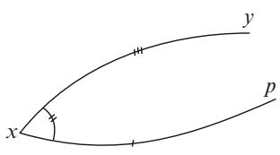

text_image

x
y
p

Fig. 12.5 Hinge Comparison   
Fig. 12.6 Distance from a point to a line

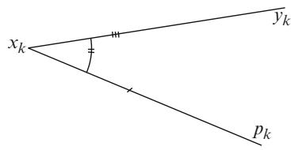

text_image

x_k
y_k
p_k

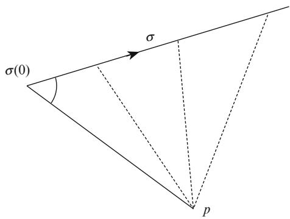

text_image

σ(0)
σ
p

The proof requires a little preparation. First, we claim that the hinge version implies the triangle version. This follows from the law $o f$ cosines in constant curvature. This law shows that if we have $p , x , y \in S _ { k } ^ { n }$ and increase the distance $| p \}$ 2while keeping px and xy fixed, then the angle at x increases as well. For j j j j j jsimplicity, we consider the cases where $k = 1 , 0 , - 1$ .

Proposition 12.2.3 (Law of Cosines). Let a triangle be given in $S _ { k } ^ { n }$ with side lengths a; b; c: If ˛ denotes the angle opposite to a; then

$$
k = 0: a ^ {2} = b ^ {2} + c ^ {2} - 2 b c \cos \alpha .
$$

$$
k = - 1: \cosh a = \cosh b \cosh c - \sinh b \sinh c \cos \alpha .
$$

$$
k = 1: \cos a = \cos b \cos c + \sin b \sin c \cos \alpha .
$$

Proof. The general setup is the same in all cases. Suppose that a point $p \in S _ { k } ^ { n }$ and a unit speed segment $\sigma : [ 0 , c ] \to S _ { k } ^ { n }$ 2are given. The goal is to understand the function $| \sigma \left( t \right) p | = r \left( \sigma \left( t \right) \right)$ W !(see also figure 12.6). As in corollary 4.3.4 and theorem 5.7.5 we j j Dwill use the modified distance function $f _ { k }$ . The Hessian is calculated in example 4.3.2 to be Hes ${ \sf s f } _ { k } = ( 1 - k f _ { k } ) g$ . If we restrict this distance function to $\sigma \left( t \right)$ , then we Dobtain a function $\rho \left( t \right) = f _ { k } \circ \sigma \left( t \right)$ with derivatives

$$
\dot {\rho} (t) = g (\dot {\sigma}, \nabla f _ {k}),
$$

$$
\ddot {\rho} (t) = (1 - k \rho (t)).
$$

We now split up into the three cases.

Case $k = 0 \mathrm { : }$ We have more explicitly

$$
\rho (t) = \frac {1}{2} (r \circ \sigma (t)) ^ {2}
$$

and

$$
\begin{array}{l} \dot {\rho} (t) = g \left(\dot {\sigma}, \nabla \frac {1}{2} r ^ {2}\right), \\ \ddot {\rho} (t) = 1. \\ \end{array}
$$

So if we define $b = \vert p \sigma \left( 0 \right) \vert$ and ˛ as the interior angle between  and the line joining p with $\sigma \left( 0 \right)$ D j ; then

$$
\cos (\pi - \alpha) = - \cos \alpha = g (\dot {\sigma} (0), \nabla r).
$$

After integration of $\ddot { \rho } = 1$ ; we get

$$
\begin{array}{l} \rho (t) = \rho (0) + \dot {\rho} (0) \cdot t + \frac {1}{2} t ^ {2} \\ = \frac {1}{2} b ^ {2} - b \cdot \cos \alpha \cdot t + \frac {1}{2} t ^ {2}. \\ \end{array}
$$

Now set t  c and define $a = \left| p \sigma \left( c \right) \right|$ , then

$$
\frac {1}{2} a ^ {2} = \frac {1}{2} b ^ {2} - b \cdot c \cdot \cos \alpha + \frac {1}{2} c ^ {2},
$$

from which the law of cosines follows.

Case k 1: This time

$$
\rho (t) = \cosh (r \circ \sigma (t)) - 1
$$

with

$$
\begin{array}{l} \dot {\rho} (t) = \sinh (r \circ \sigma (t)) g (\nabla r, \dot {\sigma}), \\ \ddot {\rho} (t) = \rho (t) + 1 = \cosh (r \circ \sigma (t)). \\ \end{array}
$$

As before, we have $b = \vert p \sigma \left( 0 \right) \vert$ ; and the interior angle satisfies

$$
\cos (\pi - \alpha) = - \cos \alpha = g (\dot {\sigma} (0), \nabla r).
$$

Thus, we must solve the initial value problem

$$
\begin{array}{l} \ddot {\rho} - \rho = 1, \\ \rho (0) = \cosh (b) - 1, \\ \dot {\rho} (0) = - \sinh (b) \cos \alpha . \\ \end{array}
$$

# 12.2 Distance Comparison

The general solution is

$$
\begin{array}{l} \rho (t) = C _ {1} \cosh t + C _ {2} \sinh t - 1 \\ = (\rho (0) + 1) \cosh t + \dot {\rho} (0) \sinh t - 1. \\ \end{array}
$$

So if we let $t = c$ and $a = \left| p c \left( c \right) \right|$ as before, we arrive at

$$
\cosh a - 1 = \cosh b \cosh c - \sinh b \sinh c \cos \alpha - 1,
$$

which implies the law of cosines again.

Case $k = 1$ : This case is completely analogous to $k = - 1$ : Now

$$
\rho = 1 - \cos (r \circ \sigma (t))
$$

and

$$
\begin{array}{l} \ddot {\rho} + \rho = 1, \\ \rho (0) = 1 - \cos (b), \\ \dot {\rho} (0) = - \sin b \cos \alpha . \\ \end{array}
$$

Then,

$$
\begin{array}{l} \rho (t) = C _ {1} \cos t + C _ {2} \sin t + 1 \\ = (\rho (0) - 1) \cos t + \dot {\rho} (0) \sin t + 1, \\ \end{array}
$$

and consequently

$$
1 - \cos a = - \cos b \cos c - \sin b \sin c \cos \alpha + 1,
$$

which implies the law of cosines.

The proof of the law of cosines suggests that when working in space forms it is easier to work with a modified distance function, the main advantage being that the Hessian is much simpler.

Lemma 12.2.4 (Hessian Comparison). Let $( M , g )$ be a complete Riemannian manifold, $p \in M$ ; and $r \left( x \right) = \left| x p \right|$ : If sec $M \geq k$ ; then the Hessian of r satisfies

$$
\operatorname{Hess} f _ {k} \leq (1 - k f _ {k}) g
$$

in the support sense everywhere.

Proof. We start by noting that this estimate was proven in theorem 6.4.3 when the distance function is smooth. The proof can then be finished in the same way as lemma 7.1.9.

We are ready to prove the hinge version of Toponogov’s theorem. The proof is divided into the three cases: $k = 0 , - 1$ ; 1 with the same set-up. Let $p \in M$ and a geodesic $c : [ 0 , L ] \to M$ D be given. Correspondingly, select $\bar { p } \in S _ { k } ^ { n }$ 2and a segment $\bar { c } : [ 0 , L ] \to S _ { k } ^ { n }$ ! N 2. With the appropriate initial conditions, we claim that

$$
\left| p c (t) \right| \leq \left| \bar {p} \bar {c} (t) \right|.
$$

If we assume that $| x p |$ is smooth at $c \left( 0 \right)$ : Then the initial conditions are

$$
\left| p c (0) \right| \leq \left| \bar {p} \bar {c} (0) \right|,
$$

$$
g (\nabla r, \dot {c} (0)) \leq g _ {k} \left(\nabla \bar {r}, \frac {d}{d t} \bar {c} (0)\right).
$$

In case r is not smooth at $c \left( 0 \right)$ ; we can just slide c down along a segment joining $p$ with $c \left( 0 \right)$ and use a continuity argument. This also shows that we can assume the stronger initial condition

$$
\left| p c (0) \right| <   \left| \bar {p} \bar {c} (0) \right|.
$$

In figure 12.7 we have shown how c can be changed by moving it down along a segment joining $p$ and $c \left( 0 \right)$ : We have also shown how the angles can be slightly decreased. This will be important in the last part of the proof. Note that we could instead have used exercise 5.9.28 to obtain these initial values as the restriction of $r$ to c always has one sided derivatives.

Proof. Case $k = 0 \colon$ : We consider the modified functions

$$
\rho (t) = \frac {1}{2} (r \circ c (t)) ^ {2},
$$

$$
\bar {\rho} (t) = \frac {1}{2} (\bar {r} \circ \bar {c} (t)) ^ {2}.
$$

Fig. 12.7 Hinge adjustment and comparison hinge   
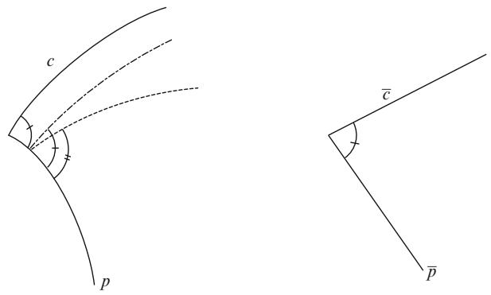

text_image

c
p
¯c
¯p

# 12.2 Distance Comparison

For small t these functions are smooth and satisfy

$$
\rho (0) <   \bar {\rho} (0),
$$

$$
\dot {\rho} (0) \leq \dot {\bar {\rho}} (0).
$$

Moreover, for the second derivatives we have

$\ddot { \rho } \leq 1$ in the support sense,

$$
\ddot {\bar {\rho}} = 1,
$$

whence the difference $\psi \left( t \right) = \bar { \rho } \left( t \right) - \rho \left( t \right)$ satisfies

$$
\psi (0) > 0,
$$

$$
\dot {\psi} (0) \geq 0,
$$

$\ddot { \psi } \left( t \right) \geq 0$ in the support sense.

This shows that $\psi$ is a convex function that is positive and increasing for small t. Thus, it is increasing and positive for all t: This proves the hinge version.

Case $k = - 1 \colon$ : Consider

$$
\rho (t) = \cosh r \circ c (t) - 1,
$$

$$
\bar {\rho} (t) = \cosh \bar {r} \circ \bar {c} (t) - 1.
$$

Then

$$
\rho (0) <   \bar {\rho} (0),
$$

$$
\dot {\rho} (0) \leq \dot {\bar {\rho}} (0),
$$

$\ddot { \rho } \leq \rho + 1$ in the support sense,

$$
\ddot {\bar {\rho}} = \bar {\rho} + 1.
$$

The difference $\psi = \bar { \rho } - \rho$ satisfies

$$
\psi (0) > 0,
$$

$$
\dot {\psi} (0) \geq 0,
$$

$\ddot { \psi } \left( t \right) \geq \psi \left( t \right)$ in the support sense.

The first condition again implies that $\psi$ is positive for small t: The last condition shows that as long as $\psi$ is positive, it is also convex. The second condition then shows that $\psi$ is increasing for small t. It follows that $\psi$ cannot have a positive maximum as that violates convexity. Thus $\psi$ keeps increasing.

Case $k = 1 \mathrm { : }$ : This case is considerably harder. We begin as before by defining

$$
\rho (t) = 1 - \cos (r \circ c (t)),
$$

$$
\bar {\rho} (t) = 1 - \cos (\bar {r} \circ \bar {c} (t))
$$

and observe that the difference $\psi = \bar { \rho } - \rho$ satisfies

$$
\psi (0) > 0,
$$

$$
\dot {\psi} (0) \geq 0,
$$

$\ddot { \psi } \left( t \right) \geq - \psi \left( t \right)$ in the support sense.

That, however, looks less promising. Even though the function starts out being positive, the last condition only gives a negative lower bound for the second derivative. This is where a standard trick from Sturm-Liouville theory will save us. For that to work well it is best to assume $\dot { \psi } \left( 0 \right) > 0$ . Thus, another little continuity argument is necessary as we need to perturb c again to decrease the interior angle. If the interior angle is positive, this can clearly be done, and in the case where this angle is zero the hinge version is trivially true anyway. We compare $\psi$ to a new function $\zeta \left( t \right)$ defined by

$$
\ddot {\zeta} = - (1 + \varepsilon) \zeta ,
$$

$$
\zeta (0) = \psi (0) > 0,
$$

$$
\dot {\zeta} (0) = \dot {\psi} (0) > 0.
$$

For small t we have

$$
\begin{array}{l} \frac {d ^ {2}}{d t ^ {2}} (\psi (t) - \zeta (t)) \geq - \psi (t) + (1 + \varepsilon) \zeta (t) \\ = \zeta (t) - \psi (t) + \varepsilon \zeta (t) \\ > 0. \\ \end{array}
$$

This implies that $\ r ( t ) - \xi \left( t \right) \ge 0$ for small t: To extend this to the interval where $\zeta \left( t \right)$ is positive, i.e., for

$$
t <   \frac {\pi - \arctan \left(\frac {\psi (0) \cdot \sqrt {1 + \varepsilon}}{\dot {\psi} (0)}\right)}{\sqrt {1 + \varepsilon}},
$$

consider the quotient $\psi / \zeta$ . This ratio satisfies

$$
\frac {\psi}{\zeta} (0) = 1,
$$

# 12.3 Sphere Theorems

$$
\frac {\psi}{\zeta} (t) \geq 1 \text {   for   small   } t.
$$

Should the ratio dip below 1 before reaching the end of the interval it would have a positive local maximum at some $t _ { 0 }$ : At this point we can use support functions $\psi _ { \delta }$ for $\psi$ from below, and conclude that also $\psi _ { \delta } / \zeta$ has a local maximum at $t _ { 0 }$ : Thus, we have

$$
\begin{array}{l} 0 \geq \frac {d ^ {2}}{d t ^ {2}} \left(\frac {\psi_ {\delta}}{\zeta}\right) (t _ {0}) \\ = \frac {\ddot {\psi} _ {\delta} (t _ {0})}{\zeta (t _ {0})} - 2 \frac {\dot {\zeta} (t _ {0})}{\zeta (t _ {0})} \cdot \frac {d}{d t} \left(\frac {\psi_ {\delta}}{\zeta}\right) (t _ {0}) - \frac {\psi_ {\delta} (t _ {0})}{\zeta^ {2} (t _ {0})} \ddot {\zeta} (t _ {0}) \\ \geq \frac {- \psi_ {\delta} (t _ {0}) - \delta}{\zeta (t _ {0})} + \frac {\psi_ {\delta} (t _ {0})}{\zeta (t _ {0})} (1 + \varepsilon) \\ = \frac {\varepsilon \cdot \psi_ {\delta} (t _ {0}) - \delta}{\zeta (t _ {0})}. \\ \end{array}
$$

But this becomes positive as $\delta  0$ ; since we assumed $\psi _ { \delta } \left( t _ { 0 } \right) > 0$ . Thus we have a !contradiction. Next, we can let $\varepsilon  0$ and finally, let $\psi ( 0 )  0$ to get the desired estimate for all $t \leq \pi$ !using continuity.

Remark 12.2.5. Note that we never really use in the proof that we work with segments. The only thing that must hold is that the geodesics in the space form are segments. For $k \leq 0$ this is of course always true. When $k > 0$ this means that the geodesic must have length $\leq \pi / { \sqrt { k } } .$ . This was precisely the important condition in the last part of the proof.

# 12.3 Sphere Theorems

Our first applications of the Toponogov theorem are to the case of positively curved manifolds. Using scaling, we can assume throughout this section that we work with a closed Riemannian n-manifold $( M , g )$ with sec $\geq 1$ : For such spaces we have established:

(1) diam $( M , g ) \leq \pi$ , with equality holding only if $M = S ^ { n } \left( 1 \right)$ :   
(2) If n is odd, then M is orientable.   
(3) If n is even and M is orientable, then M is simply connected and inj $( M ) ~ \geq$ $\pi / \sqrt { \operatorname* { m a x } \operatorname { s e c } }$ :   
(4) If M is simply connected and max sec $< 4$ ; then inj $( M ) \geq \pi / { \sqrt { \mathrm { m a x } \sec } }$ :   
(5) If M is simply connected and max sec < 4; then M is homotopy equivalent to a sphere.

We can now prove the celebrated Rauch-Berger-Klingenberg sphere theorem, also known as the quarter pinched sphere theorem. Note that the conclusion is stronger than in corollary 6.5.6. The part of the proof presented below is also due the Berger.

Theorem 12.3.1. If M is a simply connected closed Riemannian manifold with $1 \leq$ sec $\leq 4 - \delta$ ; then M is homeomorphic to a sphere.

Proof. We have shown that the injectivity radius is $\ge \pi / \sqrt { 4 - \delta }$ . Thus, we have large discs around every point in M: Select two points $p , q \in M$ such that $| p q | = \dim M$ and note that $\mathrm { d i a m } M \geq \mathrm { i n j } M > \pi / 2$ 2. We claim that every point $x \in M$ j Dlies in one of the two balls $B \left( p , \pi / { \sqrt { 4 - \delta } } \right)$ ; or $B \left( q , \pi / { \sqrt { 4 - \delta } } \right)$ 2; and thus M is covered by two discs.  This certainly makes M look like a sphere as it is the union of two discs. Below we construct an explicit homeomorphism to the sphere in a more general setting.

Fix $x \in M$ and consider the triangle with vertices $p , x , q . \mathrm { H } .$ , for instance, $| x q | >$ $\pi / 2$ 2, then we claim that $| p x | < \pi / 2$ . First, observe that since $q$ j jis at maximal distance from $p ,$ j j; it must follow that q cannot be a regular point for the distance function to $p .$ : Therefore, given a segment xq there is a segment $\overline { { p q } }$ such that the interior angle at $q$ satisfies $\alpha = \angle \left( \overrightarrow { q x } , \overrightarrow { q p } \right) \leq \pi / 2$ . The hinge version of Toponogov’s theorem implies

$$
\begin{array}{l} \cos | p x | \geq \cos | x q | \cos | p q | + \sin | x q | \sin | p q | \cos \alpha \\ \geq \cos | x q | \cos | p q |. \\ \end{array}
$$

Now, both $| x q | , | p q | > \pi / 2$ , so the left-hand side is positive. This implies that $| p x | <$ < $\pi / 2$ j j j jas desired (see also figure 12.8 for the picture on the comparison space).

Michaleff and Moore in [73] proved a version of this theorem for closed simply connected manifolds that only have positive isotropic curvature (see exercise 3.4.17 and also section 9.4.5). Since quarter pinching implies positive complex sectional curvature and in particular positive isotropic curvature this result is stronger. In fact more recently Brendle and Schoen in [20] have shown that manifolds with positive complex sectional curvature admit metrics with constant curvature. This result uses the Ricci flow.

Fig. 12.8 Spherical hinge with long sides   
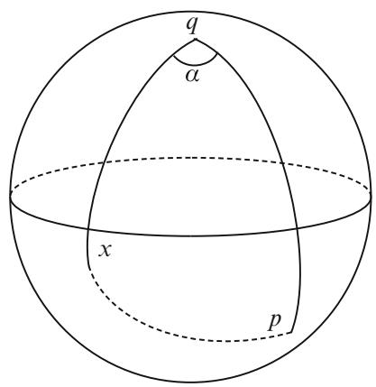

text_image

q
a
x
p

Note that the above theorem does not say anything about the non-simply connected situation. Thus we cannot conclude that such spaces are homeomorphic to spaces of constant curvature. Only that the universal covering is a sphere. The proof in [20], however, does not depend on the fundamental group and thus shows that strictly quarter pinched manifolds admit constant curvature metrics.

The above proof suggests that the conclusion of the theorem should hold as long as the manifold has large diameter. This is the content of the next theorem. This theorem was first proved by Berger for simply connected manifolds by using Toponogov’s theorem to show that there is a point where all geodesic loops have length $> \pi$ and then appealing to the proof of theorem 6.5.4. The present version is known as the Grove-Shiohama diameter sphere theorem. It was for the purpose of proving this theorem that Grove and Shiohama introduced critical point theory.

Theorem 12.3.2 (Berger, 1962 and Grove-Shiohama, 1977). $H ( M , g )$ is a closed Riemannian manifold with sec $\geq 1$ and $\mathrm { d i a m } > \pi / 2$ , then M is homeomorphic to a sphere.

Proof. We first give Berger’s index estimation proof that follows his index proof of the quarter pinched sphere theorem. The goal is to find $p \in M$ such that all geodesic loops at $p$ have length $> \ \pi$ 2and then finish by using the proof of theorem 6.5.4. Select $p , q \in M$ such that $| p q | = \mathrm { d i a m } M > \pi / 2$ . We claim that $p$ has the desired 2 j j Dproperty. Supposing otherwise we get a geodesic loop $c : [ 0 , 1 ] \to M$ based at $p$ of length $\leq \pi . \operatorname { A s } p$ is at maximal distance from $q$ W !we can find a segment ${ \overline { { q p } } } ,$ , such that the hinge spanned by $\overline { { p q } }$ and $c$ has interior angle $\leq \pi / 2$ . While $c$ is not a segment it is sufficiently short that the hinge version of Toponogov’s theorem still holds for the degenerate hinge with sides ${ \overline { { q p } } } .$ , c and angle $\alpha \leq \pi / 2$ at $p$ (see also Fig. 12.9, where we included two geodesics from $p$ to $q )$ . Thus

$$
\begin{array}{l} 0 > \cos | p q | \\ \geq \cos | p q | \cos L (c) + \sin | p q | \sin L (c) \cos \alpha \\ \geq \cos | p q | \cos L (c). \\ \end{array}
$$

This is clearly not possible unless $L \left( c \right) = 0$ :

DNext we give the Grove-Shiohama proof. Fix $p , q \in M$ with $| p q | = \mathrm { d i a m } M > \pi / 2$ . The claim is that the distance function from $p$ 2only has $q$ j Das a critical point (Fig. 12.10). To see this, let $x \in M - \{ p , q \}$ and $\alpha$ be the interior angle between any two segments $\overline { { x p } }$ and ${ \overline { { x q } } } .$ 2  f g. If we suppose that $\alpha \leq \pi / 2$ , then the hinge version of Toponogov’s theorem implies

$$
\begin{array}{l} 0 > \cos | p q | \\ \geq \cos | p x | \cos | x q | + \sin | p x | \sin | x q | \cos \alpha \\ \geq \cos | p x | \cos | x q |. \\ \end{array}
$$

Fig. 12.9 Degenerate hinge where one side is a loop   
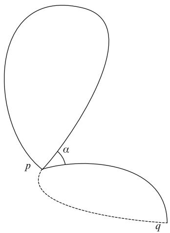

text_image

p
α
q

Fig. 12.10 Spherical hinge   
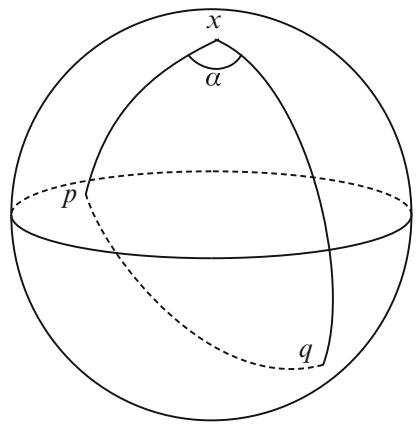

text_image

x
α
p
q

But then cos $| p x |$ and cos xq have opposite signs. If, for example, cos $| p x | > 0$ j jthen it follows that cos $\vert p q \vert ~ > ~ \cos \vert x q \vert$ , which implies $| x q | > | p q | = \mathrm { d i a m } { \cal M }$ : j j j j j j j j DThus we have arrived at a contradiction (see also figure 12.10 for the picture on the comparison space).

We construct a vector field X that is the gradient field for $x \mapsto \left| x p \right|$ near p and the negative of the gradient field for $x \mapsto | x q |$ 7! j jnear q: Furthermore, the distance to $p$ 7! j jincreases along integral curves for X: For each $x \in M - \{ p , q \}$ there is a unique integral curve $c _ { x } \left( t \right)$ 2  f gfor X through x: Suppose that x varies over a small distance sphere $\partial B \left( p , \varepsilon \right)$ that is diffeomorphic to $S ^ { n - 1 }$ : After time $t _ { x }$ this integral curve will hit the distance sphere @B $( q , \varepsilon )$ which can also be assumed to be diffeomorphic to $S ^ { n - 1 }$ : The function $x \mapsto t _ { x }$ is continuous and in fact smooth as both distance spheres 7!are smooth submanifolds. Thus we have a diffeomorphism defined by

$$
\partial B (p, \varepsilon) \times [ 0, 1 ] \rightarrow M - (B (p, \varepsilon) \cup B (q, \varepsilon)),
$$

$$
(x, t) \mapsto c _ {x} (t \cdot t _ {x}).
$$

Gluing this map together with the two discs $B \left( p , \varepsilon \right)$ and $B \left( q , \varepsilon \right)$ then yields a continuous bijection $M ~  ~ S ^ { n }$ : Note that the construction does not guarantee !smoothness of this map on $\partial B \left( p , \varepsilon \right)$ and $\partial B \left( q , \varepsilon \right)$ .

Aside from the fact that the conclusions in the above theorems could possibly be strengthened to diffeomorphism, we have optimal results. Complex projective space has curvatures in Œ1; 4 and diameter $\pi / 2$ and the real projective space has constant curvature 1 and diameter $\pi / 2$ . If one relaxes the conditions slightly, it is, however, still possible to say something.

Theorem 12.3.3 (Brendle-Schoen 2008 and Petersen-Tao 2009). Let $( M , g )$ be a simply connected of dimension n. There is $\varepsilon \left( n \right) > 0$ such that $i f 1 \leq \sec \leq$ $4 + \varepsilon ,$ , then M is diffeomorphic to a sphere or one of the projective spaces $\mathbb { C P } ^ { n / 2 }$ ; $\mathbb { H P } ^ { n / 4 } , \mathbb { O P } ^ { 2 }$ :

The spaces $\mathbb { C P } ^ { n / 2 } , \mathbb { H P } ^ { n / 4 }$ ; or $\mathbb { O P } ^ { 2 }$ are known as the compact rank 1 symmetric spaces (CROSS). The quaternionic projective space is a quaternionic generalization of complex projective space $\mathbb { H } \mathbb { P } ^ { m } = S ^ { 4 m + 3 } / S ^ { 3 }$ ; but the octonion plane is a bit more exotic: $\mathrm { F } _ { 4 } / \mathrm { S p i n } \left( 9 \right) = \mathbb { O P } ^ { 2 }$ D(see also chapter 10 for more on symmetric spaces Dspaces). The theorem as stated was proven in [87] and uses convergence theory and the Ricci flow. It relies on a new rigidity result by Brendle and Schoen (see [19]) that generalizes an older result by Berger and several subtle injectivity radius estimates (see also section 6.5.1 for a discussion on this).

For the diameter situation we have:

Theorem 12.3.4 (Grove-Gromoll, 1987 and Wilking, 2001). $I f \left( M , g \right)$ is closed and satisfies $\sec \geq 1 , \dim \geq \pi / 2$ , then one of the following cases holds:

(1) M is homeomorphic to a sphere.   
(2) M is isometric to a finite quotient $S ^ { n } \left( 1 \right) / \Gamma$ ; where the action of  is reducible (has an invariant subspace).   
(3) M is isometric to one of CPm; HPm; or CPm=Z2 for m odd.   
(4) M is isometric to $\mathbb { O P } ^ { 2 }$ :

Grove and Gromoll settled all but part (4), where they only showed that M had to have the cohomology ring of $\mathbb { O P } ^ { 2 }$ : It was Wilking who finally settled this last case (see [104]).

# 12.4 The Soul Theorem

The idea behind the soul theorem is a similar result by Cohn-Vossen for convex surfaces that are complete and noncompact. Such surfaces must contain a core or soul that is either a point or a planar convex circle. In the case of a point the surface is diffeomorphic to a plane. In the case of a circle the surface is isometric to the generalized cylinder over the circle.

Theorem 12.4.1 (Gromoll-Meyer, 1969 and Cheeger-Gromoll, 1972). $I f \left( M , g \right)$ is a complete noncompact Riemannian manifold with sec $\geq 0$ ; then M contains a soul $S \subset M .$ . The soul S is a closed totally convex submanifold and M is diffeomorphic to the normal bundle over S: Moreover, when sec $> 0$ ; the soul is a point and M is diffeomorphic to $\mathbb { R } ^ { n }$ :

The history is briefly that Gromoll-Meyer first showed that if sec $> 0$ ; then M is diffeomorphic to $\mathbb { R } ^ { n }$ : Soon after, Cheeger-Gromoll established the full theorem. The Gromoll-Meyer theorem is in itself remarkable.

We use critical point theory to establish this theorem. The problem lies in finding the soul. When this is done, it will be easy to see that the distance function to the soul has only regular points, and then we can use the results from the first section.

Before embarking on the proof, it might be instructive to consider the following less ambitious result.

Lemma 12.4.2 (Gromov’s critical point estimate, 1981). $I f \left( M , g \right)$ is a complete open manifold of nonnegative sectional curvature, then for every $p \in M$ the distance function xp has no critical points outside some ball $B \left( p , R \right)$ 2 : In particular, M must j jhave the topology of a compact manifold with boundary.

Proof. Assume we a critical point x for $| x p |$ and that y is chosen so that $\angle \left( \overrightarrow { p x } , \overrightarrow { p y } \right) \leq \pi / 3$ j j. The hinge version of Toponogov’s theorem implies that

$$
\begin{array}{l} | x y | ^ {2} \leq | p y | ^ {2} + | x p | ^ {2} - 2 | p y | | x p | \cos {\frac {\pi}{3}} \\ = | p y | ^ {2} + | x p | ^ {2} - | p y | | x p |. \\ \end{array}
$$

Next use that x is critical for $p$ to select segments $\overline { { p x } }$ and $\overline { { x y } }$ that form an angle $\leq \pi / 2$ at x. Then use the hinge version again to conclude

$$
\begin{array}{l} | p y | ^ {2} \leq | x p | ^ {2} + | x y | ^ {2} \\ \leq | x p | ^ {2} + | p y | ^ {2} + | x p | ^ {2} - | p y | | x p | \\ = 2 | x p | ^ {2} + | p y | ^ {2} - | p y | | x p |. \\ \end{array}
$$

This forces $\left| p y \right| \leq 2 \left| x p \right|$ .

j j  j jNow observe that there is a fixed bound on the number of unit vectors at $p$ that mutually form an angle $> \pi / 3$ . Specifically, use that balls of radius $\pi / 6$ around these unit vectors are disjoint inside the unit sphere and note that

$$
\frac {v (n - 1 , 1 , \pi)}{v (n - 1 , 1 , \frac {\pi}{6})} \leq \frac {v (n - 1 , 0 , \pi)}{v (n - 1 , 0 , \frac {\pi}{6})} \leq 6 ^ {n - 1}.
$$

Finally, we conclude that there can be at most $6 ^ { n - 1 }$ critical points $x _ { i }$ for $| x p |$ such that $\left| x _ { i + 1 } p \right| > 2 \left| x _ { i } p \right|$ j jfor all i. This shows, in particular, that the distance function $| x p |$ j C j j jhas no critical points outside some large ball $B \left( p , R \right)$ /.

The proof of the soul theorem depends on understanding what it means for a submanifold and more generally a subset to be totally convex. The notion is similar to being totally geodesic. A subset $A \subset M$ of a Riemannian manifold is said to be totally convex if any geodesic in M joining two points in A also lies in A: There are in fact several different kinds of convexity, but as they are not important for any other developments here we confine ourselves to total convexity. The first observation is that this definition agrees with the usual definition of convexity in Euclidean space. Other than that, it is not clear that any totally convex sets exist at all. For example, if $A = \{ p \}$ ; then A is totally convex only if there are no geodesic loops based at p: This D f gmeans that points will almost never be totally convex. In fact, if M is closed, then M is the only totally convex subset. This is not completely trivial, but using the energy functional as in section 6.5.2 we note that if $A \subset M$ is totally convex, then $A \subset M$  is k-connected for any k: It is however, not possible for a closed n-manifold to have n-connected nontrivial subsets as this would violate Poincaré duality. On complete manifolds on the other hand it is sometimes possible to find totally convex sets.

Example 12.4.3. Let $( M , g )$ be the flat cylinder $\mathbb { R } \times S ^ { 1 }$ : All of the circles $\{ p \} \times S ^ { 1 }$ - f g -are geodesics and totally convex. This also means that no point in M can be totally convex. In fact, all of those circles are souls (see also figure 12.11).

Example 12.4.4. Let $( M , g )$ be a smooth rotationally symmetric metric on $\mathbb { R } ^ { 2 }$ of the form $d r ^ { 2 } + \rho ^ { 2 } \left( r \right) d \theta ^ { 2 }$ ; where $\ddot { \rho } < 0$ : Thus, $( M , g )$ looks like a parabola of revolution. C RThe radial symmetry implies that all geodesics emanating from the origin $r = 0$ are Drays going to infinity. Thus the origin is a soul and totally convex. Most other points, however, will have geodesic loops based there (see also figure 12.11).

The way to find totally convex sets is via convexity of functions.

Lemma 12.4.5. $I f f : ( M , g ) \to \mathbb { R }$ is concave, in the sense that the Hessian is W !weakly nonpositive everywhere, then every superlevel set $A = \{ x \in M \mid f \left( x \right) \geq a \}$ is totally convex.

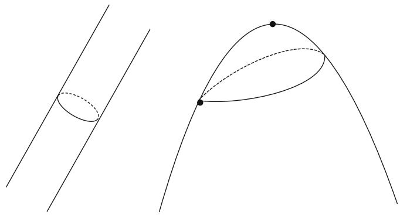

natural_image

Two abstract geometric diagrams showing solid and dashed curves with marked points (no text or symbols)

Fig. 12.11 Souls for cylinder and parabola

Proof. Given a geodesic c in M; we have that the function $f \circ c$ has nonpositive weak second derivative. Thus, $f \circ c$ ıis concave as a function on R: In particular, ıthe minimum of this function on any compact interval is obtained at one of the endpoints. This finishes the proof.

We are left with the problem of the existence of proper concave functions on complete manifolds with nonnegative sectional curvature. This requires the notions of rays and Busemann functions from sections 7.3.1 and 7.3.2.

Lemma 12.4.6. $L e t \left( M , g \right)$ be complete, noncompact, have sec $\geq 0 ,$ , and $p \in M$ : If we take all rays $R _ { p } = \{ c : [ 0 , \infty ) \to M \mid c ( 0 ) = p \}$ and construct

$$
f = \inf _ {c \in R _ {p}} b _ {c},
$$

where $b _ { c }$ denotes the Busemann function, then f is both proper and concave.

Proof. First we show that in nonnegative sectional curvature all Busemann functions are concave. Using that, we can then show that the given function is concave and proper.

Recall from section 7.3.2 that in nonnegative Ricci curvature Busemann functions are superharmonic. The proof of concavity is almost identical. Instead of the Laplacian estimate for distance functions, we must use a similar Hessian estimate. If $r \left( x \right) = \left| x p \right|$ , then we know that Hessr vanishes on radial directions $\partial _ { r } = \nabla r$ and D j jsatisfies Hessr $\leq r ^ { - 1 } g$ D ron vectors perpendicular to the radial direction. In particular, Hessr $\leq r ^ { - 1 } g$ at all smooth points. We can then extend this estimate to the points where r isn’t smooth as we did for modified distance functions. We can now proceed as in the Ricci curvature case to show that Busemann functions have nonpositive Hessians in the weak sense.

The infimum of a collection of concave functions is clearly also concave. So we must show that the superlevel sets for f are compact. Suppose, on the contrary, that some superlevel set $A = \{ x \in M | f ( x ) \geq a \}$ is noncompact. $\mathrm { ~ I f ~ } a \mathrm { ~ > ~ } 0$ ; then $\left\{ x \in M \mid f \left( x \right) \geq 0 \right\}$ D f 2 j  gis also noncompact. So we can assume that $a ~ \leq ~ 0 . ~ \mathrm { A s }$ all of f 2 j  gthe Busemann functions $b _ { c }$ are zero at $p$ also $f ( p ) = 0$ : In particular, $p \in A$ : Using noncompactness select a sequence $p _ { k } \in A$ D 2that goes to infinity. Then consider segments $\overline { { p p _ { k } } } .$ 2, and as in the construction of rays, choose a subsequence so that $\overrightarrow { p p _ { k } }$ converges. This forces the segments to converge to a ray emanating from p. As A is totally convex, all of these segments lie in A: Since A is closed the ray must also lie in A and therefore be one of the rays $c \in R _ { p }$ . This leads to a contradiction as

$$
a \leq f (c (t)) \leq b _ {c} (c (t)) = - t \rightarrow - \infty .
$$

We need to establish a few fundamental properties of totally convex sets.

Lemma 12.4.7. ${ \cal I f A } \subset ( { \cal M } , g )$ is totally convex, then A has an interior, denoted by intA; and a boundary @A: The interior is a totally convex submanifold of M; and the boundary has the property that for each $x ~ \in ~ \partial A$ there is an inward pointing vector $w \in T _ { x } M$ such that any segment $\overline { { x y } }$ 2 with $y \in$ intA has the property that $\angle \left( w , { \overrightarrow { x y } } \right) < \pi / 2 .$ .

Fig. 12.12 Supporting planes and normals for a convex set   
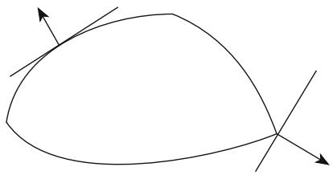

natural_image

Simple line drawing of a curved shape with two intersecting lines and arrows, no text or symbols present.

Some comments are in order before the proof. The words interior and boundary, while describing fairly accurately what the sets look like, are not meant in the topological sense. Most convex sets will in fact not have any topological interior at all. The property about the boundary is called the supporting hyperplane property. Namely, the interior of the convex set is supposed to lie on one side of a hyperplane at any of the boundary points. The vector w is the normal to this hyperplane and can be taken to be tangent to a geodesic that goes into the interior. It is important to note that the supporting hyperplane property shows that the distance function to a subset of intA cannot have any critical points on @A (see also figure 12.12).

Proof. The convexity radius estimate from theorem 6.4.8 will be used in many places. Specifically we shall use that there is a positive function $\varepsilon ( p ) : M  ( 0 , \infty )$ such that $r _ { p } \left( x \right) = \left| x p \right|$ is smooth and strictly convex on $B \left( p , \varepsilon \left( p \right) \right) - \{ p \}$ !.

D j j  f gFirst, let us identify points in the interior and on the boundary. To make the identifications simpler assume that A is closed.

Find the maximal integer k such that A contains a k-dimensional submanifold of M: If $k = 0$ ; then A must be a point. For if A contains two points, then A also Dcontains a segment joining these points and therefore a 1-dimensional submanifold. Now define $N \subset A$ as being the union of all k-dimensional submanifolds in M that are contained in A: We claim that N is a k-dimensional totally convex submanifold whose closure is A: This means we can define intA N and $\partial A = A - N$ .

To see that it is a submanifold, pick $p \in N$ Dand let $N _ { p } \subset A$ D be a k-dimensional 2submanifold of M containing p: By shrinking $N _ { p }$ if necessary, we can also assume that it is embedded. Thus there exists $\delta \in ( 0 , \varepsilon ( p ) )$ so that $B \left( p , \delta \right) \cap N _ { p } = N _ { p }$ : The claim is that also $B \left( p , \delta \right) \cap A = N _ { p }$ 2 \ D: If this were not true, then we could find $q \in A \cap B \left( p , \delta \right) - N _ { p }$ \ D. Now assume that ı is so small that also $\delta < \mathrm { i n j } _ { q }$ : Then we 2 \ can join each point in $B \left( p , \delta \right) \cap N _ { p }$ to $q$ by a unique segment. The union of these segments will, away from $q _ { \cdot }$ \; form a cone that is a $( k + 1 )$ -dimensional submanifold Ccontained in A (see figure 12.13), thus contradicting maximality of k: This shows that N is an embedded submanifold as we have B $( p , \delta ) \cap N = N _ { p }$ :

\ DWhat we have just proved can easily be modified to show that for points $p \in N$ and $q \in A$ with the property that $| p q | < \mathrm { i n j } _ { q }$ 2there is a k-dimensional submanifold $N _ { p } \subset N$ such that $q \in \bar { N } _ { p }$ . Specifically, choose a $( k - 1 )$ -dimensional submanifold through p in N perpendicular to the segment from p to q, and consider the cone over this submanifold with vertex $q .$ : From this statement we get the property that any segment $\overline { { x y } }$ with $y \in N$ must, except possibly for x, lie in N. In particular, N is dense in A:

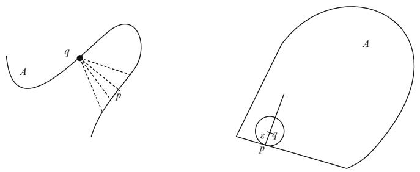

text_image

A
q
p
ε
q
p
A

Fig. 12.13 Interior and boundary points of convex sets

Having identified the interior and boundary, we have to establish the supporting hyperplane property. First, note that since N is totally geodesic its tangent spaces $T _ { q } N$ are preserved by parallel translation along curves in N: For $p \in \partial A$ we then obtain a well-defined k-dimensional tangent space $T _ { p } A \subset T _ { p } M$ 2coming from parallel translating the tangent spaces to N along curves in N that end at $p .$ : Next define the tangent cone at $p \in \partial A$

$$
C _ {p} A = \left\{v \in T _ {p} M \mid \exp_ {p} (t v) \in N \text {   for   some   } t > 0 \right\}.
$$

Note that if $v \in C _ { p } A$ , then in fact $\exp _ { p } \left( t v \right) \in N$ for all small $t > 0$ : This shows that $C _ { p } A$ 2is a cone. Clearly $C _ { p } A \subset T _ { p } A$ 2and is easily seen to be open in $T _ { p } A$ .

In order to prove the supporting half plane property we start by showing that $C _ { p } A$ does not contain antipodal vectors $\pm v$ . If it did, then there would be short segments ˙through p whose endpoints line in N. This in turn shows that $p \in N$ .

For $p \in \partial A$ and $\varepsilon > 0$ assume that there are $q \in A _ { \varepsilon } = \{ x \in A \mid | x \partial A | \geq \varepsilon \}$ with $| q p | = \varepsilon$ 2 2 D f 2 j j j . The set of such points is clearly 2"-dense in @A: So the set of points $p \in \partial A$ j j Dfor which we can find an $\varepsilon > 0$ and $q \in A _ { \varepsilon }$ such that $| q p | = \varepsilon$ 2is dense in @A: We 2 jstart by proving the supporting plane property for such $p .$ j D. We can also assume " is so small that $r _ { q } \left( x \right) = \left| x q \right|$ is smooth and convex on a neighborhood containing p: The claim is that $\mathcal { L } \left( - \nabla r _ { q } , v \right) < \pi / 2$ for all $v \in C _ { p } A$ : To see this, observe that we have a convex set

$$
A ^ {\prime} = A \cap \bar {B} (q, \varepsilon),
$$

with interior

$$
N ^ {\prime} = A \cap B (q, \varepsilon) \subset N
$$

# 12.4 The Soul Theorem

and $p \in \partial A ^ { \prime }$ (see figure 12.13). Thus $C _ { p } A ^ { \prime } \subset C _ { p } A$ and $T _ { p } A = T _ { p } A ^ { \prime }$ : The tangent 2cone of $\bar { B } \left( q , \varepsilon \right)$ is given by

$$
C _ {p} \bar {B} (q, \varepsilon) = \left\{v \in T _ {p} M | \angle (v, - \nabla r _ {q}) <   \frac {\pi}{2} \right\}
$$

as r is smooth at $p _ { : }$ ; thus

$$
C _ {p} A ^ {\prime} = \left\{v \in T _ {p} A \mid \angle (v, - \nabla r _ {q}) <   \frac {\pi}{2} \right\}.
$$

If $C _ { p } A ^ { \prime } \subsetneq C _ { p } A$ , then openness of $C _ { p } A$ in $T _ { p } A$ implies $C _ { p } A$ contains antipodal vectors. At other points $p \in \partial A$ select $p _ { i } \to p$ where

$$
C _ {p _ {i}} A = \left\{v \in T _ {p _ {i}} A \mid \angle (v, - w _ {i}) <   \frac {\pi}{2} \right\}.
$$

These open half spaces will have an accumulation half space

$$
\left\{v \in T _ {p} A \mid \angle (v, - w) <   \frac {\pi}{2} \right\}.
$$

By continuity $\begin{array} { r } { C _ { p } A \subset \{ v \in T _ { p } A \mid \angle ( v , - w ) \leq \frac { \pi } { 2 } \} . \mathrm { A s } C _ { p } A \subset T _ { p } A } \end{array}$ is also open it  2 j †must be contained in an open half space.

The last lemma we need is

Lemma 12.4.8. Let $( M , g )$ have sec $\ge ~ 0 .$ . $H A \subset M$ is totally convex, then the distance function $r : A  \mathbb { R }$ defined by $r ( x ) \ = \ \left| x \partial A \right|$ is concave on A. When sec $> 0 ,$ W !then any maximum for r is unique.

Proof. We shall show that the Hessian is nonpositive in the support sense. Fix $q \in$ intA; and find $p \in \partial A$ so that $| p q | = | q \partial A |$ . Then select a segment $\overline { { p q } }$ 2in A. Using 2exponential coordinates at $p$ j j D j jwe create a hypersurface H which is the image of the hyperplane perpendicular to $\overrightarrow { p q }$ . This hypersurface is perpendicular to $\overrightarrow { p q }$ , the second fundamental form for H at $p$ is zero, and $H \cap { \mathrm { i n t } } A = \emptyset$ : (See figure 12.14.) We have that $f \left( x \right) = \left| x H \right|$ \ Dis a support function from above for $r \left( x \right) = \left| x \partial A \right|$ at all points on ${ \overline { { p q } } } .$ .

Select a point $\boldsymbol { p } ^ { \prime } \neq \boldsymbol { p } , q$ on the segment ${ \overline { { p q } } } .$ , i.e., $| p p ^ { \prime } | + | p ^ { \prime } q | = | p q |$ . One can ¤show as in section 5.7.3 that $f$ is smooth at $p ^ { \prime }$ j j C j j D jexcept possibly when $\boldsymbol { p ^ { \prime } } = \boldsymbol { q }$ . We start by showing that the support function f is concave at $\boldsymbol { p } ^ { \prime } \neq \boldsymbol { q }$ . Note that $\overline { { p q } }$ is an integral curve for $\nabla f$ ¤: Evaluating the fundamental equation (see 3.2.5) on a parallel field, along ${ \overline { { p q } } } .$ r, that starts out being tangent to H; i.e., perpendicular to $\overrightarrow { p q }$ therefore yields:

$$
\begin{array}{l} \frac {d}{d t} \operatorname{Hess} f (E, E) = - R (E, \nabla f, \nabla f, E) - \operatorname{Hess} ^ {2} f (E, E) \\ \leq 0. \\ \end{array}
$$

Fig. 12.14 Distance function to the boundary of a convex set   
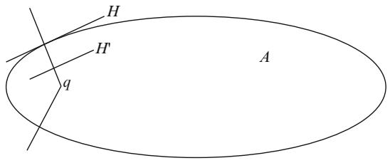

text_image

H
H'
q
A

Since Hessf $( E , E ) = 0$ at $p$ we see that Hessf $( E , E ) \leq 0$ along $\overline { { p q } }$ (and $< 0$ if sec $> 0 )$ D . This shows that we have a smooth support function for $| x \partial A |$ on an open and dense subset in A:

If $f$ is not smooth at q, we can find a hypersurface $H ^ { \prime }$ as above that is perpendicular to $\overrightarrow { p ^ { \prime } q }$ at $p ^ { \prime }$ and has vanishing second fundamental form at $p ^ { \prime }$ . For $p ^ { \prime }$ close to $q$ we have that $| x H ^ { \prime } |$ is smooth at $q$ and therefore also has nonpositive (negative) Hessian at $q .$ j jIn this case we claim that $| p p ^ { \prime } | + | x H ^ { \prime } |$ is a support function for $| x \partial A |$ . Clearly, the functions are equal at $q$ j j C j jand we only need to worry about x jwhere $\left| x \partial A \right| > \left| p p ^ { \prime } \right|$ . In this case we can select $z \in H ^ { \prime }$ with $\vert x \partial A \vert = \vert z \partial A \vert + \vert x H ^ { \prime } \vert$ . j j j jThus we are reduced to showing that $\left| z \partial A \right| \leq \left| p p ^ { \prime } \right|$ for each $z \in H ^ { \prime }$ .

As f is smooth at $p ^ { \prime }$ jit follows that $| x \partial A |$ j j 2is concave in a neighborhood of $p ^ { \prime }$ . Now select a segment ${ \overline { { p ^ { \prime } z } } } .$ j j. By the construction of $H ^ { \prime }$ we can assume that $\overline { { p ^ { \prime } z } }$ is contained in $H ^ { \prime }$ and therefore perpendicular to $\begin{array} { r } { \overrightarrow { p ^ { \prime } q } . } \end{array}$ . Concavity of $x \mapsto | x \partial A |$ along the segment then shows that $\left| z \partial A \right| \leq \left| p ^ { \prime } \partial A \right|$ 7! j jas it lies under the tangent through $p ^ { \prime }$ . This establishes our claim.

Finally, choose a concave $\phi : [ 0 , \infty )  [ 0 , \infty )$ with $\phi \left( 0 \right) = 0$ and $\phi ^ { \prime } > 0$ . Then $\phi \circ r$ W 1 ! 1will clearly also be concave. Moreover, if we select $\phi$ Dto be strictly concave ıand sec $> 0$ , then $\phi \circ r$ will be strictly concave. In case it has a maximum it follows ıthat it is unique as in the construction of a center of mass in section 6.2.2.

We are now ready to prove the soul theorem. Start with the proper concave function $f$ constructed from the Busemann functions. The maximum level set

$$
C _ {1} = \{x \in M \mid f (x) = \max f \}
$$

is nonempty and convex since f is proper and concave. Moreover, it follows from the previous lemma that $C _ { 1 }$ is a point if $\sec > 0$ : This is because the superlevel sets $A = \left\{ x \in M \vert f \left( x \right) \geq a \right\}$ are convex with $\partial A = f ^ { - 1 } \left( a \right)$ ; $\quad \operatorname { s o } f \left( x \right) = \left| x \partial A \right|$ on A: If $C _ { 1 }$ D f 2 j  g Dis a submanifold, then we are also done. In this case $| x C _ { 1 } |$ D j jhas no critical points, as j jany point lies on the boundary of a convex superlevel set. Otherwise, $C _ { 1 }$ is a convex set with nonempty boundary. But then $| x \partial C _ { 1 } |$ is concave on $C _ { 1 }$ . The maximum set $C _ { 2 }$ is again nonempty, since $C _ { 1 }$ j jis compact and convex. If it is a submanifold, then we again claim that we are done. For the distance function $\left| x C _ { 2 } \right|$ has no critical j jpoints, as any point lies on the boundary for a superlevel set for either f or $| x \partial C _ { 1 } |$ : We can iterate this process to obtain a sequence of convex sets $C _ { 1 } \supset C _ { 2 } \supset \cdots \supset C _ { k }$ . We claim that in at most $n = \dim M$    steps we arrive at a point or submanifold S that we call the soul (see figure 12.15). This is because dim $C _ { i } > \mathrm { d i m } C _ { i + 1 }$ : To see this suppose dim $\boldsymbol { \mathrm { \Lambda } } C _ { i } = \dim C _ { i + 1 }$ . Then in $C _ { i + 1 }$ Cwill be an open subset of in $C _ { i }$ : So if $p \in \mathrm { i n t } C _ { i + 1 }$ D C; then we can find ı such that

Fig. 12.15 Iteration for soul construction   
Level set for b   
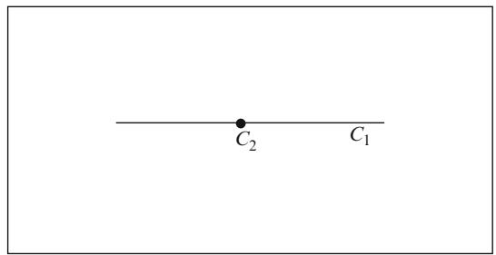

text_image

C₂ C₁

$$
B (p, \delta) \cap \operatorname{int} C _ {i + 1} = B (p, \delta) \cap \operatorname{int} C _ {i}.
$$

Now choose a segment c from $p$ to $\partial C _ { i }$ : Clearly $| x \partial C _ { i } |$ is strictly increasing along c. On the other hand, c runs through $B \left( p , \delta \right)$ int $C _ { i }$ j; thus showing that $| x \partial C _ { i } |$ must be constant on the part of c close to $p .$ :

Much more can be said about complete manifolds with nonnegative sectional curvature. A rather complete account can be found in Greene’s survey in [54]. We briefly mention two important results:

Theorem 12.4.9. Let S be a soul of a complete Riemannian manifold with sec $\geq 0$ ; arriving from the above construction.

(1) (Sharafudtinov, 1978) There is a distance nonincreasing map $S h : M \to S$ such that $S h | _ { S } = i d .$ W !. In particular, all souls must be isometric to each other.   
j D(2) (Perel’man, 1993) The map Sh $: M \to S$ is a submetry. From this it additional W !follows that S must be a point if all sectional curvatures based at just one point in M are positive.

Having reduced all complete nonnegatively curved manifolds to bundles over closed nonnegatively curved manifolds, it is natural to ask the converse question: Given a closed manifold S with nonnegative curvature, which bundles over S admit complete metrics with sec $\geq \ 0 ?$ Clearly, the trivial bundles do. When $S \ = \ T ^ { 2 }$  DÖzaydın-Walschap in [82] have shown that this is the only 2-dimensional vector bundle that admits such a metric. Still, there doesn’t seem to be a satisfactory general answer. If, for instance, we let $S = S ^ { 2 }$ ; then any 2-dimensional bundle is of the form $\left( S ^ { 3 } \times \mathbb { C } \right) / S ^ { 1 }$ ; where $S ^ { 1 }$ Dis the Hopf action on $S ^ { 3 }$ and acts by rotations on C in the -following way: $\omega \times z = \omega ^ { k } z$ for some integer k: This integer is the Euler number of - Dthe bundle. As we have a complete metric of nonnegative curvature on $S ^ { 3 } \times \mathbb { C }$ ; the -O’Neill formula from theorem 4.5.3 shows that these bundles admit metrics with sec $\geq 0$ .

There are some interesting examples of manifolds with positive and zero Ricci curvature that show how badly the soul theorem fails for such manifolds. In 1978, Gibbons-Hawking in [49] constructed Ricci flat metrics on quotients of $\mathbb { C } ^ { 2 }$ blown up at any finite number of points. Thus, one gets a Ricci flat manifold with arbitrarily large second Betti number. About ten years later Sha-Yang showed that the infinite connected sum

$$
\left(S ^ {2} \times S ^ {2}\right) \sharp \left(S ^ {2} \times S ^ {2}\right) \sharp \dots \sharp \left(S ^ {2} \times S ^ {2}\right) \sharp \dots
$$

admits a metric with positive Ricci curvature, thus putting to rest any hopes for general theorems in this direction. Sha-Yang have a very nice survey in [51] describing these and other examples. The construction uses doubly warped product metrics on $I \times S ^ { 2 } \times S ^ { 1 }$ as described in section 1.4.5.

# 12.5 Finiteness of Betti Numbers

We prove two results in this section.

Theorem 12.5.1 (Gromov, 1978 and 1981). There is a constant $C \left( n \right)$ such that any complete manifold $( M , g )$ with sec $\geq 0$ satisfies

(1) $\pi _ { 1 } \left( M \right)$ can be generated by $\leq C \left( n \right)$ generators.   
(2) For any field F of coefficients the Betti numbers are bounded:

$$
\sum_ {i = 0} ^ {n} b _ {i} (M, \mathbb {F}) = \sum_ {i = 0} ^ {n} \dim H _ {i} (M, \mathbb {F}) \leq C (n).
$$

Part (2) of this result is considered one of the deepest and most beautiful results in Riemannian geometry. Before embarking on the proof, let us put it in context. First, we should note that the Gibbons-Hawking and Sha-Yang examples show that a similar result cannot hold for manifolds with nonnegative Ricci curvature. Sha-Yang also exhibited metrics with positive Ricci curvature on the connected sums

$$
\underbrace {\left(S ^ {2} \times S ^ {2}\right) \sharp \left(S ^ {2} \times S ^ {2}\right) \sharp \cdots \sharp \left(S ^ {2} \times S ^ {2}\right)} _ {k \text { times }}.
$$

For large k; the Betti number bound shows that these connected sums cannot have a metric with nonnegative sectional curvature. Thus, there exist simply connected manifolds that admit positive Ricci curvature but not nonnegative sectional curvature. The reader should also consult our discussion of manifolds with nonnegative curvature operator in sections 9.4.4 and 10.3.3 to see how much more is known about these manifolds.

In the context of nonnegative sectional curvature there are three difficult open problems. They were discussed and settled in chapters 9 and 10 for manifolds with nonnegative curvature operator.

(H. Hopf) Does $S ^ { 2 } \times S ^ { 2 }$ admit a metric with positive sectional curvature?

(H. Hopf) For $M ^ { 2 n }$ -, does sec $\geq 0 \left( > 0 \right)$ imply $\chi \left( M \right) \geq 0 \left( > 0 \right) ?$

(Gromov) Does sec  0 imply $\textstyle \sum _ { i = 0 } ^ { n } b _ { i } ( M , \mathbb { F } ) \leq 2 ^ { n } ?$

Recall that these questions were also discussed in section 8.3 under additional assumptions about the isometry group.

First we establish part (1) of Gromov’s theorem. The proof resembles that of the critical point estimate lemma 12.4.2 from the previous section.

Proof of (1). We construct what is called a short set of generators for $\pi _ { 1 } \left( M \right)$ : Consider $\pi _ { 1 } \left( M \right)$ as acting by deck transformations on the universal covering M and fix $p \in \tilde { M }$ : Inductively select a generating set $\{ g _ { 1 } , g _ { 2 } , \ldots \}$ such that

(a) $| p g _ { 1 } ( p ) | \leq | p g ( p ) |$ for all $g \in \pi _ { 1 } \left( M \right) - \{ e \}$ :

(b) $| p g _ { k } ( p ) | \leq | p g ( p ) |$ j for all $g \in \pi _ { 1 } \left( M \right) - \left. g _ { 1 } , \ldots , g _ { k - 1 } \right.$

We claim that $\angle \overrightarrow { p g _ { k } ( p ) } , \overrightarrow { p g _ { l } ( p ) } \ge \pi / 3$ for $k < l .$ Otherwise, the hinge version †of Toponogov’s theorem would imply

$$
\begin{array}{l} \left| g _ {l} (p) g _ {k} (p) \right| ^ {2} <   \left| p g _ {k} (p) \right| ^ {2} + \left| p g _ {l} (p) \right| ^ {2} \\ - \left| p g _ {k} (p) \right| \left| p g _ {l} (p) \right| \\ \leq | p g _ {l} (p) | ^ {2}. \\ \end{array}
$$

But then

$$
\left| p \left(g _ {l} ^ {- 1} g _ {k}\right) (p) \right| <   \left| p g _ {l} (p) \right|,
$$

which contradicts our choice of $g _ { l }$ . Therefore, we have produced a generating set with a bounded number of elements.

The proof of the Betti number estimate is established through several lemmas. First, we need to make three definitions for metric balls. Throughout, fix a Riemannian n-manifold M with $\sec \ \geq \ 0$ and a field F of coefficients for our homology theory

$$
H _ {*} (\cdot , \mathbb {F}) = H _ {*} (\cdot) = H _ {0} (\cdot) \oplus \dots \oplus H _ {n} (\cdot).
$$

For $A \subset B \subset M$ define

$$
\operatorname{rank} _ {k} (A \subset B) = \operatorname{rank} \left(H _ {k} (A) \rightarrow H _ {k} (B)\right),
$$

$$
\operatorname{rank} _ {*} (A \subset B) = \operatorname{rank} \left(H _ {*} (A) \rightarrow H _ {*} (B)\right).
$$

Fig. 12.16 Compact set with infinite topology   
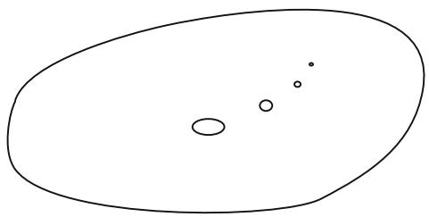

natural_image

Simple line drawing of an oval shape with three smaller circles inside, no text or symbols present.

Note that when $A \subset B \subset C \subset D$ ; then

$$
\operatorname{rank} _ {*} (A \subset D) \leq \operatorname{rank} _ {*} (B \subset C).
$$

It follows that when A; B are open, bounded, and ${ \bar { A } } \subset B ,$ , then the rank is finite, even when the homology of either set is not finite dimensional. Figure 12.16 pictures a planar domain where infinitely many discs of smaller and smaller size have been extracted. This yields a compact set with infinite topology. Nevertheless, this set has finitely generated topology when mapped into any neighborhood of itself, as that has the effect of canceling all of the smallest holes.

Content: The content of a metric ball $B \left( p , r \right) \subset M$ is

$$
\operatorname{cont} B (p, r) = \operatorname{rank} _ {*} \left(B \left(p, \frac {r}{5}\right) \subset B (p, r)\right).
$$

Corank: The corank of a set $A \subset M$ is defined as the largest integer k such that we can find k metric balls $B \left( p _ { 1 } , r _ { 1 } \right) , \ldots , B \left( p _ { k } , r _ { k } \right)$ with the properties

(a) There is a critical point $x _ { i }$ for $p _ { i }$ with $\left| p _ { i } x _ { i } \right| = 1 0 r _ { i }$ .   
(b) $r _ { i } \geq 3 r _ { i - 1 }$ for $i = 2 , \ldots , k$   
(c) $\textstyle A \subset \bigcap _ { i = 1 } ^ { k } B \left( p _ { i } , r _ { i } \right)$

Compressibility: A ball $B \left( p , R \right)$ is said to be compressible if it contains a ball $B \left( x , r \right) \subset B \left( p , R \right)$ such that

(a) $r \leq R / 2$   
(b) $\mathrm { c o n t } B \left( x , r \right) \geq \mathrm { c o n t } B \left( p , R \right)$

If a ball is not compressible we call it incompressible. Note that any ball with content $> 1$ ; can be successively compressed to an incompressible ball.

We connect these three concepts through a few lemmas that will ultimately lead us to the proof of the Betti number estimate. Observe that for large r; the ball $B \left( p , r \right)$ contains all the topology of M; so

$$
\operatorname{cont} B (p, r) = \sum_ {i} b _ {i} (M).
$$

Also, the corank of such a ball will be zero for large r by lemma 12.4.2. The idea is to compress such a ball until it becomes incompressible and then estimate its content in terms of balls that have corank 1: In this way, we will be able to successively estimate the content of balls of fixed corank in terms of the content of balls with one higher corank. The proof is then finished first, by showing that the corank of a ball is uniformly bounded, and second, by observing that balls of maximal corank must be contractible and therefore have content 1 (otherwise they would contain critical points for the center, and the center would have larger corank).

Lemma 12.5.2. The corank of any set $A \subset M$ is bounded by $1 0 0 ^ { n }$ :

Proof. Suppose that A has corank larger than $1 0 0 ^ { n }$ : Select balls $B \left( p _ { 1 } , r _ { 1 } \right) , \ldots ,$ ; $B \left( p _ { k } , r _ { k } \right)$ with corresponding critical points $x _ { 1 } , \ldots , x _ { k }$ ; where $k > 1 0 0 ^ { n }$ : Now choose $z \in A$ and select segments ${ \overline { { z x _ { i } } } } .$ . One can check that in the unit sphere:

$$
\frac {v (n - 1 , 1 , \pi)}{v (n - 1 , 1 , \frac {1}{1 2})} \leq (1 2 \pi) ^ {n - 1} \leq 4 0 ^ {n}.
$$

Since $k > 4 0 ^ { n }$ there will be two segments $\overline { { z x _ { i } } }$ and $\overline { { Z { \cal { X } } _ { j } } }$ that form an angle $< 1 / 6$ at $z .$ Figure 12.17 gives the pictures of the geometry involved.

Note that $\left| z p _ { i } \right| \leq r _ { i }$ and $\left| z p _ { j } \right| \le r _ { j }$ . The triangle inequality implies

$$
\left| z x _ {i} \right| \leq 1 0 r _ {i} + \left| z p _ {i} \right| \leq 1 1 r _ {i},
$$

$$
\left| z x _ {j} \right| \geq 1 0 r _ {j} - r _ {j} \geq 9 r _ {j}.
$$

Also, $r _ { j } \ \ge \ 3 r _ { i }$ ; so $\left| z x _ { j } \right| > \left| z x _ { i } \right|$ . The hinge version of Toponogov’s theorem then implies

$$
\left| x _ {i} x _ {j} \right| ^ {2} \leq \left| z x _ {j} \right| ^ {2} + \left| z x _ {i} \right| ^ {2} - 2 \left| z x _ {i} \right| \left| z x _ {j} \right| \cos {\frac {1}{6}}
$$

$$
= \left| z x _ {j} \right| ^ {2} + \left| z x _ {i} \right| ^ {2} - \frac {3 1}{1 6} \left| z x _ {i} \right| \left| z x _ {j} \right|
$$

$$
\leq \left(\left| z x _ {j} \right| - \frac {3}{4} \left| z x _ {i} \right|\right) ^ {2}.
$$

Fig. 12.17 Hinges and triangles   
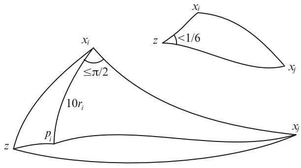

text_image

x_i
≤π/2
10r_i
p_i
z
x_j
x_i
z
<1/6
x_j

In other words: $\begin{array} { r } { \left| x _ { i } x _ { j } \right| \leq \left| z x _ { j } \right| - \frac { 3 } { 4 } \left| z x _ { i } \right| } \end{array}$ . Now use the triangle inequality to conclude

$$
\begin{array}{l} \left| p _ {i} x _ {j} \right| \geq \left| z x _ {j} \right| - \left| z p _ {i} \right| \\ \geq 1 0 r _ {j} - \left| z p _ {j} \right| - \left| z p _ {i} \right| \\ \geq 8 r _ {j} \\ \geq 2 4 r _ {i} \\ \geq 2 0 r _ {i} = 2 \left| p _ {i} x _ {i} \right|. \\ \end{array}
$$

Yet another application of the triangle inequality will then imply $\left| x _ { i } x _ { j } \right| \ge \left| p _ { i } x _ { i } \right|$ : Since $x _ { i }$ is critical for $p _ { i }$  j j; we use the hinge version of Toponogov’s theorem to conclude

$$
\left| p _ {i} x _ {j} \right| ^ {2} \leq \left| p _ {i} x _ {i} \right| ^ {2} + \left| x _ {i} x _ {j} \right| ^ {2} \leq \left(\left| x _ {i} x _ {j} \right| + \frac {1}{2} \left| p _ {i} x _ {i} \right|\right) ^ {2}.
$$

Thus,

$$
\left| p _ {i} x _ {j} \right| \leq \left| x _ {i} x _ {j} \right| + \frac {1}{2} \left| p _ {i} x _ {i} \right| \leq \left| x _ {i} x _ {j} \right| + 5 r _ {i}.
$$

The triangle inequality implies

$$
\left| z x _ {j} \right| \leq \left| p _ {i} x _ {j} \right| + \left| z p _ {i} \right| \leq \left| p _ {i} x _ {j} \right| + r _ {i} \leq \left| x _ {i} x _ {j} \right| + 6 r _ {i}.
$$

However, we also have

$$
\left| z x _ {i} \right| \geq 1 0 r _ {i} - \left| z p _ {i} \right| \geq 9 r _ {i},
$$

which together with

$$
\left| x _ {i} x _ {j} \right| \leq \left| z x _ {j} \right| - \frac {3}{4} \left| z x _ {i} \right|
$$

implies

$$
\left| x _ {i} x _ {j} \right| \leq \left| z x _ {j} \right| - \frac {2 7}{4} r _ {i}.
$$

Thus, we have a contradiction:

$$
\left| x _ {i} x _ {j} \right| + \frac {2 7}{4} r _ {i} \leq \left| z x _ {j} \right| \leq \left| x _ {i} x _ {j} \right| + 6 r _ {i}.
$$

Having established a bound on the corank, we next check how the topology changes when we pass from balls of lower corank to balls of higher corank. This requires two lemmas. The first is purely topological and its proof can be skipped.

Lemma 12.5.3. Assume that we have bounded open sets $B _ { i } ^ { j } , i = 1 , \ldots , m a n d j =$ $0 , \ldots , n + 1$ with $\bar { B } _ { i } ^ { j } \subset B _ { i } ^ { j + 1 } \subset M ^ { n }$ , then

$$
\begin{array}{l} \operatorname{rank} _ {k} \left(\bigcup_ {i} B _ {i} ^ {0} \subset \bigcup_ {i} B _ {i} ^ {n + 1}\right) \leq \operatorname{rank} _ {k} \left(\bigcup_ {i} B _ {i} ^ {0} \subset \bigcup_ {i} B _ {i} ^ {k + 1}\right) \\ \leq \sum_ {l = 0} ^ {k} \sum_ {i _ {0} <   \dots <   i _ {k - l}} \operatorname{rank} _ {l} \left(\bigcap_ {s = 0} ^ {k - l} B _ {i _ {s}} ^ {0} \subset \bigcap_ {s = 0} ^ {k - l} B _ {i _ {s}} ^ {l + 1}\right). \\ \end{array}
$$

Proof. To see why we need multiple intermediate coverings consider the commutative diagram

$$
\begin{array}{l} \ker L \to V \to \operatorname{im} L \\ \downarrow 0 \qquad \downarrow f \qquad \downarrow \\ \operatorname{im} L \to \operatorname{im} L \to 0 \\ \end{array}
$$

where the rank of f is clearly not bounded by the ranks of the other two maps between the exact sequences.

We use the generalized Mayer-Vietoris double complex of singular chains with coefficients $\mathbb { F }$ (see also [18, Sections 8 and 15]):

$$
C _ {p, q} ^ {j} = \bigoplus_ {i _ {0} <   \dots <   i _ {q}} C _ {p} \left(\cap_ {s = 0} ^ {q} B _ {i _ {s}} ^ {j}\right).
$$

This comes with the boundary maps

$$
\begin{array}{l} \partial : C _ {p, q} ^ {j} \to C _ {p - 1, q} ^ {j}, \\ \delta : C _ {p, q} ^ {j} \to C _ {p, q - 1} ^ {j}, \\ \end{array}
$$

where $\delta$ comes from the inclusions $C _ { p } ( \bigcap _ { s = 0 } ^ { q } B _ { i _ { s } } ^ { j } )  C _ { p } ( \bigcap _ { s \neq l } B _ { i _ { s } } ^ { j } )$ with sign $( - 1 ) ^ { l }$ for $l = 0 , \ldots , q$ \ D ! \ ¤ . The choice of sign is consistent with the usual Mayer-Vietoris Dsequence. Moreover, $\partial \delta = \delta \partial$ . Define $\mathfrak { F } = ( - 1 ) ^ { p } \delta$ (eth) to make them anticommute. D D We then obtain a new chain complex with vector spaces $\oplus _ { l = 0 } ^ { k } C _ { l , k - l } ^ { j }$ and boundary maps $D = \partial + \eth$ defined as:

$$
\begin{array}{l} \oplus_ {l = 0} ^ {k} C _ {l, k - l} ^ {j} \to \oplus_ {l = 0} ^ {k - 1} C _ {l, k - 1 - l} ^ {j}, \\ \left(c _ {0, k} ^ {j}, c _ {1, k - 1} ^ {j}, \dots , c _ {k, 0} ^ {j}\right) \mapsto \left(\mathfrak {d} c _ {0, k} ^ {j} + \partial c _ {1, k - 1} ^ {j}, \dots , \mathfrak {d} c _ {k - 1, 1} ^ {j} + \partial c _ {k, 0} ^ {j}\right). \\ \end{array}
$$

The Ä-complex can be augmented by adding the natural inclusions $\mathfrak { F } : C _ { p , 0 } ^ { j } \to$ $C _ { p } \left( \cup _ { i } B _ { i } ^ { j } \right)$ . The images of this map generates the @-homology, so let $C _ { p } ^ { j } = \mathrm { i m } \eth$ to [obtain a diagram with exact columns:

$$
\begin{array}{c c c c c} \vdots & \vdots & \vdots & \vdots & \ddots \\ & \breve {\mathfrak {d}} \downarrow & \breve {\mathfrak {d}} \downarrow & \breve {\mathfrak {d}} \downarrow \\ 0 \stackrel {{\partial}} {{\leftarrow}} C _ {0, 1} ^ {j} & \stackrel {{\partial}} {{\leftarrow}} C _ {1, 1} ^ {j} & \stackrel {{\partial}} {{\leftarrow}} C _ {2, 1} ^ {j} & \stackrel {{\partial}} {{\leftarrow}} \dots \\ & \breve {\mathfrak {d}} \downarrow & \breve {\mathfrak {d}} \downarrow & \breve {\mathfrak {d}} \downarrow \\ 0 \stackrel {{\partial}} {{\leftarrow}} C _ {0, 0} ^ {j} & \stackrel {{\partial}} {{\leftarrow}} C _ {1, 0} ^ {j} & \stackrel {{\partial}} {{\leftarrow}} C _ {2, 0} ^ {j} & \stackrel {{\partial}} {{\leftarrow}} \dots \\ & \breve {\mathfrak {d}} \downarrow & \breve {\mathfrak {d}} \downarrow & \breve {\mathfrak {d}} \downarrow \\ 0 \stackrel {{\partial}} {{\leftarrow}} C _ {0} ^ {j} & \stackrel {{\partial}} {{\leftarrow}} C _ {1} ^ {j} & \stackrel {{\partial}} {{\leftarrow}} C _ {2} ^ {j} & \stackrel {{\partial}} {{\leftarrow}} \dots \\ & \breve {\mathfrak {d}} \downarrow & \breve {\mathfrak {d}} \downarrow & \breve {\mathfrak {d}} \downarrow \\ & 0 & 0 & 0 & \dots \end{array}
$$

Any D-cycle $\left( c _ { l , k - l } ^ { j } \right)$ defines a @-cycle $\mathfrak { F } c _ { k , 0 } ^ { j } \in C _ { k } ^ { j }$ since

$$
\partial \eth c _ {k, 0} ^ {j} = - \eth \partial c _ {k, 0} ^ {j} = \eth \eth c _ {k - 1, 1} ^ {j} = 0.
$$

Conversely, any @-cycle $c \in C _ { k } ^ { j }$ comes from a D-cycle: We need $c _ { l , k - l } ^ { j } \in C _ { l , k - l } ^ { j }$ such that $\partial c _ { l , k - l } ^ { j } = - \Im c _ { l - 1 , k - l + 1 } ^ { j }$ . Start by finding $c _ { k , 0 } ^ { j }$ such that $\mathfrak { F } c _ { k , 0 } ^ { j } = c .$ . Since $\Im { \partial c _ { k , 0 } ^ { j } } ~ = ~ - \partial \Im { c _ { k , 0 } ^ { j } } ~ = ~ 0$   C we can by exactness of Ä find $c _ { k - 1 , 1 } ^ { j }$ with $- \mathfrak { F } c _ { k - 1 , 1 } ^ { j } \ =$ $\partial c _ { k , 0 } ^ { j }$ Detc.

This correspondence also preserves being a boundary and thus gives an isomorphism between D-homology and regular @-homology. This is crucial for the proof as it shows how to represent homology classes by chains in the intersections. That said, as we don’t generate cycles in the intersections, they don’t immediately create homology classes.

We use a modified version of Cheeger’s cohomology proof in [28]. To prove the lemma consider a finite dimensional subspace $Z _ { k } \subset \oplus _ { l = 0 } ^ { k } C _ { l , k - l } ^ { 0 }$ of D-cycles that contains no nontrivial D-boundaries. Let $Z _ { k } ^ { 0 } = \mathfrak { F } Z _ { k } \subset C _ { k } ^ { 0 }$ be the isomorphic subspace of @-cycles. Specifically: $z = \mathfrak { F } z _ { k , 0 } \in Z _ { k } ^ { 0 }$ , where $( z _ { l , k - l } ) \in Z _ { k }$ . We claim that there is a filtration $\dot { Z } _ { k } ^ { 0 } \supset Z _ { k } ^ { 1 } \dot { \supset } \cdots \supset Z _ { k } ^ { k + 1 }$ 2  2with the properties that

$$
\dim \left(Z _ {k} ^ {l} / Z _ {k} ^ {l + 1}\right) \leq \sum_ {i _ {0} <   \dots <   i _ {k - l}} \operatorname{rank} _ {l} \left(\bigcap_ {s = 0} ^ {k - l} B _ {i _ {s}} ^ {l} \subset \bigcap_ {s = 0} ^ {k - l} B _ {i _ {s}} ^ {l + 1}\right)
$$

and $Z _ { k } ^ { k + 1 }$ consists of @-cycles that are mapped to @-boundaries in $C _ { k } ^ { k + 1 }$ . This will prove the lemma if $Z _ { k } ^ { 0 }$ is chosen to map isomorphically to its image in $H _ { k } \left( \cup _ { i } B _ { i } ^ { k + 1 } \right)$ .

For the construction choose inverses $\partial ^ { - 1 } : \partial C _ { p , q } ^ { j } \ \to \ C _ { p , q } ^ { j }$ with $\partial \partial ^ { - 1 } c = c ,$ and name the inclusion maps $f ^ { j } : C _ { * } ( \cup _ { i } B _ { i } ^ { j - 1 } ) \  \ C _ { * } ( \cup _ { i } B _ { i } ^ { j } )$ . Note also that the restriction maps $z \mapsto z _ { l , k - l }$ are linear.

7! The construction is inductive and relies on finding suitable linear maps $L ^ { l } : Z _ { k } ^ { l } \to$ $C _ { l , k - l } ^ { l }$ whose images consists of @-cycles and then define

$$
Z _ {k} ^ {l + 1} = \left\{z \in Z _ {k} ^ {l} \mid f ^ {l + 1} L ^ {l} (z) \in \partial C _ {l + 1, k - l} ^ {l + 1} \right\}.
$$

This will show that

$$
\dim \left(Z _ {k} ^ {l} / Z _ {k} ^ {l + 1}\right) \leq \sum_ {i _ {0} <   \dots <   i _ {k - l}} \operatorname{rank} _ {l} \left(\bigcap_ {s = 0} ^ {k - l} B _ {i _ {s}} ^ {l} \subset \bigcap_ {s = 0} ^ {k - l} B _ {i _ {s}} ^ {l + 1}\right).
$$

Starting with $l = 0$ we set $L ^ { 0 } \left( z \right) = z _ { 0 , k }$

$$
Z _ {k} ^ {1} = \left\{z \in Z _ {k} ^ {0} \mid f ^ {1} (z _ {0, k}) \in \partial C _ {1, k} ^ {1} \right\},
$$

and note that we trivially have $\partial z _ { 0 , k } = 0$

Now assume we have $L ^ { l } : Z _ { k } ^ { l } \to C _ { l , k - l } ^ { l }$ with the properties that

$$
\mathfrak {d} L ^ {l} (z) = f ^ {l} \dots f ^ {1} (\mathfrak {d} z _ {l, k - l}),
$$

$$
\partial L ^ {l} (z) = f ^ {l} \dots f ^ {1} (\partial z _ {l, k - l}) + f ^ {l} (\eth L ^ {l - 1} (z)) = 0.
$$

This is clearly valid for $l = 0$ . We can then define $Z _ { k } ^ { l + 1 }$ as above and with that

$$
L ^ {l + 1} (z) = f ^ {l + 1} \dots f ^ {1} (z _ {l + 1, k - l - 1}) + \eth \partial^ {- 1} f ^ {l + 1} L ^ {l} (z).
$$

It follows from our induction hypotheses on $L ^ { l }$ and the fact that $\left( z _ { l , k - l } \right)$ is a D-cycle that

$$
\mathfrak {d} L ^ {l + 1} (z) = f ^ {l + 1} \dots f ^ {1} (\mathfrak {d} z _ {l + 1, k - l - 1}),
$$

$$
\partial L ^ {l + 1} (z) = f ^ {l + 1} \dots f ^ {1} (\partial z _ {l + 1, k - l - 1}) + f ^ {l + 1} (\eth L ^ {l} (z)) = 0.
$$

$z \in Z _ { k } ^ { k + 1 }$ we have that $f ^ { k + 1 } L ^ { k } \left( z \right) \in \partial C _ { k + 1 , 0 } ^ { k + 1 }$

$$
\mathfrak {d} f ^ {k + 1} L ^ {k} (z) = f ^ {k + 1} f ^ {k} \dots f ^ {1} (\mathfrak {d} z _ {k, 0}) = f ^ {k + 1} \dots f ^ {1} (z)
$$

showing that also $f ^ { k + 1 } \cdot \cdot \cdot f ^ { 1 } \left( z \right)$ is a @-boundary.

Let $\mathcal { B } \left( k \right)$ denote the set of balls in M of corank $\geq k$ ; and $\mathcal { C } \left( k \right)$ the largest content of any ball in $\mathcal { B } \left( k \right)$ :

Lemma 12.5.4. There is a constant C .n/ depending only on dimension such that

$$
\mathscr {C} (k) \leq C (n) \mathscr {C} (k + 1).
$$

Proof. Clearly $\mathcal { C } \left( k \right)$ is always realized by some incompressible ball $B \left( p , R \right)$ . Now consider a ball $B \left( x , r \right)$ where $x \in B \left( p , R / 4 \right)$ and $r \leq R / 1 0 0$ . We claim that this ball lies in $\mathcal { B } \left( k + 1 \right)$ 2  : To see this, first consider the balls

$$
B \left(x, \frac {R}{1 0}\right) \subset B \left(p, \frac {R}{5}\right) \subset B \left(x, \frac {R}{2}\right) \subset B (p, R).
$$

If there are no critical points for x in $B \left( x , R / 2 \right) - B \left( x , R / 1 0 \right)$ , then

$$
\begin{array}{l} \operatorname{rank} _ {*} \left(B \left(x, \frac {R}{1 0}\right) \subset B \left(x, \frac {R}{2}\right)\right) \\ = \operatorname{rank} _ {*} \left(B \left(p, \frac {R}{5}\right) \subset B \left(x, \frac {R}{2}\right)\right) \\ \geq \operatorname{rank} _ {*} \left(B \left(p, \frac {R}{5}\right) \subset B (p, R)\right). \\ \end{array}
$$

This implies that contB $( p , R ) \leq \mathrm { c o n t } B \left( x , R / 2 \right)$ and thus contradicts incompressibility of $B \left( p , R \right)$  : We can now show that $B \left( x , r \right) \in \mathcal { B } \left( k + 1 \right)$ : Using that $B \left( p , R \right) \in$ $\mathcal { B } \left( k \right)$ ; select $B \left( p _ { 1 } , r _ { 1 } \right) , \ldots , B \left( p _ { l } , r _ { l } \right) , l \geq k .$ 2 C 2; as in the definition of corank. Then pick a critical point y for x in $B \left( x , R / 2 \right) - B \left( x , R / 1 0 \right)$ and consider the ball $B \left( x , \vert x y \vert / 1 0 \right)$ . Then the balls $B ( p _ { 1 } , r _ { 1 } ) , . . . , B ( p _ { l } , r _ { l } ) , B ( x , | x y | / 1 0 )$ show that $B \left( x , r \right)$ has corank $\geq l + 1 > k$ :

CNow cover $B \left( p , { R } / { 5 } \right)$ by balls $B \left( p _ { i } , 1 0 ^ { - n - 3 } R \right) , i = 1 , \ldots , m$ . If in addition the balls $B \left( p _ { i } , 1 0 ^ { - n - 3 } R / 2 \right)$ are pairwise disjoint, then

$$
m \leq \frac {v (n , 0 , R)}{v (n , 0 , 1 0 ^ {- n - 3 R / 2})} = 2 ^ {n} \cdot 1 0 ^ {n (n + 3)}.
$$

Since B $( p _ { i } , R / 2 ) \subset B ( p , R )$ it follows that

$$
\operatorname{cont} B (p, R) \leq \operatorname{rank} _ {*} \left(\bigcup_ {i = 1} ^ {m} B \left(p _ {i}, 1 0 ^ {- n - 3} R\right) \subset \bigcup_ {i = 1} ^ {m} B \left(p _ {i}, \frac {R}{2}\right)\right).
$$

To estimate

$$
\operatorname{rank} _ {*} \left(\bigcup_ {i = 1} ^ {m} B \left(p _ {i}, 1 0 ^ {- n - 3} R\right) \subset \bigcup_ {i = 1} ^ {m} B \left(p _ {i}, \frac {R}{2}\right)\right),
$$

use the doubly indexed family $B _ { i } ^ { j } = B \left( p _ { i } , 1 0 ^ { j - n - 3 } R \right) , j = 0 , \ldots , n + 1$ . Note that for fixed j the family covers $B \left( p , R / 5 \right)$ D C. It follows from lemma 12.5.3 that

$$
\begin{array}{l} \operatorname{rank} _ {*} \left(\bigcup_ {i = 1} ^ {m} B \left(p _ {i}, 1 0 ^ {- n - 3} R\right) \subset \bigcup_ {i = 1} ^ {m} B \left(p _ {i}, \frac {R}{2}\right)\right) \\ \leq \operatorname{rank} _ {*} \left(\bigcup_ {i = 1} ^ {m} B \left(p _ {i}, 1 0 ^ {- n - 3} R\right) \subset \bigcup_ {i = 1} ^ {m} B \left(p _ {i}, 1 0 ^ {- 2} R\right)\right) \\ \leq \sum_ {j = 0} ^ {n} \sum_ {k = 0} ^ {m - 1} \sum_ {i _ {0} <   \dots <   i _ {k}} \operatorname{rank} _ {*} \left(\bigcap_ {s = 0} ^ {k} B \left(p _ {i _ {s}}, 1 0 ^ {j - n - 3}\right) \subset \bigcap_ {s = 0} ^ {k} B \left(p _ {i _ {s}}, 1 0 ^ {j - n - 2} R\right)\right). \\ \end{array}
$$

When $\textstyle \bigcap _ { t = 0 } ^ { s } B \left( p _ { i _ { t } } , 1 0 ^ { j - n - 3 } R \right) \neq \emptyset$ the triangle inequality shows that

$$
\begin{array}{l} \bigcap_ {t = 0} ^ {s} B \left(p _ {i _ {t}}, 1 0 ^ {j - n - 3} R\right) \subset B \left(p _ {i _ {0}}, 1 0 ^ {j - n - 3} R\right) \\ \subset B \left(p _ {i _ {0}}, 1 0 ^ {j - n - 2} \frac {R}{2}\right) \\ \subset \bigcap_ {t = 0} ^ {s} B \left(p _ {i _ {t}}, 1 0 ^ {j - n - 2} R\right). \\ \end{array}
$$

Consequently, as long as $j \leq n$ we have

$$
\operatorname{rank} _ {*} \left(\bigcap_ {t = 0} ^ {s} B \left(p _ {i _ {t}}, 1 0 ^ {j - n - 3} R\right) \subset \bigcap_ {t = 0} ^ {s} B \left(p _ {i _ {t}}, 1 0 ^ {j - n - 2} R\right)\right) \leq \operatorname{cont} B \left(p _ {i _ {0}}, 1 0 ^ {j - n - 2} \frac {R}{2}\right)
$$

where $B \left( p _ { i _ { 0 } } , 1 0 ^ { j - n - 2 } \frac { R } { 2 } \right) \in \mathcal { B } \left( k + 1 \right)$

2The number of intersections $\begin{array} { r } { \bigcap _ { t = 0 } ^ { s } B \left( p _ { i _ { t } } , 1 0 ^ { j - n - 3 } R \right) } \end{array}$ with $j ~ \leq ~ n$ and $s \leq 2 ^ { n }$ $1 0 ^ { n ( n + 3 ) }$ is bounded by

$$
C (n) = \sum_ {j = 0} ^ {n} 2 ^ {2 ^ {n} \cdot 1 0 ^ {n (n + 3)}}.
$$

So we obtain an estimate of the form $\mathcal { C } \left( k \right) \leq C \left( n \right) \mathcal { C } \left( k + 1 \right)$ .

Proof of (2). The above lemma implies that

$$
\operatorname{cont} M = \mathscr {C} (0) \leq \mathscr {C} (k) \cdot (C (n)) ^ {k},
$$

where $k ~ \leq ~ 1 0 0 ^ { n }$ is the largest possible corank in M: It then remains to check that $\mathcal { C } \left( k \right) = 1$ : However, it follows from the above that if $\mathcal { B } \left( k \right)$ contains an Dincompressible ball, then $\mathcal { B } \left( k + 1 \right) \neq \emptyset$ : Thus, all balls in $\mathcal { B } \left( k \right)$ are compressible, C ¤but then they must have minimal content 1:

The Betti number theorem can easily be proved in the more general context of manifolds with lower sectional curvature bounds, but one must then also assume an upper diameter bound. Otherwise, the ball covering arguments, and also the estimates using Toponogov’s theorem, won’t work. Thus, there is a constant $C \left( n , k ^ { 2 } D \right)$ such that any closed Riemannian n-manifold $( M , g )$ with $\sec \geq k$ and diam $\leq D$ has the properties that

(1) $\pi _ { 1 } \left( M \right)$ can be generated by $\leq C \left( n , k D ^ { 2 } \right)$  elements,

(2) $\textstyle \sum _ { i = 0 } ^ { n } b _ { i } ( M , \mathbb { F } ) \leq C \left( n , k D ^ { 2 } \right) .$

It is also possible to reach a stronger conclusion (see [102]). In outline this is done as follows. First one should use simplicial instead of singular homology. If one inspects the proof of lemma 12.5.3 with this in mind, then one can, from a sufficiently fine simplicial subdivision of M relative to the doubly indexed cover, create a CW complex X that uses at most $C \left( n , k D ^ { 2 } \right)$ cells as well as maps $M \to X \to M$ whose ! !composition is the identity. In other words M is dominated by a CW complex with a bounded number of cells. This will also give a bound for the Betti numbers.

# 12.6 Homotopy Finiteness

This section is devoted to a result that interpolates between Cheeger’s finiteness theorem and Gromov’s Betti number estimate. We know that in Gromov’s theorem the class under investigation contains infinitely many homotopy types, while if we have a lower volume bound and an upper curvature bound as well, Cheeger’s result says that we have finiteness of diffeomorphism types.

Theorem 12.6.1 (Grove and Petersen, 1988). Given an integer $n \ > \ 1$ and numbers v; $D , k > 0 ;$ , the class of Riemannian n-manifolds with

$$
\mathrm{diam} \leq D,
$$

$$
\operatorname{vol} \geq v,
$$

$$
\sec \geq - k ^ {2}
$$

contains only finitely many homotopy types.

As with the other proofs in this chapter we need to proceed in stages. First, we present the main technical result.

Lemma 12.6.2. For M as in the theorem, there exists $\begin{array} { r } { \alpha = \alpha \left( n , D , v , k \right) \in \left( 0 , \frac { \pi } { 2 } \right) } \end{array}$ c and $\delta = \delta ( n , D , v , k ) > 0$ such that if $p , q \in M$ satisfy $| p q | \le \delta$ 2 ; then either p is D˛-regular for q or q is ˛-regular for p:

Proof. The proof is by contradiction and based on a suggestion by Cheeger. For simplicity assume that $k = - 1$ . Suppose there are points $p , q \in M$ that are not

# 12.6 Homotopy Finiteness

˛-regular with respect to each other and with $| p q | \leq \delta$ . Then the two sets ${ \overrightarrow { p q } } \subset T _ { p } M$ and $\overrightarrow { \boldsymbol { q } \boldsymbol { p } } \subset T _ { \boldsymbol { q } } \boldsymbol { M }$ of unit vectors tangent segments joining $p$ and $q$ are by assumption $( \pi - \alpha )$ -dense in the unit spheres. It is a simple exercise to show that if $A \subset S ^ { n - 1 }$ ; then the function

$$
t \mapsto \frac {\operatorname{vol} B (A , t)}{v (n - 1 , 1 , t)}
$$

is nonincreasing (see also exercise 7.5.18 for a more general result). In particular, for any $( \pi - \alpha )$ -dense set $A \subset S ^ { n - 1 }$

$$
\begin{array}{l} \operatorname{vol} \left(S ^ {n - 1} - B (A, \alpha)\right) = \operatorname{vol} S ^ {n - 1} - \operatorname{vol} B (A, \alpha) \\ \leq \operatorname{vol} S ^ {n - 1} - \operatorname{vol} S ^ {n - 1} \cdot \frac {v (n - 1 , 1 , \alpha)}{v (n - 1 , 1 , \pi - \alpha)} \\ = \operatorname{vol} S ^ {n - 1} \cdot \frac {v (n - 1 , 1 , \pi - \alpha) - v (n - 1 , 1 , \alpha)}{v (n - 1 , 1 , \pi - \alpha)}. \\ \end{array}
$$

Now choose $\begin{array} { r } { \alpha < \frac { \pi } { 2 } } \end{array}$ such that

$$
\operatorname{vol} S ^ {n - 1} \cdot \frac {v (n - 1 , 1 , \pi - \alpha) - v (n - 1 , 1 , \alpha)}{v (n - 1 , 1 , \pi - \alpha)} \cdot \int_ {0} ^ {D} (\operatorname{sn} _ {k} (t)) ^ {n - 1} d t = \frac {v}{6}.
$$

Thus, the two cones in M (see exercise 7.5.19) satisfy

$$
\operatorname{vol} B ^ {S ^ {n - 1} - B \left(\overrightarrow {p q}, \alpha\right)} (p, D) \leq \frac {v}{6},
$$

$$
\operatorname{vol} B ^ {S ^ {n - 1} - B \left(\overrightarrow {q p}, \alpha\right)} (q, D) \leq \frac {v}{6}.
$$

We use Toponogov’s theorem to choose $\delta$ such that any point in M that does not lie in one of these two cones must be close to either $p$ or $q .$ Figure 12.18 shows how a small ı will force the other leg in the triangle to be smaller than r. To this end, pick $r > 0$ such that

$$
v (n, - 1, r) = \frac {v}{6}.
$$

We claim that if ı is sufficiently small, then

$$
M = B (p, r) \cup B (q, r) \cup B ^ {S ^ {n - 1} - B (\overrightarrow {p q}, \alpha)} (p, D) \cup B ^ {S ^ {n - 1} - B (\overrightarrow {q p}, \alpha)} (q, D).
$$

Fig. 12.18 Comparison hinge and triangle   
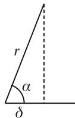

text_image

r
α
δ

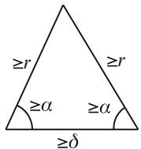

text_image

≥r
≥r
≥α
≥α
≥δ

This will, of course, lead to a contradiction, as we would then have

$$
\begin{array}{l} v \leq \operatorname{vol} M \\ \leq \operatorname{vol} \left(B (p, r) \cup B (q, r) \cup B ^ {S ^ {n - 1} - B (\overrightarrow {p q}, \alpha)} (p, D) \cup B ^ {S ^ {n - 1} - B (\overrightarrow {q p}, \alpha)} (q, D)\right) \\ \leq 4 \cdot \frac {v}{6} <   v. \\ \end{array}
$$

To see that these sets cover M; observe that if

$$
x \notin B ^ {S ^ {n - 1} - B (\overrightarrow {p q}, \alpha)} (p, D),
$$

then there is a hinge $\overline { { x p } }$ and $\overline { { p q } }$ with angle $\leq \alpha$ (see figure 12.18).

Thus, we have from Toponogov’s theorem that

$$
\cosh | x q | \leq \cosh | p q | \cosh | x p | - \sinh | p q | \sinh | x p | \cos (\alpha).
$$

If also

$$
x \notin B ^ {S ^ {n - 1} - B \left(\overrightarrow {q p}, \alpha\right)} (q, D),
$$

we have in addition,

$$
\cosh | x p | \leq \cosh | p q | \cosh | x q | - \sinh | p q | \sinh | x q | \cos (\alpha).
$$

If $| x p | > r$ and $| x q | > r$ , we get

$$
\begin{array}{l} \cosh | x q | \leq \cosh | p q | \cosh | x p | - \sinh | p q | \sinh | x p | \cos (\alpha) \\ \leq \cosh | x p | \\ + (\cosh | p q | - 1) \cosh D - \sinh | p q | \sinh r \cos (\alpha) \\ \end{array}
$$

and

$$
\begin{array}{l} \cosh | x p | \leq \cosh | x q | \\ + (\cosh | p q | - 1) \cosh D - \sinh | p q | \sinh r \cos (\alpha). \\ \end{array}
$$

# 12.6 Homotopy Finiteness

However, as $| p q | \to 0$ ; we see that the quantity

$$
\begin{array}{l} f (| p q |) = (\cosh | p q | - 1) \cosh D - \sinh | p q | \sinh r \cos (\alpha) \\ = (- \sinh r \cos \alpha) | p q | + O \left(| p q | ^ {2}\right) \\ \end{array}
$$

becomes negative. Thus, we can find $\delta \left( D , r , \alpha \right) > 0$ such that for $| p q | \leq \delta$ we have

$$
(\cosh | p q | - 1) \cosh D - \sinh | p q | \sinh r \cos (\alpha) <   0.
$$

We have then arrived at another contradiction, as this would imply

$$
\cosh | x q | <   \cosh | x p |
$$

and

$$
\cosh | x p | <   \cosh | x q |
$$

at the same time. Thus, the sets cover as we claimed. As this covering is also impossible, we are lead to the conclusion that under the assumption that $| p q | \le \delta$ ; we must have that either $p$ is ˛-regular for q or $q$ is ˛-regular for $p$ :

As it stands, this lemma seems rather strange and unmotivated. A simple analysis will, however, enable us to draw some very useful conclusions from it.

Consider the product $M \times M$ with the product metric. Geodesics in this space are of the form $( c _ { 1 } , c _ { 2 } )$ -; where both $c _ { 1 } , c _ { 2 }$ are geodesics in M: In $M \times M$ we have the diagonal $\Delta = \{ ( x , x ) \mid x \in M \}$ . Note that

$$
T _ {(p, p)} \Delta = \left\{(v, v) \mid v \in T _ {p} M \right\},
$$

and the normal bundle

$$
T _ {(p, p)} ^ {\perp} \Delta = \left\{(v, - v) \mid v \in T _ {p} M \right\}.
$$

Therefore, if $( c _ { 1 } , c _ { 2 } ) \ : \ [ a , b ] \ \to \ M \times M$ is a segment from $( p , q )$ to $\Delta$ ; then $\dot { c } _ { 1 } \left( b \right) = - \dot { c } _ { 2 } \left( b \right)$ W ! - : Thus these two segments can be joined at the common point $c _ { 1 } \left( b \right) = c _ { 2 } \left( b \right)$ to form a geodesic from $p$ to $q$ in $M .$ : This geodesic is, in fact, a Dsegment, for otherwise, we could find a shorter curve from $p$ to $q .$ : Dividing this curve in half would then produce a shorter curve from $( p , q )$ to $\Delta .$ . Thus, we have a bijective correspondence between segments from $p$ to $q$ and segments from $( p , q )$ to $\Delta$ : Moreover, ${ \sqrt { 2 } } \cdot | ( p , q ) \Delta | = | p q |$ :

 jThe above lemma implies

Corollary 12.6.3. Any point within distance $\delta / \sqrt { 2 }$ of $\Delta$ is ˛-regular for $\Delta$ :

Fig. 12.19 Critical points for diagonal and deformation   
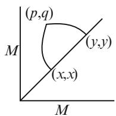

text_image

(p,q)
M
(x,x)
M
(y,y)

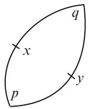

text_image

x
p
q
y

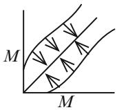

text_image

M
M

Figure 12.19 shows how the contraction onto the diagonal works and also how segments to the diagonal are related to segments in M:

Thus, we can find a curve of length $\begin{array} { r l } { \leq } & { { } \frac { 1 } { \cos \alpha } \left| \left( p , q \right) \Delta \right| } \end{array}$ from any point in this  j jneighborhood to : Moreover, this curve depends continuously on $( p , q )$ : We can translate this back into M: Namely, if $| p q | \ < \ \delta$ ; then $p$ and $q$ are joined by a curve $t \mapsto H \left( p , q , t \right) , 0 \leq t \leq 1$ j j; whose length is $\leq { \frac { \sqrt { 2 } } { \cos \alpha } } \left| p q \right|$ : Furthermore, the map $( p , q , t ) \mapsto H ( p , q , t )$ is continuous. For simplicity, we let $\begin{array} { r } { C = \frac { \sqrt { 2 } } { \cos \alpha } } \end{array}$ in the 7!constructions below.

We now have the first ingredient in our proof.

Corollary 12.6.4. $I f f _ { 0 } , f _ { 1 } : X \to M$ are two continuous maps such that

$$
\left| f _ {0} (x) f _ {1} (x) \right| <   \delta
$$

for all $x \in X$ ; then f0 and f1 are homotopy equivalent.

For the next construction, recall that a k-simplex $\Delta ^ { k }$ can be thought of as the set of affine linear combinations of all the basis vectors in $\mathbb { R } ^ { k + 1 }$ ; i.e.,

$$
\Delta^ {k} = \left\{\left(x ^ {0}, \dots , x ^ {k}\right) \mid x ^ {0} + \dots + x ^ {k} = 1 \text {   and   } x ^ {0}, \dots , x ^ {k} \in [ 0, 1 ] \right\}.
$$

The basis vectors $e _ { i } = \left( \delta _ { i } ^ { 1 } , \ldots , \delta _ { i } ^ { k } \right)$ are the vertices of the simplex.

Lemma 12.6.5. Suppose we have $k + 1$ points $p _ { 0 } , \ldots , p _ { k } \in B \left( p , r \right) \subset M . \ : I f$

$$
2 r \frac {C ^ {k} - 1}{C - 1} <   \delta ,
$$

then we can find a continuous map

$$
f: \Delta^ {k} \to B \left(p, r + 2 r \cdot C \cdot \frac {C ^ {k} - 1}{C - 1}\right),
$$

where $f \left( e _ { i } \right) = p _ { i }$

Fig. 12.20 Homotopy construction of a simplex   
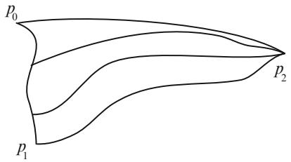

text_image

p₀
p₁
p₂

Proof. Figure 12.20 gives the essential idea of the proof. The construction is by induction on k: For $k = 0$ there is nothing to show.

DAssume that the statement holds for k and that we have $k + 2$ points $p _ { 0 } , \ldots ,$ $p _ { k + 1 } \in B \left( p , r \right)$ : First, we find a map

$$
f: \Delta^ {k} \rightarrow B (p, 2 r \cdot C \cdot \frac {C ^ {k} - 1}{C - 1} + r)
$$

with $f \left( e _ { i } \right) = p _ { i }$ for $i = p _ { 0 } , \ldots , p _ { k }$ : We then define

$$
\bar {f}: \Delta^ {k + 1} \rightarrow B (p, r + 2 r \cdot C \cdot \frac {C ^ {k + 1} - 1}{C - 1}),
$$

$$
\bar {f} \left(x ^ {0}, \ldots , x ^ {k}, x ^ {k + 1}\right) = H \left(f \left(\frac {x ^ {0}}{\sum_ {i = 1} ^ {k} x ^ {i}}, \ldots , \frac {x ^ {k}}{\sum_ {i = 1} ^ {k} x ^ {i}}\right), p _ {k + 1}, x ^ {k + 1}\right).
$$

This clearly gives a well-defined continuous map as long as

$$
\begin{array}{l} \left| p _ {k + 1} f \left(\frac {x ^ {0}}{\sum_ {i = 1} ^ {k} x ^ {i}}, \dots , \frac {x ^ {k}}{\sum_ {i = 1} ^ {k} x ^ {i}}\right) \right| \leq \left| p f \left(\frac {x ^ {0}}{\sum_ {i = 1} ^ {k} x ^ {i}}, \dots , \frac {x ^ {k}}{\sum_ {i = 1} ^ {k} x ^ {i}}\right) \right| + | p p _ {k + 1} | \\ \leq \left(2 r \cdot C \cdot \frac {C ^ {k} - 1}{C - 1} + r\right) + r \\ = 2 r \cdot \frac {C ^ {k + 1} - 1}{C - 1} \\ <   \delta . \\ \end{array}
$$

Moreover, it has the property that

$$
\left| p \bar {f} (\cdot) \right| \leq \left| p p _ {k + 1} \right| + \left| p _ {k + 1} \bar {f} (\cdot) \right|
$$

$$
\leq r + 2 r \cdot C \cdot \frac {C ^ {k + 1} - 1}{C - 1}.
$$

This concludes the induction step.

Note that if we select a face spanned by, say, $( e _ { 1 } , \ldots , e _ { k } )$ of the simplex $\Delta ^ { k }$ ; then we could, of course, construct a map in the above way by mapping $e _ { i }$ to $p _ { i }$ . The resulting map will, however, be the same as if we constructed the map on the entire simplex and restricted it to the selected face.

We can now prove finiteness of homotopy types. Observe that the class we work with is precompact in the Gromov-Hausdorff distance as we have an upper diameter bound and a lower bound for the Ricci curvature. Thus it suffices to prove

Lemma 12.6.6. There is an $\varepsilon = \varepsilon \left( n , k , v , D \right) > 0$ such that if two Riemannian n-manifolds $( M , g _ { 1 } )$ and $( N , g _ { 2 } )$ Dsatisfy

$$
\mathrm{diam} \leq D,
$$

$$
\operatorname{vol} \geq v,
$$

$$
\sec \geq - k ^ {2},
$$

and

$$
d _ {G - H} (M, N) <   \varepsilon ,
$$

then they are homotopy equivalent.

Proof. Suppose M and N are given as in the lemma, together with a metric on M N; [inside which the two spaces are " Hausdorff close. The size of " will be found through the construction.

First, triangulate both manifolds in such a way that any simplex of the triangulation lies in a ball of radius ": Using the triangulation on M; we can construct a continuous map $f : M \to N$ as follows. First use the Hausdorff approximation Wto map all the vertices $\{ p _ { i } \} \subset M$ of the triangulation to points $\{ q _ { i } \} \subset N$ such that $| p _ { i } q _ { i } | \ < \ \varepsilon$ . If $( p _ { i _ { 0 } } , \ldots , p _ { i _ { n } } )$ f g forms a simplex in the triangulation of M; then j jby the choice of the triangulation $\{ p _ { i _ { 0 } } , \dots , p _ { i _ { n } } \} \subset B \left( x , \varepsilon \right)$ for some $x \in M$ : Thus $\{ q _ { i _ { 0 } } , \dots , q _ { i _ { n } } \} \subset B \left( q _ { i _ { 0 } } , { 4 \varepsilon } \right)$ f. Therefore, if

$$
8 \varepsilon \frac {C ^ {n} - 1}{C - 1} <   \delta ,
$$

then lemma 12.6.5 can be used to define f on the simplex spanned by $( p _ { i _ { 0 } } , \ldots , p _ { i _ { n } } )$ . In this way we get a map $f : { \cal M }  { \cal N }$ by constructing it on each simplex as W !just described. To see that it is continuous, we must check that the construction agrees on common faces of simplices. But this follows as the construction is natural with respect to restriction to faces of simplices. We need to estimate how good a Hausdorff approximation f is. To this end, select $x \in M$ and suppose that it lies in the face spanned by the vertices $( p _ { i _ { 0 } } , \ldots , p _ { i _ { n } } )$ 2 : Then we have

$$
| x f (x) | \leq | x p _ {i _ {0}} | + | p _ {i _ {0}} f (x) |
$$

$$
\leq 2 \varepsilon + \varepsilon + | q _ {i _ {0}} f (x) |
$$

# 12.6 Homotopy Finiteness

$$
\begin{array}{l} \leq 3 \varepsilon + 4 \varepsilon + 8 \varepsilon \cdot C \cdot \frac {C ^ {n} - 1}{C - 1} \\ = 7 \varepsilon + 8 \varepsilon \cdot C \cdot \frac {C ^ {n} - 1}{C - 1}. \\ \end{array}
$$

We can construct $g : N \to M$ in the same manner. This map will, of course, also satisfy

$$
| y g (y) | \leq 7 \varepsilon + 8 \varepsilon \cdot C \cdot \frac {C ^ {n} - 1}{C - 1}.
$$

It is now possible to estimate how close the compositions f g and $g \circ f$ are to the identity maps on N and M; respectively, as follows:

$$
\begin{array}{l} | y f \circ g (y) | \leq | y g (y) | + | g (y) f \circ g (y) | \\ \leq 1 4 \varepsilon + 1 6 \varepsilon \cdot C \cdot \frac {C ^ {n} - 1}{C - 1}; \\ | x g \circ f (x) | \leq 1 4 \varepsilon + 1 6 \varepsilon \cdot C \cdot \frac {C ^ {n} - 1}{C - 1}. \\ \end{array}
$$

As long as

$$
1 4 \varepsilon + 1 6 \varepsilon \cdot C \cdot \frac {C ^ {n} - 1}{C - 1} <   \delta ,
$$

we can then conclude that these compositions are homotopy equivalent to the respective identity maps. In particular, the two spaces are homotopy equivalent.

Note that as long as

$$
1 4 \varepsilon + 1 6 \varepsilon \cdot \frac {C ^ {n + 1} - 1}{C - 1} <   \delta ,
$$

the two spaces are homotopy equivalent. Thus, " depends in an explicit way on $\begin{array} { r } { C = \frac { \sqrt { 2 } } { \cos \alpha } } \end{array}$ and ı: It is possible, in turn, to estimate ˛ and ı from $n , k , v$ ; and D: Thus D  there is an explicit estimate for how close spaces must be to ensure that they are homotopy equivalent. Given this explicit "; it is then possible, using our work from section 11.1.4 to find an explicit estimate for the number of homotopy types.

To conclude, let us compare the three finiteness theorems by Cheeger, Gromov, and Grove-Petersen. There are inclusions of classes of closed Riemannian nmanifolds

$$
\left\{ \begin{array}{l} \text {diam} \leq D \\ \text {sec} \quad \geq - k ^ {2} \end{array} \right\} \supset \left\{ \begin{array}{l} \text {diam} \leq D \\ \text {vol} \quad \geq v \\ \text {sec} \quad \geq - k ^ {2} \end{array} \right\} \supset \left\{ \begin{array}{l} \text {diam} \leq D \\ \text {vol} \quad \geq v \\ | \text {sec} | \leq k ^ {2} \end{array} \right\}
$$

with strengthening of conclusions from bounded Betti numbers to finitely many homotopy types to compactness in the $C ^ { 1 , \alpha }$ topology. In the special case of nonnegative curvature Gromov’s estimate actually doesn’t depend on the diameter, thus yielding obstructions to the existence of such metrics on manifolds with complicated topology. For the other two results the diameter bound is still necessary. Consider for instance the family of lens spaces $\left\{ S ^ { 3 } / \mathbb { Z } _ { p } \right\}$ with curvature  1: Now Drescale these metrics so that they all have the same volume. Then we get a class which contains infinitely many homotopy types and also satisfies

$$
\operatorname{vol} = v,
$$

$$
1 \geq \sec > 0.
$$

The family of lens spaces $\left\{ S ^ { 3 } / \mathbb { Z } _ { p } \right\}$ with curvature  1 also shows that the lower Dvolume bound is necessary in both of these theorems.

Some further improvements are possible in the conclusion of the homotopy finiteness result. Namely, one can strengthen the conclusion to state that the class contains finitely many homeomorphism types. This was proved for $n \neq 3$ in [59] ¤and in a more general case in [85]. One can also prove many of the above results for manifolds with certain types of integral curvature bounds, see for instance [91] and [88]. The volume [54] also contains complete discussions of generalizations to the case where one has merely Ricci curvature bounds.

# 12.7 Further Study

There are many texts that partially cover or expand the material in this chapter. We wish to attract attention to the surveys by Grove in [51], by Abresch-Meyer, Colding, Greene, and Zhu in [54], by Cheeger in [28], and by Karcher in [32]. The most glaring omission from this chapter is probably that of the Abresch-Gromoll theorem and other uses of the excess function. The above-mentioned articles by Zhu and Cheeger cover this material quite well.

# 12.8 Exercises

EXERCISE 12.8.1. Let .M; g/ be a closed simply connected positively curved manifold. Show that if M contains a totally geodesic closed hypersurface, then M is homeomorphic to a sphere. Hint: first show that the hypersurface is orientable, and then show that the signed distance function to this hypersurface has only two critical points - a maximum and a minimum. This also shows that it suffices to assume that $H ^ { 1 } \left( M , \mathbb { Z } _ { 2 } \right) = 0$ :

# 12.8 Exercises

EXERCISE 12.8.2. Let $( M , g )$ be a complete noncompact manifold with sec $\geq 0$ and soul $S \subset M$ .

(1) Show that if $X \in T S$ and $V \in T ^ { \bot } S$ , then sec $( X , V ) = 0$   
2 2 D(2) Show that if the soul has codimension 1 and trivial normal bundle, then $( M , g ) = \bigl ( S \times \mathbb { R } , g _ { S } + d r ^ { 2 } \bigr )$ .   
D - C(3) Show that if the soul has codimension 1 and nontrivial normal bundle, then a double cover splits as in (2).

EXERCISE 12.8.3. Show that the solution to

$$
\ddot {\zeta} = - (1 + \varepsilon) \zeta ,
$$

$$
\zeta (0) = \psi (0) > 0,
$$

$$
\dot {\zeta} (0) = \dot {\psi} (0) > 0.
$$

is given by

$$
\zeta (t) = \sqrt {(\psi (0)) ^ {2} + \frac {(\dot {\psi} (0)) ^ {2}}{1 + \varepsilon}} \cdot \sin \left(\sqrt {1 + \varepsilon} \cdot t + \arctan \left(\frac {\psi (0) \cdot \sqrt {1 + \varepsilon}}{\dot {\psi} (0)}\right)\right).
$$

EXERCISE 12.8.4. Show that the converse of Toponogov’s theorem is also true. In other words, if for some k the conclusion to Toponogov’s theorem holds when hinges (or triangles) are compared to the same objects in $S _ { k } ^ { 2 }$ ; then $\sec \geq k$ :

EXERCISE 12.8.5. Let $( M , g )$ be a complete Riemannian manifold. Show that if all sectional curvatures on $B \left( p , 2 R \right)$ are $\geq k$ , then Toponogov’s comparison theorem holds for hinges and triangles in $B \left( p , R \right)$ .

EXERCISE 12.8.6. Let $( M , g )$ be a complete Riemannian manifold with sec $\geq k .$ . Consider $f ( x ) = | x q | - | x p |$ and assume that both $| x q |$ and $| x p |$ are smooth at x. D j j  j j jShow that Toponogov’s theorem can be used to bound $| \nabla f | \mid _ { \lambda }$ j jfrom below in terms of the distance from x to a segment from q to $p .$ .

EXERCISE 12.8.7 (HEINTZE AND KARCHER). Let $c \subset ( M , g )$ be a geodesic in a Riemannian n-manifold with sec $\ge - k ^ { 2 }$ : Let $T \left( c , R \right)$ be the normal tube around $c$  of radius R; i.e., the set of points in M that can be joined to c by a segment of length $\le \ R$ that is perpendicular to $c .$ : The last condition is superfluous when $c$ is a closed geodesic, but if it is a loop or a segment, then not all points in M within distance R of c will belong to this tube. On this tube introduce coordinates $( r , s , \theta )$ ; where r denotes the distance to c; s is the arclength parameter on $^ { c , }$ and $\theta ~ = ~ \left( \theta ^ { 1 } , \ldots , \theta ^ { n - 2 } \right)$ are spherical coordinates normal to $c .$ These give adapted Dcoordinates for the distance r to c: Show that as $r \to 0$ the metric looks like

$$
g (r) = \left( \begin{array}{c c c c c} 1 & 0 & 0 & \dots & 0 \\ 0 & 1 & 0 & \dots & 0 \\ 0 & 0 & 0 & \dots & 0 \\ \vdots & \vdots & \vdots & \ddots & \vdots \\ 0 & 0 & 0 & \dots & 0 \end{array} \right) + \left( \begin{array}{c c c c c} 0 & 0 & 0 & \dots & 0 \\ 0 & 0 & 0 & \dots & 0 \\ 0 & 0 & 1 & \dots & 0 \\ \vdots & \vdots & \vdots & \ddots & \vdots \\ 0 & 0 & 0 & \dots & 1 \end{array} \right) \cdot r ^ {2} + O (r ^ {3})
$$

Using the lower sectional curvature bound, find an upper bound for the volume density on this tube. Conclude that

$$
\operatorname{vol} T (c, R) \leq f (n, k, R, L (c)),
$$

for some continuous function f depending on dimension, lower curvature bound, radius, and length of c: Moreover, as $L ( c )  0 , f  0$ : Use this estimate to prove ! !lemmas 11.4.9 and 12.6.2. This shows that Toponogov’s theorem is not needed for the latter result.

EXERCISE 12.8.8. Show that any vector bundle over a 2-sphere admits a complete metric of nonnegative sectional curvature. Hint: You need to know something about the classification of vector bundles over spheres. In this case k-dimensional vector bundles are classified by homotopy classes of maps from $S ^ { 1 }$ ; the equator of the 2-sphere, into SO .k/ : This is the same as $\pi _ { 1 } \left( S O \left( k \right) \right)$ ; so there is only one 1-dimensional bundle, the 2-dimensional bundles are parametrized by Z; and for $k > 2$ there are two k-dimensional bundles.

EXERCISE 12.8.9. Use Toponogov’s theorem to show that $b _ { c }$ is convex when sec $\geq 0$ :